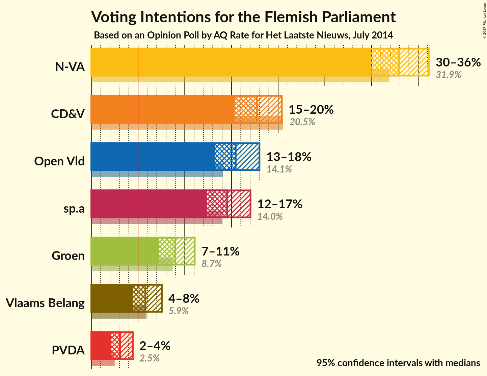
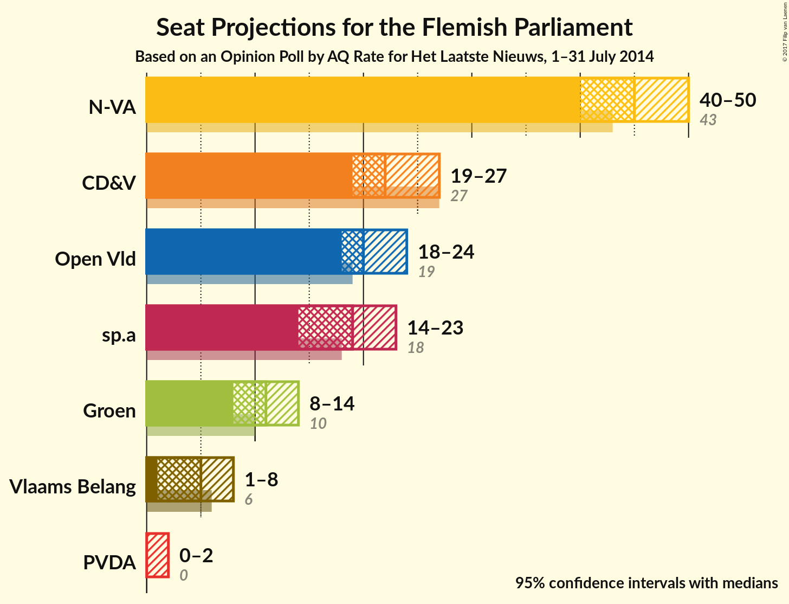
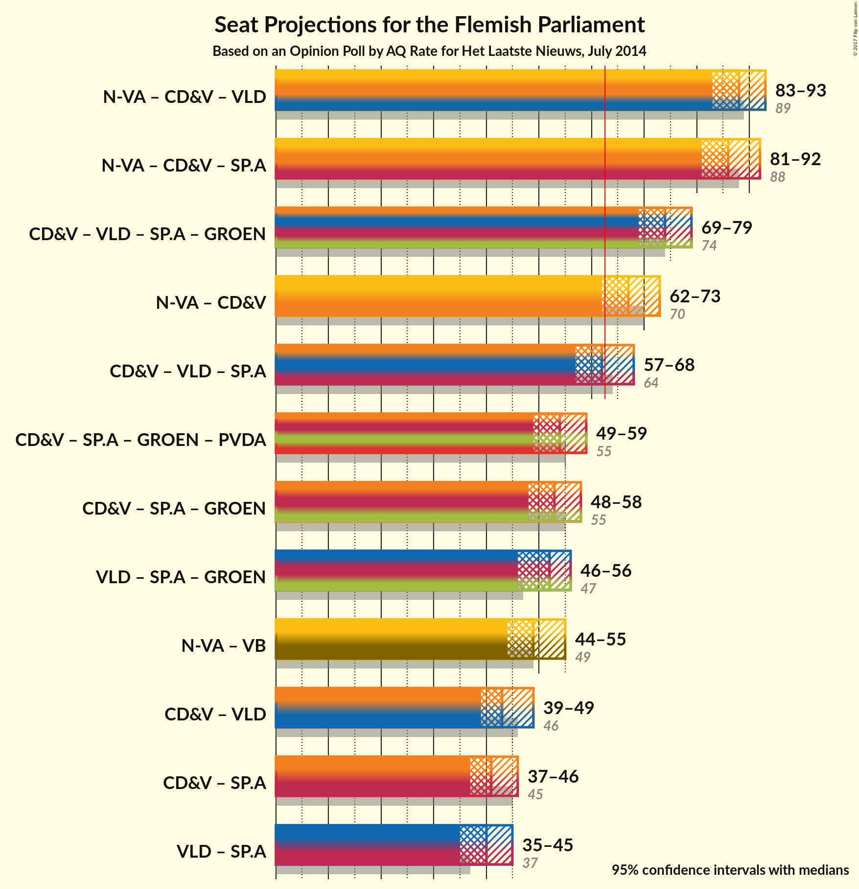

# Opinion Poll by AQ Rate for Het Laatste Nieuws, July 2014

<a href="#voting-intentions">Voting Intentions</a> | <a href="#seats">Seats</a> | <a href="#coalitions">Coalitions</a> | <a href="#technical-information">Technical Information</a>

## Voting Intentions

### Confidence Intervals

| Party | Last Result | Poll Result | 80% Confidence Interval | 90% Confidence Interval | 95% Confidence Interval | 99% Confidence Interval |
|:-----:|:-----------:|:-----------:|:-----------------------:|:-----------------------:|:-----------------------:|:-----------------------:|
| N-VA | 31.9% | 33.0% | 31.0–35.0% |30.4–35.6% |29.9–36.1% |29.0–37.1% |
| CD&V | 20.5% | 17.7% | 16.2–19.5% |15.7–20.0% |15.3–20.4% |14.6–21.3% |
| Open Vld | 14.1% | 15.5% | 14.0–17.1% |13.6–17.6% |13.2–18.0% |12.5–18.8% |
| sp.a | 14.0% | 14.5% | 13.1–16.2% |12.7–16.6% |12.4–17.0% |11.7–17.8% |
| Groen | 8.7% | 9.0% | 7.8–10.3% |7.5–10.7% |7.3–11.1% |6.8–11.7% |
| Vlaams Belang | 5.9% | 5.8% | 4.9–6.9% |4.6–7.3% |4.4–7.5% |4.0–8.1% |
| PVDA | 2.5% | 3.1% | 2.4–4.0% |2.3–4.2% |2.1–4.4% |1.8–4.9% |

*Note:* The poll result column reflects the actual value used in the calculations. Published results may vary slightly, and in addition be rounded to fewer digits.

## Seats

### Confidence Intervals

| Party | Last Result | Median | 80% Confidence Interval | 90% Confidence Interval | 95% Confidence Interval | 99% Confidence Interval |
|:-----:|:-----------:|:------:|:-----------------------:|:-----------------------:|:-----------------------:|:-----------------------:|
| <a href="#n-va">N-VA</a> | 43 | 45 | 42–48 |41–48 |40–50 |38–52 |
| <a href="#cd&v">CD&V</a> | 27 | 22 | 20–26 |20–27 |19–27 |18–28 |
| <a href="#open-vld">Open Vld</a> | 19 | 20 | 19–23 |19–24 |18–24 |16–26 |
| <a href="#sp.a">sp.a</a> | 18 | 19 | 17–21 |15–22 |14–23 |14–24 |
| <a href="#groen">Groen</a> | 10 | 11 | 10–14 |9–14 |8–14 |7–16 |
| <a href="#vlaams-belang">Vlaams Belang</a> | 6 | 5 | 3–8 |2–8 |1–8 |0–8 |
| <a href="#pvda">PVDA</a> | 0 | 0 | 0–2 |0–2 |0–2 |0–2 |

### N-VA

| Number of Seats | Probability | Accumulated | Special Marks |
|:---------------:|:-----------:|:-----------:|:-------------:|
| 37 | 0.1% | 100% |  |
| 38 | 0.5% | 99.9% |  |
| 39 | 2% | 99.4% |  |
| 40 | 2% | 98% |  |
| 41 | 4% | 95% |  |
| 42 | 7% | 92% |  |
| 43 | 18% | 84% | Last Result |
| 44 | 14% | 66% |  |
| 45 | 17% | 52% | Median |
| 46 | 15% | 34% |  |
| 47 | 9% | 19% |  |
| 48 | 6% | 10% |  |
| 49 | 2% | 4% |  |
| 50 | 2% | 3% |  |
| 51 | 0.5% | 1.1% |  |
| 52 | 0.4% | 0.6% |  |
| 53 | 0.1% | 0.2% |  |
| 54 | 0% | 0% |  |

### CD&V

| Number of Seats | Probability | Accumulated | Special Marks |
|:---------------:|:-----------:|:-----------:|:-------------:|
| 16 | 0.1% | 100% |  |
| 17 | 0.2% | 99.9% |  |
| 18 | 0.5% | 99.7% |  |
| 19 | 2% | 99.3% |  |
| 20 | 13% | 97% |  |
| 21 | 32% | 83% |  |
| 22 | 12% | 51% | Median |
| 23 | 8% | 40% |  |
| 24 | 8% | 32% |  |
| 25 | 9% | 24% |  |
| 26 | 6% | 15% |  |
| 27 | 8% | 9% | Last Result |
| 28 | 0.3% | 0.5% |  |
| 29 | 0.1% | 0.2% |  |
| 30 | 0.1% | 0.1% |  |
| 31 | 0% | 0% |  |

### Open Vld

| Number of Seats | Probability | Accumulated | Special Marks |
|:---------------:|:-----------:|:-----------:|:-------------:|
| 13 | 0% | 100% |  |
| 14 | 0.1% | 99.9% |  |
| 15 | 0.2% | 99.9% |  |
| 16 | 0.2% | 99.7% |  |
| 17 | 0.6% | 99.4% |  |
| 18 | 2% | 98.9% |  |
| 19 | 20% | 97% | Last Result |
| 20 | 30% | 77% | Median |
| 21 | 13% | 47% |  |
| 22 | 14% | 35% |  |
| 23 | 15% | 20% |  |
| 24 | 3% | 5% |  |
| 25 | 1.1% | 2% |  |
| 26 | 0.7% | 1.1% |  |
| 27 | 0.3% | 0.4% |  |
| 28 | 0.1% | 0.1% |  |
| 29 | 0% | 0% |  |

### sp.a

| Number of Seats | Probability | Accumulated | Special Marks |
|:---------------:|:-----------:|:-----------:|:-------------:|
| 14 | 3% | 100% |  |
| 15 | 3% | 97% |  |
| 16 | 2% | 94% |  |
| 17 | 4% | 92% |  |
| 18 | 11% | 88% | Last Result |
| 19 | 57% | 76% | Median |
| 20 | 7% | 19% |  |
| 21 | 3% | 12% |  |
| 22 | 4% | 9% |  |
| 23 | 3% | 5% |  |
| 24 | 2% | 2% |  |
| 25 | 0.2% | 0.3% |  |
| 26 | 0% | 0.1% |  |
| 27 | 0% | 0% |  |

### Groen

| Number of Seats | Probability | Accumulated | Special Marks |
|:---------------:|:-----------:|:-----------:|:-------------:|
| 6 | 0% | 100% |  |
| 7 | 2% | 99.9% |  |
| 8 | 2% | 98% |  |
| 9 | 4% | 97% |  |
| 10 | 39% | 93% | Last Result |
| 11 | 12% | 55% | Median |
| 12 | 6% | 43% |  |
| 13 | 7% | 37% |  |
| 14 | 28% | 30% |  |
| 15 | 2% | 2% |  |
| 16 | 0.4% | 0.5% |  |
| 17 | 0.1% | 0.1% |  |
| 18 | 0% | 0% |  |

### Vlaams Belang

| Number of Seats | Probability | Accumulated | Special Marks |
|:---------------:|:-----------:|:-----------:|:-------------:|
| 0 | 1.3% | 100% |  |
| 1 | 2% | 98.7% |  |
| 2 | 3% | 97% |  |
| 3 | 14% | 94% |  |
| 4 | 30% | 80% |  |
| 5 | 8% | 50% | Median |
| 6 | 27% | 42% | Last Result |
| 7 | 5% | 16% |  |
| 8 | 11% | 11% |  |
| 9 | 0% | 0.1% |  |
| 10 | 0% | 0% |  |

### PVDA

| Number of Seats | Probability | Accumulated | Special Marks |
|:---------------:|:-----------:|:-----------:|:-------------:|
| 0 | 61% | 100% | Last Result, Median |
| 1 | 15% | 39% |  |
| 2 | 24% | 24% |  |
| 3 | 0.2% | 0.2% |  |
| 4 | 0% | 0.1% |  |
| 5 | 0% | 0% |  |

## Coalitions

### Confidence Intervals

| Coalition | Last Result | Median | 80% Confidence Interval | 90% Confidence Interval | 95% Confidence Interval | 99% Confidence Interval |
|:---------:|:-----------:|:------:|:-----------------------:|:-----------------------:|:-----------------------:|:-----------------------:|
| N-VA – CD&V – Open Vld | 89 | 88 | 84–92 | 83–93 | 83–93 | 81–95 |
| N-VA – CD&V – sp.a | 88 | 86 | 83–90 | 82–91 | 81–92 | 79–93 |
| CD&V – Open Vld – sp.a – Groen | 74 | 74 | 70–77 | 69–78 | 69–79 | 67–81 |
| N-VA – CD&V | 70 | 67 | 64–71 | 63–72 | 62–73 | 60–74 |
| CD&V – Open Vld – sp.a | 64 | 62 | 59–66 | 58–67 | 57–68 | 55–69 |
| CD&V – sp.a – Groen – PVDA | 55 | 54 | 51–57 | 50–58 | 49–59 | 47–60 |
| CD&V – sp.a – Groen | 55 | 53 | 50–56 | 49–57 | 48–58 | 46–60 |
| Open Vld – sp.a – Groen | 47 | 52 | 48–55 | 47–56 | 46–56 | 44–58 |
| N-VA – Vlaams Belang | 49 | 49 | 46–53 | 45–54 | 44–55 | 43–56 |
| CD&V – Open Vld | 46 | 43 | 40–47 | 39–48 | 39–49 | 38–50 |
| CD&V – sp.a | 45 | 41 | 39–45 | 38–46 | 37–46 | 35–48 |
| Open Vld – sp.a | 37 | 40 | 37–42 | 36–44 | 35–45 | 33–47 |

### N-VA – CD&V – Open Vld

| Number of Seats | Probability | Accumulated | Special Marks |
|:---------------:|:-----------:|:-----------:|:-------------:|
| 79 | 0% | 100% |  |
| 80 | 0.1% | 99.9% |  |
| 81 | 0.5% | 99.8% |  |
| 82 | 1.2% | 99.3% |  |
| 83 | 4% | 98% |  |
| 84 | 5% | 94% |  |
| 85 | 7% | 88% |  |
| 86 | 12% | 81% |  |
| 87 | 15% | 69% | Median |
| 88 | 15% | 54% |  |
| 89 | 10% | 39% | Last Result |
| 90 | 10% | 29% |  |
| 91 | 6% | 19% |  |
| 92 | 7% | 12% |  |
| 93 | 3% | 6% |  |
| 94 | 1.4% | 2% |  |
| 95 | 0.6% | 1.0% |  |
| 96 | 0.3% | 0.4% |  |
| 97 | 0.1% | 0.1% |  |
| 98 | 0% | 0% |  |

### N-VA – CD&V – sp.a

| Number of Seats | Probability | Accumulated | Special Marks |
|:---------------:|:-----------:|:-----------:|:-------------:|
| 77 | 0.1% | 100% |  |
| 78 | 0.2% | 99.9% |  |
| 79 | 0.6% | 99.7% |  |
| 80 | 1.1% | 99.1% |  |
| 81 | 2% | 98% |  |
| 82 | 5% | 96% |  |
| 83 | 10% | 91% |  |
| 84 | 11% | 80% |  |
| 85 | 11% | 70% |  |
| 86 | 16% | 58% | Median |
| 87 | 14% | 42% |  |
| 88 | 10% | 28% | Last Result |
| 89 | 6% | 18% |  |
| 90 | 6% | 12% |  |
| 91 | 3% | 6% |  |
| 92 | 2% | 3% |  |
| 93 | 0.5% | 0.7% |  |
| 94 | 0.1% | 0.2% |  |
| 95 | 0% | 0.1% |  |
| 96 | 0% | 0% |  |

### CD&V – Open Vld – sp.a – Groen

| Number of Seats | Probability | Accumulated | Special Marks |
|:---------------:|:-----------:|:-----------:|:-------------:|
| 64 | 0% | 100% |  |
| 65 | 0.1% | 99.9% |  |
| 66 | 0.1% | 99.9% |  |
| 67 | 0.4% | 99.7% |  |
| 68 | 1.3% | 99.3% |  |
| 69 | 3% | 98% |  |
| 70 | 5% | 95% |  |
| 71 | 8% | 90% |  |
| 72 | 10% | 82% | Median |
| 73 | 17% | 72% |  |
| 74 | 16% | 55% | Last Result |
| 75 | 15% | 40% |  |
| 76 | 10% | 25% |  |
| 77 | 6% | 15% |  |
| 78 | 5% | 8% |  |
| 79 | 2% | 3% |  |
| 80 | 0.9% | 1.4% |  |
| 81 | 0.4% | 0.5% |  |
| 82 | 0.1% | 0.1% |  |
| 83 | 0% | 0% |  |

### N-VA – CD&V

| Number of Seats | Probability | Accumulated | Special Marks |
|:---------------:|:-----------:|:-----------:|:-------------:|
| 58 | 0.1% | 100% |  |
| 59 | 0.2% | 99.9% |  |
| 60 | 0.4% | 99.8% |  |
| 61 | 1.0% | 99.4% |  |
| 62 | 2% | 98% |  |
| 63 | 5% | 96% | Majority |
| 64 | 12% | 92% |  |
| 65 | 9% | 79% |  |
| 66 | 14% | 70% |  |
| 67 | 14% | 56% | Median |
| 68 | 14% | 43% |  |
| 69 | 9% | 28% |  |
| 70 | 7% | 20% | Last Result |
| 71 | 5% | 13% |  |
| 72 | 4% | 8% |  |
| 73 | 3% | 4% |  |
| 74 | 0.6% | 1.1% |  |
| 75 | 0.3% | 0.4% |  |
| 76 | 0.1% | 0.2% |  |
| 77 | 0.1% | 0.1% |  |
| 78 | 0% | 0% |  |

### CD&V – Open Vld – sp.a

| Number of Seats | Probability | Accumulated | Special Marks |
|:---------------:|:-----------:|:-----------:|:-------------:|
| 54 | 0.2% | 100% |  |
| 55 | 0.4% | 99.8% |  |
| 56 | 0.6% | 99.4% |  |
| 57 | 2% | 98.8% |  |
| 58 | 5% | 97% |  |
| 59 | 10% | 92% |  |
| 60 | 11% | 83% |  |
| 61 | 13% | 72% | Median |
| 62 | 12% | 58% |  |
| 63 | 13% | 46% | Majority |
| 64 | 9% | 33% | Last Result |
| 65 | 10% | 24% |  |
| 66 | 7% | 13% |  |
| 67 | 3% | 7% |  |
| 68 | 2% | 3% |  |
| 69 | 0.8% | 1.3% |  |
| 70 | 0.3% | 0.5% |  |
| 71 | 0.1% | 0.2% |  |
| 72 | 0.1% | 0.1% |  |
| 73 | 0% | 0% |  |

### CD&V – sp.a – Groen – PVDA

| Number of Seats | Probability | Accumulated | Special Marks |
|:---------------:|:-----------:|:-----------:|:-------------:|
| 45 | 0.1% | 100% |  |
| 46 | 0.2% | 99.8% |  |
| 47 | 0.7% | 99.6% |  |
| 48 | 0.9% | 98.9% |  |
| 49 | 3% | 98% |  |
| 50 | 5% | 95% |  |
| 51 | 13% | 90% |  |
| 52 | 9% | 77% | Median |
| 53 | 13% | 68% |  |
| 54 | 20% | 55% |  |
| 55 | 14% | 35% | Last Result |
| 56 | 8% | 21% |  |
| 57 | 5% | 13% |  |
| 58 | 3% | 8% |  |
| 59 | 3% | 4% |  |
| 60 | 1.1% | 1.5% |  |
| 61 | 0.3% | 0.4% |  |
| 62 | 0.1% | 0.1% |  |
| 63 | 0% | 0% | Majority |

### CD&V – sp.a – Groen

| Number of Seats | Probability | Accumulated | Special Marks |
|:---------------:|:-----------:|:-----------:|:-------------:|
| 44 | 0.1% | 100% |  |
| 45 | 0.2% | 99.9% |  |
| 46 | 0.3% | 99.7% |  |
| 47 | 1.0% | 99.4% |  |
| 48 | 2% | 98% |  |
| 49 | 5% | 97% |  |
| 50 | 7% | 92% |  |
| 51 | 16% | 85% |  |
| 52 | 10% | 69% | Median |
| 53 | 16% | 59% |  |
| 54 | 19% | 44% |  |
| 55 | 9% | 25% | Last Result |
| 56 | 7% | 15% |  |
| 57 | 4% | 9% |  |
| 58 | 3% | 5% |  |
| 59 | 2% | 2% |  |
| 60 | 0.4% | 0.6% |  |
| 61 | 0.2% | 0.2% |  |
| 62 | 0% | 0% |  |

### Open Vld – sp.a – Groen

| Number of Seats | Probability | Accumulated | Special Marks |
|:---------------:|:-----------:|:-----------:|:-------------:|
| 42 | 0% | 100% |  |
| 43 | 0.3% | 99.9% |  |
| 44 | 0.7% | 99.7% |  |
| 45 | 0.8% | 99.0% |  |
| 46 | 2% | 98% |  |
| 47 | 4% | 97% | Last Result |
| 48 | 10% | 93% |  |
| 49 | 10% | 83% |  |
| 50 | 8% | 73% | Median |
| 51 | 13% | 64% |  |
| 52 | 16% | 51% |  |
| 53 | 15% | 35% |  |
| 54 | 8% | 19% |  |
| 55 | 6% | 12% |  |
| 56 | 4% | 6% |  |
| 57 | 1.4% | 2% |  |
| 58 | 0.5% | 0.8% |  |
| 59 | 0.2% | 0.3% |  |
| 60 | 0.1% | 0.1% |  |
| 61 | 0% | 0% |  |

### N-VA – Vlaams Belang

| Number of Seats | Probability | Accumulated | Special Marks |
|:---------------:|:-----------:|:-----------:|:-------------:|
| 41 | 0.1% | 100% |  |
| 42 | 0.2% | 99.9% |  |
| 43 | 0.9% | 99.7% |  |
| 44 | 2% | 98.8% |  |
| 45 | 3% | 97% |  |
| 46 | 7% | 94% |  |
| 47 | 9% | 88% |  |
| 48 | 13% | 78% |  |
| 49 | 16% | 66% | Last Result |
| 50 | 16% | 50% | Median |
| 51 | 15% | 34% |  |
| 52 | 7% | 19% |  |
| 53 | 5% | 12% |  |
| 54 | 4% | 7% |  |
| 55 | 2% | 3% |  |
| 56 | 0.5% | 0.8% |  |
| 57 | 0.2% | 0.3% |  |
| 58 | 0.1% | 0.1% |  |
| 59 | 0.1% | 0.1% |  |
| 60 | 0% | 0% |  |

### CD&V – Open Vld

| Number of Seats | Probability | Accumulated | Special Marks |
|:---------------:|:-----------:|:-----------:|:-------------:|
| 35 | 0% | 100% |  |
| 36 | 0.1% | 99.9% |  |
| 37 | 0.3% | 99.9% |  |
| 38 | 0.9% | 99.6% |  |
| 39 | 4% | 98.7% |  |
| 40 | 9% | 95% |  |
| 41 | 15% | 85% |  |
| 42 | 11% | 70% | Median |
| 43 | 14% | 59% |  |
| 44 | 12% | 45% |  |
| 45 | 9% | 33% |  |
| 46 | 11% | 24% | Last Result |
| 47 | 6% | 12% |  |
| 48 | 3% | 7% |  |
| 49 | 2% | 4% |  |
| 50 | 1.5% | 2% |  |
| 51 | 0.2% | 0.3% |  |
| 52 | 0.1% | 0.1% |  |
| 53 | 0% | 0% |  |

### CD&V – sp.a

| Number of Seats | Probability | Accumulated | Special Marks |
|:---------------:|:-----------:|:-----------:|:-------------:|
| 34 | 0.2% | 100% |  |
| 35 | 0.8% | 99.7% |  |
| 36 | 1.3% | 99.0% |  |
| 37 | 3% | 98% |  |
| 38 | 5% | 95% |  |
| 39 | 13% | 90% |  |
| 40 | 20% | 78% |  |
| 41 | 15% | 58% | Median |
| 42 | 9% | 43% |  |
| 43 | 10% | 34% |  |
| 44 | 10% | 24% |  |
| 45 | 6% | 14% | Last Result |
| 46 | 6% | 8% |  |
| 47 | 1.4% | 2% |  |
| 48 | 0.5% | 0.9% |  |
| 49 | 0.3% | 0.4% |  |
| 50 | 0.1% | 0.1% |  |
| 51 | 0% | 0% |  |

### Open Vld – sp.a

| Number of Seats | Probability | Accumulated | Special Marks |
|:---------------:|:-----------:|:-----------:|:-------------:|
| 32 | 0.1% | 100% |  |
| 33 | 0.5% | 99.9% |  |
| 34 | 1.5% | 99.4% |  |
| 35 | 2% | 98% |  |
| 36 | 2% | 96% |  |
| 37 | 5% | 94% | Last Result |
| 38 | 20% | 89% |  |
| 39 | 19% | 69% | Median |
| 40 | 13% | 51% |  |
| 41 | 14% | 37% |  |
| 42 | 13% | 23% |  |
| 43 | 4% | 10% |  |
| 44 | 3% | 6% |  |
| 45 | 2% | 3% |  |
| 46 | 0.8% | 1.3% |  |
| 47 | 0.4% | 0.5% |  |
| 48 | 0.1% | 0.2% |  |
| 49 | 0% | 0% |  |

## Technical Information

### Opinion Poll

+ **Pollster:** AQ Rate
+ **Media:** Het Laatste Nieuws
+ **Fieldwork period:** July 2014

### Calculations

+ **Sample size:** 880
+ **Simulations done:** 2,097,152
+ **Error estimate:** 1.33%

