# Opinion Poll by Dedicated for RTBf–La Libre Belgique, 5–9 September 2014

<a href="#voting-intentions">Voting Intentions</a> | <a href="#seats">Seats</a> | <a href="#coalitions">Coalitions</a> | <a href="#technical-information">Technical Information</a>

## Voting Intentions

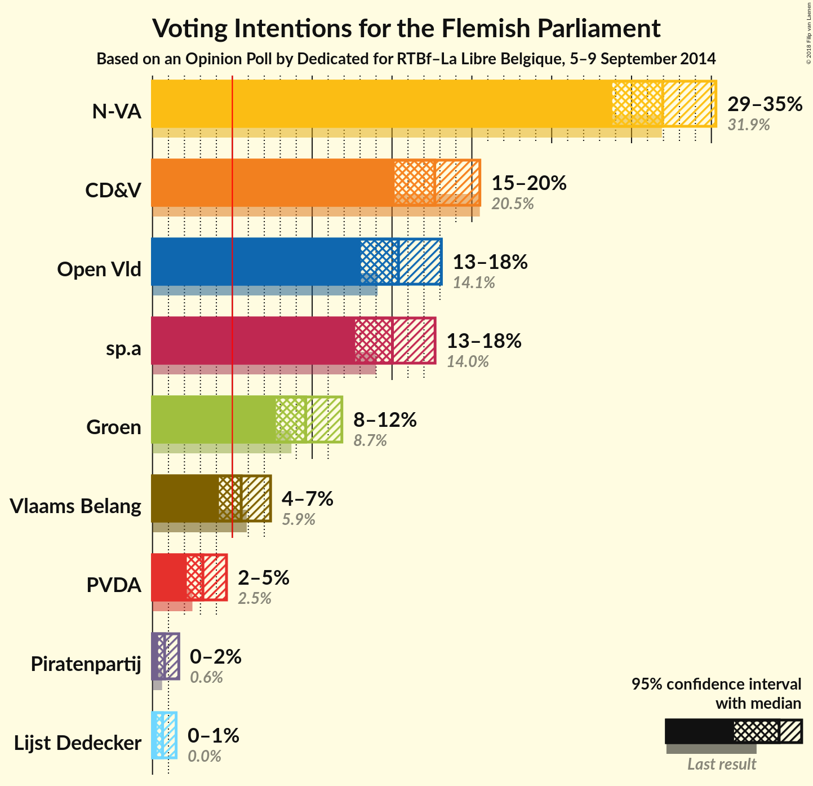

### Confidence Intervals

| Party | Last Result | Poll Result | 80% Confidence Interval | 90% Confidence Interval | 95% Confidence Interval | 99% Confidence Interval |
|:-----:|:-----------:|:-----------:|:-----------------------:|:-----------------------:|:-----------------------:|:-----------------------:|
| N-VA | 31.9% | 31.9% | 29.9–34.1% |29.3–34.8% |28.8–35.3% |27.8–36.3% |
| CD&V | 20.5% | 17.7% | 16.0–19.5% |15.6–20.0% |15.2–20.5% |14.4–21.4% |
| Open Vld | 14.1% | 15.4% | 13.9–17.2% |13.4–17.7% |13.0–18.1% |12.3–19.0% |
| sp.a | 14.0% | 15.0% | 13.5–16.8% |13.1–17.3% |12.7–17.7% |12.0–18.5% |
| Groen | 8.7% | 9.6% | 8.4–11.1% |8.0–11.5% |7.7–11.9% |7.2–12.6% |
| Vlaams Belang | 5.9% | 5.6% | 4.6–6.8% |4.4–7.1% |4.2–7.4% |3.8–8.0% |
| PVDA | 2.5% | 3.2% | 2.5–4.1% |2.3–4.4% |2.1–4.6% |1.9–5.1% |
| Piratenpartij | 0.6% | 0.8% | 0.5–1.3% |0.4–1.5% |0.4–1.6% |0.2–2.0% |
| Lijst Dedecker | 0.0% | 0.6% | 0.4–1.2% |0.3–1.3% |0.3–1.5% |0.2–1.8% |

*Note:* The poll result column reflects the actual value used in the calculations. Published results may vary slightly, and in addition be rounded to fewer digits.

## Seats

### Confidence Intervals

| Party | Last Result | Median | 80% Confidence Interval | 90% Confidence Interval | 95% Confidence Interval | 99% Confidence Interval |
|:-----:|:-----------:|:------:|:-----------------------:|:-----------------------:|:-----------------------:|:-----------------------:|
| <a href="#n-va">N-VA</a> | 43 | 43 | 40–46 |39–47 |38–48 |37–51 |
| <a href="#cd&v">CD&V</a> | 27 | 21 | 20–26 |20–27 |19–27 |18–28 |
| <a href="#open-vld">Open Vld</a> | 19 | 21 | 19–23 |19–24 |18–25 |16–26 |
| <a href="#sp.a">sp.a</a> | 18 | 19 | 18–21 |17–23 |16–24 |14–25 |
| <a href="#groen">Groen</a> | 10 | 14 | 10–14 |10–15 |10–16 |8–17 |
| <a href="#vlaams-belang">Vlaams Belang</a> | 6 | 4 | 2–7 |1–8 |0–8 |0–8 |
| <a href="#pvda">PVDA</a> | 0 | 0 | 0–2 |0–2 |0–2 |0–3 |
| <a href="#piratenpartij">Piratenpartij</a> | 0 | 0 | 0 |0 |0 |0 |
| <a href="#lijst-dedecker">Lijst Dedecker</a> | 0 | 0 | 0 |0 |0 |0 |

### N-VA

*For a full overview of the results for this party, see the [N-VA](party-n-va.html) page.*

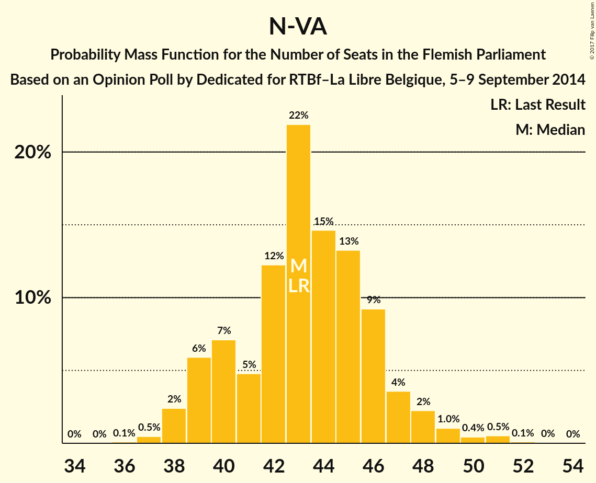

| Number of Seats | Probability | Accumulated | Special Marks |
|:---------------:|:-----------:|:-----------:|:-------------:|
| 36 | 0.1% | 100% |  |
| 37 | 0.5% | 99.9% |  |
| 38 | 2% | 99.4% |  |
| 39 | 6% | 97% |  |
| 40 | 7% | 91% |  |
| 41 | 5% | 84% |  |
| 42 | 12% | 79% |  |
| 43 | 22% | 67% | Last Result, Median |
| 44 | 15% | 45% |  |
| 45 | 13% | 30% |  |
| 46 | 9% | 17% |  |
| 47 | 4% | 8% |  |
| 48 | 2% | 4% |  |
| 49 | 1.0% | 2% |  |
| 50 | 0.4% | 1.1% |  |
| 51 | 0.5% | 0.7% |  |
| 52 | 0.1% | 0.1% |  |
| 53 | 0% | 0% |  |

### CD&V

*For a full overview of the results for this party, see the [CD&V](party-cdv.html) page.*

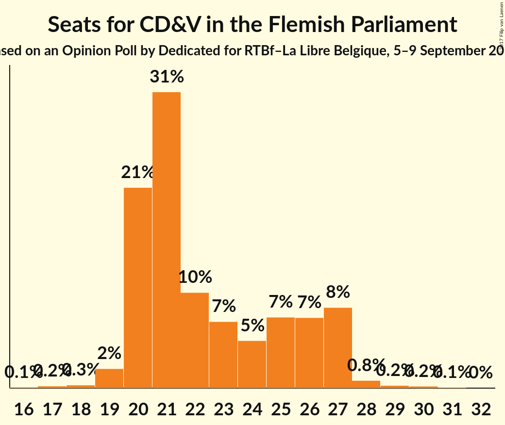

| Number of Seats | Probability | Accumulated | Special Marks |
|:---------------:|:-----------:|:-----------:|:-------------:|
| 16 | 0.1% | 100% |  |
| 17 | 0.2% | 99.9% |  |
| 18 | 0.3% | 99.7% |  |
| 19 | 2% | 99.4% |  |
| 20 | 21% | 97% |  |
| 21 | 31% | 77% | Median |
| 22 | 10% | 46% |  |
| 23 | 7% | 36% |  |
| 24 | 5% | 29% |  |
| 25 | 7% | 24% |  |
| 26 | 7% | 17% |  |
| 27 | 8% | 10% | Last Result |
| 28 | 0.8% | 1.2% |  |
| 29 | 0.2% | 0.5% |  |
| 30 | 0.2% | 0.2% |  |
| 31 | 0.1% | 0.1% |  |
| 32 | 0% | 0% |  |

### Open Vld

*For a full overview of the results for this party, see the [Open Vld](party-openvld.html) page.*

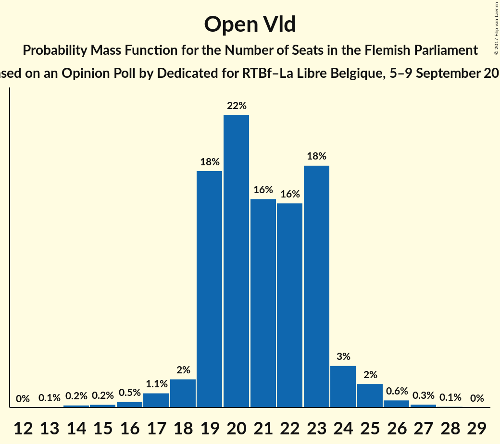

| Number of Seats | Probability | Accumulated | Special Marks |
|:---------------:|:-----------:|:-----------:|:-------------:|
| 13 | 0.1% | 100% |  |
| 14 | 0.2% | 99.9% |  |
| 15 | 0.2% | 99.7% |  |
| 16 | 0.5% | 99.5% |  |
| 17 | 1.1% | 99.0% |  |
| 18 | 2% | 98% |  |
| 19 | 18% | 96% | Last Result |
| 20 | 22% | 78% |  |
| 21 | 16% | 56% | Median |
| 22 | 16% | 40% |  |
| 23 | 18% | 24% |  |
| 24 | 3% | 6% |  |
| 25 | 2% | 3% |  |
| 26 | 0.6% | 0.9% |  |
| 27 | 0.3% | 0.4% |  |
| 28 | 0.1% | 0.1% |  |
| 29 | 0% | 0% |  |

### sp.a

*For a full overview of the results for this party, see the [sp.a](party-spa.html) page.*

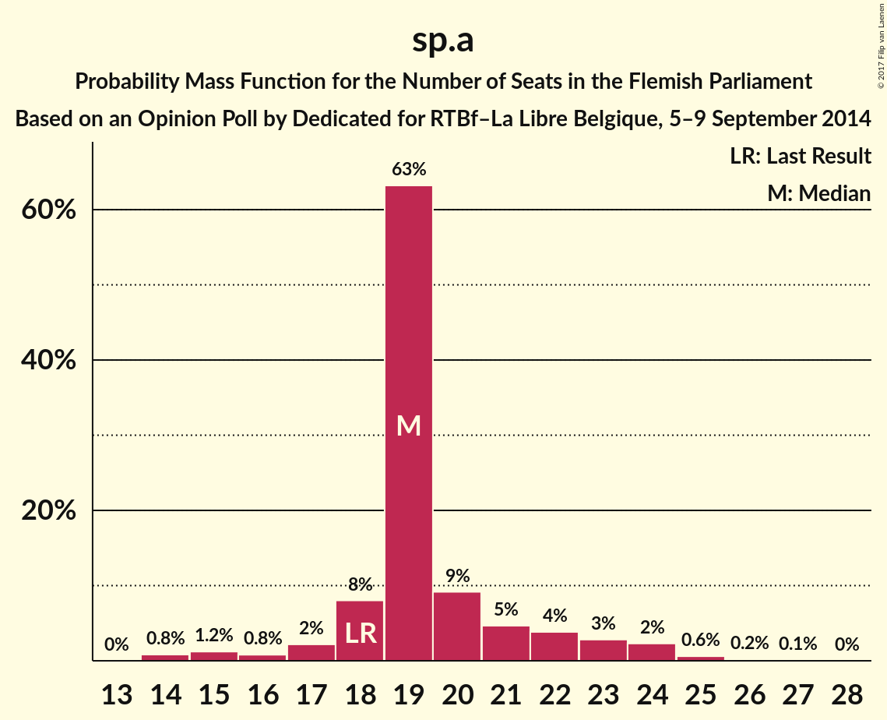

| Number of Seats | Probability | Accumulated | Special Marks |
|:---------------:|:-----------:|:-----------:|:-------------:|
| 14 | 0.8% | 100% |  |
| 15 | 1.2% | 99.2% |  |
| 16 | 0.8% | 98% |  |
| 17 | 2% | 97% |  |
| 18 | 8% | 95% | Last Result |
| 19 | 63% | 87% | Median |
| 20 | 9% | 24% |  |
| 21 | 5% | 15% |  |
| 22 | 4% | 10% |  |
| 23 | 3% | 6% |  |
| 24 | 2% | 3% |  |
| 25 | 0.6% | 0.9% |  |
| 26 | 0.2% | 0.3% |  |
| 27 | 0.1% | 0.1% |  |
| 28 | 0% | 0% |  |

### Groen

*For a full overview of the results for this party, see the [Groen](party-groen.html) page.*

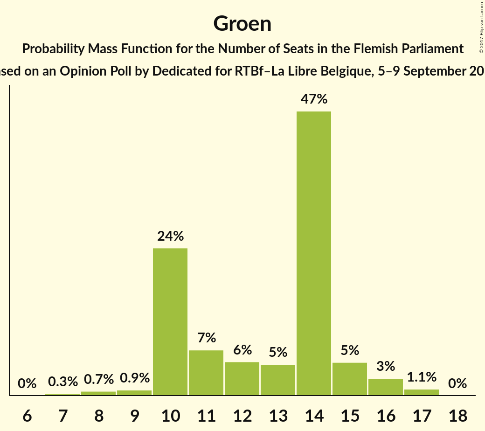

| Number of Seats | Probability | Accumulated | Special Marks |
|:---------------:|:-----------:|:-----------:|:-------------:|
| 7 | 0.3% | 100% |  |
| 8 | 0.7% | 99.7% |  |
| 9 | 0.9% | 99.0% |  |
| 10 | 24% | 98% | Last Result |
| 11 | 7% | 74% |  |
| 12 | 6% | 66% |  |
| 13 | 5% | 61% |  |
| 14 | 47% | 56% | Median |
| 15 | 5% | 9% |  |
| 16 | 3% | 4% |  |
| 17 | 1.1% | 1.1% |  |
| 18 | 0% | 0% |  |

### Vlaams Belang

*For a full overview of the results for this party, see the [Vlaams Belang](party-vlaamsbelang.html) page.*

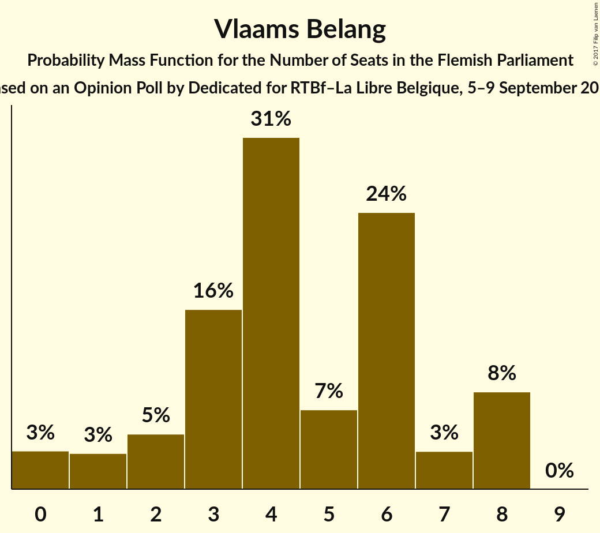

| Number of Seats | Probability | Accumulated | Special Marks |
|:---------------:|:-----------:|:-----------:|:-------------:|
| 0 | 3% | 100% |  |
| 1 | 3% | 97% |  |
| 2 | 5% | 94% |  |
| 3 | 16% | 89% |  |
| 4 | 31% | 73% | Median |
| 5 | 7% | 43% |  |
| 6 | 24% | 36% | Last Result |
| 7 | 3% | 12% |  |
| 8 | 8% | 8% |  |
| 9 | 0% | 0% |  |

### PVDA

*For a full overview of the results for this party, see the [PVDA](party-pvda.html) page.*

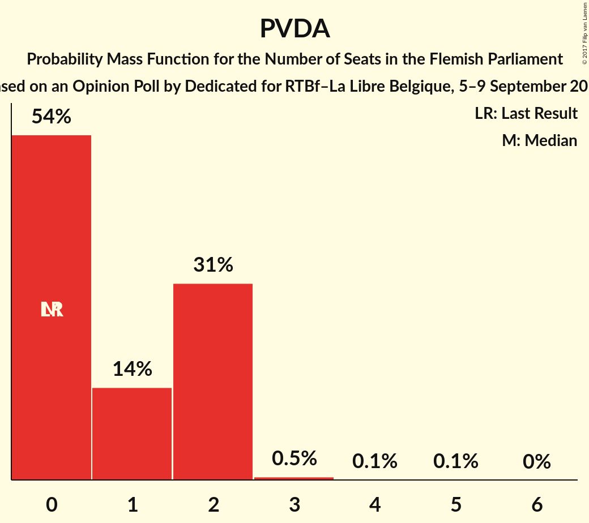

| Number of Seats | Probability | Accumulated | Special Marks |
|:---------------:|:-----------:|:-----------:|:-------------:|
| 0 | 54% | 100% | Last Result, Median |
| 1 | 14% | 46% |  |
| 2 | 31% | 31% |  |
| 3 | 0.5% | 0.7% |  |
| 4 | 0.1% | 0.2% |  |
| 5 | 0.1% | 0.1% |  |
| 6 | 0% | 0% |  |

### Piratenpartij

*For a full overview of the results for this party, see the [Piratenpartij](party-piratenpartij.html) page.*

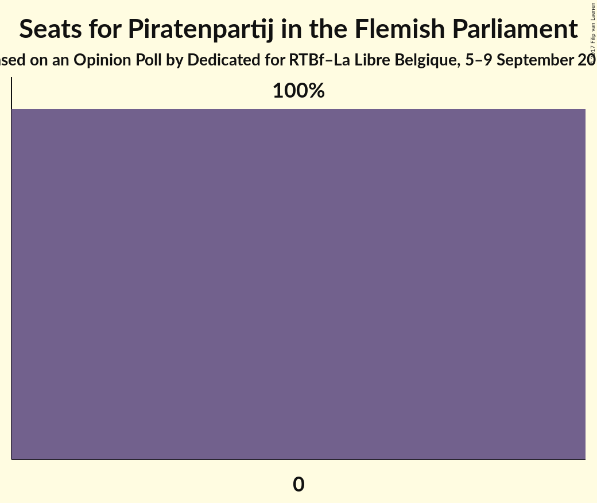

| Number of Seats | Probability | Accumulated | Special Marks |
|:---------------:|:-----------:|:-----------:|:-------------:|
| 0 | 100% | 100% | Last Result, Median |

### Lijst Dedecker

*For a full overview of the results for this party, see the [Lijst Dedecker](party-lijstdedecker.html) page.*

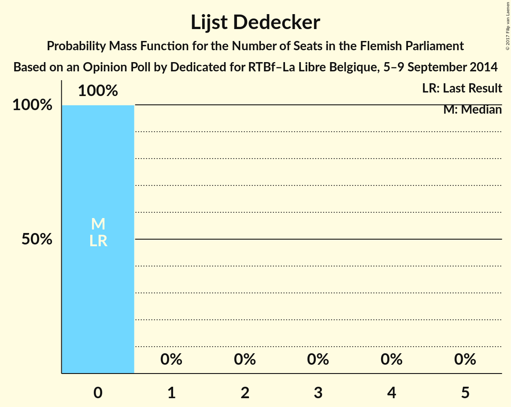

| Number of Seats | Probability | Accumulated | Special Marks |
|:---------------:|:-----------:|:-----------:|:-------------:|
| 0 | 100% | 100% | Last Result, Median |

## Coalitions

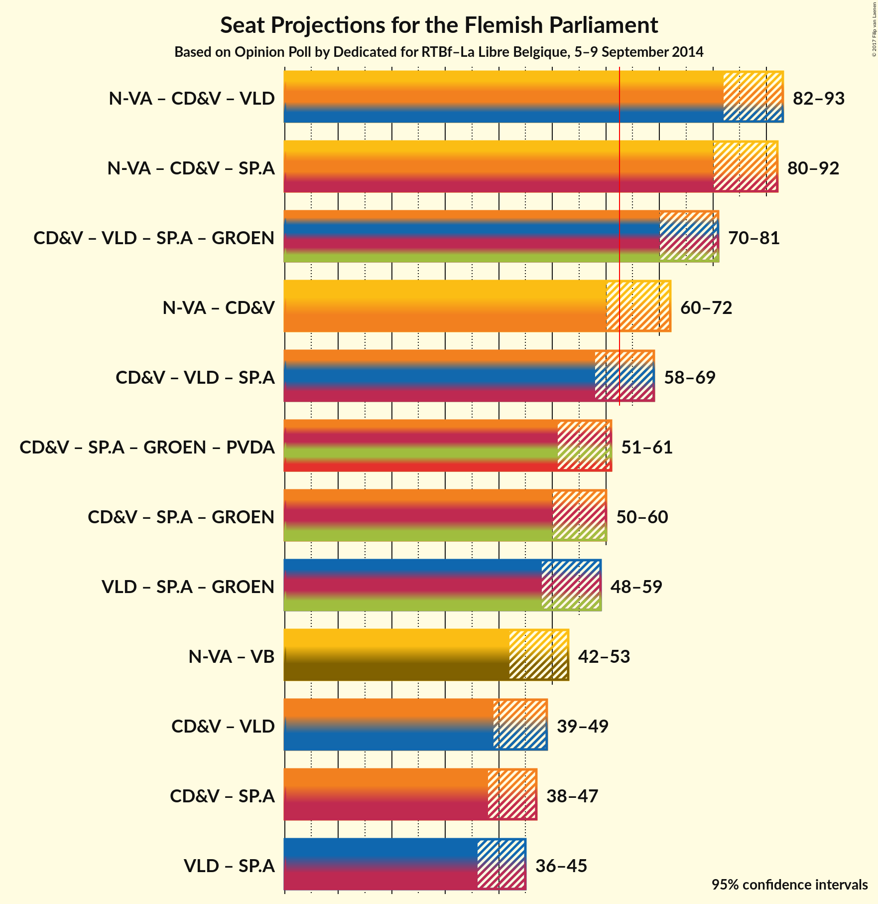

### Confidence Intervals

| Coalition | Last Result | Median | Majority? | 80% Confidence Interval | 90% Confidence Interval | 95% Confidence Interval | 99% Confidence Interval |
|:---------:|:-----------:|:------:|:---------:|:-----------------------:|:-----------------------:|:-----------------------:|:-----------------------:|
| N-VA – CD&V – Open Vld | 89 | 86 | 100% | 83–91 | 82–92 | 82–93 | 80–94 |
| N-VA – CD&V – sp.a | 88 | 85 | 100% | 82–89 | 81–90 | 80–92 | 79–93 |
| CD&V – Open Vld – sp.a – Groen | 74 | 75 | 100% | 72–79 | 71–80 | 70–81 | 68–82 |
| N-VA – CD&V | 70 | 65 | 88% | 62–70 | 61–71 | 60–72 | 59–73 |
| CD&V – Open Vld – sp.a | 64 | 63 | 52% | 59–67 | 58–68 | 58–69 | 56–71 |
| CD&V – sp.a – Groen – PVDA | 55 | 55 | 0.5% | 52–59 | 51–60 | 51–61 | 48–62 |
| CD&V – sp.a – Groen | 55 | 54 | 0.3% | 51–58 | 50–59 | 50–60 | 47–62 |
| Open Vld – sp.a – Groen | 47 | 53 | 0% | 49–56 | 48–57 | 48–59 | 46–60 |
| N-VA – Vlaams Belang | 49 | 48 | 0% | 44–51 | 43–52 | 42–53 | 41–55 |
| CD&V – Open Vld | 46 | 43 | 0% | 40–47 | 40–49 | 39–49 | 38–50 |
| CD&V – sp.a | 45 | 41 | 0% | 39–46 | 38–47 | 38–47 | 36–49 |
| Open Vld – sp.a | 37 | 40 | 0% | 38–44 | 37–45 | 36–45 | 34–47 |

### N-VA – CD&V – Open Vld

| Number of Seats | Probability | Accumulated | Special Marks |
|:---------------:|:-----------:|:-----------:|:-------------:|
| 78 | 0.1% | 100% |  |
| 79 | 0.2% | 99.8% |  |
| 80 | 0.4% | 99.6% |  |
| 81 | 1.5% | 99.2% |  |
| 82 | 3% | 98% |  |
| 83 | 8% | 95% |  |
| 84 | 8% | 87% |  |
| 85 | 17% | 78% | Median |
| 86 | 12% | 62% |  |
| 87 | 19% | 50% |  |
| 88 | 7% | 31% |  |
| 89 | 6% | 24% | Last Result |
| 90 | 5% | 17% |  |
| 91 | 5% | 12% |  |
| 92 | 4% | 7% |  |
| 93 | 1.5% | 3% |  |
| 94 | 0.8% | 1.1% |  |
| 95 | 0.1% | 0.2% |  |
| 96 | 0.1% | 0.1% |  |
| 97 | 0% | 0% |  |

### N-VA – CD&V – sp.a

| Number of Seats | Probability | Accumulated | Special Marks |
|:---------------:|:-----------:|:-----------:|:-------------:|
| 77 | 0.1% | 100% |  |
| 78 | 0.3% | 99.8% |  |
| 79 | 1.4% | 99.5% |  |
| 80 | 2% | 98% |  |
| 81 | 6% | 96% |  |
| 82 | 9% | 90% |  |
| 83 | 17% | 81% | Median |
| 84 | 13% | 64% |  |
| 85 | 10% | 52% |  |
| 86 | 13% | 41% |  |
| 87 | 8% | 28% |  |
| 88 | 10% | 21% | Last Result |
| 89 | 4% | 11% |  |
| 90 | 2% | 7% |  |
| 91 | 2% | 5% |  |
| 92 | 3% | 3% |  |
| 93 | 0.5% | 0.6% |  |
| 94 | 0% | 0.1% |  |
| 95 | 0.1% | 0.1% |  |
| 96 | 0% | 0% |  |

### CD&V – Open Vld – sp.a – Groen

| Number of Seats | Probability | Accumulated | Special Marks |
|:---------------:|:-----------:|:-----------:|:-------------:|
| 67 | 0.3% | 100% |  |
| 68 | 0.2% | 99.7% |  |
| 69 | 1.0% | 99.4% |  |
| 70 | 2% | 98% |  |
| 71 | 2% | 96% |  |
| 72 | 6% | 94% |  |
| 73 | 7% | 88% |  |
| 74 | 19% | 80% | Last Result |
| 75 | 15% | 61% | Median |
| 76 | 15% | 46% |  |
| 77 | 10% | 31% |  |
| 78 | 11% | 22% |  |
| 79 | 4% | 11% |  |
| 80 | 3% | 7% |  |
| 81 | 2% | 4% |  |
| 82 | 0.9% | 1.4% |  |
| 83 | 0.2% | 0.4% |  |
| 84 | 0.2% | 0.3% |  |
| 85 | 0% | 0% |  |

### N-VA – CD&V

| Number of Seats | Probability | Accumulated | Special Marks |
|:---------------:|:-----------:|:-----------:|:-------------:|
| 57 | 0.1% | 100% |  |
| 58 | 0.3% | 99.9% |  |
| 59 | 0.6% | 99.6% |  |
| 60 | 2% | 99.0% |  |
| 61 | 3% | 97% |  |
| 62 | 7% | 94% |  |
| 63 | 10% | 88% | Majority |
| 64 | 19% | 78% | Median |
| 65 | 13% | 59% |  |
| 66 | 10% | 46% |  |
| 67 | 11% | 36% |  |
| 68 | 8% | 26% |  |
| 69 | 8% | 18% |  |
| 70 | 3% | 10% | Last Result |
| 71 | 3% | 7% |  |
| 72 | 3% | 5% |  |
| 73 | 0.9% | 1.2% |  |
| 74 | 0.3% | 0.4% |  |
| 75 | 0% | 0.1% |  |
| 76 | 0% | 0% |  |

### CD&V – Open Vld – sp.a

| Number of Seats | Probability | Accumulated | Special Marks |
|:---------------:|:-----------:|:-----------:|:-------------:|
| 54 | 0% | 100% |  |
| 55 | 0.1% | 99.9% |  |
| 56 | 0.8% | 99.8% |  |
| 57 | 1.4% | 99.0% |  |
| 58 | 4% | 98% |  |
| 59 | 7% | 94% |  |
| 60 | 14% | 87% |  |
| 61 | 11% | 72% | Median |
| 62 | 9% | 61% |  |
| 63 | 12% | 52% | Majority |
| 64 | 12% | 40% | Last Result |
| 65 | 9% | 28% |  |
| 66 | 8% | 19% |  |
| 67 | 3% | 11% |  |
| 68 | 4% | 8% |  |
| 69 | 2% | 3% |  |
| 70 | 0.6% | 2% |  |
| 71 | 0.8% | 1.0% |  |
| 72 | 0.1% | 0.2% |  |
| 73 | 0% | 0.1% |  |
| 74 | 0% | 0% |  |

### CD&V – sp.a – Groen – PVDA

| Number of Seats | Probability | Accumulated | Special Marks |
|:---------------:|:-----------:|:-----------:|:-------------:|
| 46 | 0.1% | 100% |  |
| 47 | 0.2% | 99.9% |  |
| 48 | 0.4% | 99.7% |  |
| 49 | 0.4% | 99.3% |  |
| 50 | 1.4% | 98.9% |  |
| 51 | 4% | 98% |  |
| 52 | 5% | 93% |  |
| 53 | 15% | 88% |  |
| 54 | 17% | 73% | Median |
| 55 | 17% | 56% | Last Result |
| 56 | 12% | 39% |  |
| 57 | 9% | 27% |  |
| 58 | 4% | 18% |  |
| 59 | 6% | 14% |  |
| 60 | 4% | 8% |  |
| 61 | 3% | 4% |  |
| 62 | 0.9% | 1.4% |  |
| 63 | 0.2% | 0.5% | Majority |
| 64 | 0.2% | 0.2% |  |
| 65 | 0% | 0% |  |

### CD&V – sp.a – Groen

| Number of Seats | Probability | Accumulated | Special Marks |
|:---------------:|:-----------:|:-----------:|:-------------:|
| 46 | 0.1% | 100% |  |
| 47 | 0.5% | 99.9% |  |
| 48 | 0.5% | 99.4% |  |
| 49 | 1.0% | 98.9% |  |
| 50 | 4% | 98% |  |
| 51 | 7% | 94% |  |
| 52 | 5% | 87% |  |
| 53 | 21% | 83% |  |
| 54 | 22% | 62% | Median |
| 55 | 11% | 39% | Last Result |
| 56 | 6% | 28% |  |
| 57 | 8% | 22% |  |
| 58 | 6% | 14% |  |
| 59 | 5% | 8% |  |
| 60 | 2% | 3% |  |
| 61 | 0.7% | 1.5% |  |
| 62 | 0.4% | 0.8% |  |
| 63 | 0.2% | 0.3% | Majority |
| 64 | 0.1% | 0.1% |  |
| 65 | 0% | 0% |  |

### Open Vld – sp.a – Groen

| Number of Seats | Probability | Accumulated | Special Marks |
|:---------------:|:-----------:|:-----------:|:-------------:|
| 44 | 0.1% | 100% |  |
| 45 | 0.2% | 99.8% |  |
| 46 | 0.5% | 99.6% |  |
| 47 | 1.1% | 99.1% | Last Result |
| 48 | 3% | 98% |  |
| 49 | 5% | 95% |  |
| 50 | 8% | 89% |  |
| 51 | 6% | 82% |  |
| 52 | 15% | 76% |  |
| 53 | 17% | 61% |  |
| 54 | 16% | 44% | Median |
| 55 | 12% | 28% |  |
| 56 | 7% | 15% |  |
| 57 | 4% | 9% |  |
| 58 | 2% | 5% |  |
| 59 | 2% | 3% |  |
| 60 | 0.6% | 0.7% |  |
| 61 | 0.1% | 0.1% |  |
| 62 | 0% | 0% |  |

### N-VA – Vlaams Belang

| Number of Seats | Probability | Accumulated | Special Marks |
|:---------------:|:-----------:|:-----------:|:-------------:|
| 39 | 0.2% | 100% |  |
| 40 | 0.2% | 99.8% |  |
| 41 | 0.4% | 99.6% |  |
| 42 | 2% | 99.2% |  |
| 43 | 4% | 97% |  |
| 44 | 6% | 94% |  |
| 45 | 6% | 88% |  |
| 46 | 13% | 82% |  |
| 47 | 11% | 68% | Median |
| 48 | 17% | 57% |  |
| 49 | 15% | 41% | Last Result |
| 50 | 14% | 26% |  |
| 51 | 5% | 12% |  |
| 52 | 4% | 8% |  |
| 53 | 2% | 3% |  |
| 54 | 1.0% | 2% |  |
| 55 | 0.3% | 0.6% |  |
| 56 | 0.1% | 0.3% |  |
| 57 | 0.1% | 0.2% |  |
| 58 | 0% | 0% |  |

### CD&V – Open Vld

| Number of Seats | Probability | Accumulated | Special Marks |
|:---------------:|:-----------:|:-----------:|:-------------:|
| 35 | 0.1% | 100% |  |
| 36 | 0.1% | 99.9% |  |
| 37 | 0.3% | 99.8% |  |
| 38 | 1.2% | 99.6% |  |
| 39 | 3% | 98% |  |
| 40 | 9% | 95% |  |
| 41 | 17% | 86% |  |
| 42 | 12% | 69% | Median |
| 43 | 10% | 57% |  |
| 44 | 16% | 47% |  |
| 45 | 8% | 30% |  |
| 46 | 9% | 23% | Last Result |
| 47 | 5% | 14% |  |
| 48 | 3% | 9% |  |
| 49 | 4% | 6% |  |
| 50 | 1.3% | 2% |  |
| 51 | 0.2% | 0.4% |  |
| 52 | 0.1% | 0.2% |  |
| 53 | 0.1% | 0.1% |  |
| 54 | 0% | 0% |  |

### CD&V – sp.a

| Number of Seats | Probability | Accumulated | Special Marks |
|:---------------:|:-----------:|:-----------:|:-------------:|
| 34 | 0.1% | 100% |  |
| 35 | 0.3% | 99.9% |  |
| 36 | 0.9% | 99.6% |  |
| 37 | 1.2% | 98.7% |  |
| 38 | 3% | 98% |  |
| 39 | 18% | 94% |  |
| 40 | 21% | 76% | Median |
| 41 | 11% | 55% |  |
| 42 | 8% | 45% |  |
| 43 | 9% | 36% |  |
| 44 | 8% | 27% |  |
| 45 | 9% | 20% | Last Result |
| 46 | 5% | 11% |  |
| 47 | 4% | 7% |  |
| 48 | 1.2% | 2% |  |
| 49 | 0.7% | 1.1% |  |
| 50 | 0.3% | 0.4% |  |
| 51 | 0.1% | 0.1% |  |
| 52 | 0% | 0% |  |

### Open Vld – sp.a

| Number of Seats | Probability | Accumulated | Special Marks |
|:---------------:|:-----------:|:-----------:|:-------------:|
| 32 | 0.1% | 100% |  |
| 33 | 0.4% | 99.9% |  |
| 34 | 0.5% | 99.5% |  |
| 35 | 1.0% | 99.1% |  |
| 36 | 1.4% | 98% |  |
| 37 | 4% | 97% | Last Result |
| 38 | 13% | 93% |  |
| 39 | 19% | 80% |  |
| 40 | 17% | 60% | Median |
| 41 | 12% | 43% |  |
| 42 | 15% | 31% |  |
| 43 | 6% | 16% |  |
| 44 | 5% | 10% |  |
| 45 | 3% | 5% |  |
| 46 | 1.3% | 2% |  |
| 47 | 0.4% | 0.8% |  |
| 48 | 0.2% | 0.4% |  |
| 49 | 0.1% | 0.2% |  |
| 50 | 0.1% | 0.1% |  |
| 51 | 0% | 0% |  |

## Technical Information

### Opinion Poll

+ **Polling firm:** Dedicated
+ **Commissioner(s):** RTBf–La Libre Belgique
+ **Fieldwork period:** 5–9 September 2014

### Calculations

+ **Sample size:** 792
+ **Simulations done:** 8,388,608
+ **Error estimate:** 1.57%

