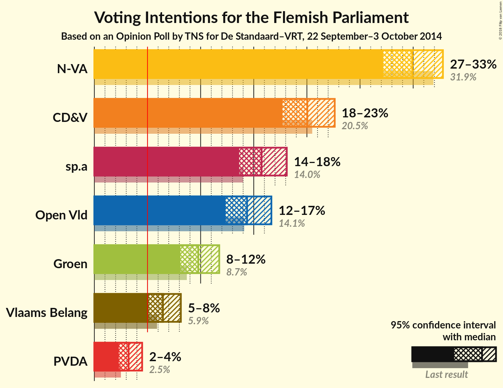
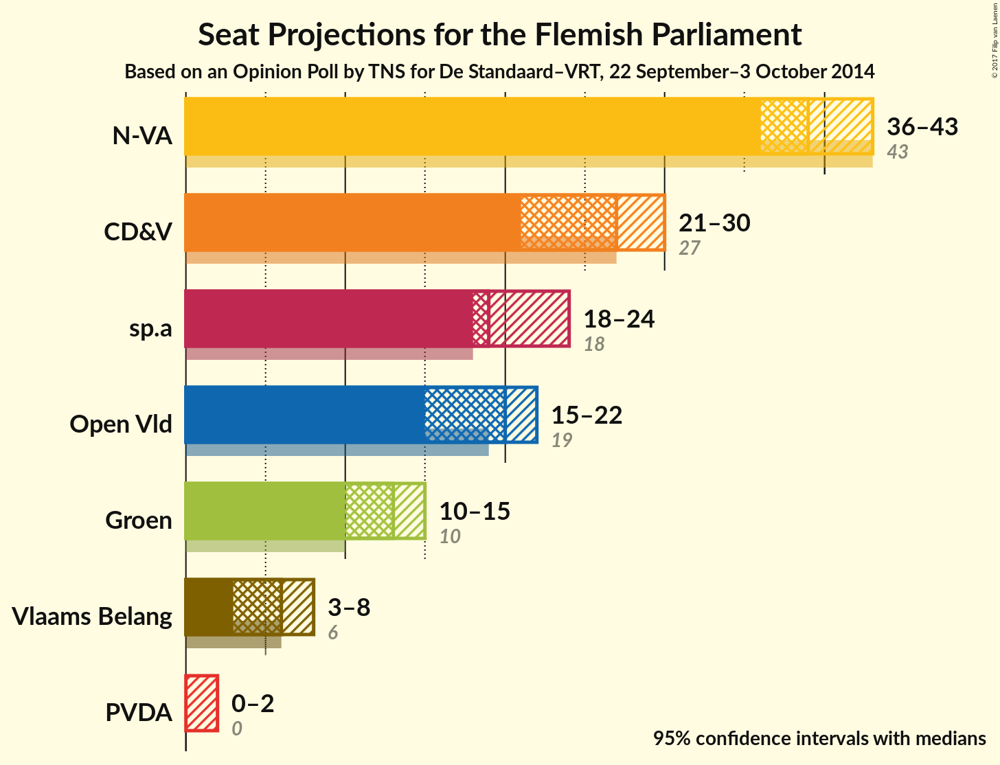
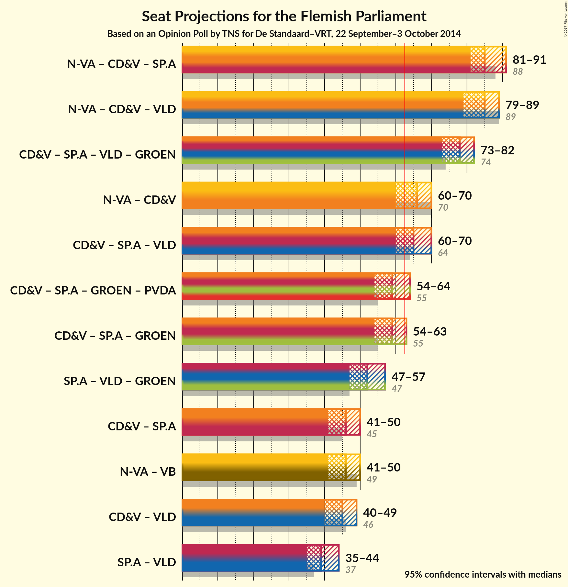

# Opinion Poll by TNS for De Standaard–VRT, 22 September–3 October 2014

<a href="#voting-intentions">Voting Intentions</a> | <a href="#seats">Seats</a> | <a href="#coalitions">Coalitions</a> | <a href="#technical-information">Technical Information</a>

## Voting Intentions

### Confidence Intervals

| Party | Last Result | Poll Result | 80% Confidence Interval | 90% Confidence Interval | 95% Confidence Interval | 99% Confidence Interval |
|:-----:|:-----------:|:-----------:|:-----------------------:|:-----------------------:|:-----------------------:|:-----------------------:|
| N-VA | 31.9% | 29.9% | 28.1–31.8% |27.6–32.3% |27.2–32.8% |26.3–33.7% |
| CD&V | 20.5% | 20.0% | 18.5–21.7% |18.1–22.2% |17.7–22.6% |17.0–23.4% |
| sp.a | 14.0% | 15.7% | 14.4–17.3% |14.0–17.7% |13.6–18.1% |13.0–18.9% |
| Open Vld | 14.1% | 14.4% | 13.0–15.9% |12.7–16.3% |12.3–16.7% |11.7–17.4% |
| Groen | 8.7% | 9.8% | 8.7–11.1% |8.4–11.4% |8.1–11.8% |7.6–12.4% |
| Vlaams Belang | 5.9% | 6.5% | 5.6–7.5% |5.3–7.9% |5.1–8.1% |4.7–8.7% |
| PVDA | 2.5% | 3.2% | 2.6–4.1% |2.4–4.3% |2.3–4.5% |2.0–4.9% |

*Note:* The poll result column reflects the actual value used in the calculations. Published results may vary slightly, and in addition be rounded to fewer digits.

## Seats

### Confidence Intervals

| Party | Last Result | Median | 80% Confidence Interval | 90% Confidence Interval | 95% Confidence Interval | 99% Confidence Interval |
|:-----:|:-----------:|:------:|:-----------------------:|:-----------------------:|:-----------------------:|:-----------------------:|
| <a href="#n-va">N-VA</a> | 43 | 39 | 38–42 |37–43 |36–43 |35–45 |
| <a href="#cd&v">CD&V</a> | 27 | 27 | 23–28 |22–29 |21–30 |20–31 |
| <a href="#sp.a">sp.a</a> | 18 | 19 | 19–22 |19–23 |18–24 |16–25 |
| <a href="#open-vld">Open Vld</a> | 19 | 20 | 17–20 |16–21 |15–22 |14–23 |
| <a href="#groen">Groen</a> | 10 | 13 | 10–14 |10–15 |10–15 |9–16 |
| <a href="#vlaams-belang">Vlaams Belang</a> | 6 | 6 | 4–8 |4–8 |3–8 |2–8 |
| <a href="#pvda">PVDA</a> | 0 | 0 | 0–2 |0–2 |0–2 |0–2 |

### N-VA

| Number of Seats | Probability | Accumulated | Special Marks |
|:---------------:|:-----------:|:-----------:|:-------------:|
| 33 | 0.1% | 100% |  |
| 34 | 0.2% | 99.9% |  |
| 35 | 0.4% | 99.7% |  |
| 36 | 2% | 99.3% |  |
| 37 | 6% | 97% |  |
| 38 | 31% | 91% |  |
| 39 | 23% | 60% | Median |
| 40 | 12% | 37% |  |
| 41 | 9% | 26% |  |
| 42 | 7% | 17% |  |
| 43 | 8% | 10% | Last Result |
| 44 | 1.1% | 2% |  |
| 45 | 0.6% | 1.1% |  |
| 46 | 0.1% | 0.5% |  |
| 47 | 0.1% | 0.3% |  |
| 48 | 0.3% | 0.3% |  |
| 49 | 0% | 0% |  |

### CD&V

| Number of Seats | Probability | Accumulated | Special Marks |
|:---------------:|:-----------:|:-----------:|:-------------:|
| 20 | 0.5% | 100% |  |
| 21 | 4% | 99.5% |  |
| 22 | 2% | 95% |  |
| 23 | 6% | 93% |  |
| 24 | 6% | 87% |  |
| 25 | 18% | 81% |  |
| 26 | 9% | 63% |  |
| 27 | 40% | 54% | Last Result, Median |
| 28 | 8% | 14% |  |
| 29 | 3% | 6% |  |
| 30 | 2% | 3% |  |
| 31 | 0.4% | 0.5% |  |
| 32 | 0.1% | 0.1% |  |
| 33 | 0% | 0% |  |

### sp.a

| Number of Seats | Probability | Accumulated | Special Marks |
|:---------------:|:-----------:|:-----------:|:-------------:|
| 14 | 0.2% | 100% |  |
| 15 | 0.3% | 99.8% |  |
| 16 | 0.3% | 99.5% |  |
| 17 | 0.8% | 99.3% |  |
| 18 | 2% | 98% | Last Result |
| 19 | 52% | 96% | Median |
| 20 | 21% | 44% |  |
| 21 | 7% | 23% |  |
| 22 | 6% | 15% |  |
| 23 | 5% | 9% |  |
| 24 | 2% | 4% |  |
| 25 | 2% | 2% |  |
| 26 | 0.1% | 0.3% |  |
| 27 | 0.2% | 0.2% |  |
| 28 | 0% | 0% |  |

### Open Vld

| Number of Seats | Probability | Accumulated | Special Marks |
|:---------------:|:-----------:|:-----------:|:-------------:|
| 13 | 0.4% | 100% |  |
| 14 | 0.8% | 99.6% |  |
| 15 | 2% | 98.8% |  |
| 16 | 4% | 96% |  |
| 17 | 3% | 93% |  |
| 18 | 8% | 90% |  |
| 19 | 30% | 82% | Last Result |
| 20 | 42% | 52% | Median |
| 21 | 5% | 10% |  |
| 22 | 3% | 5% |  |
| 23 | 1.4% | 2% |  |
| 24 | 0.2% | 0.3% |  |
| 25 | 0% | 0% |  |

### Groen

| Number of Seats | Probability | Accumulated | Special Marks |
|:---------------:|:-----------:|:-----------:|:-------------:|
| 7 | 0.2% | 100% |  |
| 8 | 0.2% | 99.8% |  |
| 9 | 0.3% | 99.7% |  |
| 10 | 23% | 99.3% | Last Result |
| 11 | 7% | 76% |  |
| 12 | 16% | 69% |  |
| 13 | 5% | 53% | Median |
| 14 | 41% | 48% |  |
| 15 | 5% | 7% |  |
| 16 | 1.3% | 2% |  |
| 17 | 0.3% | 0.3% |  |
| 18 | 0% | 0% |  |

### Vlaams Belang

| Number of Seats | Probability | Accumulated | Special Marks |
|:---------------:|:-----------:|:-----------:|:-------------:|
| 0 | 0.1% | 100% |  |
| 1 | 0.2% | 99.9% |  |
| 2 | 0.3% | 99.7% |  |
| 3 | 4% | 99.5% |  |
| 4 | 24% | 95% |  |
| 5 | 4% | 71% |  |
| 6 | 27% | 68% | Last Result, Median |
| 7 | 5% | 41% |  |
| 8 | 35% | 36% |  |
| 9 | 0.1% | 0.2% |  |
| 10 | 0.1% | 0.1% |  |
| 11 | 0% | 0% |  |

### PVDA

| Number of Seats | Probability | Accumulated | Special Marks |
|:---------------:|:-----------:|:-----------:|:-------------:|
| 0 | 55% | 100% | Last Result, Median |
| 1 | 11% | 45% |  |
| 2 | 34% | 34% |  |
| 3 | 0.1% | 0.1% |  |
| 4 | 0% | 0% |  |

## Coalitions

### Confidence Intervals

| Coalition | Last Result | Median | 80% Confidence Interval | 90% Confidence Interval | 95% Confidence Interval | 99% Confidence Interval |
|:---------:|:-----------:|:------:|:-----------------------:|:-----------------------:|:-----------------------:|:-----------------------:|
| N-VA – CD&V – sp.a | 88 | 86 | 82–88 | 82–89 | 81–91 | 80–93 |
| N-VA – CD&V – Open Vld | 89 | 85 | 82–88 | 81–89 | 80–90 | 78–91 |
| CD&V – sp.a – Open Vld – Groen | 74 | 78 | 75–80 | 74–81 | 73–82 | 71–83 |
| N-VA – CD&V | 70 | 66 | 63–69 | 62–69 | 61–70 | 59–72 |
| CD&V – sp.a – Open Vld | 64 | 65 | 62–67 | 60–68 | 59–69 | 59–71 |
| CD&V – sp.a – Groen – PVDA | 55 | 59 | 56–62 | 56–63 | 54–63 | 53–65 |
| CD&V – sp.a – Groen | 55 | 58 | 56–62 | 55–62 | 54–63 | 52–65 |
| sp.a – Open Vld – Groen | 47 | 52 | 49–55 | 48–55 | 48–57 | 46–58 |
| N-VA – Vlaams Belang | 49 | 46 | 43–48 | 42–49 | 41–51 | 41–52 |
| CD&V – sp.a | 45 | 46 | 43–49 | 42–49 | 40–50 | 40–52 |
| CD&V – Open Vld | 46 | 45 | 42–47 | 41–48 | 40–49 | 39–51 |
| sp.a – Open Vld | 37 | 39 | 37–42 | 35–43 | 35–44 | 33–45 |

### N-VA – CD&V – sp.a

| Number of Seats | Probability | Accumulated | Special Marks |
|:---------------:|:-----------:|:-----------:|:-------------:|
| 78 | 0.1% | 100% |  |
| 79 | 0.1% | 99.9% |  |
| 80 | 1.0% | 99.8% |  |
| 81 | 2% | 98.8% |  |
| 82 | 18% | 96% |  |
| 83 | 5% | 79% |  |
| 84 | 10% | 74% |  |
| 85 | 13% | 64% | Median |
| 86 | 22% | 51% |  |
| 87 | 11% | 30% |  |
| 88 | 10% | 19% | Last Result |
| 89 | 5% | 9% |  |
| 90 | 2% | 4% |  |
| 91 | 1.4% | 3% |  |
| 92 | 0.5% | 1.4% |  |
| 93 | 0.7% | 0.9% |  |
| 94 | 0.1% | 0.2% |  |
| 95 | 0% | 0% |  |

### N-VA – CD&V – Open Vld

| Number of Seats | Probability | Accumulated | Special Marks |
|:---------------:|:-----------:|:-----------:|:-------------:|
| 76 | 0.1% | 100% |  |
| 77 | 0.3% | 99.9% |  |
| 78 | 0.3% | 99.6% |  |
| 79 | 2% | 99.2% |  |
| 80 | 1.0% | 98% |  |
| 81 | 3% | 97% |  |
| 82 | 6% | 93% |  |
| 83 | 27% | 87% |  |
| 84 | 8% | 60% |  |
| 85 | 16% | 52% |  |
| 86 | 15% | 37% | Median |
| 87 | 11% | 22% |  |
| 88 | 5% | 11% |  |
| 89 | 4% | 6% | Last Result |
| 90 | 2% | 3% |  |
| 91 | 0.7% | 0.9% |  |
| 92 | 0.1% | 0.2% |  |
| 93 | 0% | 0% |  |

### CD&V – sp.a – Open Vld – Groen

| Number of Seats | Probability | Accumulated | Special Marks |
|:---------------:|:-----------:|:-----------:|:-------------:|
| 70 | 0.4% | 100% |  |
| 71 | 0.9% | 99.6% |  |
| 72 | 0.8% | 98.7% |  |
| 73 | 2% | 98% |  |
| 74 | 3% | 96% | Last Result |
| 75 | 7% | 93% |  |
| 76 | 13% | 87% |  |
| 77 | 13% | 74% |  |
| 78 | 26% | 61% |  |
| 79 | 18% | 35% | Median |
| 80 | 10% | 16% |  |
| 81 | 3% | 7% |  |
| 82 | 3% | 4% |  |
| 83 | 0.3% | 0.6% |  |
| 84 | 0.2% | 0.2% |  |
| 85 | 0.1% | 0.1% |  |
| 86 | 0% | 0% |  |

### N-VA – CD&V

| Number of Seats | Probability | Accumulated | Special Marks |
|:---------------:|:-----------:|:-----------:|:-------------:|
| 58 | 0.2% | 100% |  |
| 59 | 0.8% | 99.7% |  |
| 60 | 1.1% | 98.9% |  |
| 61 | 1.1% | 98% |  |
| 62 | 3% | 97% |  |
| 63 | 24% | 93% | Majority |
| 64 | 7% | 69% |  |
| 65 | 10% | 62% |  |
| 66 | 22% | 52% | Median |
| 67 | 10% | 31% |  |
| 68 | 9% | 20% |  |
| 69 | 7% | 11% |  |
| 70 | 3% | 4% | Last Result |
| 71 | 0.9% | 2% |  |
| 72 | 0.6% | 0.8% |  |
| 73 | 0.1% | 0.1% |  |
| 74 | 0% | 0% |  |

### CD&V – sp.a – Open Vld

| Number of Seats | Probability | Accumulated | Special Marks |
|:---------------:|:-----------:|:-----------:|:-------------:|
| 58 | 0.2% | 100% |  |
| 59 | 3% | 99.7% |  |
| 60 | 4% | 97% |  |
| 61 | 2% | 94% |  |
| 62 | 2% | 92% |  |
| 63 | 2% | 90% | Majority |
| 64 | 20% | 88% | Last Result |
| 65 | 20% | 67% |  |
| 66 | 23% | 47% | Median |
| 67 | 15% | 24% |  |
| 68 | 4% | 9% |  |
| 69 | 2% | 5% |  |
| 70 | 2% | 2% |  |
| 71 | 0.6% | 0.9% |  |
| 72 | 0.2% | 0.3% |  |
| 73 | 0.1% | 0.1% |  |
| 74 | 0% | 0% |  |

### CD&V – sp.a – Groen – PVDA

| Number of Seats | Probability | Accumulated | Special Marks |
|:---------------:|:-----------:|:-----------:|:-------------:|
| 51 | 0.3% | 100% |  |
| 52 | 0.1% | 99.6% |  |
| 53 | 0.3% | 99.5% |  |
| 54 | 2% | 99.3% |  |
| 55 | 2% | 97% | Last Result |
| 56 | 9% | 95% |  |
| 57 | 6% | 87% |  |
| 58 | 24% | 81% |  |
| 59 | 13% | 57% | Median |
| 60 | 8% | 44% |  |
| 61 | 20% | 35% |  |
| 62 | 8% | 15% |  |
| 63 | 5% | 7% | Majority |
| 64 | 1.0% | 2% |  |
| 65 | 0.6% | 1.0% |  |
| 66 | 0.2% | 0.5% |  |
| 67 | 0.3% | 0.3% |  |
| 68 | 0% | 0% |  |

### CD&V – sp.a – Groen

| Number of Seats | Probability | Accumulated | Special Marks |
|:---------------:|:-----------:|:-----------:|:-------------:|
| 51 | 0.4% | 100% |  |
| 52 | 0.5% | 99.5% |  |
| 53 | 0.8% | 99.1% |  |
| 54 | 3% | 98% |  |
| 55 | 4% | 95% | Last Result |
| 56 | 11% | 91% |  |
| 57 | 8% | 80% |  |
| 58 | 23% | 72% |  |
| 59 | 24% | 48% | Median |
| 60 | 5% | 24% |  |
| 61 | 9% | 19% |  |
| 62 | 6% | 10% |  |
| 63 | 2% | 4% | Majority |
| 64 | 0.5% | 1.2% |  |
| 65 | 0.6% | 0.7% |  |
| 66 | 0.1% | 0.1% |  |
| 67 | 0% | 0% |  |

### sp.a – Open Vld – Groen

| Number of Seats | Probability | Accumulated | Special Marks |
|:---------------:|:-----------:|:-----------:|:-------------:|
| 43 | 0% | 100% |  |
| 44 | 0.1% | 99.9% |  |
| 45 | 0.4% | 99.9% |  |
| 46 | 1.3% | 99.5% |  |
| 47 | 0.6% | 98% | Last Result |
| 48 | 6% | 98% |  |
| 49 | 10% | 91% |  |
| 50 | 12% | 81% |  |
| 51 | 9% | 69% |  |
| 52 | 23% | 60% | Median |
| 53 | 19% | 37% |  |
| 54 | 7% | 18% |  |
| 55 | 7% | 11% |  |
| 56 | 2% | 4% |  |
| 57 | 2% | 3% |  |
| 58 | 0.3% | 0.5% |  |
| 59 | 0.2% | 0.2% |  |
| 60 | 0% | 0% |  |

### N-VA – Vlaams Belang

| Number of Seats | Probability | Accumulated | Special Marks |
|:---------------:|:-----------:|:-----------:|:-------------:|
| 39 | 0.1% | 100% |  |
| 40 | 0.3% | 99.9% |  |
| 41 | 2% | 99.6% |  |
| 42 | 3% | 97% |  |
| 43 | 14% | 94% |  |
| 44 | 12% | 81% |  |
| 45 | 14% | 68% | Median |
| 46 | 29% | 54% |  |
| 47 | 10% | 25% |  |
| 48 | 5% | 15% |  |
| 49 | 5% | 9% | Last Result |
| 50 | 2% | 5% |  |
| 51 | 2% | 3% |  |
| 52 | 0.1% | 0.5% |  |
| 53 | 0.1% | 0.4% |  |
| 54 | 0.3% | 0.3% |  |
| 55 | 0% | 0% |  |

### CD&V – sp.a

| Number of Seats | Probability | Accumulated | Special Marks |
|:---------------:|:-----------:|:-----------:|:-------------:|
| 38 | 0.1% | 100% |  |
| 39 | 0.3% | 99.8% |  |
| 40 | 3% | 99.5% |  |
| 41 | 1.2% | 97% |  |
| 42 | 3% | 96% |  |
| 43 | 3% | 93% |  |
| 44 | 16% | 90% |  |
| 45 | 14% | 74% | Last Result |
| 46 | 17% | 60% | Median |
| 47 | 25% | 43% |  |
| 48 | 8% | 18% |  |
| 49 | 7% | 11% |  |
| 50 | 2% | 4% |  |
| 51 | 2% | 2% |  |
| 52 | 0.3% | 0.6% |  |
| 53 | 0.2% | 0.2% |  |
| 54 | 0.1% | 0.1% |  |
| 55 | 0% | 0% |  |

### CD&V – Open Vld

| Number of Seats | Probability | Accumulated | Special Marks |
|:---------------:|:-----------:|:-----------:|:-------------:|
| 36 | 0.1% | 100% |  |
| 37 | 0.2% | 99.9% |  |
| 38 | 0.2% | 99.7% |  |
| 39 | 0.6% | 99.5% |  |
| 40 | 4% | 98.9% |  |
| 41 | 4% | 95% |  |
| 42 | 4% | 91% |  |
| 43 | 4% | 87% |  |
| 44 | 6% | 83% |  |
| 45 | 27% | 77% |  |
| 46 | 19% | 50% | Last Result |
| 47 | 25% | 31% | Median |
| 48 | 2% | 6% |  |
| 49 | 1.5% | 4% |  |
| 50 | 1.3% | 2% |  |
| 51 | 0.7% | 0.8% |  |
| 52 | 0.1% | 0.1% |  |
| 53 | 0% | 0% |  |

### sp.a – Open Vld

| Number of Seats | Probability | Accumulated | Special Marks |
|:---------------:|:-----------:|:-----------:|:-------------:|
| 32 | 0.3% | 100% |  |
| 33 | 0.5% | 99.7% |  |
| 34 | 0.9% | 99.2% |  |
| 35 | 4% | 98% |  |
| 36 | 1.5% | 95% |  |
| 37 | 5% | 93% | Last Result |
| 38 | 23% | 88% |  |
| 39 | 28% | 66% | Median |
| 40 | 18% | 38% |  |
| 41 | 9% | 20% |  |
| 42 | 3% | 10% |  |
| 43 | 5% | 7% |  |
| 44 | 2% | 3% |  |
| 45 | 0.4% | 0.8% |  |
| 46 | 0.3% | 0.4% |  |
| 47 | 0% | 0.1% |  |
| 48 | 0% | 0% |  |

## Technical Information

### Opinion Poll

+ **Pollster:** TNS
+ **Media:** De Standaard–VRT
+ **Fieldwork period:** 22 September–3 October 2014

### Calculations

+ **Sample size:** 1023
+ **Simulations done:** 262,144
+ **Error estimate:** 1.11%

