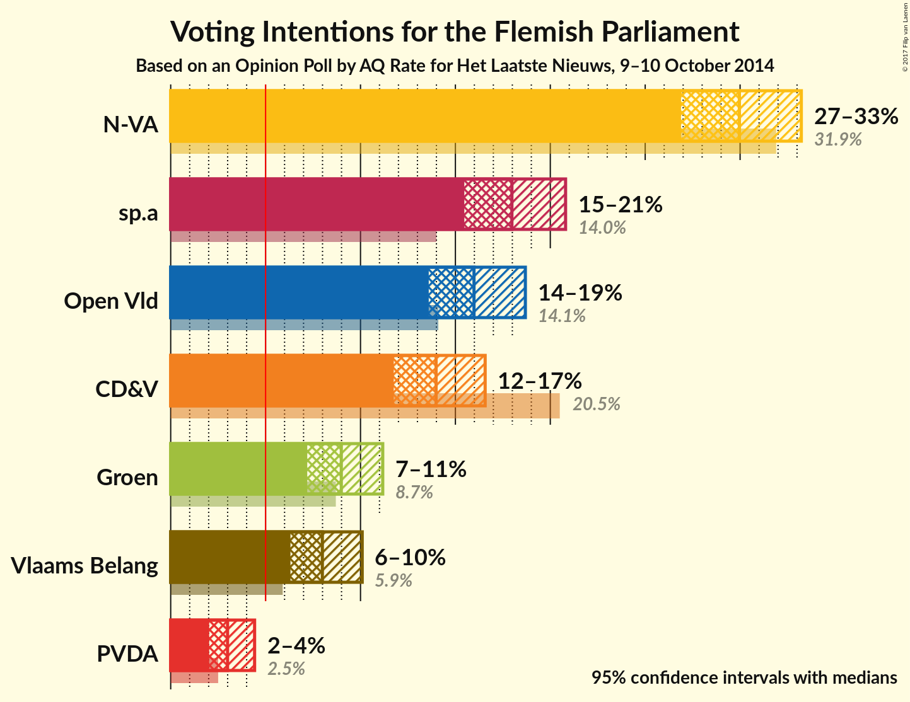
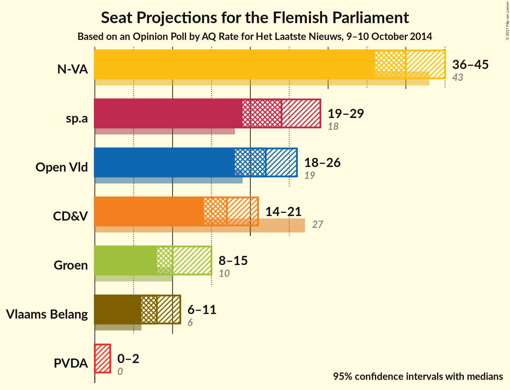
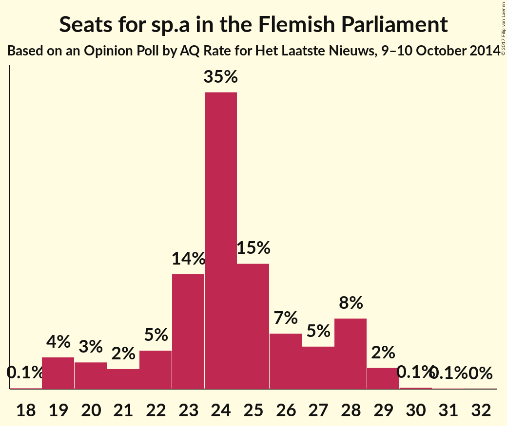
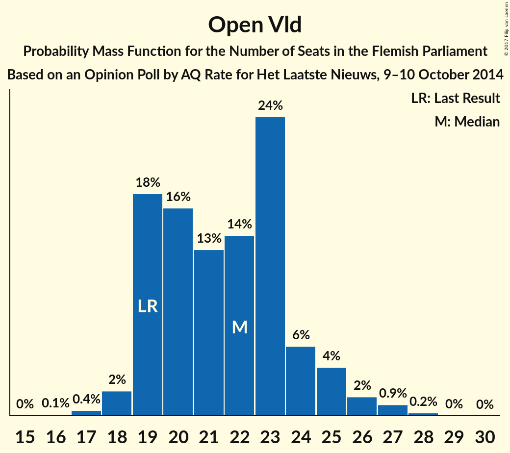
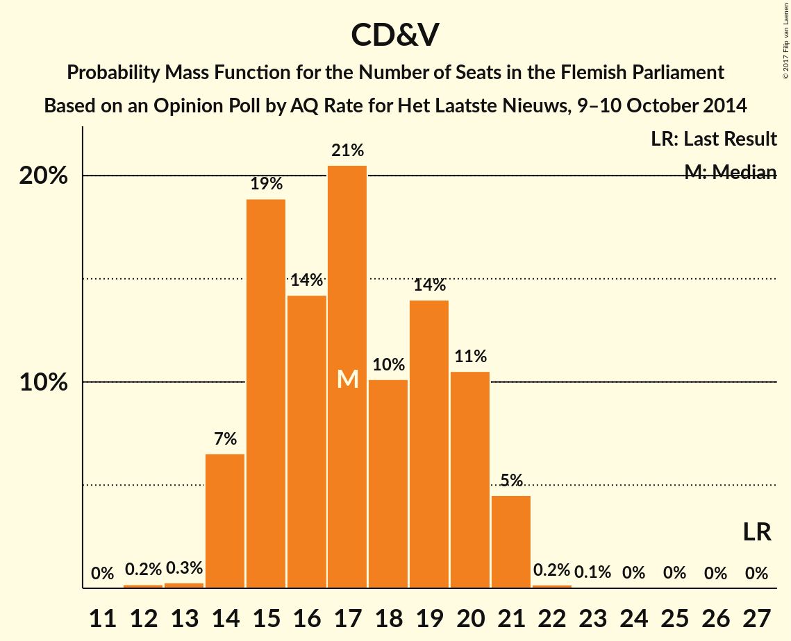
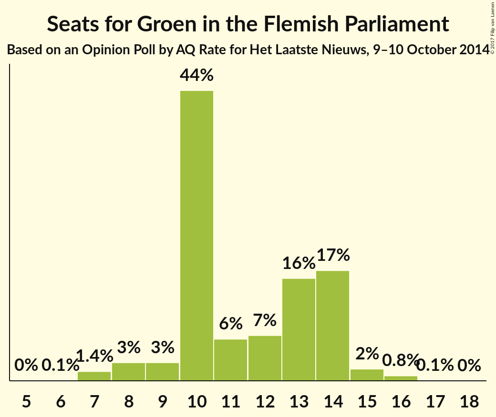
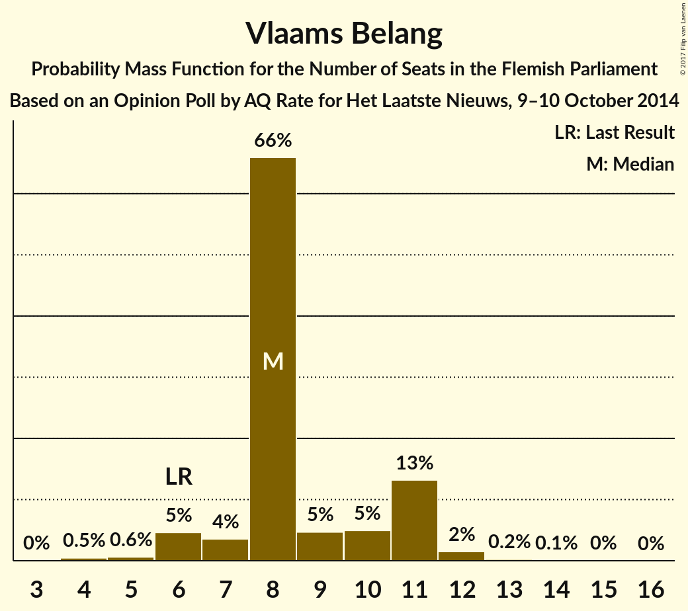
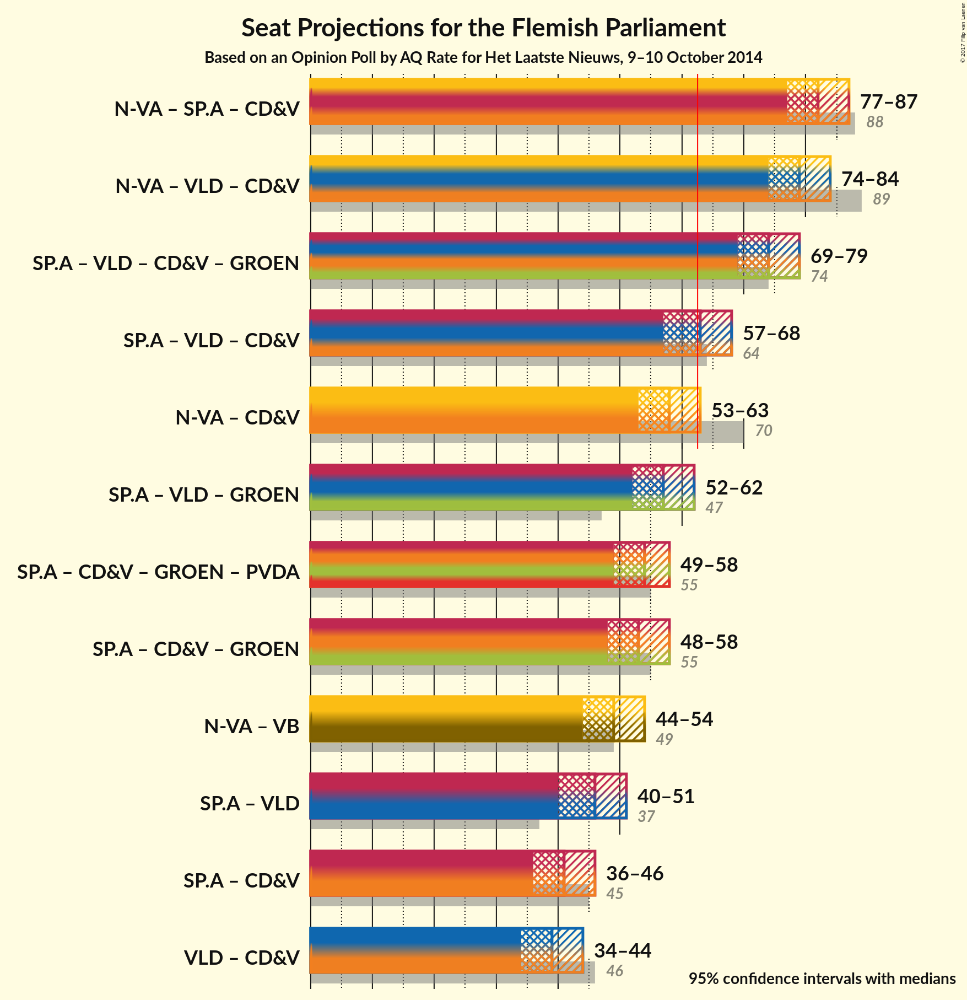

# Opinion Poll by AQ Rate for Het Laatste Nieuws, 9–10 October 2014

<a href="#voting-intentions">Voting Intentions</a> | <a href="#seats">Seats</a> | <a href="#coalitions">Coalitions</a> | <a href="#technical-information">Technical Information</a>

## Voting Intentions

### Confidence Intervals

| Party | Last Result | Poll Result | 80% Confidence Interval | 90% Confidence Interval | 95% Confidence Interval | 99% Confidence Interval |
|:-----:|:-----------:|:-----------:|:-----------------------:|:-----------------------:|:-----------------------:|:-----------------------:|
| N-VA | 31.9% | 30.0% | 27.9–32.1% |27.4–32.7% |26.9–33.2% |25.9–34.3% |
| sp.a | 14.0% | 18.0% | 16.3–19.8% |15.9–20.3% |15.5–20.8% |14.7–21.7% |
| Open Vld | 14.1% | 16.0% | 14.4–17.8% |14.0–18.2% |13.6–18.7% |12.9–19.6% |
| CD&V | 20.5% | 14.0% | 12.5–15.7% |12.1–16.1% |11.8–16.6% |11.1–17.4% |
| Groen | 8.7% | 9.0% | 7.8–10.4% |7.5–10.8% |7.2–11.2% |6.7–11.9% |
| Vlaams Belang | 5.9% | 8.0% | 6.9–9.4% |6.6–9.7% |6.3–10.1% |5.8–10.8% |
| PVDA | 2.5% | 3.0% | 2.3–3.9% |2.2–4.2% |2.0–4.4% |1.8–4.9% |

*Note:* The poll result column reflects the actual value used in the calculations. Published results may vary slightly, and in addition be rounded to fewer digits.

## Seats

### Confidence Intervals

| Party | Last Result | Median | 80% Confidence Interval | 90% Confidence Interval | 95% Confidence Interval | 99% Confidence Interval |
|:-----:|:-----------:|:------:|:-----------------------:|:-----------------------:|:-----------------------:|:-----------------------:|
| <a href="#n-va">N-VA</a> | 43 | 40 | 38–43 |37–45 |36–45 |35–46 |
| <a href="#sp.a">sp.a</a> | 18 | 24 | 22–28 |20–28 |19–29 |19–29 |
| <a href="#open-vld">Open Vld</a> | 19 | 22 | 19–24 |19–25 |18–26 |17–27 |
| <a href="#cd&v">CD&V</a> | 27 | 17 | 15–20 |14–20 |14–21 |14–21 |
| <a href="#groen">Groen</a> | 10 | 10 | 10–14 |9–14 |8–15 |7–16 |
| <a href="#vlaams-belang">Vlaams Belang</a> | 6 | 8 | 8–11 |6–11 |6–11 |4–12 |
| <a href="#pvda">PVDA</a> | 0 | 0 | 0–2 |0–2 |0–2 |0–2 |

### N-VA

*For a full overview of the results for this party, see the [N-VA](party-nva.html) page.*

| Number of Seats | Probability | Accumulated | Special Marks |
|:---------------:|:-----------:|:-----------:|:-------------:|
| 33 | 0.1% | 100% |  |
| 34 | 0.3% | 99.9% |  |
| 35 | 1.3% | 99.6% |  |
| 36 | 2% | 98% |  |
| 37 | 6% | 96% |  |
| 38 | 11% | 91% |  |
| 39 | 21% | 80% |  |
| 40 | 14% | 59% | Median |
| 41 | 11% | 45% |  |
| 42 | 12% | 34% |  |
| 43 | 12% | 22% | Last Result |
| 44 | 4% | 10% |  |
| 45 | 3% | 5% |  |
| 46 | 1.4% | 2% |  |
| 47 | 0.2% | 0.4% |  |
| 48 | 0.1% | 0.1% |  |
| 49 | 0% | 0% |  |

### sp.a

*For a full overview of the results for this party, see the [sp.a](party-spa.html) page.*

| Number of Seats | Probability | Accumulated | Special Marks |
|:---------------:|:-----------:|:-----------:|:-------------:|
| 18 | 0.1% | 100% | Last Result |
| 19 | 4% | 99.9% |  |
| 20 | 3% | 96% |  |
| 21 | 2% | 93% |  |
| 22 | 5% | 91% |  |
| 23 | 14% | 86% |  |
| 24 | 35% | 73% | Median |
| 25 | 15% | 37% |  |
| 26 | 7% | 23% |  |
| 27 | 5% | 16% |  |
| 28 | 8% | 11% |  |
| 29 | 2% | 3% |  |
| 30 | 0.1% | 0.2% |  |
| 31 | 0.1% | 0.1% |  |
| 32 | 0% | 0% |  |

### Open Vld

*For a full overview of the results for this party, see the [Open Vld](party-openvld.html) page.*

| Number of Seats | Probability | Accumulated | Special Marks |
|:---------------:|:-----------:|:-----------:|:-------------:|
| 15 | 0% | 100% |  |
| 16 | 0.1% | 99.9% |  |
| 17 | 0.4% | 99.8% |  |
| 18 | 2% | 99.4% |  |
| 19 | 18% | 97% | Last Result |
| 20 | 16% | 80% |  |
| 21 | 13% | 63% |  |
| 22 | 14% | 50% | Median |
| 23 | 24% | 36% |  |
| 24 | 6% | 12% |  |
| 25 | 4% | 7% |  |
| 26 | 2% | 3% |  |
| 27 | 0.9% | 1.2% |  |
| 28 | 0.2% | 0.3% |  |
| 29 | 0% | 0.1% |  |
| 30 | 0% | 0% |  |

### CD&V

*For a full overview of the results for this party, see the [CD&V](party-cdv.html) page.*

| Number of Seats | Probability | Accumulated | Special Marks |
|:---------------:|:-----------:|:-----------:|:-------------:|
| 12 | 0.2% | 100% |  |
| 13 | 0.3% | 99.8% |  |
| 14 | 7% | 99.5% |  |
| 15 | 19% | 93% |  |
| 16 | 14% | 74% |  |
| 17 | 21% | 60% | Median |
| 18 | 10% | 39% |  |
| 19 | 14% | 29% |  |
| 20 | 11% | 15% |  |
| 21 | 5% | 5% |  |
| 22 | 0.2% | 0.3% |  |
| 23 | 0.1% | 0.1% |  |
| 24 | 0% | 0% |  |
| 25 | 0% | 0% |  |
| 26 | 0% | 0% |  |
| 27 | 0% | 0% | Last Result |

### Groen

*For a full overview of the results for this party, see the [Groen](party-groen.html) page.*

| Number of Seats | Probability | Accumulated | Special Marks |
|:---------------:|:-----------:|:-----------:|:-------------:|
| 6 | 0.1% | 100% |  |
| 7 | 1.4% | 99.9% |  |
| 8 | 3% | 98% |  |
| 9 | 3% | 96% |  |
| 10 | 44% | 93% | Last Result, Median |
| 11 | 6% | 49% |  |
| 12 | 7% | 42% |  |
| 13 | 16% | 35% |  |
| 14 | 17% | 20% |  |
| 15 | 2% | 3% |  |
| 16 | 0.8% | 0.9% |  |
| 17 | 0.1% | 0.1% |  |
| 18 | 0% | 0% |  |

### Vlaams Belang

*For a full overview of the results for this party, see the [Vlaams Belang](party-vlaamsbelang.html) page.*

| Number of Seats | Probability | Accumulated | Special Marks |
|:---------------:|:-----------:|:-----------:|:-------------:|
| 4 | 0.5% | 100% |  |
| 5 | 0.6% | 99.5% |  |
| 6 | 5% | 98.9% | Last Result |
| 7 | 4% | 94% |  |
| 8 | 66% | 91% | Median |
| 9 | 5% | 25% |  |
| 10 | 5% | 20% |  |
| 11 | 13% | 15% |  |
| 12 | 2% | 2% |  |
| 13 | 0.2% | 0.4% |  |
| 14 | 0.1% | 0.2% |  |
| 15 | 0% | 0.1% |  |
| 16 | 0% | 0% |  |

### PVDA

*For a full overview of the results for this party, see the [PVDA](party-pvda.html) page.*

| Number of Seats | Probability | Accumulated | Special Marks |
|:---------------:|:-----------:|:-----------:|:-------------:|
| 0 | 62% | 100% | Last Result, Median |
| 1 | 14% | 38% |  |
| 2 | 24% | 24% |  |
| 3 | 0.2% | 0.3% |  |
| 4 | 0% | 0.1% |  |
| 5 | 0.1% | 0.1% |  |
| 6 | 0% | 0% |  |

## Coalitions

### Confidence Intervals

| Coalition | Last Result | Median | Majority? | 80% Confidence Interval | 90% Confidence Interval | 95% Confidence Interval | 99% Confidence Interval |
|:---------:|:-----------:|:------:|:---------:|:-----------------------:|:-----------------------:|:-----------------------:|:-----------------------:|
| N-VA – sp.a – CD&V | 88 | 82 | 100% | 78–85 | 77–86 | 77–87 | 75–88 |
| N-VA – Open Vld – CD&V | 89 | 79 | 100% | 76–82 | 75–83 | 74–84 | 72–86 |
| sp.a – Open Vld – CD&V – Groen | 74 | 74 | 100% | 71–77 | 70–78 | 69–79 | 68–81 |
| sp.a – Open Vld – CD&V | 64 | 63 | 59% | 59–67 | 58–67 | 57–68 | 56–70 |
| N-VA – CD&V | 70 | 58 | 3% | 54–61 | 53–62 | 53–63 | 51–64 |
| sp.a – Open Vld – Groen | 47 | 57 | 2% | 53–60 | 53–61 | 52–62 | 50–64 |
| sp.a – CD&V – Groen – PVDA | 55 | 54 | 0% | 50–57 | 49–58 | 49–58 | 47–60 |
| sp.a – CD&V – Groen | 55 | 53 | 0% | 49–56 | 49–57 | 48–58 | 46–59 |
| N-VA – Vlaams Belang | 49 | 49 | 0% | 46–52 | 45–53 | 44–54 | 43–55 |
| sp.a – Open Vld | 37 | 46 | 0% | 43–49 | 41–50 | 40–51 | 38–52 |
| sp.a – CD&V | 45 | 41 | 0% | 38–45 | 37–46 | 36–46 | 35–48 |
| Open Vld – CD&V | 46 | 39 | 0% | 35–42 | 34–43 | 34–44 | 33–45 |

### N-VA – sp.a – CD&V

| Number of Seats | Probability | Accumulated | Special Marks |
|:---------------:|:-----------:|:-----------:|:-------------:|
| 73 | 0.1% | 100% |  |
| 74 | 0.3% | 99.9% |  |
| 75 | 0.7% | 99.6% |  |
| 76 | 1.2% | 98.8% |  |
| 77 | 4% | 98% |  |
| 78 | 5% | 94% |  |
| 79 | 6% | 88% |  |
| 80 | 10% | 82% |  |
| 81 | 13% | 73% | Median |
| 82 | 17% | 60% |  |
| 83 | 19% | 43% |  |
| 84 | 10% | 23% |  |
| 85 | 6% | 14% |  |
| 86 | 4% | 8% |  |
| 87 | 2% | 3% |  |
| 88 | 0.9% | 1.1% | Last Result |
| 89 | 0.1% | 0.2% |  |
| 90 | 0% | 0.1% |  |
| 91 | 0% | 0% |  |

### N-VA – Open Vld – CD&V

| Number of Seats | Probability | Accumulated | Special Marks |
|:---------------:|:-----------:|:-----------:|:-------------:|
| 70 | 0.1% | 100% |  |
| 71 | 0.2% | 99.9% |  |
| 72 | 0.5% | 99.7% |  |
| 73 | 2% | 99.2% |  |
| 74 | 3% | 98% |  |
| 75 | 4% | 95% |  |
| 76 | 6% | 91% |  |
| 77 | 12% | 85% |  |
| 78 | 13% | 73% |  |
| 79 | 19% | 60% | Median |
| 80 | 12% | 40% |  |
| 81 | 8% | 28% |  |
| 82 | 11% | 20% |  |
| 83 | 5% | 9% |  |
| 84 | 2% | 4% |  |
| 85 | 1.1% | 2% |  |
| 86 | 0.5% | 0.8% |  |
| 87 | 0.2% | 0.3% |  |
| 88 | 0.1% | 0.1% |  |
| 89 | 0% | 0% | Last Result |

### sp.a – Open Vld – CD&V – Groen

| Number of Seats | Probability | Accumulated | Special Marks |
|:---------------:|:-----------:|:-----------:|:-------------:|
| 66 | 0.1% | 100% |  |
| 67 | 0.3% | 99.9% |  |
| 68 | 0.9% | 99.6% |  |
| 69 | 2% | 98.7% |  |
| 70 | 5% | 96% |  |
| 71 | 7% | 91% |  |
| 72 | 9% | 84% |  |
| 73 | 14% | 76% | Median |
| 74 | 14% | 62% | Last Result |
| 75 | 12% | 48% |  |
| 76 | 14% | 36% |  |
| 77 | 12% | 21% |  |
| 78 | 6% | 10% |  |
| 79 | 2% | 4% |  |
| 80 | 1.1% | 2% |  |
| 81 | 0.4% | 0.6% |  |
| 82 | 0.1% | 0.1% |  |
| 83 | 0% | 0% |  |

### sp.a – Open Vld – CD&V

| Number of Seats | Probability | Accumulated | Special Marks |
|:---------------:|:-----------:|:-----------:|:-------------:|
| 54 | 0.1% | 100% |  |
| 55 | 0.2% | 99.9% |  |
| 56 | 0.7% | 99.6% |  |
| 57 | 2% | 98.9% |  |
| 58 | 4% | 97% |  |
| 59 | 6% | 93% |  |
| 60 | 8% | 87% |  |
| 61 | 11% | 79% |  |
| 62 | 10% | 68% |  |
| 63 | 15% | 59% | Median, Majority |
| 64 | 15% | 44% | Last Result |
| 65 | 8% | 29% |  |
| 66 | 10% | 20% |  |
| 67 | 7% | 11% |  |
| 68 | 2% | 4% |  |
| 69 | 1.0% | 2% |  |
| 70 | 0.5% | 0.7% |  |
| 71 | 0.2% | 0.2% |  |
| 72 | 0% | 0.1% |  |
| 73 | 0% | 0% |  |

### N-VA – CD&V

| Number of Seats | Probability | Accumulated | Special Marks |
|:---------------:|:-----------:|:-----------:|:-------------:|
| 49 | 0.1% | 100% |  |
| 50 | 0.3% | 99.9% |  |
| 51 | 0.5% | 99.7% |  |
| 52 | 1.2% | 99.2% |  |
| 53 | 4% | 98% |  |
| 54 | 7% | 94% |  |
| 55 | 9% | 88% |  |
| 56 | 12% | 79% |  |
| 57 | 15% | 67% | Median |
| 58 | 16% | 52% |  |
| 59 | 16% | 36% |  |
| 60 | 9% | 21% |  |
| 61 | 5% | 12% |  |
| 62 | 3% | 7% |  |
| 63 | 2% | 3% | Majority |
| 64 | 0.8% | 1.1% |  |
| 65 | 0.2% | 0.3% |  |
| 66 | 0.1% | 0.1% |  |
| 67 | 0% | 0% |  |
| 68 | 0% | 0% |  |
| 69 | 0% | 0% |  |
| 70 | 0% | 0% | Last Result |

### sp.a – Open Vld – Groen

| Number of Seats | Probability | Accumulated | Special Marks |
|:---------------:|:-----------:|:-----------:|:-------------:|
| 47 | 0% | 100% | Last Result |
| 48 | 0.1% | 100% |  |
| 49 | 0.1% | 99.9% |  |
| 50 | 0.4% | 99.8% |  |
| 51 | 0.9% | 99.4% |  |
| 52 | 3% | 98.5% |  |
| 53 | 6% | 96% |  |
| 54 | 6% | 90% |  |
| 55 | 9% | 84% |  |
| 56 | 13% | 75% | Median |
| 57 | 20% | 62% |  |
| 58 | 13% | 43% |  |
| 59 | 11% | 30% |  |
| 60 | 9% | 19% |  |
| 61 | 5% | 10% |  |
| 62 | 3% | 5% |  |
| 63 | 1.0% | 2% | Majority |
| 64 | 0.4% | 0.6% |  |
| 65 | 0.2% | 0.3% |  |
| 66 | 0% | 0% |  |

### sp.a – CD&V – Groen – PVDA

| Number of Seats | Probability | Accumulated | Special Marks |
|:---------------:|:-----------:|:-----------:|:-------------:|
| 44 | 0.1% | 100% |  |
| 45 | 0.1% | 99.9% |  |
| 46 | 0.2% | 99.8% |  |
| 47 | 0.7% | 99.6% |  |
| 48 | 1.4% | 98.9% |  |
| 49 | 5% | 98% |  |
| 50 | 8% | 92% |  |
| 51 | 10% | 85% | Median |
| 52 | 10% | 74% |  |
| 53 | 14% | 64% |  |
| 54 | 11% | 50% |  |
| 55 | 17% | 39% | Last Result |
| 56 | 11% | 22% |  |
| 57 | 5% | 11% |  |
| 58 | 4% | 6% |  |
| 59 | 1.4% | 2% |  |
| 60 | 0.6% | 0.9% |  |
| 61 | 0.2% | 0.3% |  |
| 62 | 0.1% | 0.1% |  |
| 63 | 0% | 0% | Majority |

### sp.a – CD&V – Groen

| Number of Seats | Probability | Accumulated | Special Marks |
|:---------------:|:-----------:|:-----------:|:-------------:|
| 44 | 0.1% | 100% |  |
| 45 | 0.2% | 99.9% |  |
| 46 | 0.5% | 99.7% |  |
| 47 | 1.0% | 99.2% |  |
| 48 | 2% | 98% |  |
| 49 | 7% | 96% |  |
| 50 | 10% | 89% |  |
| 51 | 12% | 79% | Median |
| 52 | 11% | 67% |  |
| 53 | 14% | 56% |  |
| 54 | 14% | 42% |  |
| 55 | 14% | 28% | Last Result |
| 56 | 8% | 14% |  |
| 57 | 3% | 7% |  |
| 58 | 3% | 4% |  |
| 59 | 0.7% | 1.1% |  |
| 60 | 0.3% | 0.4% |  |
| 61 | 0.1% | 0.1% |  |
| 62 | 0% | 0% |  |

### N-VA – Vlaams Belang

| Number of Seats | Probability | Accumulated | Special Marks |
|:---------------:|:-----------:|:-----------:|:-------------:|
| 41 | 0.1% | 100% |  |
| 42 | 0.3% | 99.9% |  |
| 43 | 1.1% | 99.6% |  |
| 44 | 2% | 98.5% |  |
| 45 | 4% | 97% |  |
| 46 | 8% | 92% |  |
| 47 | 17% | 84% |  |
| 48 | 14% | 67% | Median |
| 49 | 13% | 53% | Last Result |
| 50 | 13% | 40% |  |
| 51 | 11% | 27% |  |
| 52 | 6% | 15% |  |
| 53 | 6% | 10% |  |
| 54 | 3% | 4% |  |
| 55 | 0.6% | 1.0% |  |
| 56 | 0.3% | 0.4% |  |
| 57 | 0.1% | 0.1% |  |
| 58 | 0% | 0% |  |

### sp.a – Open Vld

| Number of Seats | Probability | Accumulated | Special Marks |
|:---------------:|:-----------:|:-----------:|:-------------:|
| 37 | 0% | 100% | Last Result |
| 38 | 0.5% | 100% |  |
| 39 | 0.9% | 99.5% |  |
| 40 | 1.1% | 98.5% |  |
| 41 | 2% | 97% |  |
| 42 | 5% | 95% |  |
| 43 | 12% | 90% |  |
| 44 | 12% | 79% |  |
| 45 | 13% | 67% |  |
| 46 | 12% | 54% | Median |
| 47 | 19% | 43% |  |
| 48 | 9% | 24% |  |
| 49 | 7% | 15% |  |
| 50 | 5% | 8% |  |
| 51 | 2% | 4% |  |
| 52 | 1.2% | 2% |  |
| 53 | 0.3% | 0.4% |  |
| 54 | 0.1% | 0.1% |  |
| 55 | 0% | 0% |  |

### sp.a – CD&V

| Number of Seats | Probability | Accumulated | Special Marks |
|:---------------:|:-----------:|:-----------:|:-------------:|
| 33 | 0.1% | 100% |  |
| 34 | 0.3% | 99.9% |  |
| 35 | 0.9% | 99.5% |  |
| 36 | 2% | 98.6% |  |
| 37 | 4% | 97% |  |
| 38 | 6% | 93% |  |
| 39 | 12% | 87% |  |
| 40 | 14% | 75% |  |
| 41 | 12% | 62% | Median |
| 42 | 12% | 50% |  |
| 43 | 15% | 38% |  |
| 44 | 11% | 23% |  |
| 45 | 8% | 13% | Last Result |
| 46 | 3% | 5% |  |
| 47 | 1.4% | 2% |  |
| 48 | 0.5% | 0.8% |  |
| 49 | 0.2% | 0.2% |  |
| 50 | 0% | 0.1% |  |
| 51 | 0% | 0% |  |

### Open Vld – CD&V

| Number of Seats | Probability | Accumulated | Special Marks |
|:---------------:|:-----------:|:-----------:|:-------------:|
| 31 | 0.1% | 100% |  |
| 32 | 0.3% | 99.9% |  |
| 33 | 1.2% | 99.6% |  |
| 34 | 4% | 98% |  |
| 35 | 6% | 94% |  |
| 36 | 9% | 89% |  |
| 37 | 14% | 79% |  |
| 38 | 12% | 65% |  |
| 39 | 16% | 53% | Median |
| 40 | 14% | 37% |  |
| 41 | 9% | 23% |  |
| 42 | 8% | 14% |  |
| 43 | 3% | 6% |  |
| 44 | 2% | 3% |  |
| 45 | 0.6% | 0.9% |  |
| 46 | 0.2% | 0.3% | Last Result |
| 47 | 0.1% | 0.2% |  |
| 48 | 0.1% | 0.1% |  |
| 49 | 0% | 0% |  |

## Technical Information

### Opinion Poll

+ **Polling firm:** AQ Rate
+ **Commissioner(s):** Het Laatste Nieuws
+ **Fieldwork period:** 9–10 October 2014

### Calculations

+ **Sample size:** 801
+ **Simulations done:** 2,097,152
+ **Error estimate:** 0.94%

