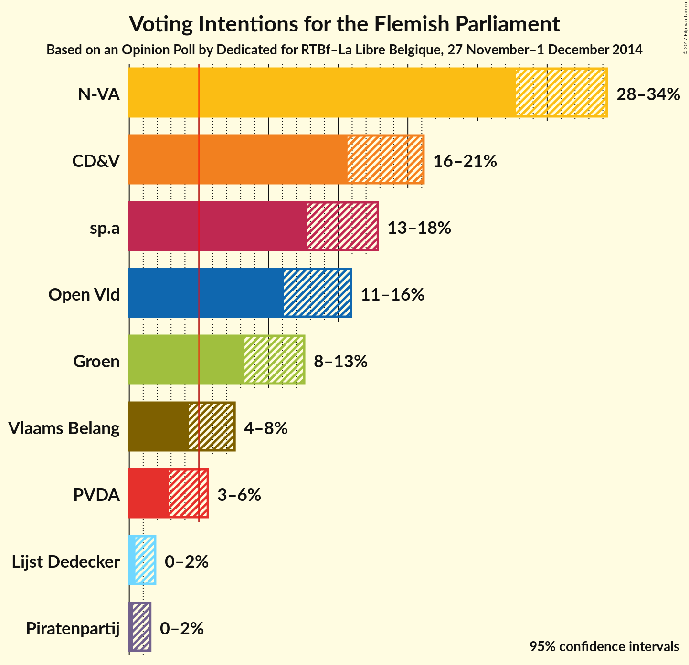
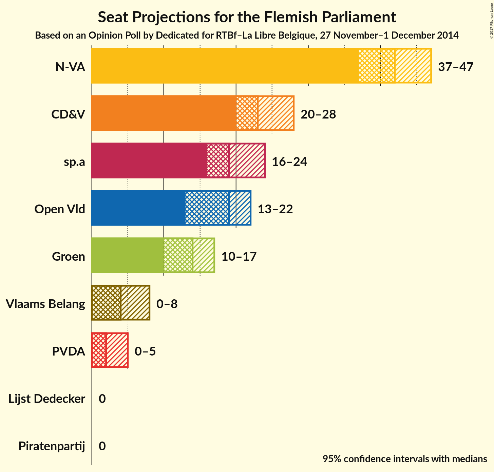
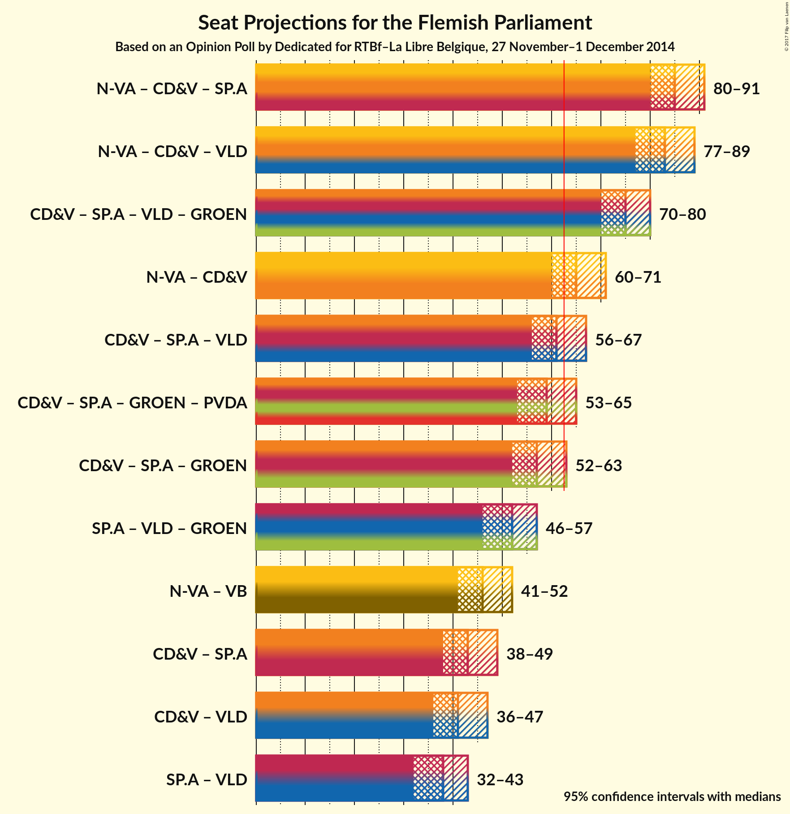

# Opinion Poll by Dedicated for RTBf–La Libre Belgique, 27 November–1 December 2014

<a href="#voting-intentions">Voting Intentions</a> | <a href="#seats">Seats</a> | <a href="#coalitions">Coalitions</a> | <a href="#technical-information">Technical Information</a>

## Voting Intentions

### Confidence Intervals

| Party | Last Result | Poll Result | 80% Confidence Interval | 90% Confidence Interval | 95% Confidence Interval | 99% Confidence Interval |
|:-----:|:-----------:|:-----------:|:-----------------------:|:-----------------------:|:-----------------------:|:-----------------------:|
| N-VA | 31.9% | 31.2% | 28.8–33.1% |28.3–33.7% |27.8–34.3% |26.8–35.3% |
| CD&V | 20.5% | 18.4% | 16.6–20.1% |16.1–20.7% |15.7–21.1% |14.9–22.1% |
| sp.a | 14.0% | 15.3% | 13.6–16.9% |13.2–17.4% |12.8–17.8% |12.1–18.7% |
| Open Vld | 14.1% | 13.4% | 11.9–15.0% |11.5–15.5% |11.1–15.9% |10.4–16.8% |
| Groen | 8.7% | 10.3% | 8.9–11.8% |8.6–12.2% |8.3–12.6% |7.7–13.3% |
| Vlaams Belang | 5.9% | 5.7% | 4.8–6.9% |4.5–7.3% |4.3–7.6% |3.9–8.2% |
| PVDA | 2.5% | 4.0% | 3.2–5.1% |3.0–5.4% |2.8–5.6% |2.5–6.2% |
| Lijst Dedecker | 0.0% | 0.9% | 0.6–1.5% |0.5–1.7% |0.4–1.9% |0.3–2.2% |
| Piratenpartij | 0.6% | 0.7% | 0.4–1.2% |0.3–1.4% |0.3–1.5% |0.2–1.8% |

*Note:* The poll result column reflects the actual value used in the calculations. Published results may vary slightly, and in addition be rounded to fewer digits.

## Seats

### Confidence Intervals

| Party | Last Result | Median | 80% Confidence Interval | 90% Confidence Interval | 95% Confidence Interval | 99% Confidence Interval |
|:-----:|:-----------:|:------:|:-----------------------:|:-----------------------:|:-----------------------:|:-----------------------:|
| <a href="#n-va">N-VA</a> | 43 | 42 | 38–44 |38–46 |37–46 |36–48 |
| <a href="#cd&v">CD&V</a> | 27 | 23 | 20–27 |20–27 |20–28 |19–29 |
| <a href="#sp.a">sp.a</a> | 18 | 19 | 18–23 |17–24 |16–24 |14–25 |
| <a href="#open-vld">Open Vld</a> | 19 | 19 | 15–19 |14–20 |13–21 |13–23 |
| <a href="#groen">Groen</a> | 10 | 14 | 10–15 |10–16 |10–17 |10–17 |
| <a href="#vlaams-belang">Vlaams Belang</a> | 6 | 4 | 3–7 |2–8 |1–8 |0–8 |
| <a href="#pvda">PVDA</a> | 0 | 2 | 0–2 |0–4 |0–5 |0–5 |
| <a href="#lijst-dedecker">Lijst Dedecker</a> | 0 | 0 | 0 |0 |0 |0 |
| <a href="#piratenpartij">Piratenpartij</a> | 0 | 0 | 0 |0 |0 |0 |

### N-VA

| Number of Seats | Probability | Accumulated |
|:---------------:|:-----------:|:-----------:|
| 34 | 0% | 100% |
| 35 | 0.2% | 99.9% |
| 36 | 0.5% | 99.8% |
| 37 | 3% | 99.2% |
| 38 | 8% | 96% |
| 39 | 6% | 88% |
| 40 | 12% | 82% |
| 41 | 12% | 70% |
| 42 | 22% | 59% |
| 43 | 22% | 37% |
| 44 | 6% | 15% |
| 45 | 3% | 9% |
| 46 | 4% | 6% |
| 47 | 2% | 2% |
| 48 | 0.4% | 0.6% |
| 49 | 0.1% | 0.2% |
| 50 | 0.1% | 0.1% |
| 51 | 0% | 0.1% |
| 52 | 0% | 0% |

### CD&V

| Number of Seats | Probability | Accumulated |
|:---------------:|:-----------:|:-----------:|
| 18 | 0.2% | 100% |
| 19 | 1.1% | 99.8% |
| 20 | 9% | 98.7% |
| 21 | 17% | 90% |
| 22 | 20% | 73% |
| 23 | 8% | 53% |
| 24 | 19% | 45% |
| 25 | 9% | 26% |
| 26 | 6% | 17% |
| 27 | 8% | 11% |
| 28 | 1.1% | 3% |
| 29 | 1.3% | 2% |
| 30 | 0.2% | 0.4% |
| 31 | 0.1% | 0.1% |
| 32 | 0% | 0% |

### sp.a

| Number of Seats | Probability | Accumulated |
|:---------------:|:-----------:|:-----------:|
| 14 | 1.0% | 100% |
| 15 | 0.5% | 99.0% |
| 16 | 1.3% | 98.5% |
| 17 | 3% | 97% |
| 18 | 6% | 94% |
| 19 | 49% | 89% |
| 20 | 8% | 40% |
| 21 | 11% | 32% |
| 22 | 8% | 20% |
| 23 | 6% | 12% |
| 24 | 5% | 6% |
| 25 | 0.8% | 1.2% |
| 26 | 0.3% | 0.4% |
| 27 | 0.1% | 0.1% |
| 28 | 0% | 0% |

### Open Vld

| Number of Seats | Probability | Accumulated |
|:---------------:|:-----------:|:-----------:|
| 12 | 0.4% | 100% |
| 13 | 4% | 99.6% |
| 14 | 2% | 96% |
| 15 | 4% | 94% |
| 16 | 5% | 90% |
| 17 | 8% | 85% |
| 18 | 10% | 77% |
| 19 | 57% | 67% |
| 20 | 6% | 10% |
| 21 | 2% | 4% |
| 22 | 1.0% | 2% |
| 23 | 0.6% | 0.8% |
| 24 | 0.1% | 0.2% |
| 25 | 0.1% | 0.1% |
| 26 | 0% | 0% |

### Groen

| Number of Seats | Probability | Accumulated |
|:---------------:|:-----------:|:-----------:|
| 7 | 0.1% | 100% |
| 8 | 0.2% | 99.9% |
| 9 | 0.2% | 99.7% |
| 10 | 10% | 99.5% |
| 11 | 3% | 90% |
| 12 | 3% | 87% |
| 13 | 8% | 84% |
| 14 | 55% | 76% |
| 15 | 14% | 21% |
| 16 | 4% | 7% |
| 17 | 3% | 3% |
| 18 | 0.2% | 0.3% |
| 19 | 0% | 0.1% |
| 20 | 0% | 0% |

### Vlaams Belang

| Number of Seats | Probability | Accumulated |
|:---------------:|:-----------:|:-----------:|
| 0 | 2% | 100% |
| 1 | 2% | 98% |
| 2 | 2% | 96% |
| 3 | 18% | 94% |
| 4 | 39% | 77% |
| 5 | 2% | 38% |
| 6 | 26% | 36% |
| 7 | 3% | 10% |
| 8 | 7% | 7% |
| 9 | 0% | 0.1% |
| 10 | 0% | 0% |

### PVDA

| Number of Seats | Probability | Accumulated |
|:---------------:|:-----------:|:-----------:|
| 0 | 10% | 100% |
| 1 | 10% | 90% |
| 2 | 72% | 80% |
| 3 | 2% | 8% |
| 4 | 0.8% | 6% |
| 5 | 5% | 5% |
| 6 | 0% | 0% |

### Lijst Dedecker

| Number of Seats | Probability | Accumulated |
|:---------------:|:-----------:|:-----------:|
| 0 | 100% | 100% |
| 1 | 0% | 0% |

### Piratenpartij

| Number of Seats | Probability | Accumulated |
|:---------------:|:-----------:|:-----------:|
| 0 | 100% | 100% |
| 1 | 0% | 0% |

## Coalitions

### Confidence Intervals

| Coalition | Last Result | Median | 80% Confidence Interval | 90% Confidence Interval | 95% Confidence Interval | 99% Confidence Interval |
|:---------:|:-----------:|:------:|:-----------------------:|:-----------------------:|:-----------------------:|:-----------------------:|
| N-VA – CD&V – sp.a | 88 | 84 | 82–89 | 81–89 | 80–90 | 78–92 |
| N-VA – CD&V – Open Vld | 89 | 83 | 80–86 | 78–88 | 77–89 | 76–91 |
| CD&V – sp.a – Open Vld – Groen | 74 | 75 | 72–78 | 71–80 | 69–80 | 68–82 |
| N-VA – CD&V | 70 | 65 | 62–68 | 61–70 | 60–71 | 58–73 |
| CD&V – sp.a – Open Vld | 64 | 61 | 58–65 | 57–66 | 56–67 | 54–68 |
| CD&V – sp.a – Groen – PVDA | 55 | 59 | 55–62 | 54–63 | 53–65 | 52–66 |
| CD&V – sp.a – Groen | 55 | 57 | 54–61 | 52–61 | 52–63 | 50–64 |
| sp.a – Open Vld – Groen | 47 | 52 | 48–55 | 47–56 | 46–57 | 44–58 |
| N-VA – Vlaams Belang | 49 | 46 | 43–49 | 42–51 | 42–52 | 40–53 |
| CD&V – sp.a | 45 | 43 | 40–47 | 39–48 | 38–49 | 36–51 |
| CD&V – Open Vld | 46 | 41 | 38–45 | 37–46 | 36–47 | 34–48 |
| sp.a – Open Vld | 37 | 38 | 35–41 | 33–42 | 32–42 | 31–44 |

### N-VA – CD&V – sp.a

| Number of Seats | Probability | Accumulated |
|:---------------:|:-----------:|:-----------:|
| 76 | 0.1% | 100% |
| 77 | 0.3% | 99.9% |
| 78 | 0.2% | 99.6% |
| 79 | 1.1% | 99.4% |
| 80 | 1.2% | 98% |
| 81 | 7% | 97% |
| 82 | 6% | 91% |
| 83 | 6% | 85% |
| 84 | 36% | 79% |
| 85 | 16% | 44% |
| 86 | 8% | 27% |
| 87 | 4% | 19% |
| 88 | 5% | 15% |
| 89 | 5% | 10% |
| 90 | 3% | 5% |
| 91 | 1.1% | 2% |
| 92 | 0.4% | 0.8% |
| 93 | 0.2% | 0.5% |
| 94 | 0.2% | 0.3% |
| 95 | 0% | 0% |

### N-VA – CD&V – Open Vld

| Number of Seats | Probability | Accumulated |
|:---------------:|:-----------:|:-----------:|
| 74 | 0.1% | 100% |
| 75 | 0.2% | 99.9% |
| 76 | 1.0% | 99.7% |
| 77 | 2% | 98.7% |
| 78 | 4% | 97% |
| 79 | 1.4% | 93% |
| 80 | 3% | 92% |
| 81 | 14% | 88% |
| 82 | 19% | 74% |
| 83 | 7% | 54% |
| 84 | 19% | 47% |
| 85 | 14% | 28% |
| 86 | 5% | 15% |
| 87 | 4% | 9% |
| 88 | 2% | 5% |
| 89 | 2% | 3% |
| 90 | 1.3% | 2% |
| 91 | 0.3% | 0.6% |
| 92 | 0.2% | 0.2% |
| 93 | 0% | 0.1% |
| 94 | 0% | 0% |

### CD&V – sp.a – Open Vld – Groen

| Number of Seats | Probability | Accumulated |
|:---------------:|:-----------:|:-----------:|
| 65 | 0% | 100% |
| 66 | 0% | 99.9% |
| 67 | 0.2% | 99.9% |
| 68 | 1.1% | 99.7% |
| 69 | 1.1% | 98.6% |
| 70 | 2% | 97% |
| 71 | 3% | 95% |
| 72 | 7% | 92% |
| 73 | 10% | 86% |
| 74 | 23% | 76% |
| 75 | 13% | 53% |
| 76 | 13% | 39% |
| 77 | 4% | 26% |
| 78 | 12% | 22% |
| 79 | 5% | 10% |
| 80 | 4% | 5% |
| 81 | 0.7% | 1.3% |
| 82 | 0.4% | 0.6% |
| 83 | 0.2% | 0.2% |
| 84 | 0% | 0.1% |
| 85 | 0% | 0% |

### N-VA – CD&V

| Number of Seats | Probability | Accumulated |
|:---------------:|:-----------:|:-----------:|
| 57 | 0.1% | 100% |
| 58 | 0.6% | 99.8% |
| 59 | 0.7% | 99.2% |
| 60 | 3% | 98.5% |
| 61 | 4% | 96% |
| 62 | 11% | 92% |
| 63 | 13% | 81% |
| 64 | 8% | 68% |
| 65 | 23% | 60% |
| 66 | 17% | 37% |
| 67 | 7% | 20% |
| 68 | 5% | 13% |
| 69 | 3% | 8% |
| 70 | 2% | 5% |
| 71 | 2% | 3% |
| 72 | 0.8% | 1.3% |
| 73 | 0.4% | 0.5% |
| 74 | 0.1% | 0.1% |
| 75 | 0.1% | 0.1% |
| 76 | 0% | 0% |

### CD&V – sp.a – Open Vld

| Number of Seats | Probability | Accumulated |
|:---------------:|:-----------:|:-----------:|
| 52 | 0% | 100% |
| 53 | 0.1% | 99.9% |
| 54 | 0.4% | 99.8% |
| 55 | 1.0% | 99.4% |
| 56 | 2% | 98% |
| 57 | 3% | 97% |
| 58 | 4% | 94% |
| 59 | 9% | 89% |
| 60 | 23% | 81% |
| 61 | 13% | 58% |
| 62 | 17% | 45% |
| 63 | 8% | 28% |
| 64 | 9% | 21% |
| 65 | 7% | 12% |
| 66 | 2% | 5% |
| 67 | 2% | 4% |
| 68 | 1.4% | 2% |
| 69 | 0.2% | 0.4% |
| 70 | 0.1% | 0.2% |
| 71 | 0% | 0% |

### CD&V – sp.a – Groen – PVDA

| Number of Seats | Probability | Accumulated |
|:---------------:|:-----------:|:-----------:|
| 50 | 0% | 100% |
| 51 | 0.1% | 99.9% |
| 52 | 1.3% | 99.8% |
| 53 | 1.3% | 98.5% |
| 54 | 3% | 97% |
| 55 | 5% | 95% |
| 56 | 7% | 89% |
| 57 | 19% | 82% |
| 58 | 11% | 63% |
| 59 | 17% | 52% |
| 60 | 13% | 35% |
| 61 | 7% | 22% |
| 62 | 7% | 15% |
| 63 | 4% | 8% |
| 64 | 1.1% | 4% |
| 65 | 3% | 3% |
| 66 | 0.3% | 0.5% |
| 67 | 0.2% | 0.3% |
| 68 | 0% | 0.1% |
| 69 | 0% | 0.1% |
| 70 | 0% | 0% |

### CD&V – sp.a – Groen

| Number of Seats | Probability | Accumulated |
|:---------------:|:-----------:|:-----------:|
| 48 | 0.1% | 100% |
| 49 | 0.2% | 99.9% |
| 50 | 0.4% | 99.8% |
| 51 | 1.5% | 99.3% |
| 52 | 3% | 98% |
| 53 | 5% | 95% |
| 54 | 5% | 90% |
| 55 | 23% | 85% |
| 56 | 10% | 61% |
| 57 | 16% | 51% |
| 58 | 7% | 34% |
| 59 | 10% | 27% |
| 60 | 6% | 17% |
| 61 | 6% | 11% |
| 62 | 1.3% | 5% |
| 63 | 3% | 3% |
| 64 | 0.2% | 0.6% |
| 65 | 0.3% | 0.4% |
| 66 | 0% | 0.1% |
| 67 | 0% | 0% |

### sp.a – Open Vld – Groen

| Number of Seats | Probability | Accumulated |
|:---------------:|:-----------:|:-----------:|
| 42 | 0.1% | 100% |
| 43 | 0.1% | 99.9% |
| 44 | 0.7% | 99.8% |
| 45 | 0.8% | 99.1% |
| 46 | 1.4% | 98% |
| 47 | 4% | 97% |
| 48 | 5% | 93% |
| 49 | 6% | 88% |
| 50 | 6% | 82% |
| 51 | 11% | 76% |
| 52 | 31% | 65% |
| 53 | 8% | 33% |
| 54 | 12% | 26% |
| 55 | 4% | 13% |
| 56 | 7% | 10% |
| 57 | 2% | 3% |
| 58 | 0.5% | 0.8% |
| 59 | 0.3% | 0.3% |
| 60 | 0.1% | 0.1% |
| 61 | 0% | 0% |

### N-VA – Vlaams Belang

| Number of Seats | Probability | Accumulated |
|:---------------:|:-----------:|:-----------:|
| 38 | 0.1% | 100% |
| 39 | 0.1% | 99.8% |
| 40 | 0.5% | 99.7% |
| 41 | 0.7% | 99.2% |
| 42 | 6% | 98.5% |
| 43 | 9% | 93% |
| 44 | 7% | 84% |
| 45 | 16% | 77% |
| 46 | 13% | 61% |
| 47 | 24% | 48% |
| 48 | 8% | 25% |
| 49 | 8% | 16% |
| 50 | 3% | 8% |
| 51 | 2% | 5% |
| 52 | 2% | 3% |
| 53 | 1.4% | 2% |
| 54 | 0.2% | 0.3% |
| 55 | 0% | 0.1% |
| 56 | 0% | 0% |

### CD&V – sp.a

| Number of Seats | Probability | Accumulated |
|:---------------:|:-----------:|:-----------:|
| 35 | 0.1% | 100% |
| 36 | 0.4% | 99.9% |
| 37 | 0.9% | 99.5% |
| 38 | 2% | 98.6% |
| 39 | 3% | 97% |
| 40 | 7% | 94% |
| 41 | 18% | 87% |
| 42 | 13% | 69% |
| 43 | 16% | 56% |
| 44 | 13% | 40% |
| 45 | 9% | 27% |
| 46 | 7% | 18% |
| 47 | 5% | 11% |
| 48 | 2% | 6% |
| 49 | 3% | 4% |
| 50 | 0.4% | 1.0% |
| 51 | 0.5% | 0.6% |
| 52 | 0% | 0.1% |
| 53 | 0% | 0% |

### CD&V – Open Vld

| Number of Seats | Probability | Accumulated |
|:---------------:|:-----------:|:-----------:|
| 33 | 0.2% | 100% |
| 34 | 0.4% | 99.8% |
| 35 | 1.3% | 99.4% |
| 36 | 2% | 98% |
| 37 | 3% | 97% |
| 38 | 4% | 94% |
| 39 | 6% | 89% |
| 40 | 17% | 84% |
| 41 | 25% | 66% |
| 42 | 6% | 42% |
| 43 | 20% | 36% |
| 44 | 5% | 16% |
| 45 | 5% | 11% |
| 46 | 4% | 7% |
| 47 | 0.7% | 3% |
| 48 | 2% | 2% |
| 49 | 0.4% | 0.4% |
| 50 | 0% | 0.1% |
| 51 | 0% | 0% |

### sp.a – Open Vld

| Number of Seats | Probability | Accumulated |
|:---------------:|:-----------:|:-----------:|
| 29 | 0% | 100% |
| 30 | 0.2% | 99.9% |
| 31 | 0.7% | 99.7% |
| 32 | 2% | 99.0% |
| 33 | 3% | 97% |
| 34 | 2% | 94% |
| 35 | 3% | 92% |
| 36 | 7% | 90% |
| 37 | 11% | 83% |
| 38 | 37% | 72% |
| 39 | 7% | 35% |
| 40 | 14% | 28% |
| 41 | 7% | 14% |
| 42 | 4% | 7% |
| 43 | 1.4% | 2% |
| 44 | 0.6% | 1.1% |
| 45 | 0.3% | 0.4% |
| 46 | 0.1% | 0.1% |
| 47 | 0% | 0.1% |
| 48 | 0% | 0% |

## Technical Information

### Opinion Poll

+ **Pollster:** Dedicated
+ **Media:** RTBf–La Libre Belgique
+ **Fieldwork period:** 27 November–1 December 2014

### Calculations

+ **Sample size:** 766
+ **Simulations done:** 2,097,152
+ **Error estimate:** 1.66%

