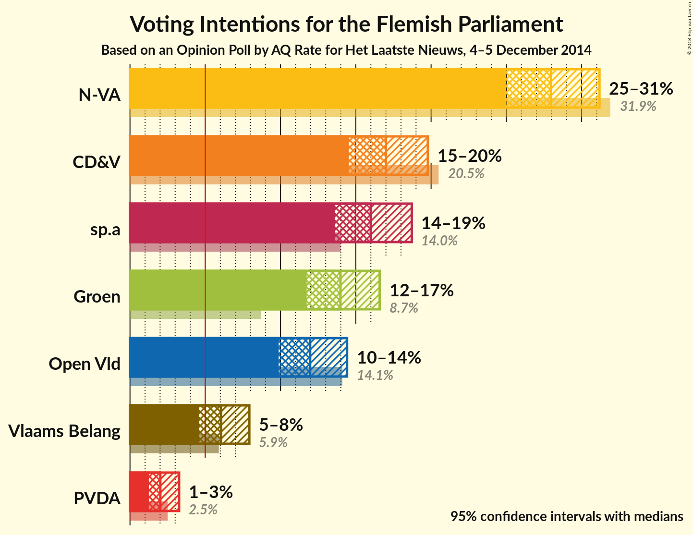
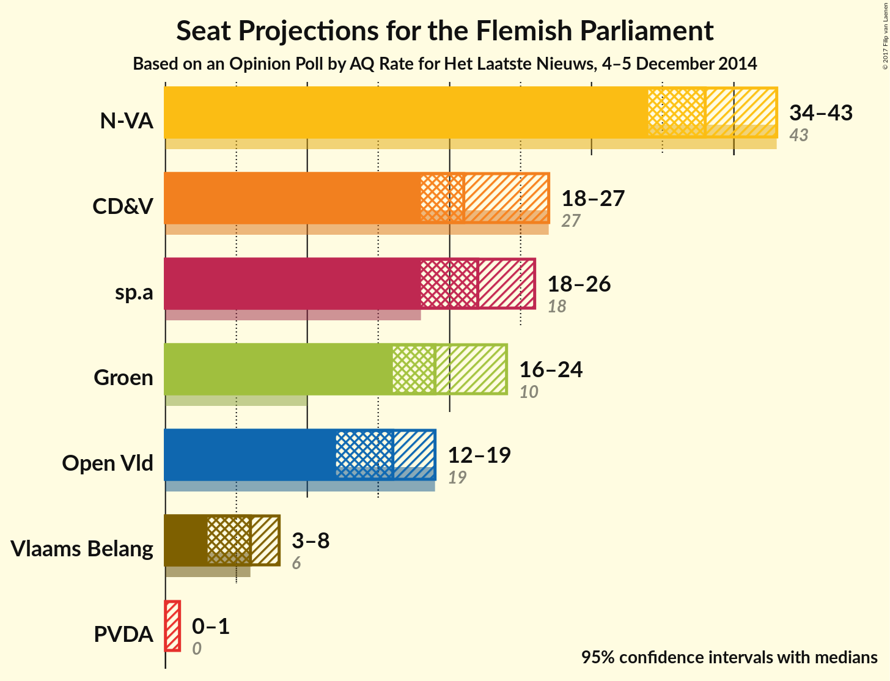
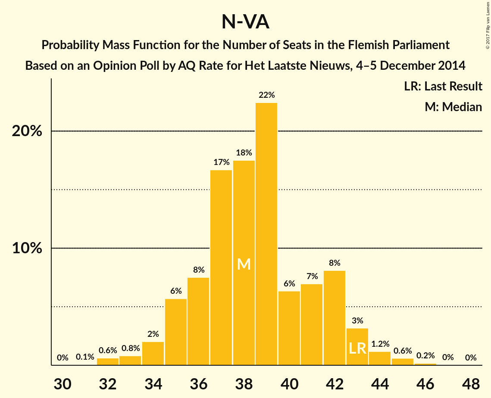
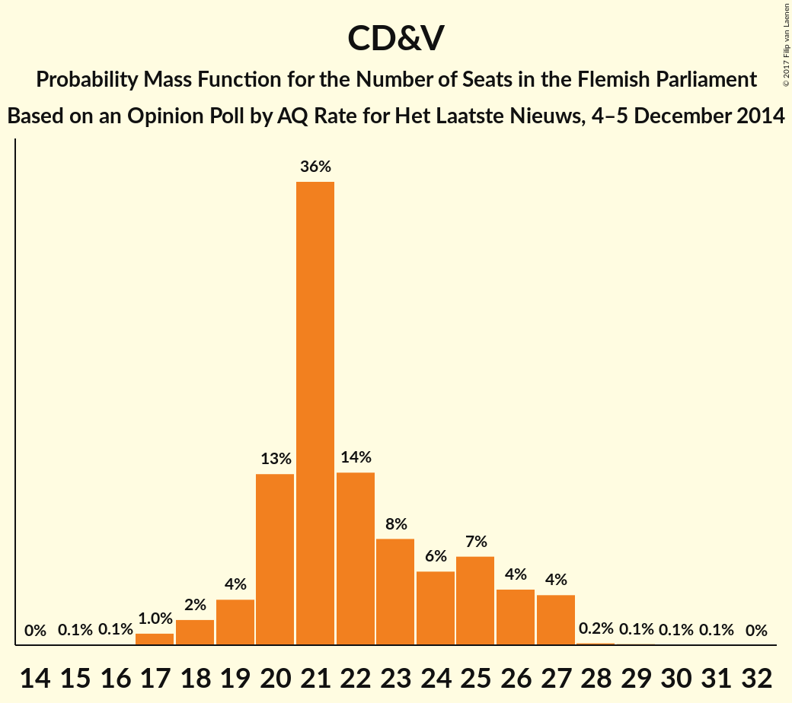
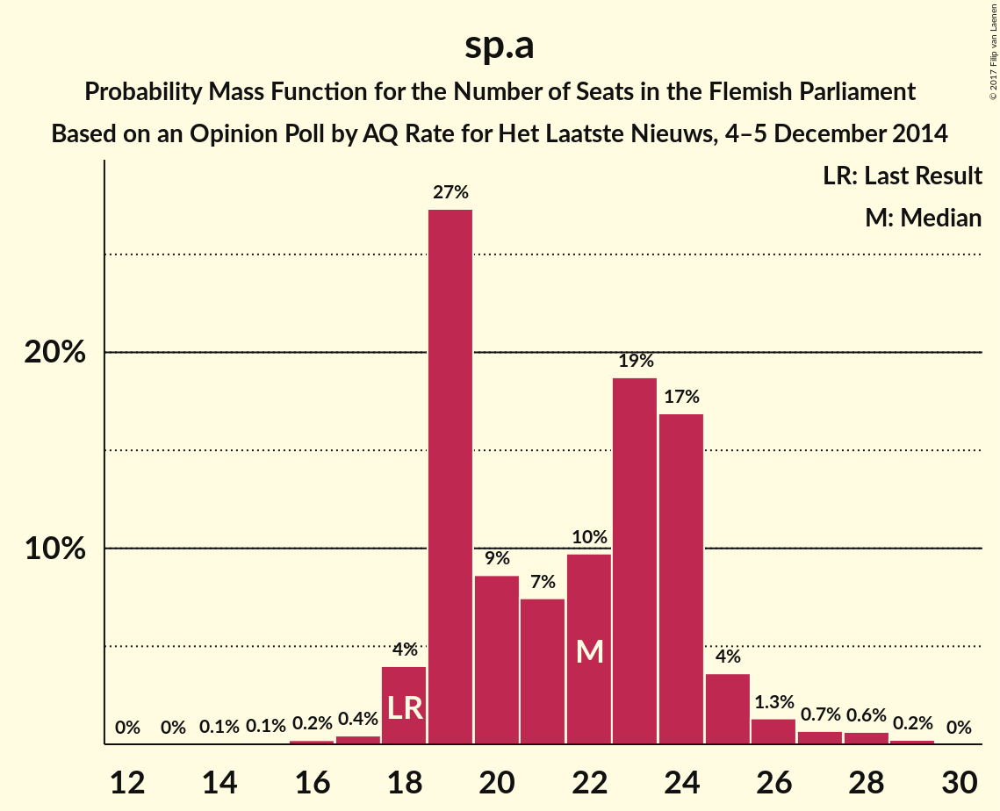
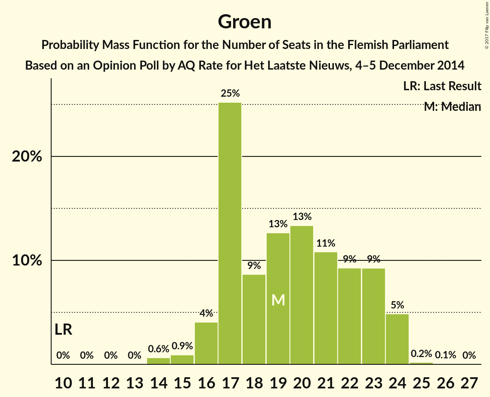
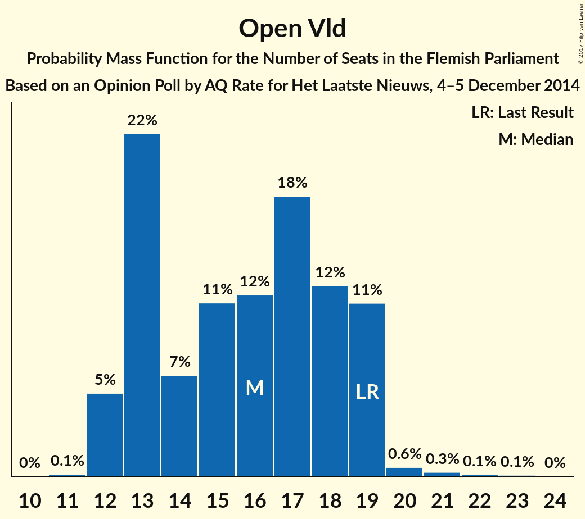
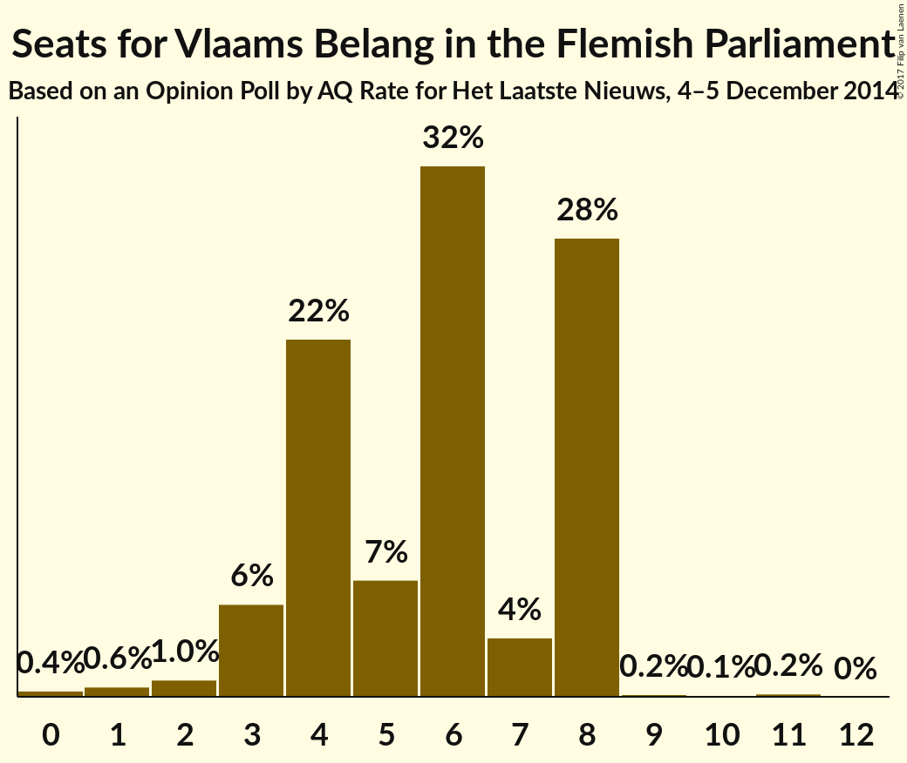
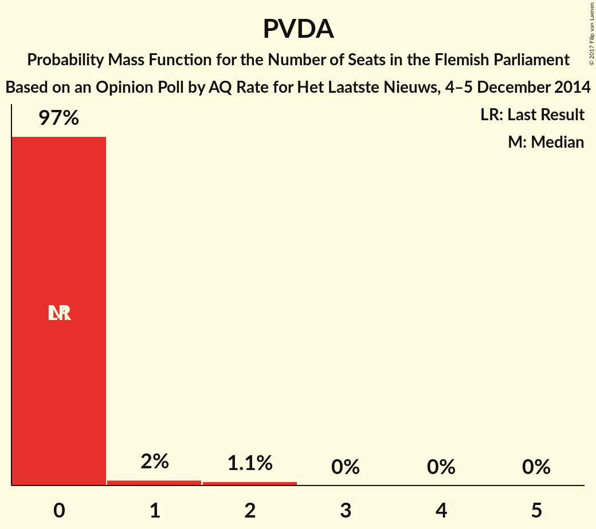
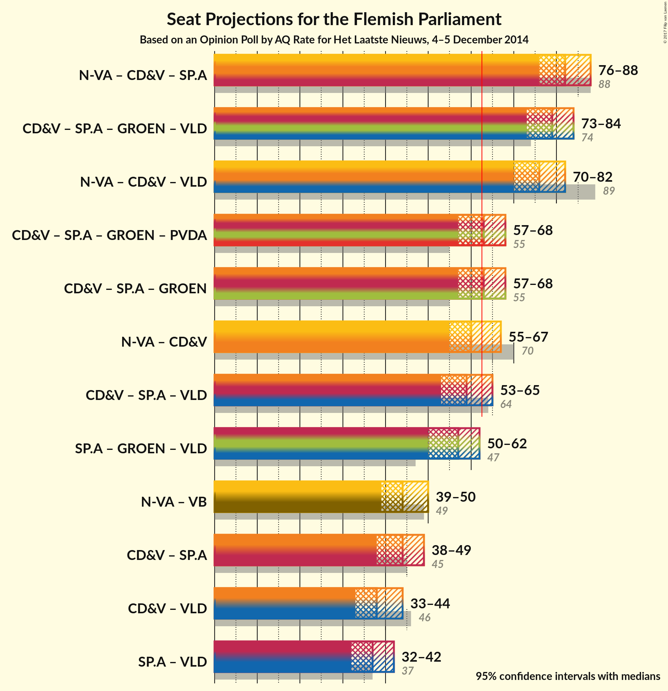

# Opinion Poll by AQ Rate for Het Laatste Nieuws, 4–5 December 2014

<a href="#voting-intentions">Voting Intentions</a> | <a href="#seats">Seats</a> | <a href="#coalitions">Coalitions</a> | <a href="#technical-information">Technical Information</a>

## Voting Intentions

### Confidence Intervals

| Party | Last Result | Poll Result | 80% Confidence Interval | 90% Confidence Interval | 95% Confidence Interval | 99% Confidence Interval |
|:-----:|:-----------:|:-----------:|:-----------------------:|:-----------------------:|:-----------------------:|:-----------------------:|
| N-VA | 31.9% | 28.0% | 26.0–30.1% |25.4–30.7% |25.0–31.2% |24.0–32.2% |
| CD&V | 20.5% | 17.0% | 15.4–18.8% |14.9–19.3% |14.5–19.8% |13.8–20.7% |
| sp.a | 14.0% | 16.0% | 14.4–17.8% |14.0–18.3% |13.6–18.7% |12.9–19.6% |
| Groen | 8.7% | 14.0% | 12.5–15.7% |12.1–16.2% |11.7–16.6% |11.1–17.4% |
| Open Vld | 14.1% | 12.0% | 10.6–13.6% |10.2–14.0% |9.9–14.4% |9.3–15.2% |
| Vlaams Belang | 5.9% | 6.0% | 5.1–7.3% |4.8–7.6% |4.6–7.9% |4.2–8.6% |
| PVDA | 2.5% | 2.0% | 1.5–2.8% |1.4–3.0% |1.2–3.3% |1.0–3.7% |

*Note:* The poll result column reflects the actual value used in the calculations. Published results may vary slightly, and in addition be rounded to fewer digits.

## Seats

### Confidence Intervals

| Party | Last Result | Median | 80% Confidence Interval | 90% Confidence Interval | 95% Confidence Interval | 99% Confidence Interval |
|:-----:|:-----------:|:------:|:-----------------------:|:-----------------------:|:-----------------------:|:-----------------------:|
| <a href="#n-va">N-VA</a> | 43 | 38 | 36–42 |35–43 |34–43 |32–45 |
| <a href="#cd&v">CD&V</a> | 27 | 21 | 20–25 |19–26 |18–27 |17–27 |
| <a href="#sp.a">sp.a</a> | 18 | 22 | 19–24 |19–25 |18–26 |17–28 |
| <a href="#groen">Groen</a> | 10 | 19 | 17–23 |16–24 |16–24 |14–24 |
| <a href="#open-vld">Open Vld</a> | 19 | 16 | 13–19 |12–19 |12–19 |12–20 |
| <a href="#vlaams-belang">Vlaams Belang</a> | 6 | 6 | 4–8 |3–8 |3–8 |1–8 |
| <a href="#pvda">PVDA</a> | 0 | 0 | 0 |0 |0–1 |0–2 |

### N-VA

*For a full overview of the results for this party, see the [N-VA](party-n-va.html) page.*

| Number of Seats | Probability | Accumulated | Special Marks |
|:---------------:|:-----------:|:-----------:|:-------------:|
| 31 | 0.1% | 100% |  |
| 32 | 0.6% | 99.9% |  |
| 33 | 0.8% | 99.3% |  |
| 34 | 2% | 98% |  |
| 35 | 6% | 96% |  |
| 36 | 8% | 91% |  |
| 37 | 17% | 83% |  |
| 38 | 18% | 67% | Median |
| 39 | 22% | 49% |  |
| 40 | 6% | 27% |  |
| 41 | 7% | 20% |  |
| 42 | 8% | 13% |  |
| 43 | 3% | 5% | Last Result |
| 44 | 1.2% | 2% |  |
| 45 | 0.6% | 0.8% |  |
| 46 | 0.2% | 0.2% |  |
| 47 | 0% | 0% |  |

### CD&V

*For a full overview of the results for this party, see the [CD&V](party-cdv.html) page.*

| Number of Seats | Probability | Accumulated | Special Marks |
|:---------------:|:-----------:|:-----------:|:-------------:|
| 15 | 0.1% | 100% |  |
| 16 | 0.1% | 99.9% |  |
| 17 | 1.0% | 99.8% |  |
| 18 | 2% | 98.8% |  |
| 19 | 4% | 97% |  |
| 20 | 13% | 93% |  |
| 21 | 36% | 80% | Median |
| 22 | 14% | 44% |  |
| 23 | 8% | 30% |  |
| 24 | 6% | 22% |  |
| 25 | 7% | 16% |  |
| 26 | 4% | 9% |  |
| 27 | 4% | 4% | Last Result |
| 28 | 0.2% | 0.5% |  |
| 29 | 0.1% | 0.3% |  |
| 30 | 0.1% | 0.1% |  |
| 31 | 0.1% | 0.1% |  |
| 32 | 0% | 0% |  |

### sp.a

*For a full overview of the results for this party, see the [sp.a](party-spa.html) page.*

| Number of Seats | Probability | Accumulated | Special Marks |
|:---------------:|:-----------:|:-----------:|:-------------:|
| 14 | 0.1% | 100% |  |
| 15 | 0.1% | 99.9% |  |
| 16 | 0.2% | 99.9% |  |
| 17 | 0.4% | 99.7% |  |
| 18 | 4% | 99.2% | Last Result |
| 19 | 27% | 95% |  |
| 20 | 9% | 68% |  |
| 21 | 7% | 59% |  |
| 22 | 10% | 52% | Median |
| 23 | 19% | 42% |  |
| 24 | 17% | 23% |  |
| 25 | 4% | 6% |  |
| 26 | 1.3% | 3% |  |
| 27 | 0.7% | 2% |  |
| 28 | 0.6% | 0.9% |  |
| 29 | 0.2% | 0.2% |  |
| 30 | 0% | 0% |  |

### Groen

*For a full overview of the results for this party, see the [Groen](party-groen.html) page.*

| Number of Seats | Probability | Accumulated | Special Marks |
|:---------------:|:-----------:|:-----------:|:-------------:|
| 10 | 0% | 100% | Last Result |
| 11 | 0% | 100% |  |
| 12 | 0% | 100% |  |
| 13 | 0% | 100% |  |
| 14 | 0.6% | 100% |  |
| 15 | 0.9% | 99.4% |  |
| 16 | 4% | 98% |  |
| 17 | 25% | 94% |  |
| 18 | 9% | 69% |  |
| 19 | 13% | 61% | Median |
| 20 | 13% | 48% |  |
| 21 | 11% | 35% |  |
| 22 | 9% | 24% |  |
| 23 | 9% | 14% |  |
| 24 | 5% | 5% |  |
| 25 | 0.2% | 0.3% |  |
| 26 | 0.1% | 0.1% |  |
| 27 | 0% | 0% |  |

### Open Vld

*For a full overview of the results for this party, see the [Open Vld](party-openvld.html) page.*

| Number of Seats | Probability | Accumulated | Special Marks |
|:---------------:|:-----------:|:-----------:|:-------------:|
| 11 | 0.1% | 100% |  |
| 12 | 5% | 99.9% |  |
| 13 | 22% | 94% |  |
| 14 | 7% | 72% |  |
| 15 | 11% | 66% |  |
| 16 | 12% | 55% | Median |
| 17 | 18% | 43% |  |
| 18 | 12% | 25% |  |
| 19 | 11% | 12% | Last Result |
| 20 | 0.6% | 1.1% |  |
| 21 | 0.3% | 0.5% |  |
| 22 | 0.1% | 0.2% |  |
| 23 | 0.1% | 0.1% |  |
| 24 | 0% | 0% |  |

### Vlaams Belang

*For a full overview of the results for this party, see the [Vlaams Belang](party-vlaamsbelang.html) page.*

| Number of Seats | Probability | Accumulated | Special Marks |
|:---------------:|:-----------:|:-----------:|:-------------:|
| 0 | 0.4% | 100% |  |
| 1 | 0.6% | 99.6% |  |
| 2 | 1.0% | 99.0% |  |
| 3 | 6% | 98% |  |
| 4 | 22% | 92% |  |
| 5 | 7% | 71% |  |
| 6 | 32% | 64% | Last Result, Median |
| 7 | 4% | 32% |  |
| 8 | 28% | 28% |  |
| 9 | 0.2% | 0.4% |  |
| 10 | 0.1% | 0.3% |  |
| 11 | 0.2% | 0.2% |  |
| 12 | 0% | 0% |  |

### PVDA

*For a full overview of the results for this party, see the [PVDA](party-pvda.html) page.*

| Number of Seats | Probability | Accumulated | Special Marks |
|:---------------:|:-----------:|:-----------:|:-------------:|
| 0 | 97% | 100% | Last Result, Median |
| 1 | 2% | 3% |  |
| 2 | 1.1% | 1.1% |  |
| 3 | 0% | 0% |  |

## Coalitions

### Confidence Intervals

| Coalition | Last Result | Median | Majority? | 80% Confidence Interval | 90% Confidence Interval | 95% Confidence Interval | 99% Confidence Interval |
|:---------:|:-----------:|:------:|:---------:|:-----------------------:|:-----------------------:|:-----------------------:|:-----------------------:|
| N-VA – CD&V – sp.a | 88 | 82 | 100% | 78–86 | 77–87 | 76–88 | 75–90 |
| CD&V – sp.a – Groen – Open Vld | 74 | 79 | 100% | 75–82 | 74–83 | 73–84 | 72–86 |
| N-VA – CD&V – Open Vld | 89 | 76 | 100% | 73–80 | 71–81 | 70–82 | 69–84 |
| CD&V – sp.a – Groen – PVDA | 55 | 63 | 54% | 59–67 | 58–68 | 57–68 | 55–71 |
| CD&V – sp.a – Groen | 55 | 63 | 54% | 59–67 | 58–68 | 57–68 | 55–71 |
| N-VA – CD&V | 70 | 60 | 23% | 57–64 | 56–66 | 55–67 | 54–69 |
| CD&V – sp.a – Open Vld | 64 | 59 | 14% | 55–63 | 54–64 | 53–65 | 52–67 |
| sp.a – Groen – Open Vld | 47 | 57 | 2% | 53–60 | 52–61 | 50–62 | 49–64 |
| N-VA – Vlaams Belang | 49 | 44 | 0% | 41–48 | 40–49 | 39–50 | 37–51 |
| CD&V – sp.a | 45 | 44 | 0% | 40–47 | 39–49 | 38–49 | 37–50 |
| CD&V – Open Vld | 46 | 38 | 0% | 34–41 | 33–42 | 33–44 | 31–45 |
| sp.a – Open Vld | 37 | 37 | 0% | 33–41 | 32–42 | 32–42 | 31–44 |

### N-VA – CD&V – sp.a

| Number of Seats | Probability | Accumulated | Special Marks |
|:---------------:|:-----------:|:-----------:|:-------------:|
| 73 | 0.1% | 100% |  |
| 74 | 0.2% | 99.9% |  |
| 75 | 0.7% | 99.7% |  |
| 76 | 3% | 99.1% |  |
| 77 | 4% | 97% |  |
| 78 | 5% | 93% |  |
| 79 | 7% | 87% |  |
| 80 | 11% | 80% |  |
| 81 | 15% | 69% | Median |
| 82 | 14% | 54% |  |
| 83 | 11% | 39% |  |
| 84 | 7% | 29% |  |
| 85 | 8% | 22% |  |
| 86 | 6% | 14% |  |
| 87 | 4% | 8% |  |
| 88 | 2% | 4% | Last Result |
| 89 | 1.0% | 2% |  |
| 90 | 0.6% | 0.8% |  |
| 91 | 0.1% | 0.2% |  |
| 92 | 0% | 0% |  |

### CD&V – sp.a – Groen – Open Vld

| Number of Seats | Probability | Accumulated | Special Marks |
|:---------------:|:-----------:|:-----------:|:-------------:|
| 70 | 0.1% | 100% |  |
| 71 | 0.1% | 99.9% |  |
| 72 | 0.6% | 99.8% |  |
| 73 | 2% | 99.2% |  |
| 74 | 4% | 97% | Last Result |
| 75 | 6% | 93% |  |
| 76 | 9% | 87% |  |
| 77 | 8% | 78% |  |
| 78 | 16% | 70% | Median |
| 79 | 16% | 54% |  |
| 80 | 18% | 38% |  |
| 81 | 7% | 20% |  |
| 82 | 6% | 12% |  |
| 83 | 3% | 7% |  |
| 84 | 2% | 3% |  |
| 85 | 1.0% | 2% |  |
| 86 | 0.4% | 0.5% |  |
| 87 | 0.1% | 0.1% |  |
| 88 | 0% | 0.1% |  |
| 89 | 0% | 0% |  |

### N-VA – CD&V – Open Vld

| Number of Seats | Probability | Accumulated | Special Marks |
|:---------------:|:-----------:|:-----------:|:-------------:|
| 67 | 0.1% | 100% |  |
| 68 | 0.2% | 99.9% |  |
| 69 | 1.0% | 99.7% |  |
| 70 | 1.2% | 98.7% |  |
| 71 | 3% | 97% |  |
| 72 | 4% | 94% |  |
| 73 | 9% | 90% |  |
| 74 | 13% | 82% |  |
| 75 | 13% | 68% | Median |
| 76 | 12% | 56% |  |
| 77 | 12% | 43% |  |
| 78 | 9% | 32% |  |
| 79 | 9% | 23% |  |
| 80 | 5% | 14% |  |
| 81 | 5% | 9% |  |
| 82 | 2% | 4% |  |
| 83 | 1.4% | 2% |  |
| 84 | 0.4% | 0.5% |  |
| 85 | 0.1% | 0.2% |  |
| 86 | 0.1% | 0.1% |  |
| 87 | 0% | 0% |  |
| 88 | 0% | 0% |  |
| 89 | 0% | 0% | Last Result |

### CD&V – sp.a – Groen – PVDA

| Number of Seats | Probability | Accumulated | Special Marks |
|:---------------:|:-----------:|:-----------:|:-------------:|
| 54 | 0.1% | 100% |  |
| 55 | 0.4% | 99.8% | Last Result |
| 56 | 0.9% | 99.4% |  |
| 57 | 2% | 98.5% |  |
| 58 | 4% | 97% |  |
| 59 | 5% | 93% |  |
| 60 | 5% | 88% |  |
| 61 | 11% | 83% |  |
| 62 | 17% | 71% | Median |
| 63 | 15% | 54% | Majority |
| 64 | 9% | 39% |  |
| 65 | 10% | 30% |  |
| 66 | 8% | 20% |  |
| 67 | 7% | 13% |  |
| 68 | 3% | 6% |  |
| 69 | 1.1% | 2% |  |
| 70 | 0.5% | 1.1% |  |
| 71 | 0.4% | 0.6% |  |
| 72 | 0.2% | 0.2% |  |
| 73 | 0% | 0.1% |  |
| 74 | 0% | 0% |  |

### CD&V – sp.a – Groen

| Number of Seats | Probability | Accumulated | Special Marks |
|:---------------:|:-----------:|:-----------:|:-------------:|
| 54 | 0.1% | 100% |  |
| 55 | 0.4% | 99.8% | Last Result |
| 56 | 0.9% | 99.4% |  |
| 57 | 2% | 98% |  |
| 58 | 4% | 97% |  |
| 59 | 6% | 93% |  |
| 60 | 5% | 87% |  |
| 61 | 11% | 82% |  |
| 62 | 17% | 71% | Median |
| 63 | 15% | 54% | Majority |
| 64 | 9% | 39% |  |
| 65 | 10% | 30% |  |
| 66 | 8% | 20% |  |
| 67 | 7% | 12% |  |
| 68 | 3% | 5% |  |
| 69 | 1.1% | 2% |  |
| 70 | 0.5% | 1.1% |  |
| 71 | 0.4% | 0.6% |  |
| 72 | 0.1% | 0.2% |  |
| 73 | 0% | 0% |  |

### N-VA – CD&V

| Number of Seats | Probability | Accumulated | Special Marks |
|:---------------:|:-----------:|:-----------:|:-------------:|
| 52 | 0.1% | 100% |  |
| 53 | 0.4% | 99.9% |  |
| 54 | 0.8% | 99.5% |  |
| 55 | 2% | 98.7% |  |
| 56 | 4% | 97% |  |
| 57 | 7% | 93% |  |
| 58 | 12% | 86% |  |
| 59 | 14% | 74% | Median |
| 60 | 13% | 60% |  |
| 61 | 11% | 47% |  |
| 62 | 13% | 36% |  |
| 63 | 10% | 23% | Majority |
| 64 | 5% | 13% |  |
| 65 | 3% | 8% |  |
| 66 | 3% | 5% |  |
| 67 | 1.2% | 3% |  |
| 68 | 0.6% | 1.3% |  |
| 69 | 0.6% | 0.7% |  |
| 70 | 0.1% | 0.1% | Last Result |
| 71 | 0% | 0% |  |

### CD&V – sp.a – Open Vld

| Number of Seats | Probability | Accumulated | Special Marks |
|:---------------:|:-----------:|:-----------:|:-------------:|
| 50 | 0.1% | 100% |  |
| 51 | 0.2% | 99.9% |  |
| 52 | 0.6% | 99.7% |  |
| 53 | 2% | 99.1% |  |
| 54 | 4% | 97% |  |
| 55 | 6% | 93% |  |
| 56 | 6% | 87% |  |
| 57 | 11% | 81% |  |
| 58 | 12% | 70% |  |
| 59 | 12% | 58% | Median |
| 60 | 15% | 47% |  |
| 61 | 8% | 32% |  |
| 62 | 10% | 24% |  |
| 63 | 9% | 14% | Majority |
| 64 | 2% | 5% | Last Result |
| 65 | 2% | 3% |  |
| 66 | 0.7% | 1.3% |  |
| 67 | 0.4% | 0.6% |  |
| 68 | 0.2% | 0.2% |  |
| 69 | 0% | 0% |  |

### sp.a – Groen – Open Vld

| Number of Seats | Probability | Accumulated | Special Marks |
|:---------------:|:-----------:|:-----------:|:-------------:|
| 47 | 0.1% | 100% | Last Result |
| 48 | 0.4% | 99.9% |  |
| 49 | 1.1% | 99.5% |  |
| 50 | 1.0% | 98% |  |
| 51 | 2% | 97% |  |
| 52 | 3% | 96% |  |
| 53 | 8% | 93% |  |
| 54 | 9% | 85% |  |
| 55 | 9% | 76% |  |
| 56 | 11% | 68% |  |
| 57 | 15% | 56% | Median |
| 58 | 16% | 42% |  |
| 59 | 11% | 26% |  |
| 60 | 7% | 15% |  |
| 61 | 4% | 8% |  |
| 62 | 2% | 4% |  |
| 63 | 1.0% | 2% | Majority |
| 64 | 0.7% | 0.9% |  |
| 65 | 0.2% | 0.3% |  |
| 66 | 0% | 0% |  |

### N-VA – Vlaams Belang

| Number of Seats | Probability | Accumulated | Special Marks |
|:---------------:|:-----------:|:-----------:|:-------------:|
| 35 | 0% | 100% |  |
| 36 | 0.1% | 99.9% |  |
| 37 | 0.4% | 99.9% |  |
| 38 | 1.0% | 99.5% |  |
| 39 | 2% | 98% |  |
| 40 | 3% | 97% |  |
| 41 | 6% | 93% |  |
| 42 | 8% | 87% |  |
| 43 | 18% | 80% |  |
| 44 | 16% | 61% | Median |
| 45 | 16% | 46% |  |
| 46 | 8% | 29% |  |
| 47 | 9% | 22% |  |
| 48 | 6% | 13% |  |
| 49 | 4% | 7% | Last Result |
| 50 | 2% | 3% |  |
| 51 | 0.5% | 0.7% |  |
| 52 | 0.1% | 0.2% |  |
| 53 | 0.1% | 0.1% |  |
| 54 | 0% | 0% |  |

### CD&V – sp.a

| Number of Seats | Probability | Accumulated | Special Marks |
|:---------------:|:-----------:|:-----------:|:-------------:|
| 35 | 0% | 100% |  |
| 36 | 0.2% | 99.9% |  |
| 37 | 0.9% | 99.8% |  |
| 38 | 2% | 98.8% |  |
| 39 | 4% | 97% |  |
| 40 | 11% | 93% |  |
| 41 | 8% | 82% |  |
| 42 | 11% | 74% |  |
| 43 | 12% | 63% | Median |
| 44 | 17% | 51% |  |
| 45 | 13% | 34% | Last Result |
| 46 | 7% | 21% |  |
| 47 | 5% | 14% |  |
| 48 | 4% | 9% |  |
| 49 | 3% | 5% |  |
| 50 | 2% | 2% |  |
| 51 | 0.2% | 0.4% |  |
| 52 | 0.1% | 0.2% |  |
| 53 | 0.1% | 0.1% |  |
| 54 | 0% | 0% |  |

### CD&V – Open Vld

| Number of Seats | Probability | Accumulated | Special Marks |
|:---------------:|:-----------:|:-----------:|:-------------:|
| 30 | 0.3% | 100% |  |
| 31 | 0.5% | 99.7% |  |
| 32 | 1.5% | 99.2% |  |
| 33 | 3% | 98% |  |
| 34 | 9% | 94% |  |
| 35 | 10% | 85% |  |
| 36 | 14% | 76% |  |
| 37 | 10% | 62% | Median |
| 38 | 13% | 52% |  |
| 39 | 14% | 39% |  |
| 40 | 11% | 25% |  |
| 41 | 5% | 14% |  |
| 42 | 4% | 9% |  |
| 43 | 2% | 5% |  |
| 44 | 2% | 3% |  |
| 45 | 0.6% | 0.7% |  |
| 46 | 0.1% | 0.1% | Last Result |
| 47 | 0% | 0% |  |

### sp.a – Open Vld

| Number of Seats | Probability | Accumulated | Special Marks |
|:---------------:|:-----------:|:-----------:|:-------------:|
| 29 | 0% | 100% |  |
| 30 | 0.2% | 99.9% |  |
| 31 | 1.3% | 99.7% |  |
| 32 | 7% | 98% |  |
| 33 | 4% | 92% |  |
| 34 | 6% | 88% |  |
| 35 | 8% | 83% |  |
| 36 | 15% | 75% |  |
| 37 | 15% | 60% | Last Result |
| 38 | 13% | 45% | Median |
| 39 | 9% | 31% |  |
| 40 | 8% | 23% |  |
| 41 | 7% | 14% |  |
| 42 | 6% | 7% |  |
| 43 | 0.8% | 2% |  |
| 44 | 0.5% | 0.7% |  |
| 45 | 0.2% | 0.3% |  |
| 46 | 0.1% | 0.1% |  |
| 47 | 0% | 0% |  |

## Technical Information

### Opinion Poll

+ **Polling firm:** AQ Rate
+ **Commissioner(s):** Het Laatste Nieuws
+ **Fieldwork period:** 4–5 December 2014

### Calculations

+ **Sample size:** 794
+ **Simulations done:** 2,097,152
+ **Error estimate:** 0.62%

