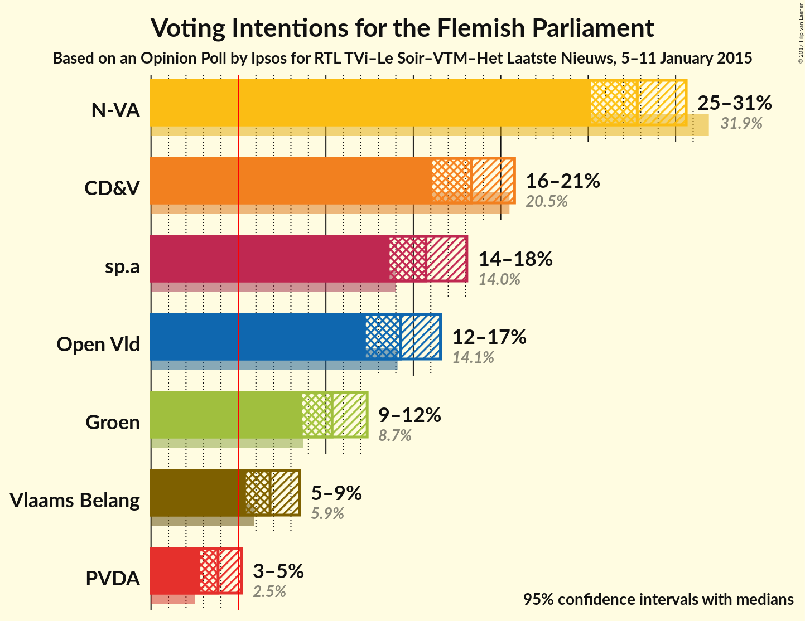
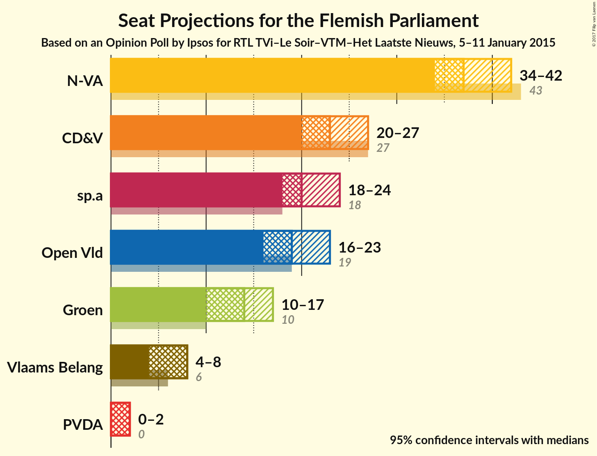
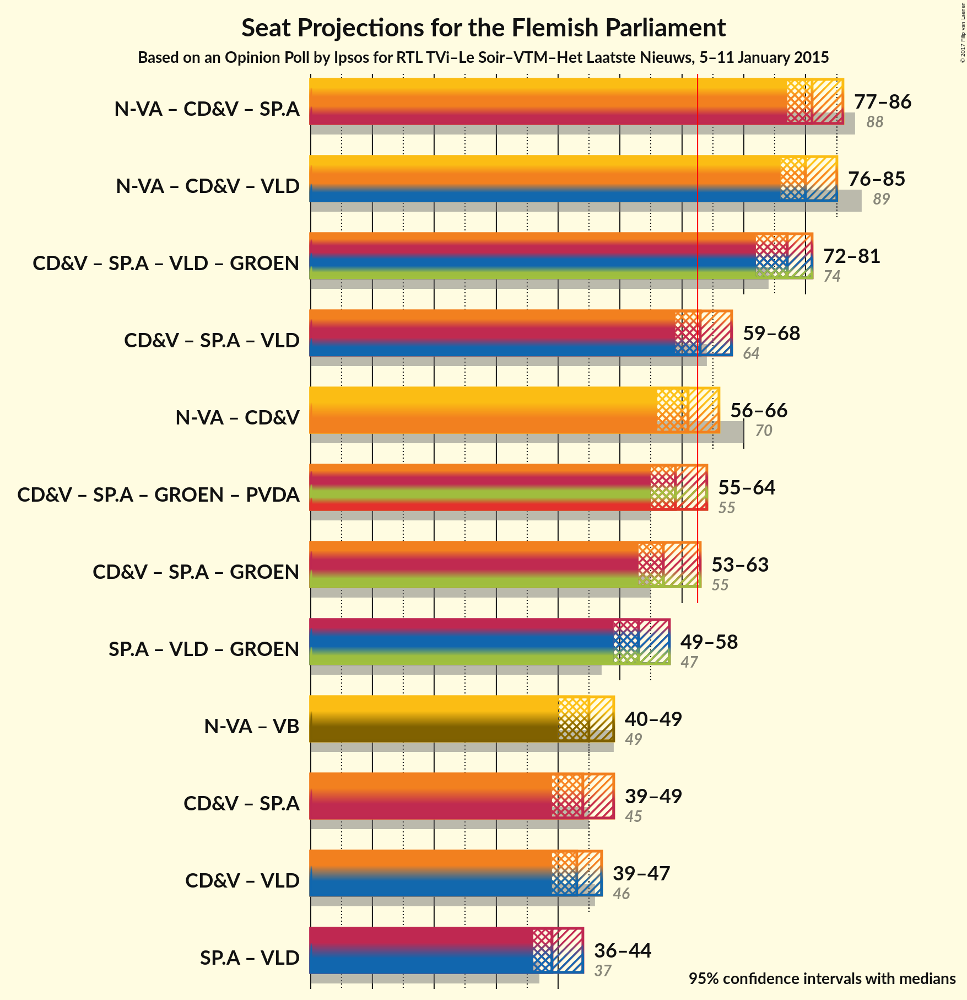

# Opinion Poll by Ipsos for RTL TVi–Le Soir–VTM–Het Laatste Nieuws, 5–11 January 2015

<a href="#voting-intentions">Voting Intentions</a> | <a href="#seats">Seats</a> | <a href="#coalitions">Coalitions</a> | <a href="#technical-information">Technical Information</a>

## Voting Intentions

### Confidence Intervals

| Party | Last Result | Poll Result | 80% Confidence Interval | 90% Confidence Interval | 95% Confidence Interval | 99% Confidence Interval |
|:-----:|:-----------:|:-----------:|:-----------------------:|:-----------------------:|:-----------------------:|:-----------------------:|
| N-VA | 31.9% | 27.8% | 22.2–33.3% |22.2–33.3% |22.2–33.3% |22.2–33.3% |
| CD&V | 20.5% | 18.3% | 11.1–22.2% |11.1–22.2% |11.1–22.2% |11.1–22.2% |
| sp.a | 14.0% | 15.7% | 11.1–22.2% |11.1–22.2% |11.1–22.2% |11.1–22.2% |
| Open Vld | 14.1% | 14.3% | 11.1–22.2% |11.1–22.2% |11.1–22.2% |11.1–22.2% |
| Groen | 8.7% | 10.4% | 0.0–22.2% |0.0–22.2% |0.0–22.2% |0.0–22.2% |
| Vlaams Belang | 5.9% | 6.8% | 0.0–11.1% |0.0–11.1% |0.0–11.1% |0.0–11.1% |
| PVDA | 2.5% | 3.8% | 0.0–11.1% |0.0–11.1% |0.0–11.1% |0.0–11.1% |

*Note:* The poll result column reflects the actual value used in the calculations. Published results may vary slightly, and in addition be rounded to fewer digits.

## Seats

### Confidence Intervals

| Party | Last Result | Median | 80% Confidence Interval | 90% Confidence Interval | 95% Confidence Interval | 99% Confidence Interval |
|:-----:|:-----------:|:------:|:-----------------------:|:-----------------------:|:-----------------------:|:-----------------------:|
| <a href="#n-va">N-VA</a> | 43 | N/A | N/A |N/A |N/A |N/A |
| <a href="#cd&v">CD&V</a> | 27 | N/A | N/A |N/A |N/A |N/A |
| <a href="#sp.a">sp.a</a> | 18 | N/A | N/A |N/A |N/A |N/A |
| <a href="#open-vld">Open Vld</a> | 19 | N/A | N/A |N/A |N/A |N/A |
| <a href="#groen">Groen</a> | 10 | N/A | N/A |N/A |N/A |N/A |
| <a href="#vlaams-belang">Vlaams Belang</a> | 6 | N/A | N/A |N/A |N/A |N/A |
| <a href="#pvda">PVDA</a> | 0 | N/A | N/A |N/A |N/A |N/A |

## Coalitions

## Technical Information

### Opinion Poll

+ **Pollster:** Ipsos
+ **Media:** RTL TVi–Le Soir–VTM–Het Laatste Nieuws
+ **Fieldwork period:** 5–11 January 2015

### Calculations

+ **Sample size:** 1043
+ **Simulations done:** 0
+ **Error estimate:** 100.00%

