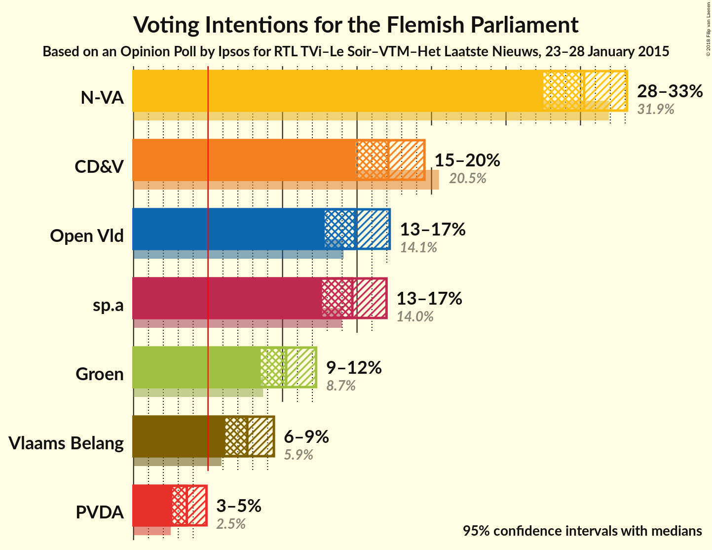
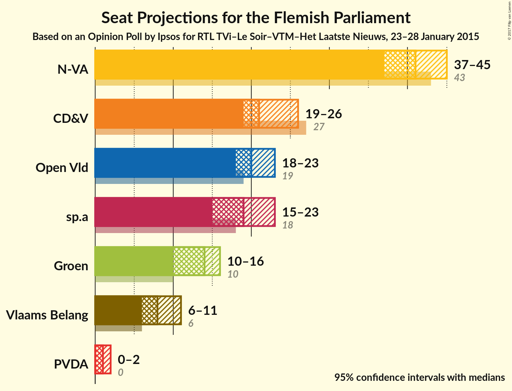
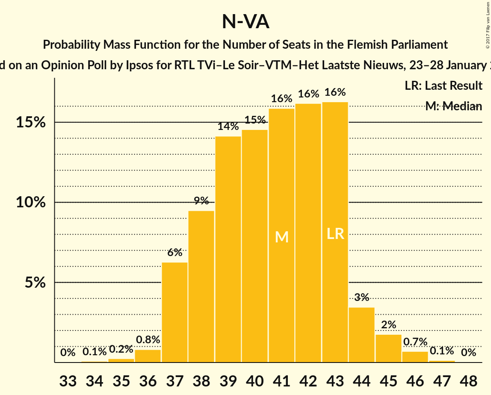
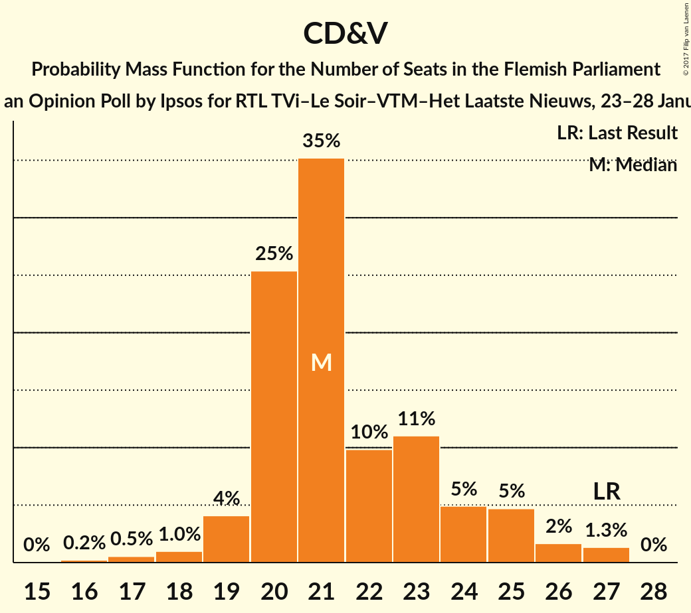
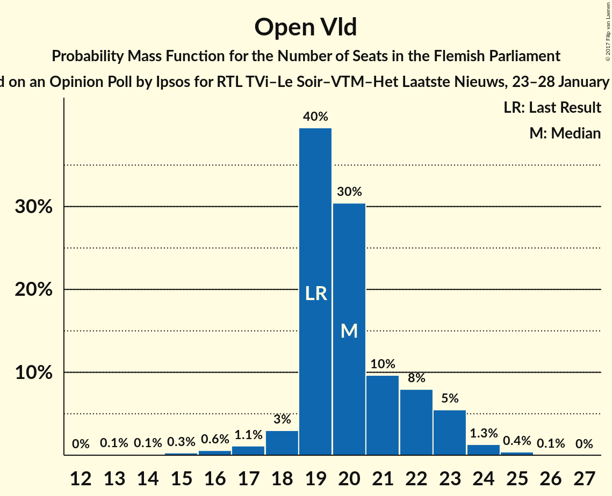
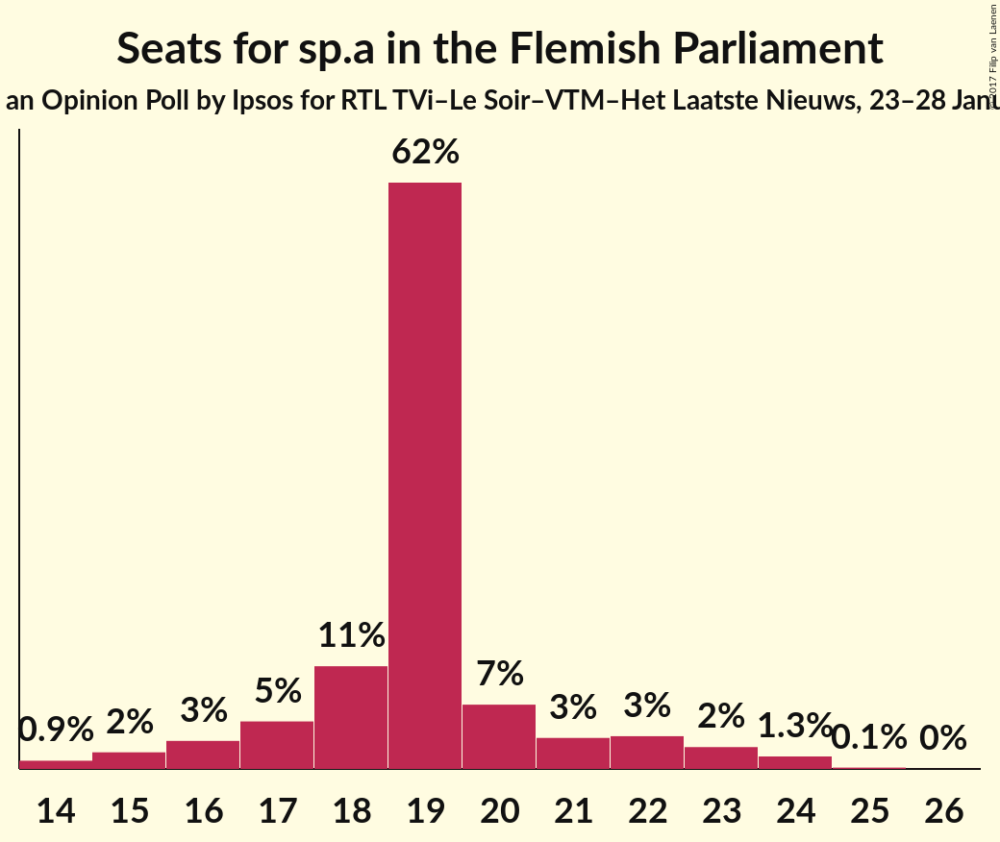
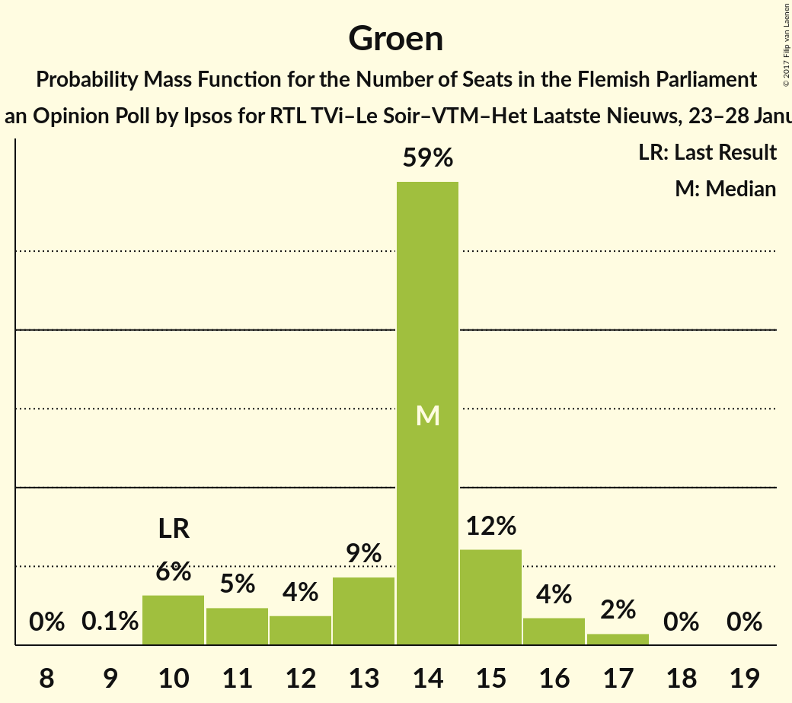
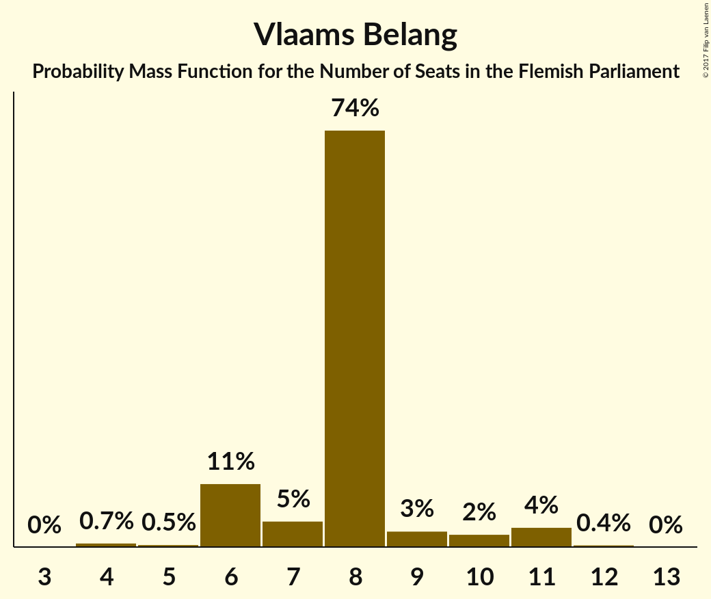
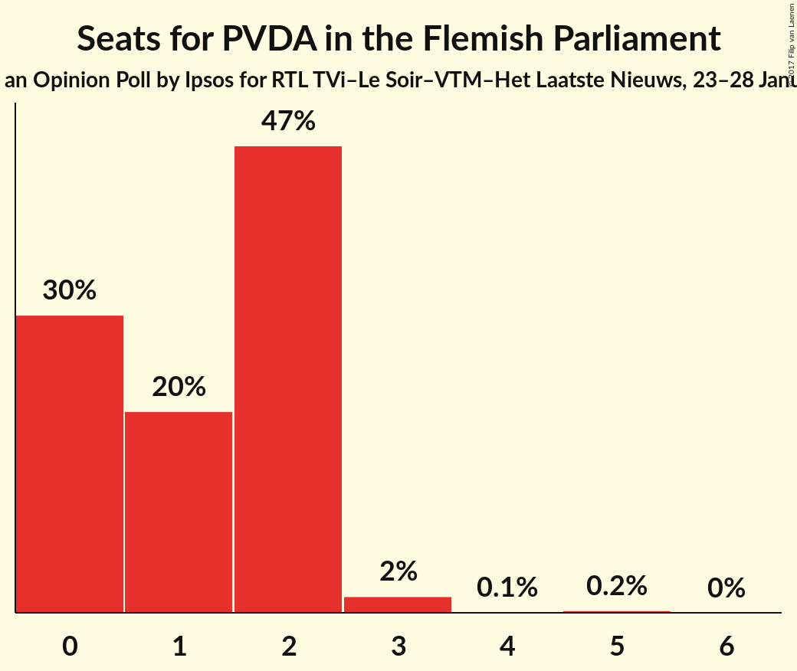
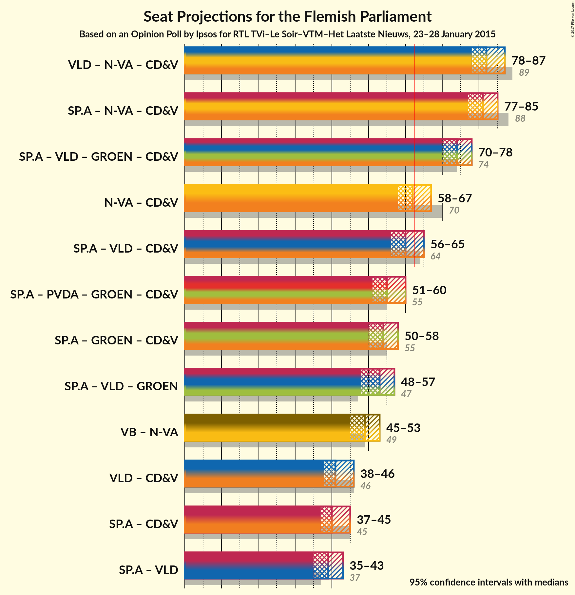

# Opinion Poll by Ipsos for RTL TVi–Le Soir–VTM–Het Laatste Nieuws, 23–28 January 2015

<a href="#voting-intentions">Voting Intentions</a> | <a href="#seats">Seats</a> | <a href="#coalitions">Coalitions</a> | <a href="#technical-information">Technical Information</a>

## Voting Intentions

### Confidence Intervals

| Party | Last Result | Poll Result | 80% Confidence Interval | 90% Confidence Interval | 95% Confidence Interval | 99% Confidence Interval |
|:-----:|:-----------:|:-----------:|:-----------------------:|:-----------------------:|:-----------------------:|:-----------------------:|
| N-VA | 31.9% | 30.2% | 28.5–32.1% |28.0–32.6% |27.5–33.1% |26.7–34.0% |
| CD&V | 20.5% | 17.1% | 15.7–18.7% |15.3–19.1% |14.9–19.5% |14.3–20.3% |
| Open Vld | 14.1% | 14.9% | 13.5–16.4% |13.2–16.8% |12.8–17.2% |12.2–17.9% |
| sp.a | 14.0% | 14.7% | 13.4–16.2% |13.0–16.6% |12.7–17.0% |12.0–17.7% |
| Groen | 8.7% | 10.2% | 9.1–11.6% |8.8–11.9% |8.5–12.3% |8.0–12.9% |
| Vlaams Belang | 5.9% | 7.6% | 6.7–8.8% |6.4–9.1% |6.2–9.4% |5.7–10.0% |
| PVDA | 2.5% | 3.6% | 2.9–4.4% |2.7–4.7% |2.6–4.9% |2.3–5.3% |

*Note:* The poll result column reflects the actual value used in the calculations. Published results may vary slightly, and in addition be rounded to fewer digits.

## Seats

### Confidence Intervals

| Party | Last Result | Median | 80% Confidence Interval | 90% Confidence Interval | 95% Confidence Interval | 99% Confidence Interval |
|:-----:|:-----------:|:------:|:-----------------------:|:-----------------------:|:-----------------------:|:-----------------------:|
| <a href="#n-va">N-VA</a> | 43 | 41 | 38–43 |37–44 |37–45 |36–46 |
| <a href="#cd&v">CD&V</a> | 27 | 21 | 20–24 |19–25 |19–26 |17–27 |
| <a href="#open-vld">Open Vld</a> | 19 | 20 | 19–22 |18–23 |18–23 |15–24 |
| <a href="#sp.a">sp.a</a> | 18 | 19 | 17–21 |16–22 |15–23 |14–24 |
| <a href="#groen">Groen</a> | 10 | 14 | 11–15 |10–16 |10–16 |10–17 |
| <a href="#vlaams-belang">Vlaams Belang</a> | 6 | 8 | 6–8 |6–10 |6–11 |4–11 |
| <a href="#pvda">PVDA</a> | 0 | 1 | 0–2 |0–2 |0–2 |0–3 |

### N-VA

*For a full overview of the results for this party, see the [N-VA](party-n-va.html) page.*

| Number of Seats | Probability | Accumulated | Special Marks |
|:---------------:|:-----------:|:-----------:|:-------------:|
| 34 | 0.1% | 100% |  |
| 35 | 0.2% | 99.9% |  |
| 36 | 0.8% | 99.7% |  |
| 37 | 6% | 98.8% |  |
| 38 | 9% | 93% |  |
| 39 | 14% | 83% |  |
| 40 | 15% | 69% |  |
| 41 | 16% | 54% | Median |
| 42 | 16% | 39% |  |
| 43 | 16% | 22% | Last Result |
| 44 | 3% | 6% |  |
| 45 | 2% | 3% |  |
| 46 | 0.7% | 0.9% |  |
| 47 | 0.1% | 0.2% |  |
| 48 | 0% | 0% |  |

### CD&V

*For a full overview of the results for this party, see the [CD&V](party-cdv.html) page.*

| Number of Seats | Probability | Accumulated | Special Marks |
|:---------------:|:-----------:|:-----------:|:-------------:|
| 16 | 0.2% | 100% |  |
| 17 | 0.5% | 99.8% |  |
| 18 | 1.0% | 99.2% |  |
| 19 | 4% | 98% |  |
| 20 | 25% | 94% |  |
| 21 | 35% | 69% | Median |
| 22 | 10% | 34% |  |
| 23 | 11% | 24% |  |
| 24 | 5% | 13% |  |
| 25 | 5% | 8% |  |
| 26 | 2% | 3% |  |
| 27 | 1.3% | 1.4% | Last Result |
| 28 | 0% | 0% |  |

### Open Vld

*For a full overview of the results for this party, see the [Open Vld](party-openvld.html) page.*

| Number of Seats | Probability | Accumulated | Special Marks |
|:---------------:|:-----------:|:-----------:|:-------------:|
| 13 | 0.1% | 100% |  |
| 14 | 0.1% | 99.9% |  |
| 15 | 0.3% | 99.7% |  |
| 16 | 0.6% | 99.5% |  |
| 17 | 1.1% | 98.9% |  |
| 18 | 3% | 98% |  |
| 19 | 40% | 95% | Last Result |
| 20 | 30% | 55% | Median |
| 21 | 10% | 25% |  |
| 22 | 8% | 15% |  |
| 23 | 5% | 7% |  |
| 24 | 1.3% | 2% |  |
| 25 | 0.4% | 0.5% |  |
| 26 | 0.1% | 0.1% |  |
| 27 | 0% | 0% |  |

### sp.a

*For a full overview of the results for this party, see the [sp.a](party-spa.html) page.*

| Number of Seats | Probability | Accumulated | Special Marks |
|:---------------:|:-----------:|:-----------:|:-------------:|
| 14 | 0.9% | 100% |  |
| 15 | 2% | 99.1% |  |
| 16 | 3% | 97% |  |
| 17 | 5% | 94% |  |
| 18 | 11% | 89% | Last Result |
| 19 | 62% | 79% | Median |
| 20 | 7% | 17% |  |
| 21 | 3% | 10% |  |
| 22 | 3% | 7% |  |
| 23 | 2% | 4% |  |
| 24 | 1.3% | 1.5% |  |
| 25 | 0.1% | 0.2% |  |
| 26 | 0% | 0% |  |

### Groen

*For a full overview of the results for this party, see the [Groen](party-groen.html) page.*

| Number of Seats | Probability | Accumulated | Special Marks |
|:---------------:|:-----------:|:-----------:|:-------------:|
| 9 | 0.1% | 100% |  |
| 10 | 6% | 99.9% | Last Result |
| 11 | 5% | 93% |  |
| 12 | 4% | 89% |  |
| 13 | 9% | 85% |  |
| 14 | 59% | 76% | Median |
| 15 | 12% | 17% |  |
| 16 | 4% | 5% |  |
| 17 | 2% | 2% |  |
| 18 | 0% | 0.1% |  |
| 19 | 0% | 0% |  |

### Vlaams Belang

*For a full overview of the results for this party, see the [Vlaams Belang](party-vlaamsbelang.html) page.*

| Number of Seats | Probability | Accumulated | Special Marks |
|:---------------:|:-----------:|:-----------:|:-------------:|
| 4 | 0.7% | 100% |  |
| 5 | 0.5% | 99.2% |  |
| 6 | 11% | 98.8% | Last Result |
| 7 | 5% | 88% |  |
| 8 | 74% | 83% | Median |
| 9 | 3% | 9% |  |
| 10 | 2% | 6% |  |
| 11 | 4% | 4% |  |
| 12 | 0.4% | 0.4% |  |
| 13 | 0% | 0% |  |

### PVDA

*For a full overview of the results for this party, see the [PVDA](party-pvda.html) page.*

| Number of Seats | Probability | Accumulated | Special Marks |
|:---------------:|:-----------:|:-----------:|:-------------:|
| 0 | 30% | 100% | Last Result |
| 1 | 20% | 70% | Median |
| 2 | 47% | 49% |  |
| 3 | 2% | 2% |  |
| 4 | 0.1% | 0.3% |  |
| 5 | 0.2% | 0.2% |  |
| 6 | 0% | 0% |  |

## Coalitions

### Confidence Intervals

| Coalition | Last Result | Median | Majority? | 80% Confidence Interval | 90% Confidence Interval | 95% Confidence Interval | 99% Confidence Interval |
|:---------:|:-----------:|:------:|:---------:|:-----------------------:|:-----------------------:|:-----------------------:|:-----------------------:|
| N-VA – CD&V – Open Vld | 89 | 82 | 100% | 79–85 | 78–86 | 78–87 | 76–88 |
| N-VA – CD&V – sp.a | 88 | 81 | 100% | 79–83 | 78–84 | 77–85 | 76–87 |
| CD&V – Open Vld – sp.a – Groen | 74 | 74 | 100% | 71–77 | 70–78 | 70–78 | 68–80 |
| N-VA – CD&V | 70 | 62 | 44% | 59–64 | 58–66 | 58–67 | 57–68 |
| CD&V – Open Vld – sp.a | 64 | 60 | 19% | 58–63 | 57–64 | 56–65 | 55–67 |
| CD&V – sp.a – Groen – PVDA | 55 | 55 | 0.1% | 53–58 | 52–59 | 51–60 | 50–61 |
| CD&V – sp.a – Groen | 55 | 54 | 0% | 51–57 | 50–58 | 50–58 | 49–60 |
| Open Vld – sp.a – Groen | 47 | 53 | 0% | 50–55 | 49–56 | 48–57 | 46–58 |
| N-VA – Vlaams Belang | 49 | 49 | 0% | 46–51 | 45–52 | 45–53 | 43–54 |
| CD&V – Open Vld | 46 | 41 | 0% | 39–44 | 39–45 | 38–46 | 36–48 |
| CD&V – sp.a | 45 | 40 | 0% | 38–43 | 37–44 | 36–45 | 35–46 |
| Open Vld – sp.a | 37 | 39 | 0% | 37–42 | 36–42 | 35–43 | 33–45 |

### N-VA – CD&V – Open Vld

| Number of Seats | Probability | Accumulated | Special Marks |
|:---------------:|:-----------:|:-----------:|:-------------:|
| 75 | 0.1% | 100% |  |
| 76 | 0.6% | 99.8% |  |
| 77 | 1.3% | 99.2% |  |
| 78 | 3% | 98% |  |
| 79 | 6% | 95% |  |
| 80 | 10% | 89% |  |
| 81 | 17% | 80% |  |
| 82 | 21% | 63% | Median |
| 83 | 21% | 41% |  |
| 84 | 10% | 20% |  |
| 85 | 4% | 11% |  |
| 86 | 3% | 6% |  |
| 87 | 2% | 3% |  |
| 88 | 0.7% | 0.9% |  |
| 89 | 0.2% | 0.3% | Last Result |
| 90 | 0.1% | 0.1% |  |
| 91 | 0% | 0% |  |

### N-VA – CD&V – sp.a

| Number of Seats | Probability | Accumulated | Special Marks |
|:---------------:|:-----------:|:-----------:|:-------------:|
| 74 | 0.1% | 100% |  |
| 75 | 0.3% | 99.9% |  |
| 76 | 1.2% | 99.6% |  |
| 77 | 2% | 98% |  |
| 78 | 5% | 96% |  |
| 79 | 9% | 91% |  |
| 80 | 19% | 82% |  |
| 81 | 21% | 63% | Median |
| 82 | 22% | 42% |  |
| 83 | 11% | 20% |  |
| 84 | 4% | 9% |  |
| 85 | 2% | 5% |  |
| 86 | 1.5% | 2% |  |
| 87 | 0.7% | 0.9% |  |
| 88 | 0.1% | 0.2% | Last Result |
| 89 | 0% | 0.1% |  |
| 90 | 0% | 0% |  |

### CD&V – Open Vld – sp.a – Groen

| Number of Seats | Probability | Accumulated | Special Marks |
|:---------------:|:-----------:|:-----------:|:-------------:|
| 67 | 0.1% | 100% |  |
| 68 | 0.5% | 99.9% |  |
| 69 | 2% | 99.4% |  |
| 70 | 3% | 98% |  |
| 71 | 6% | 95% |  |
| 72 | 12% | 89% |  |
| 73 | 20% | 77% |  |
| 74 | 18% | 57% | Last Result, Median |
| 75 | 12% | 39% |  |
| 76 | 12% | 27% |  |
| 77 | 10% | 15% |  |
| 78 | 3% | 5% |  |
| 79 | 1.2% | 2% |  |
| 80 | 0.5% | 0.6% |  |
| 81 | 0.1% | 0.1% |  |
| 82 | 0% | 0% |  |

### N-VA – CD&V

| Number of Seats | Probability | Accumulated | Special Marks |
|:---------------:|:-----------:|:-----------:|:-------------:|
| 55 | 0.1% | 100% |  |
| 56 | 0.3% | 99.9% |  |
| 57 | 2% | 99.6% |  |
| 58 | 3% | 98% |  |
| 59 | 6% | 95% |  |
| 60 | 11% | 89% |  |
| 61 | 15% | 78% |  |
| 62 | 20% | 63% | Median |
| 63 | 20% | 44% | Majority |
| 64 | 14% | 24% |  |
| 65 | 4% | 9% |  |
| 66 | 3% | 5% |  |
| 67 | 2% | 3% |  |
| 68 | 0.9% | 1.2% |  |
| 69 | 0.2% | 0.3% |  |
| 70 | 0.1% | 0.1% | Last Result |
| 71 | 0% | 0% |  |

### CD&V – Open Vld – sp.a

| Number of Seats | Probability | Accumulated | Special Marks |
|:---------------:|:-----------:|:-----------:|:-------------:|
| 53 | 0% | 100% |  |
| 54 | 0.3% | 99.9% |  |
| 55 | 0.8% | 99.6% |  |
| 56 | 2% | 98.9% |  |
| 57 | 5% | 97% |  |
| 58 | 14% | 92% |  |
| 59 | 18% | 79% |  |
| 60 | 17% | 61% | Median |
| 61 | 12% | 44% |  |
| 62 | 12% | 31% |  |
| 63 | 10% | 19% | Majority |
| 64 | 5% | 9% | Last Result |
| 65 | 2% | 4% |  |
| 66 | 1.1% | 2% |  |
| 67 | 0.4% | 0.6% |  |
| 68 | 0.1% | 0.2% |  |
| 69 | 0% | 0.1% |  |
| 70 | 0% | 0% |  |

### CD&V – sp.a – Groen – PVDA

| Number of Seats | Probability | Accumulated | Special Marks |
|:---------------:|:-----------:|:-----------:|:-------------:|
| 48 | 0.1% | 100% |  |
| 49 | 0.3% | 99.9% |  |
| 50 | 1.0% | 99.6% |  |
| 51 | 3% | 98.6% |  |
| 52 | 5% | 96% |  |
| 53 | 9% | 91% |  |
| 54 | 18% | 82% |  |
| 55 | 22% | 64% | Last Result, Median |
| 56 | 14% | 42% |  |
| 57 | 12% | 29% |  |
| 58 | 8% | 16% |  |
| 59 | 5% | 8% |  |
| 60 | 2% | 3% |  |
| 61 | 0.5% | 0.7% |  |
| 62 | 0.2% | 0.3% |  |
| 63 | 0.1% | 0.1% | Majority |
| 64 | 0% | 0% |  |

### CD&V – sp.a – Groen

| Number of Seats | Probability | Accumulated | Special Marks |
|:---------------:|:-----------:|:-----------:|:-------------:|
| 47 | 0.1% | 100% |  |
| 48 | 0.3% | 99.9% |  |
| 49 | 1.5% | 99.6% |  |
| 50 | 4% | 98% |  |
| 51 | 6% | 95% |  |
| 52 | 9% | 89% |  |
| 53 | 18% | 80% |  |
| 54 | 24% | 62% | Median |
| 55 | 13% | 39% | Last Result |
| 56 | 12% | 25% |  |
| 57 | 7% | 13% |  |
| 58 | 4% | 6% |  |
| 59 | 1.2% | 2% |  |
| 60 | 0.4% | 0.6% |  |
| 61 | 0.1% | 0.2% |  |
| 62 | 0% | 0% |  |

### Open Vld – sp.a – Groen

| Number of Seats | Probability | Accumulated | Special Marks |
|:---------------:|:-----------:|:-----------:|:-------------:|
| 44 | 0% | 100% |  |
| 45 | 0.1% | 99.9% |  |
| 46 | 0.4% | 99.8% |  |
| 47 | 0.8% | 99.4% | Last Result |
| 48 | 3% | 98.5% |  |
| 49 | 4% | 96% |  |
| 50 | 6% | 92% |  |
| 51 | 10% | 86% |  |
| 52 | 23% | 76% |  |
| 53 | 23% | 53% | Median |
| 54 | 13% | 30% |  |
| 55 | 8% | 17% |  |
| 56 | 5% | 9% |  |
| 57 | 3% | 4% |  |
| 58 | 0.8% | 1.2% |  |
| 59 | 0.3% | 0.4% |  |
| 60 | 0.1% | 0.1% |  |
| 61 | 0% | 0% |  |

### N-VA – Vlaams Belang

| Number of Seats | Probability | Accumulated | Special Marks |
|:---------------:|:-----------:|:-----------:|:-------------:|
| 42 | 0.2% | 100% |  |
| 43 | 0.7% | 99.8% |  |
| 44 | 1.4% | 99.0% |  |
| 45 | 6% | 98% |  |
| 46 | 10% | 92% |  |
| 47 | 14% | 82% |  |
| 48 | 14% | 67% |  |
| 49 | 18% | 54% | Last Result, Median |
| 50 | 16% | 35% |  |
| 51 | 12% | 19% |  |
| 52 | 4% | 7% |  |
| 53 | 2% | 3% |  |
| 54 | 0.9% | 1.1% |  |
| 55 | 0.1% | 0.2% |  |
| 56 | 0% | 0.1% |  |
| 57 | 0% | 0% |  |

### CD&V – Open Vld

| Number of Seats | Probability | Accumulated | Special Marks |
|:---------------:|:-----------:|:-----------:|:-------------:|
| 34 | 0.1% | 100% |  |
| 35 | 0.2% | 99.9% |  |
| 36 | 0.5% | 99.8% |  |
| 37 | 0.9% | 99.3% |  |
| 38 | 3% | 98% |  |
| 39 | 14% | 96% |  |
| 40 | 21% | 82% |  |
| 41 | 20% | 61% | Median |
| 42 | 12% | 41% |  |
| 43 | 11% | 29% |  |
| 44 | 9% | 18% |  |
| 45 | 5% | 8% |  |
| 46 | 2% | 3% | Last Result |
| 47 | 1.0% | 2% |  |
| 48 | 0.3% | 0.5% |  |
| 49 | 0.1% | 0.2% |  |
| 50 | 0.1% | 0.1% |  |
| 51 | 0% | 0% |  |

### CD&V – sp.a

| Number of Seats | Probability | Accumulated | Special Marks |
|:---------------:|:-----------:|:-----------:|:-------------:|
| 34 | 0.1% | 100% |  |
| 35 | 0.7% | 99.9% |  |
| 36 | 2% | 99.1% |  |
| 37 | 3% | 97% |  |
| 38 | 8% | 94% |  |
| 39 | 20% | 86% |  |
| 40 | 25% | 66% | Median |
| 41 | 11% | 41% |  |
| 42 | 13% | 29% |  |
| 43 | 7% | 16% |  |
| 44 | 5% | 9% |  |
| 45 | 2% | 3% | Last Result |
| 46 | 1.1% | 1.4% |  |
| 47 | 0.2% | 0.3% |  |
| 48 | 0.1% | 0.1% |  |
| 49 | 0% | 0% |  |

### Open Vld – sp.a

| Number of Seats | Probability | Accumulated | Special Marks |
|:---------------:|:-----------:|:-----------:|:-------------:|
| 32 | 0.1% | 100% |  |
| 33 | 0.5% | 99.8% |  |
| 34 | 1.0% | 99.4% |  |
| 35 | 2% | 98% |  |
| 36 | 4% | 96% |  |
| 37 | 7% | 93% | Last Result |
| 38 | 32% | 86% |  |
| 39 | 23% | 53% | Median |
| 40 | 11% | 31% |  |
| 41 | 9% | 20% |  |
| 42 | 6% | 11% |  |
| 43 | 3% | 5% |  |
| 44 | 1.3% | 2% |  |
| 45 | 0.4% | 0.6% |  |
| 46 | 0.2% | 0.3% |  |
| 47 | 0.1% | 0.1% |  |
| 48 | 0% | 0% |  |

## Technical Information

### Opinion Poll

+ **Polling firm:** Ipsos
+ **Commissioner(s):** RTL TVi–Le Soir–VTM–Het Laatste Nieuws
+ **Fieldwork period:** 23–28 January 2015

### Calculations

+ **Sample size:** 1035
+ **Simulations done:** 4,194,304
+ **Error estimate:** 0.88%

