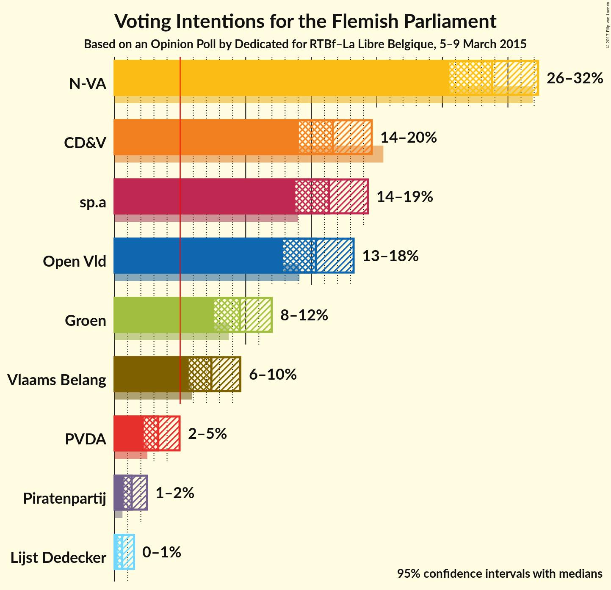
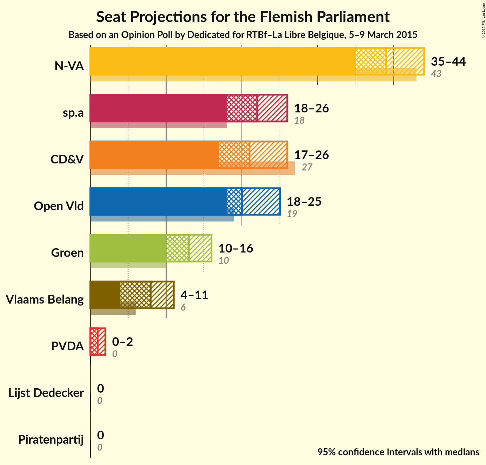
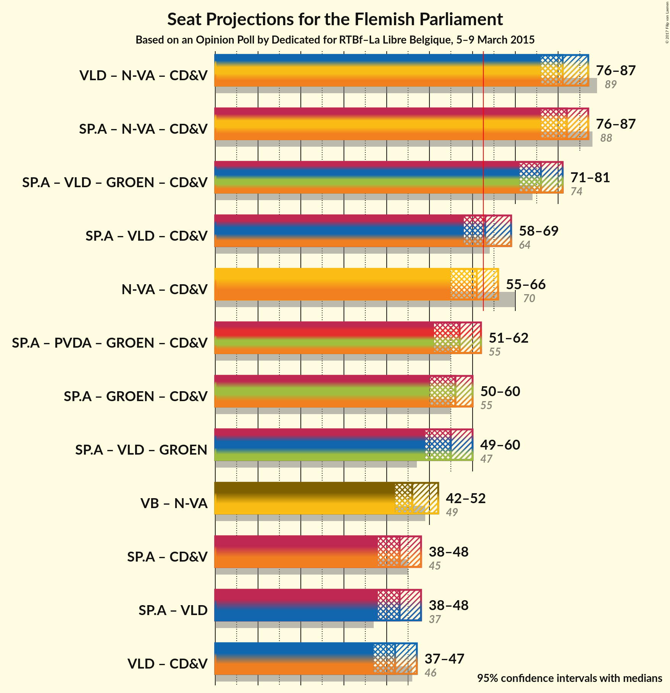

# Opinion Poll by Dedicated for RTBf–La Libre Belgique, 5–9 March 2015

<a href="#voting-intentions">Voting Intentions</a> | <a href="#seats">Seats</a> | <a href="#coalitions">Coalitions</a> | <a href="#technical-information">Technical Information</a>

## Voting Intentions

### Confidence Intervals

| Party | Last Result | Poll Result | 80% Confidence Interval | 90% Confidence Interval | 95% Confidence Interval | 99% Confidence Interval |
|:-----:|:-----------:|:-----------:|:-----------------------:|:-----------------------:|:-----------------------:|:-----------------------:|
| N-VA | 31.9% | 29.0% | 26.7–31.1% |26.1–31.7% |25.5–32.3% |24.5–33.4% |
| CD&V | 20.5% | 16.8% | 14.9–18.6% |14.4–19.1% |14.1–19.6% |13.3–20.6% |
| sp.a | 14.0% | 16.5% | 14.7–18.3% |14.2–18.8% |13.8–19.3% |13.0–20.3% |
| Open Vld | 14.1% | 15.5% | 13.7–17.2% |13.2–17.8% |12.8–18.2% |12.1–19.2% |
| Groen | 8.7% | 9.6% | 8.2–11.1% |7.9–11.6% |7.6–12.0% |7.0–12.8% |
| Vlaams Belang | 5.9% | 7.4% | 6.2–8.8% |5.9–9.2% |5.7–9.6% |5.2–10.3% |
| PVDA | 2.5% | 3.4% | 2.6–4.4% |2.4–4.7% |2.2–5.0% |1.9–5.5% |
| Piratenpartij | 0.6% | 1.3% | 0.9–2.1% |0.8–2.3% |0.7–2.5% |0.5–2.9% |
| Lijst Dedecker | 0.0% | 0.6% | 0.4–1.2% |0.3–1.3% |0.2–1.5% |0.2–1.8% |

*Note:* The poll result column reflects the actual value used in the calculations. Published results may vary slightly, and in addition be rounded to fewer digits.

## Seats

### Confidence Intervals

| Party | Last Result | Median | 80% Confidence Interval | 90% Confidence Interval | 95% Confidence Interval | 99% Confidence Interval |
|:-----:|:-----------:|:------:|:-----------------------:|:-----------------------:|:-----------------------:|:-----------------------:|
| <a href="#n-va">N-VA</a> | 43 | 39 | 36–42 |35–43 |35–43 |33–44 |
| <a href="#cd&v">CD&V</a> | 27 | 21 | 19–24 |19–26 |18–27 |15–27 |
| <a href="#sp.a">sp.a</a> | 18 | 20 | 19–24 |19–25 |19–25 |17–27 |
| <a href="#open-vld">Open Vld</a> | 19 | 20 | 19–23 |18–24 |18–25 |15–27 |
| <a href="#groen">Groen</a> | 10 | 12 | 10–15 |10–15 |9–16 |7–17 |
| <a href="#vlaams-belang">Vlaams Belang</a> | 6 | 8 | 6–10 |4–11 |4–11 |4–12 |
| <a href="#pvda">PVDA</a> | 0 | 1 | 0–2 |0–2 |0–3 |0–5 |
| <a href="#piratenpartij">Piratenpartij</a> | 0 | 0 | 0 |0 |0 |0 |
| <a href="#lijst-dedecker">Lijst Dedecker</a> | 0 | 0 | 0 |0 |0 |0 |

### N-VA

| Number of Seats | Probability | Accumulated |
|:---------------:|:-----------:|:-----------:|
| 31 | 0.1% | 100% |
| 32 | 0.2% | 99.9% |
| 33 | 0.8% | 99.7% |
| 34 | 1.3% | 98.9% |
| 35 | 4% | 98% |
| 36 | 4% | 93% |
| 37 | 17% | 90% |
| 38 | 16% | 73% |
| 39 | 8% | 57% |
| 40 | 12% | 49% |
| 41 | 6% | 37% |
| 42 | 23% | 31% |
| 43 | 6% | 8% |
| 44 | 2% | 2% |
| 45 | 0.2% | 0.5% |
| 46 | 0.1% | 0.3% |
| 47 | 0.1% | 0.1% |
| 48 | 0% | 0% |

### CD&V

| Number of Seats | Probability | Accumulated |
|:---------------:|:-----------:|:-----------:|
| 15 | 0.9% | 100% |
| 16 | 0.6% | 99.1% |
| 17 | 0.9% | 98% |
| 18 | 1.3% | 98% |
| 19 | 10% | 96% |
| 20 | 17% | 86% |
| 21 | 45% | 69% |
| 22 | 4% | 24% |
| 23 | 2% | 19% |
| 24 | 10% | 18% |
| 25 | 3% | 8% |
| 26 | 3% | 5% |
| 27 | 2% | 3% |
| 28 | 0% | 0.2% |
| 29 | 0% | 0.1% |
| 30 | 0.1% | 0.1% |
| 31 | 0% | 0% |

### sp.a

| Number of Seats | Probability | Accumulated |
|:---------------:|:-----------:|:-----------:|
| 15 | 0.1% | 100% |
| 16 | 0.1% | 99.8% |
| 17 | 1.1% | 99.7% |
| 18 | 0.8% | 98.5% |
| 19 | 21% | 98% |
| 20 | 33% | 77% |
| 21 | 3% | 44% |
| 22 | 4% | 41% |
| 23 | 10% | 37% |
| 24 | 20% | 27% |
| 25 | 5% | 7% |
| 26 | 0.6% | 2% |
| 27 | 0.6% | 1.1% |
| 28 | 0.4% | 0.5% |
| 29 | 0.1% | 0.1% |
| 30 | 0% | 0% |

### Open Vld

| Number of Seats | Probability | Accumulated |
|:---------------:|:-----------:|:-----------:|
| 13 | 0.1% | 100% |
| 14 | 0.3% | 99.9% |
| 15 | 0.2% | 99.6% |
| 16 | 0.6% | 99.4% |
| 17 | 1.1% | 98.7% |
| 18 | 3% | 98% |
| 19 | 25% | 94% |
| 20 | 36% | 70% |
| 21 | 7% | 34% |
| 22 | 7% | 27% |
| 23 | 13% | 20% |
| 24 | 3% | 6% |
| 25 | 2% | 4% |
| 26 | 0.7% | 2% |
| 27 | 0.8% | 1.0% |
| 28 | 0.2% | 0.2% |
| 29 | 0% | 0% |

### Groen

| Number of Seats | Probability | Accumulated |
|:---------------:|:-----------:|:-----------:|
| 7 | 0.5% | 100% |
| 8 | 2% | 99.4% |
| 9 | 0.5% | 98% |
| 10 | 19% | 97% |
| 11 | 5% | 78% |
| 12 | 24% | 73% |
| 13 | 8% | 49% |
| 14 | 30% | 42% |
| 15 | 8% | 11% |
| 16 | 3% | 3% |
| 17 | 0.5% | 0.6% |
| 18 | 0% | 0.1% |
| 19 | 0% | 0% |

### Vlaams Belang

| Number of Seats | Probability | Accumulated |
|:---------------:|:-----------:|:-----------:|
| 2 | 0% | 100% |
| 3 | 0.2% | 99.9% |
| 4 | 6% | 99.7% |
| 5 | 1.1% | 94% |
| 6 | 12% | 93% |
| 7 | 10% | 81% |
| 8 | 58% | 70% |
| 9 | 1.2% | 12% |
| 10 | 3% | 11% |
| 11 | 7% | 8% |
| 12 | 1.0% | 1.1% |
| 13 | 0.1% | 0.1% |
| 14 | 0% | 0% |

### PVDA

| Number of Seats | Probability | Accumulated |
|:---------------:|:-----------:|:-----------:|
| 0 | 26% | 100% |
| 1 | 45% | 74% |
| 2 | 26% | 29% |
| 3 | 1.2% | 3% |
| 4 | 0.5% | 2% |
| 5 | 1.3% | 1.3% |
| 6 | 0% | 0% |

### Piratenpartij

| Number of Seats | Probability | Accumulated |
|:---------------:|:-----------:|:-----------:|
| 0 | 100% | 100% |
| 1 | 0% | 0% |

### Lijst Dedecker

| Number of Seats | Probability | Accumulated |
|:---------------:|:-----------:|:-----------:|
| 0 | 100% | 100% |
| 1 | 0% | 0% |

## Coalitions

### Confidence Intervals

| Coalition | Last Result | Median | 80% Confidence Interval | 90% Confidence Interval | 95% Confidence Interval | 99% Confidence Interval |
|:---------:|:-----------:|:------:|:-----------------------:|:-----------------------:|:-----------------------:|:-----------------------:|
| N-VA – CD&V – sp.a | 88 | 83 | 79–85 | 77–86 | 76–87 | 75–88 |
| N-VA – CD&V – Open Vld | 89 | 82 | 77–84 | 76–87 | 75–87 | 74–89 |
| CD&V – sp.a – Open Vld – Groen | 74 | 75 | 73–79 | 72–80 | 71–81 | 69–84 |
| CD&V – sp.a – Open Vld | 64 | 62 | 60–67 | 59–68 | 58–69 | 57–71 |
| N-VA – CD&V | 70 | 61 | 57–64 | 56–64 | 55–65 | 54–67 |
| CD&V – sp.a – Groen – PVDA | 55 | 56 | 53–60 | 52–60 | 51–61 | 50–64 |
| CD&V – sp.a – Groen | 55 | 54 | 52–59 | 51–59 | 50–61 | 49–64 |
| sp.a – Open Vld – Groen | 47 | 54 | 52–58 | 49–60 | 48–60 | 48–62 |
| N-VA – Vlaams Belang | 49 | 48 | 43–50 | 43–51 | 42–51 | 40–53 |
| CD&V – sp.a | 45 | 42 | 40–46 | 39–48 | 38–48 | 36–51 |
| CD&V – Open Vld | 46 | 41 | 38–45 | 38–46 | 37–48 | 35–50 |
| sp.a – Open Vld | 37 | 42 | 38–46 | 38–47 | 38–47 | 35–49 |

### N-VA – CD&V – sp.a

| Number of Seats | Probability | Accumulated |
|:---------------:|:-----------:|:-----------:|
| 73 | 0.2% | 100% |
| 74 | 0.1% | 99.8% |
| 75 | 1.1% | 99.7% |
| 76 | 2% | 98.6% |
| 77 | 3% | 97% |
| 78 | 2% | 94% |
| 79 | 9% | 92% |
| 80 | 11% | 83% |
| 81 | 12% | 72% |
| 82 | 10% | 60% |
| 83 | 27% | 50% |
| 84 | 13% | 23% |
| 85 | 3% | 10% |
| 86 | 5% | 8% |
| 87 | 2% | 3% |
| 88 | 0.8% | 1.2% |
| 89 | 0.3% | 0.4% |
| 90 | 0% | 0.1% |
| 91 | 0% | 0.1% |
| 92 | 0% | 0% |

### N-VA – CD&V – Open Vld

| Number of Seats | Probability | Accumulated |
|:---------------:|:-----------:|:-----------:|
| 71 | 0% | 100% |
| 72 | 0% | 99.9% |
| 73 | 0.1% | 99.9% |
| 74 | 0.6% | 99.8% |
| 75 | 3% | 99.2% |
| 76 | 6% | 96% |
| 77 | 3% | 90% |
| 78 | 10% | 88% |
| 79 | 11% | 78% |
| 80 | 5% | 67% |
| 81 | 8% | 61% |
| 82 | 8% | 53% |
| 83 | 32% | 45% |
| 84 | 4% | 13% |
| 85 | 2% | 9% |
| 86 | 1.3% | 7% |
| 87 | 5% | 6% |
| 88 | 0.3% | 0.9% |
| 89 | 0.1% | 0.6% |
| 90 | 0.3% | 0.4% |
| 91 | 0.1% | 0.1% |
| 92 | 0% | 0% |

### CD&V – sp.a – Open Vld – Groen

| Number of Seats | Probability | Accumulated |
|:---------------:|:-----------:|:-----------:|
| 67 | 0.1% | 100% |
| 68 | 0% | 99.9% |
| 69 | 0.8% | 99.9% |
| 70 | 0.6% | 99.1% |
| 71 | 1.1% | 98.5% |
| 72 | 6% | 97% |
| 73 | 30% | 91% |
| 74 | 9% | 61% |
| 75 | 4% | 51% |
| 76 | 8% | 47% |
| 77 | 6% | 39% |
| 78 | 8% | 33% |
| 79 | 15% | 24% |
| 80 | 5% | 9% |
| 81 | 3% | 4% |
| 82 | 0.6% | 2% |
| 83 | 0.2% | 0.9% |
| 84 | 0.6% | 0.7% |
| 85 | 0% | 0.1% |
| 86 | 0.1% | 0.1% |
| 87 | 0% | 0% |

### CD&V – sp.a – Open Vld

| Number of Seats | Probability | Accumulated |
|:---------------:|:-----------:|:-----------:|
| 55 | 0.1% | 100% |
| 56 | 0.3% | 99.8% |
| 57 | 0.7% | 99.6% |
| 58 | 2% | 98.8% |
| 59 | 5% | 97% |
| 60 | 3% | 92% |
| 61 | 27% | 88% |
| 62 | 12% | 61% |
| 63 | 6% | 49% |
| 64 | 14% | 43% |
| 65 | 10% | 29% |
| 66 | 4% | 19% |
| 67 | 8% | 15% |
| 68 | 3% | 7% |
| 69 | 1.4% | 3% |
| 70 | 1.0% | 2% |
| 71 | 0.8% | 1.0% |
| 72 | 0.2% | 0.2% |
| 73 | 0.1% | 0.1% |
| 74 | 0% | 0% |

### N-VA – CD&V

| Number of Seats | Probability | Accumulated |
|:---------------:|:-----------:|:-----------:|
| 52 | 0.2% | 100% |
| 53 | 0.3% | 99.8% |
| 54 | 0.4% | 99.5% |
| 55 | 2% | 99.1% |
| 56 | 6% | 97% |
| 57 | 7% | 91% |
| 58 | 12% | 84% |
| 59 | 10% | 72% |
| 60 | 11% | 62% |
| 61 | 5% | 51% |
| 62 | 10% | 46% |
| 63 | 22% | 36% |
| 64 | 11% | 15% |
| 65 | 1.5% | 3% |
| 66 | 0.4% | 2% |
| 67 | 0.8% | 1.2% |
| 68 | 0.3% | 0.4% |
| 69 | 0% | 0.1% |
| 70 | 0% | 0% |

### CD&V – sp.a – Groen – PVDA

| Number of Seats | Probability | Accumulated |
|:---------------:|:-----------:|:-----------:|
| 47 | 0.1% | 100% |
| 48 | 0% | 99.9% |
| 49 | 0.2% | 99.9% |
| 50 | 1.2% | 99.7% |
| 51 | 1.4% | 98% |
| 52 | 6% | 97% |
| 53 | 5% | 92% |
| 54 | 26% | 86% |
| 55 | 5% | 61% |
| 56 | 10% | 55% |
| 57 | 11% | 45% |
| 58 | 10% | 34% |
| 59 | 9% | 24% |
| 60 | 12% | 15% |
| 61 | 0.9% | 3% |
| 62 | 0.6% | 2% |
| 63 | 0.3% | 2% |
| 64 | 2% | 2% |
| 65 | 0% | 0.1% |
| 66 | 0% | 0% |

### CD&V – sp.a – Groen

| Number of Seats | Probability | Accumulated |
|:---------------:|:-----------:|:-----------:|
| 46 | 0.1% | 100% |
| 47 | 0% | 99.9% |
| 48 | 0.2% | 99.9% |
| 49 | 0.7% | 99.6% |
| 50 | 2% | 99.0% |
| 51 | 6% | 97% |
| 52 | 2% | 90% |
| 53 | 30% | 89% |
| 54 | 10% | 58% |
| 55 | 4% | 48% |
| 56 | 10% | 44% |
| 57 | 9% | 34% |
| 58 | 14% | 26% |
| 59 | 8% | 12% |
| 60 | 1.3% | 4% |
| 61 | 0.5% | 3% |
| 62 | 0.5% | 2% |
| 63 | 0.9% | 2% |
| 64 | 0.6% | 0.7% |
| 65 | 0% | 0% |

### sp.a – Open Vld – Groen

| Number of Seats | Probability | Accumulated |
|:---------------:|:-----------:|:-----------:|
| 46 | 0% | 100% |
| 47 | 0.1% | 99.9% |
| 48 | 4% | 99.8% |
| 49 | 1.4% | 95% |
| 50 | 0.8% | 94% |
| 51 | 2% | 93% |
| 52 | 26% | 91% |
| 53 | 13% | 65% |
| 54 | 12% | 53% |
| 55 | 5% | 41% |
| 56 | 5% | 36% |
| 57 | 10% | 30% |
| 58 | 12% | 20% |
| 59 | 3% | 8% |
| 60 | 4% | 6% |
| 61 | 0.9% | 1.5% |
| 62 | 0.3% | 0.5% |
| 63 | 0.2% | 0.2% |
| 64 | 0.1% | 0.1% |
| 65 | 0% | 0% |

### N-VA – Vlaams Belang

| Number of Seats | Probability | Accumulated |
|:---------------:|:-----------:|:-----------:|
| 38 | 0.2% | 100% |
| 39 | 0.1% | 99.8% |
| 40 | 0.7% | 99.7% |
| 41 | 0.4% | 99.0% |
| 42 | 3% | 98.6% |
| 43 | 6% | 96% |
| 44 | 15% | 89% |
| 45 | 8% | 75% |
| 46 | 10% | 66% |
| 47 | 6% | 56% |
| 48 | 10% | 50% |
| 49 | 10% | 40% |
| 50 | 23% | 30% |
| 51 | 5% | 7% |
| 52 | 1.2% | 2% |
| 53 | 0.3% | 0.6% |
| 54 | 0.2% | 0.3% |
| 55 | 0.1% | 0.1% |
| 56 | 0% | 0% |

### CD&V – sp.a

| Number of Seats | Probability | Accumulated |
|:---------------:|:-----------:|:-----------:|
| 35 | 0.3% | 100% |
| 36 | 0.6% | 99.7% |
| 37 | 0.9% | 99.1% |
| 38 | 2% | 98% |
| 39 | 6% | 96% |
| 40 | 6% | 90% |
| 41 | 31% | 85% |
| 42 | 7% | 54% |
| 43 | 15% | 47% |
| 44 | 7% | 32% |
| 45 | 13% | 24% |
| 46 | 4% | 11% |
| 47 | 1.2% | 7% |
| 48 | 3% | 6% |
| 49 | 1.2% | 2% |
| 50 | 0.6% | 1.3% |
| 51 | 0.6% | 0.7% |
| 52 | 0.1% | 0.1% |
| 53 | 0% | 0% |

### CD&V – Open Vld

| Number of Seats | Probability | Accumulated |
|:---------------:|:-----------:|:-----------:|
| 33 | 0.1% | 100% |
| 34 | 0.1% | 99.9% |
| 35 | 1.1% | 99.8% |
| 36 | 0.9% | 98.7% |
| 37 | 0.6% | 98% |
| 38 | 8% | 97% |
| 39 | 10% | 89% |
| 40 | 4% | 80% |
| 41 | 32% | 75% |
| 42 | 9% | 43% |
| 43 | 8% | 34% |
| 44 | 12% | 27% |
| 45 | 6% | 15% |
| 46 | 5% | 9% |
| 47 | 1.4% | 4% |
| 48 | 1.5% | 3% |
| 49 | 0.6% | 1.3% |
| 50 | 0.5% | 0.7% |
| 51 | 0.2% | 0.2% |
| 52 | 0% | 0% |

### sp.a – Open Vld

| Number of Seats | Probability | Accumulated |
|:---------------:|:-----------:|:-----------:|
| 34 | 0.1% | 100% |
| 35 | 0.7% | 99.9% |
| 36 | 0.2% | 99.2% |
| 37 | 0.6% | 99.1% |
| 38 | 9% | 98% |
| 39 | 5% | 90% |
| 40 | 28% | 85% |
| 41 | 4% | 57% |
| 42 | 10% | 53% |
| 43 | 19% | 43% |
| 44 | 10% | 24% |
| 45 | 4% | 14% |
| 46 | 4% | 10% |
| 47 | 5% | 7% |
| 48 | 0.4% | 1.4% |
| 49 | 0.7% | 1.0% |
| 50 | 0.1% | 0.3% |
| 51 | 0.1% | 0.2% |
| 52 | 0% | 0% |

## Technical Information

### Opinion Poll

+ **Pollster:** Dedicated
+ **Media:** RTBf–La Libre Belgique
+ **Fieldwork period:** 5–9 March 2015

### Calculations

+ **Sample size:** 686
+ **Simulations done:** 1,048,576
+ **Error estimate:** 2.53%

