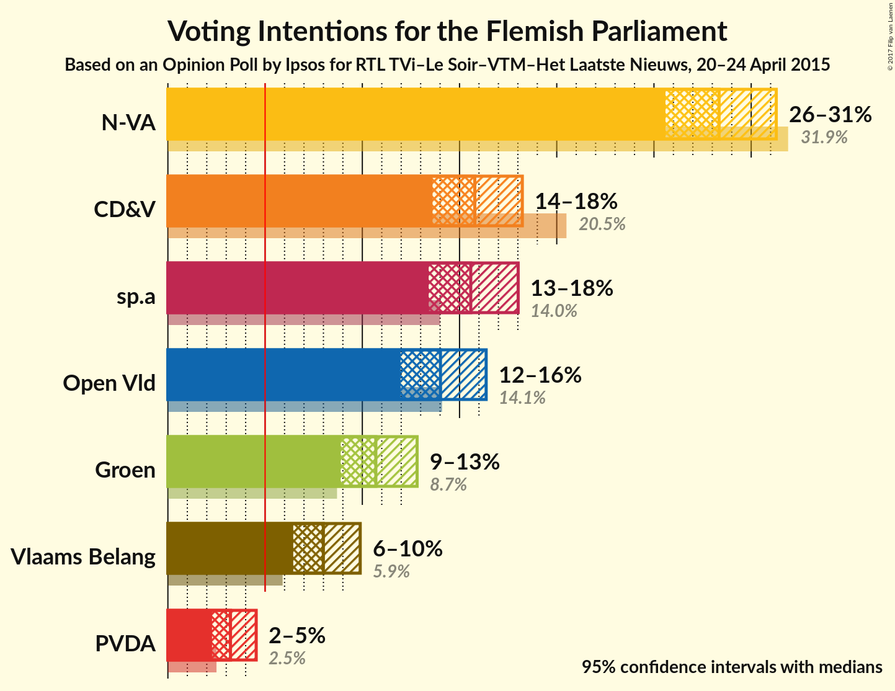
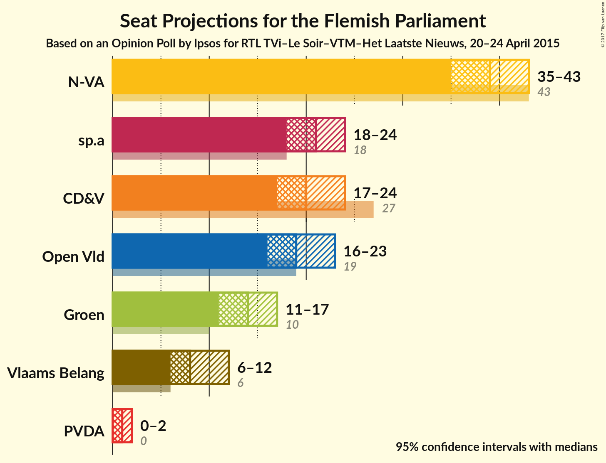
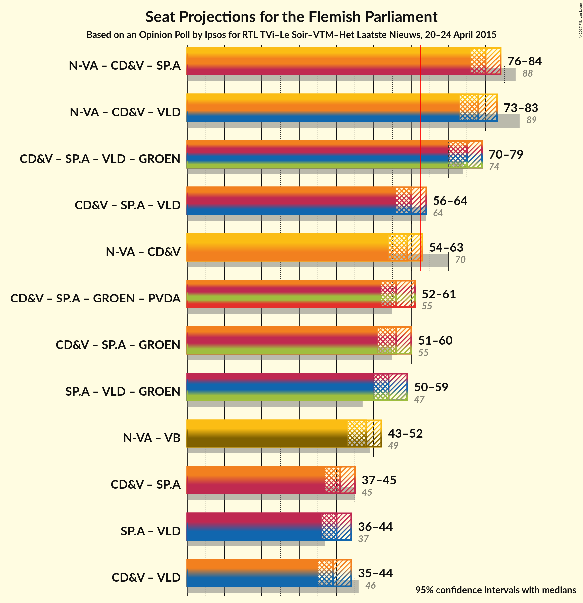

# Opinion Poll by Ipsos for RTL TVi–Le Soir–VTM–Het Laatste Nieuws, 20–24 April 2015

<a href="#voting-intentions">Voting Intentions</a> | <a href="#seats">Seats</a> | <a href="#coalitions">Coalitions</a> | <a href="#technical-information">Technical Information</a>

## Voting Intentions

### Confidence Intervals

| Party | Last Result | Poll Result | 80% Confidence Interval | 90% Confidence Interval | 95% Confidence Interval | 99% Confidence Interval |
|:-----:|:-----------:|:-----------:|:-----------------------:|:-----------------------:|:-----------------------:|:-----------------------:|
| N-VA | 31.9% | 28.3% | 26.5–30.3% |26.0–30.8% |25.6–31.3% |24.7–32.2% |
| CD&V | 20.5% | 15.8% | 14.4–17.4% |14.0–17.8% |13.6–18.2% |13.0–19.0% |
| sp.a | 14.0% | 15.6% | 14.2–17.2% |13.8–17.6% |13.4–18.0% |12.8–18.8% |
| Open Vld | 14.1% | 14.0% | 12.7–15.5% |12.3–16.0% |12.0–16.4% |11.3–17.1% |
| Groen | 8.7% | 10.7% | 9.5–12.1% |9.2–12.5% |8.9–12.8% |8.4–13.5% |
| Vlaams Belang | 5.9% | 8.0% | 7.0–9.2% |6.7–9.6% |6.4–9.9% |6.0–10.5% |
| PVDA | 2.5% | 3.2% | 2.6–4.1% |2.4–4.3% |2.3–4.5% |2.0–5.0% |

*Note:* The poll result column reflects the actual value used in the calculations. Published results may vary slightly, and in addition be rounded to fewer digits.

## Seats

### Confidence Intervals

| Party | Last Result | Median | 80% Confidence Interval | 90% Confidence Interval | 95% Confidence Interval | 99% Confidence Interval |
|:-----:|:-----------:|:------:|:-----------------------:|:-----------------------:|:-----------------------:|:-----------------------:|
| <a href="#n-va">N-VA</a> | 43 | 39 | 36–42 |35–42 |35–43 |34–45 |
| <a href="#cd&v">CD&V</a> | 27 | 20 | 18–22 |17–23 |17–24 |15–26 |
| <a href="#sp.a">sp.a</a> | 18 | 20 | 19–24 |18–24 |18–24 |17–26 |
| <a href="#open-vld">Open Vld</a> | 19 | 19 | 18–21 |17–22 |16–23 |13–24 |
| <a href="#groen">Groen</a> | 10 | 14 | 14–16 |13–17 |11–17 |10–18 |
| <a href="#vlaams-belang">Vlaams Belang</a> | 6 | 8 | 8–11 |7–11 |6–12 |6–12 |
| <a href="#pvda">PVDA</a> | 0 | 1 | 0–2 |0–2 |0–2 |0–3 |

### N-VA

*For a full overview of the results for this party, see the [N-VA](party-nva.html) page.*

| Number of Seats | Probability | Accumulated | Special Marks |
|:---------------:|:-----------:|:-----------:|:-------------:|
| 32 | 0.1% | 100% |  |
| 33 | 0.2% | 99.9% |  |
| 34 | 1.5% | 99.7% |  |
| 35 | 4% | 98% |  |
| 36 | 7% | 95% |  |
| 37 | 14% | 88% |  |
| 38 | 18% | 74% |  |
| 39 | 17% | 56% | Median |
| 40 | 13% | 39% |  |
| 41 | 12% | 27% |  |
| 42 | 11% | 15% |  |
| 43 | 2% | 4% | Last Result |
| 44 | 0.9% | 1.5% |  |
| 45 | 0.5% | 0.6% |  |
| 46 | 0.1% | 0.1% |  |
| 47 | 0% | 0% |  |

### CD&V

*For a full overview of the results for this party, see the [CD&V](party-cdv.html) page.*

| Number of Seats | Probability | Accumulated | Special Marks |
|:---------------:|:-----------:|:-----------:|:-------------:|
| 15 | 0.5% | 100% |  |
| 16 | 1.5% | 99.5% |  |
| 17 | 5% | 98% |  |
| 18 | 7% | 93% |  |
| 19 | 12% | 86% |  |
| 20 | 33% | 74% | Median |
| 21 | 27% | 41% |  |
| 22 | 7% | 14% |  |
| 23 | 3% | 7% |  |
| 24 | 2% | 4% |  |
| 25 | 1.2% | 2% |  |
| 26 | 0.4% | 0.6% |  |
| 27 | 0.1% | 0.1% | Last Result |
| 28 | 0% | 0% |  |

### sp.a

*For a full overview of the results for this party, see the [sp.a](party-spa.html) page.*

| Number of Seats | Probability | Accumulated | Special Marks |
|:---------------:|:-----------:|:-----------:|:-------------:|
| 15 | 0.1% | 100% |  |
| 16 | 0.3% | 99.9% |  |
| 17 | 0.8% | 99.6% |  |
| 18 | 8% | 98.8% | Last Result |
| 19 | 32% | 91% |  |
| 20 | 10% | 59% | Median |
| 21 | 10% | 49% |  |
| 22 | 10% | 39% |  |
| 23 | 18% | 29% |  |
| 24 | 9% | 11% |  |
| 25 | 0.9% | 1.5% |  |
| 26 | 0.3% | 0.6% |  |
| 27 | 0.2% | 0.3% |  |
| 28 | 0.1% | 0.1% |  |
| 29 | 0% | 0% |  |

### Open Vld

*For a full overview of the results for this party, see the [Open Vld](party-openvld.html) page.*

| Number of Seats | Probability | Accumulated | Special Marks |
|:---------------:|:-----------:|:-----------:|:-------------:|
| 13 | 0.5% | 100% |  |
| 14 | 0.6% | 99.5% |  |
| 15 | 1.1% | 98.8% |  |
| 16 | 1.4% | 98% |  |
| 17 | 4% | 96% |  |
| 18 | 8% | 92% |  |
| 19 | 64% | 84% | Last Result, Median |
| 20 | 6% | 20% |  |
| 21 | 5% | 13% |  |
| 22 | 4% | 9% |  |
| 23 | 4% | 5% |  |
| 24 | 1.0% | 1.0% |  |
| 25 | 0.1% | 0.1% |  |
| 26 | 0% | 0% |  |

### Groen

*For a full overview of the results for this party, see the [Groen](party-groen.html) page.*

| Number of Seats | Probability | Accumulated | Special Marks |
|:---------------:|:-----------:|:-----------:|:-------------:|
| 10 | 2% | 100% | Last Result |
| 11 | 1.3% | 98% |  |
| 12 | 1.4% | 96% |  |
| 13 | 4% | 95% |  |
| 14 | 63% | 91% | Median |
| 15 | 11% | 28% |  |
| 16 | 8% | 17% |  |
| 17 | 9% | 9% |  |
| 18 | 0.4% | 0.7% |  |
| 19 | 0.2% | 0.4% |  |
| 20 | 0.1% | 0.1% |  |
| 21 | 0% | 0% |  |

### Vlaams Belang

*For a full overview of the results for this party, see the [Vlaams Belang](party-vlaamsbelang.html) page.*

| Number of Seats | Probability | Accumulated | Special Marks |
|:---------------:|:-----------:|:-----------:|:-------------:|
| 4 | 0.1% | 100% |  |
| 5 | 0.1% | 99.9% |  |
| 6 | 3% | 99.7% | Last Result |
| 7 | 2% | 96% |  |
| 8 | 67% | 95% | Median |
| 9 | 7% | 28% |  |
| 10 | 6% | 21% |  |
| 11 | 11% | 15% |  |
| 12 | 3% | 3% |  |
| 13 | 0.1% | 0.2% |  |
| 14 | 0.1% | 0.1% |  |
| 15 | 0% | 0% |  |

### PVDA

*For a full overview of the results for this party, see the [PVDA](party-pvda.html) page.*

| Number of Seats | Probability | Accumulated | Special Marks |
|:---------------:|:-----------:|:-----------:|:-------------:|
| 0 | 45% | 100% | Last Result |
| 1 | 19% | 55% | Median |
| 2 | 35% | 36% |  |
| 3 | 0.8% | 1.0% |  |
| 4 | 0.1% | 0.2% |  |
| 5 | 0.1% | 0.1% |  |
| 6 | 0% | 0% |  |

## Coalitions

### Confidence Intervals

| Coalition | Last Result | Median | Majority? | 80% Confidence Interval | 90% Confidence Interval | 95% Confidence Interval | 99% Confidence Interval |
|:---------:|:-----------:|:------:|:---------:|:-----------------------:|:-----------------------:|:-----------------------:|:-----------------------:|
| N-VA – CD&V – sp.a | 88 | 80 | 100% | 77–82 | 76–83 | 76–84 | 74–86 |
| N-VA – CD&V – Open Vld | 89 | 78 | 100% | 75–82 | 74–82 | 73–83 | 72–84 |
| CD&V – sp.a – Open Vld – Groen | 74 | 75 | 100% | 72–77 | 71–78 | 70–79 | 69–80 |
| CD&V – sp.a – Open Vld | 64 | 60 | 16% | 57–63 | 56–64 | 56–65 | 54–66 |
| N-VA – CD&V | 70 | 59 | 9% | 56–62 | 55–63 | 54–63 | 53–65 |
| CD&V – sp.a – Groen – PVDA | 55 | 56 | 0.5% | 53–59 | 52–60 | 52–61 | 50–63 |
| CD&V – sp.a – Groen | 55 | 55 | 0.1% | 52–58 | 52–59 | 51–60 | 49–62 |
| sp.a – Open Vld – Groen | 47 | 54 | 0% | 52–57 | 51–58 | 50–59 | 48–60 |
| N-VA – Vlaams Belang | 49 | 48 | 0% | 45–50 | 44–51 | 43–52 | 42–54 |
| CD&V – sp.a | 45 | 41 | 0% | 38–44 | 37–45 | 37–45 | 35–47 |
| sp.a – Open Vld | 37 | 40 | 0% | 38–43 | 37–43 | 36–44 | 34–46 |
| CD&V – Open Vld | 46 | 39 | 0% | 37–42 | 36–43 | 35–44 | 34–45 |

### N-VA – CD&V – sp.a

| Number of Seats | Probability | Accumulated | Special Marks |
|:---------------:|:-----------:|:-----------:|:-------------:|
| 72 | 0.1% | 100% |  |
| 73 | 0.3% | 99.9% |  |
| 74 | 0.6% | 99.6% |  |
| 75 | 1.3% | 99.1% |  |
| 76 | 5% | 98% |  |
| 77 | 8% | 93% |  |
| 78 | 10% | 85% |  |
| 79 | 13% | 75% | Median |
| 80 | 19% | 62% |  |
| 81 | 18% | 43% |  |
| 82 | 16% | 25% |  |
| 83 | 5% | 9% |  |
| 84 | 2% | 4% |  |
| 85 | 1.1% | 2% |  |
| 86 | 0.8% | 1.1% |  |
| 87 | 0.1% | 0.2% |  |
| 88 | 0.1% | 0.1% | Last Result |
| 89 | 0% | 0% |  |

### N-VA – CD&V – Open Vld

| Number of Seats | Probability | Accumulated | Special Marks |
|:---------------:|:-----------:|:-----------:|:-------------:|
| 70 | 0.1% | 100% |  |
| 71 | 0.3% | 99.9% |  |
| 72 | 0.8% | 99.7% |  |
| 73 | 2% | 98.9% |  |
| 74 | 3% | 97% |  |
| 75 | 5% | 94% |  |
| 76 | 11% | 89% |  |
| 77 | 15% | 78% |  |
| 78 | 17% | 63% | Median |
| 79 | 11% | 45% |  |
| 80 | 13% | 34% |  |
| 81 | 11% | 21% |  |
| 82 | 7% | 11% |  |
| 83 | 2% | 3% |  |
| 84 | 0.4% | 0.7% |  |
| 85 | 0.2% | 0.3% |  |
| 86 | 0.1% | 0.1% |  |
| 87 | 0% | 0% |  |
| 88 | 0% | 0% |  |
| 89 | 0% | 0% | Last Result |

### CD&V – sp.a – Open Vld – Groen

| Number of Seats | Probability | Accumulated | Special Marks |
|:---------------:|:-----------:|:-----------:|:-------------:|
| 67 | 0.1% | 100% |  |
| 68 | 0.3% | 99.9% |  |
| 69 | 1.1% | 99.6% |  |
| 70 | 2% | 98.5% |  |
| 71 | 4% | 96% |  |
| 72 | 12% | 92% |  |
| 73 | 16% | 80% | Median |
| 74 | 14% | 64% | Last Result |
| 75 | 15% | 51% |  |
| 76 | 15% | 36% |  |
| 77 | 13% | 21% |  |
| 78 | 4% | 8% |  |
| 79 | 3% | 4% |  |
| 80 | 1.3% | 2% |  |
| 81 | 0.2% | 0.2% |  |
| 82 | 0% | 0.1% |  |
| 83 | 0% | 0% |  |

### CD&V – sp.a – Open Vld

| Number of Seats | Probability | Accumulated | Special Marks |
|:---------------:|:-----------:|:-----------:|:-------------:|
| 53 | 0.1% | 100% |  |
| 54 | 0.6% | 99.8% |  |
| 55 | 1.4% | 99.2% |  |
| 56 | 3% | 98% |  |
| 57 | 7% | 94% |  |
| 58 | 13% | 88% |  |
| 59 | 15% | 75% | Median |
| 60 | 14% | 59% |  |
| 61 | 15% | 45% |  |
| 62 | 14% | 30% |  |
| 63 | 10% | 16% | Majority |
| 64 | 4% | 6% | Last Result |
| 65 | 2% | 3% |  |
| 66 | 0.9% | 1.2% |  |
| 67 | 0.2% | 0.4% |  |
| 68 | 0.1% | 0.2% |  |
| 69 | 0% | 0% |  |

### N-VA – CD&V

| Number of Seats | Probability | Accumulated | Special Marks |
|:---------------:|:-----------:|:-----------:|:-------------:|
| 52 | 0.1% | 100% |  |
| 53 | 0.5% | 99.8% |  |
| 54 | 2% | 99.3% |  |
| 55 | 3% | 97% |  |
| 56 | 6% | 94% |  |
| 57 | 12% | 88% |  |
| 58 | 15% | 76% |  |
| 59 | 18% | 61% | Median |
| 60 | 13% | 43% |  |
| 61 | 12% | 30% |  |
| 62 | 9% | 18% |  |
| 63 | 7% | 9% | Majority |
| 64 | 1.2% | 2% |  |
| 65 | 0.5% | 0.8% |  |
| 66 | 0.2% | 0.3% |  |
| 67 | 0.1% | 0.1% |  |
| 68 | 0% | 0% |  |
| 69 | 0% | 0% |  |
| 70 | 0% | 0% | Last Result |

### CD&V – sp.a – Groen – PVDA

| Number of Seats | Probability | Accumulated | Special Marks |
|:---------------:|:-----------:|:-----------:|:-------------:|
| 48 | 0% | 100% |  |
| 49 | 0.1% | 99.9% |  |
| 50 | 0.6% | 99.8% |  |
| 51 | 2% | 99.3% |  |
| 52 | 4% | 98% |  |
| 53 | 6% | 94% |  |
| 54 | 13% | 88% |  |
| 55 | 15% | 75% | Last Result, Median |
| 56 | 13% | 60% |  |
| 57 | 13% | 47% |  |
| 58 | 15% | 34% |  |
| 59 | 12% | 19% |  |
| 60 | 4% | 8% |  |
| 61 | 2% | 4% |  |
| 62 | 1.4% | 2% |  |
| 63 | 0.4% | 0.5% | Majority |
| 64 | 0.1% | 0.1% |  |
| 65 | 0% | 0% |  |

### CD&V – sp.a – Groen

| Number of Seats | Probability | Accumulated | Special Marks |
|:---------------:|:-----------:|:-----------:|:-------------:|
| 48 | 0.1% | 100% |  |
| 49 | 0.5% | 99.8% |  |
| 50 | 1.3% | 99.4% |  |
| 51 | 3% | 98% |  |
| 52 | 7% | 95% |  |
| 53 | 13% | 88% |  |
| 54 | 15% | 75% | Median |
| 55 | 12% | 61% | Last Result |
| 56 | 13% | 49% |  |
| 57 | 16% | 36% |  |
| 58 | 12% | 20% |  |
| 59 | 4% | 8% |  |
| 60 | 2% | 4% |  |
| 61 | 1.2% | 2% |  |
| 62 | 0.6% | 0.7% |  |
| 63 | 0.1% | 0.1% | Majority |
| 64 | 0% | 0% |  |

### sp.a – Open Vld – Groen

| Number of Seats | Probability | Accumulated | Special Marks |
|:---------------:|:-----------:|:-----------:|:-------------:|
| 46 | 0% | 100% |  |
| 47 | 0.1% | 99.9% | Last Result |
| 48 | 0.4% | 99.8% |  |
| 49 | 0.9% | 99.4% |  |
| 50 | 1.3% | 98% |  |
| 51 | 4% | 97% |  |
| 52 | 22% | 93% |  |
| 53 | 12% | 72% | Median |
| 54 | 13% | 60% |  |
| 55 | 13% | 47% |  |
| 56 | 19% | 35% |  |
| 57 | 7% | 16% |  |
| 58 | 5% | 9% |  |
| 59 | 2% | 3% |  |
| 60 | 0.5% | 0.8% |  |
| 61 | 0.2% | 0.3% |  |
| 62 | 0.1% | 0.1% |  |
| 63 | 0% | 0% | Majority |

### N-VA – Vlaams Belang

| Number of Seats | Probability | Accumulated | Special Marks |
|:---------------:|:-----------:|:-----------:|:-------------:|
| 41 | 0.1% | 100% |  |
| 42 | 1.0% | 99.8% |  |
| 43 | 2% | 98.9% |  |
| 44 | 6% | 96% |  |
| 45 | 10% | 91% |  |
| 46 | 15% | 80% |  |
| 47 | 14% | 66% | Median |
| 48 | 15% | 52% |  |
| 49 | 15% | 36% | Last Result |
| 50 | 12% | 21% |  |
| 51 | 4% | 9% |  |
| 52 | 3% | 4% |  |
| 53 | 1.0% | 2% |  |
| 54 | 0.4% | 0.5% |  |
| 55 | 0.1% | 0.1% |  |
| 56 | 0% | 0% |  |

### CD&V – sp.a

| Number of Seats | Probability | Accumulated | Special Marks |
|:---------------:|:-----------:|:-----------:|:-------------:|
| 34 | 0.1% | 100% |  |
| 35 | 0.6% | 99.9% |  |
| 36 | 1.4% | 99.3% |  |
| 37 | 4% | 98% |  |
| 38 | 10% | 94% |  |
| 39 | 14% | 84% |  |
| 40 | 14% | 70% | Median |
| 41 | 12% | 56% |  |
| 42 | 14% | 44% |  |
| 43 | 16% | 31% |  |
| 44 | 10% | 15% |  |
| 45 | 4% | 6% | Last Result |
| 46 | 0.9% | 2% |  |
| 47 | 0.4% | 0.7% |  |
| 48 | 0.2% | 0.3% |  |
| 49 | 0.1% | 0.1% |  |
| 50 | 0% | 0% |  |

### sp.a – Open Vld

| Number of Seats | Probability | Accumulated | Special Marks |
|:---------------:|:-----------:|:-----------:|:-------------:|
| 32 | 0.1% | 100% |  |
| 33 | 0.2% | 99.9% |  |
| 34 | 0.5% | 99.7% |  |
| 35 | 0.7% | 99.2% |  |
| 36 | 2% | 98.6% |  |
| 37 | 5% | 97% | Last Result |
| 38 | 27% | 92% |  |
| 39 | 11% | 65% | Median |
| 40 | 12% | 54% |  |
| 41 | 12% | 41% |  |
| 42 | 19% | 30% |  |
| 43 | 7% | 11% |  |
| 44 | 2% | 5% |  |
| 45 | 1.5% | 2% |  |
| 46 | 0.5% | 0.9% |  |
| 47 | 0.3% | 0.3% |  |
| 48 | 0% | 0% |  |

### CD&V – Open Vld

| Number of Seats | Probability | Accumulated | Special Marks |
|:---------------:|:-----------:|:-----------:|:-------------:|
| 31 | 0% | 100% |  |
| 32 | 0.1% | 99.9% |  |
| 33 | 0.3% | 99.9% |  |
| 34 | 1.0% | 99.5% |  |
| 35 | 2% | 98% |  |
| 36 | 5% | 96% |  |
| 37 | 8% | 91% |  |
| 38 | 11% | 84% |  |
| 39 | 27% | 73% | Median |
| 40 | 23% | 46% |  |
| 41 | 10% | 23% |  |
| 42 | 5% | 13% |  |
| 43 | 4% | 8% |  |
| 44 | 2% | 4% |  |
| 45 | 1.2% | 1.5% |  |
| 46 | 0.2% | 0.3% | Last Result |
| 47 | 0.1% | 0.1% |  |
| 48 | 0% | 0% |  |

## Technical Information

### Opinion Poll

+ **Pollster:** Ipsos
+ **Media:** RTL TVi–Le Soir–VTM–Het Laatste Nieuws
+ **Fieldwork period:** 20–24 April 2015

### Calculations

+ **Sample size:** 963
+ **Simulations done:** 2,097,152
+ **Error estimate:** 1.08%

