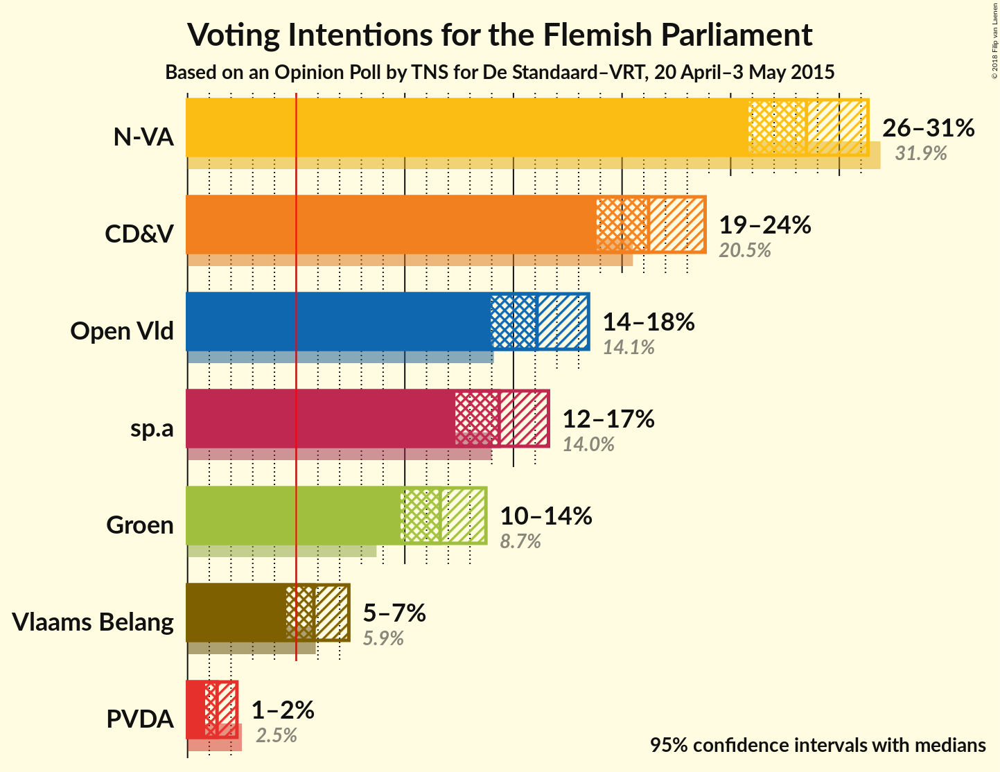
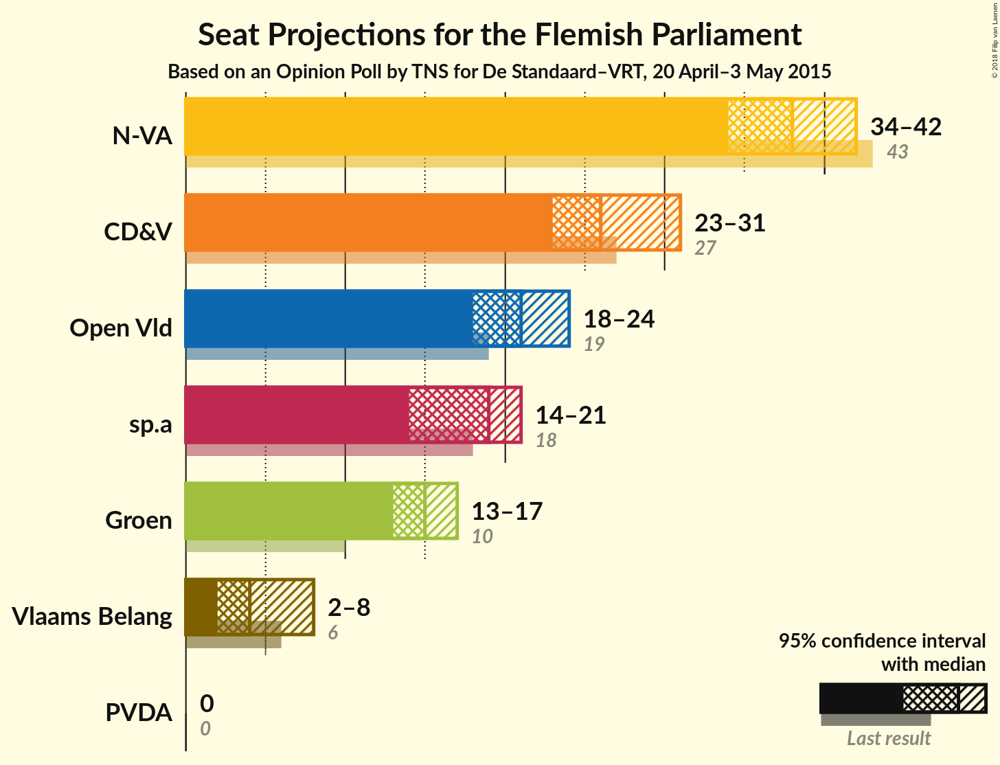
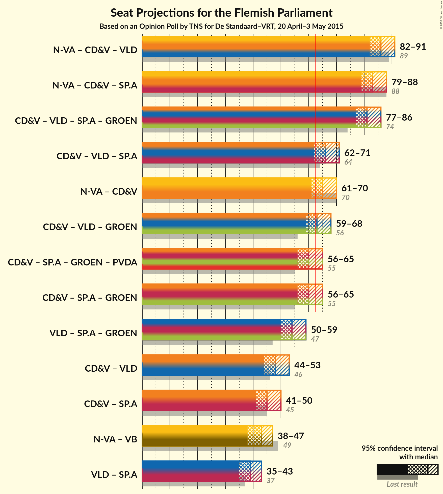

# Opinion Poll by TNS for De Standaard–VRT, 20 April–3 May 2015

<a href="#voting-intentions">Voting Intentions</a> | <a href="#seats">Seats</a> | <a href="#coalitions">Coalitions</a> | <a href="#technical-information">Technical Information</a>

## Voting Intentions

### Confidence Intervals

| Party | Last Result | Poll Result | 80% Confidence Interval | 90% Confidence Interval | 95% Confidence Interval | 99% Confidence Interval |
|:-----:|:-----------:|:-----------:|:-----------------------:|:-----------------------:|:-----------------------:|:-----------------------:|
| N-VA | 31.9% | 28.5% | 26.7–30.3% |26.2–30.9% |25.8–31.3% |25.0–32.2% |
| CD&V | 20.5% | 21.2% | 19.6–22.9% |19.2–23.4% |18.8–23.8% |18.1–24.7% |
| Open Vld | 14.1% | 16.1% | 14.7–17.6% |14.3–18.1% |14.0–18.5% |13.3–19.2% |
| sp.a | 14.0% | 14.3% | 13.0–15.8% |12.7–16.2% |12.3–16.6% |11.7–17.4% |
| Groen | 8.7% | 11.6% | 10.4–13.0% |10.1–13.4% |9.8–13.7% |9.3–14.4% |
| Vlaams Belang | 5.9% | 5.8% | 5.0–6.9% |4.7–7.2% |4.5–7.4% |4.2–8.0% |
| PVDA | 2.5% | 1.4% | 1.0–2.0% |0.9–2.1% |0.8–2.3% |0.7–2.6% |

*Note:* The poll result column reflects the actual value used in the calculations. Published results may vary slightly, and in addition be rounded to fewer digits.

## Seats

### Confidence Intervals

| Party | Last Result | Median | 80% Confidence Interval | 90% Confidence Interval | 95% Confidence Interval | 99% Confidence Interval |
|:-----:|:-----------:|:------:|:-----------------------:|:-----------------------:|:-----------------------:|:-----------------------:|
| <a href="#n-va">N-VA</a> | 43 | 38 | 35–40 |35–41 |34–42 |32–43 |
| <a href="#cd&v">CD&V</a> | 27 | 26 | 25–30 |24–31 |23–31 |22–33 |
| <a href="#open-vld">Open Vld</a> | 19 | 21 | 18–23 |18–24 |18–24 |17–26 |
| <a href="#sp.a">sp.a</a> | 18 | 19 | 16–19 |15–20 |14–21 |14–23 |
| <a href="#groen">Groen</a> | 10 | 15 | 13–17 |13–17 |13–17 |10–19 |
| <a href="#vlaams-belang">Vlaams Belang</a> | 6 | 4 | 3–7 |3–8 |2–8 |0–8 |
| <a href="#pvda">PVDA</a> | 0 | 0 | 0 |0 |0 |0 |

### N-VA

| Number of Seats | Probability | Accumulated | Special Marks |
|:---------------:|:-----------:|:-----------:|:-------------:|
| 31 | 0.1% | 100% |  |
| 32 | 0.5% | 99.9% |  |
| 33 | 1.2% | 99.3% |  |
| 34 | 2% | 98% |  |
| 35 | 8% | 96% |  |
| 36 | 13% | 88% |  |
| 37 | 15% | 76% |  |
| 38 | 31% | 61% | Median |
| 39 | 18% | 30% |  |
| 40 | 5% | 13% |  |
| 41 | 4% | 7% |  |
| 42 | 2% | 4% |  |
| 43 | 1.3% | 2% | Last Result |
| 44 | 0.1% | 0.2% |  |
| 45 | 0.1% | 0.1% |  |
| 46 | 0% | 0% |  |

### CD&V

| Number of Seats | Probability | Accumulated | Special Marks |
|:---------------:|:-----------:|:-----------:|:-------------:|
| 21 | 0.4% | 100% |  |
| 22 | 1.0% | 99.6% |  |
| 23 | 1.4% | 98.6% |  |
| 24 | 4% | 97% |  |
| 25 | 6% | 93% |  |
| 26 | 44% | 87% | Median |
| 27 | 13% | 44% | Last Result |
| 28 | 8% | 31% |  |
| 29 | 6% | 23% |  |
| 30 | 11% | 17% |  |
| 31 | 4% | 5% |  |
| 32 | 1.2% | 2% |  |
| 33 | 0.4% | 0.5% |  |
| 34 | 0.1% | 0.1% |  |
| 35 | 0% | 0% |  |

### Open Vld

| Number of Seats | Probability | Accumulated | Special Marks |
|:---------------:|:-----------:|:-----------:|:-------------:|
| 16 | 0.1% | 100% |  |
| 17 | 0.7% | 99.9% |  |
| 18 | 10% | 99.2% |  |
| 19 | 9% | 90% | Last Result |
| 20 | 17% | 81% |  |
| 21 | 18% | 64% | Median |
| 22 | 22% | 46% |  |
| 23 | 17% | 24% |  |
| 24 | 5% | 7% |  |
| 25 | 1.2% | 2% |  |
| 26 | 0.5% | 0.8% |  |
| 27 | 0.3% | 0.3% |  |
| 28 | 0% | 0% |  |

### sp.a

| Number of Seats | Probability | Accumulated | Special Marks |
|:---------------:|:-----------:|:-----------:|:-------------:|
| 14 | 3% | 100% |  |
| 15 | 6% | 97% |  |
| 16 | 5% | 91% |  |
| 17 | 6% | 87% |  |
| 18 | 22% | 80% | Last Result |
| 19 | 52% | 58% | Median |
| 20 | 2% | 6% |  |
| 21 | 2% | 4% |  |
| 22 | 1.2% | 2% |  |
| 23 | 0.7% | 0.7% |  |
| 24 | 0% | 0% |  |

### Groen

| Number of Seats | Probability | Accumulated | Special Marks |
|:---------------:|:-----------:|:-----------:|:-------------:|
| 10 | 0.6% | 100% | Last Result |
| 11 | 0.5% | 99.4% |  |
| 12 | 0.7% | 98.9% |  |
| 13 | 14% | 98% |  |
| 14 | 23% | 84% |  |
| 15 | 15% | 61% | Median |
| 16 | 28% | 46% |  |
| 17 | 17% | 18% |  |
| 18 | 0.8% | 1.4% |  |
| 19 | 0.5% | 0.6% |  |
| 20 | 0.1% | 0.2% |  |
| 21 | 0% | 0% |  |

### Vlaams Belang

| Number of Seats | Probability | Accumulated | Special Marks |
|:---------------:|:-----------:|:-----------:|:-------------:|
| 0 | 0.6% | 100% |  |
| 1 | 1.4% | 99.4% |  |
| 2 | 3% | 98% |  |
| 3 | 8% | 95% |  |
| 4 | 38% | 87% | Median |
| 5 | 14% | 48% |  |
| 6 | 21% | 34% | Last Result |
| 7 | 6% | 13% |  |
| 8 | 8% | 8% |  |
| 9 | 0% | 0% |  |

### PVDA

| Number of Seats | Probability | Accumulated | Special Marks |
|:---------------:|:-----------:|:-----------:|:-------------:|
| 0 | 100% | 100% | Last Result, Median |

## Coalitions

### Confidence Intervals

| Coalition | Last Result | Median | 80% Confidence Interval | 90% Confidence Interval | 95% Confidence Interval | 99% Confidence Interval |
|:---------:|:-----------:|:------:|:-----------------------:|:-----------------------:|:-----------------------:|:-----------------------:|
| N-VA – CD&V – Open Vld | 89 | 86 | 83–89 | 82–90 | 82–91 | 80–92 |
| N-VA – CD&V – sp.a | 88 | 83 | 80–86 | 79–87 | 79–88 | 77–89 |
| CD&V – Open Vld – sp.a – Groen | 74 | 81 | 79–84 | 78–85 | 77–86 | 76–87 |
| CD&V – Open Vld – sp.a | 64 | 66 | 64–70 | 63–71 | 62–71 | 60–73 |
| N-VA – CD&V | 70 | 65 | 62–68 | 61–69 | 60–69 | 59–71 |
| CD&V – sp.a – Groen – PVDA | 55 | 60 | 58–64 | 57–65 | 56–65 | 54–67 |
| CD&V – sp.a – Groen | 55 | 60 | 58–64 | 57–65 | 56–65 | 54–67 |
| Open Vld – sp.a – Groen | 47 | 55 | 52–57 | 51–58 | 50–59 | 48–60 |
| CD&V – Open Vld | 46 | 48 | 45–51 | 45–52 | 44–53 | 43–54 |
| CD&V – sp.a | 45 | 45 | 43–49 | 41–49 | 41–50 | 40–51 |
| N-VA – Vlaams Belang | 49 | 43 | 40–45 | 39–46 | 38–47 | 37–48 |
| Open Vld – sp.a | 37 | 39 | 37–42 | 36–42 | 35–43 | 33–45 |

### N-VA – CD&V – Open Vld

| Number of Seats | Probability | Accumulated | Special Marks |
|:---------------:|:-----------:|:-----------:|:-------------:|
| 79 | 0.1% | 100% |  |
| 80 | 0.7% | 99.9% |  |
| 81 | 1.1% | 99.2% |  |
| 82 | 3% | 98% |  |
| 83 | 11% | 95% |  |
| 84 | 13% | 83% |  |
| 85 | 14% | 70% | Median |
| 86 | 16% | 55% |  |
| 87 | 16% | 39% |  |
| 88 | 12% | 23% |  |
| 89 | 5% | 11% | Last Result |
| 90 | 3% | 6% |  |
| 91 | 2% | 3% |  |
| 92 | 0.8% | 1.3% |  |
| 93 | 0.3% | 0.4% |  |
| 94 | 0% | 0.1% |  |
| 95 | 0% | 0% |  |

### N-VA – CD&V – sp.a

| Number of Seats | Probability | Accumulated | Special Marks |
|:---------------:|:-----------:|:-----------:|:-------------:|
| 75 | 0.1% | 100% |  |
| 76 | 0.2% | 99.9% |  |
| 77 | 0.5% | 99.7% |  |
| 78 | 1.4% | 99.3% |  |
| 79 | 4% | 98% |  |
| 80 | 9% | 94% |  |
| 81 | 10% | 85% |  |
| 82 | 19% | 75% |  |
| 83 | 17% | 56% | Median |
| 84 | 14% | 39% |  |
| 85 | 9% | 24% |  |
| 86 | 8% | 16% |  |
| 87 | 5% | 8% |  |
| 88 | 2% | 3% | Last Result |
| 89 | 0.8% | 1.0% |  |
| 90 | 0.1% | 0.2% |  |
| 91 | 0% | 0.1% |  |
| 92 | 0% | 0% |  |

### CD&V – Open Vld – sp.a – Groen

| Number of Seats | Probability | Accumulated | Special Marks |
|:---------------:|:-----------:|:-----------:|:-------------:|
| 74 | 0.1% | 100% | Last Result |
| 75 | 0.3% | 99.9% |  |
| 76 | 0.7% | 99.6% |  |
| 77 | 2% | 98.8% |  |
| 78 | 6% | 97% |  |
| 79 | 8% | 91% |  |
| 80 | 11% | 83% |  |
| 81 | 30% | 72% | Median |
| 82 | 16% | 43% |  |
| 83 | 11% | 27% |  |
| 84 | 7% | 16% |  |
| 85 | 5% | 10% |  |
| 86 | 3% | 4% |  |
| 87 | 1.1% | 1.3% |  |
| 88 | 0.2% | 0.3% |  |
| 89 | 0.1% | 0.1% |  |
| 90 | 0% | 0% |  |

### CD&V – Open Vld – sp.a

| Number of Seats | Probability | Accumulated | Special Marks |
|:---------------:|:-----------:|:-----------:|:-------------:|
| 59 | 0.2% | 100% |  |
| 60 | 0.6% | 99.8% |  |
| 61 | 1.1% | 99.2% |  |
| 62 | 1.4% | 98% |  |
| 63 | 5% | 97% | Majority |
| 64 | 17% | 92% | Last Result |
| 65 | 13% | 75% |  |
| 66 | 14% | 62% | Median |
| 67 | 20% | 48% |  |
| 68 | 10% | 28% |  |
| 69 | 8% | 18% |  |
| 70 | 5% | 10% |  |
| 71 | 4% | 5% |  |
| 72 | 1.4% | 2% |  |
| 73 | 0.4% | 0.5% |  |
| 74 | 0.1% | 0.2% |  |
| 75 | 0% | 0.1% |  |
| 76 | 0% | 0% |  |

### N-VA – CD&V

| Number of Seats | Probability | Accumulated | Special Marks |
|:---------------:|:-----------:|:-----------:|:-------------:|
| 57 | 0.1% | 100% |  |
| 58 | 0.2% | 99.9% |  |
| 59 | 0.6% | 99.7% |  |
| 60 | 2% | 99.1% |  |
| 61 | 7% | 97% |  |
| 62 | 6% | 90% |  |
| 63 | 13% | 84% | Majority |
| 64 | 21% | 72% | Median |
| 65 | 18% | 51% |  |
| 66 | 12% | 34% |  |
| 67 | 8% | 22% |  |
| 68 | 7% | 13% |  |
| 69 | 4% | 6% |  |
| 70 | 1.4% | 2% | Last Result |
| 71 | 0.7% | 1.0% |  |
| 72 | 0.2% | 0.4% |  |
| 73 | 0.1% | 0.2% |  |
| 74 | 0% | 0% |  |

### CD&V – sp.a – Groen – PVDA

| Number of Seats | Probability | Accumulated | Special Marks |
|:---------------:|:-----------:|:-----------:|:-------------:|
| 52 | 0.1% | 100% |  |
| 53 | 0.1% | 99.9% |  |
| 54 | 0.4% | 99.8% |  |
| 55 | 2% | 99.4% | Last Result |
| 56 | 2% | 98% |  |
| 57 | 6% | 96% |  |
| 58 | 6% | 90% |  |
| 59 | 24% | 84% |  |
| 60 | 18% | 59% | Median |
| 61 | 14% | 42% |  |
| 62 | 12% | 28% |  |
| 63 | 6% | 16% | Majority |
| 64 | 5% | 11% |  |
| 65 | 3% | 5% |  |
| 66 | 2% | 2% |  |
| 67 | 0.4% | 0.5% |  |
| 68 | 0.1% | 0.1% |  |
| 69 | 0% | 0% |  |

### CD&V – sp.a – Groen

| Number of Seats | Probability | Accumulated | Special Marks |
|:---------------:|:-----------:|:-----------:|:-------------:|
| 52 | 0.1% | 100% |  |
| 53 | 0.1% | 99.9% |  |
| 54 | 0.4% | 99.8% |  |
| 55 | 2% | 99.4% | Last Result |
| 56 | 2% | 98% |  |
| 57 | 6% | 96% |  |
| 58 | 6% | 90% |  |
| 59 | 24% | 84% |  |
| 60 | 18% | 59% | Median |
| 61 | 14% | 42% |  |
| 62 | 12% | 28% |  |
| 63 | 6% | 16% | Majority |
| 64 | 5% | 11% |  |
| 65 | 3% | 5% |  |
| 66 | 2% | 2% |  |
| 67 | 0.4% | 0.5% |  |
| 68 | 0.1% | 0.1% |  |
| 69 | 0% | 0% |  |

### Open Vld – sp.a – Groen

| Number of Seats | Probability | Accumulated | Special Marks |
|:---------------:|:-----------:|:-----------:|:-------------:|
| 47 | 0.2% | 100% | Last Result |
| 48 | 0.5% | 99.7% |  |
| 49 | 0.8% | 99.2% |  |
| 50 | 3% | 98% |  |
| 51 | 5% | 96% |  |
| 52 | 10% | 91% |  |
| 53 | 13% | 81% |  |
| 54 | 17% | 68% |  |
| 55 | 24% | 52% | Median |
| 56 | 9% | 27% |  |
| 57 | 9% | 18% |  |
| 58 | 5% | 9% |  |
| 59 | 3% | 4% |  |
| 60 | 1.0% | 1.3% |  |
| 61 | 0.2% | 0.3% |  |
| 62 | 0.1% | 0.1% |  |
| 63 | 0% | 0% | Majority |

### CD&V – Open Vld

| Number of Seats | Probability | Accumulated | Special Marks |
|:---------------:|:-----------:|:-----------:|:-------------:|
| 41 | 0.2% | 100% |  |
| 42 | 0.2% | 99.8% |  |
| 43 | 0.5% | 99.6% |  |
| 44 | 2% | 99.1% |  |
| 45 | 11% | 97% |  |
| 46 | 10% | 86% | Last Result |
| 47 | 17% | 76% | Median |
| 48 | 19% | 59% |  |
| 49 | 17% | 40% |  |
| 50 | 8% | 23% |  |
| 51 | 7% | 15% |  |
| 52 | 4% | 8% |  |
| 53 | 2% | 4% |  |
| 54 | 2% | 2% |  |
| 55 | 0.3% | 0.4% |  |
| 56 | 0.1% | 0.1% |  |
| 57 | 0% | 0% |  |

### CD&V – sp.a

| Number of Seats | Probability | Accumulated | Special Marks |
|:---------------:|:-----------:|:-----------:|:-------------:|
| 37 | 0% | 100% |  |
| 38 | 0.1% | 99.9% |  |
| 39 | 0.2% | 99.9% |  |
| 40 | 2% | 99.6% |  |
| 41 | 4% | 98% |  |
| 42 | 3% | 94% |  |
| 43 | 9% | 91% |  |
| 44 | 20% | 82% |  |
| 45 | 25% | 62% | Last Result, Median |
| 46 | 13% | 37% |  |
| 47 | 7% | 24% |  |
| 48 | 6% | 18% |  |
| 49 | 8% | 12% |  |
| 50 | 3% | 4% |  |
| 51 | 0.8% | 1.2% |  |
| 52 | 0.3% | 0.4% |  |
| 53 | 0.1% | 0.1% |  |
| 54 | 0% | 0% |  |

### N-VA – Vlaams Belang

| Number of Seats | Probability | Accumulated | Special Marks |
|:---------------:|:-----------:|:-----------:|:-------------:|
| 35 | 0.1% | 100% |  |
| 36 | 0.2% | 99.9% |  |
| 37 | 1.1% | 99.7% |  |
| 38 | 3% | 98.7% |  |
| 39 | 5% | 96% |  |
| 40 | 7% | 90% |  |
| 41 | 11% | 84% |  |
| 42 | 16% | 73% | Median |
| 43 | 30% | 57% |  |
| 44 | 11% | 28% |  |
| 45 | 8% | 17% |  |
| 46 | 6% | 9% |  |
| 47 | 2% | 3% |  |
| 48 | 0.7% | 1.2% |  |
| 49 | 0.3% | 0.4% | Last Result |
| 50 | 0.1% | 0.1% |  |
| 51 | 0% | 0% |  |

### Open Vld – sp.a

| Number of Seats | Probability | Accumulated | Special Marks |
|:---------------:|:-----------:|:-----------:|:-------------:|
| 32 | 0.3% | 100% |  |
| 33 | 0.6% | 99.7% |  |
| 34 | 1.2% | 99.2% |  |
| 35 | 2% | 98% |  |
| 36 | 3% | 96% |  |
| 37 | 12% | 93% | Last Result |
| 38 | 16% | 80% |  |
| 39 | 16% | 64% |  |
| 40 | 12% | 48% | Median |
| 41 | 20% | 36% |  |
| 42 | 11% | 16% |  |
| 43 | 3% | 5% |  |
| 44 | 1.0% | 2% |  |
| 45 | 0.5% | 0.8% |  |
| 46 | 0.2% | 0.3% |  |
| 47 | 0% | 0% |  |

## Technical Information

### Opinion Poll

+ **Pollster:** TNS
+ **Media:** De Standaard–VRT
+ **Fieldwork period:** 20 April–3 May 2015

### Calculations

+ **Sample size:** 1032
+ **Simulations done:** 1,048,576
+ **Error estimate:** 0.82%

