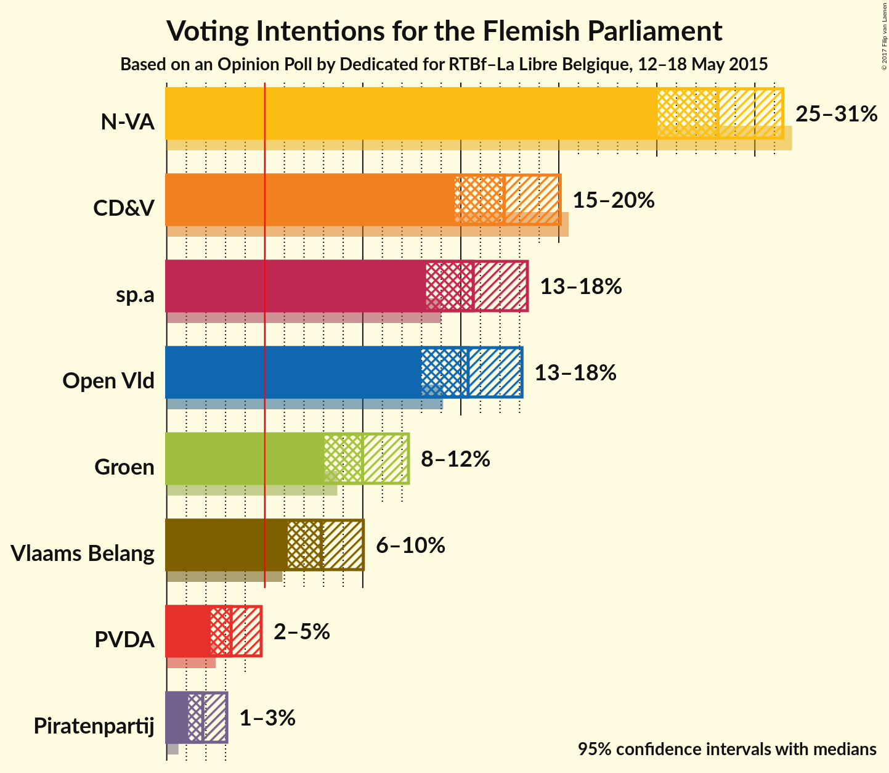
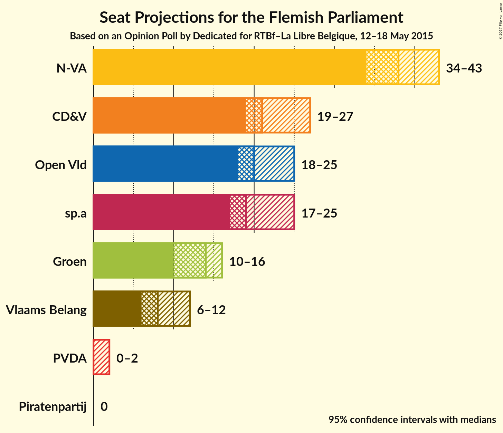
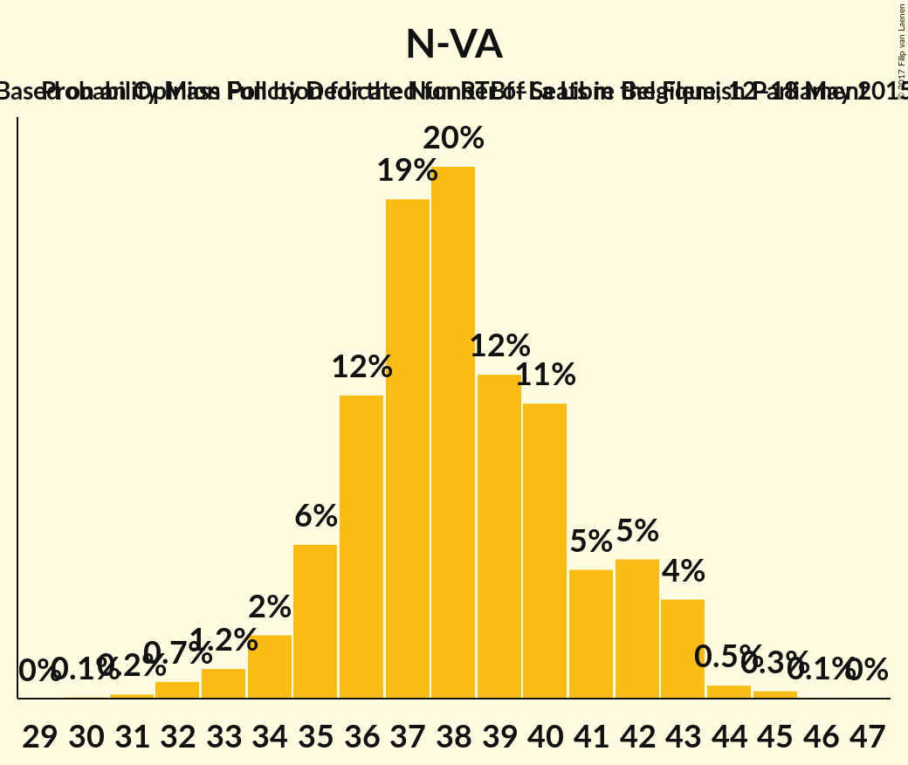
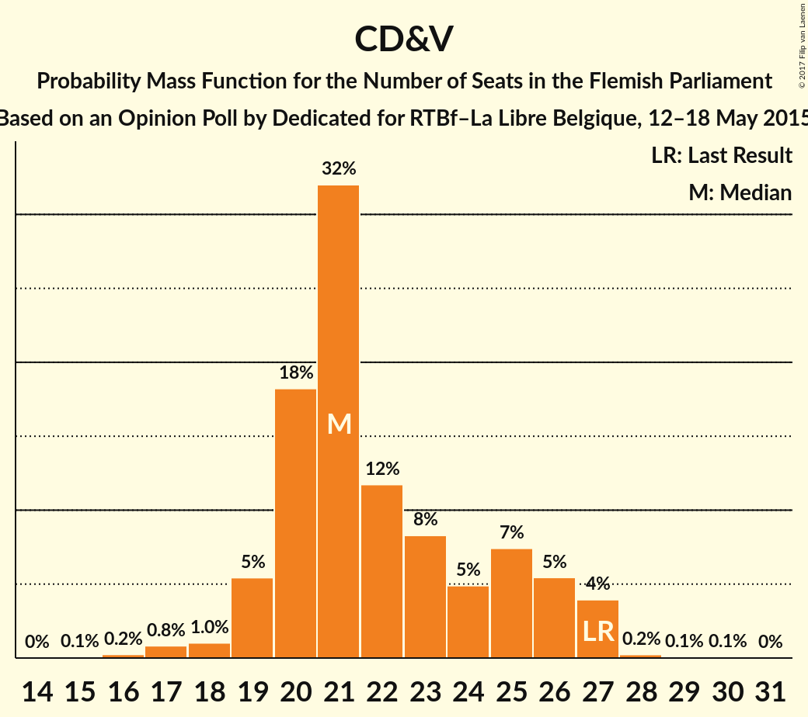
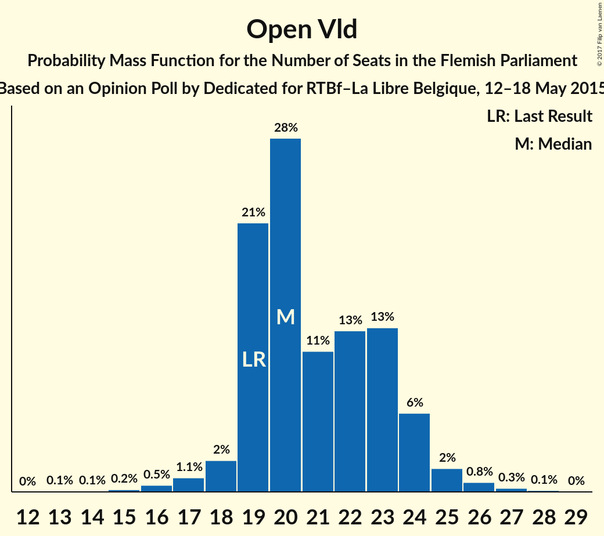
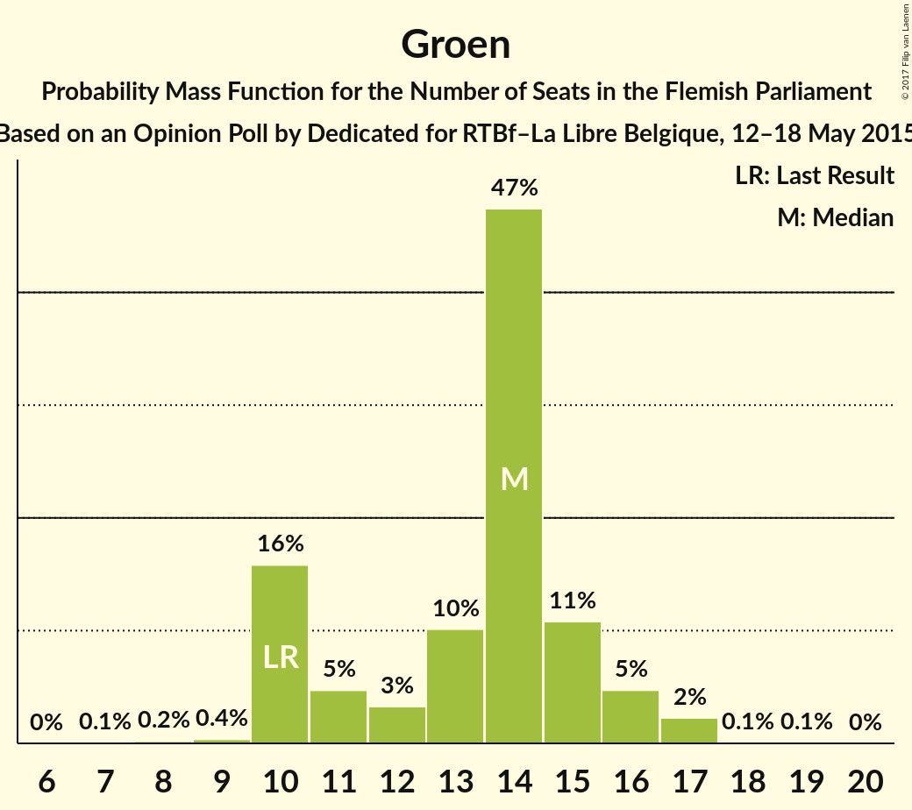
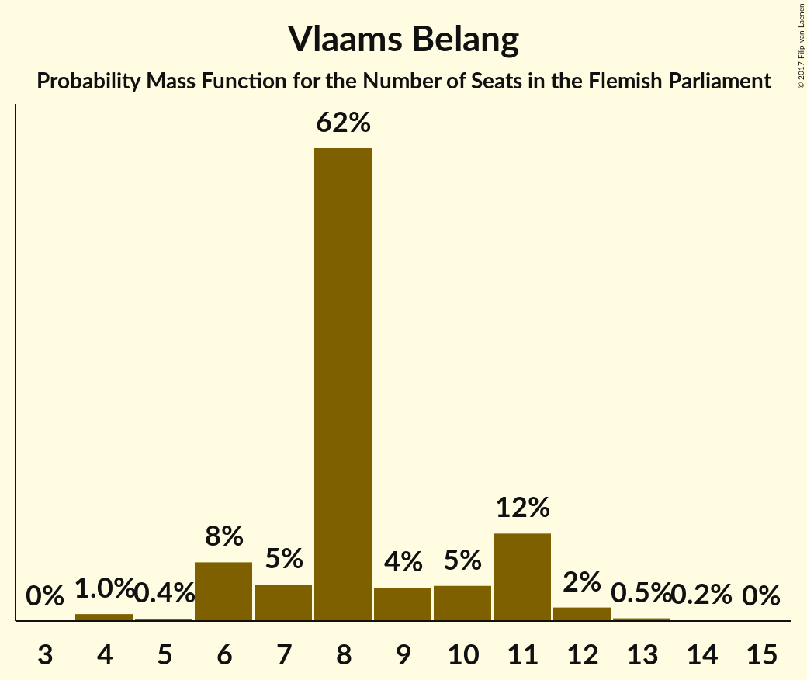
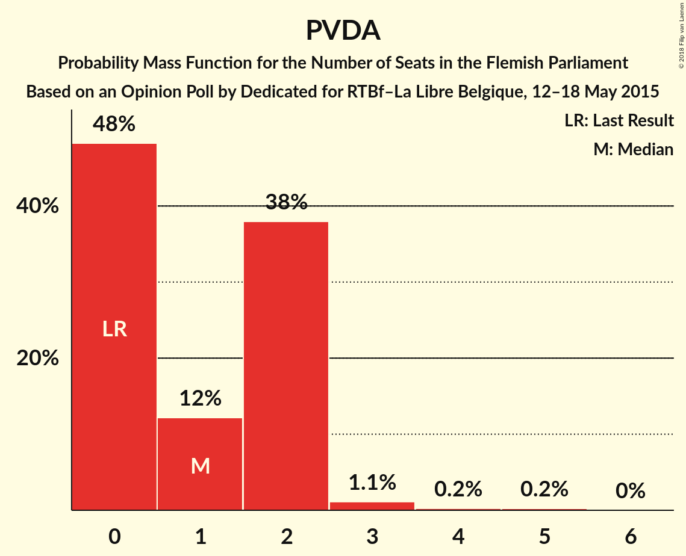
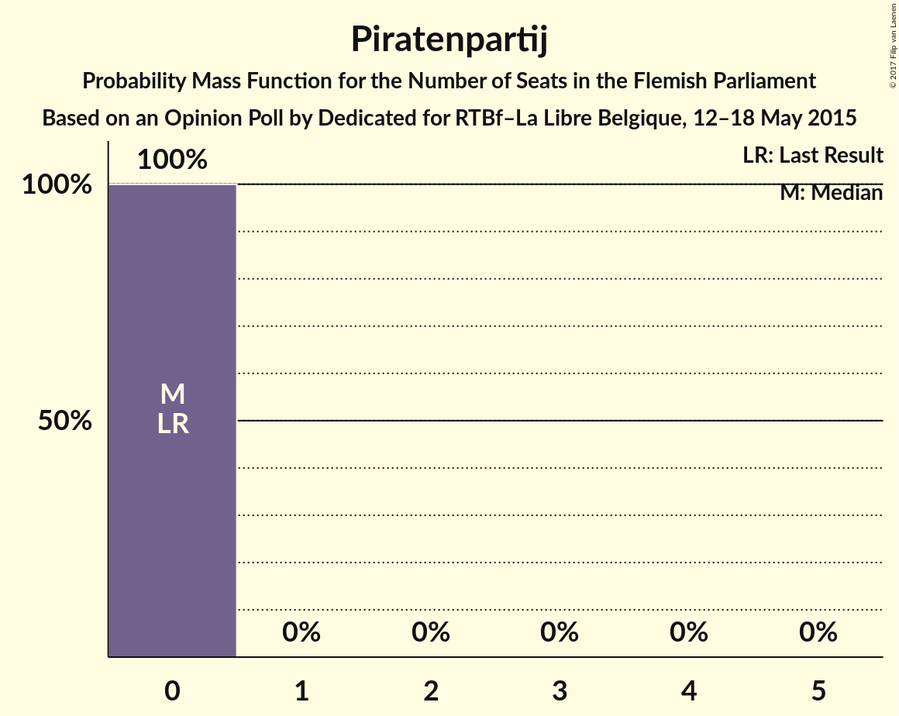
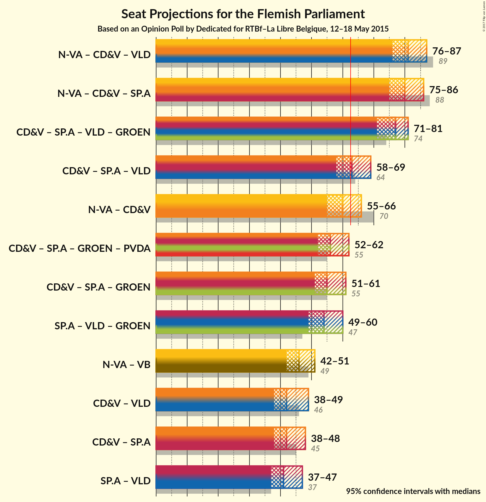

# Opinion Poll by Dedicated for RTBf–La Libre Belgique, 12–18 May 2015

<a href="#voting-intentions">Voting Intentions</a> | <a href="#seats">Seats</a> | <a href="#coalitions">Coalitions</a> | <a href="#technical-information">Technical Information</a>

## Voting Intentions

### Confidence Intervals

| Party | Last Result | Poll Result | 80% Confidence Interval | 90% Confidence Interval | 95% Confidence Interval | 99% Confidence Interval |
|:-----:|:-----------:|:-----------:|:-----------------------:|:-----------------------:|:-----------------------:|:-----------------------:|
| N-VA | 31.9% | 28.1% | 26.1–30.3% |25.5–30.9% |25.0–31.4% |24.1–32.5% |
| CD&V | 20.5% | 17.2% | 15.6–19.1% |15.1–19.6% |14.7–20.1% |13.9–21.0% |
| sp.a | 14.0% | 15.6% | 14.1–17.4% |13.6–18.0% |13.2–18.4% |12.5–19.3% |
| Open Vld | 14.1% | 15.4% | 13.8–17.2% |13.4–17.7% |13.0–18.1% |12.3–19.0% |
| Groen | 8.7% | 10.0% | 8.7–11.5% |8.4–11.9% |8.0–12.3% |7.5–13.1% |
| Vlaams Belang | 5.9% | 7.9% | 6.8–9.3% |6.4–9.7% |6.2–10.0% |5.7–10.7% |
| PVDA | 2.5% | 3.3% | 2.6–4.3% |2.4–4.6% |2.2–4.8% |1.9–5.3% |
| Piratenpartij | 0.6% | 1.8% | 1.3–2.6% |1.2–2.9% |1.1–3.1% |0.9–3.5% |

*Note:* The poll result column reflects the actual value used in the calculations. Published results may vary slightly, and in addition be rounded to fewer digits.

## Seats

### Confidence Intervals

| Party | Last Result | Median | 80% Confidence Interval | 90% Confidence Interval | 95% Confidence Interval | 99% Confidence Interval |
|:-----:|:-----------:|:------:|:-----------------------:|:-----------------------:|:-----------------------:|:-----------------------:|
| <a href="#n-va">N-VA</a> | 43 | 38 | 35–42 |35–42 |34–43 |32–44 |
| <a href="#cd&v">CD&V</a> | 27 | 21 | 20–25 |19–26 |19–27 |17–27 |
| <a href="#sp.a">sp.a</a> | 18 | 20 | 19–24 |18–24 |17–25 |15–26 |
| <a href="#open-vld">Open Vld</a> | 19 | 20 | 19–23 |19–24 |18–25 |16–26 |
| <a href="#groen">Groen</a> | 10 | 14 | 10–15 |10–16 |10–16 |9–17 |
| <a href="#vlaams-belang">Vlaams Belang</a> | 6 | 8 | 7–11 |6–11 |6–12 |4–13 |
| <a href="#pvda">PVDA</a> | 0 | 1 | 0–2 |0–2 |0–2 |0–3 |
| <a href="#piratenpartij">Piratenpartij</a> | 0 | 0 | 0 |0 |0 |0 |

### N-VA

*For a full overview of the results for this party, see the [N-VA](party-nva.html) page.*

| Number of Seats | Probability | Accumulated | Special Marks |
|:---------------:|:-----------:|:-----------:|:-------------:|
| 30 | 0.1% | 100% |  |
| 31 | 0.2% | 99.9% |  |
| 32 | 0.7% | 99.7% |  |
| 33 | 1.2% | 99.1% |  |
| 34 | 2% | 98% |  |
| 35 | 6% | 95% |  |
| 36 | 12% | 90% |  |
| 37 | 19% | 78% |  |
| 38 | 20% | 59% | Median |
| 39 | 12% | 39% |  |
| 40 | 11% | 26% |  |
| 41 | 5% | 15% |  |
| 42 | 5% | 10% |  |
| 43 | 4% | 5% | Last Result |
| 44 | 0.5% | 0.9% |  |
| 45 | 0.3% | 0.4% |  |
| 46 | 0.1% | 0.1% |  |
| 47 | 0% | 0% |  |

### CD&V

*For a full overview of the results for this party, see the [CD&V](party-cdv.html) page.*

| Number of Seats | Probability | Accumulated | Special Marks |
|:---------------:|:-----------:|:-----------:|:-------------:|
| 15 | 0.1% | 100% |  |
| 16 | 0.2% | 99.9% |  |
| 17 | 0.8% | 99.7% |  |
| 18 | 1.0% | 98.9% |  |
| 19 | 5% | 98% |  |
| 20 | 18% | 92% |  |
| 21 | 32% | 74% | Median |
| 22 | 12% | 42% |  |
| 23 | 8% | 30% |  |
| 24 | 5% | 22% |  |
| 25 | 7% | 17% |  |
| 26 | 5% | 10% |  |
| 27 | 4% | 4% | Last Result |
| 28 | 0.2% | 0.4% |  |
| 29 | 0.1% | 0.2% |  |
| 30 | 0.1% | 0.1% |  |
| 31 | 0% | 0% |  |

### sp.a

*For a full overview of the results for this party, see the [sp.a](party-spa.html) page.*

| Number of Seats | Probability | Accumulated | Special Marks |
|:---------------:|:-----------:|:-----------:|:-------------:|
| 14 | 0.2% | 100% |  |
| 15 | 0.6% | 99.8% |  |
| 16 | 0.7% | 99.2% |  |
| 17 | 1.3% | 98.5% |  |
| 18 | 4% | 97% | Last Result |
| 19 | 44% | 94% |  |
| 20 | 10% | 50% | Median |
| 21 | 8% | 40% |  |
| 22 | 9% | 32% |  |
| 23 | 11% | 23% |  |
| 24 | 8% | 12% |  |
| 25 | 3% | 4% |  |
| 26 | 0.6% | 1.1% |  |
| 27 | 0.3% | 0.4% |  |
| 28 | 0.1% | 0.2% |  |
| 29 | 0% | 0% |  |

### Open Vld

*For a full overview of the results for this party, see the [Open Vld](party-openvld.html) page.*

| Number of Seats | Probability | Accumulated | Special Marks |
|:---------------:|:-----------:|:-----------:|:-------------:|
| 13 | 0.1% | 100% |  |
| 14 | 0.1% | 99.9% |  |
| 15 | 0.2% | 99.8% |  |
| 16 | 0.5% | 99.7% |  |
| 17 | 1.1% | 99.1% |  |
| 18 | 2% | 98% |  |
| 19 | 21% | 95% | Last Result |
| 20 | 28% | 74% | Median |
| 21 | 11% | 46% |  |
| 22 | 13% | 35% |  |
| 23 | 13% | 22% |  |
| 24 | 6% | 9% |  |
| 25 | 2% | 3% |  |
| 26 | 0.8% | 1.2% |  |
| 27 | 0.3% | 0.4% |  |
| 28 | 0.1% | 0.1% |  |
| 29 | 0% | 0% |  |

### Groen

*For a full overview of the results for this party, see the [Groen](party-groen.html) page.*

| Number of Seats | Probability | Accumulated | Special Marks |
|:---------------:|:-----------:|:-----------:|:-------------:|
| 7 | 0.1% | 100% |  |
| 8 | 0.2% | 99.9% |  |
| 9 | 0.4% | 99.7% |  |
| 10 | 16% | 99.3% | Last Result |
| 11 | 5% | 84% |  |
| 12 | 3% | 79% |  |
| 13 | 10% | 76% |  |
| 14 | 47% | 65% | Median |
| 15 | 11% | 18% |  |
| 16 | 5% | 7% |  |
| 17 | 2% | 2% |  |
| 18 | 0.1% | 0.2% |  |
| 19 | 0.1% | 0.1% |  |
| 20 | 0% | 0% |  |

### Vlaams Belang

*For a full overview of the results for this party, see the [Vlaams Belang](party-vlaamsbelang.html) page.*

| Number of Seats | Probability | Accumulated | Special Marks |
|:---------------:|:-----------:|:-----------:|:-------------:|
| 4 | 1.0% | 100% |  |
| 5 | 0.4% | 98.9% |  |
| 6 | 8% | 98.5% | Last Result |
| 7 | 5% | 91% |  |
| 8 | 62% | 86% | Median |
| 9 | 4% | 23% |  |
| 10 | 5% | 19% |  |
| 11 | 12% | 14% |  |
| 12 | 2% | 3% |  |
| 13 | 0.5% | 0.7% |  |
| 14 | 0.2% | 0.2% |  |
| 15 | 0% | 0% |  |

### PVDA

*For a full overview of the results for this party, see the [PVDA](party-pvda.html) page.*

| Number of Seats | Probability | Accumulated | Special Marks |
|:---------------:|:-----------:|:-----------:|:-------------:|
| 0 | 48% | 100% | Last Result |
| 1 | 12% | 52% | Median |
| 2 | 38% | 40% |  |
| 3 | 1.1% | 2% |  |
| 4 | 0.2% | 0.5% |  |
| 5 | 0.2% | 0.2% |  |
| 6 | 0% | 0% |  |

### Piratenpartij

*For a full overview of the results for this party, see the [Piratenpartij](party-piratenpartij.html) page.*

| Number of Seats | Probability | Accumulated | Special Marks |
|:---------------:|:-----------:|:-----------:|:-------------:|
| 0 | 100% | 100% | Last Result, Median |

## Coalitions

### Confidence Intervals

| Coalition | Last Result | Median | Majority? | 80% Confidence Interval | 90% Confidence Interval | 95% Confidence Interval | 99% Confidence Interval |
|:---------:|:-----------:|:------:|:---------:|:-----------------------:|:-----------------------:|:-----------------------:|:-----------------------:|
| N-VA – CD&V – Open Vld | 89 | 81 | 100% | 77–84 | 76–86 | 76–87 | 74–88 |
| N-VA – CD&V – sp.a | 88 | 81 | 100% | 77–84 | 76–85 | 75–86 | 74–87 |
| CD&V – sp.a – Open Vld – Groen | 74 | 77 | 100% | 73–80 | 72–81 | 71–81 | 70–83 |
| CD&V – sp.a – Open Vld | 64 | 63 | 62% | 60–67 | 59–68 | 58–69 | 57–71 |
| N-VA – CD&V | 70 | 60 | 20% | 57–64 | 56–64 | 55–65 | 53–67 |
| CD&V – sp.a – Groen – PVDA | 55 | 57 | 1.4% | 53–60 | 52–61 | 51–62 | 50–64 |
| CD&V – sp.a – Groen | 55 | 55 | 0.7% | 53–59 | 51–60 | 51–61 | 49–63 |
| sp.a – Open Vld – Groen | 47 | 55 | 0.1% | 51–58 | 50–59 | 49–60 | 48–61 |
| N-VA – Vlaams Belang | 49 | 46 | 0% | 43–50 | 42–51 | 42–51 | 40–53 |
| CD&V – Open Vld | 46 | 43 | 0% | 40–46 | 39–47 | 38–49 | 36–50 |
| CD&V – sp.a | 45 | 42 | 0% | 39–46 | 38–47 | 38–48 | 36–50 |
| sp.a – Open Vld | 37 | 41 | 0% | 38–45 | 38–46 | 37–47 | 35–48 |

### N-VA – CD&V – Open Vld

| Number of Seats | Probability | Accumulated | Special Marks |
|:---------------:|:-----------:|:-----------:|:-------------:|
| 72 | 0.1% | 100% |  |
| 73 | 0.2% | 99.9% |  |
| 74 | 0.5% | 99.7% |  |
| 75 | 1.0% | 99.2% |  |
| 76 | 3% | 98% |  |
| 77 | 6% | 95% |  |
| 78 | 10% | 89% |  |
| 79 | 11% | 79% | Median |
| 80 | 12% | 68% |  |
| 81 | 13% | 56% |  |
| 82 | 14% | 43% |  |
| 83 | 15% | 30% |  |
| 84 | 6% | 14% |  |
| 85 | 4% | 9% |  |
| 86 | 2% | 5% |  |
| 87 | 2% | 3% |  |
| 88 | 0.6% | 0.8% |  |
| 89 | 0.2% | 0.2% | Last Result |
| 90 | 0.1% | 0.1% |  |
| 91 | 0% | 0% |  |

### N-VA – CD&V – sp.a

| Number of Seats | Probability | Accumulated | Special Marks |
|:---------------:|:-----------:|:-----------:|:-------------:|
| 72 | 0.1% | 100% |  |
| 73 | 0.3% | 99.8% |  |
| 74 | 0.6% | 99.5% |  |
| 75 | 2% | 98.9% |  |
| 76 | 3% | 97% |  |
| 77 | 7% | 94% |  |
| 78 | 9% | 87% |  |
| 79 | 10% | 78% | Median |
| 80 | 17% | 68% |  |
| 81 | 13% | 50% |  |
| 82 | 14% | 37% |  |
| 83 | 10% | 23% |  |
| 84 | 6% | 13% |  |
| 85 | 3% | 7% |  |
| 86 | 2% | 3% |  |
| 87 | 1.3% | 2% |  |
| 88 | 0.2% | 0.3% | Last Result |
| 89 | 0.1% | 0.1% |  |
| 90 | 0% | 0.1% |  |
| 91 | 0% | 0% |  |

### CD&V – sp.a – Open Vld – Groen

| Number of Seats | Probability | Accumulated | Special Marks |
|:---------------:|:-----------:|:-----------:|:-------------:|
| 68 | 0.1% | 100% |  |
| 69 | 0.3% | 99.9% |  |
| 70 | 0.7% | 99.6% |  |
| 71 | 2% | 99.0% |  |
| 72 | 3% | 97% |  |
| 73 | 7% | 95% |  |
| 74 | 10% | 88% | Last Result |
| 75 | 11% | 78% | Median |
| 76 | 13% | 67% |  |
| 77 | 18% | 54% |  |
| 78 | 16% | 36% |  |
| 79 | 8% | 20% |  |
| 80 | 7% | 12% |  |
| 81 | 3% | 5% |  |
| 82 | 1.2% | 2% |  |
| 83 | 0.5% | 0.9% |  |
| 84 | 0.3% | 0.4% |  |
| 85 | 0.1% | 0.1% |  |
| 86 | 0% | 0% |  |

### CD&V – sp.a – Open Vld

| Number of Seats | Probability | Accumulated | Special Marks |
|:---------------:|:-----------:|:-----------:|:-------------:|
| 55 | 0.1% | 100% |  |
| 56 | 0.3% | 99.9% |  |
| 57 | 0.7% | 99.6% |  |
| 58 | 3% | 98.8% |  |
| 59 | 6% | 96% |  |
| 60 | 8% | 90% |  |
| 61 | 9% | 83% | Median |
| 62 | 12% | 74% |  |
| 63 | 14% | 62% | Majority |
| 64 | 16% | 47% | Last Result |
| 65 | 11% | 31% |  |
| 66 | 9% | 20% |  |
| 67 | 5% | 12% |  |
| 68 | 4% | 7% |  |
| 69 | 2% | 3% |  |
| 70 | 0.9% | 2% |  |
| 71 | 0.5% | 0.7% |  |
| 72 | 0.2% | 0.2% |  |
| 73 | 0% | 0% |  |

### N-VA – CD&V

| Number of Seats | Probability | Accumulated | Special Marks |
|:---------------:|:-----------:|:-----------:|:-------------:|
| 51 | 0% | 100% |  |
| 52 | 0.1% | 99.9% |  |
| 53 | 0.4% | 99.8% |  |
| 54 | 1.0% | 99.4% |  |
| 55 | 2% | 98% |  |
| 56 | 5% | 96% |  |
| 57 | 9% | 91% |  |
| 58 | 13% | 83% |  |
| 59 | 16% | 70% | Median |
| 60 | 11% | 54% |  |
| 61 | 14% | 43% |  |
| 62 | 9% | 29% |  |
| 63 | 9% | 20% | Majority |
| 64 | 7% | 12% |  |
| 65 | 3% | 5% |  |
| 66 | 1.3% | 2% |  |
| 67 | 0.6% | 1.1% |  |
| 68 | 0.3% | 0.4% |  |
| 69 | 0.1% | 0.1% |  |
| 70 | 0% | 0% | Last Result |

### CD&V – sp.a – Groen – PVDA

| Number of Seats | Probability | Accumulated | Special Marks |
|:---------------:|:-----------:|:-----------:|:-------------:|
| 48 | 0.1% | 100% |  |
| 49 | 0.2% | 99.9% |  |
| 50 | 0.7% | 99.7% |  |
| 51 | 2% | 99.0% |  |
| 52 | 2% | 97% |  |
| 53 | 5% | 95% |  |
| 54 | 11% | 90% |  |
| 55 | 15% | 78% | Last Result |
| 56 | 13% | 64% | Median |
| 57 | 12% | 51% |  |
| 58 | 12% | 39% |  |
| 59 | 11% | 26% |  |
| 60 | 8% | 15% |  |
| 61 | 4% | 7% |  |
| 62 | 2% | 3% |  |
| 63 | 0.8% | 1.4% | Majority |
| 64 | 0.4% | 0.6% |  |
| 65 | 0.1% | 0.2% |  |
| 66 | 0% | 0.1% |  |
| 67 | 0% | 0% |  |

### CD&V – sp.a – Groen

| Number of Seats | Probability | Accumulated | Special Marks |
|:---------------:|:-----------:|:-----------:|:-------------:|
| 47 | 0.1% | 100% |  |
| 48 | 0.1% | 99.9% |  |
| 49 | 0.6% | 99.8% |  |
| 50 | 2% | 99.1% |  |
| 51 | 3% | 98% |  |
| 52 | 4% | 95% |  |
| 53 | 10% | 91% |  |
| 54 | 15% | 81% |  |
| 55 | 16% | 66% | Last Result, Median |
| 56 | 12% | 50% |  |
| 57 | 10% | 38% |  |
| 58 | 13% | 28% |  |
| 59 | 8% | 15% |  |
| 60 | 4% | 7% |  |
| 61 | 2% | 3% |  |
| 62 | 0.8% | 1.4% |  |
| 63 | 0.5% | 0.7% | Majority |
| 64 | 0.1% | 0.2% |  |
| 65 | 0.1% | 0.1% |  |
| 66 | 0% | 0% |  |

### sp.a – Open Vld – Groen

| Number of Seats | Probability | Accumulated | Special Marks |
|:---------------:|:-----------:|:-----------:|:-------------:|
| 46 | 0.1% | 100% |  |
| 47 | 0.2% | 99.9% | Last Result |
| 48 | 1.3% | 99.7% |  |
| 49 | 2% | 98% |  |
| 50 | 3% | 97% |  |
| 51 | 4% | 94% |  |
| 52 | 10% | 90% |  |
| 53 | 16% | 80% |  |
| 54 | 12% | 64% | Median |
| 55 | 12% | 52% |  |
| 56 | 12% | 40% |  |
| 57 | 14% | 27% |  |
| 58 | 6% | 13% |  |
| 59 | 4% | 7% |  |
| 60 | 2% | 3% |  |
| 61 | 0.6% | 1.0% |  |
| 62 | 0.3% | 0.4% |  |
| 63 | 0.1% | 0.1% | Majority |
| 64 | 0% | 0% |  |

### N-VA – Vlaams Belang

| Number of Seats | Probability | Accumulated | Special Marks |
|:---------------:|:-----------:|:-----------:|:-------------:|
| 38 | 0.1% | 100% |  |
| 39 | 0.2% | 99.9% |  |
| 40 | 0.6% | 99.7% |  |
| 41 | 1.2% | 99.1% |  |
| 42 | 3% | 98% |  |
| 43 | 6% | 95% |  |
| 44 | 10% | 89% |  |
| 45 | 14% | 80% |  |
| 46 | 18% | 65% | Median |
| 47 | 15% | 47% |  |
| 48 | 12% | 33% |  |
| 49 | 8% | 21% | Last Result |
| 50 | 7% | 13% |  |
| 51 | 4% | 6% |  |
| 52 | 0.9% | 2% |  |
| 53 | 0.7% | 1.1% |  |
| 54 | 0.4% | 0.5% |  |
| 55 | 0% | 0.1% |  |
| 56 | 0% | 0% |  |

### CD&V – Open Vld

| Number of Seats | Probability | Accumulated | Special Marks |
|:---------------:|:-----------:|:-----------:|:-------------:|
| 35 | 0.1% | 100% |  |
| 36 | 0.4% | 99.8% |  |
| 37 | 0.9% | 99.5% |  |
| 38 | 2% | 98.6% |  |
| 39 | 6% | 97% |  |
| 40 | 13% | 91% |  |
| 41 | 15% | 77% | Median |
| 42 | 11% | 63% |  |
| 43 | 12% | 51% |  |
| 44 | 12% | 39% |  |
| 45 | 13% | 27% |  |
| 46 | 6% | 15% | Last Result |
| 47 | 4% | 8% |  |
| 48 | 2% | 4% |  |
| 49 | 2% | 3% |  |
| 50 | 0.5% | 0.7% |  |
| 51 | 0.2% | 0.2% |  |
| 52 | 0.1% | 0.1% |  |
| 53 | 0% | 0% |  |

### CD&V – sp.a

| Number of Seats | Probability | Accumulated | Special Marks |
|:---------------:|:-----------:|:-----------:|:-------------:|
| 35 | 0.2% | 100% |  |
| 36 | 0.7% | 99.7% |  |
| 37 | 0.8% | 99.1% |  |
| 38 | 4% | 98% |  |
| 39 | 8% | 95% |  |
| 40 | 14% | 87% |  |
| 41 | 13% | 73% | Median |
| 42 | 12% | 59% |  |
| 43 | 10% | 47% |  |
| 44 | 15% | 37% |  |
| 45 | 10% | 22% | Last Result |
| 46 | 6% | 12% |  |
| 47 | 3% | 6% |  |
| 48 | 2% | 3% |  |
| 49 | 1.0% | 2% |  |
| 50 | 0.4% | 0.6% |  |
| 51 | 0.1% | 0.2% |  |
| 52 | 0% | 0.1% |  |
| 53 | 0% | 0% |  |

### sp.a – Open Vld

| Number of Seats | Probability | Accumulated | Special Marks |
|:---------------:|:-----------:|:-----------:|:-------------:|
| 33 | 0.1% | 100% |  |
| 34 | 0.2% | 99.9% |  |
| 35 | 0.4% | 99.7% |  |
| 36 | 0.8% | 99.3% |  |
| 37 | 2% | 98.6% | Last Result |
| 38 | 11% | 97% |  |
| 39 | 15% | 86% |  |
| 40 | 11% | 71% | Median |
| 41 | 13% | 61% |  |
| 42 | 14% | 48% |  |
| 43 | 14% | 34% |  |
| 44 | 9% | 20% |  |
| 45 | 4% | 11% |  |
| 46 | 3% | 6% |  |
| 47 | 2% | 3% |  |
| 48 | 0.8% | 1.2% |  |
| 49 | 0.2% | 0.4% |  |
| 50 | 0.1% | 0.2% |  |
| 51 | 0% | 0% |  |

## Technical Information

### Opinion Poll

+ **Polling firm:** Dedicated
+ **Commissioner(s):** RTBf–La Libre Belgique
+ **Fieldwork period:** 12–18 May 2015

### Calculations

+ **Sample size:** 761
+ **Simulations done:** 8,388,608
+ **Error estimate:** 2.32%

