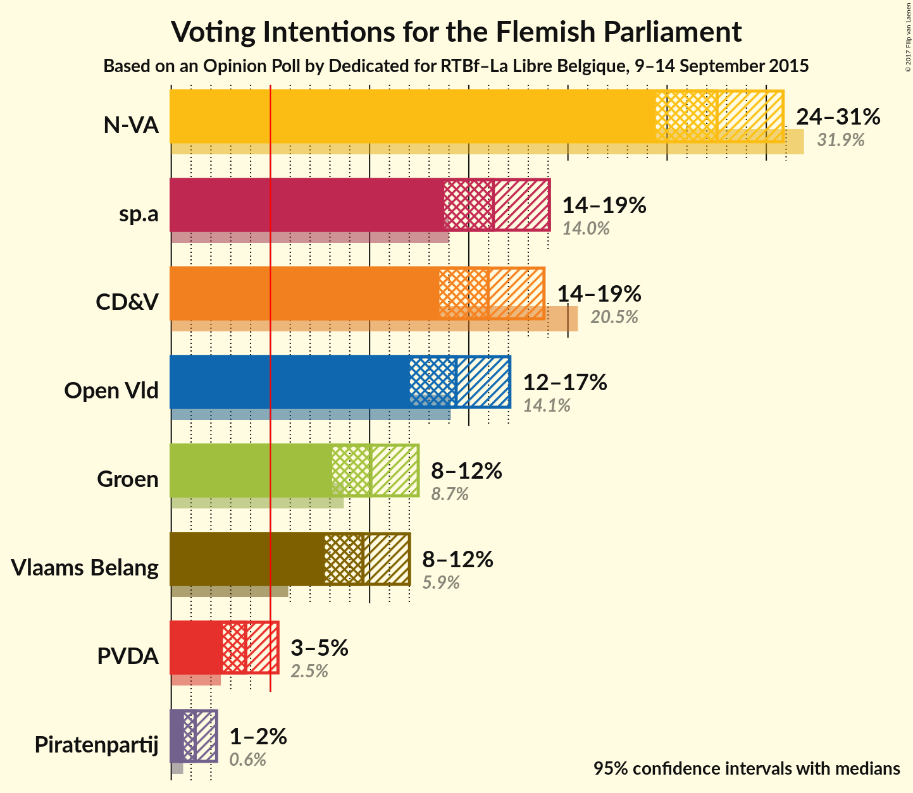
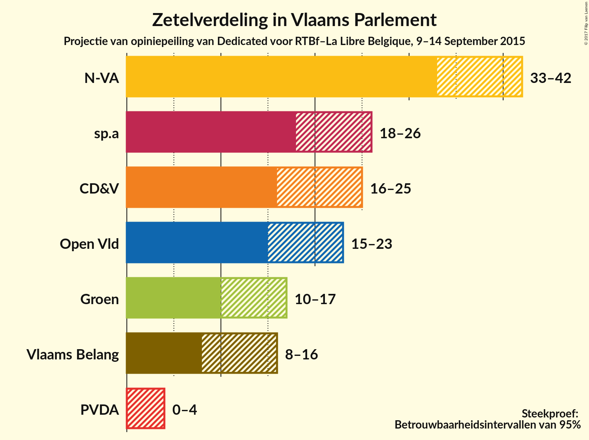
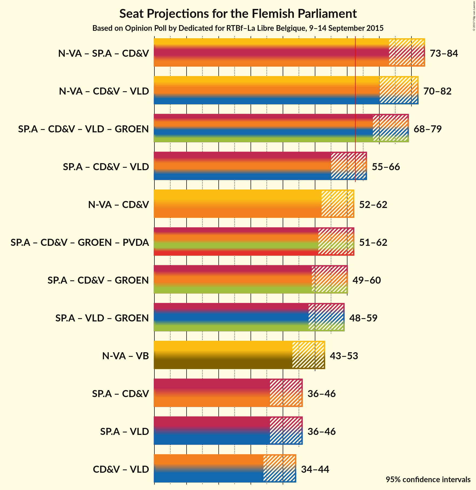

# Opinion Poll by Dedicated for RTBf–La Libre Belgique, 9–14 September 2015

<a href="#voting-intentions">Voting Intentions</a> | <a href="#seats">Seats</a> | <a href="#coalitions">Coalitions</a> | <a href="#technical-information">Technical Information</a>

## Voting Intentions

### Confidence Intervals

| Party | Last Result | Poll Result | 80% Confidence Interval | 90% Confidence Interval | 95% Confidence Interval | 99% Confidence Interval |
|:-----:|:-----------:|:-----------:|:-----------------------:|:-----------------------:|:-----------------------:|:-----------------------:|
| N-VA | 31.9% | 27.5% | 25.5–29.7% |24.9–30.3% |24.4–30.8% |23.5–31.9% |
| sp.a | 14.0% | 16.2% | 14.6–18.1% |14.2–18.6% |13.8–19.1% |13.0–20.0% |
| CD&V | 20.5% | 16.0% | 14.4–17.8% |13.9–18.3% |13.5–18.8% |12.8–19.7% |
| Open Vld | 14.1% | 14.4% | 12.8–16.1% |12.4–16.6% |12.0–17.1% |11.3–18.0% |
| Groen | 8.7% | 10.1% | 8.8–11.6% |8.4–12.1% |8.1–12.5% |7.5–13.2% |
| Vlaams Belang | 5.9% | 9.7% | 8.4–11.2% |8.0–11.6% |7.7–12.0% |7.2–12.8% |
| PVDA | 2.5% | 3.8% | 3.0–4.8% |2.8–5.1% |2.6–5.4% |2.3–5.9% |
| Piratenpartij | 0.6% | 1.2% | 0.8–1.9% |0.7–2.1% |0.6–2.3% |0.5–2.7% |

*Note:* The poll result column reflects the actual value used in the calculations. Published results may vary slightly, and in addition be rounded to fewer digits.

## Seats

### Confidence Intervals

| Party | Last Result | Median | 80% Confidence Interval | 90% Confidence Interval | 95% Confidence Interval | 99% Confidence Interval |
|:-----:|:-----------:|:------:|:-----------------------:|:-----------------------:|:-----------------------:|:-----------------------:|
| <a href="#n-va">N-VA</a> | 43 | 37 | 34–40 |33–41 |32–42 |31–43 |
| <a href="#sp.a">sp.a</a> | 18 | 21 | 19–24 |19–25 |18–26 |17–27 |
| <a href="#cd&v">CD&V</a> | 27 | 20 | 18–22 |17–23 |16–25 |15–26 |
| <a href="#open-vld">Open Vld</a> | 19 | 19 | 18–22 |16–23 |15–23 |13–25 |
| <a href="#groen">Groen</a> | 10 | 14 | 10–15 |10–16 |10–17 |9–17 |
| <a href="#vlaams-belang">Vlaams Belang</a> | 6 | 11 | 8–13 |8–14 |8–15 |8–16 |
| <a href="#pvda">PVDA</a> | 0 | 2 | 0–2 |0–3 |0–4 |0–5 |
| <a href="#piratenpartij">Piratenpartij</a> | 0 | 0 | 0 |0 |0 |0 |

### N-VA

| Number of Seats | Probability | Accumulated |
|:---------------:|:-----------:|:-----------:|
| 30 | 0.4% | 100% |
| 31 | 0.5% | 99.6% |
| 32 | 2% | 99.1% |
| 33 | 4% | 97% |
| 34 | 7% | 94% |
| 35 | 7% | 87% |
| 36 | 17% | 80% |
| 37 | 27% | 63% |
| 38 | 14% | 36% |
| 39 | 9% | 22% |
| 40 | 7% | 13% |
| 41 | 3% | 6% |
| 42 | 2% | 3% |
| 43 | 1.0% | 1.3% |
| 44 | 0.2% | 0.3% |
| 45 | 0.1% | 0.1% |
| 46 | 0% | 0% |

### sp.a

| Number of Seats | Probability | Accumulated |
|:---------------:|:-----------:|:-----------:|
| 14 | 0.1% | 100% |
| 15 | 0.1% | 99.9% |
| 16 | 0.2% | 99.8% |
| 17 | 0.6% | 99.6% |
| 18 | 2% | 98.9% |
| 19 | 28% | 97% |
| 20 | 12% | 69% |
| 21 | 13% | 57% |
| 22 | 8% | 44% |
| 23 | 14% | 36% |
| 24 | 16% | 22% |
| 25 | 3% | 6% |
| 26 | 1.2% | 3% |
| 27 | 1.2% | 2% |
| 28 | 0.4% | 0.5% |
| 29 | 0.1% | 0.1% |
| 30 | 0% | 0% |

### CD&V

| Number of Seats | Probability | Accumulated |
|:---------------:|:-----------:|:-----------:|
| 14 | 0.1% | 100% |
| 15 | 2% | 99.9% |
| 16 | 3% | 98% |
| 17 | 4% | 95% |
| 18 | 6% | 91% |
| 19 | 17% | 85% |
| 20 | 36% | 68% |
| 21 | 20% | 33% |
| 22 | 5% | 13% |
| 23 | 3% | 8% |
| 24 | 2% | 5% |
| 25 | 2% | 3% |
| 26 | 0.6% | 1.1% |
| 27 | 0.5% | 0.5% |
| 28 | 0% | 0% |

### Open Vld

| Number of Seats | Probability | Accumulated |
|:---------------:|:-----------:|:-----------:|
| 13 | 0.9% | 100% |
| 14 | 1.3% | 99.0% |
| 15 | 2% | 98% |
| 16 | 2% | 96% |
| 17 | 4% | 94% |
| 18 | 8% | 91% |
| 19 | 41% | 82% |
| 20 | 25% | 41% |
| 21 | 6% | 16% |
| 22 | 5% | 11% |
| 23 | 4% | 6% |
| 24 | 0.9% | 2% |
| 25 | 0.6% | 0.7% |
| 26 | 0.1% | 0.1% |
| 27 | 0% | 0% |

### Groen

| Number of Seats | Probability | Accumulated |
|:---------------:|:-----------:|:-----------:|
| 7 | 0.1% | 100% |
| 8 | 0.1% | 99.9% |
| 9 | 0.3% | 99.7% |
| 10 | 17% | 99.4% |
| 11 | 4% | 83% |
| 12 | 4% | 79% |
| 13 | 9% | 75% |
| 14 | 49% | 66% |
| 15 | 10% | 17% |
| 16 | 4% | 7% |
| 17 | 2% | 3% |
| 18 | 0.1% | 0.2% |
| 19 | 0.1% | 0.1% |
| 20 | 0% | 0% |

### Vlaams Belang

| Number of Seats | Probability | Accumulated |
|:---------------:|:-----------:|:-----------:|
| 6 | 0.1% | 100% |
| 7 | 0.1% | 99.9% |
| 8 | 18% | 99.8% |
| 9 | 6% | 82% |
| 10 | 7% | 76% |
| 11 | 33% | 68% |
| 12 | 20% | 35% |
| 13 | 8% | 16% |
| 14 | 4% | 8% |
| 15 | 2% | 4% |
| 16 | 2% | 2% |
| 17 | 0.1% | 0.2% |
| 18 | 0% | 0.1% |
| 19 | 0% | 0% |

### PVDA

| Number of Seats | Probability | Accumulated |
|:---------------:|:-----------:|:-----------:|
| 0 | 18% | 100% |
| 1 | 14% | 82% |
| 2 | 61% | 68% |
| 3 | 4% | 7% |
| 4 | 1.4% | 3% |
| 5 | 1.4% | 1.4% |
| 6 | 0% | 0% |

### Piratenpartij

| Number of Seats | Probability | Accumulated |
|:---------------:|:-----------:|:-----------:|
| 0 | 100% | 100% |
| 1 | 0% | 0% |

## Coalitions

### Confidence Intervals

| Coalition | Last Result | Median | 80% Confidence Interval | 90% Confidence Interval | 95% Confidence Interval | 99% Confidence Interval |
|:---------:|:-----------:|:------:|:-----------------------:|:-----------------------:|:-----------------------:|:-----------------------:|
| N-VA – sp.a – CD&V | 88 | 78 | 75–82 | 74–83 | 73–84 | 72–86 |
| N-VA – CD&V – Open Vld | 89 | 76 | 73–80 | 72–81 | 71–82 | 69–84 |
| sp.a – CD&V – Open Vld – Groen | 74 | 74 | 71–77 | 70–78 | 69–80 | 67–81 |
| sp.a – CD&V – Open Vld | 64 | 61 | 57–64 | 56–66 | 55–66 | 54–68 |
| N-VA – CD&V | 70 | 57 | 54–60 | 53–61 | 52–62 | 50–64 |
| sp.a – CD&V – Groen – PVDA | 55 | 56 | 53–59 | 52–61 | 51–62 | 49–64 |
| sp.a – CD&V – Groen | 55 | 54 | 52–58 | 51–59 | 50–60 | 48–62 |
| sp.a – Open Vld – Groen | 47 | 54 | 51–57 | 49–58 | 48–59 | 47–61 |
| N-VA – Vlaams Belang | 49 | 48 | 45–51 | 44–52 | 43–53 | 41–55 |
| sp.a – CD&V | 45 | 41 | 38–45 | 38–46 | 37–47 | 35–48 |
| sp.a – Open Vld | 37 | 41 | 38–44 | 37–45 | 36–46 | 34–48 |
| CD&V – Open Vld | 46 | 39 | 36–42 | 35–44 | 34–45 | 32–46 |

### N-VA – sp.a – CD&V

| Number of Seats | Probability | Accumulated |
|:---------------:|:-----------:|:-----------:|
| 70 | 0.1% | 100% |
| 71 | 0.2% | 99.9% |
| 72 | 0.8% | 99.7% |
| 73 | 2% | 98.9% |
| 74 | 4% | 97% |
| 75 | 7% | 93% |
| 76 | 15% | 87% |
| 77 | 12% | 72% |
| 78 | 14% | 59% |
| 79 | 11% | 45% |
| 80 | 9% | 34% |
| 81 | 11% | 25% |
| 82 | 7% | 14% |
| 83 | 3% | 7% |
| 84 | 3% | 4% |
| 85 | 0.5% | 1.0% |
| 86 | 0.3% | 0.5% |
| 87 | 0.2% | 0.2% |
| 88 | 0% | 0% |

### N-VA – CD&V – Open Vld

| Number of Seats | Probability | Accumulated |
|:---------------:|:-----------:|:-----------:|
| 67 | 0.1% | 100% |
| 68 | 0.2% | 99.9% |
| 69 | 0.6% | 99.6% |
| 70 | 1.2% | 99.0% |
| 71 | 2% | 98% |
| 72 | 4% | 96% |
| 73 | 5% | 92% |
| 74 | 8% | 87% |
| 75 | 15% | 79% |
| 76 | 15% | 63% |
| 77 | 18% | 48% |
| 78 | 9% | 30% |
| 79 | 9% | 21% |
| 80 | 6% | 13% |
| 81 | 3% | 7% |
| 82 | 2% | 4% |
| 83 | 0.6% | 1.5% |
| 84 | 0.7% | 0.9% |
| 85 | 0.1% | 0.2% |
| 86 | 0% | 0.1% |
| 87 | 0.1% | 0.1% |
| 88 | 0% | 0% |

### sp.a – CD&V – Open Vld – Groen

| Number of Seats | Probability | Accumulated |
|:---------------:|:-----------:|:-----------:|
| 65 | 0.1% | 100% |
| 66 | 0.2% | 99.9% |
| 67 | 0.7% | 99.7% |
| 68 | 1.1% | 98.9% |
| 69 | 2% | 98% |
| 70 | 4% | 96% |
| 71 | 5% | 92% |
| 72 | 14% | 86% |
| 73 | 17% | 72% |
| 74 | 14% | 55% |
| 75 | 13% | 41% |
| 76 | 12% | 28% |
| 77 | 8% | 17% |
| 78 | 4% | 9% |
| 79 | 2% | 5% |
| 80 | 2% | 3% |
| 81 | 0.6% | 0.9% |
| 82 | 0.2% | 0.3% |
| 83 | 0.1% | 0.1% |
| 84 | 0% | 0% |

### sp.a – CD&V – Open Vld

| Number of Seats | Probability | Accumulated |
|:---------------:|:-----------:|:-----------:|
| 51 | 0% | 100% |
| 52 | 0.1% | 99.9% |
| 53 | 0.3% | 99.9% |
| 54 | 0.7% | 99.6% |
| 55 | 1.4% | 98.9% |
| 56 | 3% | 97% |
| 57 | 5% | 94% |
| 58 | 13% | 89% |
| 59 | 12% | 76% |
| 60 | 12% | 64% |
| 61 | 12% | 52% |
| 62 | 14% | 40% |
| 63 | 11% | 27% |
| 64 | 7% | 16% |
| 65 | 4% | 9% |
| 66 | 3% | 5% |
| 67 | 0.9% | 2% |
| 68 | 0.6% | 0.9% |
| 69 | 0.2% | 0.3% |
| 70 | 0.1% | 0.1% |
| 71 | 0% | 0.1% |
| 72 | 0% | 0% |

### N-VA – CD&V

| Number of Seats | Probability | Accumulated |
|:---------------:|:-----------:|:-----------:|
| 49 | 0.2% | 100% |
| 50 | 0.4% | 99.7% |
| 51 | 0.8% | 99.3% |
| 52 | 3% | 98.5% |
| 53 | 5% | 96% |
| 54 | 7% | 91% |
| 55 | 10% | 85% |
| 56 | 14% | 74% |
| 57 | 23% | 60% |
| 58 | 12% | 38% |
| 59 | 9% | 26% |
| 60 | 9% | 16% |
| 61 | 3% | 8% |
| 62 | 2% | 5% |
| 63 | 1.4% | 2% |
| 64 | 0.7% | 1.0% |
| 65 | 0.2% | 0.3% |
| 66 | 0.1% | 0.1% |
| 67 | 0.1% | 0.1% |
| 68 | 0% | 0% |

### sp.a – CD&V – Groen – PVDA

| Number of Seats | Probability | Accumulated |
|:---------------:|:-----------:|:-----------:|
| 47 | 0.1% | 100% |
| 48 | 0.2% | 99.9% |
| 49 | 0.3% | 99.7% |
| 50 | 0.9% | 99.5% |
| 51 | 1.5% | 98.5% |
| 52 | 4% | 97% |
| 53 | 6% | 93% |
| 54 | 10% | 87% |
| 55 | 17% | 77% |
| 56 | 16% | 60% |
| 57 | 12% | 43% |
| 58 | 12% | 31% |
| 59 | 9% | 19% |
| 60 | 4% | 9% |
| 61 | 2% | 5% |
| 62 | 2% | 3% |
| 63 | 0.7% | 1.4% |
| 64 | 0.5% | 0.7% |
| 65 | 0.2% | 0.2% |
| 66 | 0% | 0.1% |
| 67 | 0% | 0% |

### sp.a – CD&V – Groen

| Number of Seats | Probability | Accumulated |
|:---------------:|:-----------:|:-----------:|
| 45 | 0% | 100% |
| 46 | 0.1% | 99.9% |
| 47 | 0.2% | 99.8% |
| 48 | 0.7% | 99.6% |
| 49 | 1.1% | 98.9% |
| 50 | 2% | 98% |
| 51 | 3% | 96% |
| 52 | 8% | 92% |
| 53 | 19% | 84% |
| 54 | 18% | 65% |
| 55 | 14% | 47% |
| 56 | 11% | 33% |
| 57 | 9% | 22% |
| 58 | 6% | 13% |
| 59 | 3% | 8% |
| 60 | 2% | 4% |
| 61 | 0.9% | 2% |
| 62 | 0.6% | 0.9% |
| 63 | 0.2% | 0.3% |
| 64 | 0.1% | 0.1% |
| 65 | 0% | 0% |

### sp.a – Open Vld – Groen

| Number of Seats | Probability | Accumulated |
|:---------------:|:-----------:|:-----------:|
| 45 | 0.1% | 100% |
| 46 | 0.2% | 99.9% |
| 47 | 0.6% | 99.6% |
| 48 | 2% | 99.0% |
| 49 | 2% | 97% |
| 50 | 4% | 95% |
| 51 | 4% | 91% |
| 52 | 15% | 87% |
| 53 | 16% | 71% |
| 54 | 14% | 55% |
| 55 | 10% | 40% |
| 56 | 10% | 30% |
| 57 | 12% | 21% |
| 58 | 5% | 9% |
| 59 | 2% | 4% |
| 60 | 1.4% | 2% |
| 61 | 0.4% | 0.6% |
| 62 | 0.2% | 0.3% |
| 63 | 0.1% | 0.1% |
| 64 | 0% | 0% |

### N-VA – Vlaams Belang

| Number of Seats | Probability | Accumulated |
|:---------------:|:-----------:|:-----------:|
| 39 | 0% | 100% |
| 40 | 0.2% | 99.9% |
| 41 | 0.4% | 99.8% |
| 42 | 1.4% | 99.4% |
| 43 | 2% | 98% |
| 44 | 3% | 96% |
| 45 | 8% | 93% |
| 46 | 12% | 84% |
| 47 | 15% | 72% |
| 48 | 16% | 57% |
| 49 | 18% | 41% |
| 50 | 9% | 24% |
| 51 | 7% | 15% |
| 52 | 4% | 8% |
| 53 | 2% | 4% |
| 54 | 1.0% | 2% |
| 55 | 0.4% | 0.6% |
| 56 | 0.1% | 0.2% |
| 57 | 0% | 0.1% |
| 58 | 0% | 0% |

### sp.a – CD&V

| Number of Seats | Probability | Accumulated |
|:---------------:|:-----------:|:-----------:|
| 34 | 0.2% | 100% |
| 35 | 0.9% | 99.7% |
| 36 | 1.1% | 98.8% |
| 37 | 2% | 98% |
| 38 | 7% | 95% |
| 39 | 18% | 89% |
| 40 | 11% | 71% |
| 41 | 13% | 60% |
| 42 | 15% | 47% |
| 43 | 9% | 32% |
| 44 | 10% | 23% |
| 45 | 7% | 12% |
| 46 | 3% | 5% |
| 47 | 2% | 3% |
| 48 | 0.6% | 1.1% |
| 49 | 0.3% | 0.4% |
| 50 | 0.1% | 0.2% |
| 51 | 0.1% | 0.1% |
| 52 | 0% | 0% |

### sp.a – Open Vld

| Number of Seats | Probability | Accumulated |
|:---------------:|:-----------:|:-----------:|
| 32 | 0.2% | 100% |
| 33 | 0.2% | 99.8% |
| 34 | 0.6% | 99.6% |
| 35 | 0.7% | 99.0% |
| 36 | 2% | 98% |
| 37 | 3% | 96% |
| 38 | 17% | 93% |
| 39 | 13% | 76% |
| 40 | 12% | 63% |
| 41 | 12% | 51% |
| 42 | 10% | 40% |
| 43 | 17% | 30% |
| 44 | 7% | 13% |
| 45 | 3% | 7% |
| 46 | 2% | 4% |
| 47 | 1.1% | 2% |
| 48 | 0.4% | 0.7% |
| 49 | 0.2% | 0.3% |
| 50 | 0% | 0.1% |
| 51 | 0% | 0% |

### CD&V – Open Vld

| Number of Seats | Probability | Accumulated |
|:---------------:|:-----------:|:-----------:|
| 30 | 0.1% | 100% |
| 31 | 0.1% | 99.9% |
| 32 | 0.4% | 99.8% |
| 33 | 0.7% | 99.4% |
| 34 | 2% | 98.8% |
| 35 | 3% | 97% |
| 36 | 5% | 94% |
| 37 | 6% | 89% |
| 38 | 12% | 82% |
| 39 | 24% | 71% |
| 40 | 20% | 46% |
| 41 | 8% | 26% |
| 42 | 9% | 17% |
| 43 | 3% | 9% |
| 44 | 3% | 5% |
| 45 | 2% | 3% |
| 46 | 0.7% | 1.0% |
| 47 | 0.2% | 0.3% |
| 48 | 0.1% | 0.1% |
| 49 | 0% | 0.1% |
| 50 | 0% | 0% |

## Technical Information

### Opinion Poll

+ **Pollster:** Dedicated
+ **Media:** RTBf–La Libre Belgique
+ **Fieldwork period:** 9–14 September 2015

### Calculations

+ **Sample size:** 745
+ **Simulations done:** 4,194,304
+ **Error estimate:** 1.08%

