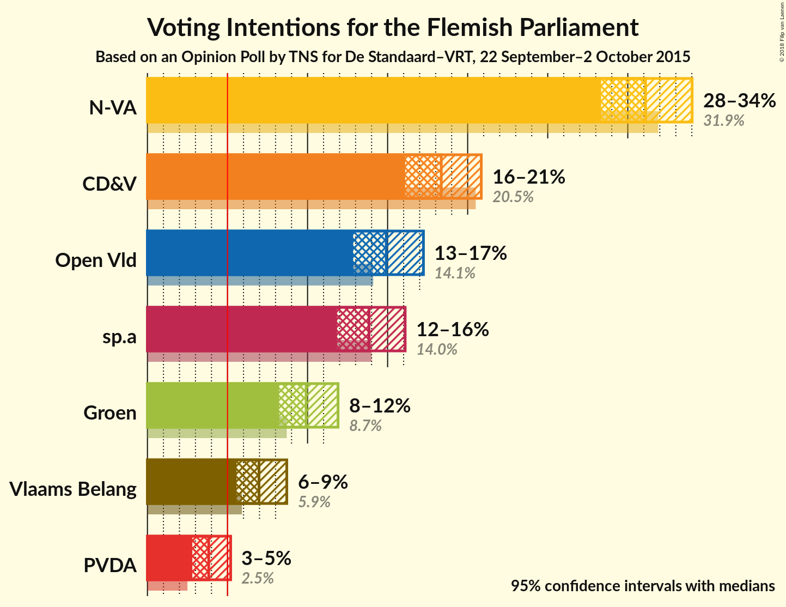
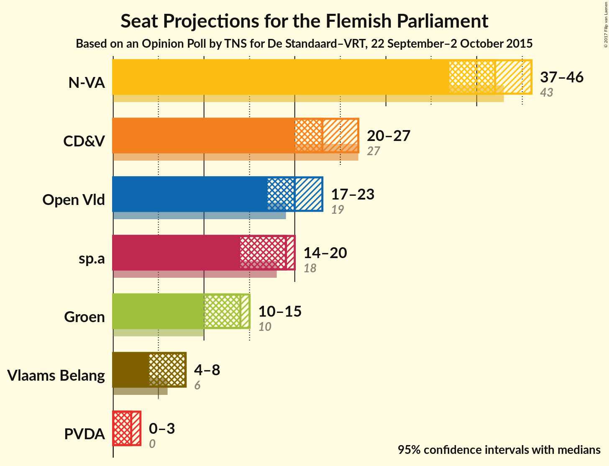
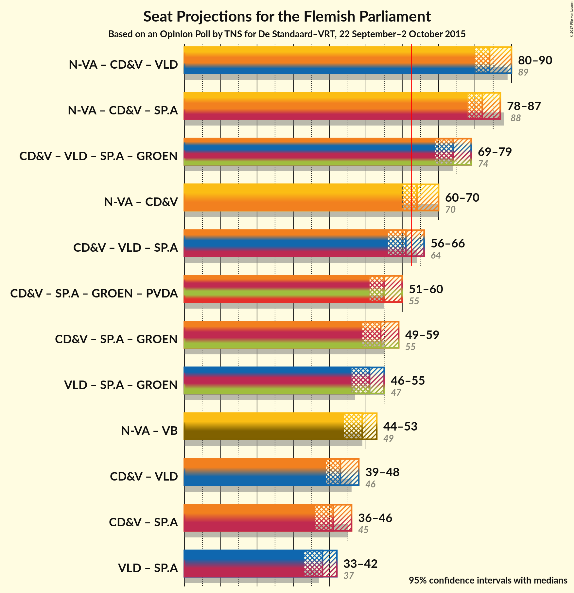

# Opinion Poll by TNS for De Standaard–VRT, 22 September–2 October 2015

<a href="#voting-intentions">Voting Intentions</a> | <a href="#seats">Seats</a> | <a href="#coalitions">Coalitions</a> | <a href="#technical-information">Technical Information</a>

## Voting Intentions

### Confidence Intervals

| Party | Last Result | Poll Result | 80% Confidence Interval | 90% Confidence Interval | 95% Confidence Interval | 99% Confidence Interval |
|:-----:|:-----------:|:-----------:|:-----------------------:|:-----------------------:|:-----------------------:|:-----------------------:|
| N-VA | 31.9% | 31.1% | 29.3–33.0% |28.8–33.6% |28.3–34.0% |27.5–34.9% |
| CD&V | 20.5% | 18.4% | 16.9–20.0% |16.4–20.5% |16.1–20.9% |15.4–21.7% |
| Open Vld | 14.1% | 14.9% | 13.6–16.4% |13.2–16.9% |12.8–17.2% |12.2–18.0% |
| sp.a | 14.0% | 13.8% | 12.5–15.3% |12.2–15.7% |11.8–16.1% |11.2–16.8% |
| Groen | 8.7% | 9.9% | 8.8–11.2% |8.5–11.6% |8.2–11.9% |7.7–12.6% |
| Vlaams Belang | 5.9% | 7.0% | 6.0–8.1% |5.8–8.4% |5.6–8.7% |5.1–9.3% |
| PVDA | 2.5% | 3.8% | 3.2–4.7% |3.0–5.0% |2.8–5.2% |2.5–5.7% |

*Note:* The poll result column reflects the actual value used in the calculations. Published results may vary slightly, and in addition be rounded to fewer digits.

## Seats

### Confidence Intervals

| Party | Last Result | Median | 80% Confidence Interval | 90% Confidence Interval | 95% Confidence Interval | 99% Confidence Interval |
|:-----:|:-----------:|:------:|:-----------------------:|:-----------------------:|:-----------------------:|:-----------------------:|
| <a href="#n-va">N-VA</a> | 43 | 42 | 39–44 |38–45 |37–46 |37–47 |
| <a href="#cd&v">CD&V</a> | 27 | 23 | 20–27 |20–27 |20–27 |19–28 |
| <a href="#open-vld">Open Vld</a> | 19 | 20 | 19–22 |18–23 |17–23 |15–24 |
| <a href="#sp.a">sp.a</a> | 18 | 19 | 15–19 |14–19 |14–20 |14–22 |
| <a href="#groen">Groen</a> | 10 | 14 | 10–15 |10–15 |10–15 |10–17 |
| <a href="#vlaams-belang">Vlaams Belang</a> | 6 | 8 | 6–8 |4–8 |4–8 |3–11 |
| <a href="#pvda">PVDA</a> | 0 | 2 | 0–2 |0–2 |0–3 |0–5 |

### N-VA

| Number of Seats | Probability | Accumulated | Special Marks |
|:---------------:|:-----------:|:-----------:|:-------------:|
| 35 | 0.1% | 100% |  |
| 36 | 0.3% | 99.9% |  |
| 37 | 4% | 99.6% |  |
| 38 | 6% | 96% |  |
| 39 | 10% | 90% |  |
| 40 | 12% | 80% |  |
| 41 | 13% | 68% |  |
| 42 | 19% | 55% | Median |
| 43 | 21% | 36% | Last Result |
| 44 | 8% | 16% |  |
| 45 | 4% | 8% |  |
| 46 | 2% | 3% |  |
| 47 | 1.3% | 1.5% |  |
| 48 | 0.2% | 0.2% |  |
| 49 | 0% | 0.1% |  |
| 50 | 0% | 0% |  |

### CD&V

| Number of Seats | Probability | Accumulated | Special Marks |
|:---------------:|:-----------:|:-----------:|:-------------:|
| 18 | 0.1% | 100% |  |
| 19 | 0.5% | 99.9% |  |
| 20 | 11% | 99.4% |  |
| 21 | 24% | 88% |  |
| 22 | 9% | 64% |  |
| 23 | 12% | 55% | Median |
| 24 | 10% | 43% |  |
| 25 | 13% | 33% |  |
| 26 | 9% | 19% |  |
| 27 | 9% | 10% | Last Result |
| 28 | 0.4% | 0.8% |  |
| 29 | 0.2% | 0.4% |  |
| 30 | 0.1% | 0.1% |  |
| 31 | 0% | 0% |  |

### Open Vld

| Number of Seats | Probability | Accumulated | Special Marks |
|:---------------:|:-----------:|:-----------:|:-------------:|
| 13 | 0.2% | 100% |  |
| 14 | 0.2% | 99.8% |  |
| 15 | 0.3% | 99.6% |  |
| 16 | 0.9% | 99.3% |  |
| 17 | 2% | 98% |  |
| 18 | 4% | 97% |  |
| 19 | 32% | 92% | Last Result |
| 20 | 38% | 60% | Median |
| 21 | 9% | 22% |  |
| 22 | 6% | 13% |  |
| 23 | 6% | 8% |  |
| 24 | 1.4% | 2% |  |
| 25 | 0.4% | 0.5% |  |
| 26 | 0.1% | 0.1% |  |
| 27 | 0% | 0% |  |

### sp.a

| Number of Seats | Probability | Accumulated | Special Marks |
|:---------------:|:-----------:|:-----------:|:-------------:|
| 14 | 9% | 100% |  |
| 15 | 6% | 91% |  |
| 16 | 9% | 85% |  |
| 17 | 9% | 76% |  |
| 18 | 13% | 67% | Last Result |
| 19 | 49% | 53% | Median |
| 20 | 3% | 4% |  |
| 21 | 0.8% | 2% |  |
| 22 | 0.5% | 0.9% |  |
| 23 | 0.3% | 0.4% |  |
| 24 | 0.1% | 0.2% |  |
| 25 | 0% | 0% |  |

### Groen

| Number of Seats | Probability | Accumulated | Special Marks |
|:---------------:|:-----------:|:-----------:|:-------------:|
| 7 | 0.1% | 100% |  |
| 8 | 0.1% | 99.9% |  |
| 9 | 0.3% | 99.8% |  |
| 10 | 18% | 99.5% | Last Result |
| 11 | 5% | 82% |  |
| 12 | 8% | 77% |  |
| 13 | 13% | 70% |  |
| 14 | 44% | 57% | Median |
| 15 | 11% | 13% |  |
| 16 | 1.2% | 2% |  |
| 17 | 0.6% | 0.6% |  |
| 18 | 0% | 0% |  |

### Vlaams Belang

| Number of Seats | Probability | Accumulated | Special Marks |
|:---------------:|:-----------:|:-----------:|:-------------:|
| 2 | 0% | 100% |  |
| 3 | 0.7% | 99.9% |  |
| 4 | 5% | 99.3% |  |
| 5 | 3% | 94% |  |
| 6 | 30% | 91% | Last Result |
| 7 | 7% | 61% |  |
| 8 | 52% | 54% | Median |
| 9 | 0.5% | 2% |  |
| 10 | 0.6% | 1.1% |  |
| 11 | 0.5% | 0.5% |  |
| 12 | 0% | 0% |  |

### PVDA

| Number of Seats | Probability | Accumulated | Special Marks |
|:---------------:|:-----------:|:-----------:|:-------------:|
| 0 | 17% | 100% | Last Result |
| 1 | 14% | 83% |  |
| 2 | 65% | 69% | Median |
| 3 | 2% | 3% |  |
| 4 | 0.3% | 1.2% |  |
| 5 | 0.8% | 0.8% |  |
| 6 | 0% | 0% |  |

## Coalitions

### Confidence Intervals

| Coalition | Last Result | Median | Majority? | 80% Confidence Interval | 90% Confidence Interval | 95% Confidence Interval | 99% Confidence Interval |
|:---------:|:-----------:|:------:|:---------:|:-----------------------:|:-----------------------:|:-----------------------:|:-----------------------:|
| N-VA – CD&V – Open Vld | 89 | 84 | 100% | 82–88 | 81–89 | 80–90 | 79–92 |
| N-VA – CD&V – sp.a | 88 | 82 | 100% | 80–86 | 79–87 | 78–87 | 76–89 |
| CD&V – Open Vld – sp.a – Groen | 74 | 74 | 100% | 71–77 | 70–78 | 69–79 | 68–80 |
| N-VA – CD&V | 70 | 64 | 81% | 62–68 | 61–69 | 60–70 | 59–72 |
| CD&V – Open Vld – sp.a | 64 | 61 | 27% | 58–64 | 57–65 | 56–66 | 55–67 |
| CD&V – sp.a – Groen – PVDA | 55 | 55 | 0.1% | 52–59 | 51–60 | 51–60 | 49–61 |
| CD&V – sp.a – Groen | 55 | 54 | 0% | 51–57 | 50–58 | 49–59 | 48–60 |
| Open Vld – sp.a – Groen | 47 | 51 | 0% | 47–53 | 46–54 | 46–55 | 44–57 |
| N-VA – Vlaams Belang | 49 | 49 | 0% | 45–51 | 45–52 | 44–53 | 43–54 |
| CD&V – Open Vld | 46 | 43 | 0% | 40–46 | 39–47 | 39–48 | 38–50 |
| CD&V – sp.a | 45 | 41 | 0% | 38–44 | 37–45 | 36–46 | 35–47 |
| Open Vld – sp.a | 37 | 38 | 0% | 35–40 | 34–41 | 33–42 | 32–43 |

### N-VA – CD&V – Open Vld

| Number of Seats | Probability | Accumulated | Special Marks |
|:---------------:|:-----------:|:-----------:|:-------------:|
| 77 | 0.1% | 100% |  |
| 78 | 0.2% | 99.9% |  |
| 79 | 0.6% | 99.7% |  |
| 80 | 2% | 99.1% |  |
| 81 | 7% | 97% |  |
| 82 | 13% | 91% |  |
| 83 | 17% | 78% |  |
| 84 | 14% | 60% |  |
| 85 | 11% | 46% | Median |
| 86 | 10% | 35% |  |
| 87 | 12% | 25% |  |
| 88 | 7% | 13% |  |
| 89 | 2% | 6% | Last Result |
| 90 | 2% | 4% |  |
| 91 | 1.0% | 2% |  |
| 92 | 0.8% | 1.0% |  |
| 93 | 0.2% | 0.2% |  |
| 94 | 0% | 0.1% |  |
| 95 | 0% | 0% |  |

### N-VA – CD&V – sp.a

| Number of Seats | Probability | Accumulated | Special Marks |
|:---------------:|:-----------:|:-----------:|:-------------:|
| 75 | 0.1% | 100% |  |
| 76 | 0.4% | 99.9% |  |
| 77 | 0.9% | 99.5% |  |
| 78 | 2% | 98.6% |  |
| 79 | 4% | 96% |  |
| 80 | 12% | 92% |  |
| 81 | 15% | 80% |  |
| 82 | 20% | 65% |  |
| 83 | 15% | 45% |  |
| 84 | 11% | 30% | Median |
| 85 | 8% | 19% |  |
| 86 | 6% | 11% |  |
| 87 | 4% | 5% |  |
| 88 | 1.0% | 2% | Last Result |
| 89 | 0.4% | 0.7% |  |
| 90 | 0.2% | 0.2% |  |
| 91 | 0.1% | 0.1% |  |
| 92 | 0% | 0% |  |

### CD&V – Open Vld – sp.a – Groen

| Number of Seats | Probability | Accumulated | Special Marks |
|:---------------:|:-----------:|:-----------:|:-------------:|
| 66 | 0% | 100% |  |
| 67 | 0.2% | 99.9% |  |
| 68 | 0.9% | 99.8% |  |
| 69 | 2% | 98.9% |  |
| 70 | 4% | 97% |  |
| 71 | 8% | 93% |  |
| 72 | 13% | 84% |  |
| 73 | 17% | 71% |  |
| 74 | 17% | 54% | Last Result |
| 75 | 12% | 37% |  |
| 76 | 11% | 25% | Median |
| 77 | 9% | 15% |  |
| 78 | 3% | 6% |  |
| 79 | 2% | 3% |  |
| 80 | 0.5% | 0.7% |  |
| 81 | 0.2% | 0.2% |  |
| 82 | 0% | 0% |  |

### N-VA – CD&V

| Number of Seats | Probability | Accumulated | Special Marks |
|:---------------:|:-----------:|:-----------:|:-------------:|
| 57 | 0.1% | 100% |  |
| 58 | 0.3% | 99.9% |  |
| 59 | 0.9% | 99.6% |  |
| 60 | 2% | 98.7% |  |
| 61 | 6% | 97% |  |
| 62 | 10% | 91% |  |
| 63 | 16% | 81% | Majority |
| 64 | 18% | 65% |  |
| 65 | 12% | 47% | Median |
| 66 | 10% | 35% |  |
| 67 | 10% | 25% |  |
| 68 | 8% | 15% |  |
| 69 | 4% | 7% |  |
| 70 | 2% | 3% | Last Result |
| 71 | 0.9% | 2% |  |
| 72 | 0.5% | 0.7% |  |
| 73 | 0.2% | 0.2% |  |
| 74 | 0% | 0.1% |  |
| 75 | 0% | 0% |  |

### CD&V – Open Vld – sp.a

| Number of Seats | Probability | Accumulated | Special Marks |
|:---------------:|:-----------:|:-----------:|:-------------:|
| 53 | 0.1% | 100% |  |
| 54 | 0.3% | 99.9% |  |
| 55 | 1.0% | 99.6% |  |
| 56 | 2% | 98.6% |  |
| 57 | 5% | 97% |  |
| 58 | 11% | 92% |  |
| 59 | 15% | 81% |  |
| 60 | 14% | 66% |  |
| 61 | 13% | 52% |  |
| 62 | 12% | 39% | Median |
| 63 | 11% | 27% | Majority |
| 64 | 7% | 16% | Last Result |
| 65 | 5% | 9% |  |
| 66 | 2% | 4% |  |
| 67 | 1.1% | 2% |  |
| 68 | 0.4% | 0.5% |  |
| 69 | 0.1% | 0.1% |  |
| 70 | 0% | 0% |  |

### CD&V – sp.a – Groen – PVDA

| Number of Seats | Probability | Accumulated | Special Marks |
|:---------------:|:-----------:|:-----------:|:-------------:|
| 48 | 0.1% | 100% |  |
| 49 | 0.3% | 99.8% |  |
| 50 | 2% | 99.5% |  |
| 51 | 3% | 98% |  |
| 52 | 6% | 94% |  |
| 53 | 9% | 88% |  |
| 54 | 13% | 80% |  |
| 55 | 18% | 66% | Last Result |
| 56 | 15% | 48% |  |
| 57 | 13% | 34% |  |
| 58 | 8% | 20% | Median |
| 59 | 6% | 12% |  |
| 60 | 4% | 6% |  |
| 61 | 1.5% | 2% |  |
| 62 | 0.3% | 0.4% |  |
| 63 | 0.1% | 0.1% | Majority |
| 64 | 0% | 0% |  |

### CD&V – sp.a – Groen

| Number of Seats | Probability | Accumulated | Special Marks |
|:---------------:|:-----------:|:-----------:|:-------------:|
| 46 | 0.1% | 100% |  |
| 47 | 0.2% | 99.9% |  |
| 48 | 0.8% | 99.7% |  |
| 49 | 3% | 98.9% |  |
| 50 | 5% | 96% |  |
| 51 | 8% | 91% |  |
| 52 | 10% | 84% |  |
| 53 | 18% | 74% |  |
| 54 | 16% | 55% |  |
| 55 | 14% | 39% | Last Result |
| 56 | 10% | 25% | Median |
| 57 | 8% | 16% |  |
| 58 | 5% | 8% |  |
| 59 | 2% | 3% |  |
| 60 | 0.7% | 1.0% |  |
| 61 | 0.2% | 0.3% |  |
| 62 | 0.1% | 0.1% |  |
| 63 | 0% | 0% | Majority |

### Open Vld – sp.a – Groen

| Number of Seats | Probability | Accumulated | Special Marks |
|:---------------:|:-----------:|:-----------:|:-------------:|
| 43 | 0.4% | 100% |  |
| 44 | 0.7% | 99.5% |  |
| 45 | 1.3% | 98.8% |  |
| 46 | 3% | 98% |  |
| 47 | 5% | 95% | Last Result |
| 48 | 10% | 89% |  |
| 49 | 11% | 79% |  |
| 50 | 11% | 68% |  |
| 51 | 13% | 58% |  |
| 52 | 19% | 44% |  |
| 53 | 16% | 25% | Median |
| 54 | 5% | 10% |  |
| 55 | 3% | 5% |  |
| 56 | 1.3% | 2% |  |
| 57 | 0.4% | 0.6% |  |
| 58 | 0.1% | 0.2% |  |
| 59 | 0% | 0% |  |

### N-VA – Vlaams Belang

| Number of Seats | Probability | Accumulated | Special Marks |
|:---------------:|:-----------:|:-----------:|:-------------:|
| 41 | 0.1% | 100% |  |
| 42 | 0.3% | 99.9% |  |
| 43 | 1.3% | 99.6% |  |
| 44 | 2% | 98% |  |
| 45 | 6% | 96% |  |
| 46 | 10% | 90% |  |
| 47 | 12% | 80% |  |
| 48 | 15% | 67% |  |
| 49 | 16% | 52% | Last Result |
| 50 | 14% | 35% | Median |
| 51 | 12% | 22% |  |
| 52 | 5% | 10% |  |
| 53 | 3% | 4% |  |
| 54 | 1.0% | 1.4% |  |
| 55 | 0.3% | 0.4% |  |
| 56 | 0.1% | 0.1% |  |
| 57 | 0% | 0% |  |

### CD&V – Open Vld

| Number of Seats | Probability | Accumulated | Special Marks |
|:---------------:|:-----------:|:-----------:|:-------------:|
| 36 | 0.1% | 100% |  |
| 37 | 0.2% | 99.9% |  |
| 38 | 0.6% | 99.7% |  |
| 39 | 5% | 99.1% |  |
| 40 | 12% | 94% |  |
| 41 | 15% | 81% |  |
| 42 | 10% | 67% |  |
| 43 | 13% | 57% | Median |
| 44 | 14% | 44% |  |
| 45 | 12% | 30% |  |
| 46 | 10% | 18% | Last Result |
| 47 | 5% | 9% |  |
| 48 | 2% | 4% |  |
| 49 | 1.1% | 2% |  |
| 50 | 0.5% | 0.6% |  |
| 51 | 0.1% | 0.1% |  |
| 52 | 0% | 0% |  |

### CD&V – sp.a

| Number of Seats | Probability | Accumulated | Special Marks |
|:---------------:|:-----------:|:-----------:|:-------------:|
| 34 | 0.3% | 100% |  |
| 35 | 0.9% | 99.7% |  |
| 36 | 3% | 98.8% |  |
| 37 | 4% | 96% |  |
| 38 | 7% | 92% |  |
| 39 | 16% | 85% |  |
| 40 | 18% | 69% |  |
| 41 | 12% | 51% |  |
| 42 | 13% | 40% | Median |
| 43 | 9% | 27% |  |
| 44 | 9% | 18% |  |
| 45 | 5% | 9% | Last Result |
| 46 | 4% | 4% |  |
| 47 | 0.5% | 0.7% |  |
| 48 | 0.2% | 0.2% |  |
| 49 | 0.1% | 0.1% |  |
| 50 | 0% | 0% |  |

### Open Vld – sp.a

| Number of Seats | Probability | Accumulated | Special Marks |
|:---------------:|:-----------:|:-----------:|:-------------:|
| 30 | 0.1% | 100% |  |
| 31 | 0.1% | 99.9% |  |
| 32 | 0.7% | 99.7% |  |
| 33 | 3% | 99.0% |  |
| 34 | 6% | 96% |  |
| 35 | 6% | 90% |  |
| 36 | 8% | 84% |  |
| 37 | 12% | 76% | Last Result |
| 38 | 28% | 63% |  |
| 39 | 19% | 35% | Median |
| 40 | 7% | 15% |  |
| 41 | 4% | 8% |  |
| 42 | 3% | 4% |  |
| 43 | 0.7% | 1.0% |  |
| 44 | 0.2% | 0.4% |  |
| 45 | 0.1% | 0.1% |  |
| 46 | 0% | 0% |  |

## Technical Information

### Opinion Poll

+ **Pollster:** TNS
+ **Media:** De Standaard–VRT
+ **Fieldwork period:** 22 September–2 October 2015

### Calculations

+ **Sample size:** 1019
+ **Simulations done:** 4,194,304
+ **Error estimate:** 1.75%

