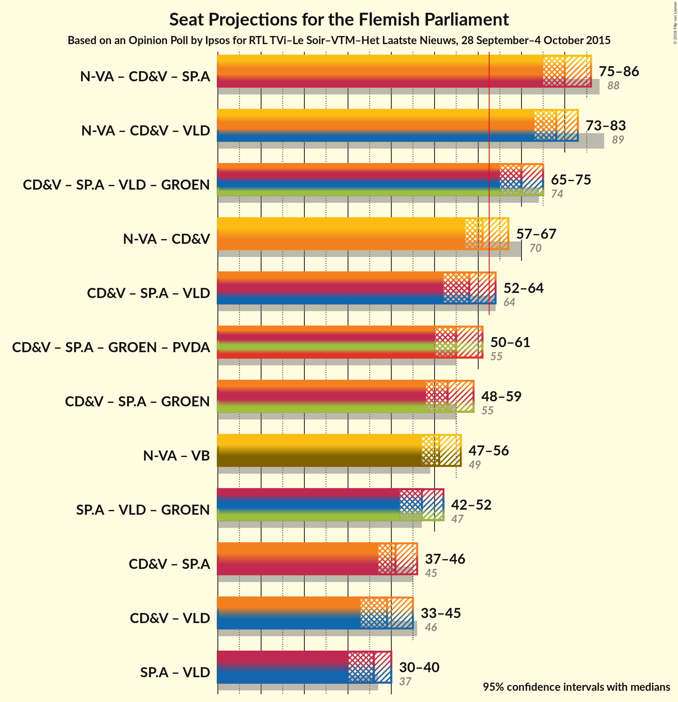

# Opinion Poll by Ipsos for RTL TVi–Le Soir, 28 September–4 October 2016

<a href="#voting-intentions">Voting Intentions</a> | <a href="#seats">Seats</a> | <a href="#coalitions">Coalitions</a> | <a href="#technical-information">Technical Information</a>

## Voting Intentions

### Confidence Intervals

| Party | Last Result | Poll Result | 80% Confidence Interval | 90% Confidence Interval | 95% Confidence Interval | 99% Confidence Interval |
|:-----:|:-----------:|:-----------:|:-----------------------:|:-----------------------:|:-----------------------:|:-----------------------:|
| N-VA | 31.9% | 29.7% | 27.1–30.7% |26.6–31.2% |26.1–31.7% |25.3–32.6% |
| CD&V | 20.5% | 18.3% | 16.3–19.4% |15.9–19.8% |15.5–20.2% |14.9–21.0% |
| sp.a | 14.0% | 14.9% | 13.1–16.0% |12.8–16.4% |12.4–16.8% |11.8–17.5% |
| Open Vld | 14.1% | 12.9% | 11.3–13.9% |10.9–14.3% |10.6–14.7% |10.1–15.4% |
| Vlaams Belang | 5.9% | 10.8% | 9.3–11.8% |9.0–12.2% |8.7–12.5% |8.2–13.2% |
| Groen | 8.7% | 9.3% | 8.0–10.3% |7.7–10.6% |7.4–10.9% |7.0–11.6% |
| PVDA | 2.5% | 4.2% | 3.4–5.0% |3.2–5.2% |3.0–5.5% |2.7–5.9% |

*Note:* The poll result column reflects the actual value used in the calculations. Published results may vary slightly, and in addition be rounded to fewer digits.

## Seats

### Confidence Intervals

| Party | Last Result | 80% Confidence Interval | 90% Confidence Interval | 95% Confidence Interval | 99% Confidence Interval |
|:-----:|:-----------:|:-----------------------:|:-----------------------:|:-----------------------:|:-----------------------:|
| <a href="#n-va">N-VA</a> | 43 | 37–42 |36–42 |35–43 |33–45 |
| <a href="#cd&v">CD&V</a> | 27 | 20–26 |20–27 |20–27 |19–28 |
| <a href="#sp.a">sp.a</a> | 18 | 17–20 |16–22 |15–23 |14–24 |
| <a href="#open-vld">Open Vld</a> | 19 | 13–19 |13–19 |13–19 |12–20 |
| <a href="#vlaams-belang">Vlaams Belang</a> | 6 | 11–16 |10–16 |9–16 |8–17 |
| <a href="#groen">Groen</a> | 10 | 10–14 |10–14 |8–14 |7–15 |
| <a href="#pvda">PVDA</a> | 0 | 1–2 |0–3 |0–5 |0–5 |

### N-VA

| Number of Seats | Probability | Accumulated |
|:---------------:|:-----------:|:-----------:|
| 32 | 0.1% | 100% |
| 33 | 0.7% | 99.9% |
| 34 | 1.3% | 99.1% |
| 35 | 2% | 98% |
| 36 | 4% | 96% |
| 37 | 24% | 92% |
| 38 | 17% | 68% |
| 39 | 16% | 51% |
| 40 | 17% | 35% |
| 41 | 8% | 18% |
| 42 | 5% | 10% |
| 43 | 3% | 5% |
| 44 | 1.0% | 2% |
| 45 | 0.4% | 0.5% |
| 46 | 0.1% | 0.1% |
| 47 | 0% | 0% |

### CD&V

| Number of Seats | Probability | Accumulated |
|:---------------:|:-----------:|:-----------:|
| 17 | 0.1% | 100% |
| 18 | 0.4% | 99.9% |
| 19 | 0.8% | 99.5% |
| 20 | 22% | 98.7% |
| 21 | 18% | 77% |
| 22 | 10% | 58% |
| 23 | 9% | 48% |
| 24 | 9% | 39% |
| 25 | 17% | 30% |
| 26 | 8% | 13% |
| 27 | 5% | 6% |
| 28 | 0.4% | 0.7% |
| 29 | 0.2% | 0.3% |
| 30 | 0% | 0% |

### sp.a

| Number of Seats | Probability | Accumulated |
|:---------------:|:-----------:|:-----------:|
| 14 | 2% | 100% |
| 15 | 3% | 98% |
| 16 | 5% | 95% |
| 17 | 7% | 91% |
| 18 | 10% | 83% |
| 19 | 56% | 73% |
| 20 | 8% | 17% |
| 21 | 3% | 10% |
| 22 | 3% | 7% |
| 23 | 2% | 4% |
| 24 | 2% | 2% |
| 25 | 0.1% | 0.1% |
| 26 | 0% | 0% |

### Open Vld

| Number of Seats | Probability | Accumulated |
|:---------------:|:-----------:|:-----------:|
| 12 | 1.2% | 100% |
| 13 | 18% | 98.8% |
| 14 | 7% | 81% |
| 15 | 6% | 74% |
| 16 | 9% | 68% |
| 17 | 12% | 60% |
| 18 | 12% | 48% |
| 19 | 34% | 36% |
| 20 | 1.3% | 2% |
| 21 | 0.2% | 0.3% |
| 22 | 0.1% | 0.1% |
| 23 | 0% | 0% |

### Vlaams Belang

| Number of Seats | Probability | Accumulated |
|:---------------:|:-----------:|:-----------:|
| 8 | 2% | 100% |
| 9 | 1.4% | 98% |
| 10 | 4% | 96% |
| 11 | 29% | 92% |
| 12 | 23% | 63% |
| 13 | 14% | 41% |
| 14 | 10% | 27% |
| 15 | 5% | 16% |
| 16 | 10% | 11% |
| 17 | 0.7% | 0.8% |
| 18 | 0.1% | 0.1% |
| 19 | 0% | 0% |

### Groen

| Number of Seats | Probability | Accumulated |
|:---------------:|:-----------:|:-----------:|
| 7 | 1.4% | 100% |
| 8 | 1.3% | 98.6% |
| 9 | 2% | 97% |
| 10 | 35% | 96% |
| 11 | 10% | 61% |
| 12 | 10% | 51% |
| 13 | 15% | 41% |
| 14 | 24% | 25% |
| 15 | 1.3% | 1.4% |
| 16 | 0.1% | 0.2% |
| 17 | 0.1% | 0.1% |
| 18 | 0% | 0% |

### PVDA

| Number of Seats | Probability | Accumulated |
|:---------------:|:-----------:|:-----------:|
| 0 | 7% | 100% |
| 1 | 9% | 93% |
| 2 | 74% | 83% |
| 3 | 6% | 9% |
| 4 | 0.7% | 4% |
| 5 | 3% | 3% |
| 6 | 0% | 0% |

## Coalitions

### Confidence Intervals

| Coalition | Last Result | 80% Confidence Interval | 90% Confidence Interval | 95% Confidence Interval | 99% Confidence Interval |
|:---------:|:-----------:|:-----------------------:|:-----------------------:|:-----------------------:|:-----------------------:|
| N-VA – CD&V – sp.a | 88 | 76–84 | 76–85 | 75–86 | 74–87 |
| N-VA – CD&V – Open Vld | 89 | 75–81 | 74–83 | 73–83 | 71–85 |
| CD&V – sp.a – Open Vld – Groen | 74 | 67–73 | 66–74 | 65–75 | 63–76 |
| N-VA – CD&V | 70 | 58–65 | 57–66 | 57–67 | 55–69 |
| CD&V – sp.a – Open Vld | 64 | 54–62 | 53–63 | 52–64 | 51–65 |
| CD&V – sp.a – Groen – PVDA | 55 | 51–59 | 50–60 | 50–61 | 48–62 |
| CD&V – sp.a – Groen | 55 | 50–57 | 49–58 | 48–59 | 47–60 |
| N-VA – Vlaams Belang | 49 | 48–54 | 47–55 | 47–56 | 45–58 |
| sp.a – Open Vld – Groen | 47 | 43–51 | 42–52 | 42–52 | 40–53 |
| CD&V – sp.a | 45 | 38–45 | 37–46 | 37–46 | 35–49 |
| CD&V – Open Vld | 46 | 36–43 | 34–44 | 33–45 | 33–46 |
| sp.a – Open Vld | 37 | 32–38 | 31–39 | 30–40 | 28–42 |

## Technical Information

### Opinion Poll

+ **Pollster:** Ipsos
+ **Media:** RTL TVi–Le Soir
+ **Fieldwork period:** 28 September–4 October 2016

### Calculations

+ **Sample size:** 1001
+ **Simulations done:** 4,194,304
+ **Error estimate:** 1.45%

