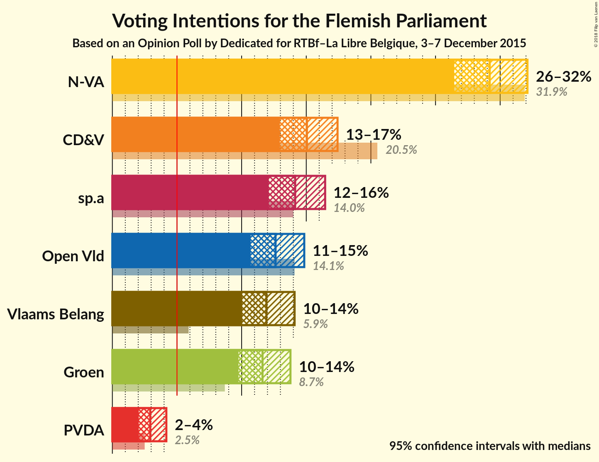
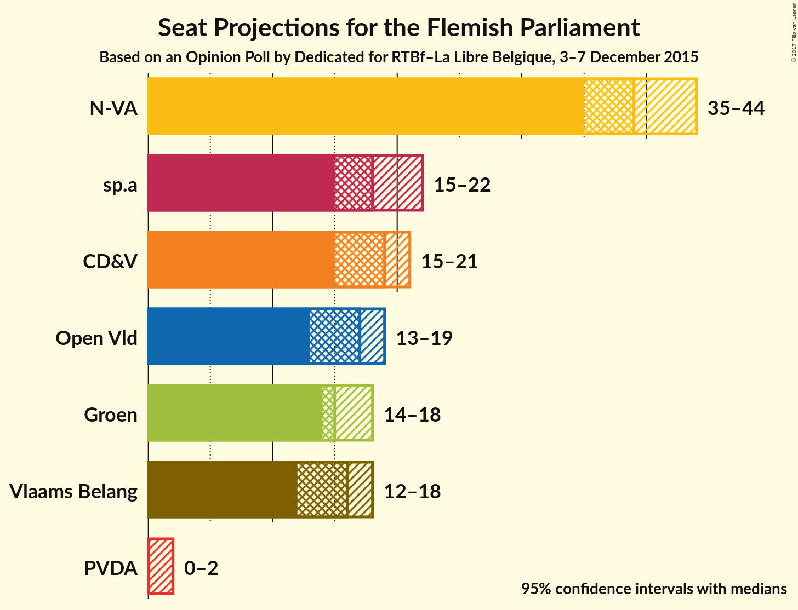
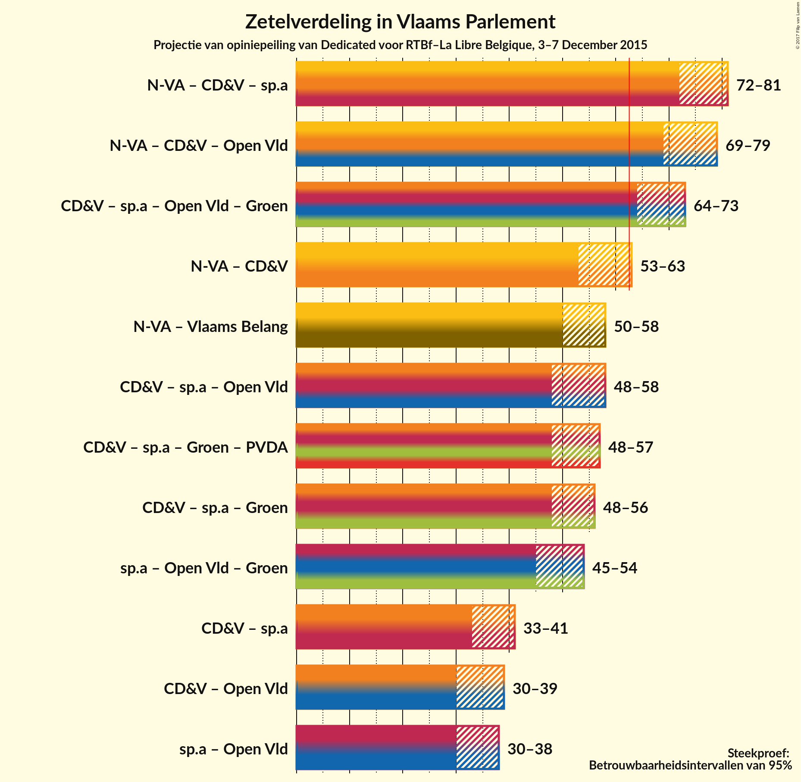

# Opinion Poll by Dedicated for RTBf–La Libre Belgique, 3–7 December 2015

<a href="#voting-intentions">Voting Intentions</a> | <a href="#seats">Seats</a> | <a href="#coalitions">Coalitions</a> | <a href="#technical-information">Technical Information</a>

## Voting Intentions

### Confidence Intervals

| Party | Last Result | Poll Result | 80% Confidence Interval | 90% Confidence Interval | 95% Confidence Interval | 99% Confidence Interval |
|:-----:|:-----------:|:-----------:|:-----------------------:|:-----------------------:|:-----------------------:|:-----------------------:|
| N-VA | 31.9% | 29.9% | 27.4–31.1% |26.9–31.6% |26.4–32.1% |25.6–33.0% |
| CD&V | 20.5% | 15.4% | 13.7–16.6% |13.3–17.0% |13.0–17.4% |12.3–18.2% |
| sp.a | 14.0% | 14.5% | 12.8–15.7% |12.4–16.1% |12.1–16.5% |11.5–17.2% |
| Open Vld | 14.1% | 13.0% | 11.4–14.1% |11.0–14.5% |10.7–14.8% |10.1–15.6% |
| Vlaams Belang | 5.9% | 12.2% | 10.7–13.3% |10.3–13.7% |10.0–14.1% |9.5–14.8% |
| Groen | 8.7% | 11.9% | 10.4–13.0% |10.1–13.4% |9.8–13.8% |9.2–14.5% |
| PVDA | 2.5% | 3.0% | 2.3–3.7% |2.2–4.0% |2.0–4.2% |1.8–4.6% |

*Note:* The poll result column reflects the actual value used in the calculations. Published results may vary slightly, and in addition be rounded to fewer digits.

## Seats

### Confidence Intervals

| Party | Last Result | 80% Confidence Interval | 90% Confidence Interval | 95% Confidence Interval | 99% Confidence Interval |
|:-----:|:-----------:|:-----------------------:|:-----------------------:|:-----------------------:|:-----------------------:|
| <a href="#n-va">N-VA</a> | 43 | 37–42 |36–43 |35–44 |34–45 |
| <a href="#cd&v">CD&V</a> | 27 | 16–20 |16–21 |15–21 |15–23 |
| <a href="#sp.a">sp.a</a> | 18 | 16–19 |15–21 |15–22 |14–24 |
| <a href="#open-vld">Open Vld</a> | 19 | 13–19 |13–19 |13–19 |12–20 |
| <a href="#vlaams-belang">Vlaams Belang</a> | 6 | 13–16 |12–17 |12–18 |11–19 |
| <a href="#groen">Groen</a> | 10 | 14–17 |14–17 |14–18 |12–19 |
| <a href="#pvda">PVDA</a> | 0 | 0–2 |0–2 |0–2 |0–2 |

### N-VA

| Number of Seats | Probability | Accumulated |
|:---------------:|:-----------:|:-----------:|
| 33 | 0.1% | 100% |
| 34 | 0.9% | 99.9% |
| 35 | 3% | 99.0% |
| 36 | 5% | 96% |
| 37 | 7% | 90% |
| 38 | 16% | 83% |
| 39 | 31% | 67% |
| 40 | 15% | 36% |
| 41 | 7% | 21% |
| 42 | 7% | 14% |
| 43 | 4% | 7% |
| 44 | 2% | 3% |
| 45 | 0.5% | 0.7% |
| 46 | 0.2% | 0.2% |
| 47 | 0% | 0% |

### CD&V

| Number of Seats | Probability | Accumulated |
|:---------------:|:-----------:|:-----------:|
| 14 | 0.2% | 100% |
| 15 | 5% | 99.8% |
| 16 | 10% | 95% |
| 17 | 13% | 85% |
| 18 | 17% | 71% |
| 19 | 14% | 54% |
| 20 | 31% | 40% |
| 21 | 8% | 9% |
| 22 | 1.0% | 2% |
| 23 | 0.3% | 0.6% |
| 24 | 0.2% | 0.3% |
| 25 | 0.1% | 0.1% |
| 26 | 0% | 0% |

### sp.a

| Number of Seats | Probability | Accumulated |
|:---------------:|:-----------:|:-----------:|
| 14 | 2% | 100% |
| 15 | 6% | 98% |
| 16 | 4% | 92% |
| 17 | 9% | 88% |
| 18 | 32% | 79% |
| 19 | 38% | 48% |
| 20 | 4% | 10% |
| 21 | 2% | 5% |
| 22 | 1.3% | 3% |
| 23 | 1.1% | 2% |
| 24 | 0.5% | 0.5% |
| 25 | 0% | 0% |

### Open Vld

| Number of Seats | Probability | Accumulated |
|:---------------:|:-----------:|:-----------:|
| 12 | 1.4% | 100% |
| 13 | 14% | 98.6% |
| 14 | 7% | 85% |
| 15 | 8% | 78% |
| 16 | 13% | 70% |
| 17 | 26% | 57% |
| 18 | 15% | 31% |
| 19 | 15% | 17% |
| 20 | 0.8% | 1.2% |
| 21 | 0.2% | 0.4% |
| 22 | 0.1% | 0.1% |
| 23 | 0.1% | 0.1% |
| 24 | 0% | 0% |

### Vlaams Belang

| Number of Seats | Probability | Accumulated |
|:---------------:|:-----------:|:-----------:|
| 8 | 0.1% | 100% |
| 9 | 0.1% | 99.9% |
| 10 | 0.2% | 99.9% |
| 11 | 2% | 99.7% |
| 12 | 5% | 98% |
| 13 | 5% | 93% |
| 14 | 13% | 89% |
| 15 | 19% | 75% |
| 16 | 48% | 56% |
| 17 | 5% | 8% |
| 18 | 2% | 3% |
| 19 | 0.4% | 0.6% |
| 20 | 0.2% | 0.2% |
| 21 | 0% | 0% |

### Groen

| Number of Seats | Probability | Accumulated |
|:---------------:|:-----------:|:-----------:|
| 10 | 0.2% | 100% |
| 11 | 0.2% | 99.8% |
| 12 | 0.4% | 99.5% |
| 13 | 1.4% | 99.1% |
| 14 | 47% | 98% |
| 15 | 16% | 50% |
| 16 | 16% | 35% |
| 17 | 16% | 19% |
| 18 | 3% | 3% |
| 19 | 0.5% | 0.9% |
| 20 | 0.3% | 0.4% |
| 21 | 0.1% | 0.1% |
| 22 | 0% | 0% |

### PVDA

| Number of Seats | Probability | Accumulated |
|:---------------:|:-----------:|:-----------:|
| 0 | 75% | 100% |
| 1 | 12% | 25% |
| 2 | 13% | 13% |
| 3 | 0.1% | 0.1% |
| 4 | 0% | 0% |

## Coalitions

### Confidence Intervals

| Coalition | Last Result | 80% Confidence Interval | 90% Confidence Interval | 95% Confidence Interval | 99% Confidence Interval |
|:---------:|:-----------:|:-----------------------:|:-----------------------:|:-----------------------:|:-----------------------:|
| N-VA – CD&V – sp.a | 88 | 73–79 | 72–80 | 72–81 | 70–83 |
| N-VA – CD&V – Open Vld | 89 | 71–77 | 71–78 | 69–79 | 68–80 |
| CD&V – sp.a – Open Vld – Groen | 74 | 66–71 | 65–72 | 64–73 | 62–75 |
| N-VA – CD&V | 70 | 55–61 | 54–62 | 53–63 | 52–64 |
| N-VA – Vlaams Belang | 49 | 52–57 | 51–58 | 50–58 | 47–61 |
| CD&V – sp.a – Open Vld | 64 | 50–56 | 49–57 | 48–58 | 47–59 |
| CD&V – sp.a – Groen – PVDA | 55 | 50–55 | 49–56 | 48–57 | 47–59 |
| CD&V – sp.a – Groen | 55 | 49–55 | 48–56 | 48–56 | 46–58 |
| sp.a – Open Vld – Groen | 47 | 46–52 | 46–53 | 45–54 | 44–56 |
| CD&V – sp.a | 45 | 34–39 | 33–40 | 33–41 | 31–43 |
| CD&V – Open Vld | 46 | 32–38 | 31–39 | 30–39 | 29–40 |
| sp.a – Open Vld | 37 | 32–38 | 31–38 | 30–38 | 28–40 |

## Technical Information

### Opinion Poll

+ **Pollster:** Dedicated
+ **Media:** RTBf–La Libre Belgique
+ **Fieldwork period:** 3–7 December 2015

### Calculations

+ **Sample size:** 965
+ **Simulations done:** 2,097,152
+ **Error estimate:** 1.11%

