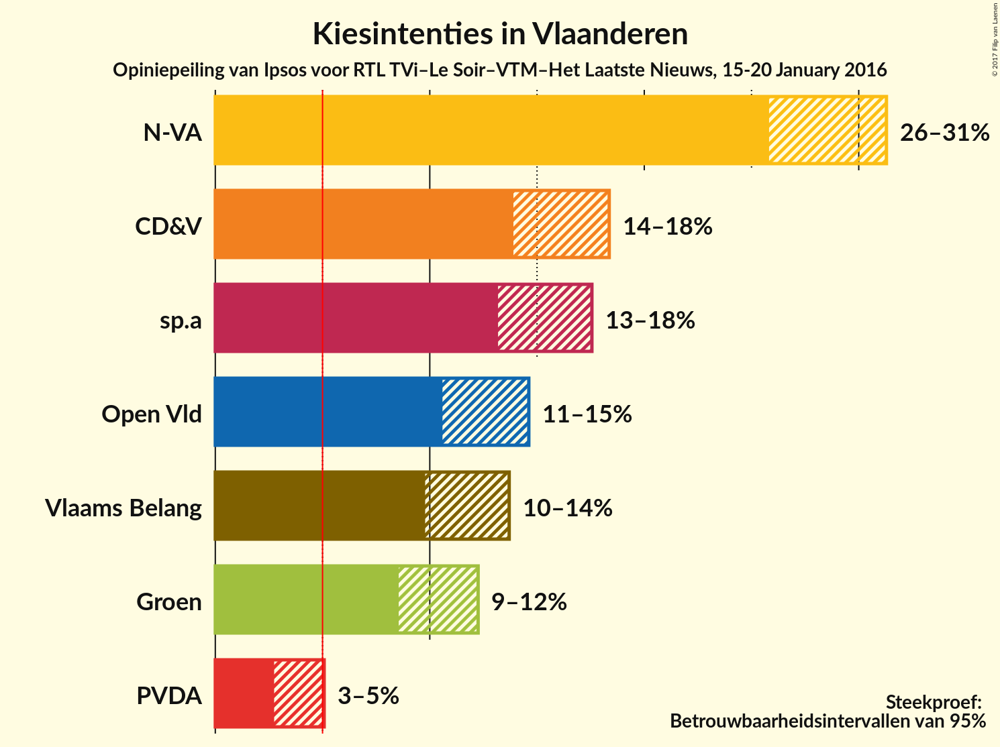
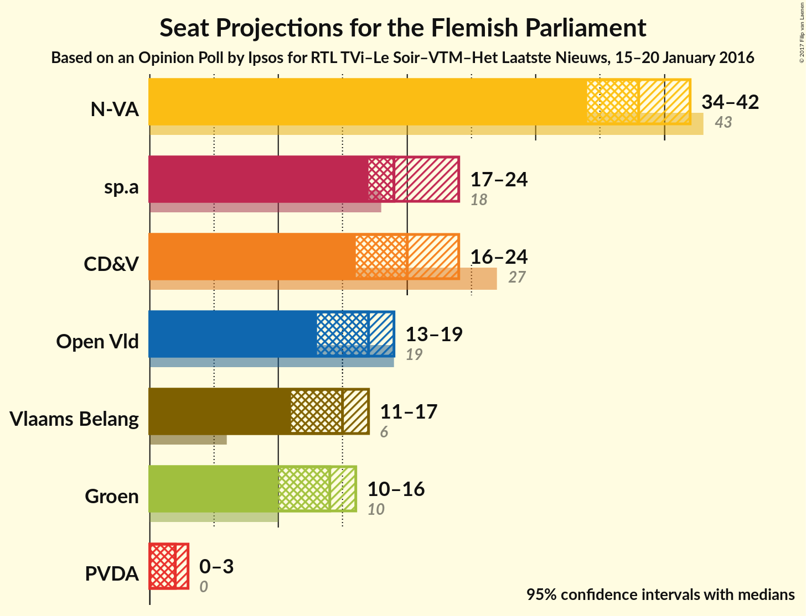
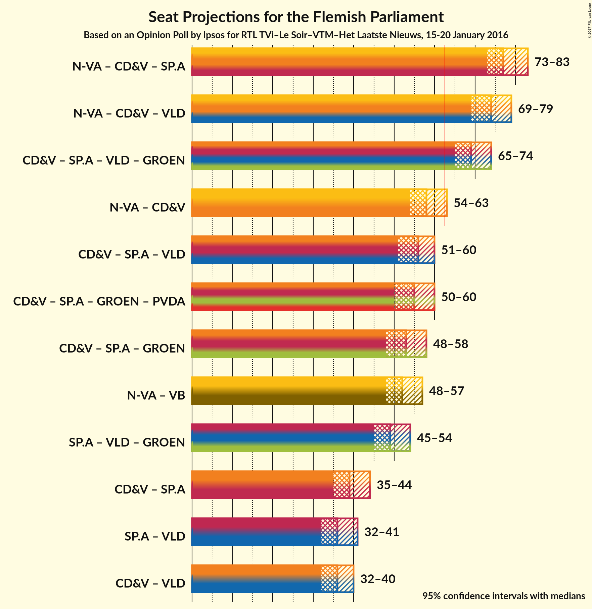

# Opinion Poll by Ipsos for RTL TVi–Le Soir–VTM–Het Laatste Nieuws, 15-20 January 2016

<a href="#voting-intentions">Voting Intentions</a> | <a href="#seats">Seats</a> | <a href="#coalitions">Coalitions</a> | <a href="#technical-information">Technical Information</a>

## Voting Intentions

### Confidence Intervals

| Party | Last Result | Poll Result | 80% Confidence Interval | 90% Confidence Interval | 95% Confidence Interval | 99% Confidence Interval |
|:-----:|:-----------:|:-----------:|:-----------------------:|:-----------------------:|:-----------------------:|:-----------------------:|
| N-VA | 31.9% | 28.5% | 26.7–30.3% |26.2–30.8% |25.8–31.3% |25.0–32.2% |
| CD&V | 20.5% | 16.0% | 14.6–17.6% |14.2–18.0% |13.9–18.4% |13.3–19.1% |
| sp.a | 14.0% | 15.2% | 13.9–16.8% |13.5–17.2% |13.2–17.6% |12.6–18.3% |
| Open Vld | 14.1% | 12.5% | 11.2–13.9% |10.9–14.3% |10.6–14.6% |10.0–15.3% |
| Vlaams Belang | 5.9% | 11.6% | 10.4–13.0% |10.1–13.4% |9.8–13.7% |9.3–14.4% |
| Groen | 8.7% | 10.3% | 9.1–11.6% |8.8–11.9% |8.6–12.3% |8.0–12.9% |
| PVDA | 2.5% | 3.7% | 3.1–4.6% |2.9–4.9% |2.7–5.1% |2.5–5.5% |

*Note:* The poll result column reflects the actual value used in the calculations. Published results may vary slightly, and in addition be rounded to fewer digits.

## Seats

### Confidence Intervals

| Party | Last Result | Median | 80% Confidence Interval | 90% Confidence Interval | 95% Confidence Interval | 99% Confidence Interval |
|:-----:|:-----------:|:------:|:-----------------------:|:-----------------------:|:-----------------------:|:-----------------------:|
| <a href="#n-va">N-VA</a> | 43 | 38 | 35–40 |34–41 |34–42 |33–44 |
| <a href="#cd&v">CD&V</a> | 27 | 20 | 18–21 |17–22 |16–24 |15–25 |
| <a href="#sp.a">sp.a</a> | 18 | 19 | 18–22 |17–24 |17–24 |15–24 |
| <a href="#open-vld">Open Vld</a> | 19 | 17 | 13–19 |13–19 |13–19 |12–20 |
| <a href="#vlaams-belang">Vlaams Belang</a> | 6 | 15 | 12–16 |11–17 |11–17 |10–18 |
| <a href="#groen">Groen</a> | 10 | 14 | 11–15 |10–15 |10–16 |10–17 |
| <a href="#pvda">PVDA</a> | 0 | 2 | 0–2 |0–2 |0–3 |0–5 |

### N-VA

| Number of Seats | Probability | Accumulated | Special Marks |
|:---------------:|:-----------:|:-----------:|:-------------:|
| 31 | 0% | 100% |  |
| 32 | 0.2% | 99.9% |  |
| 33 | 0.9% | 99.8% |  |
| 34 | 5% | 98.9% |  |
| 35 | 5% | 94% |  |
| 36 | 8% | 89% |  |
| 37 | 23% | 81% |  |
| 38 | 22% | 58% | Median |
| 39 | 18% | 36% |  |
| 40 | 10% | 19% |  |
| 41 | 5% | 9% |  |
| 42 | 3% | 4% |  |
| 43 | 1.4% | 2% | Last Result |
| 44 | 0.4% | 0.5% |  |
| 45 | 0.1% | 0.1% |  |
| 46 | 0% | 0% |  |

### CD&V

| Number of Seats | Probability | Accumulated | Special Marks |
|:---------------:|:-----------:|:-----------:|:-------------:|
| 15 | 0.9% | 100% |  |
| 16 | 3% | 99.1% |  |
| 17 | 3% | 96% |  |
| 18 | 8% | 93% |  |
| 19 | 11% | 85% |  |
| 20 | 48% | 74% | Median |
| 21 | 17% | 26% |  |
| 22 | 4% | 9% |  |
| 23 | 2% | 5% |  |
| 24 | 2% | 3% |  |
| 25 | 1.0% | 1.4% |  |
| 26 | 0.2% | 0.4% |  |
| 27 | 0.1% | 0.1% | Last Result |
| 28 | 0% | 0% |  |

### sp.a

| Number of Seats | Probability | Accumulated | Special Marks |
|:---------------:|:-----------:|:-----------:|:-------------:|
| 14 | 0.2% | 100% |  |
| 15 | 0.4% | 99.8% |  |
| 16 | 1.3% | 99.4% |  |
| 17 | 4% | 98% |  |
| 18 | 10% | 94% | Last Result |
| 19 | 48% | 84% | Median |
| 20 | 13% | 36% |  |
| 21 | 8% | 23% |  |
| 22 | 5% | 15% |  |
| 23 | 4% | 10% |  |
| 24 | 5% | 6% |  |
| 25 | 0.2% | 0.3% |  |
| 26 | 0.1% | 0.1% |  |
| 27 | 0% | 0% |  |

### Open Vld

| Number of Seats | Probability | Accumulated | Special Marks |
|:---------------:|:-----------:|:-----------:|:-------------:|
| 12 | 2% | 100% |  |
| 13 | 19% | 98% |  |
| 14 | 11% | 79% |  |
| 15 | 8% | 68% |  |
| 16 | 8% | 60% |  |
| 17 | 16% | 52% | Median |
| 18 | 11% | 35% |  |
| 19 | 23% | 24% | Last Result |
| 20 | 0.7% | 0.9% |  |
| 21 | 0.1% | 0.2% |  |
| 22 | 0% | 0.1% |  |
| 23 | 0% | 0% |  |

### Vlaams Belang

| Number of Seats | Probability | Accumulated | Special Marks |
|:---------------:|:-----------:|:-----------:|:-------------:|
| 6 | 0% | 100% | Last Result |
| 7 | 0% | 100% |  |
| 8 | 0.1% | 100% |  |
| 9 | 0.1% | 99.9% |  |
| 10 | 0.3% | 99.8% |  |
| 11 | 6% | 99.4% |  |
| 12 | 18% | 94% |  |
| 13 | 13% | 76% |  |
| 14 | 13% | 63% |  |
| 15 | 10% | 50% | Median |
| 16 | 33% | 40% |  |
| 17 | 4% | 6% |  |
| 18 | 2% | 2% |  |
| 19 | 0.2% | 0.2% |  |
| 20 | 0% | 0% |  |

### Groen

| Number of Seats | Probability | Accumulated | Special Marks |
|:---------------:|:-----------:|:-----------:|:-------------:|
| 8 | 0% | 100% |  |
| 9 | 0.1% | 99.9% |  |
| 10 | 7% | 99.8% | Last Result |
| 11 | 3% | 93% |  |
| 12 | 5% | 89% |  |
| 13 | 12% | 84% |  |
| 14 | 62% | 73% | Median |
| 15 | 6% | 11% |  |
| 16 | 2% | 4% |  |
| 17 | 2% | 2% |  |
| 18 | 0.1% | 0.1% |  |
| 19 | 0% | 0% |  |

### PVDA

| Number of Seats | Probability | Accumulated | Special Marks |
|:---------------:|:-----------:|:-----------:|:-------------:|
| 0 | 20% | 100% | Last Result |
| 1 | 17% | 80% |  |
| 2 | 60% | 63% | Median |
| 3 | 2% | 3% |  |
| 4 | 0.2% | 0.8% |  |
| 5 | 0.6% | 0.6% |  |
| 6 | 0% | 0% |  |

## Coalitions

### Confidence Intervals

| Coalition | Last Result | Median | Majority? | 80% Confidence Interval | 90% Confidence Interval | 95% Confidence Interval | 99% Confidence Interval |
|:---------:|:-----------:|:------:|:---------:|:-----------------------:|:-----------------------:|:-----------------------:|:-----------------------:|
| N-VA – CD&V – sp.a | 88 | 77 | 100% | 74–81 | 74–82 | 73–83 | 72–84 |
| N-VA – CD&V – Open Vld | 89 | 74 | 100% | 71–77 | 70–78 | 69–79 | 68–80 |
| CD&V – sp.a – Open Vld – Groen | 74 | 69 | 99.7% | 66–72 | 66–73 | 65–74 | 63–75 |
| N-VA – CD&V | 70 | 58 | 3% | 55–61 | 54–62 | 54–63 | 52–64 |
| CD&V – sp.a – Open Vld | 64 | 56 | 0.5% | 53–59 | 52–60 | 51–60 | 49–62 |
| CD&V – sp.a – Groen – PVDA | 55 | 55 | 0.1% | 52–58 | 51–59 | 50–60 | 48–61 |
| CD&V – sp.a – Groen | 55 | 53 | 0% | 50–56 | 49–57 | 48–58 | 47–60 |
| N-VA – Vlaams Belang | 49 | 52 | 0% | 49–55 | 48–56 | 48–57 | 46–59 |
| sp.a – Open Vld – Groen | 47 | 49 | 0% | 46–52 | 46–53 | 45–54 | 43–56 |
| CD&V – sp.a | 45 | 39 | 0% | 37–43 | 36–44 | 35–44 | 34–46 |
| sp.a – Open Vld | 37 | 36 | 0% | 32–39 | 32–40 | 32–41 | 30–42 |
| CD&V – Open Vld | 46 | 36 | 0% | 33–39 | 32–40 | 32–40 | 30–42 |

### N-VA – CD&V – sp.a

| Number of Seats | Probability | Accumulated | Special Marks |
|:---------------:|:-----------:|:-----------:|:-------------:|
| 71 | 0.2% | 100% |  |
| 72 | 0.7% | 99.8% |  |
| 73 | 3% | 99.1% |  |
| 74 | 6% | 96% |  |
| 75 | 12% | 90% |  |
| 76 | 16% | 77% |  |
| 77 | 15% | 62% | Median |
| 78 | 13% | 47% |  |
| 79 | 12% | 34% |  |
| 80 | 9% | 22% |  |
| 81 | 7% | 13% |  |
| 82 | 4% | 6% |  |
| 83 | 1.5% | 3% |  |
| 84 | 0.7% | 1.1% |  |
| 85 | 0.3% | 0.4% |  |
| 86 | 0.1% | 0.1% |  |
| 87 | 0% | 0.1% |  |
| 88 | 0% | 0% | Last Result |

### N-VA – CD&V – Open Vld

| Number of Seats | Probability | Accumulated | Special Marks |
|:---------------:|:-----------:|:-----------:|:-------------:|
| 66 | 0% | 100% |  |
| 67 | 0.2% | 99.9% |  |
| 68 | 0.9% | 99.7% |  |
| 69 | 2% | 98.8% |  |
| 70 | 4% | 97% |  |
| 71 | 7% | 92% |  |
| 72 | 14% | 86% |  |
| 73 | 13% | 72% |  |
| 74 | 17% | 58% |  |
| 75 | 13% | 42% | Median |
| 76 | 11% | 28% |  |
| 77 | 9% | 18% |  |
| 78 | 5% | 8% |  |
| 79 | 2% | 3% |  |
| 80 | 0.8% | 1.2% |  |
| 81 | 0.3% | 0.5% |  |
| 82 | 0.1% | 0.1% |  |
| 83 | 0% | 0% |  |
| 84 | 0% | 0% |  |
| 85 | 0% | 0% |  |
| 86 | 0% | 0% |  |
| 87 | 0% | 0% |  |
| 88 | 0% | 0% |  |
| 89 | 0% | 0% | Last Result |

### CD&V – sp.a – Open Vld – Groen

| Number of Seats | Probability | Accumulated | Special Marks |
|:---------------:|:-----------:|:-----------:|:-------------:|
| 61 | 0.1% | 100% |  |
| 62 | 0.2% | 99.9% |  |
| 63 | 0.7% | 99.7% | Majority |
| 64 | 1.0% | 99.0% |  |
| 65 | 3% | 98% |  |
| 66 | 7% | 95% |  |
| 67 | 15% | 88% |  |
| 68 | 13% | 73% |  |
| 69 | 14% | 61% |  |
| 70 | 13% | 47% | Median |
| 71 | 12% | 34% |  |
| 72 | 12% | 22% |  |
| 73 | 6% | 10% |  |
| 74 | 3% | 4% | Last Result |
| 75 | 0.9% | 1.4% |  |
| 76 | 0.4% | 0.5% |  |
| 77 | 0.1% | 0.1% |  |
| 78 | 0% | 0% |  |

### N-VA – CD&V

| Number of Seats | Probability | Accumulated | Special Marks |
|:---------------:|:-----------:|:-----------:|:-------------:|
| 50 | 0% | 100% |  |
| 51 | 0.2% | 99.9% |  |
| 52 | 0.6% | 99.8% |  |
| 53 | 1.3% | 99.2% |  |
| 54 | 5% | 98% |  |
| 55 | 8% | 93% |  |
| 56 | 11% | 85% |  |
| 57 | 17% | 74% |  |
| 58 | 20% | 57% | Median |
| 59 | 15% | 37% |  |
| 60 | 10% | 21% |  |
| 61 | 5% | 11% |  |
| 62 | 3% | 6% |  |
| 63 | 2% | 3% | Majority |
| 64 | 0.7% | 1.1% |  |
| 65 | 0.3% | 0.4% |  |
| 66 | 0.1% | 0.1% |  |
| 67 | 0% | 0% |  |
| 68 | 0% | 0% |  |
| 69 | 0% | 0% |  |
| 70 | 0% | 0% | Last Result |

### CD&V – sp.a – Open Vld

| Number of Seats | Probability | Accumulated | Special Marks |
|:---------------:|:-----------:|:-----------:|:-------------:|
| 48 | 0.2% | 100% |  |
| 49 | 0.5% | 99.8% |  |
| 50 | 0.8% | 99.3% |  |
| 51 | 2% | 98.5% |  |
| 52 | 6% | 97% |  |
| 53 | 11% | 90% |  |
| 54 | 12% | 79% |  |
| 55 | 12% | 67% |  |
| 56 | 14% | 55% | Median |
| 57 | 14% | 41% |  |
| 58 | 13% | 27% |  |
| 59 | 7% | 14% |  |
| 60 | 4% | 6% |  |
| 61 | 1.3% | 2% |  |
| 62 | 0.7% | 1.2% |  |
| 63 | 0.3% | 0.5% | Majority |
| 64 | 0.1% | 0.1% | Last Result |
| 65 | 0% | 0% |  |

### CD&V – sp.a – Groen – PVDA

| Number of Seats | Probability | Accumulated | Special Marks |
|:---------------:|:-----------:|:-----------:|:-------------:|
| 46 | 0% | 100% |  |
| 47 | 0.1% | 99.9% |  |
| 48 | 0.4% | 99.8% |  |
| 49 | 2% | 99.5% |  |
| 50 | 3% | 98% |  |
| 51 | 5% | 95% |  |
| 52 | 9% | 90% |  |
| 53 | 12% | 81% |  |
| 54 | 15% | 68% |  |
| 55 | 22% | 53% | Last Result, Median |
| 56 | 12% | 32% |  |
| 57 | 8% | 20% |  |
| 58 | 5% | 12% |  |
| 59 | 3% | 7% |  |
| 60 | 2% | 3% |  |
| 61 | 0.6% | 0.9% |  |
| 62 | 0.2% | 0.3% |  |
| 63 | 0.1% | 0.1% | Majority |
| 64 | 0% | 0% |  |

### CD&V – sp.a – Groen

| Number of Seats | Probability | Accumulated | Special Marks |
|:---------------:|:-----------:|:-----------:|:-------------:|
| 45 | 0.1% | 100% |  |
| 46 | 0.1% | 99.9% |  |
| 47 | 0.6% | 99.8% |  |
| 48 | 2% | 99.2% |  |
| 49 | 3% | 97% |  |
| 50 | 7% | 94% |  |
| 51 | 10% | 87% |  |
| 52 | 13% | 77% |  |
| 53 | 25% | 64% | Median |
| 54 | 14% | 39% |  |
| 55 | 10% | 25% | Last Result |
| 56 | 6% | 15% |  |
| 57 | 4% | 9% |  |
| 58 | 3% | 5% |  |
| 59 | 1.2% | 2% |  |
| 60 | 0.4% | 0.6% |  |
| 61 | 0.1% | 0.2% |  |
| 62 | 0% | 0% |  |

### N-VA – Vlaams Belang

| Number of Seats | Probability | Accumulated | Special Marks |
|:---------------:|:-----------:|:-----------:|:-------------:|
| 45 | 0.2% | 100% |  |
| 46 | 0.6% | 99.8% |  |
| 47 | 1.2% | 99.2% |  |
| 48 | 3% | 98% |  |
| 49 | 10% | 95% | Last Result |
| 50 | 12% | 84% |  |
| 51 | 12% | 72% |  |
| 52 | 13% | 60% |  |
| 53 | 12% | 47% | Median |
| 54 | 17% | 35% |  |
| 55 | 11% | 18% |  |
| 56 | 4% | 7% |  |
| 57 | 2% | 4% |  |
| 58 | 1.0% | 2% |  |
| 59 | 0.4% | 0.6% |  |
| 60 | 0.2% | 0.2% |  |
| 61 | 0% | 0% |  |

### sp.a – Open Vld – Groen

| Number of Seats | Probability | Accumulated | Special Marks |
|:---------------:|:-----------:|:-----------:|:-------------:|
| 41 | 0.1% | 100% |  |
| 42 | 0.3% | 99.9% |  |
| 43 | 0.4% | 99.6% |  |
| 44 | 1.1% | 99.2% |  |
| 45 | 3% | 98% |  |
| 46 | 9% | 95% |  |
| 47 | 12% | 86% | Last Result |
| 48 | 11% | 74% |  |
| 49 | 13% | 63% |  |
| 50 | 13% | 50% | Median |
| 51 | 13% | 36% |  |
| 52 | 15% | 24% |  |
| 53 | 5% | 9% |  |
| 54 | 2% | 4% |  |
| 55 | 1.1% | 2% |  |
| 56 | 0.5% | 0.7% |  |
| 57 | 0.2% | 0.2% |  |
| 58 | 0% | 0% |  |

### CD&V – sp.a

| Number of Seats | Probability | Accumulated | Special Marks |
|:---------------:|:-----------:|:-----------:|:-------------:|
| 33 | 0.1% | 100% |  |
| 34 | 0.6% | 99.8% |  |
| 35 | 2% | 99.3% |  |
| 36 | 4% | 97% |  |
| 37 | 9% | 94% |  |
| 38 | 13% | 85% |  |
| 39 | 27% | 72% | Median |
| 40 | 16% | 45% |  |
| 41 | 11% | 29% |  |
| 42 | 7% | 18% |  |
| 43 | 5% | 11% |  |
| 44 | 4% | 6% |  |
| 45 | 2% | 2% | Last Result |
| 46 | 0.4% | 0.5% |  |
| 47 | 0.1% | 0.2% |  |
| 48 | 0% | 0.1% |  |
| 49 | 0% | 0% |  |

### sp.a – Open Vld

| Number of Seats | Probability | Accumulated | Special Marks |
|:---------------:|:-----------:|:-----------:|:-------------:|
| 28 | 0.1% | 100% |  |
| 29 | 0.1% | 99.9% |  |
| 30 | 0.6% | 99.8% |  |
| 31 | 2% | 99.2% |  |
| 32 | 9% | 98% |  |
| 33 | 11% | 89% |  |
| 34 | 9% | 78% |  |
| 35 | 13% | 69% |  |
| 36 | 11% | 56% | Median |
| 37 | 15% | 45% | Last Result |
| 38 | 20% | 30% |  |
| 39 | 6% | 11% |  |
| 40 | 3% | 5% |  |
| 41 | 1.3% | 3% |  |
| 42 | 0.9% | 1.3% |  |
| 43 | 0.3% | 0.4% |  |
| 44 | 0% | 0% |  |

### CD&V – Open Vld

| Number of Seats | Probability | Accumulated | Special Marks |
|:---------------:|:-----------:|:-----------:|:-------------:|
| 28 | 0.1% | 100% |  |
| 29 | 0.3% | 99.9% |  |
| 30 | 0.7% | 99.6% |  |
| 31 | 1.2% | 98.9% |  |
| 32 | 3% | 98% |  |
| 33 | 12% | 95% |  |
| 34 | 12% | 83% |  |
| 35 | 14% | 70% |  |
| 36 | 10% | 57% |  |
| 37 | 14% | 46% | Median |
| 38 | 10% | 32% |  |
| 39 | 13% | 22% |  |
| 40 | 7% | 9% |  |
| 41 | 1.1% | 2% |  |
| 42 | 0.4% | 0.6% |  |
| 43 | 0.2% | 0.3% |  |
| 44 | 0.1% | 0.1% |  |
| 45 | 0% | 0% |  |
| 46 | 0% | 0% | Last Result |

## Technical Information

### Opinion Poll

+ **Pollster:** Ipsos
+ **Media:** RTL TVi–Le Soir–VTM–Het Laatste Nieuws
+ **Fieldwork period:** 15-20 January 2016

### Calculations

+ **Sample size:** 1043
+ **Simulations done:** 4,194,304
+ **Error estimate:** 0.49%

