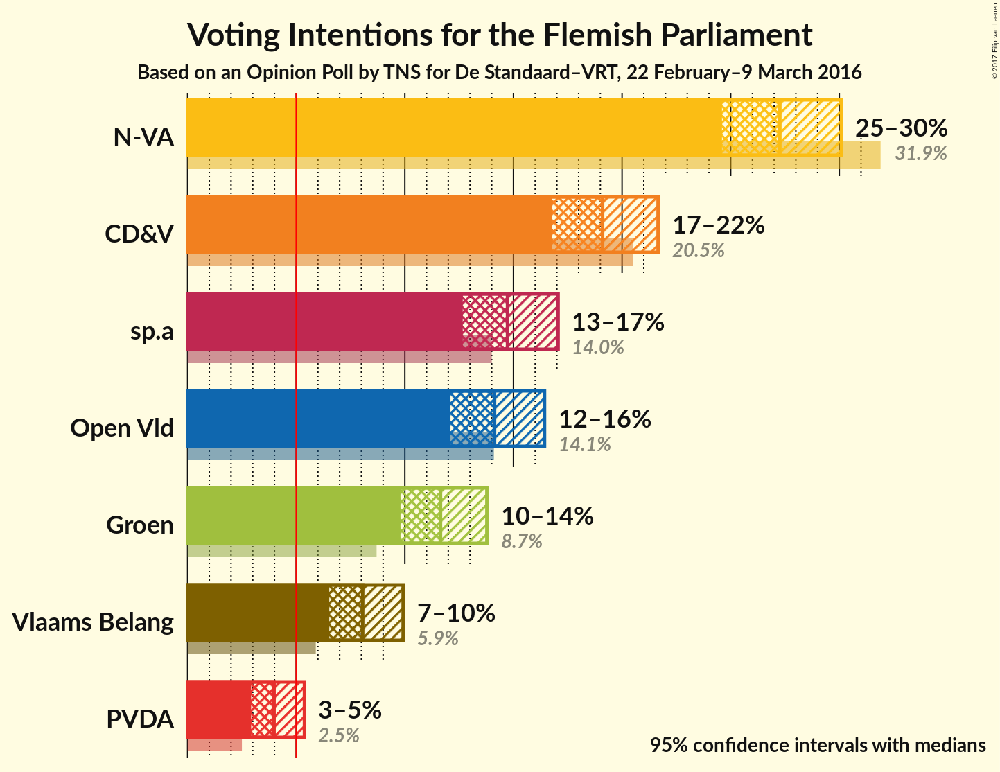
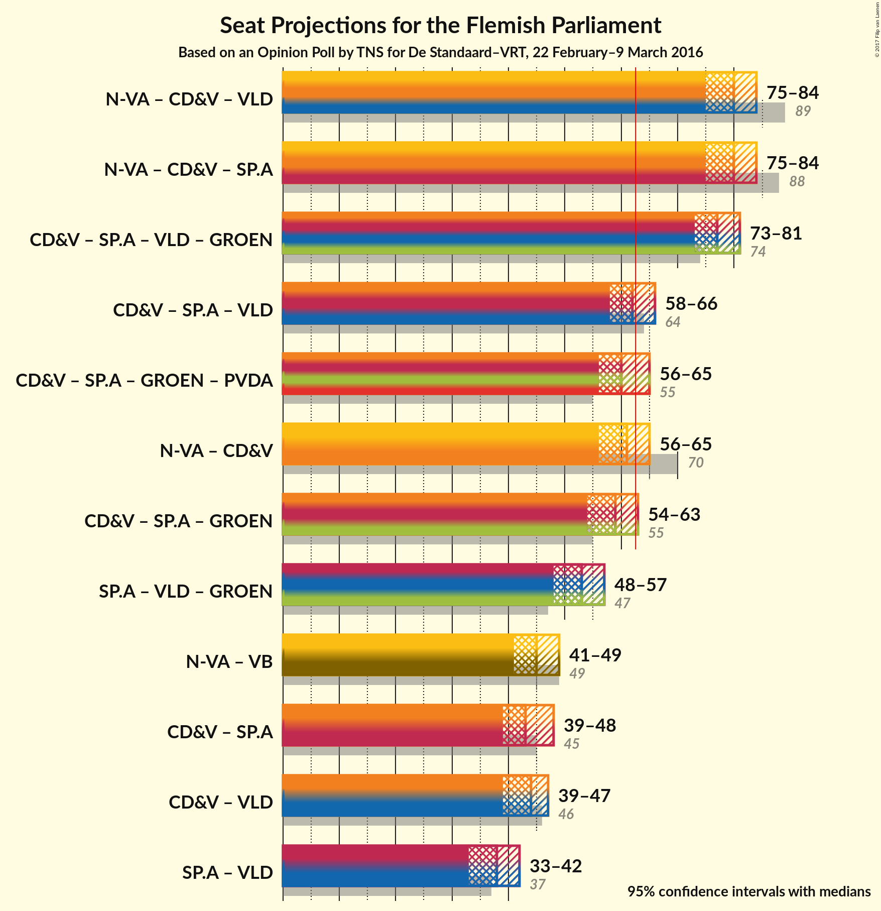

# Opinion Poll by TNS for De Standaard–VRT, 22 February–9 March 2016

<a href="#voting-intentions">Voting Intentions</a> | <a href="#seats">Seats</a> | <a href="#coalitions">Coalitions</a> | <a href="#technical-information">Technical Information</a>

## Voting Intentions

### Confidence Intervals

| Party | Last Result | Poll Result | 80% Confidence Interval | 90% Confidence Interval | 95% Confidence Interval | 99% Confidence Interval |
|:-----:|:-----------:|:-----------:|:-----------------------:|:-----------------------:|:-----------------------:|:-----------------------:|
| N-VA | 31.9% | 27.6% | 25.5–29.1% |25.0–29.6% |24.6–30.1% |23.8–31.0% |
| CD&V | 20.5% | 19.3% | 17.6–20.8% |17.2–21.2% |16.8–21.7% |16.1–22.5% |
| sp.a | 14.0% | 14.9% | 13.4–16.2% |13.0–16.7% |12.7–17.1% |12.0–17.8% |
| Open Vld | 14.1% | 14.3% | 12.8–15.6% |12.4–16.0% |12.1–16.4% |11.5–17.2% |
| Groen | 8.7% | 11.8% | 10.4–13.0% |10.1–13.4% |9.8–13.8% |9.3–14.5% |
| Vlaams Belang | 5.9% | 8.1% | 7.1–9.3% |6.8–9.6% |6.5–9.9% |6.1–10.5% |
| PVDA | 2.5% | 4.0% | 3.3–4.9% |3.1–5.2% |2.9–5.4% |2.6–5.9% |

*Note:* The poll result column reflects the actual value used in the calculations. Published results may vary slightly, and in addition be rounded to fewer digits.

## Seats

### Confidence Intervals

| Party | Last Result | Median | 80% Confidence Interval | 90% Confidence Interval | 95% Confidence Interval | 99% Confidence Interval |
|:-----:|:-----------:|:------:|:-----------------------:|:-----------------------:|:-----------------------:|:-----------------------:|
| <a href="#n-va">N-VA</a> | 43 | 37 | 34–39 |33–39 |33–40 |31–42 |
| <a href="#cd&v">CD&V</a> | 27 | 25 | 22–27 |21–27 |20–28 |20–30 |
| <a href="#sp.a">sp.a</a> | 18 | 19 | 17–20 |16–22 |15–23 |14–24 |
| <a href="#open-vld">Open Vld</a> | 19 | 19 | 17–20 |16–21 |15–22 |13–23 |
| <a href="#groen">Groen</a> | 10 | 15 | 14–17 |14–17 |13–17 |11–19 |
| <a href="#vlaams-belang">Vlaams Belang</a> | 6 | 8 | 8–10 |6–11 |6–11 |6–12 |
| <a href="#pvda">PVDA</a> | 0 | 2 | 0–2 |0–3 |0–3 |0–5 |

### N-VA

| Number of Seats | Probability | Accumulated |
|:---------------:|:-----------:|:-----------:|
| 30 | 0.3% | 100% |
| 31 | 0.5% | 99.7% |
| 32 | 1.4% | 99.2% |
| 33 | 4% | 98% |
| 34 | 13% | 94% |
| 35 | 13% | 81% |
| 36 | 14% | 68% |
| 37 | 33% | 54% |
| 38 | 11% | 21% |
| 39 | 6% | 10% |
| 40 | 2% | 4% |
| 41 | 1.3% | 2% |
| 42 | 0.6% | 0.8% |
| 43 | 0.2% | 0.2% |
| 44 | 0% | 0% |

### CD&V

| Number of Seats | Probability | Accumulated |
|:---------------:|:-----------:|:-----------:|
| 19 | 0.1% | 100% |
| 20 | 3% | 99.9% |
| 21 | 5% | 97% |
| 22 | 9% | 91% |
| 23 | 11% | 82% |
| 24 | 20% | 72% |
| 25 | 18% | 52% |
| 26 | 18% | 34% |
| 27 | 13% | 16% |
| 28 | 2% | 4% |
| 29 | 0.8% | 1.4% |
| 30 | 0.4% | 0.6% |
| 31 | 0.2% | 0.2% |
| 32 | 0% | 0% |

### sp.a

| Number of Seats | Probability | Accumulated |
|:---------------:|:-----------:|:-----------:|
| 14 | 0.6% | 100% |
| 15 | 2% | 99.4% |
| 16 | 3% | 97% |
| 17 | 6% | 94% |
| 18 | 10% | 88% |
| 19 | 59% | 78% |
| 20 | 10% | 19% |
| 21 | 3% | 9% |
| 22 | 2% | 5% |
| 23 | 2% | 3% |
| 24 | 0.8% | 1.0% |
| 25 | 0.2% | 0.2% |
| 26 | 0% | 0% |

### Open Vld

| Number of Seats | Probability | Accumulated |
|:---------------:|:-----------:|:-----------:|
| 13 | 0.9% | 100% |
| 14 | 1.4% | 99.1% |
| 15 | 1.5% | 98% |
| 16 | 3% | 96% |
| 17 | 8% | 93% |
| 18 | 19% | 86% |
| 19 | 38% | 67% |
| 20 | 20% | 28% |
| 21 | 5% | 9% |
| 22 | 3% | 4% |
| 23 | 2% | 2% |
| 24 | 0.3% | 0.3% |
| 25 | 0% | 0% |

### Groen

| Number of Seats | Probability | Accumulated |
|:---------------:|:-----------:|:-----------:|
| 10 | 0.5% | 100% |
| 11 | 0.3% | 99.5% |
| 12 | 0.9% | 99.2% |
| 13 | 2% | 98% |
| 14 | 30% | 96% |
| 15 | 34% | 66% |
| 16 | 9% | 32% |
| 17 | 21% | 24% |
| 18 | 2% | 2% |
| 19 | 0.5% | 0.9% |
| 20 | 0.2% | 0.3% |
| 21 | 0.1% | 0.1% |
| 22 | 0% | 0.1% |
| 23 | 0% | 0% |

### Vlaams Belang

| Number of Seats | Probability | Accumulated |
|:---------------:|:-----------:|:-----------:|
| 4 | 0.2% | 100% |
| 5 | 0.1% | 99.8% |
| 6 | 5% | 99.6% |
| 7 | 3% | 94% |
| 8 | 72% | 92% |
| 9 | 5% | 20% |
| 10 | 5% | 14% |
| 11 | 8% | 9% |
| 12 | 0.9% | 1.1% |
| 13 | 0.2% | 0.2% |
| 14 | 0% | 0% |

### PVDA

| Number of Seats | Probability | Accumulated |
|:---------------:|:-----------:|:-----------:|
| 0 | 11% | 100% |
| 1 | 12% | 89% |
| 2 | 70% | 77% |
| 3 | 4% | 6% |
| 4 | 0.7% | 2% |
| 5 | 1.4% | 1.4% |
| 6 | 0% | 0% |

## Coalitions

### Confidence Intervals

| Coalition | Last Result | Median | 80% Confidence Interval | 90% Confidence Interval | 95% Confidence Interval | 99% Confidence Interval |
|:---------:|:-----------:|:------:|:-----------------------:|:-----------------------:|:-----------------------:|:-----------------------:|
| N-VA – CD&V – Open Vld | 89 | 80 | 77–82 | 76–83 | 75–84 | 73–85 |
| N-VA – CD&V – sp.a | 88 | 80 | 77–82 | 76–83 | 75–84 | 74–85 |
| CD&V – sp.a – Open Vld – Groen | 74 | 77 | 75–80 | 74–81 | 73–81 | 72–83 |
| CD&V – sp.a – Open Vld | 64 | 62 | 60–65 | 59–66 | 58–66 | 56–68 |
| CD&V – sp.a – Groen – PVDA | 55 | 60 | 58–63 | 57–64 | 56–65 | 54–67 |
| N-VA – CD&V | 70 | 61 | 58–64 | 57–64 | 56–65 | 55–67 |
| CD&V – sp.a – Groen | 55 | 59 | 56–61 | 55–62 | 54–63 | 53–65 |
| sp.a – Open Vld – Groen | 47 | 53 | 50–56 | 49–57 | 48–57 | 47–59 |
| N-VA – Vlaams Belang | 49 | 45 | 42–47 | 42–48 | 41–49 | 39–50 |
| CD&V – sp.a | 45 | 43 | 41–46 | 40–47 | 39–48 | 38–49 |
| CD&V – Open Vld | 46 | 44 | 41–46 | 40–46 | 39–47 | 37–49 |
| sp.a – Open Vld | 37 | 38 | 35–40 | 34–41 | 33–42 | 32–43 |

### N-VA – CD&V – Open Vld

| Number of Seats | Probability | Accumulated |
|:---------------:|:-----------:|:-----------:|
| 71 | 0% | 100% |
| 72 | 0.1% | 99.9% |
| 73 | 0.4% | 99.8% |
| 74 | 0.8% | 99.4% |
| 75 | 2% | 98.6% |
| 76 | 4% | 97% |
| 77 | 7% | 92% |
| 78 | 13% | 85% |
| 79 | 15% | 72% |
| 80 | 22% | 57% |
| 81 | 18% | 36% |
| 82 | 9% | 18% |
| 83 | 5% | 8% |
| 84 | 2% | 3% |
| 85 | 0.7% | 1.1% |
| 86 | 0.3% | 0.4% |
| 87 | 0.1% | 0.1% |
| 88 | 0% | 0% |

### N-VA – CD&V – sp.a

| Number of Seats | Probability | Accumulated |
|:---------------:|:-----------:|:-----------:|
| 72 | 0.1% | 100% |
| 73 | 0.3% | 99.9% |
| 74 | 0.6% | 99.7% |
| 75 | 2% | 99.1% |
| 76 | 4% | 97% |
| 77 | 8% | 93% |
| 78 | 13% | 85% |
| 79 | 14% | 73% |
| 80 | 21% | 59% |
| 81 | 18% | 38% |
| 82 | 11% | 19% |
| 83 | 5% | 9% |
| 84 | 2% | 4% |
| 85 | 1.1% | 2% |
| 86 | 0.3% | 0.5% |
| 87 | 0.1% | 0.1% |
| 88 | 0% | 0% |

### CD&V – sp.a – Open Vld – Groen

| Number of Seats | Probability | Accumulated |
|:---------------:|:-----------:|:-----------:|
| 70 | 0.1% | 100% |
| 71 | 0.2% | 99.9% |
| 72 | 1.0% | 99.6% |
| 73 | 2% | 98.6% |
| 74 | 4% | 96% |
| 75 | 8% | 92% |
| 76 | 14% | 84% |
| 77 | 23% | 70% |
| 78 | 15% | 47% |
| 79 | 16% | 32% |
| 80 | 10% | 16% |
| 81 | 4% | 6% |
| 82 | 1.3% | 2% |
| 83 | 0.5% | 0.8% |
| 84 | 0.2% | 0.3% |
| 85 | 0% | 0.1% |
| 86 | 0% | 0% |

### CD&V – sp.a – Open Vld

| Number of Seats | Probability | Accumulated |
|:---------------:|:-----------:|:-----------:|
| 54 | 0.1% | 100% |
| 55 | 0.2% | 99.9% |
| 56 | 0.4% | 99.8% |
| 57 | 0.9% | 99.4% |
| 58 | 3% | 98% |
| 59 | 5% | 95% |
| 60 | 10% | 90% |
| 61 | 12% | 81% |
| 62 | 22% | 68% |
| 63 | 19% | 46% |
| 64 | 15% | 27% |
| 65 | 8% | 13% |
| 66 | 3% | 5% |
| 67 | 1.4% | 2% |
| 68 | 0.4% | 0.8% |
| 69 | 0.2% | 0.3% |
| 70 | 0.1% | 0.1% |
| 71 | 0% | 0% |

### CD&V – sp.a – Groen – PVDA

| Number of Seats | Probability | Accumulated |
|:---------------:|:-----------:|:-----------:|
| 53 | 0.1% | 100% |
| 54 | 0.4% | 99.8% |
| 55 | 1.4% | 99.4% |
| 56 | 3% | 98% |
| 57 | 5% | 95% |
| 58 | 8% | 90% |
| 59 | 16% | 82% |
| 60 | 18% | 66% |
| 61 | 18% | 48% |
| 62 | 14% | 30% |
| 63 | 9% | 16% |
| 64 | 4% | 7% |
| 65 | 2% | 3% |
| 66 | 0.7% | 1.3% |
| 67 | 0.4% | 0.6% |
| 68 | 0.2% | 0.2% |
| 69 | 0% | 0% |

### N-VA – CD&V

| Number of Seats | Probability | Accumulated |
|:---------------:|:-----------:|:-----------:|
| 53 | 0.1% | 100% |
| 54 | 0.2% | 99.9% |
| 55 | 0.8% | 99.7% |
| 56 | 2% | 98.8% |
| 57 | 4% | 97% |
| 58 | 7% | 92% |
| 59 | 13% | 85% |
| 60 | 13% | 72% |
| 61 | 20% | 59% |
| 62 | 15% | 38% |
| 63 | 12% | 23% |
| 64 | 7% | 11% |
| 65 | 3% | 4% |
| 66 | 1.1% | 2% |
| 67 | 0.5% | 0.8% |
| 68 | 0.2% | 0.2% |
| 69 | 0% | 0.1% |
| 70 | 0% | 0% |

### CD&V – sp.a – Groen

| Number of Seats | Probability | Accumulated |
|:---------------:|:-----------:|:-----------:|
| 51 | 0.1% | 100% |
| 52 | 0.2% | 99.9% |
| 53 | 1.3% | 99.6% |
| 54 | 2% | 98% |
| 55 | 5% | 96% |
| 56 | 7% | 92% |
| 57 | 14% | 84% |
| 58 | 17% | 70% |
| 59 | 19% | 53% |
| 60 | 15% | 34% |
| 61 | 10% | 19% |
| 62 | 5% | 9% |
| 63 | 3% | 4% |
| 64 | 0.8% | 2% |
| 65 | 0.5% | 0.7% |
| 66 | 0.2% | 0.3% |
| 67 | 0% | 0.1% |
| 68 | 0% | 0% |

### sp.a – Open Vld – Groen

| Number of Seats | Probability | Accumulated |
|:---------------:|:-----------:|:-----------:|
| 45 | 0.1% | 100% |
| 46 | 0.4% | 99.9% |
| 47 | 0.9% | 99.5% |
| 48 | 2% | 98.7% |
| 49 | 3% | 97% |
| 50 | 6% | 94% |
| 51 | 12% | 88% |
| 52 | 14% | 76% |
| 53 | 25% | 62% |
| 54 | 12% | 36% |
| 55 | 13% | 24% |
| 56 | 6% | 11% |
| 57 | 3% | 5% |
| 58 | 1.4% | 2% |
| 59 | 0.6% | 0.9% |
| 60 | 0.2% | 0.3% |
| 61 | 0% | 0% |

### N-VA – Vlaams Belang

| Number of Seats | Probability | Accumulated |
|:---------------:|:-----------:|:-----------:|
| 38 | 0.2% | 100% |
| 39 | 0.4% | 99.8% |
| 40 | 1.2% | 99.3% |
| 41 | 3% | 98% |
| 42 | 11% | 96% |
| 43 | 14% | 85% |
| 44 | 13% | 71% |
| 45 | 28% | 58% |
| 46 | 15% | 30% |
| 47 | 8% | 15% |
| 48 | 4% | 7% |
| 49 | 2% | 3% |
| 50 | 0.8% | 1.2% |
| 51 | 0.3% | 0.4% |
| 52 | 0.1% | 0.1% |
| 53 | 0% | 0% |

### CD&V – sp.a

| Number of Seats | Probability | Accumulated |
|:---------------:|:-----------:|:-----------:|
| 36 | 0.1% | 100% |
| 37 | 0.3% | 99.9% |
| 38 | 1.0% | 99.6% |
| 39 | 3% | 98.6% |
| 40 | 5% | 96% |
| 41 | 9% | 91% |
| 42 | 12% | 82% |
| 43 | 21% | 70% |
| 44 | 17% | 49% |
| 45 | 15% | 32% |
| 46 | 9% | 16% |
| 47 | 4% | 7% |
| 48 | 2% | 3% |
| 49 | 0.8% | 1.2% |
| 50 | 0.3% | 0.4% |
| 51 | 0.1% | 0.1% |
| 52 | 0% | 0% |

### CD&V – Open Vld

| Number of Seats | Probability | Accumulated |
|:---------------:|:-----------:|:-----------:|
| 35 | 0.1% | 100% |
| 36 | 0.2% | 99.9% |
| 37 | 0.3% | 99.7% |
| 38 | 0.8% | 99.4% |
| 39 | 3% | 98.6% |
| 40 | 5% | 95% |
| 41 | 9% | 90% |
| 42 | 13% | 81% |
| 43 | 17% | 68% |
| 44 | 21% | 51% |
| 45 | 18% | 30% |
| 46 | 8% | 12% |
| 47 | 3% | 5% |
| 48 | 1.1% | 2% |
| 49 | 0.5% | 0.7% |
| 50 | 0.2% | 0.2% |
| 51 | 0% | 0.1% |
| 52 | 0% | 0% |

### sp.a – Open Vld

| Number of Seats | Probability | Accumulated |
|:---------------:|:-----------:|:-----------:|
| 30 | 0.1% | 100% |
| 31 | 0.2% | 99.9% |
| 32 | 0.8% | 99.7% |
| 33 | 2% | 98.8% |
| 34 | 4% | 97% |
| 35 | 5% | 93% |
| 36 | 8% | 88% |
| 37 | 18% | 80% |
| 38 | 32% | 62% |
| 39 | 15% | 30% |
| 40 | 7% | 15% |
| 41 | 4% | 8% |
| 42 | 2% | 4% |
| 43 | 1.2% | 2% |
| 44 | 0.3% | 0.3% |
| 45 | 0.1% | 0.1% |
| 46 | 0% | 0% |

## Technical Information

### Opinion Poll

+ **Pollster:** TNS
+ **Media:** De Standaard–VRT
+ **Fieldwork period:** 22 February–9 March 2016

### Calculations

+ **Sample size:** 994
+ **Simulations done:** 4,194,304
+ **Error estimate:** 0.75%

