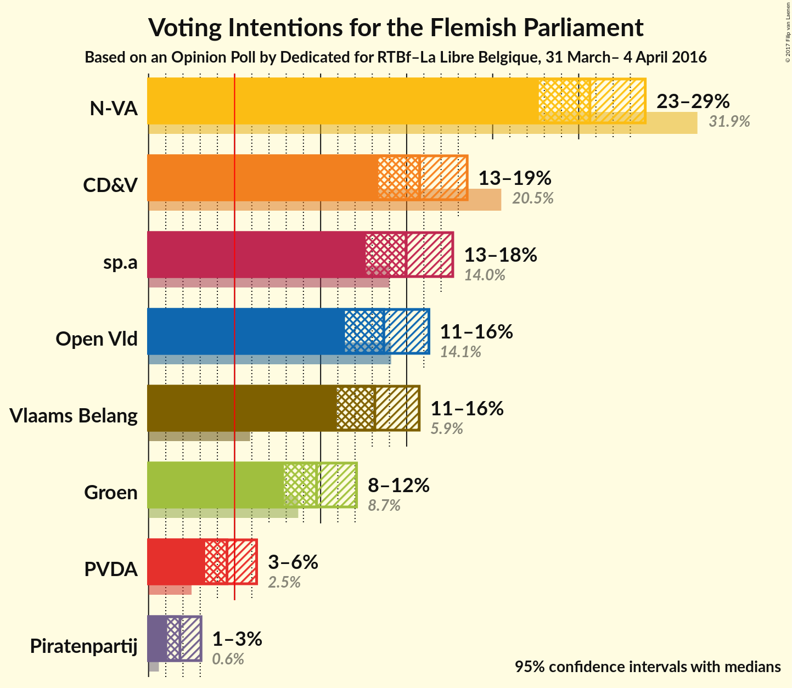
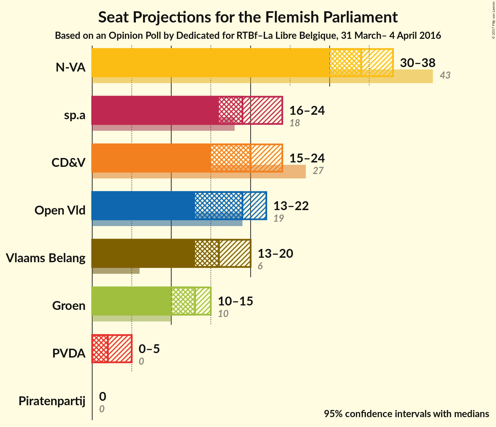
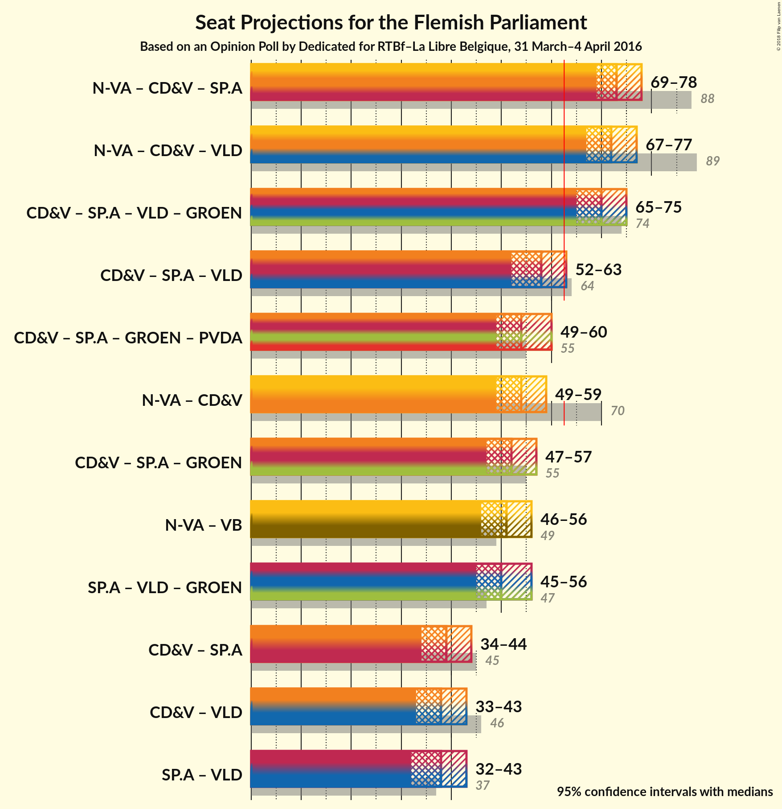

# Opinion Poll by Dedicated for RTBf–La Libre Belgique, 31 March– 4 April 2016

<a href="#voting-intentions">Voting Intentions</a> | <a href="#seats">Seats</a> | <a href="#coalitions">Coalitions</a> | <a href="#technical-information">Technical Information</a>

## Voting Intentions

### Confidence Intervals

| Party | Last Result | Poll Result | 80% Confidence Interval | 90% Confidence Interval | 95% Confidence Interval | 99% Confidence Interval |
|:-----:|:-----------:|:-----------:|:-----------------------:|:-----------------------:|:-----------------------:|:-----------------------:|
| N-VA | 31.9% | 25.8% | 23.7–27.8% |23.2–28.3% |22.7–28.9% |21.8–29.9% |
| CD&V | 20.5% | 15.9% | 14.2–17.6% |13.7–18.1% |13.4–18.5% |12.6–19.4% |
| sp.a | 14.0% | 15.1% | 13.4–16.7% |13.0–17.2% |12.6–17.7% |11.9–18.5% |
| Open Vld | 14.1% | 13.8% | 12.2–15.4% |11.8–15.9% |11.4–16.3% |10.7–17.1% |
| Vlaams Belang | 5.9% | 13.2% | 11.7–14.8% |11.3–15.3% |10.9–15.7% |10.3–16.6% |
| Groen | 8.7% | 9.8% | 8.5–11.3% |8.2–11.7% |7.9–12.1% |7.3–12.8% |
| PVDA | 2.5% | 4.6% | 3.7–5.7% |3.5–6.0% |3.3–6.3% |2.9–6.9% |
| Piratenpartij | 0.0% | 1.8% | 1.3–2.6% |1.2–2.8% |1.1–3.0% |0.9–3.5% |

*Note:* The poll result column reflects the actual value used in the calculations. Published results may vary slightly, and in addition be rounded to fewer digits.

## Seats

### Confidence Intervals

| Party | Last Result | 80% Confidence Interval | 90% Confidence Interval | 95% Confidence Interval | 99% Confidence Interval |
|:-----:|:-----------:|:-----------------------:|:-----------------------:|:-----------------------:|:-----------------------:|
| <a href="#n-va">N-VA</a> | 43 | 31–37 |30–38 |30–38 |29–40 |
| <a href="#cd&v">CD&V</a> | 27 | 18–22 |16–22 |15–24 |15–25 |
| <a href="#sp.a">sp.a</a> | 18 | 18–22 |16–23 |16–24 |14–25 |
| <a href="#open-vld">Open Vld</a> | 19 | 16–20 |14–21 |13–22 |13–23 |
| <a href="#vlaams-belang">Vlaams Belang</a> | 6 | 14–18 |13–19 |13–20 |12–22 |
| <a href="#groen">Groen</a> | 10 | 10–14 |10–15 |10–15 |8–17 |
| <a href="#pvda">PVDA</a> | 0 | 2–5 |1–5 |0–5 |0–5 |
| <a href="#piratenpartij">Piratenpartij</a> | 0 | 0 |0 |0 |0 |

### N-VA

| Number of Seats | Probability | Accumulated |
|:---------------:|:-----------:|:-----------:|
| 27 | 0.1% | 100% |
| 28 | 0.1% | 99.9% |
| 29 | 0.5% | 99.8% |
| 30 | 5% | 99.2% |
| 31 | 6% | 94% |
| 32 | 5% | 88% |
| 33 | 21% | 83% |
| 34 | 13% | 62% |
| 35 | 21% | 49% |
| 36 | 10% | 28% |
| 37 | 10% | 17% |
| 38 | 6% | 8% |
| 39 | 1.4% | 2% |
| 40 | 0.5% | 0.8% |
| 41 | 0.2% | 0.3% |
| 42 | 0.1% | 0.1% |
| 43 | 0% | 0% |

### CD&V

| Number of Seats | Probability | Accumulated |
|:---------------:|:-----------:|:-----------:|
| 14 | 0.1% | 100% |
| 15 | 3% | 99.9% |
| 16 | 4% | 97% |
| 17 | 2% | 92% |
| 18 | 7% | 90% |
| 19 | 11% | 83% |
| 20 | 53% | 72% |
| 21 | 7% | 19% |
| 22 | 8% | 11% |
| 23 | 1.2% | 4% |
| 24 | 1.2% | 3% |
| 25 | 1.2% | 1.5% |
| 26 | 0.1% | 0.3% |
| 27 | 0.2% | 0.2% |
| 28 | 0% | 0% |

### sp.a

| Number of Seats | Probability | Accumulated |
|:---------------:|:-----------:|:-----------:|
| 14 | 0.9% | 100% |
| 15 | 1.1% | 99.1% |
| 16 | 4% | 98% |
| 17 | 4% | 94% |
| 18 | 5% | 91% |
| 19 | 59% | 86% |
| 20 | 9% | 26% |
| 21 | 4% | 17% |
| 22 | 5% | 13% |
| 23 | 3% | 8% |
| 24 | 4% | 4% |
| 25 | 0.3% | 0.5% |
| 26 | 0.1% | 0.2% |
| 27 | 0.1% | 0.1% |
| 28 | 0% | 0% |

### Open Vld

| Number of Seats | Probability | Accumulated |
|:---------------:|:-----------:|:-----------:|
| 12 | 0.3% | 100% |
| 13 | 4% | 99.7% |
| 14 | 2% | 96% |
| 15 | 2% | 94% |
| 16 | 3% | 92% |
| 17 | 22% | 89% |
| 18 | 14% | 67% |
| 19 | 32% | 52% |
| 20 | 15% | 20% |
| 21 | 2% | 6% |
| 22 | 1.2% | 3% |
| 23 | 2% | 2% |
| 24 | 0.3% | 0.4% |
| 25 | 0.1% | 0.1% |
| 26 | 0% | 0% |

### Vlaams Belang

| Number of Seats | Probability | Accumulated |
|:---------------:|:-----------:|:-----------:|
| 11 | 0.4% | 100% |
| 12 | 1.0% | 99.6% |
| 13 | 6% | 98.6% |
| 14 | 4% | 93% |
| 15 | 7% | 89% |
| 16 | 37% | 83% |
| 17 | 20% | 46% |
| 18 | 18% | 26% |
| 19 | 4% | 8% |
| 20 | 2% | 3% |
| 21 | 0.7% | 1.2% |
| 22 | 0.4% | 0.5% |
| 23 | 0.1% | 0.1% |
| 24 | 0% | 0% |

### Groen

| Number of Seats | Probability | Accumulated |
|:---------------:|:-----------:|:-----------:|
| 7 | 0.3% | 100% |
| 8 | 0.5% | 99.7% |
| 9 | 0.2% | 99.2% |
| 10 | 20% | 99.0% |
| 11 | 5% | 79% |
| 12 | 15% | 74% |
| 13 | 13% | 59% |
| 14 | 37% | 46% |
| 15 | 7% | 9% |
| 16 | 0.8% | 2% |
| 17 | 1.1% | 1.3% |
| 18 | 0.2% | 0.2% |
| 19 | 0% | 0% |

### PVDA

| Number of Seats | Probability | Accumulated |
|:---------------:|:-----------:|:-----------:|
| 0 | 3% | 100% |
| 1 | 3% | 97% |
| 2 | 62% | 94% |
| 3 | 12% | 32% |
| 4 | 6% | 20% |
| 5 | 13% | 13% |
| 6 | 0.1% | 0.3% |
| 7 | 0.1% | 0.2% |
| 8 | 0.1% | 0.1% |
| 9 | 0% | 0% |

### Piratenpartij

| Number of Seats | Probability | Accumulated |
|:---------------:|:-----------:|:-----------:|
| 0 | 99.9% | 100% |
| 1 | 0.1% | 0.1% |
| 2 | 0% | 0% |

## Coalitions

### Confidence Intervals

| Coalition | Last Result | 80% Confidence Interval | 90% Confidence Interval | 95% Confidence Interval | 99% Confidence Interval |
|:---------:|:-----------:|:-----------------------:|:-----------------------:|:-----------------------:|:-----------------------:|
| N-VA – CD&V – sp.a | 88 | 71–76 | 70–77 | 69–78 | 67–81 |
| N-VA – CD&V – Open Vld | 89 | 69–76 | 68–77 | 67–77 | 65–79 |
| CD&V – sp.a – Open Vld – Groen | 74 | 67–73 | 65–75 | 65–76 | 63–77 |
| CD&V – sp.a – Open Vld | 64 | 54–61 | 52–61 | 52–62 | 50–64 |
| CD&V – sp.a – Groen – PVDA | 55 | 51–58 | 49–59 | 49–60 | 47–61 |
| N-VA – CD&V | 70 | 51–57 | 50–58 | 49–59 | 48–61 |
| CD&V – sp.a – Groen | 55 | 49–55 | 47–56 | 47–57 | 45–58 |
| sp.a – Open Vld – Groen | 47 | 47–53 | 46–55 | 45–56 | 43–57 |
| N-VA – Vlaams Belang | 49 | 48–54 | 47–55 | 46–55 | 43–57 |
| CD&V – sp.a | 45 | 36–42 | 35–43 | 34–44 | 33–46 |
| CD&V – Open Vld | 46 | 35–41 | 33–42 | 33–43 | 31–45 |
| sp.a – Open Vld | 37 | 35–41 | 33–42 | 32–43 | 31–44 |

## Technical Information

### Opinion Poll

+ **Pollster:** Dedicated
+ **Media:** RTBf–La Libre Belgique
+ **Fieldwork period:** 31 March– 4 April 2016

### Calculations

+ **Sample size:** 763
+ **Simulations done:** 1,048,576
+ **Error estimate:** 1.25%

