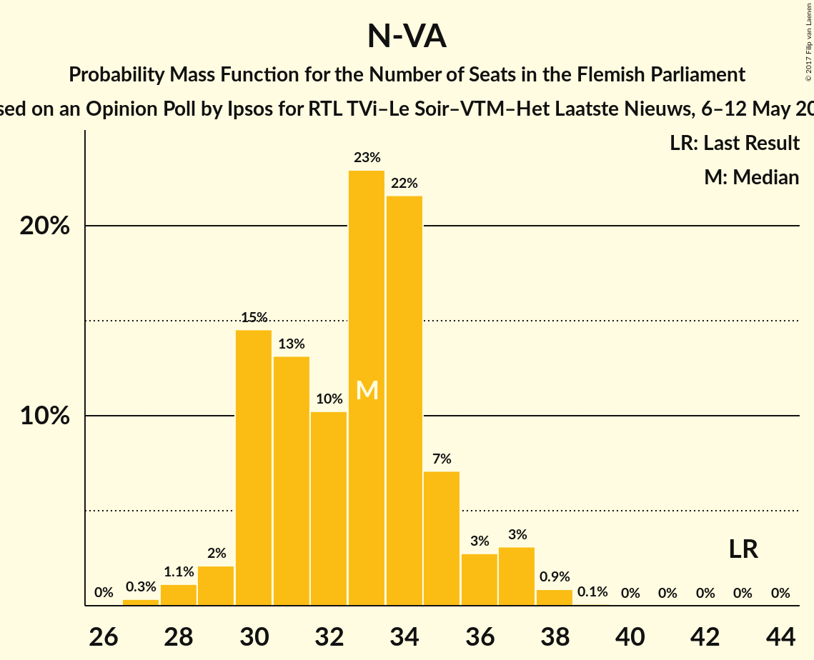
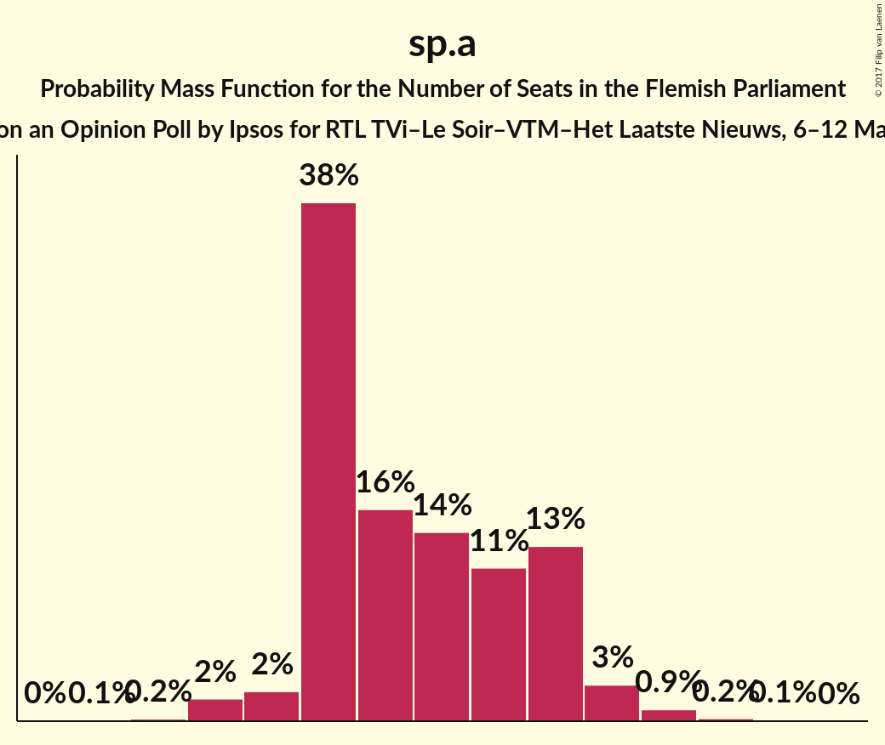
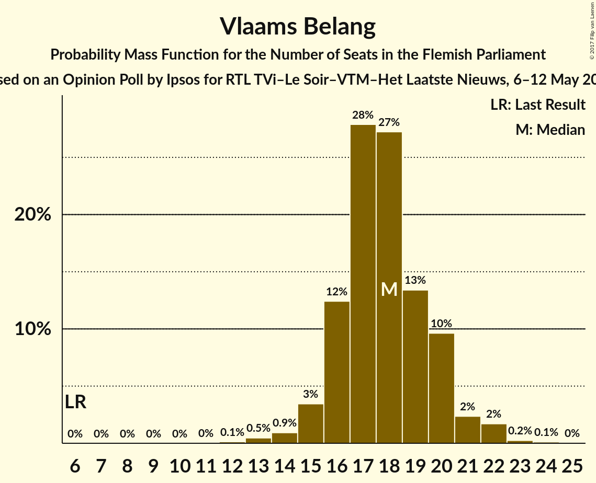
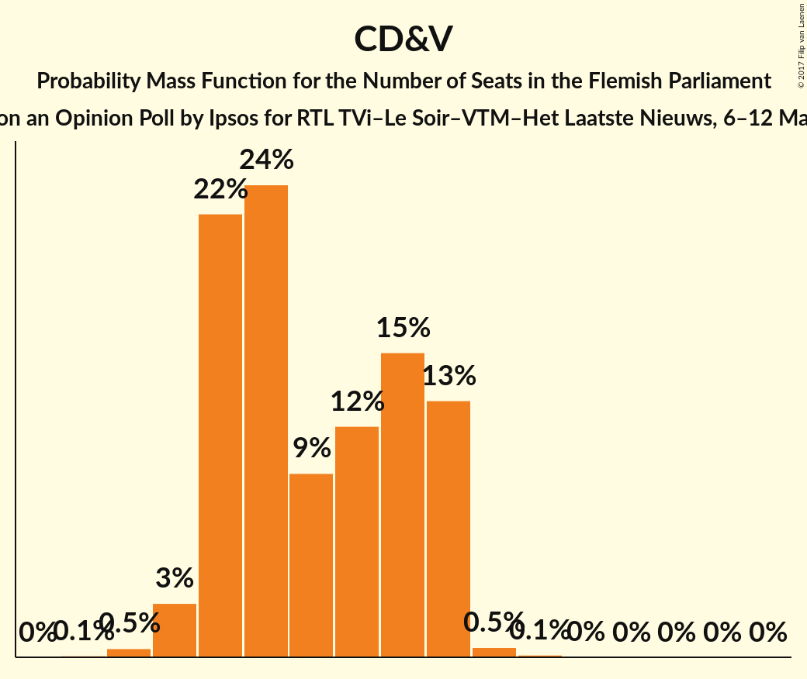
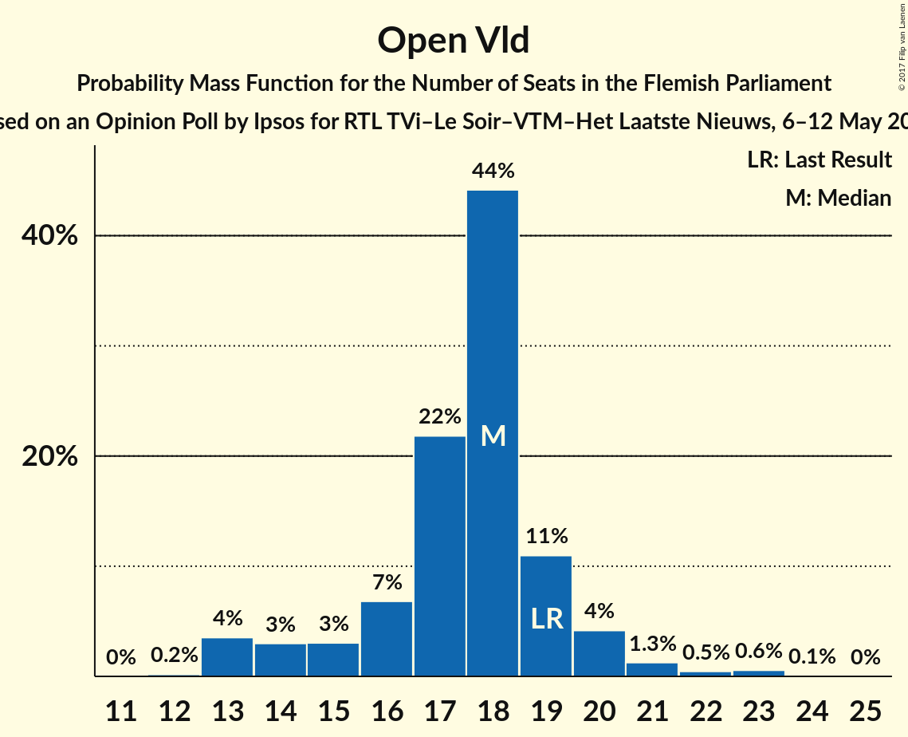
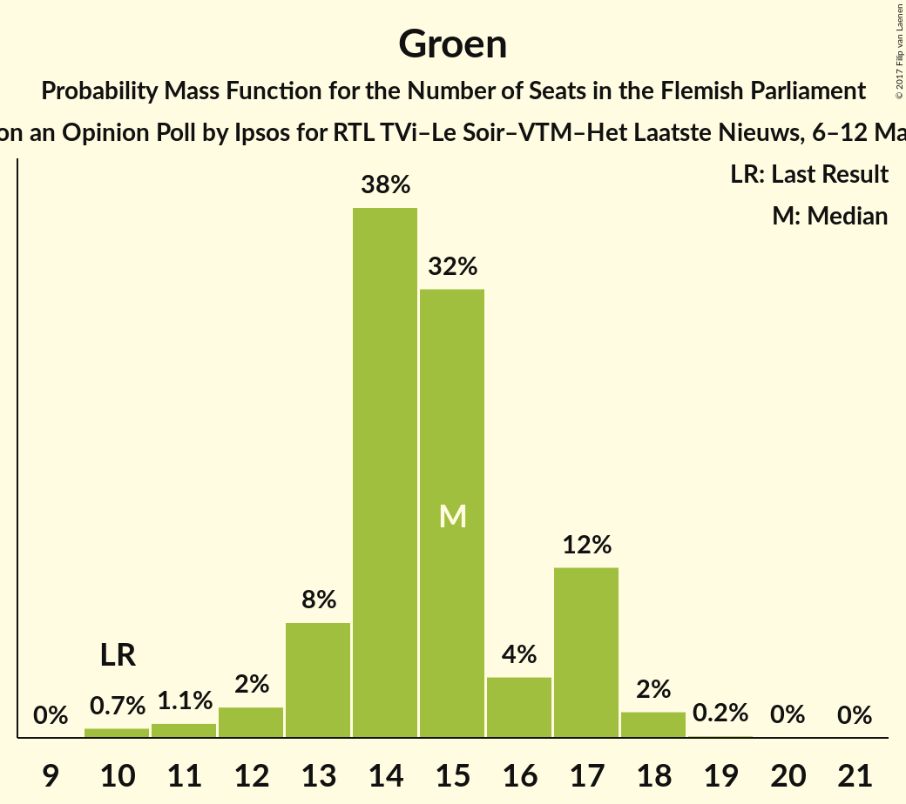
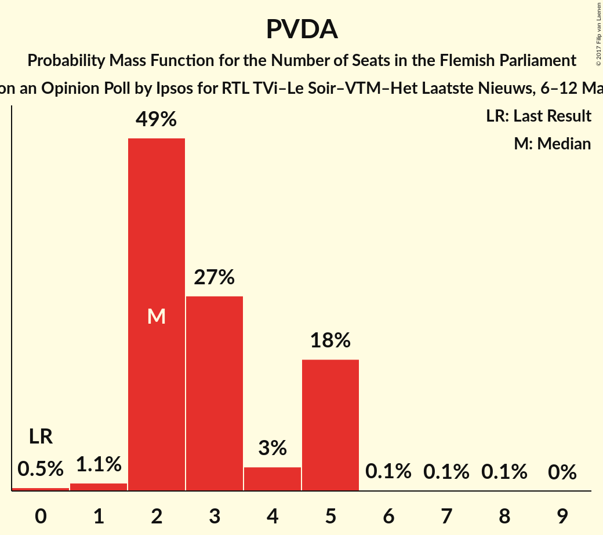

# Opinion Poll by Ipsos for RTL TVi–Le Soir–VTM–Het Laatste Nieuws, 6–12 May 2016

<a href="#voting-intentions">Voting Intentions</a> | <a href="#seats">Seats</a> | <a href="#coalitions">Coalitions</a> | <a href="#technical-information">Technical Information</a>

## Voting Intentions

### Confidence Intervals

| Party | Last Result | Poll Result | 80% Confidence Interval | 90% Confidence Interval | 95% Confidence Interval | 99% Confidence Interval |
|:-----:|:-----------:|:-----------:|:-----------------------:|:-----------------------:|:-----------------------:|:-----------------------:|
| N-VA | 31.9% | 24.2% | 22.6–26.0% |22.1–26.5% |21.7–26.9% |20.9–27.8% |
| sp.a | 14.0% | 15.6% | 14.2–17.1% |13.9–17.6% |13.5–17.9% |12.9–18.7% |
| Vlaams Belang | 5.9% | 13.9% | 12.6–15.3% |12.2–15.7% |11.9–16.1% |11.3–16.8% |
| CD&V | 20.5% | 13.8% | 12.5–15.2% |12.1–15.7% |11.8–16.0% |11.2–16.7% |
| Open Vld | 14.1% | 13.2% | 11.9–14.6% |11.6–15.0% |11.3–15.4% |10.7–16.1% |
| Groen | 8.7% | 11.1% | 9.9–12.4% |9.6–12.8% |9.3–13.2% |8.8–13.8% |
| PVDA | 2.5% | 4.8% | 4.0–5.7% |3.8–6.0% |3.6–6.3% |3.3–6.8% |

*Note:* The poll result column reflects the actual value used in the calculations. Published results may vary slightly, and in addition be rounded to fewer digits.

## Seats

### Confidence Intervals

| Party | Last Result | Median | 80% Confidence Interval | 90% Confidence Interval | 95% Confidence Interval | 99% Confidence Interval |
|:-----:|:-----------:|:------:|:-----------------------:|:-----------------------:|:-----------------------:|:-----------------------:|
| <a href="#n-va">N-VA</a> | 43 | 33 | 30–35 |30–36 |29–37 |28–38 |
| <a href="#sp.a">sp.a</a> | 18 | 20 | 19–23 |19–23 |18–24 |17–25 |
| <a href="#vlaams-belang">Vlaams Belang</a> | 6 | 18 | 16–20 |16–20 |15–21 |13–22 |
| <a href="#cd&v">CD&V</a> | 27 | 17 | 15–20 |15–20 |14–20 |13–21 |
| <a href="#open-vld">Open Vld</a> | 19 | 18 | 16–19 |14–20 |13–20 |13–23 |
| <a href="#groen">Groen</a> | 10 | 15 | 13–17 |13–17 |12–17 |10–18 |
| <a href="#pvda">PVDA</a> | 0 | 2 | 2–5 |2–5 |2–5 |1–5 |

### N-VA

*For a full overview of the results for this party, see the [N-VA](party-n-va.html) page.*

| Number of Seats | Probability | Accumulated | Special Marks |
|:---------------:|:-----------:|:-----------:|:-------------:|
| 26 | 0% | 100% |  |
| 27 | 0.3% | 99.9% |  |
| 28 | 1.1% | 99.6% |  |
| 29 | 2% | 98% |  |
| 30 | 15% | 96% |  |
| 31 | 13% | 82% |  |
| 32 | 10% | 69% |  |
| 33 | 23% | 58% | Median |
| 34 | 22% | 36% |  |
| 35 | 7% | 14% |  |
| 36 | 3% | 7% |  |
| 37 | 3% | 4% |  |
| 38 | 0.9% | 1.0% |  |
| 39 | 0.1% | 0.1% |  |
| 40 | 0% | 0% |  |
| 41 | 0% | 0% |  |
| 42 | 0% | 0% |  |
| 43 | 0% | 0% | Last Result |

### sp.a

*For a full overview of the results for this party, see the [sp.a](party-spa.html) page.*

| Number of Seats | Probability | Accumulated | Special Marks |
|:---------------:|:-----------:|:-----------:|:-------------:|
| 15 | 0.1% | 100% |  |
| 16 | 0.2% | 99.9% |  |
| 17 | 2% | 99.7% |  |
| 18 | 2% | 98% | Last Result |
| 19 | 38% | 96% |  |
| 20 | 16% | 58% | Median |
| 21 | 14% | 42% |  |
| 22 | 11% | 28% |  |
| 23 | 13% | 17% |  |
| 24 | 3% | 4% |  |
| 25 | 0.9% | 1.2% |  |
| 26 | 0.2% | 0.4% |  |
| 27 | 0.1% | 0.1% |  |
| 28 | 0% | 0% |  |

### Vlaams Belang

*For a full overview of the results for this party, see the [Vlaams Belang](party-vlaamsbelang.html) page.*

| Number of Seats | Probability | Accumulated | Special Marks |
|:---------------:|:-----------:|:-----------:|:-------------:|
| 6 | 0% | 100% | Last Result |
| 7 | 0% | 100% |  |
| 8 | 0% | 100% |  |
| 9 | 0% | 100% |  |
| 10 | 0% | 100% |  |
| 11 | 0% | 100% |  |
| 12 | 0.1% | 100% |  |
| 13 | 0.5% | 99.9% |  |
| 14 | 0.9% | 99.4% |  |
| 15 | 3% | 98% |  |
| 16 | 12% | 95% |  |
| 17 | 28% | 83% |  |
| 18 | 27% | 55% | Median |
| 19 | 13% | 27% |  |
| 20 | 10% | 14% |  |
| 21 | 2% | 4% |  |
| 22 | 2% | 2% |  |
| 23 | 0.2% | 0.4% |  |
| 24 | 0.1% | 0.1% |  |
| 25 | 0% | 0% |  |

### CD&V

*For a full overview of the results for this party, see the [CD&V](party-cdv.html) page.*

| Number of Seats | Probability | Accumulated | Special Marks |
|:---------------:|:-----------:|:-----------:|:-------------:|
| 12 | 0.1% | 100% |  |
| 13 | 0.5% | 99.9% |  |
| 14 | 3% | 99.5% |  |
| 15 | 22% | 97% |  |
| 16 | 24% | 74% |  |
| 17 | 9% | 50% | Median |
| 18 | 12% | 41% |  |
| 19 | 15% | 29% |  |
| 20 | 13% | 14% |  |
| 21 | 0.5% | 0.7% |  |
| 22 | 0.1% | 0.2% |  |
| 23 | 0% | 0% |  |
| 24 | 0% | 0% |  |
| 25 | 0% | 0% |  |
| 26 | 0% | 0% |  |
| 27 | 0% | 0% | Last Result |

### Open Vld

*For a full overview of the results for this party, see the [Open Vld](party-openvld.html) page.*

| Number of Seats | Probability | Accumulated | Special Marks |
|:---------------:|:-----------:|:-----------:|:-------------:|
| 12 | 0.2% | 100% |  |
| 13 | 4% | 99.8% |  |
| 14 | 3% | 96% |  |
| 15 | 3% | 93% |  |
| 16 | 7% | 90% |  |
| 17 | 22% | 83% |  |
| 18 | 44% | 62% | Median |
| 19 | 11% | 17% | Last Result |
| 20 | 4% | 6% |  |
| 21 | 1.3% | 2% |  |
| 22 | 0.5% | 1.1% |  |
| 23 | 0.6% | 0.6% |  |
| 24 | 0.1% | 0.1% |  |
| 25 | 0% | 0% |  |

### Groen

*For a full overview of the results for this party, see the [Groen](party-groen.html) page.*

| Number of Seats | Probability | Accumulated | Special Marks |
|:---------------:|:-----------:|:-----------:|:-------------:|
| 10 | 0.7% | 100% | Last Result |
| 11 | 1.1% | 99.3% |  |
| 12 | 2% | 98% |  |
| 13 | 8% | 96% |  |
| 14 | 38% | 88% |  |
| 15 | 32% | 50% | Median |
| 16 | 4% | 19% |  |
| 17 | 12% | 14% |  |
| 18 | 2% | 2% |  |
| 19 | 0.2% | 0.2% |  |
| 20 | 0% | 0.1% |  |
| 21 | 0% | 0% |  |

### PVDA

*For a full overview of the results for this party, see the [PVDA](party-pvda.html) page.*

| Number of Seats | Probability | Accumulated | Special Marks |
|:---------------:|:-----------:|:-----------:|:-------------:|
| 0 | 0.5% | 100% | Last Result |
| 1 | 1.1% | 99.5% |  |
| 2 | 49% | 98% | Median |
| 3 | 27% | 49% |  |
| 4 | 3% | 22% |  |
| 5 | 18% | 19% |  |
| 6 | 0.1% | 0.3% |  |
| 7 | 0.1% | 0.2% |  |
| 8 | 0.1% | 0.1% |  |
| 9 | 0% | 0% |  |

## Coalitions

### Confidence Intervals

| Coalition | Last Result | Median | Majority? | 80% Confidence Interval | 90% Confidence Interval | 95% Confidence Interval | 99% Confidence Interval |
|:---------:|:-----------:|:------:|:---------:|:-----------------------:|:-----------------------:|:-----------------------:|:-----------------------:|
| N-VA – sp.a – CD&V | 88 | 70 | 99.9% | 67–73 | 67–74 | 66–75 | 64–76 |
| sp.a – CD&V – Open Vld – Groen | 74 | 70 | 99.9% | 67–73 | 66–73 | 65–74 | 64–76 |
| N-VA – CD&V – Open Vld | 89 | 67 | 98% | 64–70 | 63–71 | 63–72 | 61–73 |
| sp.a – CD&V – Groen – PVDA | 55 | 55 | 0.1% | 52–58 | 51–59 | 50–60 | 49–61 |
| sp.a – CD&V – Open Vld | 64 | 55 | 0.1% | 52–58 | 51–59 | 50–60 | 49–61 |
| sp.a – CD&V – Groen | 55 | 52 | 0% | 49–55 | 48–56 | 48–57 | 46–58 |
| sp.a – Open Vld – Groen | 47 | 52 | 0% | 50–56 | 49–56 | 48–57 | 47–58 |
| N-VA – Vlaams Belang | 49 | 50 | 0% | 47–54 | 47–54 | 46–55 | 45–56 |
| N-VA – CD&V | 70 | 50 | 0% | 47–53 | 46–53 | 45–54 | 44–56 |
| sp.a – CD&V | 45 | 38 | 0% | 34–40 | 34–41 | 34–42 | 33–43 |
| sp.a – Open Vld | 37 | 38 | 0% | 35–41 | 34–42 | 33–42 | 32–44 |
| CD&V – Open Vld | 46 | 34 | 0% | 32–37 | 31–38 | 30–39 | 29–40 |

### N-VA – sp.a – CD&V

| Number of Seats | Probability | Accumulated | Special Marks |
|:---------------:|:-----------:|:-----------:|:-------------:|
| 62 | 0% | 100% |  |
| 63 | 0.2% | 99.9% | Majority |
| 64 | 0.3% | 99.7% |  |
| 65 | 1.2% | 99.4% |  |
| 66 | 3% | 98% |  |
| 67 | 6% | 95% |  |
| 68 | 14% | 89% |  |
| 69 | 15% | 75% |  |
| 70 | 17% | 60% | Median |
| 71 | 17% | 44% |  |
| 72 | 12% | 27% |  |
| 73 | 8% | 15% |  |
| 74 | 3% | 6% |  |
| 75 | 1.4% | 3% |  |
| 76 | 0.9% | 1.3% |  |
| 77 | 0.3% | 0.4% |  |
| 78 | 0.1% | 0.1% |  |
| 79 | 0% | 0% |  |
| 80 | 0% | 0% |  |
| 81 | 0% | 0% |  |
| 82 | 0% | 0% |  |
| 83 | 0% | 0% |  |
| 84 | 0% | 0% |  |
| 85 | 0% | 0% |  |
| 86 | 0% | 0% |  |
| 87 | 0% | 0% |  |
| 88 | 0% | 0% | Last Result |

### sp.a – CD&V – Open Vld – Groen

| Number of Seats | Probability | Accumulated | Special Marks |
|:---------------:|:-----------:|:-----------:|:-------------:|
| 62 | 0.1% | 100% |  |
| 63 | 0.3% | 99.9% | Majority |
| 64 | 1.1% | 99.6% |  |
| 65 | 2% | 98.5% |  |
| 66 | 5% | 97% |  |
| 67 | 10% | 92% |  |
| 68 | 12% | 81% |  |
| 69 | 14% | 70% |  |
| 70 | 18% | 55% | Median |
| 71 | 17% | 37% |  |
| 72 | 10% | 21% |  |
| 73 | 5% | 10% |  |
| 74 | 3% | 5% | Last Result |
| 75 | 1.2% | 2% |  |
| 76 | 0.4% | 0.6% |  |
| 77 | 0.1% | 0.2% |  |
| 78 | 0% | 0.1% |  |
| 79 | 0% | 0% |  |

### N-VA – CD&V – Open Vld

| Number of Seats | Probability | Accumulated | Special Marks |
|:---------------:|:-----------:|:-----------:|:-------------:|
| 59 | 0.1% | 100% |  |
| 60 | 0.2% | 99.9% |  |
| 61 | 0.5% | 99.8% |  |
| 62 | 1.2% | 99.3% |  |
| 63 | 5% | 98% | Majority |
| 64 | 7% | 93% |  |
| 65 | 11% | 86% |  |
| 66 | 11% | 75% |  |
| 67 | 18% | 64% |  |
| 68 | 17% | 46% | Median |
| 69 | 12% | 29% |  |
| 70 | 9% | 18% |  |
| 71 | 5% | 8% |  |
| 72 | 2% | 4% |  |
| 73 | 0.9% | 1.2% |  |
| 74 | 0.2% | 0.3% |  |
| 75 | 0.1% | 0.1% |  |
| 76 | 0% | 0% |  |
| 77 | 0% | 0% |  |
| 78 | 0% | 0% |  |
| 79 | 0% | 0% |  |
| 80 | 0% | 0% |  |
| 81 | 0% | 0% |  |
| 82 | 0% | 0% |  |
| 83 | 0% | 0% |  |
| 84 | 0% | 0% |  |
| 85 | 0% | 0% |  |
| 86 | 0% | 0% |  |
| 87 | 0% | 0% |  |
| 88 | 0% | 0% |  |
| 89 | 0% | 0% | Last Result |

### sp.a – CD&V – Groen – PVDA

| Number of Seats | Probability | Accumulated | Special Marks |
|:---------------:|:-----------:|:-----------:|:-------------:|
| 48 | 0.2% | 100% |  |
| 49 | 0.7% | 99.8% |  |
| 50 | 2% | 99.0% |  |
| 51 | 5% | 97% |  |
| 52 | 7% | 92% |  |
| 53 | 12% | 85% |  |
| 54 | 12% | 73% | Median |
| 55 | 18% | 61% | Last Result |
| 56 | 16% | 43% |  |
| 57 | 12% | 28% |  |
| 58 | 9% | 15% |  |
| 59 | 4% | 7% |  |
| 60 | 2% | 3% |  |
| 61 | 0.5% | 1.0% |  |
| 62 | 0.3% | 0.5% |  |
| 63 | 0.1% | 0.1% | Majority |
| 64 | 0% | 0% |  |

### sp.a – CD&V – Open Vld

| Number of Seats | Probability | Accumulated | Special Marks |
|:---------------:|:-----------:|:-----------:|:-------------:|
| 47 | 0.1% | 100% |  |
| 48 | 0.2% | 99.9% |  |
| 49 | 0.8% | 99.7% |  |
| 50 | 2% | 98.9% |  |
| 51 | 4% | 97% |  |
| 52 | 9% | 94% |  |
| 53 | 15% | 85% |  |
| 54 | 12% | 70% |  |
| 55 | 14% | 58% | Median |
| 56 | 17% | 44% |  |
| 57 | 12% | 27% |  |
| 58 | 8% | 15% |  |
| 59 | 4% | 8% |  |
| 60 | 2% | 4% |  |
| 61 | 0.9% | 1.3% |  |
| 62 | 0.3% | 0.4% |  |
| 63 | 0.1% | 0.1% | Majority |
| 64 | 0% | 0% | Last Result |

### sp.a – CD&V – Groen

| Number of Seats | Probability | Accumulated | Special Marks |
|:---------------:|:-----------:|:-----------:|:-------------:|
| 45 | 0.1% | 100% |  |
| 46 | 0.7% | 99.9% |  |
| 47 | 1.5% | 99.2% |  |
| 48 | 4% | 98% |  |
| 49 | 8% | 93% |  |
| 50 | 11% | 86% |  |
| 51 | 11% | 75% |  |
| 52 | 17% | 63% | Median |
| 53 | 18% | 46% |  |
| 54 | 14% | 28% |  |
| 55 | 7% | 15% | Last Result |
| 56 | 4% | 8% |  |
| 57 | 2% | 3% |  |
| 58 | 0.9% | 1.2% |  |
| 59 | 0.3% | 0.4% |  |
| 60 | 0.1% | 0.1% |  |
| 61 | 0% | 0% |  |

### sp.a – Open Vld – Groen

| Number of Seats | Probability | Accumulated | Special Marks |
|:---------------:|:-----------:|:-----------:|:-------------:|
| 45 | 0.1% | 100% |  |
| 46 | 0.3% | 99.9% |  |
| 47 | 0.9% | 99.6% | Last Result |
| 48 | 2% | 98.7% |  |
| 49 | 4% | 97% |  |
| 50 | 8% | 93% |  |
| 51 | 18% | 85% |  |
| 52 | 19% | 67% |  |
| 53 | 14% | 48% | Median |
| 54 | 12% | 34% |  |
| 55 | 8% | 22% |  |
| 56 | 10% | 14% |  |
| 57 | 3% | 4% |  |
| 58 | 0.7% | 1.2% |  |
| 59 | 0.3% | 0.5% |  |
| 60 | 0.1% | 0.2% |  |
| 61 | 0% | 0% |  |

### N-VA – Vlaams Belang

| Number of Seats | Probability | Accumulated | Special Marks |
|:---------------:|:-----------:|:-----------:|:-------------:|
| 43 | 0.1% | 100% |  |
| 44 | 0.3% | 99.9% |  |
| 45 | 0.8% | 99.6% |  |
| 46 | 2% | 98.8% |  |
| 47 | 7% | 96% |  |
| 48 | 9% | 90% |  |
| 49 | 16% | 81% | Last Result |
| 50 | 18% | 65% |  |
| 51 | 16% | 47% | Median |
| 52 | 12% | 31% |  |
| 53 | 10% | 20% |  |
| 54 | 7% | 10% |  |
| 55 | 2% | 3% |  |
| 56 | 0.6% | 1.1% |  |
| 57 | 0.3% | 0.5% |  |
| 58 | 0.1% | 0.1% |  |
| 59 | 0% | 0% |  |

### N-VA – CD&V

| Number of Seats | Probability | Accumulated | Special Marks |
|:---------------:|:-----------:|:-----------:|:-------------:|
| 42 | 0.1% | 100% |  |
| 43 | 0.2% | 99.9% |  |
| 44 | 0.6% | 99.7% |  |
| 45 | 3% | 99.1% |  |
| 46 | 5% | 96% |  |
| 47 | 8% | 91% |  |
| 48 | 11% | 83% |  |
| 49 | 22% | 72% |  |
| 50 | 15% | 51% | Median |
| 51 | 13% | 36% |  |
| 52 | 11% | 23% |  |
| 53 | 7% | 12% |  |
| 54 | 3% | 5% |  |
| 55 | 0.9% | 2% |  |
| 56 | 0.4% | 0.6% |  |
| 57 | 0.2% | 0.2% |  |
| 58 | 0% | 0% |  |
| 59 | 0% | 0% |  |
| 60 | 0% | 0% |  |
| 61 | 0% | 0% |  |
| 62 | 0% | 0% |  |
| 63 | 0% | 0% | Majority |
| 64 | 0% | 0% |  |
| 65 | 0% | 0% |  |
| 66 | 0% | 0% |  |
| 67 | 0% | 0% |  |
| 68 | 0% | 0% |  |
| 69 | 0% | 0% |  |
| 70 | 0% | 0% | Last Result |

### sp.a – CD&V

| Number of Seats | Probability | Accumulated | Special Marks |
|:---------------:|:-----------:|:-----------:|:-------------:|
| 31 | 0.1% | 100% |  |
| 32 | 0.4% | 99.9% |  |
| 33 | 0.8% | 99.5% |  |
| 34 | 9% | 98.7% |  |
| 35 | 13% | 90% |  |
| 36 | 12% | 77% |  |
| 37 | 14% | 65% | Median |
| 38 | 17% | 51% |  |
| 39 | 18% | 34% |  |
| 40 | 7% | 17% |  |
| 41 | 5% | 9% |  |
| 42 | 3% | 5% |  |
| 43 | 1.3% | 2% |  |
| 44 | 0.2% | 0.3% |  |
| 45 | 0.1% | 0.1% | Last Result |
| 46 | 0% | 0% |  |

### sp.a – Open Vld

| Number of Seats | Probability | Accumulated | Special Marks |
|:---------------:|:-----------:|:-----------:|:-------------:|
| 31 | 0.1% | 100% |  |
| 32 | 1.1% | 99.9% |  |
| 33 | 1.5% | 98.8% |  |
| 34 | 3% | 97% |  |
| 35 | 5% | 95% |  |
| 36 | 10% | 90% |  |
| 37 | 27% | 80% | Last Result |
| 38 | 16% | 53% | Median |
| 39 | 13% | 36% |  |
| 40 | 9% | 24% |  |
| 41 | 8% | 15% |  |
| 42 | 5% | 7% |  |
| 43 | 2% | 2% |  |
| 44 | 0.3% | 0.5% |  |
| 45 | 0.1% | 0.2% |  |
| 46 | 0.1% | 0.1% |  |
| 47 | 0% | 0% |  |

### CD&V – Open Vld

| Number of Seats | Probability | Accumulated | Special Marks |
|:---------------:|:-----------:|:-----------:|:-------------:|
| 28 | 0.4% | 100% |  |
| 29 | 1.1% | 99.5% |  |
| 30 | 2% | 98% |  |
| 31 | 3% | 96% |  |
| 32 | 8% | 93% |  |
| 33 | 19% | 85% |  |
| 34 | 17% | 66% |  |
| 35 | 15% | 49% | Median |
| 36 | 10% | 34% |  |
| 37 | 14% | 24% |  |
| 38 | 7% | 10% |  |
| 39 | 2% | 3% |  |
| 40 | 0.5% | 0.7% |  |
| 41 | 0.2% | 0.2% |  |
| 42 | 0.1% | 0.1% |  |
| 43 | 0% | 0% |  |
| 44 | 0% | 0% |  |
| 45 | 0% | 0% |  |
| 46 | 0% | 0% | Last Result |

## Technical Information

### Opinion Poll

+ **Polling firm:** Ipsos
+ **Commissioner(s):** RTL TVi–Le Soir–VTM–Het Laatste Nieuws
+ **Fieldwork period:** 6–12 May 2016

### Calculations

+ **Sample size:** 1045
+ **Simulations done:** 2,097,152
+ **Error estimate:** 0.98%

