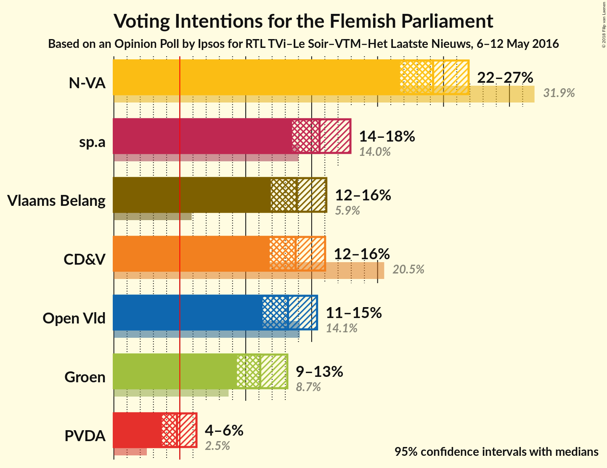
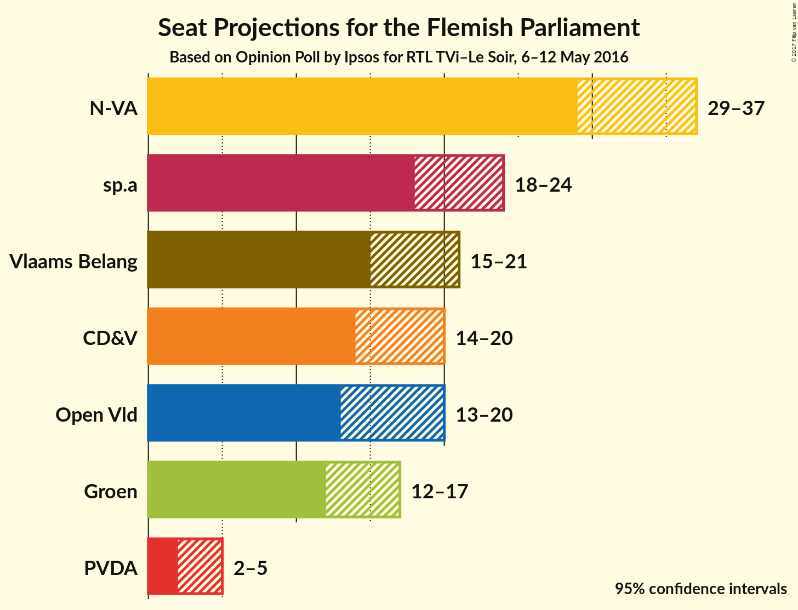
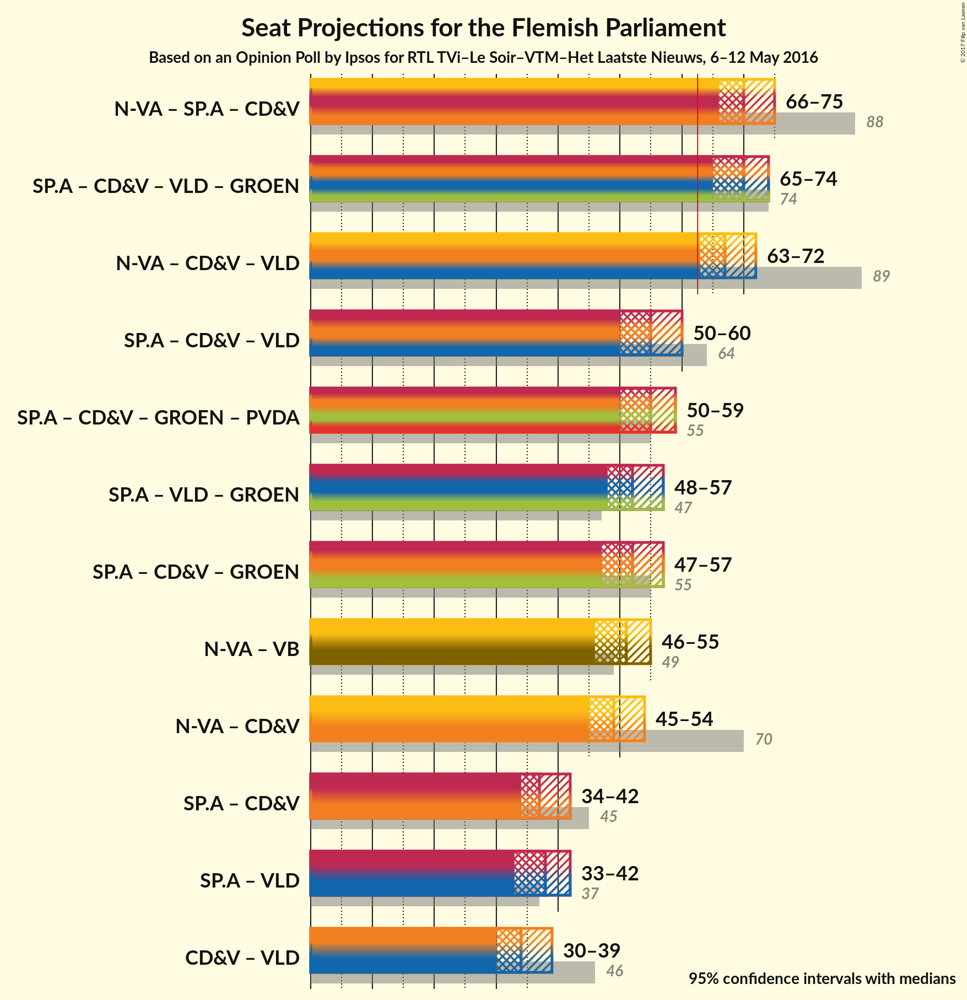

# Opinion Poll by Ipsos for RTL TVi–Le Soir, 6–12 May 2016

<a href="#voting-intentions">Voting Intentions</a> | <a href="#seats">Seats</a> | <a href="#coalitions">Coalitions</a> | <a href="#technical-information">Technical Information</a>

## Voting Intentions

### Confidence Intervals

| Party | Last Result | Poll Result | 80% Confidence Interval | 90% Confidence Interval | 95% Confidence Interval | 99% Confidence Interval |
|:-----:|:-----------:|:-----------:|:-----------------------:|:-----------------------:|:-----------------------:|:-----------------------:|
| N-VA | 31.9% | 25.1% | 22.6–26.0% |22.1–26.5% |21.7–26.9% |20.9–27.8% |
| sp.a | 14.0% | 16.2% | 14.2–17.1% |13.9–17.6% |13.5–17.9% |12.9–18.7% |
| Vlaams Belang | 5.9% | 14.4% | 12.6–15.3% |12.2–15.7% |11.9–16.1% |11.3–16.8% |
| CD&V | 20.5% | 14.3% | 12.5–15.2% |12.1–15.7% |11.8–16.0% |11.2–16.7% |
| Open Vld | 14.1% | 13.7% | 11.9–14.6% |11.6–15.0% |11.3–15.4% |10.7–16.1% |
| Groen | 8.7% | 11.5% | 9.9–12.4% |9.6–12.8% |9.3–13.2% |8.8–13.8% |
| PVDA | 2.5% | 5.0% | 4.0–5.7% |3.8–6.0% |3.6–6.3% |3.3–6.8% |

*Note:* The poll result column reflects the actual value used in the calculations. Published results may vary slightly, and in addition be rounded to fewer digits.

## Seats

### Confidence Intervals

| Party | Last Result | 80% Confidence Interval | 90% Confidence Interval | 95% Confidence Interval | 99% Confidence Interval |
|:-----:|:-----------:|:-----------------------:|:-----------------------:|:-----------------------:|:-----------------------:|
| <a href="#n-va">N-VA</a> | 43 | 30–35 |30–36 |29–37 |28–38 |
| <a href="#sp.a">sp.a</a> | 18 | 19–23 |19–23 |18–24 |17–25 |
| <a href="#vlaams-belang">Vlaams Belang</a> | 6 | 16–20 |16–20 |15–21 |13–22 |
| <a href="#cd&v">CD&V</a> | 27 | 15–20 |15–20 |14–20 |13–21 |
| <a href="#open-vld">Open Vld</a> | 19 | 16–19 |14–20 |13–20 |13–23 |
| <a href="#groen">Groen</a> | 10 | 13–17 |13–17 |12–17 |10–18 |
| <a href="#pvda">PVDA</a> | 0 | 2–5 |2–5 |2–5 |0–5 |

### N-VA

| Number of Seats | Probability | Accumulated |
|:---------------:|:-----------:|:-----------:|
| 26 | 0% | 100% |
| 27 | 0.3% | 99.9% |
| 28 | 1.0% | 99.6% |
| 29 | 3% | 98.6% |
| 30 | 12% | 96% |
| 31 | 13% | 83% |
| 32 | 10% | 70% |
| 33 | 23% | 60% |
| 34 | 22% | 37% |
| 35 | 8% | 15% |
| 36 | 3% | 7% |
| 37 | 3% | 4% |
| 38 | 0.8% | 0.9% |
| 39 | 0.1% | 0.1% |
| 40 | 0% | 0% |

### sp.a

| Number of Seats | Probability | Accumulated |
|:---------------:|:-----------:|:-----------:|
| 15 | 0.1% | 100% |
| 16 | 0.2% | 99.9% |
| 17 | 2% | 99.7% |
| 18 | 2% | 98% |
| 19 | 38% | 96% |
| 20 | 17% | 57% |
| 21 | 13% | 40% |
| 22 | 12% | 28% |
| 23 | 11% | 15% |
| 24 | 3% | 4% |
| 25 | 0.8% | 1.2% |
| 26 | 0.2% | 0.4% |
| 27 | 0.1% | 0.1% |
| 28 | 0% | 0% |

### Vlaams Belang

| Number of Seats | Probability | Accumulated |
|:---------------:|:-----------:|:-----------:|
| 12 | 0.1% | 100% |
| 13 | 0.5% | 99.9% |
| 14 | 1.1% | 99.3% |
| 15 | 3% | 98% |
| 16 | 12% | 95% |
| 17 | 26% | 83% |
| 18 | 28% | 57% |
| 19 | 15% | 29% |
| 20 | 9% | 14% |
| 21 | 3% | 4% |
| 22 | 1.4% | 2% |
| 23 | 0.2% | 0.4% |
| 24 | 0.1% | 0.1% |
| 25 | 0% | 0% |

### CD&V

| Number of Seats | Probability | Accumulated |
|:---------------:|:-----------:|:-----------:|
| 12 | 0.1% | 100% |
| 13 | 0.5% | 99.9% |
| 14 | 2% | 99.4% |
| 15 | 24% | 97% |
| 16 | 26% | 73% |
| 17 | 11% | 47% |
| 18 | 9% | 36% |
| 19 | 13% | 27% |
| 20 | 13% | 13% |
| 21 | 0.6% | 0.8% |
| 22 | 0.1% | 0.2% |
| 23 | 0% | 0% |

### Open Vld

| Number of Seats | Probability | Accumulated |
|:---------------:|:-----------:|:-----------:|
| 12 | 0.2% | 100% |
| 13 | 3% | 99.8% |
| 14 | 3% | 97% |
| 15 | 3% | 94% |
| 16 | 6% | 91% |
| 17 | 22% | 85% |
| 18 | 45% | 62% |
| 19 | 11% | 17% |
| 20 | 4% | 7% |
| 21 | 1.3% | 2% |
| 22 | 0.5% | 1.0% |
| 23 | 0.5% | 0.5% |
| 24 | 0.1% | 0.1% |
| 25 | 0% | 0% |

### Groen

| Number of Seats | Probability | Accumulated |
|:---------------:|:-----------:|:-----------:|
| 10 | 0.8% | 100% |
| 11 | 0.9% | 99.2% |
| 12 | 3% | 98% |
| 13 | 7% | 96% |
| 14 | 38% | 89% |
| 15 | 32% | 51% |
| 16 | 4% | 18% |
| 17 | 13% | 14% |
| 18 | 2% | 2% |
| 19 | 0.1% | 0.2% |
| 20 | 0% | 0.1% |
| 21 | 0% | 0% |

### PVDA

| Number of Seats | Probability | Accumulated |
|:---------------:|:-----------:|:-----------:|
| 0 | 0.5% | 100% |
| 1 | 0.8% | 99.5% |
| 2 | 51% | 98.6% |
| 3 | 25% | 48% |
| 4 | 4% | 23% |
| 5 | 19% | 19% |
| 6 | 0.1% | 0.3% |
| 7 | 0.1% | 0.2% |
| 8 | 0.1% | 0.1% |
| 9 | 0% | 0% |

## Coalitions

### Confidence Intervals

| Coalition | Last Result | 80% Confidence Interval | 90% Confidence Interval | 95% Confidence Interval | 99% Confidence Interval |
|:---------:|:-----------:|:-----------------------:|:-----------------------:|:-----------------------:|:-----------------------:|
| sp.a – CD&V – Open Vld – Groen | 74 | 67–72 | 66–73 | 65–74 | 64–76 |
| sp.a – CD&V – Groen – PVDA | 55 | 52–58 | 51–59 | 50–59 | 49–61 |
| sp.a – CD&V – Groen | 55 | 49–55 | 48–56 | 47–57 | 46–58 |
| N-VA – CD&V | 70 | 47–53 | 46–53 | 45–54 | 44–56 |
| N-VA – CD&V – Open Vld | 89 | 64–70 | 63–71 | 63–72 | 61–73 |
| N-VA – sp.a – CD&V | 88 | 68–73 | 67–74 | 66–75 | 64–76 |
| CD&V – Open Vld | 46 | 32–38 | 31–38 | 30–39 | 29–40 |
| sp.a – CD&V – Open Vld | 64 | 52–58 | 51–59 | 50–60 | 49–61 |
| sp.a – CD&V | 45 | 34–40 | 34–41 | 34–42 | 33–43 |
| sp.a – Open Vld – Groen | 47 | 50–56 | 49–56 | 48–57 | 47–58 |
| N-VA – Vlaams Belang | 49 | 48–54 | 47–54 | 46–55 | 45–57 |
| sp.a – Open Vld | 37 | 35–41 | 34–42 | 33–42 | 32–44 |

## Technical Information

### Opinion Poll

+ **Pollster:** Ipsos
+ **Media:** RTL TVi–Le Soir
+ **Fieldwork period:** 6–12 May 2016

### Calculations

+ **Sample size:** 1009
+ **Simulations done:** 1,048,576
+ **Error estimate:** 0.88%

