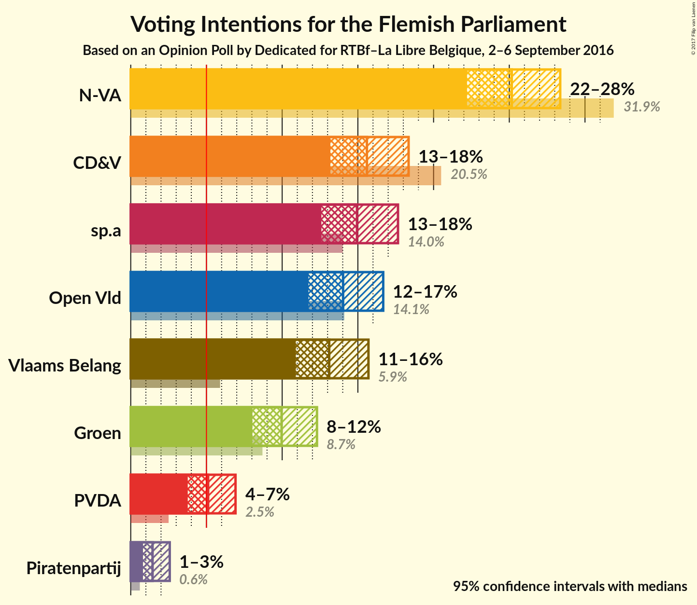
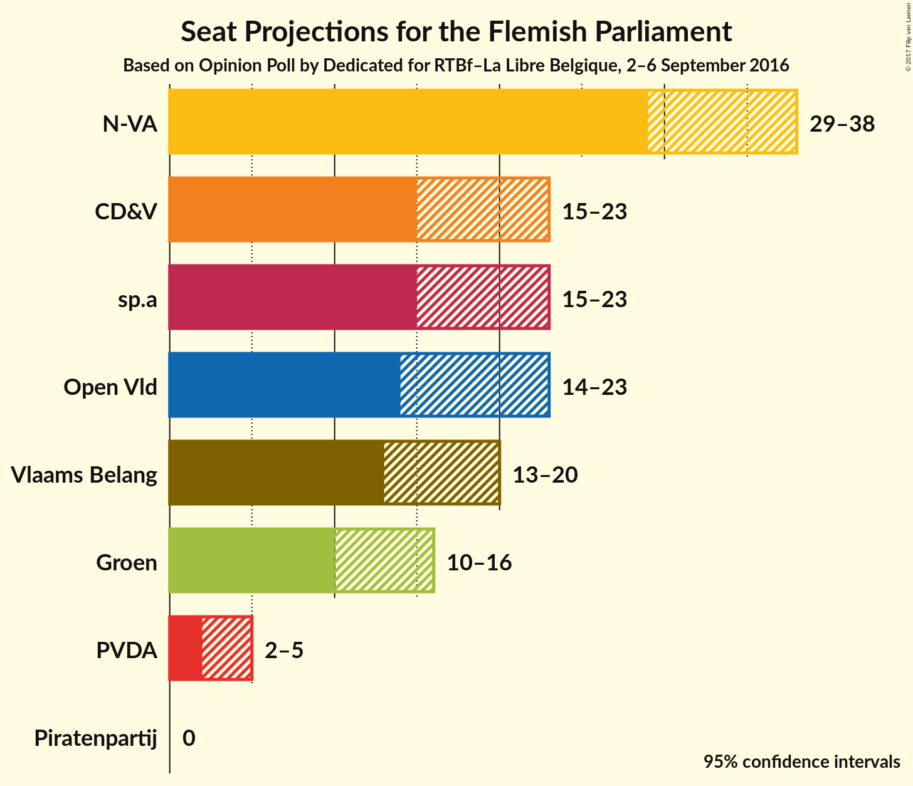
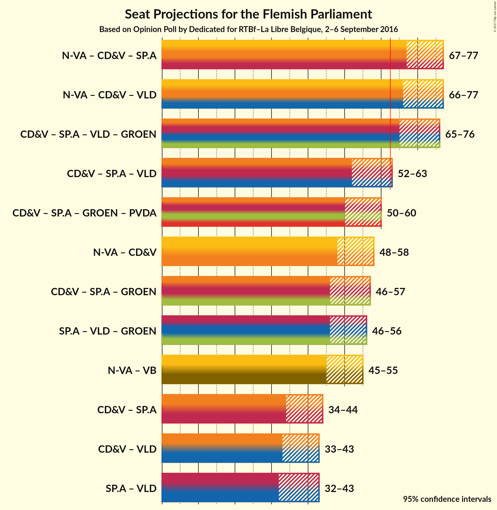

# Opinion Poll by Dedicated for RTBf–La Libre Belgique, 2–6 September 2016

<a href="#voting-intentions">Voting Intentions</a> | <a href="#seats">Seats</a> | <a href="#coalitions">Coalitions</a> | <a href="#technical-information">Technical Information</a>

## Voting Intentions

### Confidence Intervals

| Party | Last Result | Poll Result | 80% Confidence Interval | 90% Confidence Interval | 95% Confidence Interval | 99% Confidence Interval |
|:-----:|:-----------:|:-----------:|:-----------------------:|:-----------------------:|:-----------------------:|:-----------------------:|
| N-VA | 31.9% | 25.2% | 23.2–27.3% |22.7–27.8% |22.2–28.4% |21.3–29.4% |
| CD&V | 20.5% | 15.6% | 14.0–17.4% |13.6–17.9% |13.2–18.4% |12.5–19.2% |
| sp.a | 14.0% | 14.9% | 13.4–16.7% |13.0–17.2% |12.6–17.6% |11.9–18.5% |
| Open Vld | 14.1% | 14.0% | 12.5–15.8% |12.1–16.2% |11.7–16.7% |11.1–17.5% |
| Vlaams Belang | 5.9% | 13.1% | 11.6–14.8% |11.2–15.3% |10.9–15.7% |10.2–16.5% |
| Groen | 8.7% | 10.0% | 8.7–11.5% |8.3–11.9% |8.0–12.3% |7.5–13.1% |
| PVDA | 2.5% | 5.1% | 4.2–6.3% |4.0–6.6% |3.8–6.9% |3.4–7.5% |
| Piratenpartij | 0.6% | 1.4% | 1.0–2.2% |0.9–2.4% |0.8–2.6% |0.6–3.0% |

*Note:* The poll result column reflects the actual value used in the calculations. Published results may vary slightly, and in addition be rounded to fewer digits.

## Seats

### Confidence Intervals

| Party | Last Result | Median | 80% Confidence Interval | 90% Confidence Interval | 95% Confidence Interval | 99% Confidence Interval |
|:-----:|:-----------:|:------:|:-----------------------:|:-----------------------:|:-----------------------:|:-----------------------:|
| <a href="#n-va">N-VA</a> | 43 | 33 | 30–37 |30–37 |29–38 |28–39 |
| <a href="#cd&v">CD&V</a> | 27 | 20 | 16–21 |15–22 |15–23 |15–25 |
| <a href="#sp.a">sp.a</a> | 18 | 19 | 17–22 |16–23 |15–23 |14–25 |
| <a href="#open-vld">Open Vld</a> | 19 | 19 | 16–21 |15–22 |14–23 |13–24 |
| <a href="#vlaams-belang">Vlaams Belang</a> | 6 | 17 | 14–19 |13–19 |13–20 |11–22 |
| <a href="#groen">Groen</a> | 10 | 13 | 10–15 |10–15 |10–16 |8–17 |
| <a href="#pvda">PVDA</a> | 0 | 3 | 2–5 |2–5 |2–5 |1–8 |
| <a href="#piratenpartij">Piratenpartij</a> | 0 | 0 | 0 |0 |0 |0 |

### N-VA

| Number of Seats | Probability | Accumulated |
|:---------------:|:-----------:|:-----------:|
| 26 | 0.1% | 100% |
| 27 | 0.2% | 99.9% |
| 28 | 0.6% | 99.7% |
| 29 | 2% | 99.1% |
| 30 | 10% | 97% |
| 31 | 9% | 87% |
| 32 | 11% | 78% |
| 33 | 23% | 67% |
| 34 | 16% | 44% |
| 35 | 11% | 28% |
| 36 | 6% | 17% |
| 37 | 6% | 11% |
| 38 | 4% | 5% |
| 39 | 0.6% | 0.9% |
| 40 | 0.2% | 0.3% |
| 41 | 0% | 0.1% |
| 42 | 0% | 0% |

### CD&V

| Number of Seats | Probability | Accumulated |
|:---------------:|:-----------:|:-----------:|
| 14 | 0.1% | 100% |
| 15 | 5% | 99.8% |
| 16 | 5% | 95% |
| 17 | 6% | 89% |
| 18 | 6% | 83% |
| 19 | 13% | 77% |
| 20 | 48% | 65% |
| 21 | 9% | 16% |
| 22 | 4% | 8% |
| 23 | 2% | 4% |
| 24 | 1.1% | 2% |
| 25 | 0.5% | 0.8% |
| 26 | 0.2% | 0.3% |
| 27 | 0.1% | 0.1% |
| 28 | 0% | 0% |

### sp.a

| Number of Seats | Probability | Accumulated |
|:---------------:|:-----------:|:-----------:|
| 14 | 2% | 100% |
| 15 | 2% | 98% |
| 16 | 3% | 97% |
| 17 | 7% | 94% |
| 18 | 7% | 88% |
| 19 | 53% | 81% |
| 20 | 9% | 28% |
| 21 | 8% | 19% |
| 22 | 3% | 10% |
| 23 | 5% | 7% |
| 24 | 2% | 2% |
| 25 | 0.5% | 0.7% |
| 26 | 0.1% | 0.2% |
| 27 | 0.1% | 0.1% |
| 28 | 0% | 0% |

### Open Vld

| Number of Seats | Probability | Accumulated |
|:---------------:|:-----------:|:-----------:|
| 12 | 0.1% | 100% |
| 13 | 2% | 99.9% |
| 14 | 2% | 98% |
| 15 | 2% | 96% |
| 16 | 4% | 94% |
| 17 | 13% | 90% |
| 18 | 17% | 77% |
| 19 | 31% | 61% |
| 20 | 19% | 29% |
| 21 | 4% | 11% |
| 22 | 2% | 6% |
| 23 | 3% | 4% |
| 24 | 0.8% | 1.0% |
| 25 | 0.1% | 0.2% |
| 26 | 0% | 0% |

### Vlaams Belang

| Number of Seats | Probability | Accumulated |
|:---------------:|:-----------:|:-----------:|
| 11 | 0.7% | 100% |
| 12 | 1.4% | 99.2% |
| 13 | 6% | 98% |
| 14 | 5% | 92% |
| 15 | 8% | 88% |
| 16 | 27% | 79% |
| 17 | 24% | 52% |
| 18 | 18% | 28% |
| 19 | 6% | 10% |
| 20 | 2% | 4% |
| 21 | 0.6% | 1.2% |
| 22 | 0.5% | 0.6% |
| 23 | 0.1% | 0.1% |
| 24 | 0% | 0% |

### Groen

| Number of Seats | Probability | Accumulated |
|:---------------:|:-----------:|:-----------:|
| 7 | 0.3% | 100% |
| 8 | 0.3% | 99.7% |
| 9 | 0.6% | 99.5% |
| 10 | 16% | 98.9% |
| 11 | 9% | 82% |
| 12 | 9% | 74% |
| 13 | 18% | 65% |
| 14 | 33% | 47% |
| 15 | 10% | 14% |
| 16 | 2% | 4% |
| 17 | 2% | 2% |
| 18 | 0.2% | 0.2% |
| 19 | 0% | 0% |

### PVDA

| Number of Seats | Probability | Accumulated |
|:---------------:|:-----------:|:-----------:|
| 0 | 0.5% | 100% |
| 1 | 1.1% | 99.5% |
| 2 | 41% | 98% |
| 3 | 19% | 57% |
| 4 | 5% | 38% |
| 5 | 31% | 33% |
| 6 | 0.4% | 2% |
| 7 | 0.6% | 1.5% |
| 8 | 0.7% | 0.9% |
| 9 | 0.3% | 0.3% |
| 10 | 0% | 0% |

### Piratenpartij

| Number of Seats | Probability | Accumulated |
|:---------------:|:-----------:|:-----------:|
| 0 | 100% | 100% |
| 1 | 0% | 0% |

## Coalitions

### Confidence Intervals

| Coalition | Last Result | Median | 80% Confidence Interval | 90% Confidence Interval | 95% Confidence Interval | 99% Confidence Interval |
|:---------:|:-----------:|:------:|:-----------------------:|:-----------------------:|:-----------------------:|:-----------------------:|
| N-VA – CD&V – sp.a | 88 | 72 | 69–75 | 68–76 | 67–77 | 66–79 |
| N-VA – CD&V – Open Vld | 89 | 71 | 68–75 | 67–76 | 66–77 | 64–79 |
| CD&V – sp.a – Open Vld – Groen | 74 | 70 | 67–74 | 66–75 | 65–76 | 63–77 |
| CD&V – sp.a – Open Vld | 64 | 58 | 54–61 | 53–62 | 52–63 | 50–64 |
| CD&V – sp.a – Groen – PVDA | 55 | 55 | 51–58 | 50–59 | 50–60 | 48–62 |
| N-VA – CD&V | 70 | 53 | 50–56 | 49–57 | 48–58 | 46–59 |
| CD&V – sp.a – Groen | 55 | 52 | 48–55 | 47–56 | 46–57 | 44–58 |
| sp.a – Open Vld – Groen | 47 | 51 | 48–54 | 46–55 | 46–56 | 44–58 |
| N-VA – Vlaams Belang | 49 | 50 | 46–53 | 46–54 | 45–55 | 43–56 |
| CD&V – sp.a | 45 | 39 | 35–42 | 35–43 | 34–44 | 32–45 |
| CD&V – Open Vld | 46 | 38 | 34–41 | 33–42 | 33–43 | 31–44 |
| sp.a – Open Vld | 37 | 38 | 35–41 | 34–42 | 32–43 | 31–45 |

### N-VA – CD&V – sp.a

| Number of Seats | Probability | Accumulated |
|:---------------:|:-----------:|:-----------:|
| 63 | 0% | 100% |
| 64 | 0.1% | 99.9% |
| 65 | 0.3% | 99.8% |
| 66 | 0.7% | 99.5% |
| 67 | 2% | 98.9% |
| 68 | 4% | 97% |
| 69 | 10% | 94% |
| 70 | 12% | 84% |
| 71 | 14% | 72% |
| 72 | 18% | 58% |
| 73 | 13% | 40% |
| 74 | 11% | 27% |
| 75 | 7% | 16% |
| 76 | 4% | 8% |
| 77 | 2% | 4% |
| 78 | 1.0% | 2% |
| 79 | 0.4% | 0.8% |
| 80 | 0.2% | 0.4% |
| 81 | 0.1% | 0.1% |
| 82 | 0% | 0% |

### N-VA – CD&V – Open Vld

| Number of Seats | Probability | Accumulated |
|:---------------:|:-----------:|:-----------:|
| 62 | 0.1% | 100% |
| 63 | 0.2% | 99.9% |
| 64 | 0.5% | 99.7% |
| 65 | 0.8% | 99.1% |
| 66 | 2% | 98% |
| 67 | 5% | 97% |
| 68 | 8% | 92% |
| 69 | 10% | 84% |
| 70 | 12% | 73% |
| 71 | 12% | 62% |
| 72 | 14% | 50% |
| 73 | 12% | 36% |
| 74 | 11% | 24% |
| 75 | 6% | 13% |
| 76 | 3% | 7% |
| 77 | 2% | 4% |
| 78 | 1.0% | 1.5% |
| 79 | 0.3% | 0.5% |
| 80 | 0.1% | 0.2% |
| 81 | 0.1% | 0.1% |
| 82 | 0% | 0% |

### CD&V – sp.a – Open Vld – Groen

| Number of Seats | Probability | Accumulated |
|:---------------:|:-----------:|:-----------:|
| 61 | 0.1% | 100% |
| 62 | 0.2% | 99.9% |
| 63 | 0.5% | 99.8% |
| 64 | 1.4% | 99.3% |
| 65 | 3% | 98% |
| 66 | 4% | 95% |
| 67 | 6% | 91% |
| 68 | 11% | 85% |
| 69 | 14% | 74% |
| 70 | 13% | 60% |
| 71 | 15% | 47% |
| 72 | 14% | 32% |
| 73 | 7% | 17% |
| 74 | 5% | 10% |
| 75 | 3% | 5% |
| 76 | 2% | 3% |
| 77 | 0.6% | 1.0% |
| 78 | 0.3% | 0.4% |
| 79 | 0.1% | 0.1% |
| 80 | 0% | 0% |

### CD&V – sp.a – Open Vld

| Number of Seats | Probability | Accumulated |
|:---------------:|:-----------:|:-----------:|
| 48 | 0.1% | 100% |
| 49 | 0.2% | 99.9% |
| 50 | 0.6% | 99.7% |
| 51 | 1.0% | 99.0% |
| 52 | 3% | 98% |
| 53 | 4% | 95% |
| 54 | 8% | 91% |
| 55 | 8% | 83% |
| 56 | 11% | 75% |
| 57 | 14% | 65% |
| 58 | 19% | 51% |
| 59 | 14% | 32% |
| 60 | 7% | 19% |
| 61 | 5% | 12% |
| 62 | 3% | 7% |
| 63 | 2% | 3% |
| 64 | 0.6% | 1.1% |
| 65 | 0.3% | 0.5% |
| 66 | 0.1% | 0.2% |
| 67 | 0% | 0.1% |
| 68 | 0% | 0% |

### CD&V – sp.a – Groen – PVDA

| Number of Seats | Probability | Accumulated |
|:---------------:|:-----------:|:-----------:|
| 46 | 0.1% | 100% |
| 47 | 0.2% | 99.9% |
| 48 | 0.7% | 99.7% |
| 49 | 1.3% | 99.0% |
| 50 | 5% | 98% |
| 51 | 7% | 93% |
| 52 | 8% | 86% |
| 53 | 10% | 78% |
| 54 | 13% | 69% |
| 55 | 13% | 55% |
| 56 | 13% | 42% |
| 57 | 10% | 29% |
| 58 | 11% | 19% |
| 59 | 4% | 8% |
| 60 | 2% | 4% |
| 61 | 0.9% | 2% |
| 62 | 0.5% | 0.8% |
| 63 | 0.2% | 0.3% |
| 64 | 0.1% | 0.1% |
| 65 | 0% | 0% |

### N-VA – CD&V

| Number of Seats | Probability | Accumulated |
|:---------------:|:-----------:|:-----------:|
| 44 | 0% | 100% |
| 45 | 0.2% | 99.9% |
| 46 | 0.6% | 99.7% |
| 47 | 0.8% | 99.1% |
| 48 | 2% | 98% |
| 49 | 4% | 97% |
| 50 | 13% | 92% |
| 51 | 10% | 79% |
| 52 | 14% | 69% |
| 53 | 19% | 55% |
| 54 | 12% | 36% |
| 55 | 9% | 23% |
| 56 | 7% | 14% |
| 57 | 4% | 7% |
| 58 | 2% | 3% |
| 59 | 0.8% | 1.2% |
| 60 | 0.2% | 0.4% |
| 61 | 0.1% | 0.2% |
| 62 | 0% | 0.1% |
| 63 | 0% | 0% |

### CD&V – sp.a – Groen

| Number of Seats | Probability | Accumulated |
|:---------------:|:-----------:|:-----------:|
| 42 | 0% | 100% |
| 43 | 0.1% | 99.9% |
| 44 | 0.5% | 99.8% |
| 45 | 0.9% | 99.4% |
| 46 | 2% | 98% |
| 47 | 3% | 96% |
| 48 | 6% | 94% |
| 49 | 11% | 87% |
| 50 | 10% | 76% |
| 51 | 13% | 66% |
| 52 | 15% | 53% |
| 53 | 18% | 38% |
| 54 | 8% | 20% |
| 55 | 6% | 12% |
| 56 | 3% | 6% |
| 57 | 2% | 3% |
| 58 | 0.8% | 1.2% |
| 59 | 0.3% | 0.5% |
| 60 | 0.1% | 0.2% |
| 61 | 0% | 0.1% |
| 62 | 0% | 0% |

### sp.a – Open Vld – Groen

| Number of Seats | Probability | Accumulated |
|:---------------:|:-----------:|:-----------:|
| 42 | 0.1% | 100% |
| 43 | 0.2% | 99.9% |
| 44 | 0.7% | 99.7% |
| 45 | 1.4% | 99.0% |
| 46 | 3% | 98% |
| 47 | 4% | 95% |
| 48 | 8% | 90% |
| 49 | 11% | 82% |
| 50 | 16% | 71% |
| 51 | 16% | 54% |
| 52 | 15% | 38% |
| 53 | 10% | 23% |
| 54 | 6% | 13% |
| 55 | 3% | 8% |
| 56 | 3% | 5% |
| 57 | 1.2% | 2% |
| 58 | 0.4% | 0.7% |
| 59 | 0.2% | 0.3% |
| 60 | 0.1% | 0.1% |
| 61 | 0% | 0% |

### N-VA – Vlaams Belang

| Number of Seats | Probability | Accumulated |
|:---------------:|:-----------:|:-----------:|
| 41 | 0.1% | 100% |
| 42 | 0.2% | 99.9% |
| 43 | 0.6% | 99.7% |
| 44 | 1.1% | 99.2% |
| 45 | 2% | 98% |
| 46 | 6% | 96% |
| 47 | 8% | 90% |
| 48 | 12% | 82% |
| 49 | 15% | 70% |
| 50 | 17% | 55% |
| 51 | 11% | 38% |
| 52 | 10% | 27% |
| 53 | 8% | 17% |
| 54 | 6% | 9% |
| 55 | 2% | 3% |
| 56 | 0.8% | 1.3% |
| 57 | 0.3% | 0.5% |
| 58 | 0.1% | 0.1% |
| 59 | 0% | 0.1% |
| 60 | 0% | 0% |

### CD&V – sp.a

| Number of Seats | Probability | Accumulated |
|:---------------:|:-----------:|:-----------:|
| 30 | 0.1% | 100% |
| 31 | 0.1% | 99.9% |
| 32 | 0.4% | 99.8% |
| 33 | 0.7% | 99.4% |
| 34 | 3% | 98.7% |
| 35 | 6% | 95% |
| 36 | 8% | 90% |
| 37 | 9% | 82% |
| 38 | 13% | 73% |
| 39 | 31% | 60% |
| 40 | 11% | 29% |
| 41 | 7% | 18% |
| 42 | 4% | 11% |
| 43 | 4% | 6% |
| 44 | 2% | 3% |
| 45 | 0.5% | 0.9% |
| 46 | 0.2% | 0.3% |
| 47 | 0.1% | 0.1% |
| 48 | 0% | 0% |

### CD&V – Open Vld

| Number of Seats | Probability | Accumulated |
|:---------------:|:-----------:|:-----------:|
| 29 | 0.1% | 100% |
| 30 | 0.2% | 99.9% |
| 31 | 0.4% | 99.7% |
| 32 | 1.0% | 99.3% |
| 33 | 4% | 98% |
| 34 | 5% | 95% |
| 35 | 6% | 90% |
| 36 | 8% | 83% |
| 37 | 12% | 76% |
| 38 | 14% | 63% |
| 39 | 23% | 49% |
| 40 | 13% | 26% |
| 41 | 6% | 13% |
| 42 | 3% | 7% |
| 43 | 2% | 4% |
| 44 | 1.0% | 1.5% |
| 45 | 0.3% | 0.5% |
| 46 | 0.1% | 0.2% |
| 47 | 0% | 0.1% |
| 48 | 0% | 0% |

### sp.a – Open Vld

| Number of Seats | Probability | Accumulated |
|:---------------:|:-----------:|:-----------:|
| 29 | 0.1% | 100% |
| 30 | 0.1% | 99.9% |
| 31 | 0.5% | 99.8% |
| 32 | 2% | 99.3% |
| 33 | 2% | 97% |
| 34 | 5% | 95% |
| 35 | 5% | 90% |
| 36 | 10% | 85% |
| 37 | 15% | 75% |
| 38 | 23% | 60% |
| 39 | 15% | 38% |
| 40 | 9% | 23% |
| 41 | 5% | 14% |
| 42 | 4% | 9% |
| 43 | 3% | 4% |
| 44 | 1.0% | 1.5% |
| 45 | 0.3% | 0.5% |
| 46 | 0.1% | 0.2% |
| 47 | 0.1% | 0.1% |
| 48 | 0% | 0% |

## Technical Information

### Opinion Poll

+ **Pollster:** Dedicated
+ **Media:** RTBf–La Libre Belgique
+ **Fieldwork period:** 2–6 September 2016

### Calculations

+ **Sample size:** 763
+ **Simulations done:** 8,388,608
+ **Error estimate:** 1.63%

