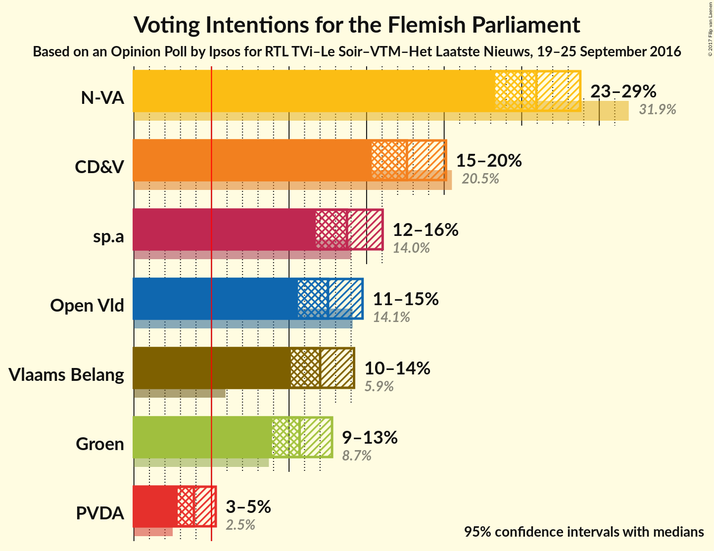
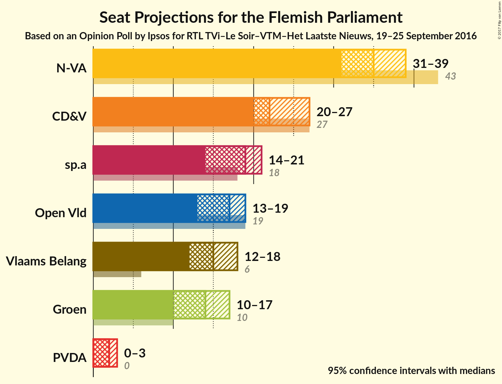
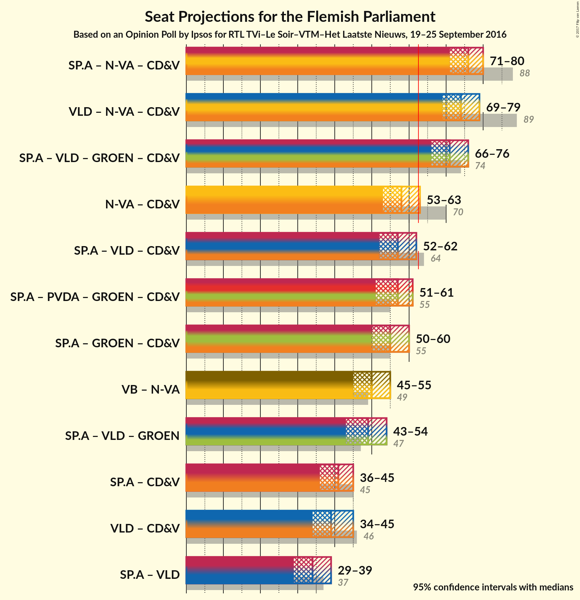

# Opinion Poll by Ipsos for RTL TVi–Le Soir, 19–25 September 2016

<a href="#voting-intentions">Voting Intentions</a> | <a href="#seats">Seats</a> | <a href="#coalitions">Coalitions</a> | <a href="#technical-information">Technical Information</a>

## Voting Intentions

### Confidence Intervals

| Party | Last Result | Poll Result | 80% Confidence Interval | 90% Confidence Interval | 95% Confidence Interval | 99% Confidence Interval |
|:-----:|:-----------:|:-----------:|:-----------------------:|:-----------------------:|:-----------------------:|:-----------------------:|
| N-VA | 31.9% | 26.9% | 24.2–27.8% |23.7–28.3% |23.3–28.8% |22.5–29.7% |
| CD&V | 20.5% | 18.3% | 16.1–19.3% |15.7–19.7% |15.3–20.1% |14.7–20.9% |
| sp.a | 14.0% | 14.3% | 12.4–15.2% |12.0–15.7% |11.7–16.0% |11.1–16.8% |
| Open Vld | 14.1% | 13.0% | 11.2–14.0% |10.9–14.4% |10.6–14.7% |10.0–15.5% |
| Vlaams Belang | 5.9% | 12.5% | 10.8–13.4% |10.4–13.8% |10.1–14.2% |9.5–14.9% |
| Groen | 8.7% | 11.1% | 9.5–12.1% |9.2–12.4% |8.9–12.8% |8.4–13.5% |
| PVDA | 2.5% | 4.0% | 3.2–4.8% |3.0–5.0% |2.8–5.3% |2.5–5.7% |

*Note:* The poll result column reflects the actual value used in the calculations. Published results may vary slightly, and in addition be rounded to fewer digits.

## Seats

### Confidence Intervals

| Party | Last Result | 80% Confidence Interval | 90% Confidence Interval | 95% Confidence Interval | 99% Confidence Interval |
|:-----:|:-----------:|:-----------------------:|:-----------------------:|:-----------------------:|:-----------------------:|
| <a href="#n-va">N-VA</a> | 43 | 33–38 |32–38 |31–39 |30–40 |
| <a href="#cd&v">CD&V</a> | 27 | 20–26 |20–27 |20–27 |19–28 |
| <a href="#sp.a">sp.a</a> | 18 | 16–20 |15–20 |14–21 |14–23 |
| <a href="#open-vld">Open Vld</a> | 19 | 13–19 |13–19 |13–19 |12–20 |
| <a href="#vlaams-belang">Vlaams Belang</a> | 6 | 12–18 |12–18 |12–18 |11–19 |
| <a href="#groen">Groen</a> | 10 | 13–16 |12–17 |11–17 |10–18 |
| <a href="#pvda">PVDA</a> | 0 | 0–2 |0–3 |0–3 |0–5 |

### N-VA

| Number of Seats | Probability | Accumulated |
|:---------------:|:-----------:|:-----------:|
| 29 | 0.1% | 100% |
| 30 | 1.2% | 99.8% |
| 31 | 3% | 98.6% |
| 32 | 4% | 96% |
| 33 | 15% | 92% |
| 34 | 13% | 78% |
| 35 | 17% | 65% |
| 36 | 15% | 48% |
| 37 | 20% | 33% |
| 38 | 9% | 13% |
| 39 | 2% | 4% |
| 40 | 1.0% | 1.4% |
| 41 | 0.2% | 0.4% |
| 42 | 0.2% | 0.2% |
| 43 | 0% | 0% |

### CD&V

| Number of Seats | Probability | Accumulated |
|:---------------:|:-----------:|:-----------:|
| 16 | 0.1% | 100% |
| 17 | 0.1% | 99.9% |
| 18 | 0.2% | 99.9% |
| 19 | 1.2% | 99.6% |
| 20 | 15% | 98% |
| 21 | 22% | 84% |
| 22 | 14% | 62% |
| 23 | 13% | 48% |
| 24 | 11% | 35% |
| 25 | 14% | 24% |
| 26 | 3% | 10% |
| 27 | 6% | 7% |
| 28 | 0.5% | 0.7% |
| 29 | 0.1% | 0.2% |
| 30 | 0.1% | 0.1% |
| 31 | 0% | 0% |

### sp.a

| Number of Seats | Probability | Accumulated |
|:---------------:|:-----------:|:-----------:|
| 14 | 5% | 100% |
| 15 | 5% | 95% |
| 16 | 9% | 91% |
| 17 | 11% | 82% |
| 18 | 19% | 70% |
| 19 | 41% | 51% |
| 20 | 6% | 10% |
| 21 | 2% | 4% |
| 22 | 1.1% | 2% |
| 23 | 0.4% | 0.8% |
| 24 | 0.4% | 0.4% |
| 25 | 0% | 0% |

### Open Vld

| Number of Seats | Probability | Accumulated |
|:---------------:|:-----------:|:-----------:|
| 12 | 2% | 100% |
| 13 | 18% | 98% |
| 14 | 10% | 81% |
| 15 | 9% | 71% |
| 16 | 7% | 62% |
| 17 | 15% | 56% |
| 18 | 16% | 41% |
| 19 | 22% | 24% |
| 20 | 2% | 2% |
| 21 | 0.2% | 0.4% |
| 22 | 0.1% | 0.2% |
| 23 | 0.1% | 0.1% |
| 24 | 0% | 0% |

### Vlaams Belang

| Number of Seats | Probability | Accumulated |
|:---------------:|:-----------:|:-----------:|
| 11 | 0.7% | 100% |
| 12 | 15% | 99.2% |
| 13 | 19% | 84% |
| 14 | 14% | 65% |
| 15 | 18% | 51% |
| 16 | 15% | 33% |
| 17 | 8% | 18% |
| 18 | 9% | 11% |
| 19 | 2% | 2% |
| 20 | 0.4% | 0.4% |
| 21 | 0% | 0% |

### Groen

| Number of Seats | Probability | Accumulated |
|:---------------:|:-----------:|:-----------:|
| 10 | 2% | 100% |
| 11 | 2% | 98% |
| 12 | 4% | 96% |
| 13 | 9% | 92% |
| 14 | 51% | 83% |
| 15 | 21% | 33% |
| 16 | 4% | 12% |
| 17 | 7% | 8% |
| 18 | 0.4% | 0.6% |
| 19 | 0.1% | 0.2% |
| 20 | 0.1% | 0.1% |
| 21 | 0% | 0% |

### PVDA

| Number of Seats | Probability | Accumulated |
|:---------------:|:-----------:|:-----------:|
| 0 | 13% | 100% |
| 1 | 13% | 87% |
| 2 | 67% | 74% |
| 3 | 5% | 7% |
| 4 | 0.6% | 2% |
| 5 | 2% | 2% |
| 6 | 0% | 0% |

## Coalitions

## Technical Information

### Opinion Poll

+ **Pollster:** Ipsos
+ **Media:** RTL TVi–Le Soir
+ **Fieldwork period:** 19–25 September 2016

### Calculations

+ **Sample size:** 947
+ **Simulations done:** 1,048,576
+ **Error estimate:** 1.08%

