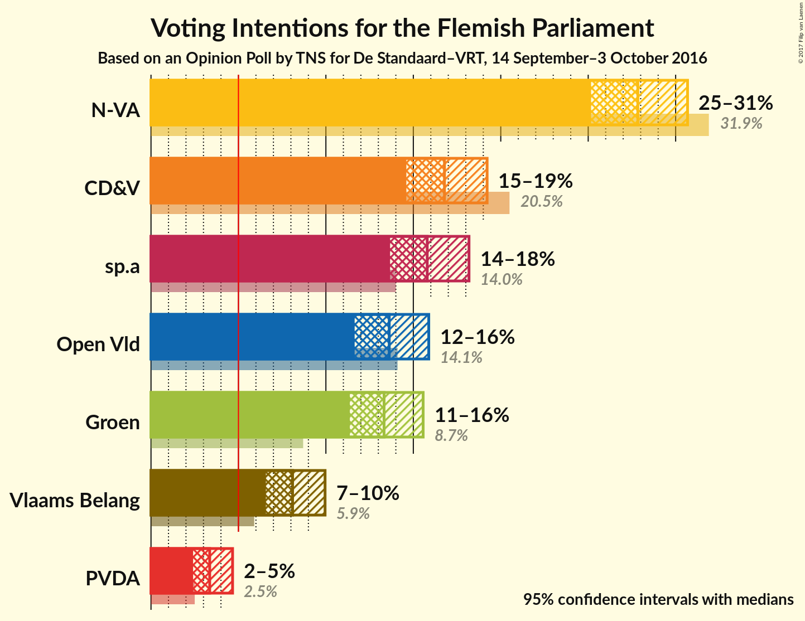
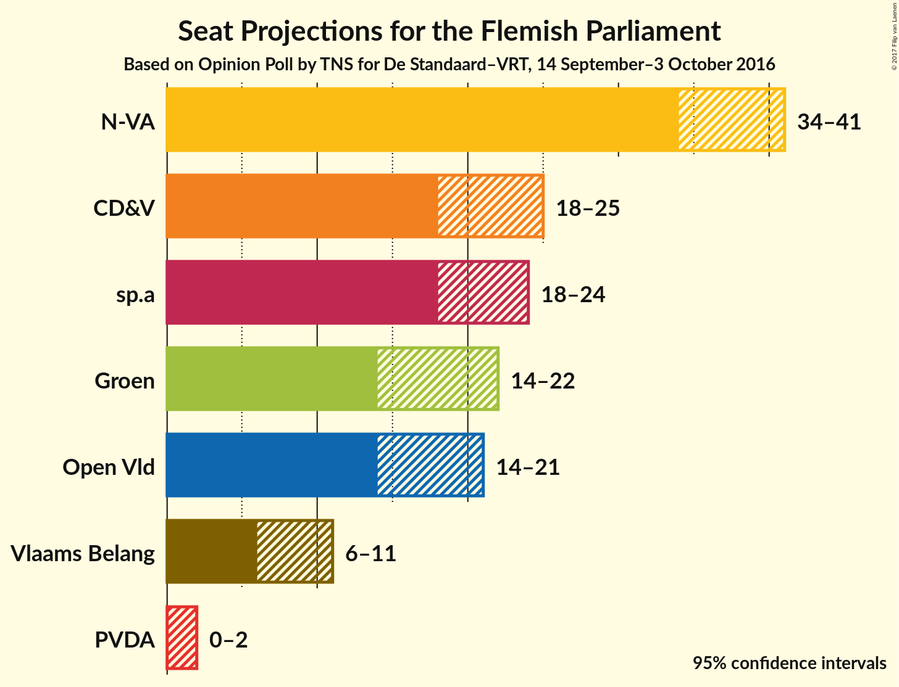
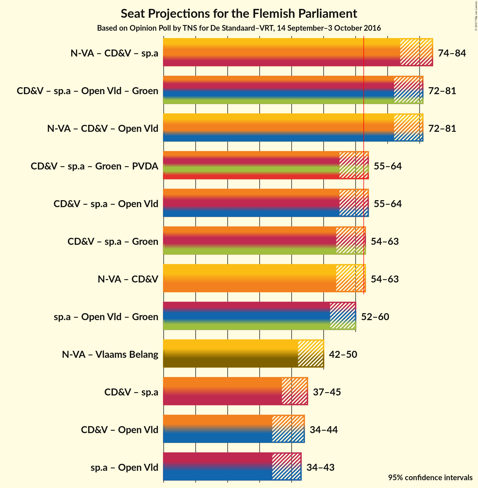

# Opinion Poll by TNS for De Standaard–VRT, 14 September–3 October 2016

<a href="#voting-intentions">Voting Intentions</a> | <a href="#seats">Seats</a> | <a href="#coalitions">Coalitions</a> | <a href="#technical-information">Technical Information</a>

## Voting Intentions

### Confidence Intervals

| Party | Last Result | Poll Result | 80% Confidence Interval | 90% Confidence Interval | 95% Confidence Interval | 99% Confidence Interval |
|:-----:|:-----------:|:-----------:|:-----------------------:|:-----------------------:|:-----------------------:|:-----------------------:|
| N-VA | 31.9% | 28.2% | 26.1–29.7% |25.6–30.2% |25.2–30.7% |24.3–31.6% |
| CD&V | 20.5% | 17.0% | 15.3–18.4% |15.0–18.8% |14.6–19.2% |13.9–20.0% |
| sp.a | 14.0% | 16.0% | 14.4–17.3% |14.0–17.8% |13.7–18.2% |13.0–18.9% |
| Open Vld | 14.1% | 13.8% | 12.3–15.1% |11.9–15.5% |11.6–15.9% |11.1–16.6% |
| Groen | 8.7% | 13.5% | 12.0–14.8% |11.7–15.2% |11.4–15.6% |10.8–16.3% |
| Vlaams Belang | 5.9% | 8.2% | 7.1–9.3% |6.8–9.6% |6.6–10.0% |6.1–10.5% |
| PVDA | 2.5% | 3.4% | 2.7–4.2% |2.6–4.5% |2.4–4.7% |2.1–5.1% |

*Note:* The poll result column reflects the actual value used in the calculations. Published results may vary slightly, and in addition be rounded to fewer digits.

## Seats

### Confidence Intervals

| Party | Last Result | Median | 80% Confidence Interval | 90% Confidence Interval | 95% Confidence Interval | 99% Confidence Interval |
|:-----:|:-----------:|:------:|:-----------------------:|:-----------------------:|:-----------------------:|:-----------------------:|
| <a href="#n-va">N-VA</a> | 43 | 37 | 35–40 |34–41 |34–41 |32–43 |
| <a href="#cd&v">CD&V</a> | 27 | 21 | 19–23 |19–24 |18–25 |16–27 |
| <a href="#sp.a">sp.a</a> | 18 | 20 | 19–23 |19–24 |18–24 |16–25 |
| <a href="#open-vld">Open Vld</a> | 19 | 19 | 16–20 |15–20 |14–21 |13–23 |
| <a href="#groen">Groen</a> | 10 | 17 | 15–20 |15–21 |14–22 |14–23 |
| <a href="#vlaams-belang">Vlaams Belang</a> | 6 | 8 | 8–11 |7–11 |6–11 |6–12 |
| <a href="#pvda">PVDA</a> | 0 | 1 | 0–2 |0–2 |0–2 |0–3 |

### N-VA

| Number of Seats | Probability | Accumulated |
|:---------------:|:-----------:|:-----------:|
| 30 | 0.1% | 100% |
| 31 | 0.3% | 99.9% |
| 32 | 0.6% | 99.7% |
| 33 | 1.0% | 99.1% |
| 34 | 5% | 98% |
| 35 | 9% | 93% |
| 36 | 18% | 84% |
| 37 | 24% | 66% |
| 38 | 13% | 42% |
| 39 | 17% | 29% |
| 40 | 6% | 12% |
| 41 | 4% | 6% |
| 42 | 2% | 2% |
| 43 | 0.6% | 0.7% |
| 44 | 0.1% | 0.1% |
| 45 | 0% | 0% |

### CD&V

| Number of Seats | Probability | Accumulated |
|:---------------:|:-----------:|:-----------:|
| 15 | 0.1% | 100% |
| 16 | 0.4% | 99.9% |
| 17 | 0.9% | 99.5% |
| 18 | 2% | 98.6% |
| 19 | 10% | 97% |
| 20 | 29% | 87% |
| 21 | 26% | 58% |
| 22 | 18% | 32% |
| 23 | 6% | 14% |
| 24 | 4% | 9% |
| 25 | 3% | 5% |
| 26 | 1.2% | 2% |
| 27 | 0.6% | 0.6% |
| 28 | 0% | 0% |

### sp.a

| Number of Seats | Probability | Accumulated |
|:---------------:|:-----------:|:-----------:|
| 15 | 0.2% | 100% |
| 16 | 0.4% | 99.7% |
| 17 | 0.6% | 99.3% |
| 18 | 4% | 98.7% |
| 19 | 44% | 95% |
| 20 | 9% | 51% |
| 21 | 13% | 42% |
| 22 | 8% | 29% |
| 23 | 13% | 21% |
| 24 | 7% | 8% |
| 25 | 1.5% | 2% |
| 26 | 0.2% | 0.3% |
| 27 | 0.1% | 0.1% |
| 28 | 0% | 0% |

### Open Vld

| Number of Seats | Probability | Accumulated |
|:---------------:|:-----------:|:-----------:|
| 12 | 0.1% | 100% |
| 13 | 2% | 99.9% |
| 14 | 2% | 98% |
| 15 | 4% | 96% |
| 16 | 4% | 92% |
| 17 | 12% | 88% |
| 18 | 18% | 76% |
| 19 | 46% | 58% |
| 20 | 8% | 11% |
| 21 | 2% | 3% |
| 22 | 0.6% | 1.4% |
| 23 | 0.7% | 0.8% |
| 24 | 0.1% | 0.1% |
| 25 | 0% | 0% |

### Groen

| Number of Seats | Probability | Accumulated |
|:---------------:|:-----------:|:-----------:|
| 14 | 3% | 100% |
| 15 | 8% | 97% |
| 16 | 9% | 89% |
| 17 | 45% | 80% |
| 18 | 12% | 35% |
| 19 | 8% | 23% |
| 20 | 7% | 15% |
| 21 | 4% | 8% |
| 22 | 2% | 4% |
| 23 | 2% | 2% |
| 24 | 0.1% | 0.1% |
| 25 | 0% | 0% |

### Vlaams Belang

| Number of Seats | Probability | Accumulated |
|:---------------:|:-----------:|:-----------:|
| 4 | 0.2% | 100% |
| 5 | 0.2% | 99.8% |
| 6 | 4% | 99.7% |
| 7 | 2% | 95% |
| 8 | 71% | 93% |
| 9 | 5% | 22% |
| 10 | 4% | 17% |
| 11 | 11% | 13% |
| 12 | 2% | 2% |
| 13 | 0.1% | 0.2% |
| 14 | 0% | 0% |

### PVDA

| Number of Seats | Probability | Accumulated |
|:---------------:|:-----------:|:-----------:|
| 0 | 46% | 100% |
| 1 | 17% | 54% |
| 2 | 37% | 37% |
| 3 | 0.8% | 1.0% |
| 4 | 0% | 0.1% |
| 5 | 0.1% | 0.1% |
| 6 | 0% | 0% |

## Coalitions

### Confidence Intervals

| Coalition | Last Result | Median | 80% Confidence Interval | 90% Confidence Interval | 95% Confidence Interval | 99% Confidence Interval |
|:---------:|:-----------:|:------:|:-----------------------:|:-----------------------:|:-----------------------:|:-----------------------:|
| N-VA – CD&V – sp.a | 88 | 79 | 76–81 | 75–82 | 74–83 | 73–85 |
| CD&V – sp.a – Open Vld – Groen | 74 | 77 | 75–80 | 74–81 | 73–81 | 71–83 |
| N-VA – CD&V – Open Vld | 89 | 76 | 73–80 | 72–80 | 72–81 | 70–82 |
| CD&V – sp.a – Groen – PVDA | 55 | 60 | 57–63 | 56–64 | 55–65 | 54–67 |
| CD&V – sp.a – Open Vld | 64 | 60 | 57–63 | 56–63 | 55–64 | 53–65 |
| CD&V – sp.a – Groen | 55 | 59 | 56–62 | 55–63 | 54–64 | 53–66 |
| N-VA – CD&V | 70 | 58 | 56–61 | 55–62 | 54–63 | 53–65 |
| sp.a – Open Vld – Groen | 47 | 56 | 53–59 | 53–60 | 52–61 | 50–62 |
| N-VA – Vlaams Belang | 49 | 46 | 43–48 | 42–49 | 42–50 | 40–51 |
| CD&V – sp.a | 45 | 41 | 39–44 | 38–45 | 38–46 | 36–48 |
| CD&V – Open Vld | 46 | 40 | 36–42 | 35–43 | 35–44 | 33–45 |
| sp.a – Open Vld | 37 | 38 | 36–42 | 35–42 | 34–43 | 32–44 |

### N-VA – CD&V – sp.a

| Number of Seats | Probability | Accumulated |
|:---------------:|:-----------:|:-----------:|
| 71 | 0% | 100% |
| 72 | 0.2% | 99.9% |
| 73 | 1.3% | 99.8% |
| 74 | 2% | 98% |
| 75 | 4% | 97% |
| 76 | 8% | 93% |
| 77 | 13% | 85% |
| 78 | 16% | 71% |
| 79 | 13% | 55% |
| 80 | 19% | 42% |
| 81 | 13% | 23% |
| 82 | 5% | 10% |
| 83 | 2% | 4% |
| 84 | 1.4% | 2% |
| 85 | 0.4% | 0.8% |
| 86 | 0.3% | 0.4% |
| 87 | 0.1% | 0.1% |
| 88 | 0% | 0% |

### CD&V – sp.a – Open Vld – Groen

| Number of Seats | Probability | Accumulated |
|:---------------:|:-----------:|:-----------:|
| 70 | 0.1% | 100% |
| 71 | 0.4% | 99.8% |
| 72 | 2% | 99.4% |
| 73 | 3% | 98% |
| 74 | 5% | 95% |
| 75 | 9% | 90% |
| 76 | 15% | 81% |
| 77 | 23% | 66% |
| 78 | 15% | 43% |
| 79 | 11% | 28% |
| 80 | 11% | 17% |
| 81 | 4% | 6% |
| 82 | 1.4% | 2% |
| 83 | 0.4% | 0.7% |
| 84 | 0.3% | 0.4% |
| 85 | 0% | 0% |

### N-VA – CD&V – Open Vld

| Number of Seats | Probability | Accumulated |
|:---------------:|:-----------:|:-----------:|
| 68 | 0.1% | 100% |
| 69 | 0.3% | 99.9% |
| 70 | 0.9% | 99.6% |
| 71 | 1.0% | 98.7% |
| 72 | 3% | 98% |
| 73 | 6% | 95% |
| 74 | 9% | 89% |
| 75 | 12% | 79% |
| 76 | 18% | 67% |
| 77 | 13% | 49% |
| 78 | 12% | 36% |
| 79 | 11% | 24% |
| 80 | 10% | 14% |
| 81 | 3% | 4% |
| 82 | 0.9% | 1.4% |
| 83 | 0.4% | 0.5% |
| 84 | 0.1% | 0.1% |
| 85 | 0% | 0% |

### CD&V – sp.a – Groen – PVDA

| Number of Seats | Probability | Accumulated |
|:---------------:|:-----------:|:-----------:|
| 53 | 0.3% | 100% |
| 54 | 0.9% | 99.7% |
| 55 | 1.5% | 98.8% |
| 56 | 4% | 97% |
| 57 | 6% | 93% |
| 58 | 17% | 87% |
| 59 | 13% | 71% |
| 60 | 16% | 57% |
| 61 | 18% | 42% |
| 62 | 11% | 24% |
| 63 | 6% | 13% |
| 64 | 4% | 7% |
| 65 | 1.4% | 3% |
| 66 | 0.8% | 2% |
| 67 | 0.5% | 0.7% |
| 68 | 0.2% | 0.2% |
| 69 | 0% | 0% |

### CD&V – sp.a – Open Vld

| Number of Seats | Probability | Accumulated |
|:---------------:|:-----------:|:-----------:|
| 52 | 0.1% | 100% |
| 53 | 0.5% | 99.8% |
| 54 | 2% | 99.3% |
| 55 | 2% | 98% |
| 56 | 4% | 96% |
| 57 | 7% | 91% |
| 58 | 12% | 84% |
| 59 | 18% | 72% |
| 60 | 21% | 55% |
| 61 | 13% | 34% |
| 62 | 7% | 22% |
| 63 | 10% | 15% |
| 64 | 3% | 4% |
| 65 | 1.3% | 2% |
| 66 | 0.3% | 0.5% |
| 67 | 0.1% | 0.2% |
| 68 | 0% | 0% |

### CD&V – sp.a – Groen

| Number of Seats | Probability | Accumulated |
|:---------------:|:-----------:|:-----------:|
| 52 | 0.2% | 100% |
| 53 | 0.7% | 99.7% |
| 54 | 2% | 99.0% |
| 55 | 3% | 97% |
| 56 | 8% | 94% |
| 57 | 13% | 86% |
| 58 | 16% | 74% |
| 59 | 17% | 57% |
| 60 | 13% | 40% |
| 61 | 13% | 27% |
| 62 | 7% | 14% |
| 63 | 5% | 8% |
| 64 | 2% | 3% |
| 65 | 0.8% | 1.5% |
| 66 | 0.4% | 0.7% |
| 67 | 0.2% | 0.3% |
| 68 | 0% | 0% |

### N-VA – CD&V

| Number of Seats | Probability | Accumulated |
|:---------------:|:-----------:|:-----------:|
| 51 | 0.1% | 100% |
| 52 | 0.4% | 99.9% |
| 53 | 1.1% | 99.5% |
| 54 | 3% | 98% |
| 55 | 5% | 95% |
| 56 | 10% | 91% |
| 57 | 20% | 81% |
| 58 | 16% | 61% |
| 59 | 15% | 45% |
| 60 | 10% | 30% |
| 61 | 12% | 20% |
| 62 | 4% | 7% |
| 63 | 2% | 3% |
| 64 | 0.7% | 1.3% |
| 65 | 0.4% | 0.5% |
| 66 | 0.1% | 0.1% |
| 67 | 0% | 0.1% |
| 68 | 0% | 0% |

### sp.a – Open Vld – Groen

| Number of Seats | Probability | Accumulated |
|:---------------:|:-----------:|:-----------:|
| 47 | 0% | 100% |
| 48 | 0.1% | 99.9% |
| 49 | 0.2% | 99.9% |
| 50 | 0.4% | 99.7% |
| 51 | 1.4% | 99.2% |
| 52 | 3% | 98% |
| 53 | 6% | 95% |
| 54 | 9% | 89% |
| 55 | 20% | 81% |
| 56 | 16% | 60% |
| 57 | 16% | 45% |
| 58 | 11% | 29% |
| 59 | 10% | 18% |
| 60 | 5% | 8% |
| 61 | 2% | 3% |
| 62 | 0.5% | 0.8% |
| 63 | 0.3% | 0.4% |
| 64 | 0.1% | 0.1% |
| 65 | 0% | 0% |

### N-VA – Vlaams Belang

| Number of Seats | Probability | Accumulated |
|:---------------:|:-----------:|:-----------:|
| 38 | 0% | 100% |
| 39 | 0.2% | 99.9% |
| 40 | 0.5% | 99.7% |
| 41 | 0.9% | 99.2% |
| 42 | 5% | 98% |
| 43 | 7% | 94% |
| 44 | 16% | 86% |
| 45 | 19% | 71% |
| 46 | 13% | 52% |
| 47 | 19% | 39% |
| 48 | 11% | 20% |
| 49 | 5% | 9% |
| 50 | 3% | 4% |
| 51 | 1.2% | 2% |
| 52 | 0.3% | 0.4% |
| 53 | 0.1% | 0.1% |
| 54 | 0% | 0% |

### CD&V – sp.a

| Number of Seats | Probability | Accumulated |
|:---------------:|:-----------:|:-----------:|
| 35 | 0.3% | 100% |
| 36 | 0.6% | 99.7% |
| 37 | 0.9% | 99.1% |
| 38 | 6% | 98% |
| 39 | 13% | 92% |
| 40 | 13% | 80% |
| 41 | 19% | 67% |
| 42 | 17% | 48% |
| 43 | 11% | 31% |
| 44 | 11% | 20% |
| 45 | 4% | 8% |
| 46 | 3% | 4% |
| 47 | 0.9% | 1.5% |
| 48 | 0.4% | 0.6% |
| 49 | 0.2% | 0.2% |
| 50 | 0.1% | 0.1% |
| 51 | 0% | 0% |

### CD&V – Open Vld

| Number of Seats | Probability | Accumulated |
|:---------------:|:-----------:|:-----------:|
| 31 | 0.1% | 100% |
| 32 | 0.2% | 99.9% |
| 33 | 0.6% | 99.7% |
| 34 | 2% | 99.2% |
| 35 | 3% | 98% |
| 36 | 5% | 94% |
| 37 | 10% | 89% |
| 38 | 11% | 79% |
| 39 | 17% | 68% |
| 40 | 28% | 52% |
| 41 | 14% | 24% |
| 42 | 3% | 10% |
| 43 | 3% | 7% |
| 44 | 3% | 4% |
| 45 | 1.1% | 1.1% |
| 46 | 0.1% | 0.1% |
| 47 | 0% | 0% |

### sp.a – Open Vld

| Number of Seats | Probability | Accumulated |
|:---------------:|:-----------:|:-----------:|
| 31 | 0% | 100% |
| 32 | 0.5% | 99.9% |
| 33 | 1.0% | 99.4% |
| 34 | 2% | 98% |
| 35 | 3% | 96% |
| 36 | 5% | 93% |
| 37 | 11% | 88% |
| 38 | 31% | 77% |
| 39 | 12% | 45% |
| 40 | 11% | 33% |
| 41 | 8% | 22% |
| 42 | 10% | 15% |
| 43 | 4% | 4% |
| 44 | 0.5% | 0.7% |
| 45 | 0.1% | 0.2% |
| 46 | 0.1% | 0.1% |
| 47 | 0% | 0% |

## Technical Information

### Opinion Poll

+ **Pollster:** TNS
+ **Media:** De Standaard–VRT
+ **Fieldwork period:** 14 September–3 October 2016

### Calculations

+ **Sample size:** 1001
+ **Simulations done:** 1,048,576
+ **Error estimate:** 1.34%

