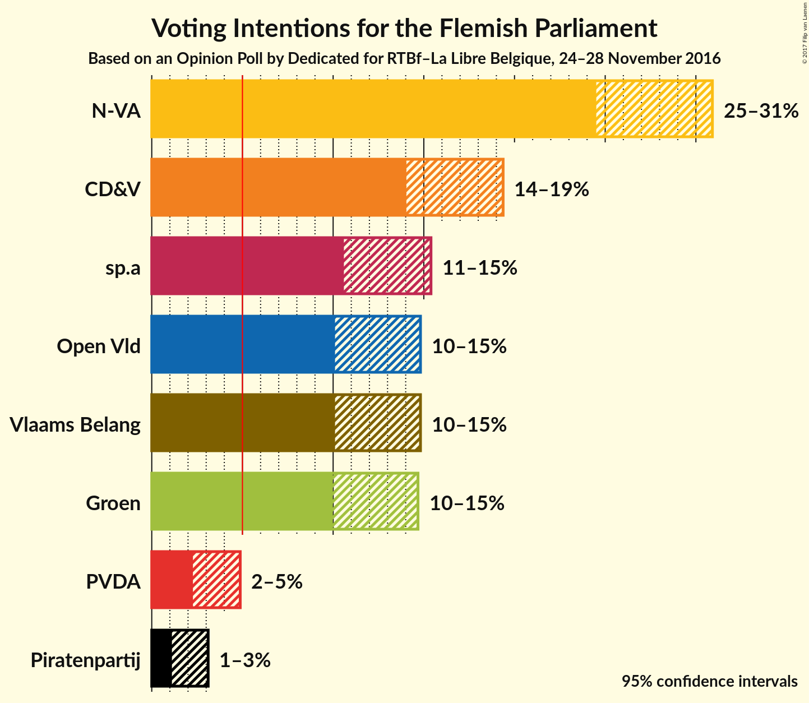
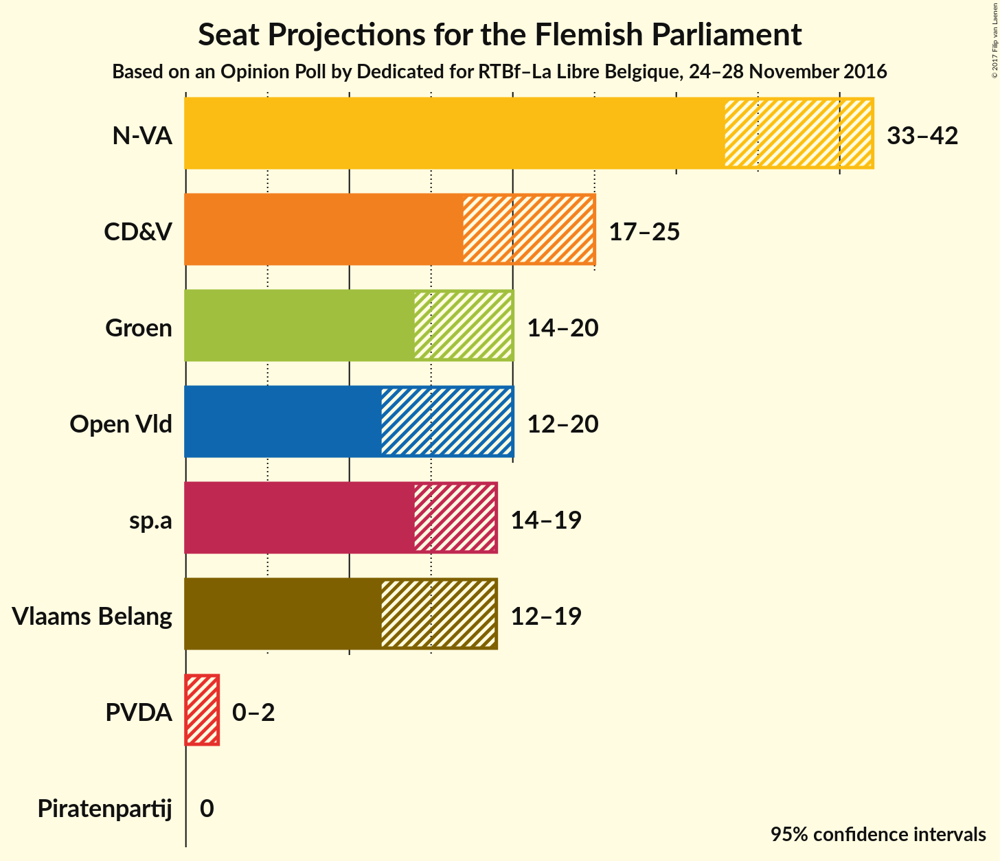

# Opinion Poll by Dedicated for RTBf–La Libre Belgique, 24–28 November 2016

<a href="#voting-intentions">Voting Intentions</a> | <a href="#seats">Seats</a> | <a href="#coalitions">Coalitions</a> | <a href="#technical-information">Technical Information</a>

## Voting Intentions

### Confidence Intervals

| Party | Last Result | Poll Result | 80% Confidence Interval | 90% Confidence Interval | 95% Confidence Interval | 99% Confidence Interval |
|:-----:|:-----------:|:-----------:|:-----------------------:|:-----------------------:|:-----------------------:|:-----------------------:|
| N-VA | 31.9% | 27.9% | 25.6–29.8% |25.0–30.4% |24.5–30.9% |23.6–32.0% |
| CD&V | 20.5% | 16.7% | 14.9–18.4% |14.4–18.9% |14.0–19.4% |13.3–20.3% |
| sp.a | 14.0% | 13.0% | 11.4–14.5% |10.9–15.0% |10.6–15.4% |9.9–16.2% |
| Open Vld | 14.1% | 12.4% | 10.9–13.9% |10.4–14.4% |10.1–14.8% |9.5–15.7% |
| Vlaams Belang | 5.9% | 12.4% | 10.9–13.9% |10.4–14.4% |10.1–14.8% |9.5–15.7% |
| Groen | 8.7% | 12.3% | 10.7–13.8% |10.3–14.3% |10.0–14.7% |9.3–15.5% |
| PVDA | 2.5% | 3.4% | 2.6–4.3% |2.4–4.6% |2.3–4.9% |2.0–5.4% |
| Piratenpartij | N/A | 1.9% | 1.4–2.7% |1.2–2.9% |1.1–3.1% |0.9–3.6% |

*Note:* The poll result column reflects the actual value used in the calculations. Published results may vary slightly, and in addition be rounded to fewer digits.

## Seats

### Confidence Intervals

| Party | Last Result | 80% Confidence Interval | 90% Confidence Interval | 95% Confidence Interval | 99% Confidence Interval |
|:-----:|:-----------:|:-----------------------:|:-----------------------:|:-----------------------:|:-----------------------:|
| <a href="#n-va">N-VA</a> | 43 | 34–40 |34–42 |33–43 |31–44 |
| <a href="#cd&v">CD&V</a> | 27 | 19–24 |18–25 |17–26 |16–27 |
| <a href="#sp.a">sp.a</a> | 18 | 14–19 |14–19 |14–19 |13–22 |
| <a href="#open-vld">Open Vld</a> | 19 | 13–19 |13–19 |12–20 |12–21 |
| <a href="#vlaams-belang">Vlaams Belang</a> | 6 | 12–18 |12–18 |12–20 |11–20 |
| <a href="#groen">Groen</a> | 10 | 14–18 |14–19 |14–20 |12–23 |
| <a href="#pvda">PVDA</a> | 0 | 0–2 |0–2 |0–2 |0–5 |
| <a href="#piratenpartij">Piratenpartij</a> | N/A | 0 |0 |0 |0 |

### N-VA

| Number of Seats | Probability | Accumulated |
|:---------------:|:-----------:|:-----------:|
| 30 | 0.2% | 100% |
| 31 | 0.8% | 99.7% |
| 32 | 1.0% | 99.0% |
| 33 | 3% | 98% |
| 34 | 7% | 95% |
| 35 | 12% | 89% |
| 36 | 12% | 76% |
| 37 | 21% | 64% |
| 38 | 15% | 43% |
| 39 | 13% | 27% |
| 40 | 7% | 14% |
| 41 | 3% | 8% |
| 42 | 2% | 5% |
| 43 | 2% | 3% |
| 44 | 0.4% | 0.6% |
| 45 | 0.1% | 0.2% |
| 46 | 0.1% | 0.1% |
| 47 | 0% | 0% |

### CD&V

| Number of Seats | Probability | Accumulated |
|:---------------:|:-----------:|:-----------:|
| 15 | 0.2% | 100% |
| 16 | 2% | 99.8% |
| 17 | 1.4% | 98% |
| 18 | 2% | 96% |
| 19 | 7% | 94% |
| 20 | 41% | 87% |
| 21 | 15% | 46% |
| 22 | 12% | 31% |
| 23 | 5% | 19% |
| 24 | 6% | 13% |
| 25 | 3% | 7% |
| 26 | 2% | 3% |
| 27 | 0.9% | 1.1% |
| 28 | 0.1% | 0.1% |
| 29 | 0% | 0% |

### sp.a

| Number of Seats | Probability | Accumulated |
|:---------------:|:-----------:|:-----------:|
| 10 | 0.1% | 100% |
| 11 | 0.1% | 99.9% |
| 12 | 0.2% | 99.9% |
| 13 | 0.8% | 99.7% |
| 14 | 19% | 98.9% |
| 15 | 12% | 80% |
| 16 | 12% | 68% |
| 17 | 13% | 56% |
| 18 | 21% | 43% |
| 19 | 20% | 22% |
| 20 | 0.9% | 2% |
| 21 | 0.2% | 0.8% |
| 22 | 0.3% | 0.6% |
| 23 | 0.2% | 0.3% |
| 24 | 0.1% | 0.1% |
| 25 | 0% | 0% |

### Open Vld

| Number of Seats | Probability | Accumulated |
|:---------------:|:-----------:|:-----------:|
| 11 | 0.1% | 100% |
| 12 | 4% | 99.9% |
| 13 | 21% | 96% |
| 14 | 15% | 75% |
| 15 | 9% | 60% |
| 16 | 8% | 51% |
| 17 | 16% | 43% |
| 18 | 14% | 28% |
| 19 | 11% | 14% |
| 20 | 2% | 3% |
| 21 | 0.4% | 0.7% |
| 22 | 0.1% | 0.2% |
| 23 | 0.1% | 0.1% |
| 24 | 0% | 0% |

### Vlaams Belang

| Number of Seats | Probability | Accumulated |
|:---------------:|:-----------:|:-----------:|
| 9 | 0% | 100% |
| 10 | 0.2% | 99.9% |
| 11 | 2% | 99.7% |
| 12 | 11% | 98% |
| 13 | 5% | 87% |
| 14 | 9% | 82% |
| 15 | 20% | 72% |
| 16 | 22% | 52% |
| 17 | 13% | 30% |
| 18 | 12% | 17% |
| 19 | 2% | 5% |
| 20 | 3% | 3% |
| 21 | 0.3% | 0.4% |
| 22 | 0.1% | 0.1% |
| 23 | 0% | 0% |

### Groen

| Number of Seats | Probability | Accumulated |
|:---------------:|:-----------:|:-----------:|
| 10 | 0.3% | 100% |
| 11 | 0.2% | 99.7% |
| 12 | 0.6% | 99.6% |
| 13 | 1.2% | 99.0% |
| 14 | 19% | 98% |
| 15 | 18% | 79% |
| 16 | 10% | 61% |
| 17 | 31% | 52% |
| 18 | 12% | 20% |
| 19 | 5% | 8% |
| 20 | 2% | 4% |
| 21 | 0.8% | 2% |
| 22 | 0.5% | 1.0% |
| 23 | 0.5% | 0.5% |
| 24 | 0% | 0% |

### PVDA

| Number of Seats | Probability | Accumulated |
|:---------------:|:-----------:|:-----------:|
| 0 | 52% | 100% |
| 1 | 6% | 48% |
| 2 | 40% | 42% |
| 3 | 2% | 2% |
| 4 | 0.2% | 0.7% |
| 5 | 0.5% | 0.5% |
| 6 | 0% | 0% |

### Piratenpartij

| Number of Seats | Probability | Accumulated |
|:---------------:|:-----------:|:-----------:|
| 0 | 99.8% | 100% |
| 1 | 0.1% | 0.2% |
| 2 | 0% | 0% |

## Coalitions

### Confidence Intervals

| Coalition | Last Result | 80% Confidence Interval | 90% Confidence Interval | 95% Confidence Interval | 99% Confidence Interval |
|:---------:|:-----------:|:-----------------------:|:-----------------------:|:-----------------------:|:-----------------------:|
| N-VA – CD&V – Open Vld | 89 | 71–78 | 70–80 | 69–81 | 67–83 |
| N-VA – CD&V – sp.a | 88 | 71–78 | 70–80 | 69–81 | 68–82 |
| CD&V – sp.a – Open Vld – Groen | 74 | 66–73 | 65–74 | 64–75 | 62–77 |
| N-VA – CD&V | 70 | 55–62 | 54–63 | 53–64 | 52–66 |
| CD&V – sp.a – Groen – PVDA | 55 | 51–58 | 51–59 | 50–60 | 48–62 |
| CD&V – sp.a – Groen | 55 | 50–58 | 49–59 | 48–60 | 47–62 |
| CD&V – sp.a – Open Vld | 64 | 50–57 | 49–59 | 48–59 | 47–61 |
| N-VA – Vlaams Belang | 49 | 49–56 | 48–57 | 47–58 | 46–60 |
| sp.a – Open Vld – Groen | 47 | 45–52 | 44–53 | 43–54 | 41–56 |
| CD&V – sp.a | 45 | 34–41 | 34–42 | 33–43 | 31–45 |
| CD&V – Open Vld | 46 | 34–40 | 33–42 | 32–43 | 30–44 |
| sp.a – Open Vld | 37 | 29–36 | 28–37 | 28–38 | 26–39 |

## Technical Information

### Opinion Poll

+ **Pollster:** Dedicated
+ **Media:** RTBf–La Libre Belgique
+ **Fieldwork period:** 24–28 November 2016

### Calculations

+ **Sample size:** 741
+ **Simulations done:** 1,048,576
+ **Error estimate:** 2.41%

