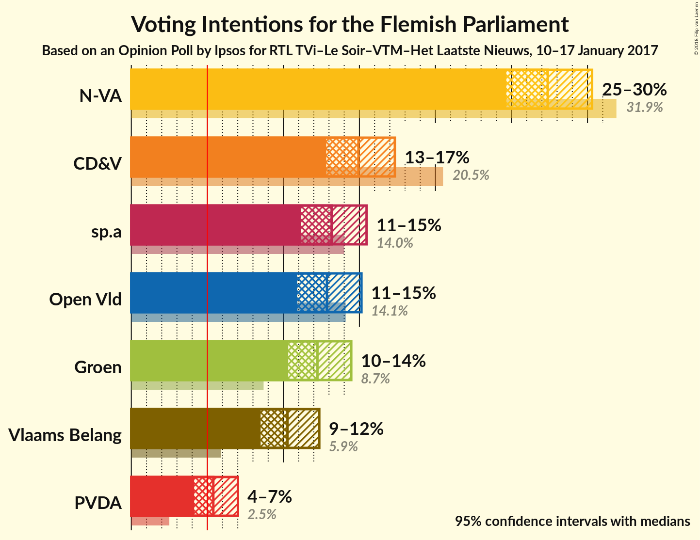
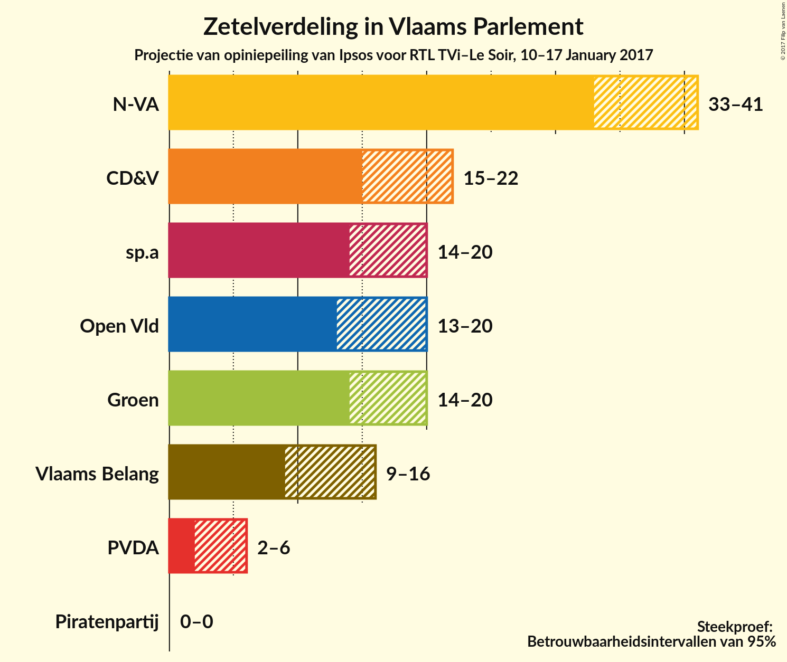
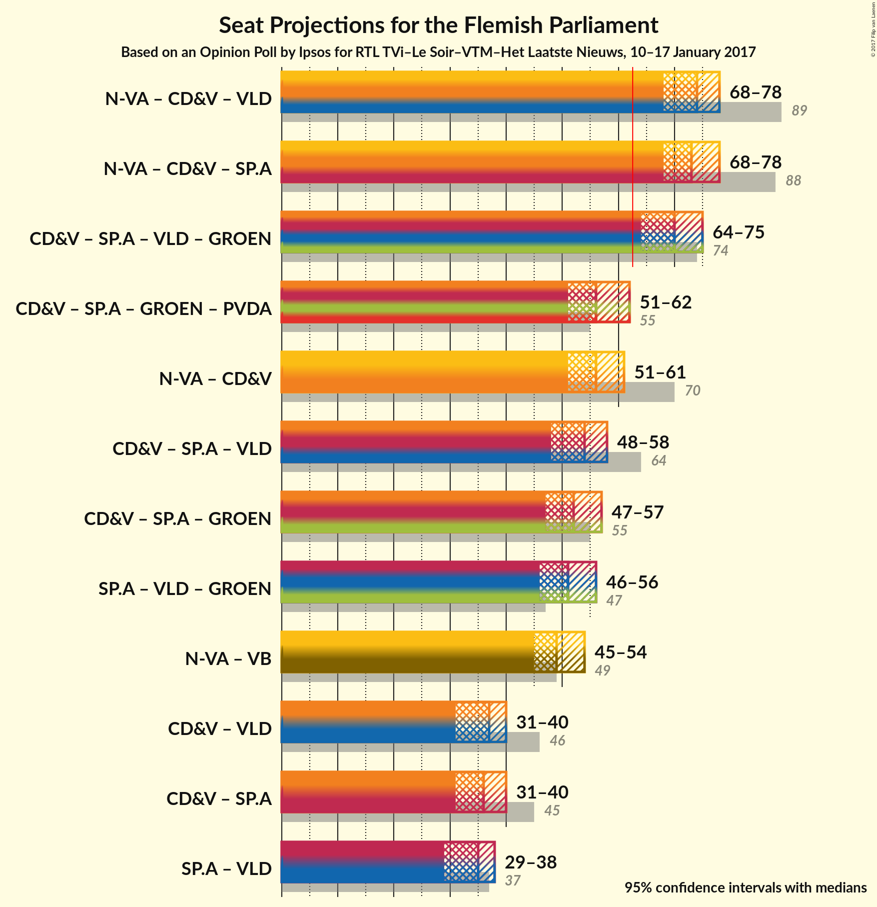

# Opinion Poll by Ipsos for RTL TVi–Le Soir–VTM–Het Laatste Nieuws, 10–17 January 2017

<a href="#voting-intentions">Voting Intentions</a> | <a href="#seats">Seats</a> | <a href="#coalitions">Coalitions</a> | <a href="#technical-information">Technical Information</a>

## Voting Intentions

### Confidence Intervals

| Party | Last Result | Poll Result | 80% Confidence Interval | 90% Confidence Interval | 95% Confidence Interval | 99% Confidence Interval |
|:-----:|:-----------:|:-----------:|:-----------------------:|:-----------------------:|:-----------------------:|:-----------------------:|
| N-VA | 31.9% | 27.4% | 25.6–29.3% |25.1–29.8% |24.7–30.3% |23.8–31.2% |
| CD&V | 20.5% | 14.9% | 13.5–16.5% |13.2–16.9% |12.8–17.3% |12.2–18.1% |
| sp.a | 14.0% | 13.2% | 11.9–14.7% |11.5–15.1% |11.2–15.5% |10.6–16.2% |
| Open Vld | 14.1% | 12.9% | 11.6–14.3% |11.2–14.8% |10.9–15.1% |10.3–15.9% |
| Groen | 8.7% | 12.2% | 11.0–13.7% |10.6–14.1% |10.3–14.5% |9.7–15.2% |
| Vlaams Belang | 5.9% | 10.3% | 9.1–11.6% |8.8–12.0% |8.5–12.4% |8.0–13.0% |
| PVDA | 2.5% | 5.4% | 4.6–6.4% |4.3–6.8% |4.1–7.0% |3.8–7.5% |

*Note:* The poll result column reflects the actual value used in the calculations. Published results may vary slightly, and in addition be rounded to fewer digits.

## Seats

### Confidence Intervals

| Party | Last Result | Median | 80% Confidence Interval | 90% Confidence Interval | 95% Confidence Interval | 99% Confidence Interval |
|:-----:|:-----------:|:------:|:-----------------------:|:-----------------------:|:-----------------------:|:-----------------------:|
| <a href="#n-va">N-VA</a> | 43 | 38 | 34–39 |33–41 |33–41 |32–43 |
| <a href="#cd&v">CD&V</a> | 27 | 20 | 16–20 |15–21 |15–22 |15–24 |
| <a href="#sp.a">sp.a</a> | 18 | 17 | 14–19 |14–19 |14–20 |14–22 |
| <a href="#open-vld">Open Vld</a> | 19 | 18 | 14–19 |13–20 |13–20 |12–22 |
| <a href="#groen">Groen</a> | 10 | 17 | 14–18 |14–19 |14–20 |13–22 |
| <a href="#vlaams-belang">Vlaams Belang</a> | 6 | 12 | 10–15 |9–16 |9–16 |8–17 |
| <a href="#pvda">PVDA</a> | 0 | 5 | 2–5 |2–5 |2–6 |2–9 |

### N-VA

*For a full overview of the results for this party, see the [N-VA](party-nva.html) page.*

| Number of Seats | Probability | Accumulated | Special Marks |
|:---------------:|:-----------:|:-----------:|:-------------:|
| 30 | 0.1% | 100% |  |
| 31 | 0.2% | 99.9% |  |
| 32 | 0.8% | 99.7% |  |
| 33 | 5% | 99.0% |  |
| 34 | 8% | 94% |  |
| 35 | 10% | 86% |  |
| 36 | 9% | 76% |  |
| 37 | 16% | 67% |  |
| 38 | 33% | 51% | Median |
| 39 | 9% | 19% |  |
| 40 | 5% | 10% |  |
| 41 | 3% | 5% |  |
| 42 | 1.4% | 2% |  |
| 43 | 0.8% | 1.1% | Last Result |
| 44 | 0.3% | 0.3% |  |
| 45 | 0% | 0% |  |

### CD&V

*For a full overview of the results for this party, see the [CD&V](party-cdv.html) page.*

| Number of Seats | Probability | Accumulated | Special Marks |
|:---------------:|:-----------:|:-----------:|:-------------:|
| 14 | 0.1% | 100% |  |
| 15 | 7% | 99.9% |  |
| 16 | 11% | 93% |  |
| 17 | 5% | 81% |  |
| 18 | 8% | 76% |  |
| 19 | 12% | 69% |  |
| 20 | 50% | 57% | Median |
| 21 | 4% | 7% |  |
| 22 | 2% | 3% |  |
| 23 | 0.7% | 2% |  |
| 24 | 0.5% | 0.8% |  |
| 25 | 0.3% | 0.4% |  |
| 26 | 0.1% | 0.1% |  |
| 27 | 0% | 0% | Last Result |

### sp.a

*For a full overview of the results for this party, see the [sp.a](party-spa.html) page.*

| Number of Seats | Probability | Accumulated | Special Marks |
|:---------------:|:-----------:|:-----------:|:-------------:|
| 13 | 0.2% | 100% |  |
| 14 | 13% | 99.8% |  |
| 15 | 9% | 87% |  |
| 16 | 10% | 78% |  |
| 17 | 25% | 68% | Median |
| 18 | 13% | 43% | Last Result |
| 19 | 27% | 30% |  |
| 20 | 2% | 3% |  |
| 21 | 1.0% | 2% |  |
| 22 | 0.4% | 0.7% |  |
| 23 | 0.2% | 0.3% |  |
| 24 | 0.1% | 0.1% |  |
| 25 | 0% | 0% |  |

### Open Vld

*For a full overview of the results for this party, see the [Open Vld](party-openvld.html) page.*

| Number of Seats | Probability | Accumulated | Special Marks |
|:---------------:|:-----------:|:-----------:|:-------------:|
| 12 | 0.7% | 100% |  |
| 13 | 8% | 99.3% |  |
| 14 | 4% | 92% |  |
| 15 | 5% | 87% |  |
| 16 | 6% | 82% |  |
| 17 | 12% | 76% |  |
| 18 | 19% | 64% | Median |
| 19 | 39% | 45% | Last Result |
| 20 | 4% | 5% |  |
| 21 | 0.7% | 1.4% |  |
| 22 | 0.4% | 0.7% |  |
| 23 | 0.3% | 0.3% |  |
| 24 | 0% | 0% |  |

### Groen

*For a full overview of the results for this party, see the [Groen](party-groen.html) page.*

| Number of Seats | Probability | Accumulated | Special Marks |
|:---------------:|:-----------:|:-----------:|:-------------:|
| 10 | 0% | 100% | Last Result |
| 11 | 0% | 100% |  |
| 12 | 0.1% | 100% |  |
| 13 | 0.4% | 99.9% |  |
| 14 | 14% | 99.5% |  |
| 15 | 26% | 86% |  |
| 16 | 8% | 59% |  |
| 17 | 29% | 51% | Median |
| 18 | 13% | 22% |  |
| 19 | 6% | 9% |  |
| 20 | 1.2% | 3% |  |
| 21 | 0.6% | 2% |  |
| 22 | 0.5% | 0.9% |  |
| 23 | 0.4% | 0.4% |  |
| 24 | 0% | 0% |  |

### Vlaams Belang

*For a full overview of the results for this party, see the [Vlaams Belang](party-vlaamsbelang.html) page.*

| Number of Seats | Probability | Accumulated | Special Marks |
|:---------------:|:-----------:|:-----------:|:-------------:|
| 6 | 0% | 100% | Last Result |
| 7 | 0% | 100% |  |
| 8 | 2% | 100% |  |
| 9 | 3% | 98% |  |
| 10 | 7% | 94% |  |
| 11 | 29% | 87% |  |
| 12 | 24% | 58% | Median |
| 13 | 15% | 34% |  |
| 14 | 9% | 19% |  |
| 15 | 4% | 11% |  |
| 16 | 6% | 7% |  |
| 17 | 1.3% | 1.3% |  |
| 18 | 0% | 0.1% |  |
| 19 | 0% | 0% |  |

### PVDA

*For a full overview of the results for this party, see the [PVDA](party-pvda.html) page.*

| Number of Seats | Probability | Accumulated | Special Marks |
|:---------------:|:-----------:|:-----------:|:-------------:|
| 0 | 0% | 100% | Last Result |
| 1 | 0.1% | 100% |  |
| 2 | 22% | 99.9% |  |
| 3 | 22% | 78% |  |
| 4 | 5% | 56% |  |
| 5 | 48% | 51% | Median |
| 6 | 1.1% | 3% |  |
| 7 | 0.8% | 2% |  |
| 8 | 0.7% | 1.4% |  |
| 9 | 0.7% | 0.7% |  |
| 10 | 0% | 0% |  |

## Coalitions

### Confidence Intervals

| Coalition | Last Result | Median | Majority? | 80% Confidence Interval | 90% Confidence Interval | 95% Confidence Interval | 99% Confidence Interval |
|:---------:|:-----------:|:------:|:---------:|:-----------------------:|:-----------------------:|:-----------------------:|:-----------------------:|
| N-VA – CD&V – Open Vld | 89 | 74 | 100% | 70–77 | 69–78 | 68–78 | 66–80 |
| N-VA – CD&V – sp.a | 88 | 73 | 100% | 70–76 | 69–77 | 68–78 | 67–80 |
| CD&V – sp.a – Open Vld – Groen | 74 | 70 | 99.6% | 66–73 | 65–74 | 64–75 | 63–76 |
| CD&V – sp.a – Groen – PVDA | 55 | 56 | 1.3% | 53–59 | 52–61 | 51–62 | 50–63 |
| N-VA – CD&V | 70 | 56 | 0.5% | 53–59 | 52–60 | 51–61 | 49–63 |
| CD&V – sp.a – Open Vld | 64 | 54 | 0% | 50–57 | 49–58 | 48–58 | 46–59 |
| CD&V – sp.a – Groen | 55 | 52 | 0% | 49–56 | 48–57 | 47–57 | 46–59 |
| sp.a – Open Vld – Groen | 47 | 51 | 0% | 47–54 | 46–55 | 46–56 | 44–57 |
| N-VA – Vlaams Belang | 49 | 49 | 0% | 46–53 | 45–54 | 45–54 | 43–56 |
| CD&V – Open Vld | 46 | 37 | 0% | 33–39 | 32–40 | 31–40 | 29–42 |
| CD&V – sp.a | 45 | 36 | 0% | 33–39 | 32–39 | 31–40 | 30–42 |
| sp.a – Open Vld | 37 | 35 | 0% | 31–38 | 30–38 | 29–38 | 28–40 |

### N-VA – CD&V – Open Vld

| Number of Seats | Probability | Accumulated | Special Marks |
|:---------------:|:-----------:|:-----------:|:-------------:|
| 64 | 0% | 100% |  |
| 65 | 0.2% | 99.9% |  |
| 66 | 0.3% | 99.8% |  |
| 67 | 1.1% | 99.5% |  |
| 68 | 2% | 98% |  |
| 69 | 4% | 96% |  |
| 70 | 5% | 92% |  |
| 71 | 10% | 87% |  |
| 72 | 12% | 77% |  |
| 73 | 15% | 66% |  |
| 74 | 13% | 51% |  |
| 75 | 13% | 38% |  |
| 76 | 11% | 25% | Median |
| 77 | 8% | 14% |  |
| 78 | 3% | 6% |  |
| 79 | 1.5% | 2% |  |
| 80 | 0.7% | 1.0% |  |
| 81 | 0.2% | 0.2% |  |
| 82 | 0% | 0.1% |  |
| 83 | 0% | 0% |  |
| 84 | 0% | 0% |  |
| 85 | 0% | 0% |  |
| 86 | 0% | 0% |  |
| 87 | 0% | 0% |  |
| 88 | 0% | 0% |  |
| 89 | 0% | 0% | Last Result |

### N-VA – CD&V – sp.a

| Number of Seats | Probability | Accumulated | Special Marks |
|:---------------:|:-----------:|:-----------:|:-------------:|
| 65 | 0.1% | 100% |  |
| 66 | 0.2% | 99.9% |  |
| 67 | 0.6% | 99.6% |  |
| 68 | 3% | 99.1% |  |
| 69 | 4% | 97% |  |
| 70 | 6% | 92% |  |
| 71 | 9% | 86% |  |
| 72 | 15% | 77% |  |
| 73 | 19% | 61% |  |
| 74 | 14% | 42% |  |
| 75 | 13% | 28% | Median |
| 76 | 7% | 15% |  |
| 77 | 4% | 8% |  |
| 78 | 2% | 4% |  |
| 79 | 1.0% | 2% |  |
| 80 | 0.6% | 0.9% |  |
| 81 | 0.2% | 0.3% |  |
| 82 | 0.1% | 0.1% |  |
| 83 | 0% | 0% |  |
| 84 | 0% | 0% |  |
| 85 | 0% | 0% |  |
| 86 | 0% | 0% |  |
| 87 | 0% | 0% |  |
| 88 | 0% | 0% | Last Result |

### CD&V – sp.a – Open Vld – Groen

| Number of Seats | Probability | Accumulated | Special Marks |
|:---------------:|:-----------:|:-----------:|:-------------:|
| 60 | 0% | 100% |  |
| 61 | 0.1% | 99.9% |  |
| 62 | 0.2% | 99.8% |  |
| 63 | 0.6% | 99.6% | Majority |
| 64 | 2% | 99.0% |  |
| 65 | 3% | 97% |  |
| 66 | 5% | 95% |  |
| 67 | 8% | 89% |  |
| 68 | 11% | 81% |  |
| 69 | 12% | 70% |  |
| 70 | 13% | 58% |  |
| 71 | 16% | 44% |  |
| 72 | 15% | 29% | Median |
| 73 | 7% | 14% |  |
| 74 | 4% | 7% | Last Result |
| 75 | 3% | 3% |  |
| 76 | 0.6% | 0.8% |  |
| 77 | 0.1% | 0.2% |  |
| 78 | 0.1% | 0.1% |  |
| 79 | 0% | 0% |  |

### CD&V – sp.a – Groen – PVDA

| Number of Seats | Probability | Accumulated | Special Marks |
|:---------------:|:-----------:|:-----------:|:-------------:|
| 48 | 0.1% | 100% |  |
| 49 | 0.2% | 99.9% |  |
| 50 | 0.7% | 99.6% |  |
| 51 | 2% | 98.9% |  |
| 52 | 4% | 97% |  |
| 53 | 7% | 92% |  |
| 54 | 12% | 85% |  |
| 55 | 13% | 73% | Last Result |
| 56 | 13% | 60% |  |
| 57 | 13% | 47% |  |
| 58 | 14% | 34% |  |
| 59 | 10% | 20% | Median |
| 60 | 5% | 10% |  |
| 61 | 3% | 5% |  |
| 62 | 1.3% | 3% |  |
| 63 | 0.8% | 1.3% | Majority |
| 64 | 0.3% | 0.4% |  |
| 65 | 0.1% | 0.1% |  |
| 66 | 0% | 0% |  |

### N-VA – CD&V

| Number of Seats | Probability | Accumulated | Special Marks |
|:---------------:|:-----------:|:-----------:|:-------------:|
| 48 | 0.1% | 100% |  |
| 49 | 0.7% | 99.9% |  |
| 50 | 1.0% | 99.3% |  |
| 51 | 2% | 98% |  |
| 52 | 3% | 97% |  |
| 53 | 9% | 94% |  |
| 54 | 14% | 85% |  |
| 55 | 13% | 71% |  |
| 56 | 13% | 59% |  |
| 57 | 18% | 45% |  |
| 58 | 15% | 28% | Median |
| 59 | 6% | 12% |  |
| 60 | 3% | 6% |  |
| 61 | 2% | 3% |  |
| 62 | 0.9% | 1.4% |  |
| 63 | 0.4% | 0.5% | Majority |
| 64 | 0.1% | 0.2% |  |
| 65 | 0% | 0.1% |  |
| 66 | 0% | 0% |  |
| 67 | 0% | 0% |  |
| 68 | 0% | 0% |  |
| 69 | 0% | 0% |  |
| 70 | 0% | 0% | Last Result |

### CD&V – sp.a – Open Vld

| Number of Seats | Probability | Accumulated | Special Marks |
|:---------------:|:-----------:|:-----------:|:-------------:|
| 44 | 0.1% | 100% |  |
| 45 | 0.1% | 99.9% |  |
| 46 | 0.4% | 99.8% |  |
| 47 | 0.8% | 99.4% |  |
| 48 | 2% | 98.6% |  |
| 49 | 5% | 96% |  |
| 50 | 6% | 92% |  |
| 51 | 8% | 86% |  |
| 52 | 10% | 78% |  |
| 53 | 14% | 67% |  |
| 54 | 16% | 53% |  |
| 55 | 13% | 37% | Median |
| 56 | 10% | 24% |  |
| 57 | 8% | 15% |  |
| 58 | 6% | 7% |  |
| 59 | 1.0% | 1.5% |  |
| 60 | 0.3% | 0.5% |  |
| 61 | 0.1% | 0.2% |  |
| 62 | 0% | 0% |  |
| 63 | 0% | 0% | Majority |
| 64 | 0% | 0% | Last Result |

### CD&V – sp.a – Groen

| Number of Seats | Probability | Accumulated | Special Marks |
|:---------------:|:-----------:|:-----------:|:-------------:|
| 44 | 0.1% | 100% |  |
| 45 | 0.3% | 99.9% |  |
| 46 | 0.6% | 99.6% |  |
| 47 | 1.5% | 99.0% |  |
| 48 | 5% | 97% |  |
| 49 | 7% | 92% |  |
| 50 | 9% | 85% |  |
| 51 | 11% | 76% |  |
| 52 | 16% | 65% |  |
| 53 | 18% | 49% |  |
| 54 | 12% | 31% | Median |
| 55 | 8% | 19% | Last Result |
| 56 | 6% | 11% |  |
| 57 | 3% | 5% |  |
| 58 | 1.4% | 2% |  |
| 59 | 0.5% | 0.9% |  |
| 60 | 0.2% | 0.4% |  |
| 61 | 0.1% | 0.1% |  |
| 62 | 0% | 0% |  |

### sp.a – Open Vld – Groen

| Number of Seats | Probability | Accumulated | Special Marks |
|:---------------:|:-----------:|:-----------:|:-------------:|
| 42 | 0.1% | 100% |  |
| 43 | 0.2% | 99.9% |  |
| 44 | 0.6% | 99.7% |  |
| 45 | 2% | 99.1% |  |
| 46 | 3% | 98% |  |
| 47 | 5% | 95% | Last Result |
| 48 | 8% | 89% |  |
| 49 | 8% | 81% |  |
| 50 | 12% | 73% |  |
| 51 | 15% | 61% |  |
| 52 | 19% | 46% | Median |
| 53 | 12% | 27% |  |
| 54 | 6% | 15% |  |
| 55 | 5% | 9% |  |
| 56 | 3% | 4% |  |
| 57 | 0.6% | 0.9% |  |
| 58 | 0.2% | 0.3% |  |
| 59 | 0.1% | 0.1% |  |
| 60 | 0% | 0% |  |

### N-VA – Vlaams Belang

| Number of Seats | Probability | Accumulated | Special Marks |
|:---------------:|:-----------:|:-----------:|:-------------:|
| 42 | 0.2% | 100% |  |
| 43 | 0.5% | 99.8% |  |
| 44 | 1.0% | 99.2% |  |
| 45 | 5% | 98% |  |
| 46 | 10% | 93% |  |
| 47 | 9% | 83% |  |
| 48 | 12% | 74% |  |
| 49 | 17% | 62% | Last Result |
| 50 | 17% | 45% | Median |
| 51 | 10% | 28% |  |
| 52 | 7% | 18% |  |
| 53 | 5% | 11% |  |
| 54 | 4% | 6% |  |
| 55 | 1.3% | 2% |  |
| 56 | 0.5% | 0.8% |  |
| 57 | 0.2% | 0.4% |  |
| 58 | 0.1% | 0.2% |  |
| 59 | 0% | 0.1% |  |
| 60 | 0% | 0% |  |

### CD&V – Open Vld

| Number of Seats | Probability | Accumulated | Special Marks |
|:---------------:|:-----------:|:-----------:|:-------------:|
| 28 | 0.2% | 100% |  |
| 29 | 0.6% | 99.8% |  |
| 30 | 1.0% | 99.2% |  |
| 31 | 1.5% | 98% |  |
| 32 | 3% | 97% |  |
| 33 | 8% | 94% |  |
| 34 | 10% | 85% |  |
| 35 | 12% | 75% |  |
| 36 | 9% | 63% |  |
| 37 | 12% | 54% |  |
| 38 | 16% | 42% | Median |
| 39 | 21% | 26% |  |
| 40 | 3% | 5% |  |
| 41 | 1.1% | 2% |  |
| 42 | 0.5% | 0.9% |  |
| 43 | 0.3% | 0.3% |  |
| 44 | 0.1% | 0.1% |  |
| 45 | 0% | 0% |  |
| 46 | 0% | 0% | Last Result |

### CD&V – sp.a

| Number of Seats | Probability | Accumulated | Special Marks |
|:---------------:|:-----------:|:-----------:|:-------------:|
| 29 | 0.2% | 100% |  |
| 30 | 2% | 99.8% |  |
| 31 | 2% | 98% |  |
| 32 | 4% | 96% |  |
| 33 | 5% | 93% |  |
| 34 | 14% | 88% |  |
| 35 | 16% | 73% |  |
| 36 | 13% | 58% |  |
| 37 | 16% | 44% | Median |
| 38 | 12% | 28% |  |
| 39 | 12% | 16% |  |
| 40 | 2% | 4% |  |
| 41 | 0.9% | 2% |  |
| 42 | 0.5% | 0.8% |  |
| 43 | 0.2% | 0.4% |  |
| 44 | 0.1% | 0.1% |  |
| 45 | 0% | 0% | Last Result |

### sp.a – Open Vld

| Number of Seats | Probability | Accumulated | Special Marks |
|:---------------:|:-----------:|:-----------:|:-------------:|
| 27 | 0.3% | 100% |  |
| 28 | 0.6% | 99.6% |  |
| 29 | 2% | 99.0% |  |
| 30 | 4% | 97% |  |
| 31 | 5% | 93% |  |
| 32 | 8% | 89% |  |
| 33 | 13% | 80% |  |
| 34 | 13% | 68% |  |
| 35 | 14% | 55% | Median |
| 36 | 14% | 40% |  |
| 37 | 12% | 26% | Last Result |
| 38 | 12% | 15% |  |
| 39 | 1.4% | 2% |  |
| 40 | 0.6% | 0.9% |  |
| 41 | 0.2% | 0.3% |  |
| 42 | 0.1% | 0.1% |  |
| 43 | 0% | 0% |  |

## Technical Information

### Opinion Poll

+ **Pollster:** Ipsos
+ **Media:** RTL TVi–Le Soir–VTM–Het Laatste Nieuws
+ **Fieldwork period:** 10–17 January 2017

### Calculations

+ **Sample size:** 964
+ **Simulations done:** 16,777,216
+ **Error estimate:** 0.41%

