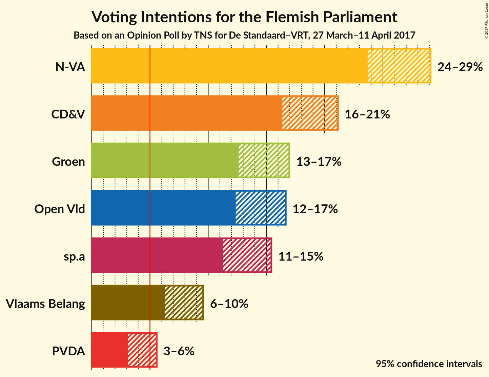
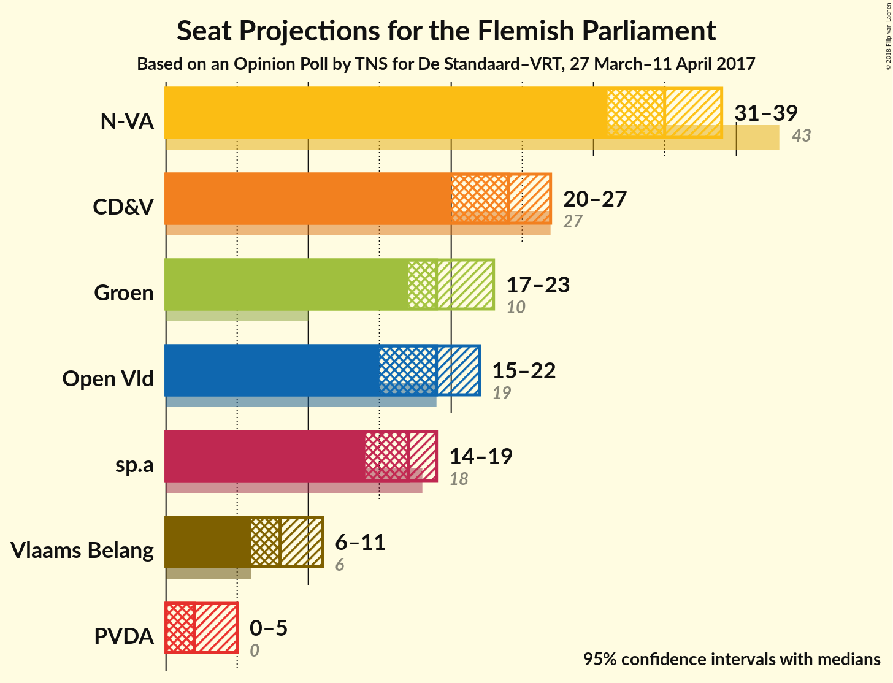
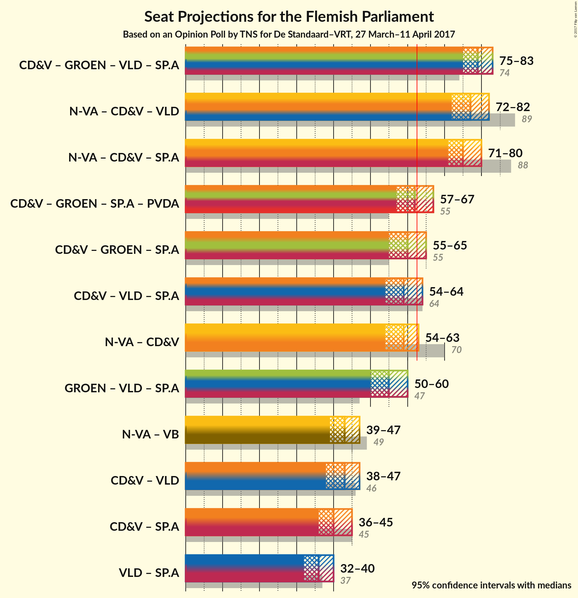

# Opinion Poll by TNS for De Standaard–VRT, 27 March–11 April 2017

<a href="#voting-intentions">Voting Intentions</a> | <a href="#seats">Seats</a> | <a href="#coalitions">Coalitions</a> | <a href="#technical-information">Technical Information</a>

## Voting Intentions

### Confidence Intervals

| Party | Last Result | Poll Result | 80% Confidence Interval | 90% Confidence Interval | 95% Confidence Interval | 99% Confidence Interval |
|:-----:|:-----------:|:-----------:|:-----------------------:|:-----------------------:|:-----------------------:|:-----------------------:|
| N-VA | 31.9% | 26.3% | 24.6–28.2% |24.1–28.7% |23.7–29.1% |22.9–30.0% |
| CD&V | 20.5% | 18.6% | 17.1–20.3% |16.7–20.8% |16.4–21.2% |15.7–21.9% |
| Groen | 8.7% | 14.7% | 13.3–16.2% |12.9–16.6% |12.6–17.0% |12.0–17.7% |
| Open Vld | 14.1% | 14.4% | 13.0–15.9% |12.7–16.3% |12.3–16.7% |11.8–17.4% |
| sp.a | 14.0% | 13.2% | 11.9–14.7% |11.6–15.1% |11.2–15.5% |10.7–16.1% |
| Vlaams Belang | 5.9% | 7.8% | 6.8–9.0% |6.5–9.3% |6.3–9.6% |5.8–10.2% |
| PVDA | 2.5% | 4.2% | 3.5–5.1% |3.2–5.3% |3.1–5.6% |2.8–6.1% |

*Note:* The poll result column reflects the actual value used in the calculations. Published results may vary slightly, and in addition be rounded to fewer digits.

## Seats

### Confidence Intervals

| Party | Last Result | Median | 80% Confidence Interval | 90% Confidence Interval | 95% Confidence Interval | 99% Confidence Interval |
|:-----:|:-----------:|:------:|:-----------------------:|:-----------------------:|:-----------------------:|:-----------------------:|
| <a href="#n-va">N-VA</a> | 43 | 35 | 32–37 |31–38 |31–39 |30–40 |
| <a href="#cd&v">CD&V</a> | 27 | 24 | 21–26 |20–27 |20–27 |20–29 |
| <a href="#groen">Groen</a> | 10 | 20 | 17–23 |17–23 |17–23 |15–24 |
| <a href="#open-vld">Open Vld</a> | 19 | 19 | 17–20 |17–22 |16–23 |14–24 |
| <a href="#sp.a">sp.a</a> | 18 | 17 | 14–19 |14–19 |14–19 |14–20 |
| <a href="#vlaams-belang">Vlaams Belang</a> | 6 | 8 | 6–9 |6–10 |6–11 |4–12 |
| <a href="#pvda">PVDA</a> | 0 | 2 | 1–3 |0–3 |0–5 |0–5 |

### N-VA

*For a full overview of the results for this party, see the [N-VA](party-nva.html) page.*

| Number of Seats | Probability | Accumulated | Special Marks |
|:---------------:|:-----------:|:-----------:|:-------------:|
| 28 | 0% | 100% |  |
| 29 | 0.1% | 99.9% |  |
| 30 | 2% | 99.8% |  |
| 31 | 4% | 98% |  |
| 32 | 5% | 94% |  |
| 33 | 10% | 88% |  |
| 34 | 20% | 79% |  |
| 35 | 18% | 59% | Median |
| 36 | 16% | 41% |  |
| 37 | 16% | 25% |  |
| 38 | 6% | 9% |  |
| 39 | 2% | 3% |  |
| 40 | 0.7% | 1.2% |  |
| 41 | 0.3% | 0.5% |  |
| 42 | 0.2% | 0.2% |  |
| 43 | 0% | 0% | Last Result |

### CD&V

*For a full overview of the results for this party, see the [CD&V](party-cdv.html) page.*

| Number of Seats | Probability | Accumulated | Special Marks |
|:---------------:|:-----------:|:-----------:|:-------------:|
| 19 | 0.2% | 100% |  |
| 20 | 9% | 99.8% |  |
| 21 | 14% | 91% |  |
| 22 | 12% | 76% |  |
| 23 | 10% | 64% |  |
| 24 | 21% | 54% | Median |
| 25 | 15% | 34% |  |
| 26 | 12% | 19% |  |
| 27 | 5% | 6% | Last Result |
| 28 | 0.8% | 2% |  |
| 29 | 0.4% | 0.7% |  |
| 30 | 0.2% | 0.3% |  |
| 31 | 0.1% | 0.1% |  |
| 32 | 0% | 0% |  |

### Groen

*For a full overview of the results for this party, see the [Groen](party-groen.html) page.*

| Number of Seats | Probability | Accumulated | Special Marks |
|:---------------:|:-----------:|:-----------:|:-------------:|
| 10 | 0% | 100% | Last Result |
| 11 | 0% | 100% |  |
| 12 | 0% | 100% |  |
| 13 | 0% | 100% |  |
| 14 | 0% | 100% |  |
| 15 | 1.0% | 100% |  |
| 16 | 1.2% | 99.0% |  |
| 17 | 21% | 98% |  |
| 18 | 15% | 77% |  |
| 19 | 10% | 62% |  |
| 20 | 10% | 51% | Median |
| 21 | 11% | 41% |  |
| 22 | 12% | 30% |  |
| 23 | 16% | 18% |  |
| 24 | 2% | 2% |  |
| 25 | 0.1% | 0.2% |  |
| 26 | 0% | 0.1% |  |
| 27 | 0% | 0% |  |

### Open Vld

*For a full overview of the results for this party, see the [Open Vld](party-openvld.html) page.*

| Number of Seats | Probability | Accumulated | Special Marks |
|:---------------:|:-----------:|:-----------:|:-------------:|
| 13 | 0.5% | 100% |  |
| 14 | 0.7% | 99.5% |  |
| 15 | 1.0% | 98.8% |  |
| 16 | 2% | 98% |  |
| 17 | 9% | 96% |  |
| 18 | 23% | 86% |  |
| 19 | 26% | 63% | Last Result, Median |
| 20 | 27% | 37% |  |
| 21 | 4% | 10% |  |
| 22 | 3% | 6% |  |
| 23 | 3% | 3% |  |
| 24 | 0.6% | 0.7% |  |
| 25 | 0.2% | 0.2% |  |
| 26 | 0% | 0% |  |

### sp.a

*For a full overview of the results for this party, see the [sp.a](party-spa.html) page.*

| Number of Seats | Probability | Accumulated | Special Marks |
|:---------------:|:-----------:|:-----------:|:-------------:|
| 13 | 0.1% | 100% |  |
| 14 | 16% | 99.8% |  |
| 15 | 14% | 83% |  |
| 16 | 12% | 69% |  |
| 17 | 18% | 58% | Median |
| 18 | 9% | 39% | Last Result |
| 19 | 29% | 30% |  |
| 20 | 0.8% | 1.2% |  |
| 21 | 0.2% | 0.4% |  |
| 22 | 0.1% | 0.2% |  |
| 23 | 0.1% | 0.1% |  |
| 24 | 0% | 0% |  |

### Vlaams Belang

*For a full overview of the results for this party, see the [Vlaams Belang](party-vlaamsbelang.html) page.*

| Number of Seats | Probability | Accumulated | Special Marks |
|:---------------:|:-----------:|:-----------:|:-------------:|
| 4 | 0.5% | 100% |  |
| 5 | 0.4% | 99.5% |  |
| 6 | 11% | 99.1% | Last Result |
| 7 | 4% | 88% |  |
| 8 | 71% | 85% | Median |
| 9 | 5% | 14% |  |
| 10 | 5% | 9% |  |
| 11 | 4% | 4% |  |
| 12 | 0.6% | 0.8% |  |
| 13 | 0.1% | 0.1% |  |
| 14 | 0% | 0% |  |

### PVDA

*For a full overview of the results for this party, see the [PVDA](party-pvda.html) page.*

| Number of Seats | Probability | Accumulated | Special Marks |
|:---------------:|:-----------:|:-----------:|:-------------:|
| 0 | 7% | 100% | Last Result |
| 1 | 8% | 93% |  |
| 2 | 72% | 85% | Median |
| 3 | 9% | 13% |  |
| 4 | 0.9% | 4% |  |
| 5 | 3% | 3% |  |
| 6 | 0% | 0% |  |

## Coalitions

### Confidence Intervals

| Coalition | Last Result | Median | Majority? | 80% Confidence Interval | 90% Confidence Interval | 95% Confidence Interval | 99% Confidence Interval |
|:---------:|:-----------:|:------:|:---------:|:-----------------------:|:-----------------------:|:-----------------------:|:-----------------------:|
| CD&V – Groen – Open Vld – sp.a | 74 | 79 | 100% | 76–82 | 76–83 | 75–83 | 73–85 |
| N-VA – CD&V – Open Vld | 89 | 77 | 100% | 74–81 | 73–82 | 72–82 | 71–84 |
| N-VA – CD&V – sp.a | 88 | 75 | 100% | 72–79 | 72–80 | 71–80 | 69–82 |
| CD&V – Groen – sp.a – PVDA | 55 | 62 | 41% | 59–66 | 58–66 | 57–67 | 56–69 |
| CD&V – Groen – sp.a | 55 | 60 | 17% | 57–64 | 56–64 | 55–65 | 54–67 |
| CD&V – Open Vld – sp.a | 64 | 59 | 13% | 56–63 | 55–63 | 54–64 | 53–65 |
| N-VA – CD&V | 70 | 59 | 6% | 55–62 | 54–63 | 54–63 | 53–65 |
| Groen – Open Vld – sp.a | 47 | 55 | 0.1% | 52–59 | 51–60 | 50–60 | 49–61 |
| N-VA – Vlaams Belang | 49 | 43 | 0% | 40–46 | 39–46 | 39–47 | 37–49 |
| CD&V – Open Vld | 46 | 43 | 0% | 39–45 | 38–46 | 38–47 | 37–49 |
| CD&V – sp.a | 45 | 40 | 0% | 38–44 | 36–45 | 36–45 | 34–46 |
| Open Vld – sp.a | 37 | 36 | 0% | 33–39 | 32–39 | 32–40 | 30–42 |

### CD&V – Groen – Open Vld – sp.a

| Number of Seats | Probability | Accumulated | Special Marks |
|:---------------:|:-----------:|:-----------:|:-------------:|
| 71 | 0.1% | 100% |  |
| 72 | 0.2% | 99.9% |  |
| 73 | 0.5% | 99.8% |  |
| 74 | 1.1% | 99.3% | Last Result |
| 75 | 3% | 98% |  |
| 76 | 9% | 95% |  |
| 77 | 12% | 87% |  |
| 78 | 14% | 74% |  |
| 79 | 17% | 60% |  |
| 80 | 19% | 43% | Median |
| 81 | 10% | 24% |  |
| 82 | 7% | 14% |  |
| 83 | 4% | 7% |  |
| 84 | 2% | 2% |  |
| 85 | 0.6% | 0.9% |  |
| 86 | 0.3% | 0.3% |  |
| 87 | 0% | 0% |  |

### N-VA – CD&V – Open Vld

| Number of Seats | Probability | Accumulated | Special Marks |
|:---------------:|:-----------:|:-----------:|:-------------:|
| 69 | 0.1% | 100% |  |
| 70 | 0.2% | 99.9% |  |
| 71 | 0.4% | 99.7% |  |
| 72 | 2% | 99.3% |  |
| 73 | 5% | 97% |  |
| 74 | 8% | 93% |  |
| 75 | 12% | 85% |  |
| 76 | 12% | 73% |  |
| 77 | 12% | 61% |  |
| 78 | 14% | 49% | Median |
| 79 | 10% | 36% |  |
| 80 | 11% | 26% |  |
| 81 | 8% | 15% |  |
| 82 | 4% | 6% |  |
| 83 | 1.3% | 2% |  |
| 84 | 0.5% | 0.7% |  |
| 85 | 0.1% | 0.2% |  |
| 86 | 0% | 0% |  |
| 87 | 0% | 0% |  |
| 88 | 0% | 0% |  |
| 89 | 0% | 0% | Last Result |

### N-VA – CD&V – sp.a

| Number of Seats | Probability | Accumulated | Special Marks |
|:---------------:|:-----------:|:-----------:|:-------------:|
| 68 | 0.2% | 100% |  |
| 69 | 0.6% | 99.8% |  |
| 70 | 1.2% | 99.2% |  |
| 71 | 3% | 98% |  |
| 72 | 7% | 95% |  |
| 73 | 15% | 88% |  |
| 74 | 16% | 74% |  |
| 75 | 14% | 57% |  |
| 76 | 10% | 43% | Median |
| 77 | 13% | 32% |  |
| 78 | 8% | 19% |  |
| 79 | 5% | 11% |  |
| 80 | 4% | 6% |  |
| 81 | 1.4% | 2% |  |
| 82 | 0.5% | 0.6% |  |
| 83 | 0.1% | 0.1% |  |
| 84 | 0% | 0% |  |
| 85 | 0% | 0% |  |
| 86 | 0% | 0% |  |
| 87 | 0% | 0% |  |
| 88 | 0% | 0% | Last Result |

### CD&V – Groen – sp.a – PVDA

| Number of Seats | Probability | Accumulated | Special Marks |
|:---------------:|:-----------:|:-----------:|:-------------:|
| 54 | 0.1% | 100% |  |
| 55 | 0.4% | 99.9% | Last Result |
| 56 | 1.1% | 99.5% |  |
| 57 | 1.5% | 98% |  |
| 58 | 5% | 97% |  |
| 59 | 8% | 92% |  |
| 60 | 13% | 85% |  |
| 61 | 13% | 71% |  |
| 62 | 17% | 58% |  |
| 63 | 15% | 41% | Median, Majority |
| 64 | 10% | 26% |  |
| 65 | 6% | 17% |  |
| 66 | 6% | 11% |  |
| 67 | 3% | 5% |  |
| 68 | 2% | 2% |  |
| 69 | 0.4% | 0.6% |  |
| 70 | 0.1% | 0.1% |  |
| 71 | 0% | 0% |  |

### CD&V – Groen – sp.a

| Number of Seats | Probability | Accumulated | Special Marks |
|:---------------:|:-----------:|:-----------:|:-------------:|
| 52 | 0.1% | 100% |  |
| 53 | 0.4% | 99.9% |  |
| 54 | 1.0% | 99.5% |  |
| 55 | 2% | 98% | Last Result |
| 56 | 5% | 97% |  |
| 57 | 8% | 92% |  |
| 58 | 12% | 84% |  |
| 59 | 14% | 72% |  |
| 60 | 17% | 58% |  |
| 61 | 14% | 41% | Median |
| 62 | 10% | 27% |  |
| 63 | 6% | 17% | Majority |
| 64 | 6% | 11% |  |
| 65 | 2% | 5% |  |
| 66 | 2% | 2% |  |
| 67 | 0.5% | 0.6% |  |
| 68 | 0.1% | 0.2% |  |
| 69 | 0% | 0% |  |

### CD&V – Open Vld – sp.a

| Number of Seats | Probability | Accumulated | Special Marks |
|:---------------:|:-----------:|:-----------:|:-------------:|
| 51 | 0.1% | 100% |  |
| 52 | 0.2% | 99.9% |  |
| 53 | 1.3% | 99.7% |  |
| 54 | 2% | 98% |  |
| 55 | 3% | 96% |  |
| 56 | 8% | 93% |  |
| 57 | 9% | 85% |  |
| 58 | 16% | 77% |  |
| 59 | 15% | 60% |  |
| 60 | 14% | 45% | Median |
| 61 | 10% | 31% |  |
| 62 | 9% | 21% |  |
| 63 | 8% | 13% | Majority |
| 64 | 3% | 5% | Last Result |
| 65 | 0.9% | 1.3% |  |
| 66 | 0.3% | 0.5% |  |
| 67 | 0.1% | 0.2% |  |
| 68 | 0% | 0.1% |  |
| 69 | 0% | 0% |  |

### N-VA – CD&V

| Number of Seats | Probability | Accumulated | Special Marks |
|:---------------:|:-----------:|:-----------:|:-------------:|
| 51 | 0.1% | 100% |  |
| 52 | 0.3% | 99.8% |  |
| 53 | 0.7% | 99.5% |  |
| 54 | 5% | 98.8% |  |
| 55 | 8% | 94% |  |
| 56 | 11% | 86% |  |
| 57 | 12% | 75% |  |
| 58 | 13% | 63% |  |
| 59 | 17% | 50% | Median |
| 60 | 12% | 34% |  |
| 61 | 9% | 22% |  |
| 62 | 7% | 12% |  |
| 63 | 3% | 6% | Majority |
| 64 | 1.4% | 2% |  |
| 65 | 0.6% | 0.9% |  |
| 66 | 0.2% | 0.3% |  |
| 67 | 0.1% | 0.1% |  |
| 68 | 0% | 0% |  |
| 69 | 0% | 0% |  |
| 70 | 0% | 0% | Last Result |

### Groen – Open Vld – sp.a

| Number of Seats | Probability | Accumulated | Special Marks |
|:---------------:|:-----------:|:-----------:|:-------------:|
| 47 | 0.1% | 100% | Last Result |
| 48 | 0.2% | 99.9% |  |
| 49 | 0.7% | 99.7% |  |
| 50 | 2% | 99.0% |  |
| 51 | 3% | 97% |  |
| 52 | 6% | 94% |  |
| 53 | 8% | 88% |  |
| 54 | 13% | 80% |  |
| 55 | 18% | 67% |  |
| 56 | 14% | 50% | Median |
| 57 | 13% | 36% |  |
| 58 | 10% | 23% |  |
| 59 | 7% | 14% |  |
| 60 | 6% | 7% |  |
| 61 | 0.9% | 1.3% |  |
| 62 | 0.3% | 0.4% |  |
| 63 | 0.1% | 0.1% | Majority |
| 64 | 0% | 0% |  |

### N-VA – Vlaams Belang

| Number of Seats | Probability | Accumulated | Special Marks |
|:---------------:|:-----------:|:-----------:|:-------------:|
| 36 | 0.2% | 100% |  |
| 37 | 0.5% | 99.8% |  |
| 38 | 2% | 99.3% |  |
| 39 | 4% | 98% |  |
| 40 | 7% | 93% |  |
| 41 | 10% | 87% |  |
| 42 | 18% | 77% |  |
| 43 | 18% | 58% | Median |
| 44 | 14% | 41% |  |
| 45 | 14% | 26% |  |
| 46 | 8% | 12% |  |
| 47 | 2% | 4% |  |
| 48 | 1.2% | 2% |  |
| 49 | 0.3% | 0.6% | Last Result |
| 50 | 0.2% | 0.2% |  |
| 51 | 0.1% | 0.1% |  |
| 52 | 0% | 0% |  |

### CD&V – Open Vld

| Number of Seats | Probability | Accumulated | Special Marks |
|:---------------:|:-----------:|:-----------:|:-------------:|
| 35 | 0.1% | 100% |  |
| 36 | 0.2% | 99.9% |  |
| 37 | 1.0% | 99.6% |  |
| 38 | 4% | 98.6% |  |
| 39 | 9% | 95% |  |
| 40 | 9% | 86% |  |
| 41 | 12% | 77% |  |
| 42 | 11% | 65% |  |
| 43 | 14% | 54% | Median |
| 44 | 21% | 39% |  |
| 45 | 10% | 19% |  |
| 46 | 5% | 8% | Last Result |
| 47 | 2% | 3% |  |
| 48 | 0.8% | 1.4% |  |
| 49 | 0.5% | 0.6% |  |
| 50 | 0.1% | 0.1% |  |
| 51 | 0% | 0% |  |

### CD&V – sp.a

| Number of Seats | Probability | Accumulated | Special Marks |
|:---------------:|:-----------:|:-----------:|:-------------:|
| 34 | 0.5% | 100% |  |
| 35 | 2% | 99.5% |  |
| 36 | 3% | 98% |  |
| 37 | 4% | 95% |  |
| 38 | 15% | 91% |  |
| 39 | 17% | 75% |  |
| 40 | 17% | 59% |  |
| 41 | 12% | 41% | Median |
| 42 | 8% | 30% |  |
| 43 | 11% | 22% |  |
| 44 | 6% | 11% |  |
| 45 | 4% | 5% | Last Result |
| 46 | 1.2% | 2% |  |
| 47 | 0.2% | 0.3% |  |
| 48 | 0.1% | 0.1% |  |
| 49 | 0.1% | 0.1% |  |
| 50 | 0% | 0% |  |

### Open Vld – sp.a

| Number of Seats | Probability | Accumulated | Special Marks |
|:---------------:|:-----------:|:-----------:|:-------------:|
| 28 | 0.1% | 100% |  |
| 29 | 0.2% | 99.9% |  |
| 30 | 0.5% | 99.7% |  |
| 31 | 2% | 99.2% |  |
| 32 | 7% | 98% |  |
| 33 | 9% | 91% |  |
| 34 | 13% | 82% |  |
| 35 | 13% | 69% |  |
| 36 | 12% | 56% | Median |
| 37 | 18% | 43% | Last Result |
| 38 | 15% | 26% |  |
| 39 | 7% | 11% |  |
| 40 | 2% | 4% |  |
| 41 | 0.9% | 2% |  |
| 42 | 0.4% | 0.6% |  |
| 43 | 0.1% | 0.2% |  |
| 44 | 0% | 0% |  |

## Technical Information

### Opinion Poll

+ **Pollster:** TNS
+ **Media:** De Standaard–VRT
+ **Fieldwork period:** 27 March–11 April 2017

### Calculations

+ **Sample size:** 1030
+ **Simulations done:** 0
+ **Error estimate:** 100.00%

