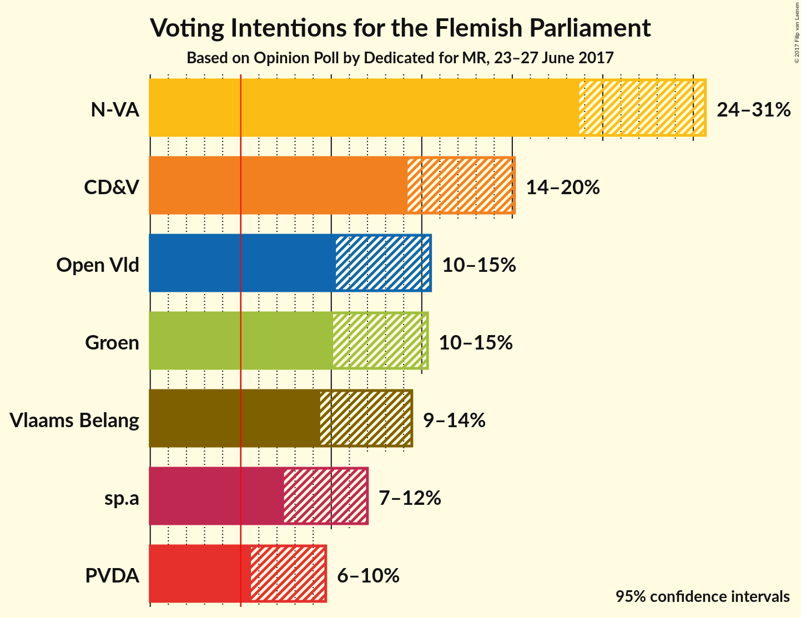
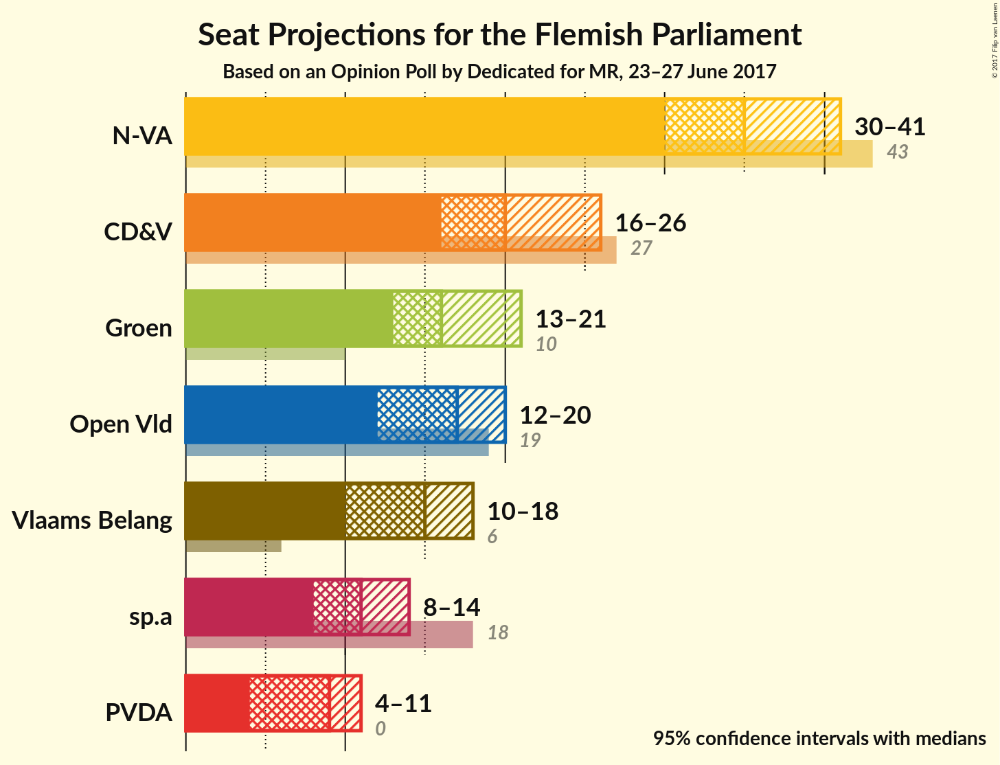
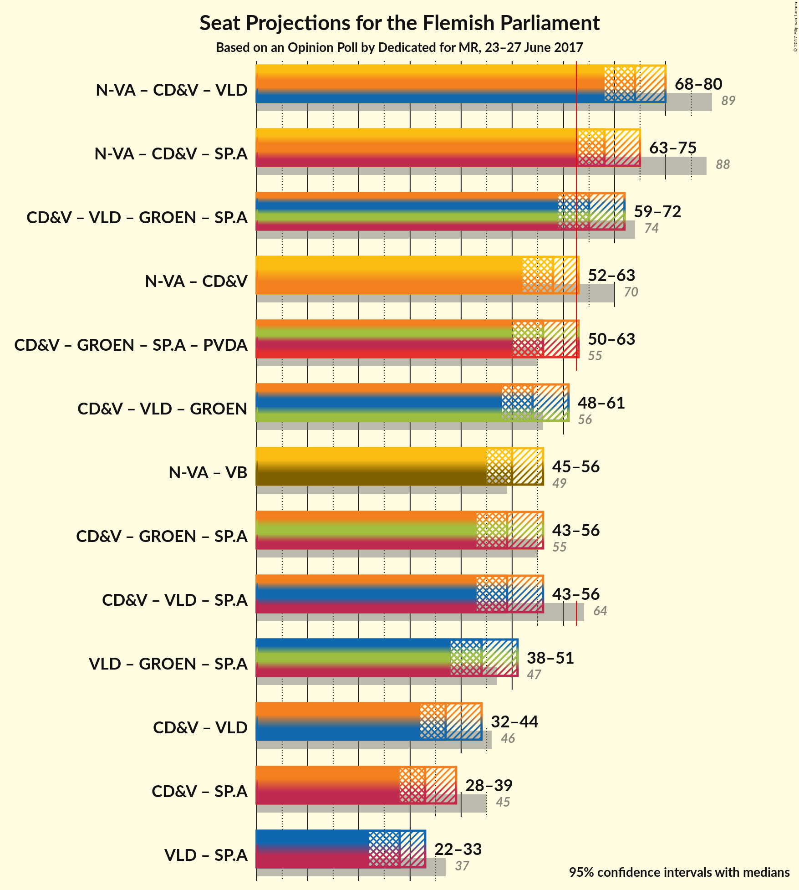

# Opinion Poll by Dedicated for MR, 23–27 June 2017

<a href="#voting-intentions">Voting Intentions</a> | <a href="#seats">Seats</a> | <a href="#coalitions">Coalitions</a> | <a href="#technical-information">Technical Information</a>

## Voting Intentions

### Confidence Intervals

| Party | Last Result | Poll Result | 80% Confidence Interval | 90% Confidence Interval | 95% Confidence Interval | 99% Confidence Interval |
|:-----:|:-----------:|:-----------:|:-----------------------:|:-----------------------:|:-----------------------:|:-----------------------:|
| N-VA | 31.9% | 27.0% | 24.8–29.4% |24.2–30.1% |23.7–30.7% |22.7–31.8% |
| CD&V | 20.5% | 17.0% | 15.2–19.0% |14.6–19.6% |14.2–20.1% |13.4–21.1% |
| Open Vld | 14.1% | 12.6% | 11.1–14.5% |10.6–15.0% |10.3–15.5% |9.6–16.4% |
| Groen | 8.7% | 12.5% | 10.9–14.3% |10.5–14.8% |10.1–15.3% |9.4–16.2% |
| Vlaams Belang | 5.9% | 11.7% | 10.2–13.5% |9.8–14.0% |9.4–14.4% |8.7–15.3% |
| sp.a | 14.0% | 9.4% | 8.1–11.1% |7.7–11.6% |7.4–12.0% |6.8–12.8% |
| PVDA | 2.5% | 7.4% | 6.2–8.9% |5.8–9.3% |5.6–9.7% |5.0–10.5% |

*Note:* The poll result column reflects the actual value used in the calculations. Published results may vary slightly, and in addition be rounded to fewer digits.

## Seats

### Confidence Intervals

| Party | Last Result | Median | 80% Confidence Interval | 90% Confidence Interval | 95% Confidence Interval | 99% Confidence Interval |
|:-----:|:-----------:|:------:|:-----------------------:|:-----------------------:|:-----------------------:|:-----------------------:|
| <a href="#n-va">N-VA</a> | 43 | 33 | 33–35 |33–38 |33–39 |30–39 |
| <a href="#cd&v">CD&V</a> | 27 | 20 | 19–21 |18–21 |15–24 |15–26 |
| <a href="#open-vld">Open Vld</a> | 19 | 19 | 19–21 |19–21 |19–21 |13–21 |
| <a href="#groen">Groen</a> | 10 | 16 | 14–17 |14–17 |14–22 |10–22 |
| <a href="#vlaams-belang">Vlaams Belang</a> | 6 | 12 | 12–15 |12–17 |12–17 |12–17 |
| <a href="#sp.a">sp.a</a> | 18 | 13 | 8–13 |8–14 |8–14 |7–14 |
| <a href="#pvda">PVDA</a> | 0 | 10 | 5–10 |5–11 |5–11 |5–11 |

### N-VA

*For a full overview of the results for this party, see the [N-VA](party-nva.html) page.*

| Number of Seats | Probability | Accumulated | Special Marks |
|:---------------:|:-----------:|:-----------:|:-------------:|
| 29 | 0.1% | 100% |  |
| 30 | 0.5% | 99.9% |  |
| 31 | 2% | 99.4% |  |
| 32 | 0% | 98% |  |
| 33 | 53% | 98% | Median |
| 34 | 28% | 45% |  |
| 35 | 11% | 17% |  |
| 36 | 0% | 5% |  |
| 37 | 0% | 5% |  |
| 38 | 2% | 5% |  |
| 39 | 3% | 4% |  |
| 40 | 0% | 0% |  |
| 41 | 0% | 0% |  |
| 42 | 0% | 0% |  |
| 43 | 0% | 0% | Last Result |

### CD&V

*For a full overview of the results for this party, see the [CD&V](party-cdv.html) page.*

| Number of Seats | Probability | Accumulated | Special Marks |
|:---------------:|:-----------:|:-----------:|:-------------:|
| 15 | 3% | 100% |  |
| 16 | 0.1% | 96% |  |
| 17 | 1.1% | 96% |  |
| 18 | 0.3% | 95% |  |
| 19 | 5% | 95% |  |
| 20 | 76% | 90% | Median |
| 21 | 10% | 13% |  |
| 22 | 0% | 4% |  |
| 23 | 0% | 4% |  |
| 24 | 3% | 4% |  |
| 25 | 0% | 0.5% |  |
| 26 | 0% | 0.5% |  |
| 27 | 0% | 0.5% | Last Result |
| 28 | 0.4% | 0.5% |  |
| 29 | 0% | 0.1% |  |
| 30 | 0% | 0.1% |  |
| 31 | 0% | 0.1% |  |
| 32 | 0.1% | 0.1% |  |
| 33 | 0% | 0% |  |

### Open Vld

*For a full overview of the results for this party, see the [Open Vld](party-openvld.html) page.*

| Number of Seats | Probability | Accumulated | Special Marks |
|:---------------:|:-----------:|:-----------:|:-------------:|
| 13 | 0.7% | 100% |  |
| 14 | 0.1% | 99.2% |  |
| 15 | 0% | 99.1% |  |
| 16 | 0.1% | 99.1% |  |
| 17 | 0.1% | 99.1% |  |
| 18 | 0.2% | 99.0% |  |
| 19 | 65% | 98.8% | Last Result, Median |
| 20 | 18% | 34% |  |
| 21 | 16% | 16% |  |
| 22 | 0% | 0% |  |

### Groen

*For a full overview of the results for this party, see the [Groen](party-groen.html) page.*

| Number of Seats | Probability | Accumulated | Special Marks |
|:---------------:|:-----------:|:-----------:|:-------------:|
| 10 | 0.6% | 100% | Last Result |
| 11 | 0% | 99.4% |  |
| 12 | 0% | 99.4% |  |
| 13 | 0% | 99.4% |  |
| 14 | 17% | 99.3% |  |
| 15 | 0% | 82% |  |
| 16 | 54% | 82% | Median |
| 17 | 26% | 29% |  |
| 18 | 0% | 3% |  |
| 19 | 0% | 3% |  |
| 20 | 0% | 3% |  |
| 21 | 0% | 3% |  |
| 22 | 3% | 3% |  |
| 23 | 0.1% | 0.1% |  |
| 24 | 0% | 0% |  |

### Vlaams Belang

*For a full overview of the results for this party, see the [Vlaams Belang](party-vlaamsbelang.html) page.*

| Number of Seats | Probability | Accumulated | Special Marks |
|:---------------:|:-----------:|:-----------:|:-------------:|
| 6 | 0% | 100% | Last Result |
| 7 | 0% | 100% |  |
| 8 | 0.1% | 100% |  |
| 9 | 0% | 99.9% |  |
| 10 | 0% | 99.9% |  |
| 11 | 0% | 99.9% |  |
| 12 | 55% | 99.9% | Median |
| 13 | 6% | 45% |  |
| 14 | 0% | 39% |  |
| 15 | 32% | 39% |  |
| 16 | 0.1% | 7% |  |
| 17 | 6% | 7% |  |
| 18 | 0% | 0.5% |  |
| 19 | 0% | 0.5% |  |
| 20 | 0.4% | 0.5% |  |
| 21 | 0% | 0.1% |  |
| 22 | 0% | 0.1% |  |
| 23 | 0% | 0% |  |

### sp.a

*For a full overview of the results for this party, see the [sp.a](party-spa.html) page.*

| Number of Seats | Probability | Accumulated | Special Marks |
|:---------------:|:-----------:|:-----------:|:-------------:|
| 7 | 1.2% | 100% |  |
| 8 | 13% | 98.8% |  |
| 9 | 4% | 86% |  |
| 10 | 0.6% | 82% |  |
| 11 | 0% | 82% |  |
| 12 | 23% | 82% |  |
| 13 | 53% | 59% | Median |
| 14 | 6% | 6% |  |
| 15 | 0% | 0.1% |  |
| 16 | 0% | 0% |  |
| 17 | 0% | 0% |  |
| 18 | 0% | 0% | Last Result |

### PVDA

*For a full overview of the results for this party, see the [PVDA](party-pvda.html) page.*

| Number of Seats | Probability | Accumulated | Special Marks |
|:---------------:|:-----------:|:-----------:|:-------------:|
| 0 | 0% | 100% | Last Result |
| 1 | 0% | 100% |  |
| 2 | 0.1% | 100% |  |
| 3 | 0% | 99.9% |  |
| 4 | 0% | 99.9% |  |
| 5 | 28% | 99.9% |  |
| 6 | 0.3% | 72% |  |
| 7 | 1.0% | 71% |  |
| 8 | 0.1% | 70% |  |
| 9 | 7% | 70% |  |
| 10 | 53% | 63% | Median |
| 11 | 10% | 10% |  |
| 12 | 0.1% | 0.2% |  |
| 13 | 0% | 0% |  |

## Coalitions

### Confidence Intervals

| Coalition | Last Result | Median | Majority? | 80% Confidence Interval | 90% Confidence Interval | 95% Confidence Interval | 99% Confidence Interval |
|:---------:|:-----------:|:------:|:---------:|:-----------------------:|:-----------------------:|:-----------------------:|:-----------------------:|
| N-VA – CD&V – Open Vld | 89 | 72 | 99.7% | 72–75 | 72–75 | 72–77 | 65–79 |
| CD&V – Open Vld – Groen – sp.a | 74 | 68 | 86% | 62–70 | 62–70 | 62–70 | 59–73 |
| N-VA – CD&V – sp.a | 88 | 66 | 98.6% | 64–66 | 63–67 | 63–67 | 62–72 |
| CD&V – Groen – sp.a – PVDA | 55 | 59 | 0.5% | 54–59 | 51–59 | 46–59 | 46–61 |
| CD&V – Open Vld – Groen | 56 | 55 | 1.3% | 53–58 | 53–58 | 53–58 | 49–65 |
| N-VA – CD&V | 70 | 53 | 0.1% | 53–56 | 53–56 | 53–58 | 50–59 |
| N-VA – Vlaams Belang | 49 | 45 | 0% | 45–50 | 45–52 | 45–56 | 43–56 |
| CD&V – Open Vld – sp.a | 64 | 52 | 0% | 48–53 | 45–53 | 45–53 | 43–55 |
| Open Vld – Groen – sp.a | 47 | 48 | 0% | 41–50 | 41–50 | 41–50 | 39–50 |
| CD&V – Groen – sp.a | 55 | 49 | 0% | 43–49 | 43–49 | 41–49 | 40–54 |
| CD&V – Open Vld | 46 | 39 | 0% | 39–41 | 36–41 | 36–43 | 34–44 |
| Open Vld – sp.a | 37 | 32 | 0% | 27–33 | 27–34 | 27–34 | 26–34 |
| CD&V – sp.a | 45 | 33 | 0% | 29–33 | 29–33 | 24–33 | 24–38 |

### N-VA – CD&V – Open Vld

| Number of Seats | Probability | Accumulated | Special Marks |
|:---------------:|:-----------:|:-----------:|:-------------:|
| 62 | 0.3% | 100% |  |
| 63 | 0% | 99.7% | Majority |
| 64 | 0.2% | 99.7% |  |
| 65 | 0.1% | 99.5% |  |
| 66 | 0% | 99.5% |  |
| 67 | 0% | 99.5% |  |
| 68 | 0% | 99.4% |  |
| 69 | 0% | 99.4% |  |
| 70 | 0% | 99.4% |  |
| 71 | 0.3% | 99.4% |  |
| 72 | 53% | 99.1% | Median |
| 73 | 6% | 46% |  |
| 74 | 13% | 41% |  |
| 75 | 25% | 28% |  |
| 76 | 0% | 3% |  |
| 77 | 0.6% | 3% |  |
| 78 | 0% | 2% |  |
| 79 | 2% | 2% |  |
| 80 | 0% | 0.1% |  |
| 81 | 0.1% | 0.1% |  |
| 82 | 0% | 0.1% |  |
| 83 | 0.1% | 0.1% |  |
| 84 | 0% | 0% |  |
| 85 | 0% | 0% |  |
| 86 | 0% | 0% |  |
| 87 | 0% | 0% |  |
| 88 | 0% | 0% |  |
| 89 | 0% | 0% | Last Result |

### CD&V – Open Vld – Groen – sp.a

| Number of Seats | Probability | Accumulated | Special Marks |
|:---------------:|:-----------:|:-----------:|:-------------:|
| 59 | 0.6% | 100% |  |
| 60 | 0% | 99.4% |  |
| 61 | 0.4% | 99.4% |  |
| 62 | 13% | 99.0% |  |
| 63 | 0% | 86% | Majority |
| 64 | 0.1% | 86% |  |
| 65 | 1.3% | 86% |  |
| 66 | 2% | 85% |  |
| 67 | 5% | 83% |  |
| 68 | 53% | 77% | Median |
| 69 | 10% | 24% |  |
| 70 | 12% | 14% |  |
| 71 | 0.4% | 2% |  |
| 72 | 0.1% | 1.4% |  |
| 73 | 1.0% | 1.3% |  |
| 74 | 0.3% | 0.3% | Last Result |
| 75 | 0% | 0.1% |  |
| 76 | 0% | 0% |  |

### N-VA – CD&V – sp.a

| Number of Seats | Probability | Accumulated | Special Marks |
|:---------------:|:-----------:|:-----------:|:-------------:|
| 59 | 0.1% | 100% |  |
| 60 | 0% | 99.8% |  |
| 61 | 0.1% | 99.8% |  |
| 62 | 1.2% | 99.8% |  |
| 63 | 5% | 98.6% | Majority |
| 64 | 10% | 94% |  |
| 65 | 0% | 84% |  |
| 66 | 76% | 84% | Median |
| 67 | 7% | 8% |  |
| 68 | 0.6% | 1.2% |  |
| 69 | 0% | 0.6% |  |
| 70 | 0.1% | 0.6% |  |
| 71 | 0% | 0.5% |  |
| 72 | 0.4% | 0.5% |  |
| 73 | 0% | 0.2% |  |
| 74 | 0.1% | 0.1% |  |
| 75 | 0% | 0.1% |  |
| 76 | 0% | 0% |  |
| 77 | 0% | 0% |  |
| 78 | 0% | 0% |  |
| 79 | 0% | 0% |  |
| 80 | 0% | 0% |  |
| 81 | 0% | 0% |  |
| 82 | 0% | 0% |  |
| 83 | 0% | 0% |  |
| 84 | 0% | 0% |  |
| 85 | 0% | 0% |  |
| 86 | 0% | 0% |  |
| 87 | 0% | 0% |  |
| 88 | 0% | 0% | Last Result |

### CD&V – Groen – sp.a – PVDA

| Number of Seats | Probability | Accumulated | Special Marks |
|:---------------:|:-----------:|:-----------:|:-------------:|
| 46 | 3% | 100% |  |
| 47 | 0% | 97% |  |
| 48 | 0% | 97% |  |
| 49 | 0.6% | 97% |  |
| 50 | 0% | 96% |  |
| 51 | 2% | 96% |  |
| 52 | 0% | 94% |  |
| 53 | 0.1% | 94% |  |
| 54 | 32% | 94% |  |
| 55 | 1.2% | 62% | Last Result |
| 56 | 5% | 61% |  |
| 57 | 0% | 55% |  |
| 58 | 0% | 55% |  |
| 59 | 53% | 55% | Median |
| 60 | 0.3% | 2% |  |
| 61 | 1.0% | 1.5% |  |
| 62 | 0% | 0.5% |  |
| 63 | 0.3% | 0.5% | Majority |
| 64 | 0% | 0.1% |  |
| 65 | 0% | 0.1% |  |
| 66 | 0% | 0% |  |

### CD&V – Open Vld – Groen

| Number of Seats | Probability | Accumulated | Special Marks |
|:---------------:|:-----------:|:-----------:|:-------------:|
| 47 | 0.3% | 100% |  |
| 48 | 0% | 99.7% |  |
| 49 | 0.6% | 99.7% |  |
| 50 | 0% | 99.1% |  |
| 51 | 0.1% | 99.1% |  |
| 52 | 0% | 99.0% |  |
| 53 | 9% | 99.0% |  |
| 54 | 10% | 90% |  |
| 55 | 53% | 80% | Median |
| 56 | 0.1% | 27% | Last Result |
| 57 | 11% | 27% |  |
| 58 | 15% | 16% |  |
| 59 | 0% | 1.5% |  |
| 60 | 0.1% | 1.4% |  |
| 61 | 0% | 1.3% |  |
| 62 | 0% | 1.3% |  |
| 63 | 0.1% | 1.3% | Majority |
| 64 | 0% | 1.3% |  |
| 65 | 1.0% | 1.2% |  |
| 66 | 0.2% | 0.2% |  |
| 67 | 0% | 0% |  |

### N-VA – CD&V

| Number of Seats | Probability | Accumulated | Special Marks |
|:---------------:|:-----------:|:-----------:|:-------------:|
| 49 | 0.3% | 100% |  |
| 50 | 0.1% | 99.6% |  |
| 51 | 0% | 99.5% |  |
| 52 | 0% | 99.4% |  |
| 53 | 58% | 99.4% | Median |
| 54 | 26% | 41% |  |
| 55 | 2% | 15% |  |
| 56 | 10% | 13% |  |
| 57 | 0.1% | 3% |  |
| 58 | 0.9% | 3% |  |
| 59 | 2% | 2% |  |
| 60 | 0% | 0.2% |  |
| 61 | 0% | 0.2% |  |
| 62 | 0% | 0.2% |  |
| 63 | 0% | 0.1% | Majority |
| 64 | 0% | 0.1% |  |
| 65 | 0% | 0.1% |  |
| 66 | 0.1% | 0.1% |  |
| 67 | 0% | 0% |  |
| 68 | 0% | 0% |  |
| 69 | 0% | 0% |  |
| 70 | 0% | 0% | Last Result |

### N-VA – Vlaams Belang

| Number of Seats | Probability | Accumulated | Special Marks |
|:---------------:|:-----------:|:-----------:|:-------------:|
| 40 | 0% | 100% |  |
| 41 | 0% | 99.9% |  |
| 42 | 0% | 99.9% |  |
| 43 | 1.0% | 99.9% |  |
| 44 | 0.3% | 98.9% |  |
| 45 | 53% | 98.7% | Median |
| 46 | 0.1% | 46% |  |
| 47 | 6% | 46% |  |
| 48 | 0% | 40% |  |
| 49 | 23% | 40% | Last Result |
| 50 | 11% | 17% |  |
| 51 | 0.3% | 6% |  |
| 52 | 2% | 6% |  |
| 53 | 0% | 4% |  |
| 54 | 0.1% | 4% |  |
| 55 | 0.6% | 4% |  |
| 56 | 3% | 4% |  |
| 57 | 0% | 0% |  |

### CD&V – Open Vld – sp.a

| Number of Seats | Probability | Accumulated | Special Marks |
|:---------------:|:-----------:|:-----------:|:-------------:|
| 42 | 0.1% | 100% |  |
| 43 | 1.3% | 99.9% |  |
| 44 | 0% | 98.6% |  |
| 45 | 4% | 98.6% |  |
| 46 | 0% | 95% |  |
| 47 | 0.2% | 95% |  |
| 48 | 10% | 95% |  |
| 49 | 0.7% | 85% |  |
| 50 | 0% | 85% |  |
| 51 | 1.0% | 85% |  |
| 52 | 65% | 84% | Median |
| 53 | 18% | 18% |  |
| 54 | 0% | 0.5% |  |
| 55 | 0.4% | 0.5% |  |
| 56 | 0% | 0.2% |  |
| 57 | 0.1% | 0.1% |  |
| 58 | 0% | 0.1% |  |
| 59 | 0% | 0.1% |  |
| 60 | 0% | 0% |  |
| 61 | 0% | 0% |  |
| 62 | 0% | 0% |  |
| 63 | 0% | 0% | Majority |
| 64 | 0% | 0% | Last Result |

### Open Vld – Groen – sp.a

| Number of Seats | Probability | Accumulated | Special Marks |
|:---------------:|:-----------:|:-----------:|:-------------:|
| 39 | 0.7% | 100% |  |
| 40 | 0.1% | 99.3% |  |
| 41 | 10% | 99.2% |  |
| 42 | 2% | 90% |  |
| 43 | 0.6% | 88% |  |
| 44 | 0% | 87% |  |
| 45 | 0.1% | 87% |  |
| 46 | 0.1% | 87% |  |
| 47 | 4% | 87% | Last Result |
| 48 | 60% | 83% | Median |
| 49 | 11% | 24% |  |
| 50 | 12% | 12% |  |
| 51 | 0% | 0.1% |  |
| 52 | 0% | 0.1% |  |
| 53 | 0% | 0.1% |  |
| 54 | 0% | 0% |  |

### CD&V – Groen – sp.a

| Number of Seats | Probability | Accumulated | Special Marks |
|:---------------:|:-----------:|:-----------:|:-------------:|
| 40 | 0.6% | 100% |  |
| 41 | 3% | 99.4% |  |
| 42 | 0% | 96% |  |
| 43 | 10% | 96% |  |
| 44 | 0% | 86% |  |
| 45 | 0% | 86% |  |
| 46 | 3% | 86% |  |
| 47 | 5% | 83% |  |
| 48 | 0.3% | 78% |  |
| 49 | 75% | 77% | Median |
| 50 | 0% | 2% |  |
| 51 | 0.2% | 2% |  |
| 52 | 0% | 2% |  |
| 53 | 0% | 2% |  |
| 54 | 1.3% | 2% |  |
| 55 | 0% | 0.5% | Last Result |
| 56 | 0% | 0.5% |  |
| 57 | 0% | 0.5% |  |
| 58 | 0.3% | 0.4% |  |
| 59 | 0% | 0.1% |  |
| 60 | 0% | 0% |  |

### CD&V – Open Vld

| Number of Seats | Probability | Accumulated | Special Marks |
|:---------------:|:-----------:|:-----------:|:-------------:|
| 31 | 0.3% | 100% |  |
| 32 | 0% | 99.7% |  |
| 33 | 0.1% | 99.7% |  |
| 34 | 0.2% | 99.7% |  |
| 35 | 0.1% | 99.5% |  |
| 36 | 5% | 99.4% |  |
| 37 | 0% | 95% |  |
| 38 | 0% | 95% |  |
| 39 | 59% | 95% | Median |
| 40 | 20% | 36% |  |
| 41 | 12% | 16% |  |
| 42 | 0% | 3% |  |
| 43 | 1.0% | 3% |  |
| 44 | 2% | 2% |  |
| 45 | 0% | 0.2% |  |
| 46 | 0% | 0.1% | Last Result |
| 47 | 0% | 0.1% |  |
| 48 | 0% | 0.1% |  |
| 49 | 0.1% | 0.1% |  |
| 50 | 0% | 0% |  |

### Open Vld – sp.a

| Number of Seats | Probability | Accumulated | Special Marks |
|:---------------:|:-----------:|:-----------:|:-------------:|
| 22 | 0.1% | 100% |  |
| 23 | 0.1% | 99.9% |  |
| 24 | 0% | 99.8% |  |
| 25 | 0.1% | 99.8% |  |
| 26 | 1.3% | 99.7% |  |
| 27 | 11% | 98% |  |
| 28 | 2% | 87% |  |
| 29 | 0.7% | 85% |  |
| 30 | 3% | 85% |  |
| 31 | 0.1% | 81% |  |
| 32 | 63% | 81% | Median |
| 33 | 12% | 18% |  |
| 34 | 6% | 6% |  |
| 35 | 0% | 0% |  |
| 36 | 0% | 0% |  |
| 37 | 0% | 0% | Last Result |

### CD&V – sp.a

| Number of Seats | Probability | Accumulated | Special Marks |
|:---------------:|:-----------:|:-----------:|:-------------:|
| 24 | 5% | 100% |  |
| 25 | 0% | 95% |  |
| 26 | 0% | 95% |  |
| 27 | 0% | 95% |  |
| 28 | 0% | 95% |  |
| 29 | 10% | 95% |  |
| 30 | 0.6% | 86% |  |
| 31 | 0% | 85% |  |
| 32 | 26% | 85% |  |
| 33 | 58% | 59% | Median |
| 34 | 0.1% | 0.6% |  |
| 35 | 0% | 0.6% |  |
| 36 | 0% | 0.6% |  |
| 37 | 0% | 0.5% |  |
| 38 | 0% | 0.5% |  |
| 39 | 0% | 0.5% |  |
| 40 | 0.1% | 0.5% |  |
| 41 | 0% | 0.4% |  |
| 42 | 0.3% | 0.4% |  |
| 43 | 0% | 0.1% |  |
| 44 | 0% | 0% |  |
| 45 | 0% | 0% | Last Result |

## Technical Information

### Opinion Poll

+ **Pollster:** Dedicated
+ **Media:** MR
+ **Fieldwork period:** 23–27 June 2017

### Calculations

+ **Sample size:** 625
+ **Simulations done:** 1,024
+ **Error estimate:** 2.45%

