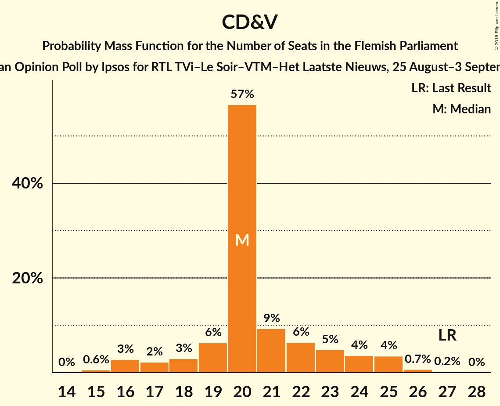
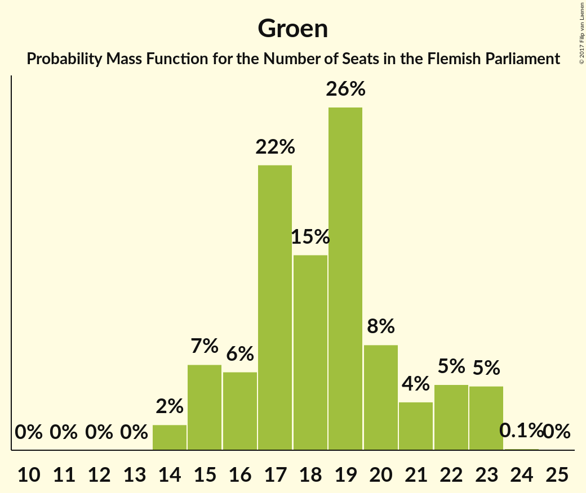
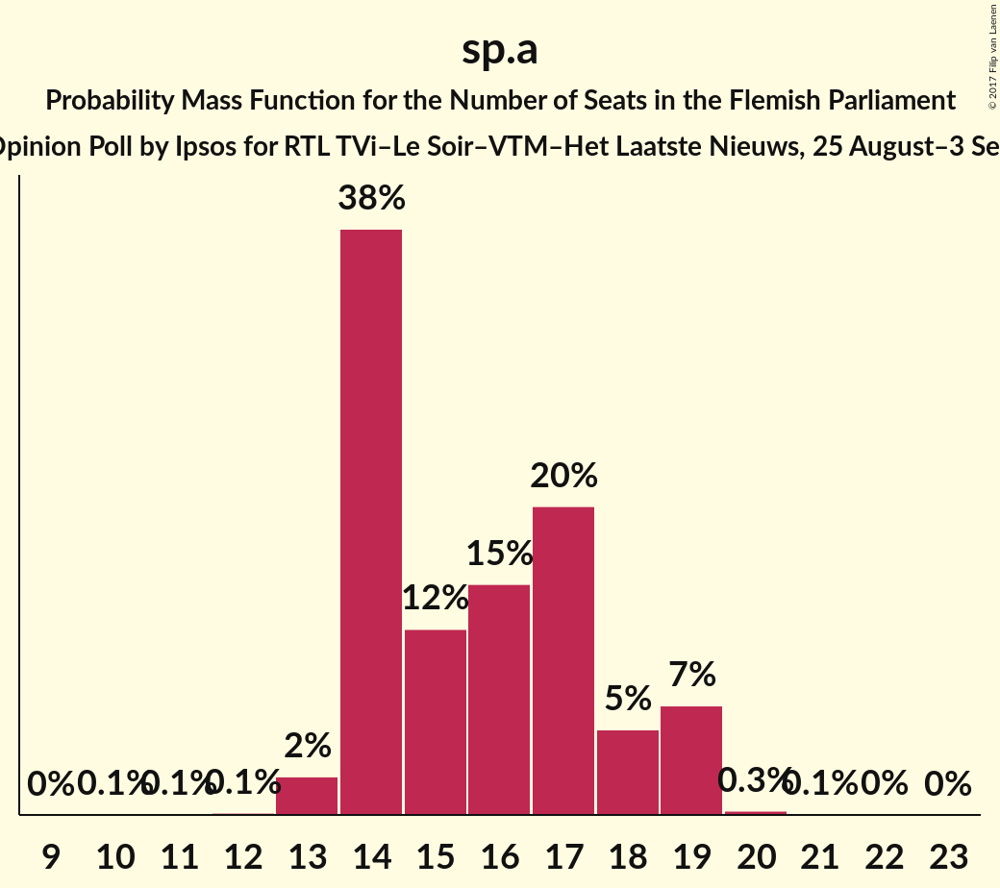
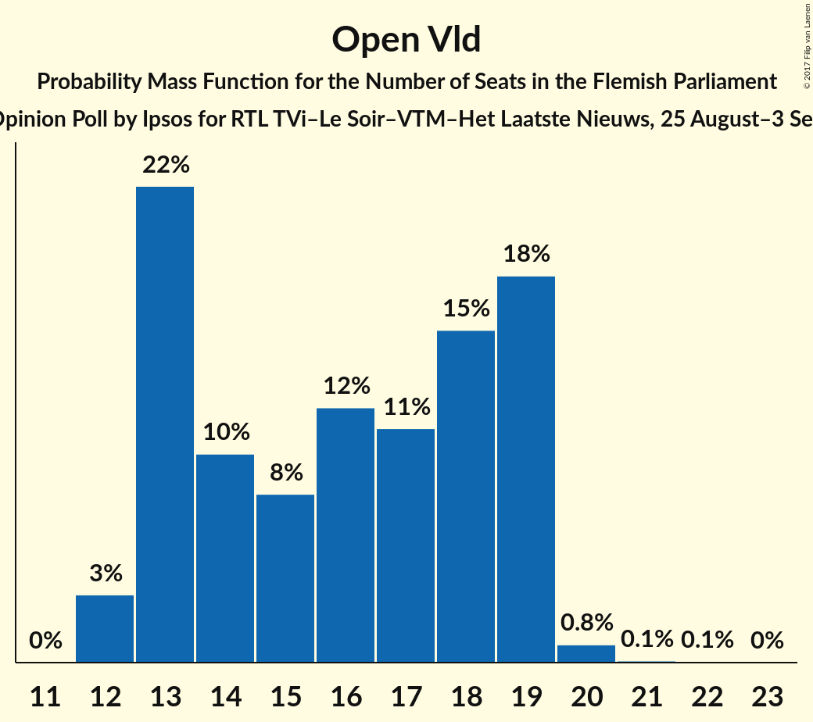
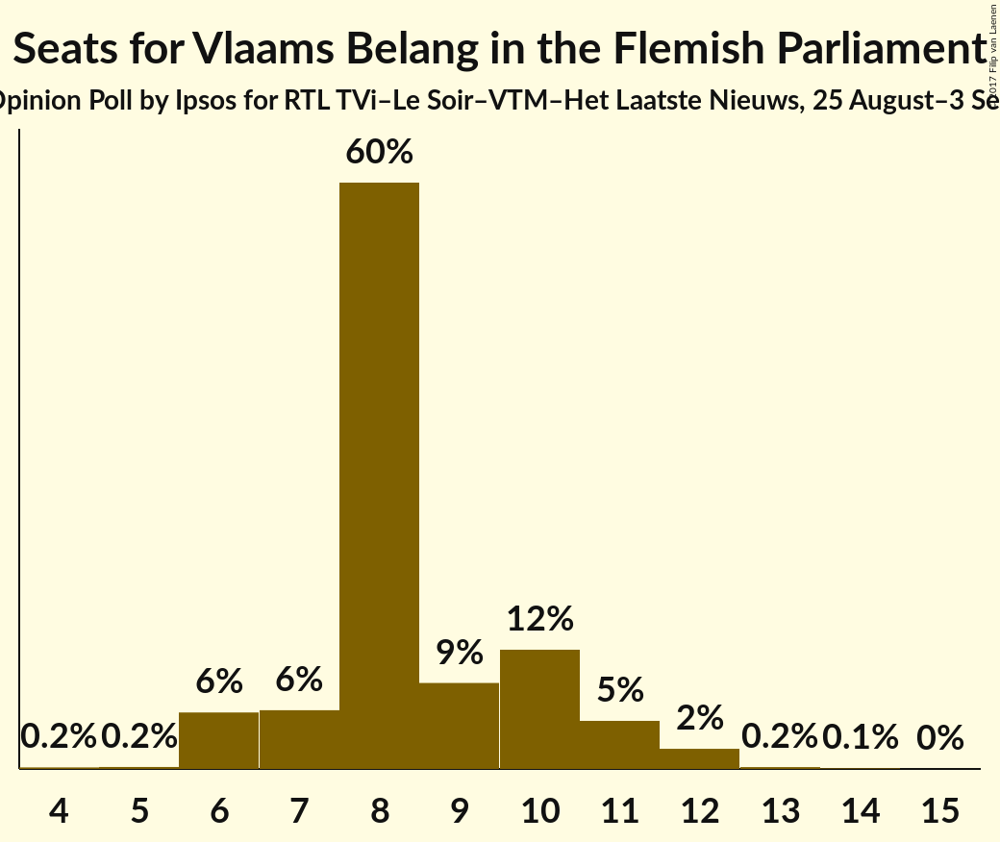
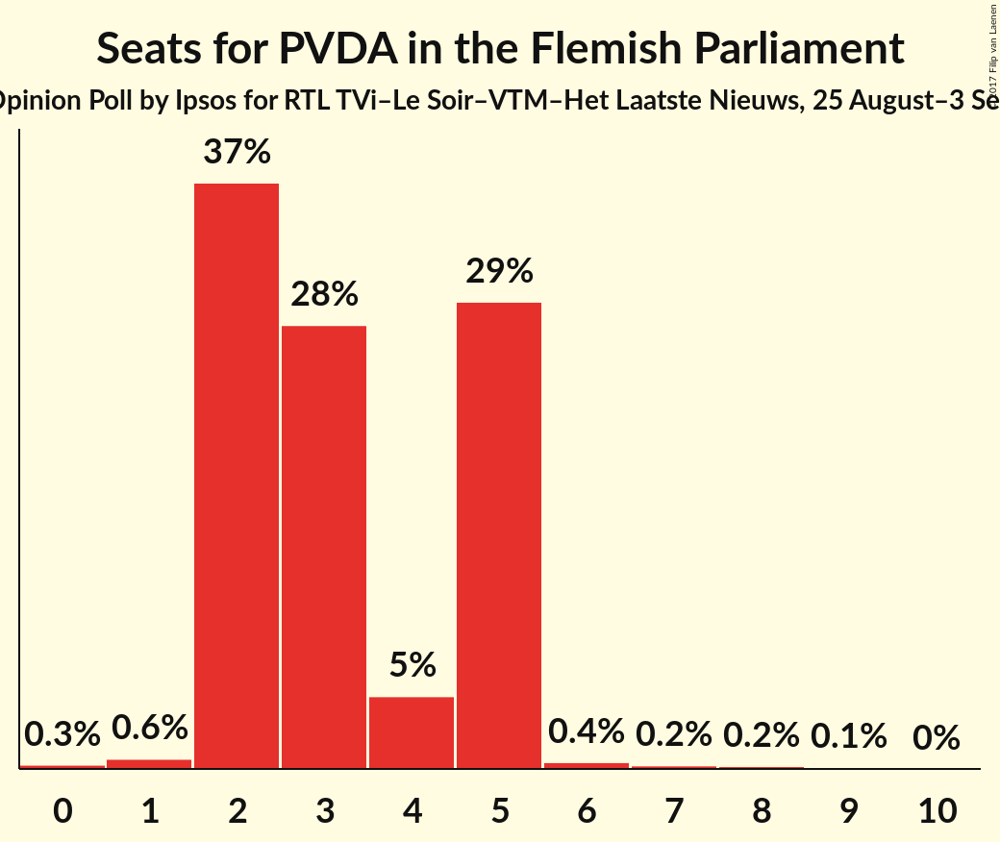

# Opinion Poll by Ipsos for RTL TVi–Le Soir–VTM–Het Laatste Nieuws, 25 August–3 September 2017

<a href="#voting-intentions">Voting Intentions</a> | <a href="#seats">Seats</a> | <a href="#coalitions">Coalitions</a> | <a href="#technical-information">Technical Information</a>

## Voting Intentions

### Confidence Intervals

| Party | Last Result | Poll Result | 80% Confidence Interval | 90% Confidence Interval | 95% Confidence Interval | 99% Confidence Interval |
|:-----:|:-----------:|:-----------:|:-----------------------:|:-----------------------:|:-----------------------:|:-----------------------:|
| N-VA | 31.9% | 30.2% | 28.4–32.2% |27.9–32.8% |27.4–33.2% |26.5–34.2% |
| CD&V | 20.5% | 16.1% | 14.6–17.7% |14.2–18.1% |13.9–18.5% |13.2–19.3% |
| Groen | 8.7% | 13.5% | 12.1–15.0% |11.8–15.4% |11.4–15.8% |10.8–16.5% |
| sp.a | 14.0% | 12.2% | 10.9–13.7% |10.6–14.1% |10.3–14.4% |9.7–15.2% |
| Open Vld | 14.1% | 12.1% | 10.8–13.5% |10.5–14.0% |10.2–14.3% |9.6–15.0% |
| Vlaams Belang | 5.9% | 7.9% | 6.9–9.2% |6.6–9.5% |6.4–9.8% |5.9–10.4% |
| PVDA | 2.5% | 5.0% | 4.2–6.0% |4.0–6.3% |3.8–6.6% |3.4–7.1% |

*Note:* The poll result column reflects the actual value used in the calculations. Published results may vary slightly, and in addition be rounded to fewer digits.

## Seats

### Confidence Intervals

| Party | Last Result | Median | 80% Confidence Interval | 90% Confidence Interval | 95% Confidence Interval | 99% Confidence Interval |
|:-----:|:-----------:|:------:|:-----------------------:|:-----------------------:|:-----------------------:|:-----------------------:|
| <a href="#n-va">N-VA</a> | 43 | 41 | 38–44 |38–45 |37–45 |36–47 |
| <a href="#cd&v">CD&V</a> | 27 | 20 | 19–23 |17–24 |16–25 |15–26 |
| <a href="#groen">Groen</a> | 10 | 18 | 16–22 |15–23 |15–23 |14–23 |
| <a href="#sp.a">sp.a</a> | 18 | 15 | 14–18 |14–19 |13–19 |13–19 |
| <a href="#open-vld">Open Vld</a> | 19 | 16 | 13–19 |13–19 |12–19 |12–20 |
| <a href="#vlaams-belang">Vlaams Belang</a> | 6 | 8 | 7–10 |6–11 |6–11 |6–12 |
| <a href="#pvda">PVDA</a> | 0 | 3 | 2–5 |2–5 |2–5 |1–7 |

### N-VA

*For a full overview of the results for this party, see the [N-VA](party-n-va.html) page.*

| Number of Seats | Probability | Accumulated | Special Marks |
|:---------------:|:-----------:|:-----------:|:-------------:|
| 34 | 0.2% | 100% |  |
| 35 | 0.2% | 99.8% |  |
| 36 | 0.6% | 99.6% |  |
| 37 | 3% | 98.9% |  |
| 38 | 13% | 96% |  |
| 39 | 10% | 83% |  |
| 40 | 11% | 73% |  |
| 41 | 21% | 62% | Median |
| 42 | 15% | 41% |  |
| 43 | 11% | 27% | Last Result |
| 44 | 10% | 16% |  |
| 45 | 5% | 6% |  |
| 46 | 1.1% | 2% |  |
| 47 | 0.3% | 0.6% |  |
| 48 | 0.2% | 0.3% |  |
| 49 | 0.1% | 0.1% |  |
| 50 | 0% | 0% |  |

### CD&V

*For a full overview of the results for this party, see the [CD&V](party-cdv.html) page.*

| Number of Seats | Probability | Accumulated | Special Marks |
|:---------------:|:-----------:|:-----------:|:-------------:|
| 15 | 0.6% | 100% |  |
| 16 | 3% | 99.4% |  |
| 17 | 2% | 97% |  |
| 18 | 3% | 95% |  |
| 19 | 6% | 91% |  |
| 20 | 59% | 85% | Median |
| 21 | 8% | 27% |  |
| 22 | 6% | 18% |  |
| 23 | 4% | 13% |  |
| 24 | 4% | 8% |  |
| 25 | 3% | 4% |  |
| 26 | 0.6% | 0.8% |  |
| 27 | 0.1% | 0.2% | Last Result |
| 28 | 0% | 0% |  |

### Groen

*For a full overview of the results for this party, see the [Groen](party-groen.html) page.*

| Number of Seats | Probability | Accumulated | Special Marks |
|:---------------:|:-----------:|:-----------:|:-------------:|
| 10 | 0% | 100% | Last Result |
| 11 | 0% | 100% |  |
| 12 | 0% | 100% |  |
| 13 | 0% | 100% |  |
| 14 | 2% | 100% |  |
| 15 | 7% | 98% |  |
| 16 | 5% | 91% |  |
| 17 | 22% | 86% |  |
| 18 | 17% | 65% | Median |
| 19 | 26% | 48% |  |
| 20 | 8% | 22% |  |
| 21 | 4% | 14% |  |
| 22 | 5% | 10% |  |
| 23 | 5% | 5% |  |
| 24 | 0.1% | 0.1% |  |
| 25 | 0% | 0% |  |

### sp.a

*For a full overview of the results for this party, see the [sp.a](party-spa.html) page.*

| Number of Seats | Probability | Accumulated | Special Marks |
|:---------------:|:-----------:|:-----------:|:-------------:|
| 10 | 0.1% | 100% |  |
| 11 | 0.1% | 99.9% |  |
| 12 | 0.2% | 99.8% |  |
| 13 | 2% | 99.7% |  |
| 14 | 38% | 97% |  |
| 15 | 13% | 60% | Median |
| 16 | 14% | 47% |  |
| 17 | 20% | 33% |  |
| 18 | 6% | 13% | Last Result |
| 19 | 7% | 7% |  |
| 20 | 0.3% | 0.4% |  |
| 21 | 0.1% | 0.2% |  |
| 22 | 0% | 0.1% |  |
| 23 | 0% | 0% |  |

### Open Vld

*For a full overview of the results for this party, see the [Open Vld](party-openvld.html) page.*

| Number of Seats | Probability | Accumulated | Special Marks |
|:---------------:|:-----------:|:-----------:|:-------------:|
| 12 | 3% | 100% |  |
| 13 | 21% | 97% |  |
| 14 | 11% | 75% |  |
| 15 | 8% | 65% |  |
| 16 | 11% | 57% | Median |
| 17 | 11% | 46% |  |
| 18 | 15% | 35% |  |
| 19 | 19% | 20% | Last Result |
| 20 | 0.8% | 1.0% |  |
| 21 | 0.1% | 0.2% |  |
| 22 | 0.1% | 0.1% |  |
| 23 | 0% | 0% |  |

### Vlaams Belang

*For a full overview of the results for this party, see the [Vlaams Belang](party-vlaamsbelang.html) page.*

| Number of Seats | Probability | Accumulated | Special Marks |
|:---------------:|:-----------:|:-----------:|:-------------:|
| 4 | 0.2% | 100% |  |
| 5 | 0.2% | 99.8% |  |
| 6 | 6% | 99.6% | Last Result |
| 7 | 6% | 94% |  |
| 8 | 61% | 88% | Median |
| 9 | 8% | 27% |  |
| 10 | 12% | 19% |  |
| 11 | 5% | 7% |  |
| 12 | 2% | 2% |  |
| 13 | 0.2% | 0.3% |  |
| 14 | 0.1% | 0.1% |  |
| 15 | 0% | 0% |  |

### PVDA

*For a full overview of the results for this party, see the [PVDA](party-pvda.html) page.*

| Number of Seats | Probability | Accumulated | Special Marks |
|:---------------:|:-----------:|:-----------:|:-------------:|
| 0 | 0.3% | 100% | Last Result |
| 1 | 0.7% | 99.7% |  |
| 2 | 36% | 99.0% |  |
| 3 | 28% | 63% | Median |
| 4 | 4% | 35% |  |
| 5 | 30% | 31% |  |
| 6 | 0.4% | 1.0% |  |
| 7 | 0.2% | 0.5% |  |
| 8 | 0.2% | 0.3% |  |
| 9 | 0.1% | 0.1% |  |
| 10 | 0% | 0% |  |

## Coalitions

### Confidence Intervals

| Coalition | Last Result | Median | Majority? | 80% Confidence Interval | 90% Confidence Interval | 95% Confidence Interval | 99% Confidence Interval |
|:---------:|:-----------:|:------:|:---------:|:-----------------------:|:-----------------------:|:-----------------------:|:-----------------------:|
| N-VA – CD&V – Open Vld | 89 | 77 | 100% | 74–81 | 73–82 | 72–83 | 70–84 |
| N-VA – CD&V – sp.a | 88 | 77 | 100% | 74–80 | 73–81 | 72–82 | 71–84 |
| CD&V – Groen – sp.a – Open Vld | 74 | 70 | 99.9% | 67–73 | 66–74 | 66–75 | 64–76 |
| N-VA – CD&V | 70 | 61 | 33% | 58–65 | 57–66 | 57–67 | 55–69 |
| CD&V – Groen – sp.a – PVDA | 55 | 58 | 4% | 54–61 | 53–62 | 52–63 | 51–65 |
| CD&V – Groen – Open Vld | 56 | 55 | 0.1% | 52–58 | 51–59 | 50–60 | 48–61 |
| CD&V – Groen – sp.a | 55 | 54 | 0.1% | 51–58 | 50–59 | 49–60 | 48–61 |
| CD&V – sp.a – Open Vld | 64 | 52 | 0% | 48–56 | 48–57 | 47–57 | 45–58 |
| Groen – sp.a – Open Vld | 47 | 50 | 0% | 47–53 | 46–54 | 45–55 | 43–57 |
| N-VA – Vlaams Belang | 49 | 49 | 0% | 46–53 | 46–53 | 45–54 | 44–56 |
| CD&V – Open Vld | 46 | 36 | 0% | 33–39 | 32–40 | 32–41 | 30–43 |
| CD&V – sp.a | 45 | 36 | 0% | 34–39 | 33–40 | 32–41 | 30–43 |
| sp.a – Open Vld | 37 | 32 | 0% | 28–35 | 27–36 | 27–37 | 26–38 |

### N-VA – CD&V – Open Vld

| Number of Seats | Probability | Accumulated | Special Marks |
|:---------------:|:-----------:|:-----------:|:-------------:|
| 68 | 0% | 100% |  |
| 69 | 0.1% | 99.9% |  |
| 70 | 0.4% | 99.8% |  |
| 71 | 1.1% | 99.4% |  |
| 72 | 2% | 98% |  |
| 73 | 4% | 96% |  |
| 74 | 8% | 92% |  |
| 75 | 9% | 84% |  |
| 76 | 11% | 76% |  |
| 77 | 15% | 64% | Median |
| 78 | 15% | 49% |  |
| 79 | 12% | 35% |  |
| 80 | 10% | 22% |  |
| 81 | 6% | 12% |  |
| 82 | 3% | 6% |  |
| 83 | 2% | 3% |  |
| 84 | 0.6% | 0.8% |  |
| 85 | 0.2% | 0.3% |  |
| 86 | 0.1% | 0.1% |  |
| 87 | 0% | 0% |  |
| 88 | 0% | 0% |  |
| 89 | 0% | 0% | Last Result |

### N-VA – CD&V – sp.a

| Number of Seats | Probability | Accumulated | Special Marks |
|:---------------:|:-----------:|:-----------:|:-------------:|
| 68 | 0.1% | 100% |  |
| 69 | 0.1% | 99.9% |  |
| 70 | 0.3% | 99.8% |  |
| 71 | 0.8% | 99.6% |  |
| 72 | 3% | 98.8% |  |
| 73 | 5% | 96% |  |
| 74 | 7% | 91% |  |
| 75 | 15% | 84% |  |
| 76 | 14% | 69% | Median |
| 77 | 13% | 55% |  |
| 78 | 14% | 42% |  |
| 79 | 8% | 28% |  |
| 80 | 10% | 20% |  |
| 81 | 5% | 10% |  |
| 82 | 3% | 5% |  |
| 83 | 1.3% | 2% |  |
| 84 | 0.6% | 1.0% |  |
| 85 | 0.3% | 0.4% |  |
| 86 | 0.1% | 0.1% |  |
| 87 | 0% | 0% |  |
| 88 | 0% | 0% | Last Result |

### CD&V – Groen – sp.a – Open Vld

| Number of Seats | Probability | Accumulated | Special Marks |
|:---------------:|:-----------:|:-----------:|:-------------:|
| 62 | 0.1% | 100% |  |
| 63 | 0.2% | 99.9% | Majority |
| 64 | 0.6% | 99.7% |  |
| 65 | 1.2% | 99.1% |  |
| 66 | 3% | 98% |  |
| 67 | 10% | 95% |  |
| 68 | 11% | 85% |  |
| 69 | 12% | 74% | Median |
| 70 | 12% | 62% |  |
| 71 | 15% | 50% |  |
| 72 | 18% | 35% |  |
| 73 | 7% | 17% |  |
| 74 | 5% | 10% | Last Result |
| 75 | 3% | 5% |  |
| 76 | 0.9% | 1.4% |  |
| 77 | 0.3% | 0.5% |  |
| 78 | 0.1% | 0.1% |  |
| 79 | 0% | 0% |  |

### N-VA – CD&V

| Number of Seats | Probability | Accumulated | Special Marks |
|:---------------:|:-----------:|:-----------:|:-------------:|
| 53 | 0.1% | 100% |  |
| 54 | 0.3% | 99.9% |  |
| 55 | 0.5% | 99.7% |  |
| 56 | 1.3% | 99.2% |  |
| 57 | 3% | 98% |  |
| 58 | 8% | 95% |  |
| 59 | 10% | 87% |  |
| 60 | 11% | 77% |  |
| 61 | 20% | 65% | Median |
| 62 | 13% | 46% |  |
| 63 | 12% | 33% | Majority |
| 64 | 10% | 21% |  |
| 65 | 5% | 11% |  |
| 66 | 3% | 6% |  |
| 67 | 2% | 3% |  |
| 68 | 0.9% | 2% |  |
| 69 | 0.4% | 0.6% |  |
| 70 | 0.1% | 0.2% | Last Result |
| 71 | 0% | 0% |  |

### CD&V – Groen – sp.a – PVDA

| Number of Seats | Probability | Accumulated | Special Marks |
|:---------------:|:-----------:|:-----------:|:-------------:|
| 49 | 0% | 100% |  |
| 50 | 0.2% | 99.9% |  |
| 51 | 0.7% | 99.7% |  |
| 52 | 2% | 99.0% |  |
| 53 | 3% | 97% |  |
| 54 | 8% | 94% |  |
| 55 | 10% | 87% | Last Result |
| 56 | 10% | 77% | Median |
| 57 | 14% | 67% |  |
| 58 | 16% | 53% |  |
| 59 | 13% | 37% |  |
| 60 | 9% | 24% |  |
| 61 | 7% | 15% |  |
| 62 | 4% | 8% |  |
| 63 | 2% | 4% | Majority |
| 64 | 2% | 2% |  |
| 65 | 0.4% | 0.5% |  |
| 66 | 0.1% | 0.1% |  |
| 67 | 0% | 0% |  |

### CD&V – Groen – Open Vld

| Number of Seats | Probability | Accumulated | Special Marks |
|:---------------:|:-----------:|:-----------:|:-------------:|
| 46 | 0% | 100% |  |
| 47 | 0.2% | 99.9% |  |
| 48 | 0.6% | 99.8% |  |
| 49 | 1.1% | 99.2% |  |
| 50 | 3% | 98% |  |
| 51 | 5% | 95% |  |
| 52 | 10% | 90% |  |
| 53 | 13% | 81% |  |
| 54 | 15% | 68% | Median |
| 55 | 15% | 53% |  |
| 56 | 13% | 38% | Last Result |
| 57 | 11% | 25% |  |
| 58 | 7% | 14% |  |
| 59 | 4% | 7% |  |
| 60 | 2% | 3% |  |
| 61 | 0.7% | 0.9% |  |
| 62 | 0.2% | 0.3% |  |
| 63 | 0.1% | 0.1% | Majority |
| 64 | 0% | 0% |  |

### CD&V – Groen – sp.a

| Number of Seats | Probability | Accumulated | Special Marks |
|:---------------:|:-----------:|:-----------:|:-------------:|
| 46 | 0.1% | 100% |  |
| 47 | 0.2% | 99.9% |  |
| 48 | 1.1% | 99.7% |  |
| 49 | 2% | 98.6% |  |
| 50 | 4% | 97% |  |
| 51 | 7% | 93% |  |
| 52 | 10% | 86% |  |
| 53 | 15% | 76% | Median |
| 54 | 14% | 61% |  |
| 55 | 14% | 47% | Last Result |
| 56 | 13% | 34% |  |
| 57 | 8% | 20% |  |
| 58 | 5% | 12% |  |
| 59 | 3% | 7% |  |
| 60 | 2% | 3% |  |
| 61 | 1.1% | 1.5% |  |
| 62 | 0.3% | 0.4% |  |
| 63 | 0% | 0.1% | Majority |
| 64 | 0% | 0% |  |

### CD&V – sp.a – Open Vld

| Number of Seats | Probability | Accumulated | Special Marks |
|:---------------:|:-----------:|:-----------:|:-------------:|
| 43 | 0.1% | 100% |  |
| 44 | 0.2% | 99.9% |  |
| 45 | 0.4% | 99.7% |  |
| 46 | 1.1% | 99.4% |  |
| 47 | 3% | 98% |  |
| 48 | 8% | 95% |  |
| 49 | 9% | 87% |  |
| 50 | 11% | 78% |  |
| 51 | 10% | 67% | Median |
| 52 | 13% | 57% |  |
| 53 | 16% | 44% |  |
| 54 | 11% | 29% |  |
| 55 | 7% | 17% |  |
| 56 | 5% | 10% |  |
| 57 | 4% | 5% |  |
| 58 | 1.1% | 2% |  |
| 59 | 0.3% | 0.5% |  |
| 60 | 0.1% | 0.1% |  |
| 61 | 0% | 0% |  |
| 62 | 0% | 0% |  |
| 63 | 0% | 0% | Majority |
| 64 | 0% | 0% | Last Result |

### Groen – sp.a – Open Vld

| Number of Seats | Probability | Accumulated | Special Marks |
|:---------------:|:-----------:|:-----------:|:-------------:|
| 42 | 0.4% | 100% |  |
| 43 | 0.6% | 99.5% |  |
| 44 | 1.2% | 99.0% |  |
| 45 | 2% | 98% |  |
| 46 | 4% | 96% |  |
| 47 | 10% | 91% | Last Result |
| 48 | 11% | 81% |  |
| 49 | 12% | 69% | Median |
| 50 | 13% | 57% |  |
| 51 | 14% | 44% |  |
| 52 | 16% | 30% |  |
| 53 | 7% | 14% |  |
| 54 | 4% | 7% |  |
| 55 | 2% | 4% |  |
| 56 | 1.0% | 2% |  |
| 57 | 0.4% | 0.6% |  |
| 58 | 0.1% | 0.2% |  |
| 59 | 0% | 0% |  |

### N-VA – Vlaams Belang

| Number of Seats | Probability | Accumulated | Special Marks |
|:---------------:|:-----------:|:-----------:|:-------------:|
| 42 | 0.1% | 100% |  |
| 43 | 0.3% | 99.9% |  |
| 44 | 0.8% | 99.6% |  |
| 45 | 2% | 98.8% |  |
| 46 | 11% | 97% |  |
| 47 | 9% | 86% |  |
| 48 | 11% | 77% |  |
| 49 | 19% | 66% | Last Result, Median |
| 50 | 14% | 48% |  |
| 51 | 14% | 33% |  |
| 52 | 9% | 20% |  |
| 53 | 6% | 11% |  |
| 54 | 3% | 5% |  |
| 55 | 0.9% | 1.5% |  |
| 56 | 0.4% | 0.6% |  |
| 57 | 0.2% | 0.2% |  |
| 58 | 0.1% | 0.1% |  |
| 59 | 0% | 0% |  |

### CD&V – Open Vld

| Number of Seats | Probability | Accumulated | Special Marks |
|:---------------:|:-----------:|:-----------:|:-------------:|
| 28 | 0.1% | 100% |  |
| 29 | 0.4% | 99.9% |  |
| 30 | 0.6% | 99.5% |  |
| 31 | 1.0% | 98.9% |  |
| 32 | 3% | 98% |  |
| 33 | 13% | 95% |  |
| 34 | 12% | 82% |  |
| 35 | 10% | 70% |  |
| 36 | 10% | 60% | Median |
| 37 | 11% | 50% |  |
| 38 | 14% | 39% |  |
| 39 | 16% | 25% |  |
| 40 | 5% | 9% |  |
| 41 | 2% | 4% |  |
| 42 | 1.4% | 2% |  |
| 43 | 0.8% | 0.9% |  |
| 44 | 0.1% | 0.1% |  |
| 45 | 0% | 0% |  |
| 46 | 0% | 0% | Last Result |

### CD&V – sp.a

| Number of Seats | Probability | Accumulated | Special Marks |
|:---------------:|:-----------:|:-----------:|:-------------:|
| 29 | 0.1% | 100% |  |
| 30 | 1.1% | 99.9% |  |
| 31 | 1.2% | 98.8% |  |
| 32 | 2% | 98% |  |
| 33 | 4% | 96% |  |
| 34 | 24% | 91% |  |
| 35 | 13% | 67% | Median |
| 36 | 14% | 54% |  |
| 37 | 16% | 40% |  |
| 38 | 11% | 24% |  |
| 39 | 8% | 14% |  |
| 40 | 3% | 6% |  |
| 41 | 2% | 3% |  |
| 42 | 0.8% | 2% |  |
| 43 | 0.4% | 0.8% |  |
| 44 | 0.4% | 0.4% |  |
| 45 | 0% | 0% | Last Result |

### sp.a – Open Vld

| Number of Seats | Probability | Accumulated | Special Marks |
|:---------------:|:-----------:|:-----------:|:-------------:|
| 25 | 0.1% | 100% |  |
| 26 | 1.1% | 99.9% |  |
| 27 | 5% | 98.8% |  |
| 28 | 9% | 94% |  |
| 29 | 9% | 85% |  |
| 30 | 14% | 76% |  |
| 31 | 9% | 62% | Median |
| 32 | 14% | 53% |  |
| 33 | 16% | 39% |  |
| 34 | 9% | 22% |  |
| 35 | 6% | 13% |  |
| 36 | 4% | 7% |  |
| 37 | 2% | 3% | Last Result |
| 38 | 0.7% | 0.8% |  |
| 39 | 0.1% | 0.1% |  |
| 40 | 0% | 0% |  |

## Technical Information

### Opinion Poll

+ **Polling firm:** Ipsos
+ **Commissioner(s):** RTL TVi–Le Soir–VTM–Het Laatste Nieuws
+ **Fieldwork period:** 25 August–3 September 2017

### Calculations

+ **Sample size:** 959
+ **Simulations done:** 2,097,152
+ **Error estimate:** 0.67%

