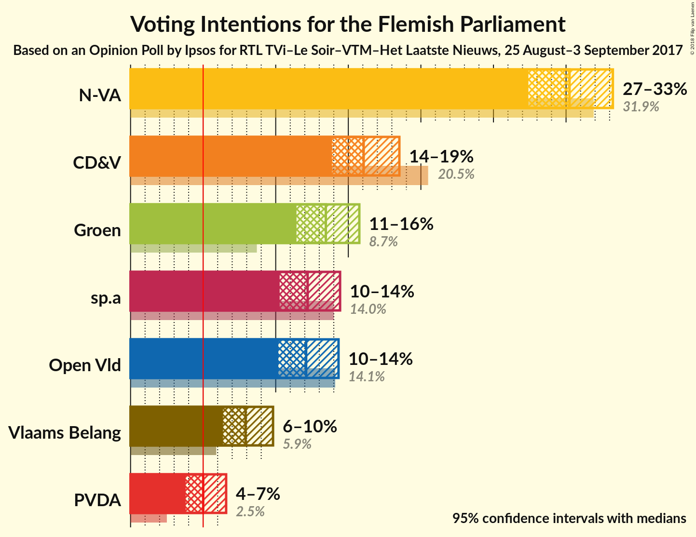
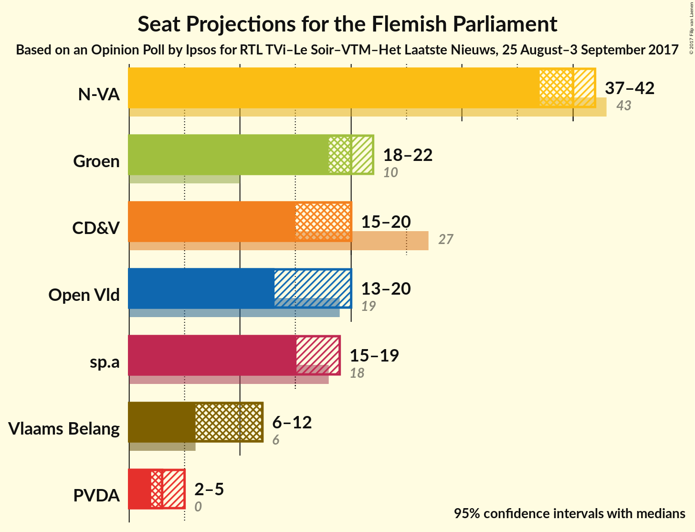
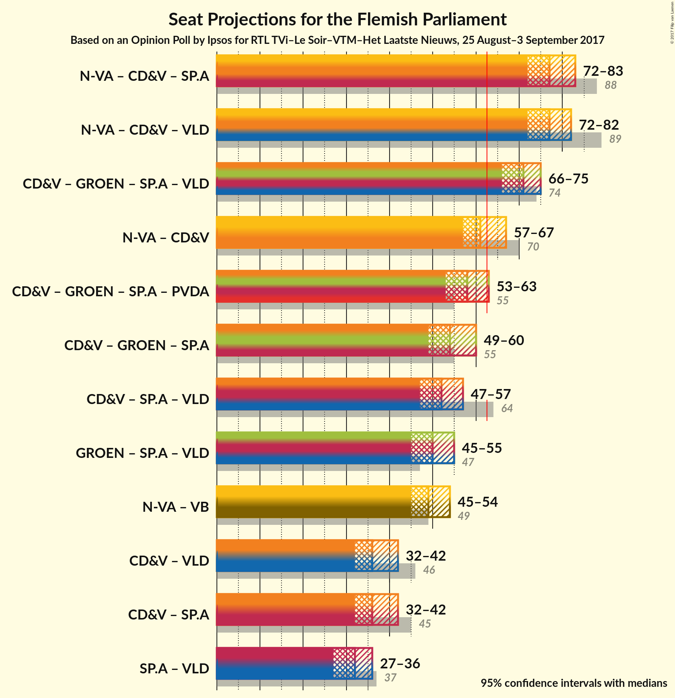

# Opinion Poll by Ipsos for RTL TVi–Le Soir–VTM–Het Laatste Nieuws, 25 August–3 September 2017

<a href="#voting-intentions">Voting Intentions</a> | <a href="#seats">Seats</a> | <a href="#coalitions">Coalitions</a> | <a href="#technical-information">Technical Information</a>

## Voting Intentions

### Confidence Intervals

| Party | Last Result | Poll Result | 80% Confidence Interval | 90% Confidence Interval | 95% Confidence Interval | 99% Confidence Interval |
|:-----:|:-----------:|:-----------:|:-----------------------:|:-----------------------:|:-----------------------:|:-----------------------:|
| N-VA | 31.9% | 30.2% | 28.4–32.2% |27.9–32.8% |27.4–33.2% |26.5–34.2% |
| CD&V | 20.5% | 16.1% | 14.6–17.7% |14.2–18.1% |13.9–18.5% |13.2–19.3% |
| Groen | 8.7% | 13.5% | 12.1–15.0% |11.8–15.4% |11.4–15.8% |10.8–16.5% |
| sp.a | 14.0% | 12.2% | 10.9–13.7% |10.6–14.1% |10.3–14.4% |9.7–15.2% |
| Open Vld | 14.1% | 12.1% | 10.8–13.5% |10.5–14.0% |10.2–14.3% |9.6–15.0% |
| Vlaams Belang | 5.9% | 7.9% | 6.9–9.2% |6.6–9.5% |6.4–9.8% |5.9–10.4% |
| PVDA | 2.5% | 5.0% | 4.2–6.0% |4.0–6.3% |3.8–6.6% |3.4–7.1% |

*Note:* The poll result column reflects the actual value used in the calculations. Published results may vary slightly, and in addition be rounded to fewer digits.

## Seats

### Confidence Intervals

| Party | Last Result | Median | 80% Confidence Interval | 90% Confidence Interval | 95% Confidence Interval | 99% Confidence Interval |
|:-----:|:-----------:|:------:|:-----------------------:|:-----------------------:|:-----------------------:|:-----------------------:|
| <a href="#n-va">N-VA</a> | 43 | 40 | 37–40 |37–42 |37–42 |37–42 |
| <a href="#cd&v">CD&V</a> | 27 | 20 | 18–20 |15–20 |15–20 |15–21 |
| <a href="#groen">Groen</a> | 10 | 20 | 18–20 |18–21 |18–22 |17–23 |
| <a href="#sp.a">sp.a</a> | 18 | 15 | 15–17 |15–19 |15–19 |14–19 |
| <a href="#open-vld">Open Vld</a> | 19 | 13 | 13–20 |13–20 |13–20 |12–22 |
| <a href="#vlaams-belang">Vlaams Belang</a> | 6 | 12 | 8–12 |8–12 |6–12 |6–12 |
| <a href="#pvda">PVDA</a> | 0 | 3 | 3–5 |2–5 |2–5 |0–5 |

### N-VA

*For a full overview of the results for this party, see the [N-VA](party-nva.html) page.*

| Number of Seats | Probability | Accumulated | Special Marks |
|:---------------:|:-----------:|:-----------:|:-------------:|
| 34 | 0.1% | 100% |  |
| 35 | 0% | 99.9% |  |
| 36 | 0% | 99.9% |  |
| 37 | 31% | 99.8% |  |
| 38 | 3% | 69% |  |
| 39 | 1.1% | 66% |  |
| 40 | 55% | 65% | Median |
| 41 | 0.9% | 10% |  |
| 42 | 9% | 9% |  |
| 43 | 0% | 0.1% | Last Result |
| 44 | 0.1% | 0.1% |  |
| 45 | 0% | 0% |  |

### CD&V

*For a full overview of the results for this party, see the [CD&V](party-cdv.html) page.*

| Number of Seats | Probability | Accumulated | Special Marks |
|:---------------:|:-----------:|:-----------:|:-------------:|
| 15 | 6% | 100% |  |
| 16 | 4% | 94% |  |
| 17 | 0% | 90% |  |
| 18 | 5% | 90% |  |
| 19 | 0.1% | 85% |  |
| 20 | 84% | 85% | Median |
| 21 | 0.4% | 0.7% |  |
| 22 | 0% | 0.3% |  |
| 23 | 0.3% | 0.3% |  |
| 24 | 0% | 0% |  |
| 25 | 0% | 0% |  |
| 26 | 0% | 0% |  |
| 27 | 0% | 0% | Last Result |

### Groen

*For a full overview of the results for this party, see the [Groen](party-groen.html) page.*

| Number of Seats | Probability | Accumulated | Special Marks |
|:---------------:|:-----------:|:-----------:|:-------------:|
| 10 | 0% | 100% | Last Result |
| 11 | 0% | 100% |  |
| 12 | 0% | 100% |  |
| 13 | 0% | 100% |  |
| 14 | 0% | 100% |  |
| 15 | 0.1% | 100% |  |
| 16 | 0% | 99.9% |  |
| 17 | 0.5% | 99.9% |  |
| 18 | 13% | 99.4% |  |
| 19 | 28% | 87% |  |
| 20 | 53% | 59% | Median |
| 21 | 2% | 5% |  |
| 22 | 0.4% | 3% |  |
| 23 | 2% | 2% |  |
| 24 | 0% | 0% |  |

### sp.a

*For a full overview of the results for this party, see the [sp.a](party-spa.html) page.*

| Number of Seats | Probability | Accumulated | Special Marks |
|:---------------:|:-----------:|:-----------:|:-------------:|
| 13 | 0.4% | 100% |  |
| 14 | 0.4% | 99.6% |  |
| 15 | 86% | 99.2% | Median |
| 16 | 0% | 14% |  |
| 17 | 4% | 14% |  |
| 18 | 0.6% | 9% | Last Result |
| 19 | 9% | 9% |  |
| 20 | 0% | 0.3% |  |
| 21 | 0.3% | 0.3% |  |
| 22 | 0% | 0% |  |

### Open Vld

*For a full overview of the results for this party, see the [Open Vld](party-openvld.html) page.*

| Number of Seats | Probability | Accumulated | Special Marks |
|:---------------:|:-----------:|:-----------:|:-------------:|
| 12 | 2% | 100% |  |
| 13 | 54% | 98% | Median |
| 14 | 0.1% | 44% |  |
| 15 | 0.3% | 44% |  |
| 16 | 0.3% | 43% |  |
| 17 | 8% | 43% |  |
| 18 | 0.5% | 35% |  |
| 19 | 13% | 35% | Last Result |
| 20 | 21% | 22% |  |
| 21 | 0% | 0.6% |  |
| 22 | 0.6% | 0.6% |  |
| 23 | 0% | 0% |  |

### Vlaams Belang

*For a full overview of the results for this party, see the [Vlaams Belang](party-vlaamsbelang.html) page.*

| Number of Seats | Probability | Accumulated | Special Marks |
|:---------------:|:-----------:|:-----------:|:-------------:|
| 6 | 3% | 100% | Last Result |
| 7 | 0.2% | 97% |  |
| 8 | 8% | 97% |  |
| 9 | 0% | 89% |  |
| 10 | 27% | 89% |  |
| 11 | 11% | 62% |  |
| 12 | 51% | 51% | Median |
| 13 | 0% | 0% |  |

### PVDA

*For a full overview of the results for this party, see the [PVDA](party-pvda.html) page.*

| Number of Seats | Probability | Accumulated | Special Marks |
|:---------------:|:-----------:|:-----------:|:-------------:|
| 0 | 0.5% | 100% | Last Result |
| 1 | 0% | 99.5% |  |
| 2 | 9% | 99.5% |  |
| 3 | 79% | 91% | Median |
| 4 | 0% | 11% |  |
| 5 | 11% | 11% |  |
| 6 | 0% | 0.2% |  |
| 7 | 0% | 0.2% |  |
| 8 | 0.1% | 0.2% |  |
| 9 | 0.1% | 0.1% |  |
| 10 | 0% | 0% |  |

## Coalitions

### Confidence Intervals

| Coalition | Last Result | Median | Majority? | 80% Confidence Interval | 90% Confidence Interval | 95% Confidence Interval | 99% Confidence Interval |
|:---------:|:-----------:|:------:|:---------:|:-----------------------:|:-----------------------:|:-----------------------:|:-----------------------:|
| N-VA – CD&V – sp.a | 88 | 75 | 100% | 72–76 | 72–77 | 72–77 | 70–77 |
| N-VA – CD&V – Open Vld | 89 | 73 | 100% | 73–77 | 71–77 | 71–77 | 70–77 |
| CD&V – Groen – sp.a – Open Vld | 74 | 68 | 99.9% | 68–74 | 66–74 | 66–75 | 66–75 |
| CD&V – Groen – sp.a – PVDA | 55 | 58 | 5% | 56–58 | 54–59 | 54–65 | 54–65 |
| N-VA – CD&V | 70 | 60 | 0.1% | 57–60 | 57–60 | 57–60 | 55–61 |
| CD&V – Groen – sp.a | 55 | 55 | 0.3% | 53–55 | 49–55 | 49–60 | 49–60 |
| CD&V – Groen – Open Vld | 56 | 53 | 0.1% | 53–59 | 51–59 | 49–59 | 49–59 |
| Groen – sp.a – Open Vld | 47 | 48 | 0% | 48–54 | 48–56 | 48–56 | 47–56 |
| CD&V – sp.a – Open Vld | 64 | 48 | 0% | 48–55 | 47–56 | 47–56 | 47–56 |
| N-VA – Vlaams Belang | 49 | 52 | 0% | 47–52 | 47–52 | 43–53 | 43–53 |
| CD&V – Open Vld | 46 | 33 | 0% | 32–40 | 32–40 | 29–40 | 29–40 |
| sp.a – Open Vld | 37 | 28 | 0% | 28–35 | 28–38 | 28–38 | 28–38 |
| CD&V – sp.a | 45 | 35 | 0% | 35–37 | 30–37 | 30–37 | 30–38 |

### N-VA – CD&V – sp.a

| Number of Seats | Probability | Accumulated | Special Marks |
|:---------------:|:-----------:|:-----------:|:-------------:|
| 69 | 0.3% | 100% |  |
| 70 | 0.7% | 99.7% |  |
| 71 | 0.2% | 99.1% |  |
| 72 | 34% | 98.9% |  |
| 73 | 0% | 65% |  |
| 74 | 2% | 64% |  |
| 75 | 52% | 62% | Median |
| 76 | 0.9% | 10% |  |
| 77 | 9% | 9% |  |
| 78 | 0% | 0.4% |  |
| 79 | 0.3% | 0.4% |  |
| 80 | 0% | 0% |  |
| 81 | 0% | 0% |  |
| 82 | 0% | 0% |  |
| 83 | 0% | 0% |  |
| 84 | 0% | 0% |  |
| 85 | 0% | 0% |  |
| 86 | 0% | 0% |  |
| 87 | 0% | 0% |  |
| 88 | 0% | 0% | Last Result |

### N-VA – CD&V – Open Vld

| Number of Seats | Probability | Accumulated | Special Marks |
|:---------------:|:-----------:|:-----------:|:-------------:|
| 69 | 0.1% | 100% |  |
| 70 | 2% | 99.9% |  |
| 71 | 3% | 98% |  |
| 72 | 0.4% | 94% |  |
| 73 | 50% | 94% | Median |
| 74 | 9% | 44% |  |
| 75 | 0% | 35% |  |
| 76 | 8% | 35% |  |
| 77 | 27% | 28% |  |
| 78 | 0% | 0.1% |  |
| 79 | 0% | 0.1% |  |
| 80 | 0% | 0.1% |  |
| 81 | 0% | 0.1% |  |
| 82 | 0% | 0% |  |
| 83 | 0% | 0% |  |
| 84 | 0% | 0% |  |
| 85 | 0% | 0% |  |
| 86 | 0% | 0% |  |
| 87 | 0% | 0% |  |
| 88 | 0% | 0% |  |
| 89 | 0% | 0% | Last Result |

### CD&V – Groen – sp.a – Open Vld

| Number of Seats | Probability | Accumulated | Special Marks |
|:---------------:|:-----------:|:-----------:|:-------------:|
| 62 | 0.1% | 100% |  |
| 63 | 0% | 99.9% | Majority |
| 64 | 0% | 99.9% |  |
| 65 | 0% | 99.9% |  |
| 66 | 6% | 99.9% |  |
| 67 | 0.7% | 94% |  |
| 68 | 53% | 94% | Median |
| 69 | 0.5% | 40% |  |
| 70 | 0.1% | 40% |  |
| 71 | 0% | 40% |  |
| 72 | 10% | 40% |  |
| 73 | 0.5% | 29% |  |
| 74 | 26% | 29% | Last Result |
| 75 | 2% | 3% |  |
| 76 | 0% | 0.4% |  |
| 77 | 0.1% | 0.4% |  |
| 78 | 0.3% | 0.3% |  |
| 79 | 0% | 0% |  |

### CD&V – Groen – sp.a – PVDA

| Number of Seats | Probability | Accumulated | Special Marks |
|:---------------:|:-----------:|:-----------:|:-------------:|
| 54 | 6% | 100% |  |
| 55 | 1.3% | 94% | Last Result |
| 56 | 7% | 93% |  |
| 57 | 30% | 86% |  |
| 58 | 50% | 55% | Median |
| 59 | 0.1% | 5% |  |
| 60 | 0.1% | 5% |  |
| 61 | 0% | 5% |  |
| 62 | 0% | 5% |  |
| 63 | 2% | 5% | Majority |
| 64 | 0.2% | 3% |  |
| 65 | 3% | 3% |  |
| 66 | 0.1% | 0.1% |  |
| 67 | 0% | 0% |  |

### N-VA – CD&V

| Number of Seats | Probability | Accumulated | Special Marks |
|:---------------:|:-----------:|:-----------:|:-------------:|
| 55 | 0.6% | 100% |  |
| 56 | 0.4% | 99.4% |  |
| 57 | 37% | 99.0% |  |
| 58 | 11% | 62% |  |
| 59 | 0.5% | 51% |  |
| 60 | 50% | 51% | Median |
| 61 | 0.9% | 0.9% |  |
| 62 | 0% | 0.1% |  |
| 63 | 0% | 0.1% | Majority |
| 64 | 0% | 0% |  |
| 65 | 0% | 0% |  |
| 66 | 0% | 0% |  |
| 67 | 0% | 0% |  |
| 68 | 0% | 0% |  |
| 69 | 0% | 0% |  |
| 70 | 0% | 0% | Last Result |

### CD&V – Groen – sp.a

| Number of Seats | Probability | Accumulated | Special Marks |
|:---------------:|:-----------:|:-----------:|:-------------:|
| 48 | 0.1% | 100% |  |
| 49 | 6% | 99.9% |  |
| 50 | 0.6% | 94% |  |
| 51 | 0% | 94% |  |
| 52 | 0% | 94% |  |
| 53 | 8% | 94% |  |
| 54 | 22% | 86% |  |
| 55 | 59% | 64% | Last Result, Median |
| 56 | 0.1% | 5% |  |
| 57 | 0.1% | 5% |  |
| 58 | 2% | 5% |  |
| 59 | 0% | 3% |  |
| 60 | 2% | 3% |  |
| 61 | 0% | 0.3% |  |
| 62 | 0% | 0.3% |  |
| 63 | 0.3% | 0.3% | Majority |
| 64 | 0% | 0% |  |

### CD&V – Groen – Open Vld

| Number of Seats | Probability | Accumulated | Special Marks |
|:---------------:|:-----------:|:-----------:|:-------------:|
| 45 | 0.1% | 100% |  |
| 46 | 0% | 99.9% |  |
| 47 | 0% | 99.9% |  |
| 48 | 0% | 99.9% |  |
| 49 | 3% | 99.9% |  |
| 50 | 0% | 97% |  |
| 51 | 6% | 97% |  |
| 52 | 0.7% | 91% |  |
| 53 | 50% | 90% | Median |
| 54 | 0% | 40% |  |
| 55 | 8% | 40% |  |
| 56 | 0.3% | 32% | Last Result |
| 57 | 8% | 32% |  |
| 58 | 2% | 24% |  |
| 59 | 21% | 22% |  |
| 60 | 0% | 0.2% |  |
| 61 | 0% | 0.2% |  |
| 62 | 0% | 0.2% |  |
| 63 | 0.1% | 0.1% | Majority |
| 64 | 0% | 0% |  |

### Groen – sp.a – Open Vld

| Number of Seats | Probability | Accumulated | Special Marks |
|:---------------:|:-----------:|:-----------:|:-------------:|
| 46 | 0.1% | 100% |  |
| 47 | 0.7% | 99.9% | Last Result |
| 48 | 50% | 99.2% | Median |
| 49 | 0.2% | 49% |  |
| 50 | 0.1% | 49% |  |
| 51 | 6% | 49% |  |
| 52 | 13% | 43% |  |
| 53 | 0.6% | 30% |  |
| 54 | 21% | 30% |  |
| 55 | 2% | 8% |  |
| 56 | 6% | 6% |  |
| 57 | 0.3% | 0.3% |  |
| 58 | 0% | 0% |  |

### CD&V – sp.a – Open Vld

| Number of Seats | Probability | Accumulated | Special Marks |
|:---------------:|:-----------:|:-----------:|:-------------:|
| 47 | 6% | 100% |  |
| 48 | 54% | 94% | Median |
| 49 | 2% | 40% |  |
| 50 | 0% | 38% |  |
| 51 | 0% | 38% |  |
| 52 | 0.1% | 38% |  |
| 53 | 0.7% | 38% |  |
| 54 | 10% | 37% |  |
| 55 | 21% | 27% |  |
| 56 | 5% | 6% |  |
| 57 | 0.3% | 0.3% |  |
| 58 | 0% | 0% |  |
| 59 | 0% | 0% |  |
| 60 | 0% | 0% |  |
| 61 | 0% | 0% |  |
| 62 | 0% | 0% |  |
| 63 | 0% | 0% | Majority |
| 64 | 0% | 0% | Last Result |

### N-VA – Vlaams Belang

| Number of Seats | Probability | Accumulated | Special Marks |
|:---------------:|:-----------:|:-----------:|:-------------:|
| 41 | 0.1% | 100% |  |
| 42 | 0% | 99.9% |  |
| 43 | 2% | 99.9% |  |
| 44 | 0% | 97% |  |
| 45 | 0.1% | 97% |  |
| 46 | 2% | 97% |  |
| 47 | 22% | 95% |  |
| 48 | 12% | 73% |  |
| 49 | 0.5% | 61% | Last Result |
| 50 | 0.5% | 60% |  |
| 51 | 0% | 60% |  |
| 52 | 56% | 60% | Median |
| 53 | 4% | 4% |  |
| 54 | 0% | 0% |  |

### CD&V – Open Vld

| Number of Seats | Probability | Accumulated | Special Marks |
|:---------------:|:-----------:|:-----------:|:-------------:|
| 29 | 3% | 100% |  |
| 30 | 0.1% | 97% |  |
| 31 | 0% | 97% |  |
| 32 | 8% | 96% |  |
| 33 | 51% | 89% | Median |
| 34 | 0.4% | 38% |  |
| 35 | 0.3% | 38% |  |
| 36 | 0.3% | 37% |  |
| 37 | 7% | 37% |  |
| 38 | 1.1% | 30% |  |
| 39 | 7% | 29% |  |
| 40 | 21% | 21% |  |
| 41 | 0% | 0% |  |
| 42 | 0% | 0% |  |
| 43 | 0% | 0% |  |
| 44 | 0% | 0% |  |
| 45 | 0% | 0% |  |
| 46 | 0% | 0% | Last Result |

### sp.a – Open Vld

| Number of Seats | Probability | Accumulated | Special Marks |
|:---------------:|:-----------:|:-----------:|:-------------:|
| 26 | 0.2% | 100% |  |
| 27 | 0% | 99.8% |  |
| 28 | 51% | 99.8% | Median |
| 29 | 2% | 49% |  |
| 30 | 0% | 47% |  |
| 31 | 0.3% | 47% |  |
| 32 | 9% | 46% |  |
| 33 | 0% | 37% |  |
| 34 | 9% | 37% |  |
| 35 | 21% | 28% |  |
| 36 | 0.8% | 7% |  |
| 37 | 0.6% | 6% | Last Result |
| 38 | 5% | 5% |  |
| 39 | 0% | 0% |  |

### CD&V – sp.a

| Number of Seats | Probability | Accumulated | Special Marks |
|:---------------:|:-----------:|:-----------:|:-------------:|
| 30 | 6% | 100% |  |
| 31 | 0.9% | 94% |  |
| 32 | 0% | 93% |  |
| 33 | 0.2% | 93% |  |
| 34 | 0.2% | 93% |  |
| 35 | 83% | 93% | Median |
| 36 | 0% | 10% |  |
| 37 | 9% | 10% |  |
| 38 | 0.5% | 0.8% |  |
| 39 | 0% | 0.4% |  |
| 40 | 0% | 0.3% |  |
| 41 | 0% | 0.3% |  |
| 42 | 0.3% | 0.3% |  |
| 43 | 0% | 0% |  |
| 44 | 0% | 0% |  |
| 45 | 0% | 0% | Last Result |

## Technical Information

### Opinion Poll

+ **Pollster:** Ipsos
+ **Media:** RTL TVi–Le Soir–VTM–Het Laatste Nieuws
+ **Fieldwork period:** 25 August–3 September 2017

### Calculations

+ **Sample size:** 959
+ **Simulations done:** 1,024
+ **Error estimate:** 2.29%

