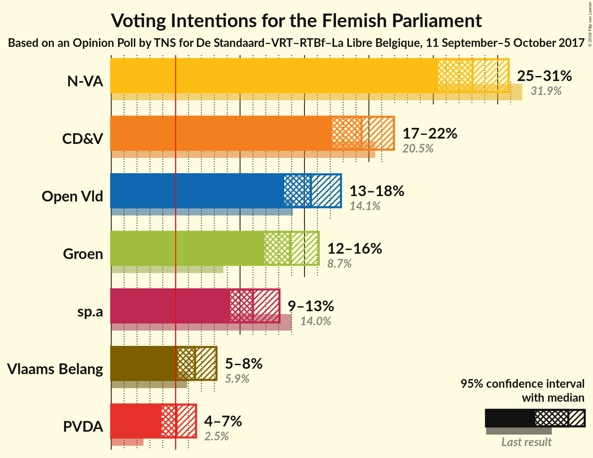
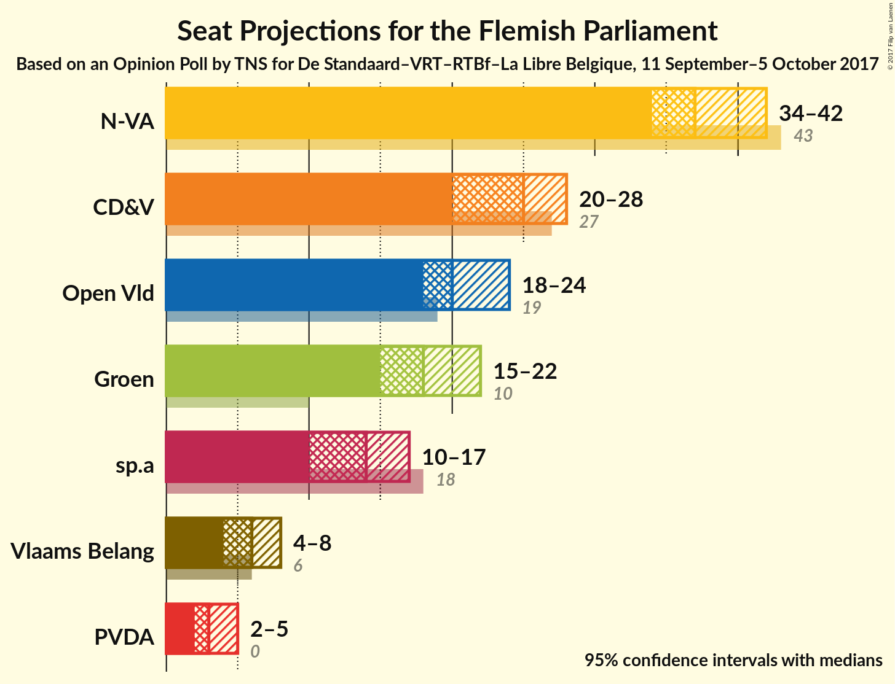
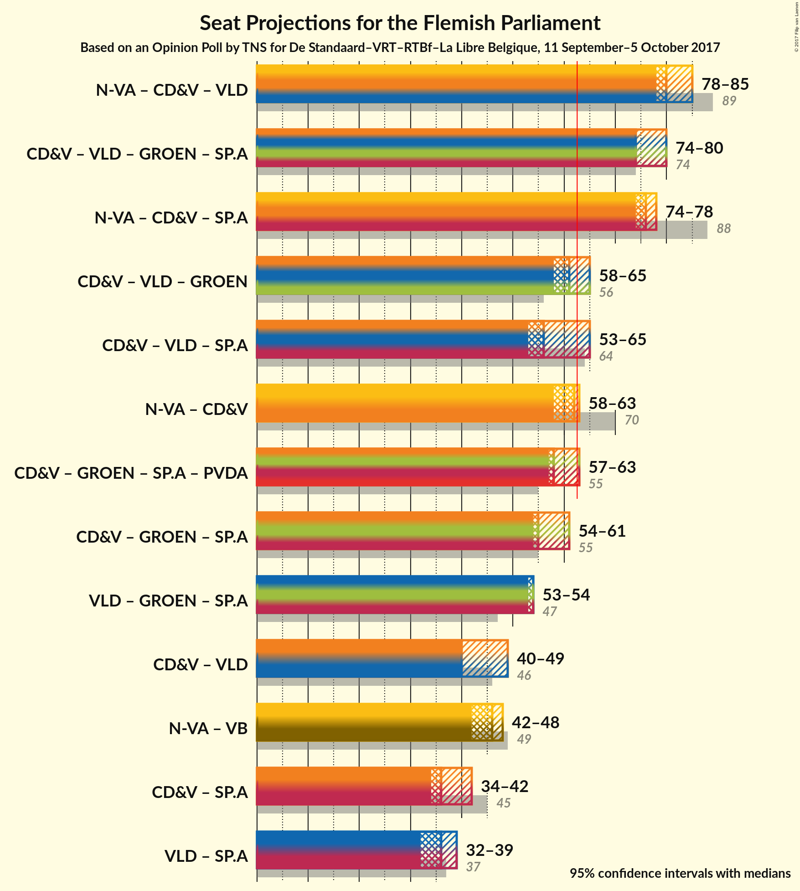

# Opinion Poll by TNS for De Standaard–VRT–RTBf–La Libre Belgique, 11 September–5 October 2017

<a href="#voting-intentions">Voting Intentions</a> | <a href="#seats">Seats</a> | <a href="#coalitions">Coalitions</a> | <a href="#technical-information">Technical Information</a>

## Voting Intentions

### Confidence Intervals

| Party | Last Result | Poll Result | 80% Confidence Interval | 90% Confidence Interval | 95% Confidence Interval | 99% Confidence Interval |
|:-----:|:-----------:|:-----------:|:-----------------------:|:-----------------------:|:-----------------------:|:-----------------------:|
| N-VA | 31.9% | 28.0% | 26.3–29.9% |25.8–30.4% |25.4–30.8% |24.6–31.7% |
| CD&V | 20.5% | 19.4% | 17.9–21.1% |17.5–21.5% |17.1–21.9% |16.4–22.8% |
| Open Vld | 14.1% | 15.5% | 14.1–17.0% |13.8–17.5% |13.4–17.8% |12.8–18.6% |
| Groen | 8.7% | 13.9% | 12.6–15.3% |12.2–15.7% |11.9–16.1% |11.3–16.8% |
| sp.a | 14.0% | 11.0% | 9.8–12.3% |9.5–12.7% |9.2–13.1% |8.7–13.7% |
| Vlaams Belang | 5.9% | 6.5% | 5.6–7.6% |5.4–7.9% |5.2–8.2% |4.8–8.7% |
| PVDA | 2.5% | 5.1% | 4.3–6.1% |4.1–6.3% |3.9–6.6% |3.6–7.1% |

*Note:* The poll result column reflects the actual value used in the calculations. Published results may vary slightly, and in addition be rounded to fewer digits.

## Seats

### Confidence Intervals

| Party | Last Result | Median | 80% Confidence Interval | 90% Confidence Interval | 95% Confidence Interval | 99% Confidence Interval |
|:-----:|:-----------:|:------:|:-----------------------:|:-----------------------:|:-----------------------:|:-----------------------:|
| <a href="#n-va">N-VA</a> | 43 | 38 | 36–42 |36–42 |36–42 |33–42 |
| <a href="#cd&v">CD&V</a> | 27 | 21 | 20–26 |20–26 |20–26 |20–29 |
| <a href="#open-vld">Open Vld</a> | 19 | 20 | 18–23 |18–23 |18–23 |18–23 |
| <a href="#groen">Groen</a> | 10 | 18 | 15–22 |15–22 |15–22 |15–22 |
| <a href="#sp.a">sp.a</a> | 18 | 16 | 13–16 |13–16 |13–16 |9–16 |
| <a href="#vlaams-belang">Vlaams Belang</a> | 6 | 6 | 6–8 |6–8 |6–8 |6–8 |
| <a href="#pvda">PVDA</a> | 0 | 2 | 2–4 |2–4 |2–4 |2–5 |

### N-VA

*For a full overview of the results for this party, see the [N-VA](party-nva.html) page.*

| Number of Seats | Probability | Accumulated | Special Marks |
|:---------------:|:-----------:|:-----------:|:-------------:|
| 33 | 1.3% | 100% |  |
| 34 | 0.3% | 98.7% |  |
| 35 | 0.1% | 98% |  |
| 36 | 17% | 98% |  |
| 37 | 23% | 81% |  |
| 38 | 43% | 58% | Median |
| 39 | 0% | 14% |  |
| 40 | 0% | 14% |  |
| 41 | 0.1% | 14% |  |
| 42 | 14% | 14% |  |
| 43 | 0.2% | 0.2% | Last Result |
| 44 | 0% | 0% |  |

### CD&V

*For a full overview of the results for this party, see the [CD&V](party-cdv.html) page.*

| Number of Seats | Probability | Accumulated | Special Marks |
|:---------------:|:-----------:|:-----------:|:-------------:|
| 20 | 43% | 100% |  |
| 21 | 14% | 57% | Median |
| 22 | 0.1% | 43% |  |
| 23 | 0% | 43% |  |
| 24 | 0% | 43% |  |
| 25 | 24% | 43% |  |
| 26 | 18% | 19% |  |
| 27 | 0% | 1.4% | Last Result |
| 28 | 0% | 1.3% |  |
| 29 | 1.3% | 1.3% |  |
| 30 | 0% | 0% |  |

### Open Vld

*For a full overview of the results for this party, see the [Open Vld](party-openvld.html) page.*

| Number of Seats | Probability | Accumulated | Special Marks |
|:---------------:|:-----------:|:-----------:|:-------------:|
| 15 | 0.2% | 100% |  |
| 16 | 0% | 99.8% |  |
| 17 | 0% | 99.8% |  |
| 18 | 23% | 99.8% |  |
| 19 | 14% | 76% | Last Result |
| 20 | 44% | 62% | Median |
| 21 | 0% | 18% |  |
| 22 | 0% | 18% |  |
| 23 | 18% | 18% |  |
| 24 | 0% | 0% |  |

### Groen

*For a full overview of the results for this party, see the [Groen](party-groen.html) page.*

| Number of Seats | Probability | Accumulated | Special Marks |
|:---------------:|:-----------:|:-----------:|:-------------:|
| 10 | 0% | 100% | Last Result |
| 11 | 0% | 100% |  |
| 12 | 0% | 100% |  |
| 13 | 0% | 100% |  |
| 14 | 0% | 100% |  |
| 15 | 18% | 100% |  |
| 16 | 0% | 82% |  |
| 17 | 0.3% | 82% |  |
| 18 | 43% | 82% | Median |
| 19 | 0% | 39% |  |
| 20 | 1.4% | 39% |  |
| 21 | 14% | 38% |  |
| 22 | 23% | 23% |  |
| 23 | 0.1% | 0.1% |  |
| 24 | 0% | 0% |  |

### sp.a

*For a full overview of the results for this party, see the [sp.a](party-spa.html) page.*

| Number of Seats | Probability | Accumulated | Special Marks |
|:---------------:|:-----------:|:-----------:|:-------------:|
| 9 | 1.3% | 100% |  |
| 10 | 0% | 98.7% |  |
| 11 | 0.3% | 98.7% |  |
| 12 | 0.2% | 98% |  |
| 13 | 14% | 98% |  |
| 14 | 24% | 84% |  |
| 15 | 0% | 60% |  |
| 16 | 60% | 60% | Median |
| 17 | 0.1% | 0.1% |  |
| 18 | 0% | 0% | Last Result |

### Vlaams Belang

*For a full overview of the results for this party, see the [Vlaams Belang](party-vlaamsbelang.html) page.*

| Number of Seats | Probability | Accumulated | Special Marks |
|:---------------:|:-----------:|:-----------:|:-------------:|
| 3 | 0.1% | 100% |  |
| 4 | 0.2% | 99.9% |  |
| 5 | 0% | 99.7% |  |
| 6 | 55% | 99.7% | Last Result, Median |
| 7 | 0% | 45% |  |
| 8 | 44% | 45% |  |
| 9 | 0.1% | 0.2% |  |
| 10 | 0.1% | 0.1% |  |
| 11 | 0% | 0% |  |

### PVDA

*For a full overview of the results for this party, see the [PVDA](party-pvda.html) page.*

| Number of Seats | Probability | Accumulated | Special Marks |
|:---------------:|:-----------:|:-----------:|:-------------:|
| 0 | 0% | 100% | Last Result |
| 1 | 0% | 100% |  |
| 2 | 55% | 100% | Median |
| 3 | 0% | 45% |  |
| 4 | 43% | 45% |  |
| 5 | 2% | 2% |  |
| 6 | 0% | 0% |  |

## Coalitions

### Confidence Intervals

| Coalition | Last Result | Median | Majority? | 80% Confidence Interval | 90% Confidence Interval | 95% Confidence Interval | 99% Confidence Interval |
|:---------:|:-----------:|:------:|:---------:|:-----------------------:|:-----------------------:|:-----------------------:|:-----------------------:|
| N-VA – CD&V – Open Vld | 89 | 80 | 100% | 78–85 | 78–85 | 78–85 | 78–85 |
| CD&V – Open Vld – Groen – sp.a | 74 | 74 | 100% | 74–80 | 74–80 | 74–80 | 74–80 |
| N-VA – CD&V – sp.a | 88 | 76 | 100% | 74–78 | 74–78 | 74–78 | 71–78 |
| CD&V – Open Vld – sp.a | 64 | 56 | 17% | 53–65 | 53–65 | 53–65 | 53–65 |
| N-VA – CD&V | 70 | 62 | 14% | 58–63 | 58–63 | 58–63 | 58–63 |
| CD&V – Groen – sp.a – PVDA | 55 | 58 | 25% | 57–63 | 57–63 | 57–63 | 57–63 |
| CD&V – Groen – sp.a | 55 | 55 | 0% | 54–61 | 54–61 | 54–61 | 54–61 |
| Open Vld – Groen – sp.a | 47 | 54 | 0% | 53–54 | 53–54 | 53–54 | 49–54 |
| CD&V – Open Vld | 46 | 40 | 0% | 40–49 | 40–49 | 40–49 | 40–49 |
| N-VA – Vlaams Belang | 49 | 46 | 0% | 42–48 | 42–48 | 42–48 | 41–48 |
| CD&V – sp.a | 45 | 36 | 0% | 34–42 | 34–42 | 34–42 | 34–42 |
| Open Vld – sp.a | 37 | 36 | 0% | 32–39 | 32–39 | 32–39 | 29–39 |

### N-VA – CD&V – Open Vld

| Number of Seats | Probability | Accumulated | Special Marks |
|:---------------:|:-----------:|:-----------:|:-------------:|
| 77 | 0% | 100% |  |
| 78 | 43% | 99.9% |  |
| 79 | 0.2% | 57% | Median |
| 80 | 23% | 57% |  |
| 81 | 0.2% | 34% |  |
| 82 | 16% | 33% |  |
| 83 | 0% | 18% |  |
| 84 | 0.2% | 18% |  |
| 85 | 17% | 17% |  |
| 86 | 0% | 0.1% |  |
| 87 | 0% | 0.1% |  |
| 88 | 0% | 0.1% |  |
| 89 | 0% | 0% | Last Result |

### CD&V – Open Vld – Groen – sp.a

| Number of Seats | Probability | Accumulated | Special Marks |
|:---------------:|:-----------:|:-----------:|:-------------:|
| 69 | 0.1% | 100% |  |
| 70 | 0.2% | 99.9% |  |
| 71 | 0% | 99.7% |  |
| 72 | 0.1% | 99.7% |  |
| 73 | 0% | 99.6% |  |
| 74 | 57% | 99.6% | Last Result |
| 75 | 0% | 43% | Median |
| 76 | 0% | 43% |  |
| 77 | 0.5% | 43% |  |
| 78 | 1.3% | 42% |  |
| 79 | 23% | 41% |  |
| 80 | 17% | 17% |  |
| 81 | 0.1% | 0.1% |  |
| 82 | 0% | 0% |  |

### N-VA – CD&V – sp.a

| Number of Seats | Probability | Accumulated | Special Marks |
|:---------------:|:-----------:|:-----------:|:-------------:|
| 70 | 0.3% | 100% |  |
| 71 | 1.3% | 99.7% |  |
| 72 | 0.2% | 98% |  |
| 73 | 0% | 98% |  |
| 74 | 43% | 98% |  |
| 75 | 0.3% | 55% | Median |
| 76 | 37% | 55% |  |
| 77 | 0.1% | 18% |  |
| 78 | 17% | 18% |  |
| 79 | 0% | 0.3% |  |
| 80 | 0% | 0.3% |  |
| 81 | 0.3% | 0.3% |  |
| 82 | 0% | 0% |  |
| 83 | 0% | 0% |  |
| 84 | 0% | 0% |  |
| 85 | 0% | 0% |  |
| 86 | 0% | 0% |  |
| 87 | 0% | 0% |  |
| 88 | 0% | 0% | Last Result |

### CD&V – Open Vld – sp.a

| Number of Seats | Probability | Accumulated | Special Marks |
|:---------------:|:-----------:|:-----------:|:-------------:|
| 53 | 14% | 100% |  |
| 54 | 0.1% | 86% |  |
| 55 | 0% | 86% |  |
| 56 | 43% | 86% |  |
| 57 | 24% | 43% | Median |
| 58 | 1.4% | 19% |  |
| 59 | 0.3% | 18% |  |
| 60 | 0% | 17% |  |
| 61 | 0% | 17% |  |
| 62 | 0% | 17% |  |
| 63 | 0% | 17% | Majority |
| 64 | 0% | 17% | Last Result |
| 65 | 17% | 17% |  |
| 66 | 0% | 0% |  |

### N-VA – CD&V

| Number of Seats | Probability | Accumulated | Special Marks |
|:---------------:|:-----------:|:-----------:|:-------------:|
| 56 | 0.1% | 100% |  |
| 57 | 0% | 99.9% |  |
| 58 | 43% | 99.9% |  |
| 59 | 0.5% | 57% | Median |
| 60 | 0.1% | 57% |  |
| 61 | 0.1% | 57% |  |
| 62 | 42% | 56% |  |
| 63 | 14% | 14% | Majority |
| 64 | 0% | 0.3% |  |
| 65 | 0% | 0.3% |  |
| 66 | 0% | 0.3% |  |
| 67 | 0% | 0.3% |  |
| 68 | 0% | 0.2% |  |
| 69 | 0.2% | 0.2% |  |
| 70 | 0% | 0% | Last Result |

### CD&V – Groen – sp.a – PVDA

| Number of Seats | Probability | Accumulated | Special Marks |
|:---------------:|:-----------:|:-----------:|:-------------:|
| 53 | 0.1% | 100% |  |
| 54 | 0% | 99.9% |  |
| 55 | 0.1% | 99.9% | Last Result |
| 56 | 0% | 99.8% |  |
| 57 | 14% | 99.8% | Median |
| 58 | 43% | 86% |  |
| 59 | 18% | 43% |  |
| 60 | 0.2% | 25% |  |
| 61 | 0% | 25% |  |
| 62 | 0% | 25% |  |
| 63 | 25% | 25% | Majority |
| 64 | 0.1% | 0.1% |  |
| 65 | 0% | 0% |  |

### CD&V – Groen – sp.a

| Number of Seats | Probability | Accumulated | Special Marks |
|:---------------:|:-----------:|:-----------:|:-------------:|
| 49 | 0.1% | 100% |  |
| 50 | 0% | 99.9% |  |
| 51 | 0% | 99.9% |  |
| 52 | 0.1% | 99.9% |  |
| 53 | 0% | 99.8% |  |
| 54 | 43% | 99.7% |  |
| 55 | 14% | 56% | Last Result, Median |
| 56 | 0% | 42% |  |
| 57 | 17% | 42% |  |
| 58 | 1.4% | 25% |  |
| 59 | 0% | 23% |  |
| 60 | 0% | 23% |  |
| 61 | 23% | 23% |  |
| 62 | 0.1% | 0.1% |  |
| 63 | 0% | 0% | Majority |

### Open Vld – Groen – sp.a

| Number of Seats | Probability | Accumulated | Special Marks |
|:---------------:|:-----------:|:-----------:|:-------------:|
| 44 | 0.2% | 100% |  |
| 45 | 0% | 99.8% |  |
| 46 | 0% | 99.8% |  |
| 47 | 0% | 99.7% | Last Result |
| 48 | 0% | 99.7% |  |
| 49 | 1.4% | 99.7% |  |
| 50 | 0% | 98% |  |
| 51 | 0.1% | 98% |  |
| 52 | 0.3% | 98% |  |
| 53 | 14% | 98% |  |
| 54 | 84% | 84% | Median |
| 55 | 0% | 0.3% |  |
| 56 | 0.2% | 0.3% |  |
| 57 | 0% | 0.1% |  |
| 58 | 0% | 0.1% |  |
| 59 | 0.1% | 0.1% |  |
| 60 | 0% | 0% |  |

### CD&V – Open Vld

| Number of Seats | Probability | Accumulated | Special Marks |
|:---------------:|:-----------:|:-----------:|:-------------:|
| 40 | 57% | 100% |  |
| 41 | 0.4% | 43% | Median |
| 42 | 0% | 43% |  |
| 43 | 23% | 43% |  |
| 44 | 0.1% | 19% |  |
| 45 | 0% | 19% |  |
| 46 | 0% | 19% | Last Result |
| 47 | 0% | 19% |  |
| 48 | 0.3% | 19% |  |
| 49 | 19% | 19% |  |
| 50 | 0% | 0% |  |

### N-VA – Vlaams Belang

| Number of Seats | Probability | Accumulated | Special Marks |
|:---------------:|:-----------:|:-----------:|:-------------:|
| 40 | 0% | 100% |  |
| 41 | 1.4% | 99.9% |  |
| 42 | 18% | 98.6% |  |
| 43 | 23% | 81% |  |
| 44 | 0.1% | 57% | Median |
| 45 | 0% | 57% |  |
| 46 | 43% | 57% |  |
| 47 | 0.1% | 15% |  |
| 48 | 14% | 14% |  |
| 49 | 0.2% | 0.3% | Last Result |
| 50 | 0% | 0.1% |  |
| 51 | 0.1% | 0.1% |  |
| 52 | 0% | 0% |  |

### CD&V – sp.a

| Number of Seats | Probability | Accumulated | Special Marks |
|:---------------:|:-----------:|:-----------:|:-------------:|
| 34 | 14% | 100% |  |
| 35 | 0% | 86% |  |
| 36 | 43% | 86% |  |
| 37 | 0.1% | 43% | Median |
| 38 | 1.5% | 42% |  |
| 39 | 23% | 41% |  |
| 40 | 0.1% | 18% |  |
| 41 | 0% | 17% |  |
| 42 | 17% | 17% |  |
| 43 | 0% | 0.1% |  |
| 44 | 0% | 0% |  |
| 45 | 0% | 0% | Last Result |

### Open Vld – sp.a

| Number of Seats | Probability | Accumulated | Special Marks |
|:---------------:|:-----------:|:-----------:|:-------------:|
| 27 | 0.2% | 100% |  |
| 28 | 0% | 99.8% |  |
| 29 | 1.3% | 99.8% |  |
| 30 | 0% | 98% |  |
| 31 | 0% | 98% |  |
| 32 | 37% | 98% |  |
| 33 | 0% | 61% |  |
| 34 | 0.4% | 61% |  |
| 35 | 0% | 61% |  |
| 36 | 43% | 61% | Median |
| 37 | 0% | 17% | Last Result |
| 38 | 0% | 17% |  |
| 39 | 17% | 17% |  |
| 40 | 0% | 0% |  |

## Technical Information

### Opinion Poll

+ **Pollster:** TNS
+ **Media:** De Standaard–VRT–RTBf–La Libre Belgique
+ **Fieldwork period:** 11 September–5 October 2017

### Calculations

+ **Sample size:** 1045
+ **Simulations done:** 1,024
+ **Error estimate:** 2.42%

