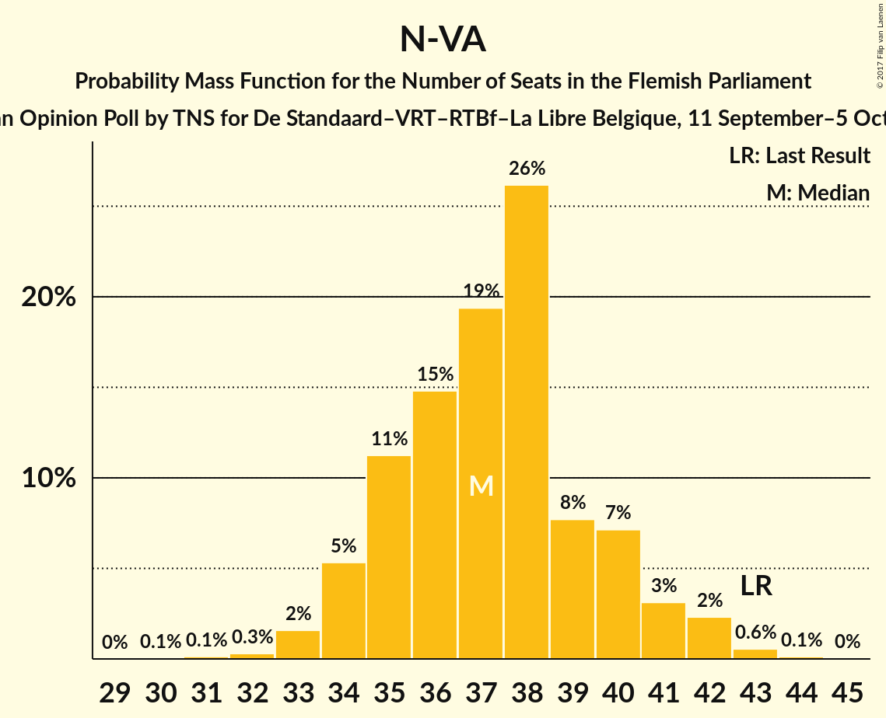
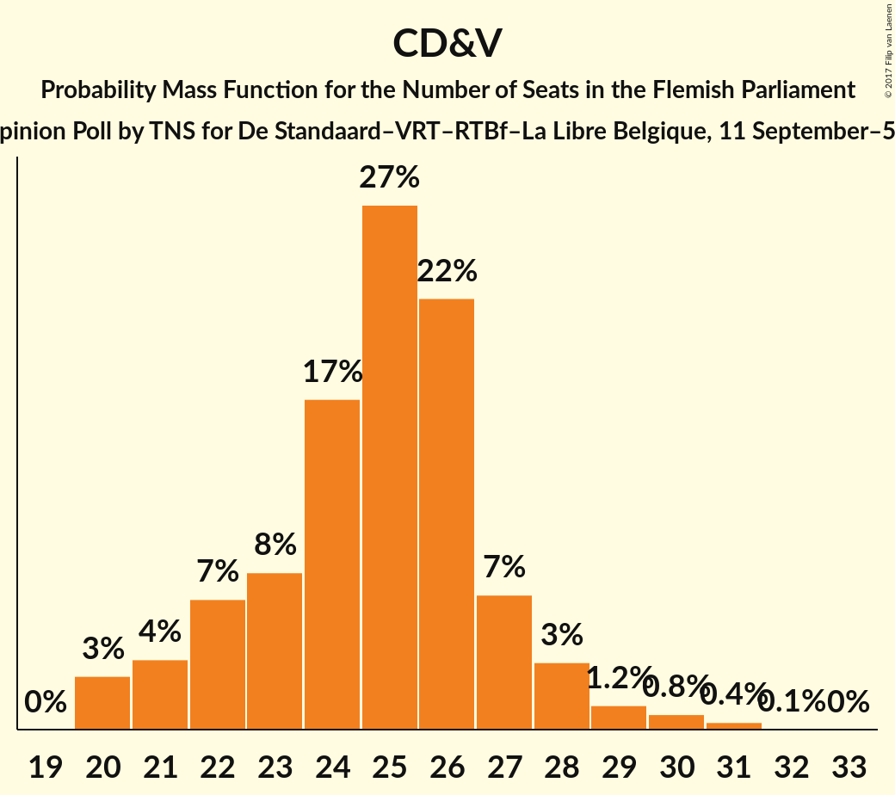
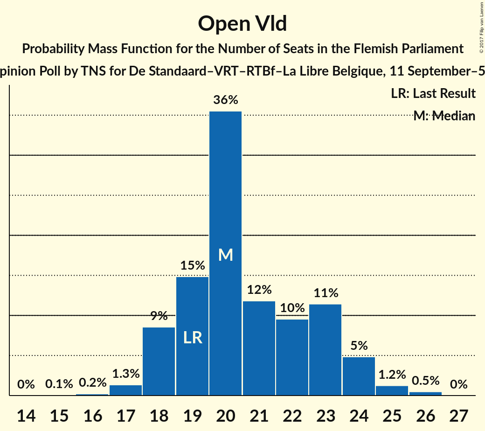
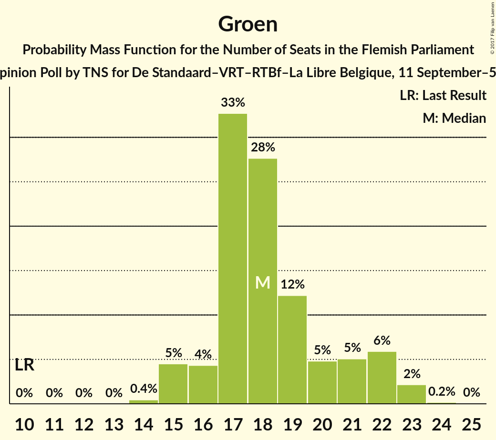
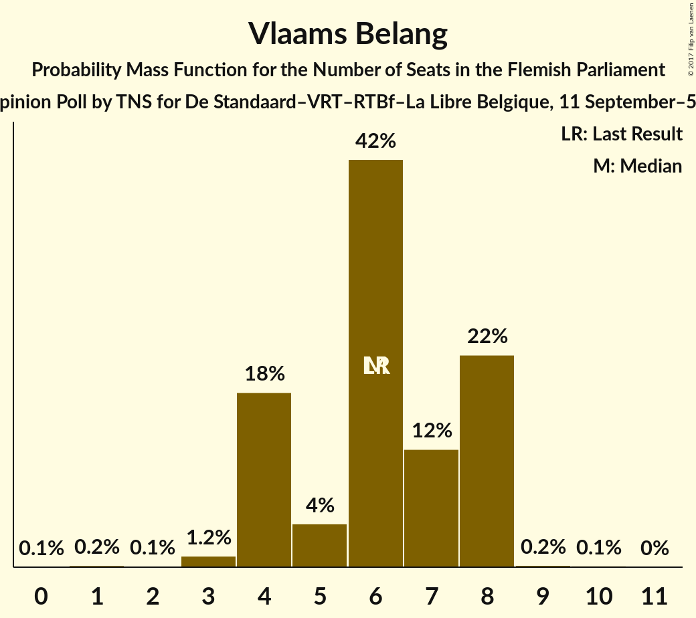
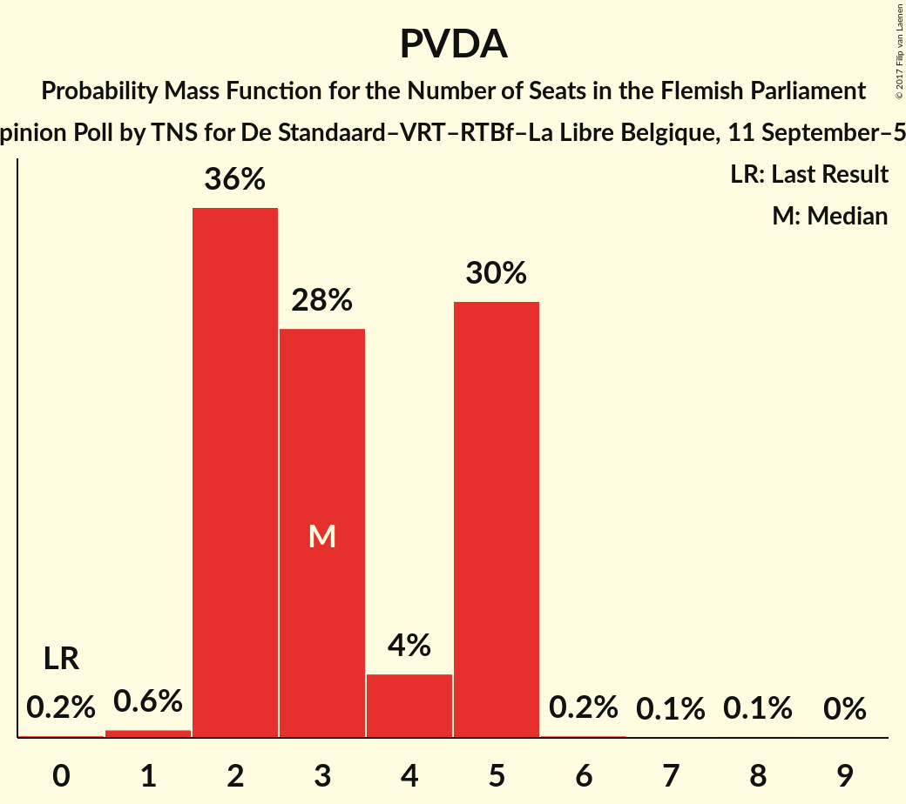

# Opinion Poll by TNS for De Standaard–VRT–RTBf–La Libre Belgique, 11 September–5 October 2017

<a href="#voting-intentions">Voting Intentions</a> | <a href="#seats">Seats</a> | <a href="#coalitions">Coalitions</a> | <a href="#technical-information">Technical Information</a>

## Voting Intentions

### Confidence Intervals

| Party | Last Result | Poll Result | 80% Confidence Interval | 90% Confidence Interval | 95% Confidence Interval | 99% Confidence Interval |
|:-----:|:-----------:|:-----------:|:-----------------------:|:-----------------------:|:-----------------------:|:-----------------------:|
| N-VA | 31.9% | 28.0% | 26.3–29.9% |25.8–30.4% |25.4–30.8% |24.6–31.7% |
| CD&V | 20.5% | 19.4% | 17.9–21.1% |17.5–21.5% |17.1–21.9% |16.4–22.8% |
| Open Vld | 14.1% | 15.5% | 14.1–17.0% |13.8–17.5% |13.4–17.8% |12.8–18.6% |
| Groen | 8.7% | 13.9% | 12.6–15.3% |12.2–15.7% |11.9–16.1% |11.3–16.8% |
| sp.a | 14.0% | 11.0% | 9.8–12.3% |9.5–12.7% |9.2–13.1% |8.7–13.7% |
| Vlaams Belang | 5.9% | 6.5% | 5.6–7.6% |5.4–7.9% |5.2–8.2% |4.8–8.7% |
| PVDA | 2.5% | 5.1% | 4.3–6.1% |4.1–6.3% |3.9–6.6% |3.6–7.1% |

*Note:* The poll result column reflects the actual value used in the calculations. Published results may vary slightly, and in addition be rounded to fewer digits.

## Seats

### Confidence Intervals

| Party | Last Result | Median | 80% Confidence Interval | 90% Confidence Interval | 95% Confidence Interval | 99% Confidence Interval |
|:-----:|:-----------:|:------:|:-----------------------:|:-----------------------:|:-----------------------:|:-----------------------:|
| <a href="#n-va">N-VA</a> | 43 | 37 | 35–40 |34–41 |34–42 |32–43 |
| <a href="#cd&v">CD&V</a> | 27 | 25 | 22–27 |21–28 |20–29 |20–30 |
| <a href="#open-vld">Open Vld</a> | 19 | 20 | 19–23 |18–24 |18–24 |17–25 |
| <a href="#groen">Groen</a> | 10 | 18 | 16–21 |16–22 |15–22 |15–23 |
| <a href="#sp.a">sp.a</a> | 18 | 14 | 13–15 |11–15 |10–17 |9–19 |
| <a href="#vlaams-belang">Vlaams Belang</a> | 6 | 6 | 4–8 |4–8 |4–8 |3–8 |
| <a href="#pvda">PVDA</a> | 0 | 3 | 2–5 |2–5 |2–5 |1–5 |

### N-VA

*For a full overview of the results for this party, see the [N-VA](party-n-va.html) page.*

| Number of Seats | Probability | Accumulated | Special Marks |
|:---------------:|:-----------:|:-----------:|:-------------:|
| 30 | 0.1% | 100% |  |
| 31 | 0.1% | 99.9% |  |
| 32 | 0.4% | 99.8% |  |
| 33 | 1.4% | 99.4% |  |
| 34 | 6% | 98% |  |
| 35 | 10% | 92% |  |
| 36 | 14% | 82% |  |
| 37 | 22% | 68% | Median |
| 38 | 25% | 46% |  |
| 39 | 8% | 21% |  |
| 40 | 7% | 13% |  |
| 41 | 4% | 7% |  |
| 42 | 2% | 3% |  |
| 43 | 0.6% | 0.7% | Last Result |
| 44 | 0.1% | 0.2% |  |
| 45 | 0% | 0% |  |

### CD&V

*For a full overview of the results for this party, see the [CD&V](party-cdv.html) page.*

| Number of Seats | Probability | Accumulated | Special Marks |
|:---------------:|:-----------:|:-----------:|:-------------:|
| 20 | 3% | 100% |  |
| 21 | 4% | 97% |  |
| 22 | 6% | 94% |  |
| 23 | 8% | 87% |  |
| 24 | 17% | 79% |  |
| 25 | 27% | 62% | Median |
| 26 | 22% | 35% |  |
| 27 | 7% | 13% | Last Result |
| 28 | 4% | 6% |  |
| 29 | 2% | 3% |  |
| 30 | 0.8% | 1.2% |  |
| 31 | 0.3% | 0.4% |  |
| 32 | 0.1% | 0.1% |  |
| 33 | 0% | 0% |  |

### Open Vld

*For a full overview of the results for this party, see the [Open Vld](party-openvld.html) page.*

| Number of Seats | Probability | Accumulated | Special Marks |
|:---------------:|:-----------:|:-----------:|:-------------:|
| 15 | 0.1% | 100% |  |
| 16 | 0.2% | 99.9% |  |
| 17 | 1.4% | 99.7% |  |
| 18 | 8% | 98% |  |
| 19 | 17% | 90% | Last Result |
| 20 | 35% | 73% | Median |
| 21 | 12% | 39% |  |
| 22 | 10% | 27% |  |
| 23 | 11% | 17% |  |
| 24 | 5% | 6% |  |
| 25 | 1.3% | 2% |  |
| 26 | 0.4% | 0.4% |  |
| 27 | 0% | 0% |  |

### Groen

*For a full overview of the results for this party, see the [Groen](party-groen.html) page.*

| Number of Seats | Probability | Accumulated | Special Marks |
|:---------------:|:-----------:|:-----------:|:-------------:|
| 10 | 0% | 100% | Last Result |
| 11 | 0% | 100% |  |
| 12 | 0% | 100% |  |
| 13 | 0% | 100% |  |
| 14 | 0.4% | 100% |  |
| 15 | 4% | 99.6% |  |
| 16 | 5% | 95% |  |
| 17 | 30% | 90% |  |
| 18 | 29% | 60% | Median |
| 19 | 11% | 31% |  |
| 20 | 6% | 19% |  |
| 21 | 6% | 13% |  |
| 22 | 6% | 8% |  |
| 23 | 2% | 2% |  |
| 24 | 0.2% | 0.2% |  |
| 25 | 0% | 0% |  |

### sp.a

*For a full overview of the results for this party, see the [sp.a](party-spa.html) page.*

| Number of Seats | Probability | Accumulated | Special Marks |
|:---------------:|:-----------:|:-----------:|:-------------:|
| 8 | 0.1% | 100% |  |
| 9 | 1.0% | 99.9% |  |
| 10 | 1.4% | 98.9% |  |
| 11 | 3% | 97% |  |
| 12 | 4% | 94% |  |
| 13 | 12% | 91% |  |
| 14 | 66% | 79% | Median |
| 15 | 8% | 13% |  |
| 16 | 2% | 4% |  |
| 17 | 1.4% | 3% |  |
| 18 | 0.7% | 1.3% | Last Result |
| 19 | 0.6% | 0.6% |  |
| 20 | 0% | 0% |  |

### Vlaams Belang

*For a full overview of the results for this party, see the [Vlaams Belang](party-vlaamsbelang.html) page.*

| Number of Seats | Probability | Accumulated | Special Marks |
|:---------------:|:-----------:|:-----------:|:-------------:|
| 0 | 0.1% | 100% |  |
| 1 | 0.2% | 99.9% |  |
| 2 | 0.2% | 99.7% |  |
| 3 | 1.3% | 99.5% |  |
| 4 | 16% | 98% |  |
| 5 | 8% | 82% |  |
| 6 | 39% | 75% | Last Result, Median |
| 7 | 11% | 35% |  |
| 8 | 24% | 25% |  |
| 9 | 0.3% | 0.4% |  |
| 10 | 0.1% | 0.2% |  |
| 11 | 0% | 0% |  |

### PVDA

*For a full overview of the results for this party, see the [PVDA](party-pvda.html) page.*

| Number of Seats | Probability | Accumulated | Special Marks |
|:---------------:|:-----------:|:-----------:|:-------------:|
| 0 | 0.2% | 100% | Last Result |
| 1 | 0.6% | 99.8% |  |
| 2 | 37% | 99.2% |  |
| 3 | 30% | 62% | Median |
| 4 | 4% | 32% |  |
| 5 | 28% | 28% |  |
| 6 | 0.2% | 0.4% |  |
| 7 | 0.1% | 0.2% |  |
| 8 | 0.1% | 0.1% |  |
| 9 | 0% | 0% |  |

## Coalitions

### Confidence Intervals

| Coalition | Last Result | Median | Majority? | 80% Confidence Interval | 90% Confidence Interval | 95% Confidence Interval | 99% Confidence Interval |
|:---------:|:-----------:|:------:|:---------:|:-----------------------:|:-----------------------:|:-----------------------:|:-----------------------:|
| N-VA – CD&V – Open Vld | 89 | 83 | 100% | 80–86 | 79–86 | 78–87 | 76–89 |
| CD&V – Open Vld – Groen – sp.a | 74 | 77 | 100% | 74–80 | 74–81 | 73–82 | 72–83 |
| N-VA – CD&V – sp.a | 88 | 76 | 100% | 73–79 | 72–80 | 71–81 | 69–82 |
| CD&V – Open Vld – Groen | 56 | 63 | 67% | 61–66 | 60–67 | 59–68 | 58–70 |
| N-VA – CD&V | 70 | 62 | 44% | 59–65 | 58–66 | 57–67 | 56–68 |
| CD&V – Groen – sp.a – PVDA | 55 | 60 | 12% | 57–63 | 56–64 | 55–65 | 54–66 |
| CD&V – Open Vld – sp.a | 64 | 59 | 8% | 56–62 | 55–63 | 54–64 | 53–65 |
| CD&V – Groen – sp.a | 55 | 57 | 1.1% | 54–60 | 53–61 | 52–62 | 51–63 |
| Open Vld – Groen – sp.a | 47 | 52 | 0% | 50–56 | 49–56 | 48–57 | 47–59 |
| CD&V – Open Vld | 46 | 45 | 0% | 43–48 | 42–49 | 41–49 | 39–51 |
| N-VA – Vlaams Belang | 49 | 43 | 0% | 41–46 | 40–47 | 39–48 | 37–50 |
| CD&V – sp.a | 45 | 39 | 0% | 36–41 | 35–42 | 34–43 | 33–44 |
| Open Vld – sp.a | 37 | 34 | 0% | 32–37 | 31–38 | 30–39 | 29–40 |

### N-VA – CD&V – Open Vld

| Number of Seats | Probability | Accumulated | Special Marks |
|:---------------:|:-----------:|:-----------:|:-------------:|
| 74 | 0% | 100% |  |
| 75 | 0.2% | 99.9% |  |
| 76 | 0.4% | 99.8% |  |
| 77 | 1.1% | 99.4% |  |
| 78 | 3% | 98% |  |
| 79 | 5% | 96% |  |
| 80 | 9% | 91% |  |
| 81 | 13% | 82% |  |
| 82 | 17% | 69% | Median |
| 83 | 15% | 52% |  |
| 84 | 16% | 37% |  |
| 85 | 10% | 21% |  |
| 86 | 7% | 11% |  |
| 87 | 3% | 4% |  |
| 88 | 1.0% | 2% |  |
| 89 | 0.4% | 0.6% | Last Result |
| 90 | 0.1% | 0.2% |  |
| 91 | 0.1% | 0.1% |  |
| 92 | 0% | 0% |  |

### CD&V – Open Vld – Groen – sp.a

| Number of Seats | Probability | Accumulated | Special Marks |
|:---------------:|:-----------:|:-----------:|:-------------:|
| 69 | 0% | 100% |  |
| 70 | 0.1% | 99.9% |  |
| 71 | 0.4% | 99.9% |  |
| 72 | 1.3% | 99.5% |  |
| 73 | 3% | 98% |  |
| 74 | 5% | 95% | Last Result |
| 75 | 11% | 90% |  |
| 76 | 14% | 79% |  |
| 77 | 19% | 64% | Median |
| 78 | 14% | 46% |  |
| 79 | 14% | 31% |  |
| 80 | 10% | 17% |  |
| 81 | 5% | 7% |  |
| 82 | 2% | 3% |  |
| 83 | 0.5% | 1.0% |  |
| 84 | 0.3% | 0.4% |  |
| 85 | 0.1% | 0.1% |  |
| 86 | 0% | 0% |  |

### N-VA – CD&V – sp.a

| Number of Seats | Probability | Accumulated | Special Marks |
|:---------------:|:-----------:|:-----------:|:-------------:|
| 68 | 0.1% | 100% |  |
| 69 | 0.4% | 99.8% |  |
| 70 | 0.8% | 99.4% |  |
| 71 | 2% | 98.6% |  |
| 72 | 4% | 97% |  |
| 73 | 8% | 93% |  |
| 74 | 12% | 84% |  |
| 75 | 16% | 72% |  |
| 76 | 15% | 56% | Median |
| 77 | 16% | 41% |  |
| 78 | 11% | 25% |  |
| 79 | 8% | 14% |  |
| 80 | 4% | 7% |  |
| 81 | 2% | 3% |  |
| 82 | 0.6% | 1.0% |  |
| 83 | 0.3% | 0.3% |  |
| 84 | 0.1% | 0.1% |  |
| 85 | 0% | 0% |  |
| 86 | 0% | 0% |  |
| 87 | 0% | 0% |  |
| 88 | 0% | 0% | Last Result |

### CD&V – Open Vld – Groen

| Number of Seats | Probability | Accumulated | Special Marks |
|:---------------:|:-----------:|:-----------:|:-------------:|
| 56 | 0.1% | 100% | Last Result |
| 57 | 0.3% | 99.9% |  |
| 58 | 1.1% | 99.6% |  |
| 59 | 2% | 98% |  |
| 60 | 5% | 96% |  |
| 61 | 11% | 91% |  |
| 62 | 13% | 80% |  |
| 63 | 17% | 67% | Median, Majority |
| 64 | 17% | 50% |  |
| 65 | 14% | 33% |  |
| 66 | 10% | 19% |  |
| 67 | 5% | 9% |  |
| 68 | 2% | 4% |  |
| 69 | 0.7% | 2% |  |
| 70 | 0.6% | 0.8% |  |
| 71 | 0.2% | 0.3% |  |
| 72 | 0.1% | 0.1% |  |
| 73 | 0% | 0% |  |

### N-VA – CD&V

| Number of Seats | Probability | Accumulated | Special Marks |
|:---------------:|:-----------:|:-----------:|:-------------:|
| 54 | 0.1% | 100% |  |
| 55 | 0.2% | 99.9% |  |
| 56 | 0.7% | 99.7% |  |
| 57 | 2% | 98.9% |  |
| 58 | 4% | 97% |  |
| 59 | 7% | 94% |  |
| 60 | 11% | 87% |  |
| 61 | 17% | 76% |  |
| 62 | 15% | 59% | Median |
| 63 | 15% | 44% | Majority |
| 64 | 14% | 29% |  |
| 65 | 7% | 15% |  |
| 66 | 4% | 8% |  |
| 67 | 2% | 3% |  |
| 68 | 0.9% | 1.3% |  |
| 69 | 0.4% | 0.5% |  |
| 70 | 0.1% | 0.1% | Last Result |
| 71 | 0% | 0% |  |

### CD&V – Groen – sp.a – PVDA

| Number of Seats | Probability | Accumulated | Special Marks |
|:---------------:|:-----------:|:-----------:|:-------------:|
| 52 | 0.1% | 100% |  |
| 53 | 0.2% | 99.9% |  |
| 54 | 0.6% | 99.7% |  |
| 55 | 2% | 99.1% | Last Result |
| 56 | 5% | 97% |  |
| 57 | 6% | 92% |  |
| 58 | 11% | 85% |  |
| 59 | 13% | 75% |  |
| 60 | 19% | 62% | Median |
| 61 | 17% | 43% |  |
| 62 | 13% | 26% |  |
| 63 | 7% | 12% | Majority |
| 64 | 3% | 6% |  |
| 65 | 2% | 3% |  |
| 66 | 0.6% | 1.1% |  |
| 67 | 0.3% | 0.5% |  |
| 68 | 0.2% | 0.2% |  |
| 69 | 0% | 0% |  |

### CD&V – Open Vld – sp.a

| Number of Seats | Probability | Accumulated | Special Marks |
|:---------------:|:-----------:|:-----------:|:-------------:|
| 51 | 0.1% | 100% |  |
| 52 | 0.2% | 99.9% |  |
| 53 | 0.7% | 99.7% |  |
| 54 | 2% | 98.9% |  |
| 55 | 3% | 97% |  |
| 56 | 5% | 94% |  |
| 57 | 10% | 89% |  |
| 58 | 19% | 79% |  |
| 59 | 17% | 60% | Median |
| 60 | 16% | 43% |  |
| 61 | 12% | 27% |  |
| 62 | 7% | 15% |  |
| 63 | 5% | 8% | Majority |
| 64 | 2% | 3% | Last Result |
| 65 | 0.5% | 0.8% |  |
| 66 | 0.2% | 0.3% |  |
| 67 | 0.1% | 0.1% |  |
| 68 | 0% | 0% |  |

### CD&V – Groen – sp.a

| Number of Seats | Probability | Accumulated | Special Marks |
|:---------------:|:-----------:|:-----------:|:-------------:|
| 49 | 0.1% | 100% |  |
| 50 | 0.3% | 99.9% |  |
| 51 | 0.8% | 99.6% |  |
| 52 | 2% | 98.8% |  |
| 53 | 6% | 97% |  |
| 54 | 8% | 91% |  |
| 55 | 11% | 83% | Last Result |
| 56 | 16% | 72% |  |
| 57 | 19% | 56% | Median |
| 58 | 15% | 37% |  |
| 59 | 11% | 22% |  |
| 60 | 6% | 12% |  |
| 61 | 3% | 6% |  |
| 62 | 1.5% | 3% |  |
| 63 | 0.8% | 1.1% | Majority |
| 64 | 0.2% | 0.3% |  |
| 65 | 0.1% | 0.1% |  |
| 66 | 0% | 0% |  |

### Open Vld – Groen – sp.a

| Number of Seats | Probability | Accumulated | Special Marks |
|:---------------:|:-----------:|:-----------:|:-------------:|
| 45 | 0.1% | 100% |  |
| 46 | 0.3% | 99.9% |  |
| 47 | 1.1% | 99.5% | Last Result |
| 48 | 2% | 98% |  |
| 49 | 5% | 96% |  |
| 50 | 10% | 91% |  |
| 51 | 16% | 82% |  |
| 52 | 18% | 66% | Median |
| 53 | 15% | 48% |  |
| 54 | 12% | 33% |  |
| 55 | 10% | 21% |  |
| 56 | 6% | 11% |  |
| 57 | 3% | 5% |  |
| 58 | 1.1% | 2% |  |
| 59 | 0.5% | 0.7% |  |
| 60 | 0.2% | 0.2% |  |
| 61 | 0% | 0.1% |  |
| 62 | 0% | 0% |  |

### CD&V – Open Vld

| Number of Seats | Probability | Accumulated | Special Marks |
|:---------------:|:-----------:|:-----------:|:-------------:|
| 38 | 0.1% | 100% |  |
| 39 | 0.4% | 99.8% |  |
| 40 | 2% | 99.4% |  |
| 41 | 2% | 98% |  |
| 42 | 4% | 95% |  |
| 43 | 9% | 91% |  |
| 44 | 18% | 82% |  |
| 45 | 20% | 64% | Median |
| 46 | 15% | 44% | Last Result |
| 47 | 12% | 29% |  |
| 48 | 9% | 17% |  |
| 49 | 6% | 8% |  |
| 50 | 1.3% | 2% |  |
| 51 | 0.5% | 0.9% |  |
| 52 | 0.3% | 0.5% |  |
| 53 | 0.1% | 0.1% |  |
| 54 | 0% | 0% |  |

### N-VA – Vlaams Belang

| Number of Seats | Probability | Accumulated | Special Marks |
|:---------------:|:-----------:|:-----------:|:-------------:|
| 36 | 0.1% | 100% |  |
| 37 | 0.4% | 99.9% |  |
| 38 | 0.8% | 99.5% |  |
| 39 | 2% | 98.7% |  |
| 40 | 3% | 97% |  |
| 41 | 9% | 93% |  |
| 42 | 20% | 84% |  |
| 43 | 18% | 64% | Median |
| 44 | 16% | 47% |  |
| 45 | 12% | 31% |  |
| 46 | 11% | 19% |  |
| 47 | 5% | 8% |  |
| 48 | 2% | 3% |  |
| 49 | 0.7% | 1.2% | Last Result |
| 50 | 0.4% | 0.5% |  |
| 51 | 0.1% | 0.1% |  |
| 52 | 0% | 0% |  |

### CD&V – sp.a

| Number of Seats | Probability | Accumulated | Special Marks |
|:---------------:|:-----------:|:-----------:|:-------------:|
| 31 | 0.1% | 100% |  |
| 32 | 0.2% | 99.9% |  |
| 33 | 0.6% | 99.7% |  |
| 34 | 3% | 99.1% |  |
| 35 | 5% | 96% |  |
| 36 | 7% | 91% |  |
| 37 | 10% | 84% |  |
| 38 | 17% | 74% |  |
| 39 | 25% | 56% | Median |
| 40 | 15% | 31% |  |
| 41 | 8% | 16% |  |
| 42 | 4% | 7% |  |
| 43 | 2% | 4% |  |
| 44 | 0.9% | 1.4% |  |
| 45 | 0.3% | 0.4% | Last Result |
| 46 | 0.1% | 0.1% |  |
| 47 | 0% | 0% |  |

### Open Vld – sp.a

| Number of Seats | Probability | Accumulated | Special Marks |
|:---------------:|:-----------:|:-----------:|:-------------:|
| 28 | 0.3% | 100% |  |
| 29 | 0.9% | 99.7% |  |
| 30 | 2% | 98.7% |  |
| 31 | 3% | 97% |  |
| 32 | 10% | 94% |  |
| 33 | 15% | 83% |  |
| 34 | 28% | 68% | Median |
| 35 | 15% | 40% |  |
| 36 | 10% | 26% |  |
| 37 | 8% | 16% | Last Result |
| 38 | 6% | 8% |  |
| 39 | 2% | 3% |  |
| 40 | 0.5% | 0.7% |  |
| 41 | 0.1% | 0.2% |  |
| 42 | 0% | 0.1% |  |
| 43 | 0% | 0% |  |

## Technical Information

### Opinion Poll

+ **Polling firm:** TNS
+ **Commissioner(s):** De Standaard–VRT–RTBf–La Libre Belgique
+ **Fieldwork period:** 11 September–5 October 2017

### Calculations

+ **Sample size:** 1045
+ **Simulations done:** 2,097,152
+ **Error estimate:** 0.64%

