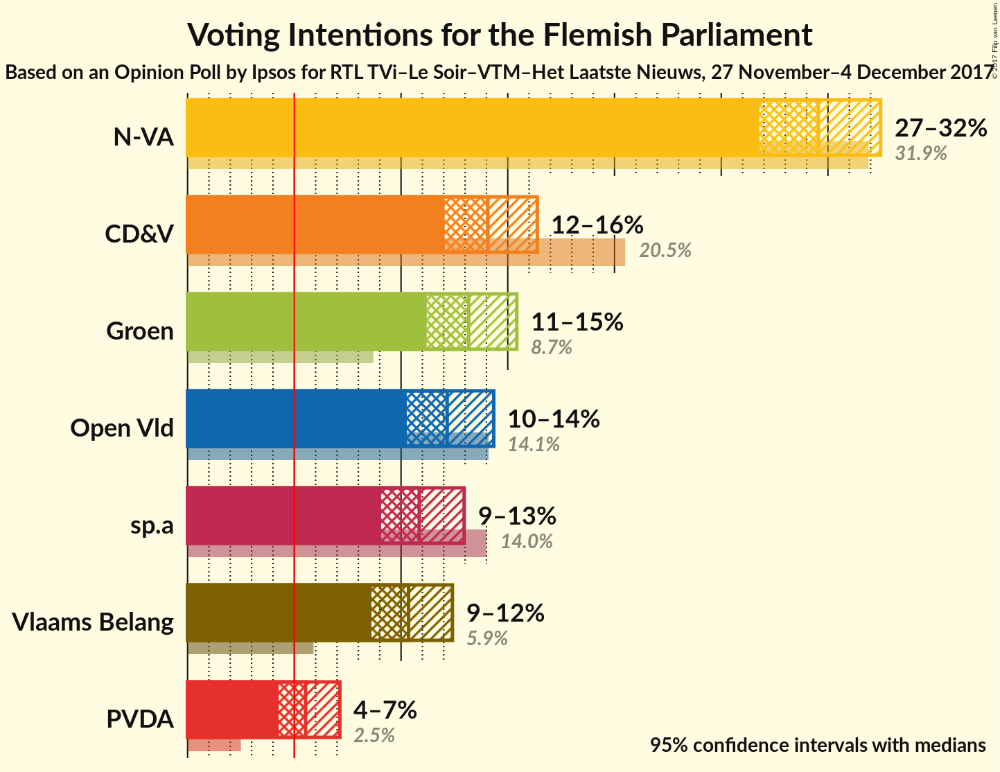
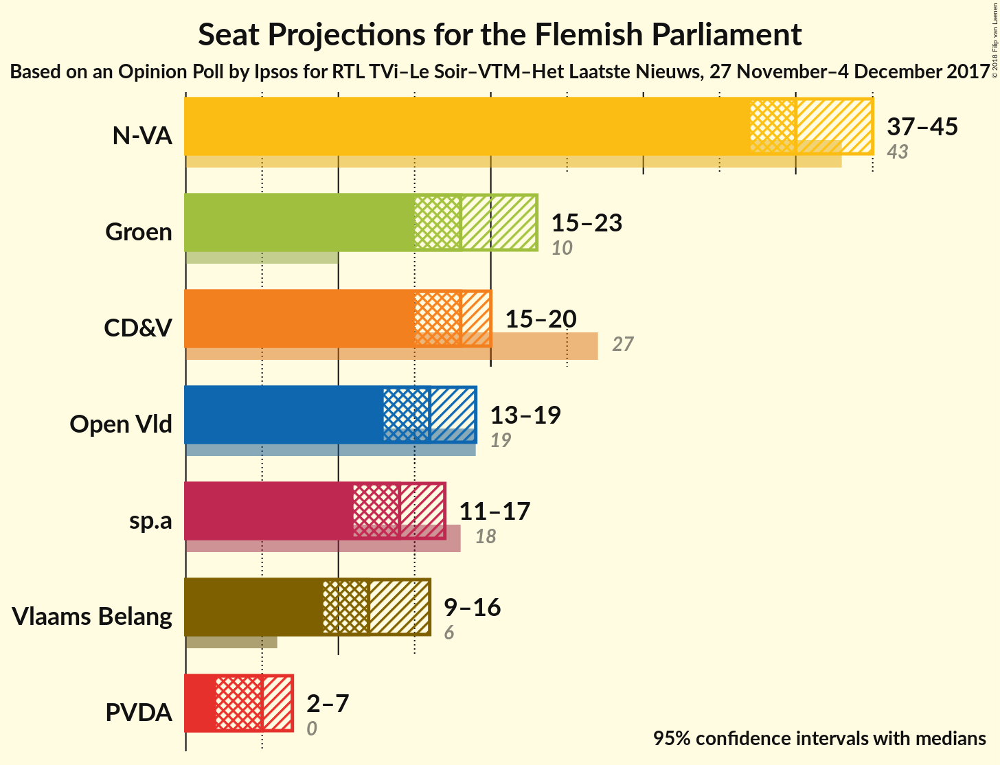
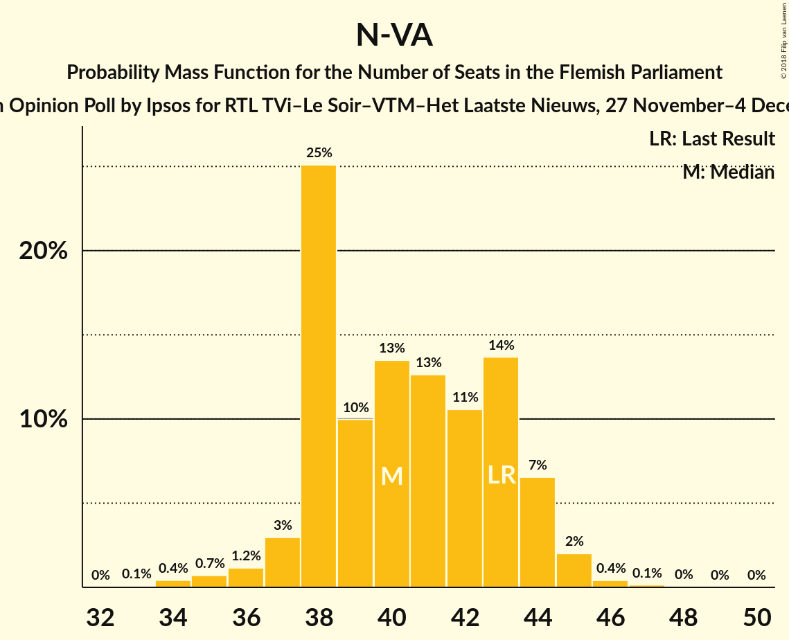
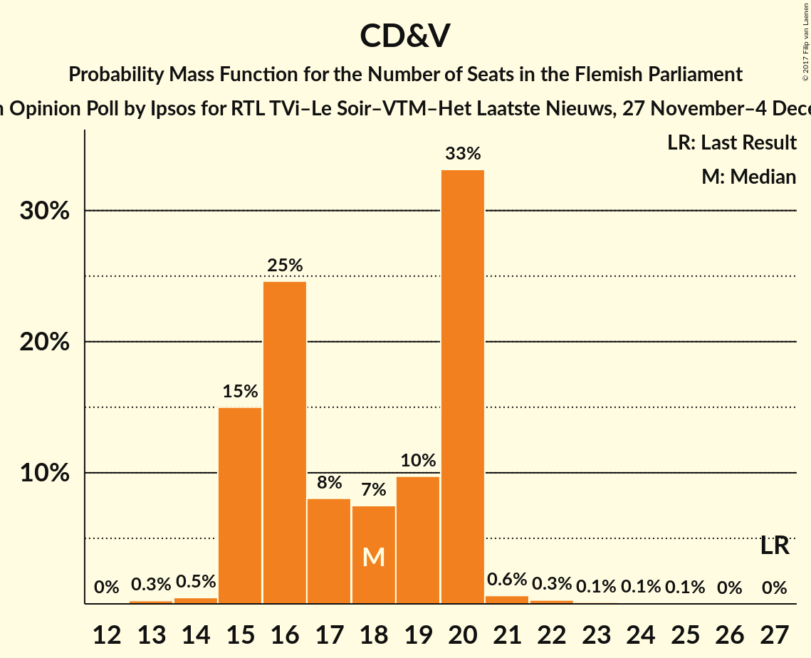
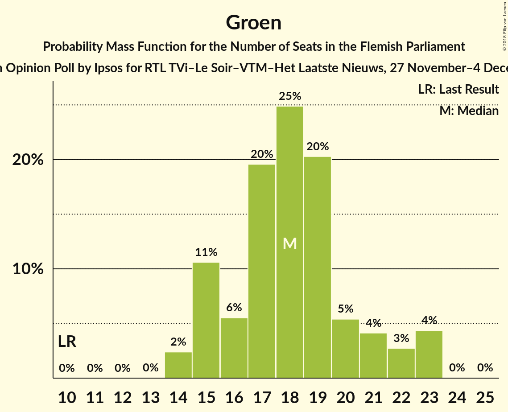
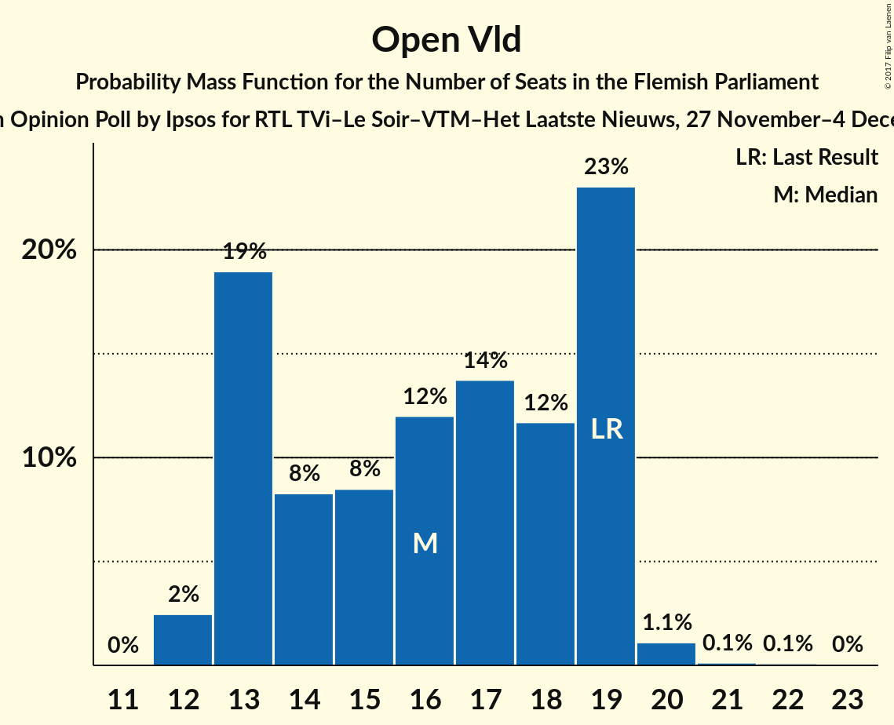
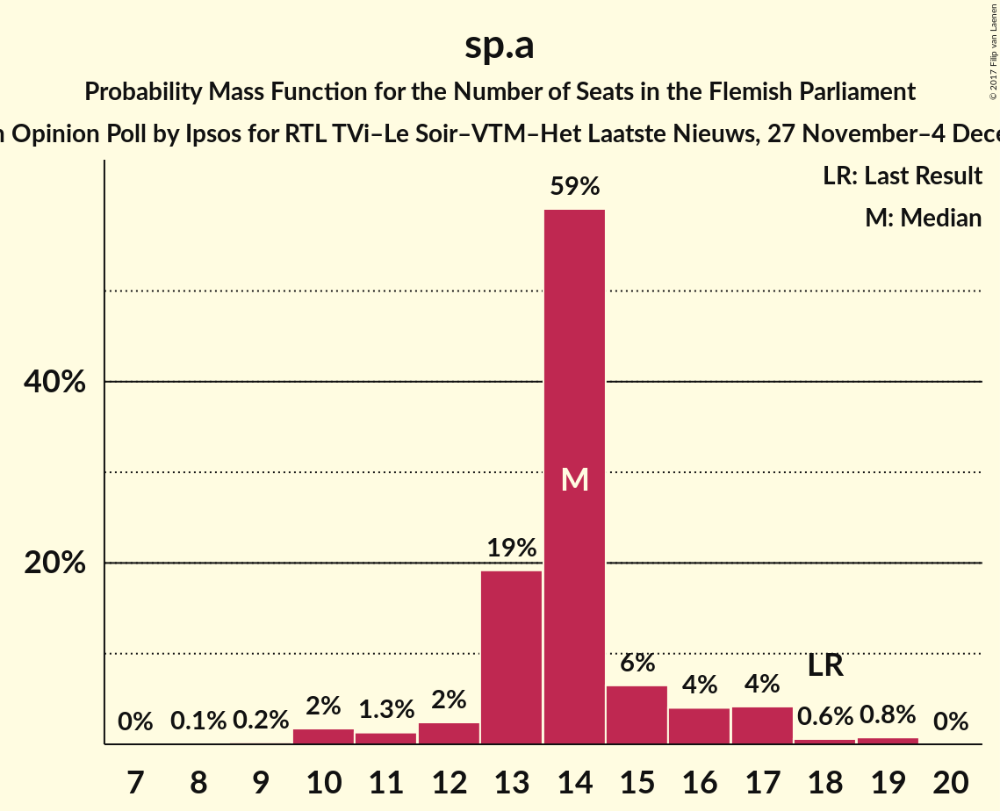
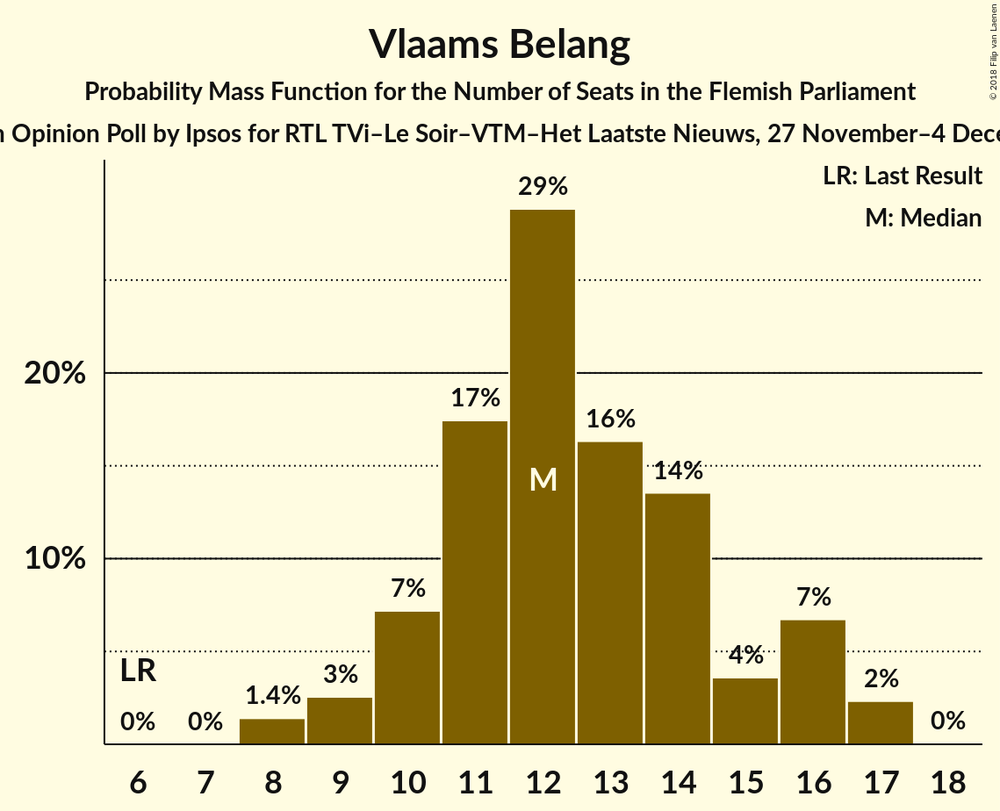
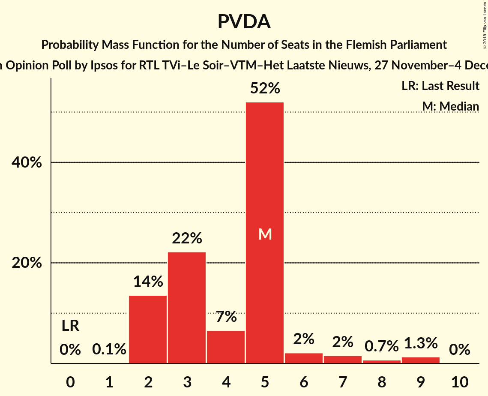
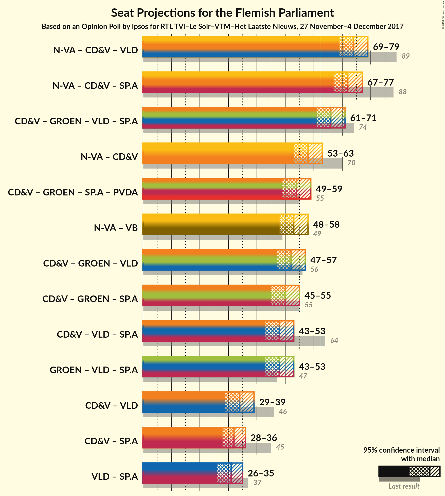

# Opinion Poll by Ipsos for RTL TVi–Le Soir–VTM–Het Laatste Nieuws, 27 November–4 December 2017

<a href="#voting-intentions">Voting Intentions</a> | <a href="#seats">Seats</a> | <a href="#coalitions">Coalitions</a> | <a href="#technical-information">Technical Information</a>

## Voting Intentions

### Confidence Intervals

| Party | Last Result | Poll Result | 80% Confidence Interval | 90% Confidence Interval | 95% Confidence Interval | 99% Confidence Interval |
|:-----:|:-----------:|:-----------:|:-----------------------:|:-----------------------:|:-----------------------:|:-----------------------:|
| N-VA | 31.9% | 29.5% | 27.7–31.5% |27.2–32.0% |26.8–32.5% |25.9–33.4% |
| CD&V | 20.5% | 14.1% | 12.7–15.6% |12.4–16.0% |12.0–16.4% |11.4–17.1% |
| Groen | 8.7% | 13.2% | 11.9–14.6% |11.5–15.1% |11.2–15.4% |10.6–16.1% |
| Open Vld | 14.1% | 12.2% | 10.9–13.6% |10.6–14.0% |10.3–14.3% |9.7–15.1% |
| sp.a | 14.0% | 10.9% | 9.7–12.2% |9.3–12.6% |9.1–13.0% |8.5–13.6% |
| Vlaams Belang | 5.9% | 10.4% | 9.2–11.7% |8.9–12.1% |8.6–12.4% |8.1–13.1% |
| PVDA | 2.5% | 5.5% | 4.7–6.6% |4.5–6.9% |4.3–7.1% |3.9–7.7% |

*Note:* The poll result column reflects the actual value used in the calculations. Published results may vary slightly, and in addition be rounded to fewer digits.

## Seats

### Confidence Intervals

| Party | Last Result | Median | 80% Confidence Interval | 90% Confidence Interval | 95% Confidence Interval | 99% Confidence Interval |
|:-----:|:-----------:|:------:|:-----------------------:|:-----------------------:|:-----------------------:|:-----------------------:|
| <a href="#n-va">N-VA</a> | 43 | 40 | 38–43 |38–44 |37–45 |35–46 |
| <a href="#cd&v">CD&V</a> | 27 | 18 | 15–20 |15–20 |15–20 |14–22 |
| <a href="#groen">Groen</a> | 10 | 18 | 15–21 |15–22 |15–23 |14–23 |
| <a href="#open-vld">Open Vld</a> | 19 | 17 | 13–19 |13–19 |12–19 |12–20 |
| <a href="#sp.a">sp.a</a> | 18 | 14 | 13–15 |12–17 |11–17 |10–19 |
| <a href="#vlaams-belang">Vlaams Belang</a> | 6 | 12 | 10–15 |10–16 |9–16 |8–17 |
| <a href="#pvda">PVDA</a> | 0 | 5 | 2–5 |2–6 |2–7 |2–9 |

### N-VA

*For a full overview of the results for this party, see the [N-VA](party-n-va.html) page.*

| Number of Seats | Probability | Accumulated | Special Marks |
|:---------------:|:-----------:|:-----------:|:-------------:|
| 33 | 0.1% | 100% |  |
| 34 | 0.4% | 99.9% |  |
| 35 | 0.7% | 99.5% |  |
| 36 | 1.0% | 98.8% |  |
| 37 | 3% | 98% |  |
| 38 | 25% | 95% |  |
| 39 | 10% | 70% |  |
| 40 | 13% | 60% | Median |
| 41 | 12% | 47% |  |
| 42 | 12% | 35% |  |
| 43 | 13% | 23% | Last Result |
| 44 | 6% | 9% |  |
| 45 | 2% | 3% |  |
| 46 | 0.4% | 0.6% |  |
| 47 | 0.1% | 0.3% |  |
| 48 | 0.1% | 0.1% |  |
| 49 | 0% | 0.1% |  |
| 50 | 0% | 0% |  |

### CD&V

*For a full overview of the results for this party, see the [CD&V](party-cdv.html) page.*

| Number of Seats | Probability | Accumulated | Special Marks |
|:---------------:|:-----------:|:-----------:|:-------------:|
| 13 | 0.2% | 100% |  |
| 14 | 0.6% | 99.7% |  |
| 15 | 15% | 99.2% |  |
| 16 | 26% | 84% |  |
| 17 | 8% | 58% |  |
| 18 | 8% | 51% | Median |
| 19 | 10% | 43% |  |
| 20 | 31% | 33% |  |
| 21 | 0.6% | 1.2% |  |
| 22 | 0.3% | 0.6% |  |
| 23 | 0.1% | 0.3% |  |
| 24 | 0.1% | 0.2% |  |
| 25 | 0.1% | 0.1% |  |
| 26 | 0% | 0% |  |
| 27 | 0% | 0% | Last Result |

### Groen

*For a full overview of the results for this party, see the [Groen](party-groen.html) page.*

| Number of Seats | Probability | Accumulated | Special Marks |
|:---------------:|:-----------:|:-----------:|:-------------:|
| 10 | 0% | 100% | Last Result |
| 11 | 0% | 100% |  |
| 12 | 0% | 100% |  |
| 13 | 0% | 100% |  |
| 14 | 2% | 100% |  |
| 15 | 10% | 98% |  |
| 16 | 6% | 87% |  |
| 17 | 20% | 81% |  |
| 18 | 26% | 61% | Median |
| 19 | 19% | 36% |  |
| 20 | 6% | 16% |  |
| 21 | 4% | 10% |  |
| 22 | 3% | 7% |  |
| 23 | 4% | 4% |  |
| 24 | 0% | 0.1% |  |
| 25 | 0% | 0% |  |

### Open Vld

*For a full overview of the results for this party, see the [Open Vld](party-openvld.html) page.*

| Number of Seats | Probability | Accumulated | Special Marks |
|:---------------:|:-----------:|:-----------:|:-------------:|
| 12 | 3% | 100% |  |
| 13 | 16% | 97% |  |
| 14 | 7% | 81% |  |
| 15 | 8% | 74% |  |
| 16 | 13% | 66% |  |
| 17 | 16% | 53% | Median |
| 18 | 15% | 37% |  |
| 19 | 21% | 22% | Last Result |
| 20 | 1.1% | 1.4% |  |
| 21 | 0.2% | 0.3% |  |
| 22 | 0.1% | 0.1% |  |
| 23 | 0% | 0% |  |

### sp.a

*For a full overview of the results for this party, see the [sp.a](party-spa.html) page.*

| Number of Seats | Probability | Accumulated | Special Marks |
|:---------------:|:-----------:|:-----------:|:-------------:|
| 9 | 0.2% | 100% |  |
| 10 | 2% | 99.7% |  |
| 11 | 1.1% | 98% |  |
| 12 | 2% | 97% |  |
| 13 | 18% | 94% |  |
| 14 | 61% | 77% | Median |
| 15 | 7% | 16% |  |
| 16 | 4% | 9% |  |
| 17 | 4% | 5% |  |
| 18 | 0.6% | 1.3% | Last Result |
| 19 | 0.7% | 0.7% |  |
| 20 | 0% | 0% |  |

### Vlaams Belang

*For a full overview of the results for this party, see the [Vlaams Belang](party-vlaamsbelang.html) page.*

| Number of Seats | Probability | Accumulated | Special Marks |
|:---------------:|:-----------:|:-----------:|:-------------:|
| 6 | 0% | 100% | Last Result |
| 7 | 0% | 100% |  |
| 8 | 1.4% | 100% |  |
| 9 | 2% | 98.6% |  |
| 10 | 8% | 96% |  |
| 11 | 18% | 88% |  |
| 12 | 30% | 71% | Median |
| 13 | 17% | 41% |  |
| 14 | 12% | 24% |  |
| 15 | 3% | 12% |  |
| 16 | 7% | 9% |  |
| 17 | 2% | 2% |  |
| 18 | 0% | 0.1% |  |
| 19 | 0% | 0% |  |

### PVDA

*For a full overview of the results for this party, see the [PVDA](party-pvda.html) page.*

| Number of Seats | Probability | Accumulated | Special Marks |
|:---------------:|:-----------:|:-----------:|:-------------:|
| 0 | 0% | 100% | Last Result |
| 1 | 0.1% | 100% |  |
| 2 | 14% | 99.9% |  |
| 3 | 22% | 86% |  |
| 4 | 7% | 64% |  |
| 5 | 52% | 58% | Median |
| 6 | 2% | 6% |  |
| 7 | 2% | 4% |  |
| 8 | 0.7% | 2% |  |
| 9 | 1.3% | 1.3% |  |
| 10 | 0% | 0% |  |

## Coalitions

### Confidence Intervals

| Coalition | Last Result | Median | Majority? | 80% Confidence Interval | 90% Confidence Interval | 95% Confidence Interval | 99% Confidence Interval |
|:---------:|:-----------:|:------:|:---------:|:-----------------------:|:-----------------------:|:-----------------------:|:-----------------------:|
| N-VA – CD&V – Open Vld | 89 | 74 | 100% | 71–78 | 70–79 | 69–79 | 67–81 |
| N-VA – CD&V – sp.a | 88 | 72 | 100% | 68–75 | 68–76 | 67–77 | 66–79 |
| CD&V – Groen – Open Vld – sp.a | 74 | 66 | 89% | 62–69 | 61–70 | 61–71 | 59–72 |
| N-VA – CD&V | 70 | 58 | 4% | 54–61 | 54–62 | 53–63 | 52–65 |
| CD&V – Groen – sp.a – PVDA | 55 | 54 | 0.1% | 50–57 | 49–59 | 49–59 | 47–61 |
| N-VA – Vlaams Belang | 49 | 53 | 0% | 50–56 | 49–57 | 48–58 | 46–60 |
| CD&V – Groen – Open Vld | 56 | 52 | 0% | 48–55 | 47–56 | 47–57 | 45–58 |
| CD&V – Groen – sp.a | 55 | 50 | 0% | 46–53 | 45–54 | 45–55 | 43–57 |
| CD&V – Open Vld – sp.a | 64 | 48 | 0% | 44–52 | 43–53 | 43–53 | 41–54 |
| Groen – Open Vld – sp.a | 47 | 48 | 0% | 45–51 | 44–52 | 43–53 | 41–55 |
| CD&V – Open Vld | 46 | 34 | 0% | 30–38 | 29–39 | 29–39 | 28–39 |
| CD&V – sp.a | 45 | 32 | 0% | 29–34 | 28–35 | 28–36 | 26–37 |
| Open Vld – sp.a | 37 | 31 | 0% | 27–33 | 26–34 | 26–35 | 25–36 |

### N-VA – CD&V – Open Vld

| Number of Seats | Probability | Accumulated | Special Marks |
|:---------------:|:-----------:|:-----------:|:-------------:|
| 66 | 0.2% | 100% |  |
| 67 | 0.4% | 99.8% |  |
| 68 | 0.9% | 99.4% |  |
| 69 | 2% | 98.6% |  |
| 70 | 4% | 97% |  |
| 71 | 6% | 93% |  |
| 72 | 11% | 86% |  |
| 73 | 15% | 76% |  |
| 74 | 13% | 61% |  |
| 75 | 13% | 48% | Median |
| 76 | 12% | 35% |  |
| 77 | 9% | 23% |  |
| 78 | 7% | 13% |  |
| 79 | 4% | 7% |  |
| 80 | 1.3% | 2% |  |
| 81 | 0.5% | 0.8% |  |
| 82 | 0.2% | 0.3% |  |
| 83 | 0.1% | 0.1% |  |
| 84 | 0% | 0% |  |
| 85 | 0% | 0% |  |
| 86 | 0% | 0% |  |
| 87 | 0% | 0% |  |
| 88 | 0% | 0% |  |
| 89 | 0% | 0% | Last Result |

### N-VA – CD&V – sp.a

| Number of Seats | Probability | Accumulated | Special Marks |
|:---------------:|:-----------:|:-----------:|:-------------:|
| 64 | 0.1% | 100% |  |
| 65 | 0.2% | 99.9% |  |
| 66 | 0.6% | 99.7% |  |
| 67 | 2% | 99.1% |  |
| 68 | 8% | 97% |  |
| 69 | 8% | 90% |  |
| 70 | 9% | 82% |  |
| 71 | 12% | 73% |  |
| 72 | 17% | 60% | Median |
| 73 | 15% | 44% |  |
| 74 | 11% | 28% |  |
| 75 | 8% | 17% |  |
| 76 | 5% | 9% |  |
| 77 | 2% | 4% |  |
| 78 | 1.0% | 2% |  |
| 79 | 0.5% | 0.8% |  |
| 80 | 0.2% | 0.3% |  |
| 81 | 0% | 0.1% |  |
| 82 | 0% | 0% |  |
| 83 | 0% | 0% |  |
| 84 | 0% | 0% |  |
| 85 | 0% | 0% |  |
| 86 | 0% | 0% |  |
| 87 | 0% | 0% |  |
| 88 | 0% | 0% | Last Result |

### CD&V – Groen – Open Vld – sp.a

| Number of Seats | Probability | Accumulated | Special Marks |
|:---------------:|:-----------:|:-----------:|:-------------:|
| 57 | 0.1% | 100% |  |
| 58 | 0.4% | 99.9% |  |
| 59 | 0.6% | 99.6% |  |
| 60 | 1.2% | 98.9% |  |
| 61 | 3% | 98% |  |
| 62 | 5% | 94% |  |
| 63 | 8% | 89% | Majority |
| 64 | 11% | 82% |  |
| 65 | 11% | 71% |  |
| 66 | 15% | 60% |  |
| 67 | 15% | 45% | Median |
| 68 | 13% | 30% |  |
| 69 | 8% | 17% |  |
| 70 | 5% | 9% |  |
| 71 | 3% | 4% |  |
| 72 | 1.0% | 1.4% |  |
| 73 | 0.2% | 0.4% |  |
| 74 | 0.1% | 0.1% | Last Result |
| 75 | 0% | 0% |  |

### N-VA – CD&V

| Number of Seats | Probability | Accumulated | Special Marks |
|:---------------:|:-----------:|:-----------:|:-------------:|
| 50 | 0.1% | 100% |  |
| 51 | 0.2% | 99.9% |  |
| 52 | 0.4% | 99.8% |  |
| 53 | 2% | 99.4% |  |
| 54 | 7% | 97% |  |
| 55 | 7% | 90% |  |
| 56 | 10% | 83% |  |
| 57 | 13% | 73% |  |
| 58 | 17% | 60% | Median |
| 59 | 14% | 43% |  |
| 60 | 11% | 29% |  |
| 61 | 9% | 18% |  |
| 62 | 5% | 9% |  |
| 63 | 3% | 4% | Majority |
| 64 | 1.0% | 2% |  |
| 65 | 0.4% | 0.6% |  |
| 66 | 0.1% | 0.1% |  |
| 67 | 0% | 0% |  |
| 68 | 0% | 0% |  |
| 69 | 0% | 0% |  |
| 70 | 0% | 0% | Last Result |

### CD&V – Groen – sp.a – PVDA

| Number of Seats | Probability | Accumulated | Special Marks |
|:---------------:|:-----------:|:-----------:|:-------------:|
| 46 | 0.2% | 100% |  |
| 47 | 0.6% | 99.8% |  |
| 48 | 1.2% | 99.2% |  |
| 49 | 4% | 98% |  |
| 50 | 6% | 94% |  |
| 51 | 8% | 88% |  |
| 52 | 9% | 80% |  |
| 53 | 17% | 71% |  |
| 54 | 14% | 54% |  |
| 55 | 12% | 40% | Last Result, Median |
| 56 | 10% | 28% |  |
| 57 | 8% | 18% |  |
| 58 | 5% | 10% |  |
| 59 | 3% | 5% |  |
| 60 | 1.4% | 2% |  |
| 61 | 0.5% | 0.8% |  |
| 62 | 0.2% | 0.3% |  |
| 63 | 0.1% | 0.1% | Majority |
| 64 | 0% | 0% |  |

### N-VA – Vlaams Belang

| Number of Seats | Probability | Accumulated | Special Marks |
|:---------------:|:-----------:|:-----------:|:-------------:|
| 45 | 0.1% | 100% |  |
| 46 | 0.5% | 99.9% |  |
| 47 | 0.9% | 99.4% |  |
| 48 | 2% | 98% |  |
| 49 | 5% | 96% | Last Result |
| 50 | 13% | 91% |  |
| 51 | 14% | 78% |  |
| 52 | 11% | 64% | Median |
| 53 | 12% | 53% |  |
| 54 | 15% | 41% |  |
| 55 | 11% | 26% |  |
| 56 | 6% | 15% |  |
| 57 | 4% | 9% |  |
| 58 | 3% | 5% |  |
| 59 | 1.2% | 2% |  |
| 60 | 0.6% | 0.8% |  |
| 61 | 0.1% | 0.2% |  |
| 62 | 0% | 0.1% |  |
| 63 | 0% | 0% | Majority |

### CD&V – Groen – Open Vld

| Number of Seats | Probability | Accumulated | Special Marks |
|:---------------:|:-----------:|:-----------:|:-------------:|
| 43 | 0.1% | 100% |  |
| 44 | 0.3% | 99.9% |  |
| 45 | 0.6% | 99.6% |  |
| 46 | 0.9% | 98.9% |  |
| 47 | 4% | 98% |  |
| 48 | 5% | 94% |  |
| 49 | 7% | 89% |  |
| 50 | 10% | 82% |  |
| 51 | 13% | 72% |  |
| 52 | 15% | 59% |  |
| 53 | 14% | 45% | Median |
| 54 | 12% | 30% |  |
| 55 | 8% | 18% |  |
| 56 | 6% | 10% | Last Result |
| 57 | 2% | 4% |  |
| 58 | 0.8% | 1.2% |  |
| 59 | 0.3% | 0.4% |  |
| 60 | 0.1% | 0.2% |  |
| 61 | 0% | 0% |  |

### CD&V – Groen – sp.a

| Number of Seats | Probability | Accumulated | Special Marks |
|:---------------:|:-----------:|:-----------:|:-------------:|
| 42 | 0.2% | 100% |  |
| 43 | 0.5% | 99.8% |  |
| 44 | 2% | 99.3% |  |
| 45 | 4% | 98% |  |
| 46 | 5% | 94% |  |
| 47 | 9% | 89% |  |
| 48 | 15% | 80% |  |
| 49 | 13% | 65% |  |
| 50 | 13% | 52% | Median |
| 51 | 13% | 38% |  |
| 52 | 10% | 25% |  |
| 53 | 7% | 15% |  |
| 54 | 4% | 8% |  |
| 55 | 2% | 4% | Last Result |
| 56 | 0.9% | 2% |  |
| 57 | 0.6% | 0.8% |  |
| 58 | 0.1% | 0.1% |  |
| 59 | 0% | 0% |  |

### CD&V – Open Vld – sp.a

| Number of Seats | Probability | Accumulated | Special Marks |
|:---------------:|:-----------:|:-----------:|:-------------:|
| 40 | 0.1% | 100% |  |
| 41 | 0.5% | 99.9% |  |
| 42 | 2% | 99.3% |  |
| 43 | 4% | 98% |  |
| 44 | 5% | 94% |  |
| 45 | 7% | 89% |  |
| 46 | 11% | 82% |  |
| 47 | 13% | 71% |  |
| 48 | 16% | 58% |  |
| 49 | 14% | 42% | Median |
| 50 | 9% | 28% |  |
| 51 | 7% | 19% |  |
| 52 | 5% | 12% |  |
| 53 | 5% | 6% |  |
| 54 | 1.1% | 2% |  |
| 55 | 0.3% | 0.4% |  |
| 56 | 0.1% | 0.1% |  |
| 57 | 0% | 0% |  |
| 58 | 0% | 0% |  |
| 59 | 0% | 0% |  |
| 60 | 0% | 0% |  |
| 61 | 0% | 0% |  |
| 62 | 0% | 0% |  |
| 63 | 0% | 0% | Majority |
| 64 | 0% | 0% | Last Result |

### Groen – Open Vld – sp.a

| Number of Seats | Probability | Accumulated | Special Marks |
|:---------------:|:-----------:|:-----------:|:-------------:|
| 40 | 0.1% | 100% |  |
| 41 | 0.6% | 99.8% |  |
| 42 | 2% | 99.3% |  |
| 43 | 2% | 98% |  |
| 44 | 4% | 96% |  |
| 45 | 7% | 92% |  |
| 46 | 8% | 84% |  |
| 47 | 11% | 76% | Last Result |
| 48 | 16% | 64% |  |
| 49 | 13% | 48% | Median |
| 50 | 14% | 35% |  |
| 51 | 12% | 21% |  |
| 52 | 5% | 10% |  |
| 53 | 2% | 4% |  |
| 54 | 1.3% | 2% |  |
| 55 | 0.6% | 0.8% |  |
| 56 | 0.1% | 0.2% |  |
| 57 | 0% | 0.1% |  |
| 58 | 0% | 0% |  |

### CD&V – Open Vld

| Number of Seats | Probability | Accumulated | Special Marks |
|:---------------:|:-----------:|:-----------:|:-------------:|
| 27 | 0.2% | 100% |  |
| 28 | 2% | 99.7% |  |
| 29 | 4% | 98% |  |
| 30 | 4% | 94% |  |
| 31 | 6% | 89% |  |
| 32 | 11% | 83% |  |
| 33 | 15% | 73% |  |
| 34 | 15% | 58% |  |
| 35 | 15% | 42% | Median |
| 36 | 9% | 27% |  |
| 37 | 6% | 18% |  |
| 38 | 6% | 12% |  |
| 39 | 6% | 6% |  |
| 40 | 0.3% | 0.4% |  |
| 41 | 0.1% | 0.1% |  |
| 42 | 0% | 0% |  |
| 43 | 0% | 0% |  |
| 44 | 0% | 0% |  |
| 45 | 0% | 0% |  |
| 46 | 0% | 0% | Last Result |

### CD&V – sp.a

| Number of Seats | Probability | Accumulated | Special Marks |
|:---------------:|:-----------:|:-----------:|:-------------:|
| 24 | 0% | 100% |  |
| 25 | 0.2% | 99.9% |  |
| 26 | 0.5% | 99.8% |  |
| 27 | 1.1% | 99.3% |  |
| 28 | 3% | 98% |  |
| 29 | 12% | 95% |  |
| 30 | 21% | 83% |  |
| 31 | 11% | 62% |  |
| 32 | 10% | 51% | Median |
| 33 | 14% | 41% |  |
| 34 | 20% | 27% |  |
| 35 | 4% | 7% |  |
| 36 | 2% | 3% |  |
| 37 | 1.1% | 1.5% |  |
| 38 | 0.3% | 0.4% |  |
| 39 | 0.1% | 0.1% |  |
| 40 | 0% | 0% |  |
| 41 | 0% | 0% |  |
| 42 | 0% | 0% |  |
| 43 | 0% | 0% |  |
| 44 | 0% | 0% |  |
| 45 | 0% | 0% | Last Result |

### Open Vld – sp.a

| Number of Seats | Probability | Accumulated | Special Marks |
|:---------------:|:-----------:|:-----------:|:-------------:|
| 23 | 0.2% | 100% |  |
| 24 | 0.3% | 99.8% |  |
| 25 | 1.3% | 99.5% |  |
| 26 | 5% | 98% |  |
| 27 | 11% | 93% |  |
| 28 | 8% | 82% |  |
| 29 | 9% | 74% |  |
| 30 | 14% | 65% |  |
| 31 | 15% | 51% | Median |
| 32 | 14% | 36% |  |
| 33 | 16% | 22% |  |
| 34 | 3% | 6% |  |
| 35 | 2% | 3% |  |
| 36 | 0.8% | 1.1% |  |
| 37 | 0.3% | 0.4% | Last Result |
| 38 | 0.1% | 0.1% |  |
| 39 | 0% | 0% |  |

## Technical Information

### Opinion Poll

+ **Polling firm:** Ipsos
+ **Commissioner(s):** RTL TVi–Le Soir–VTM–Het Laatste Nieuws
+ **Fieldwork period:** 27 November–4 December 2017

### Calculations

+ **Sample size:** 995
+ **Simulations done:** 2,097,152
+ **Error estimate:** 1.43%

