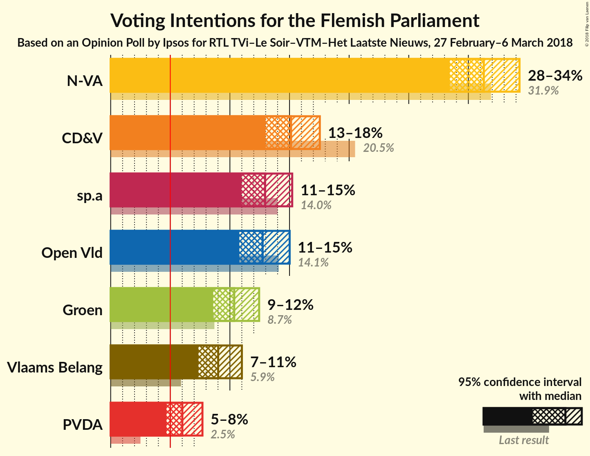
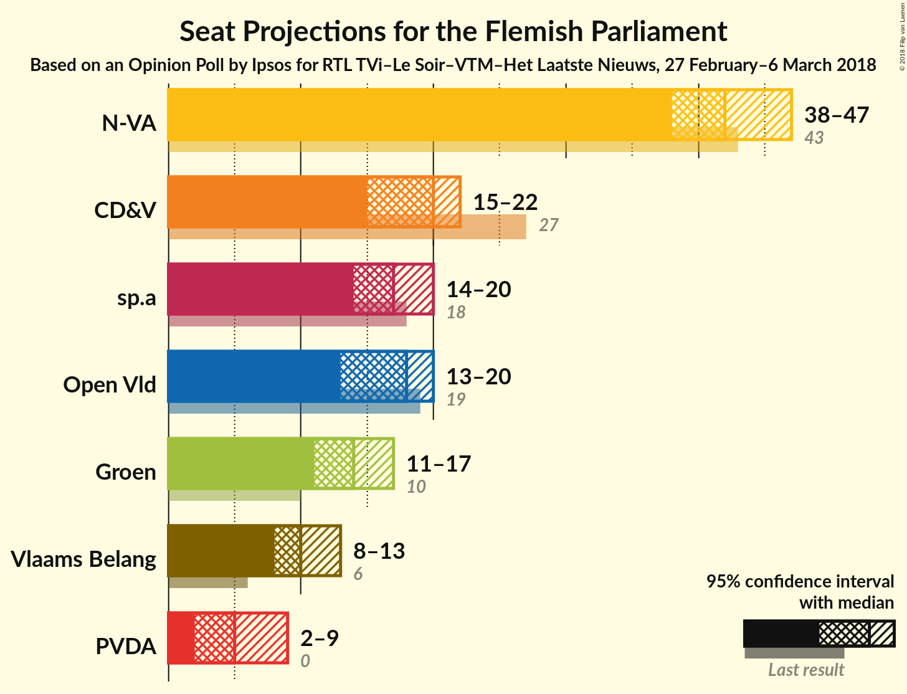
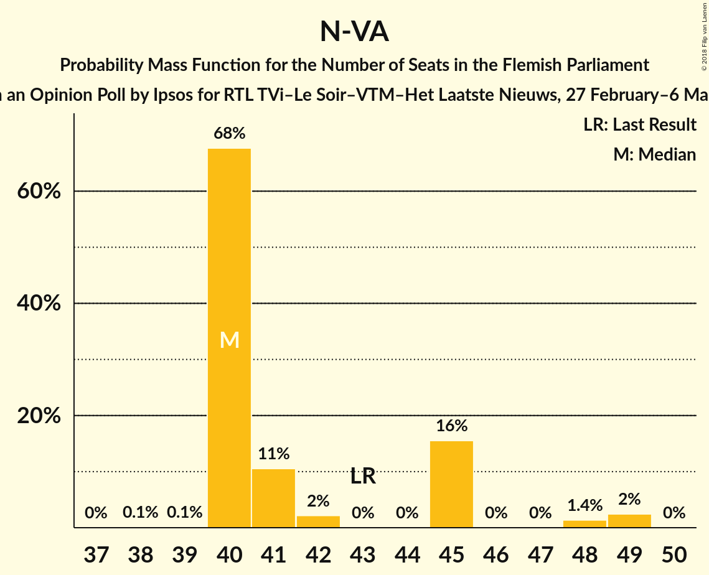
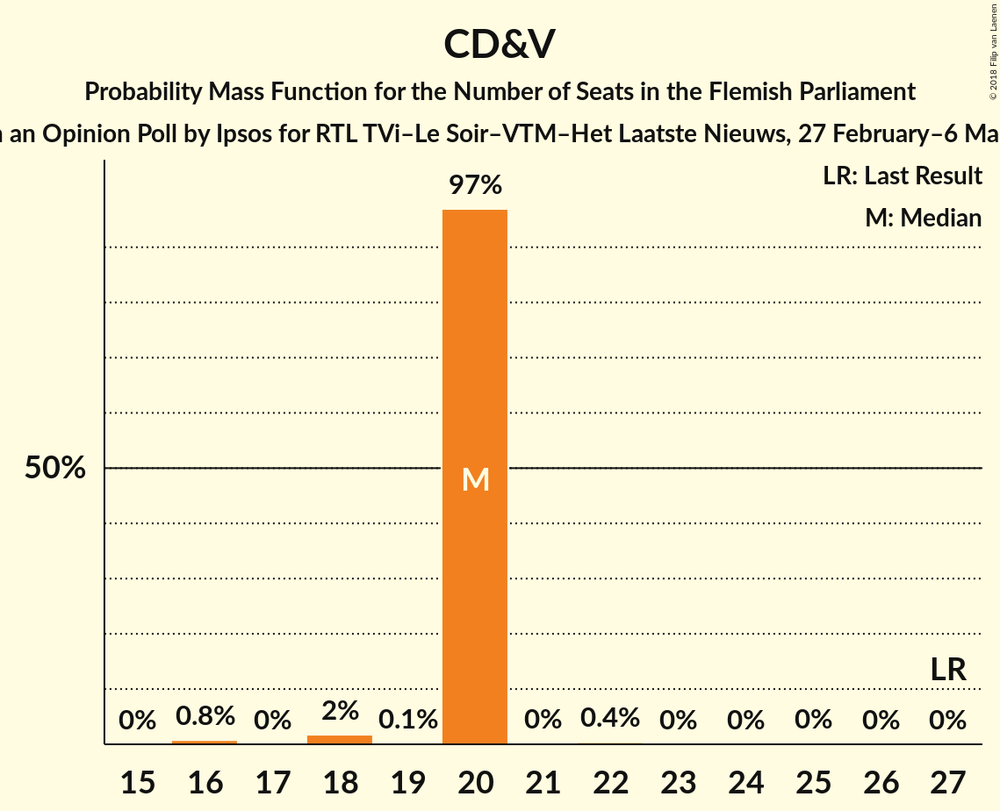
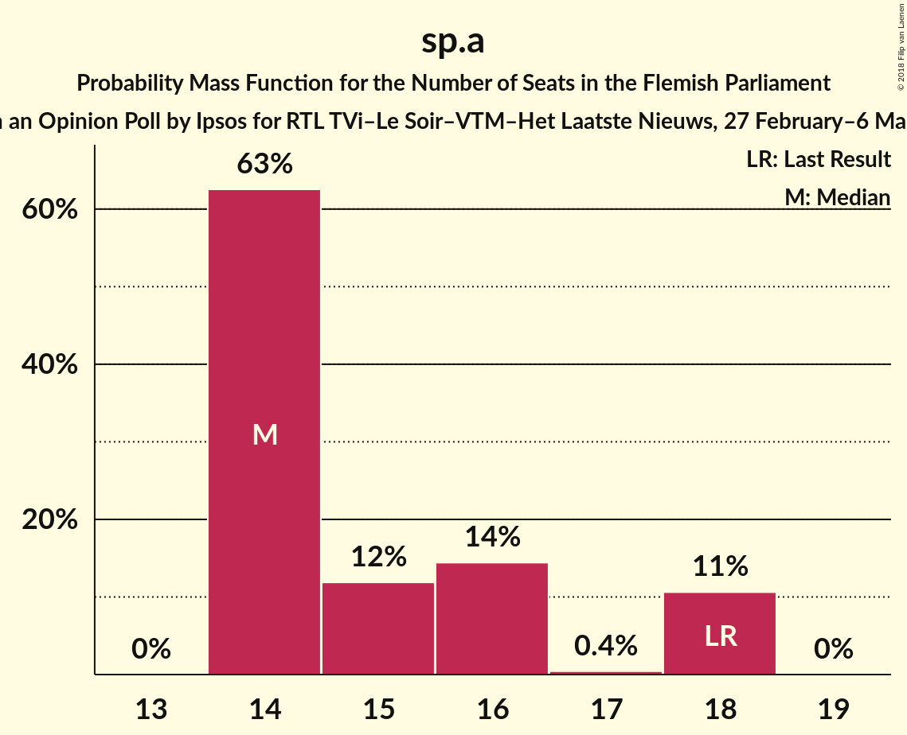
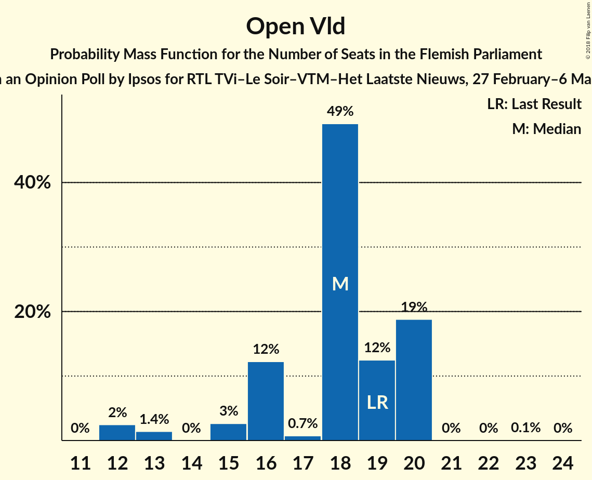
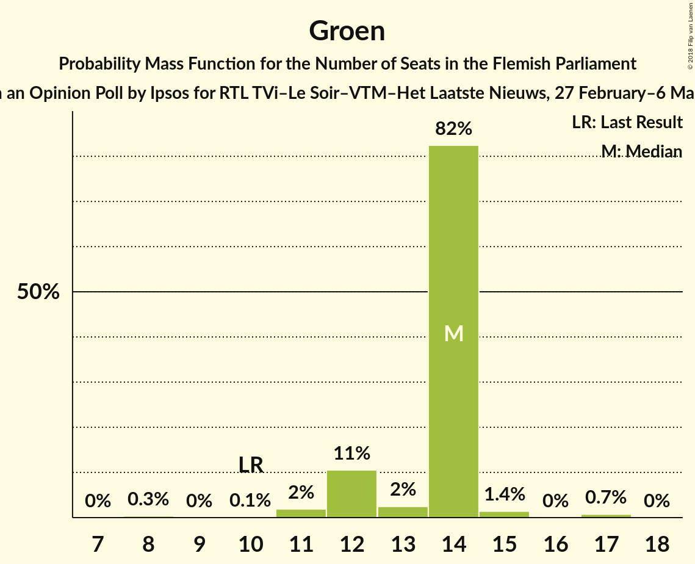
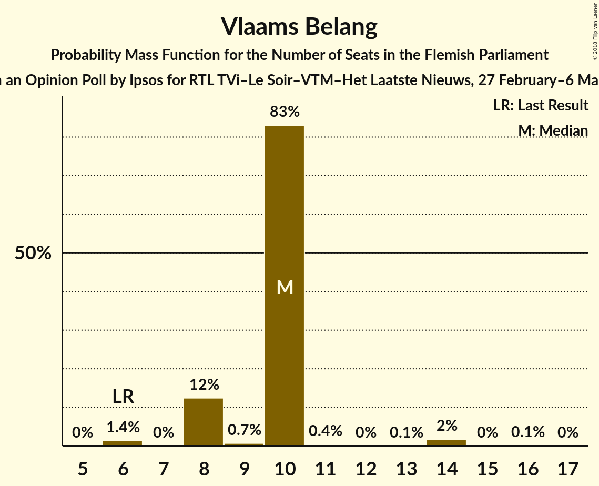
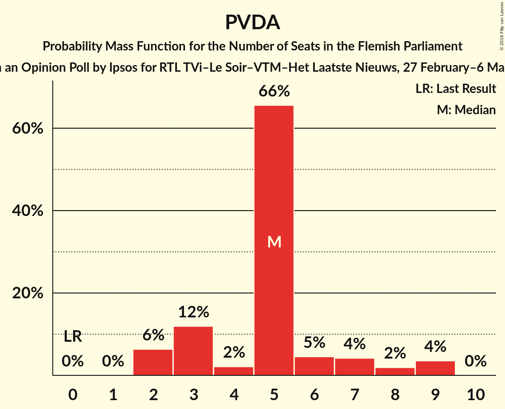
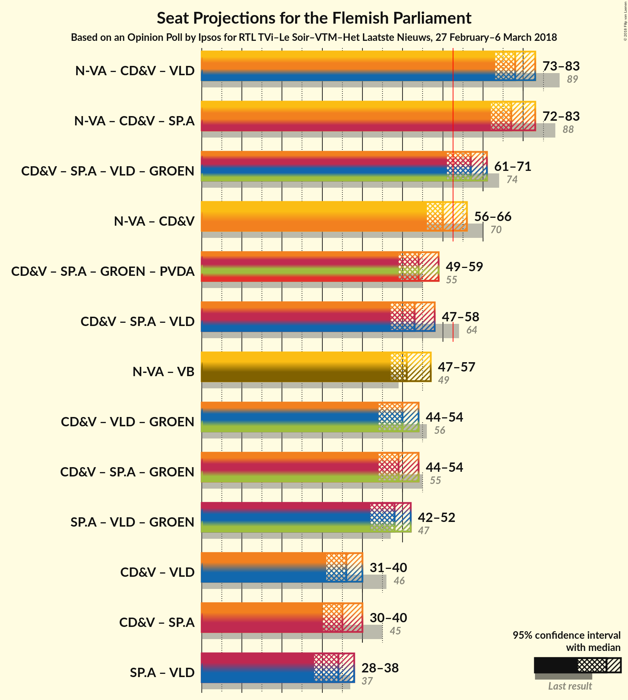

# Opinion Poll by Ipsos for RTL TVi–Le Soir–VTM–Het Laatste Nieuws, 27 February–6 March 2018

<a href="#voting-intentions">Voting Intentions</a> | <a href="#seats">Seats</a> | <a href="#coalitions">Coalitions</a> | <a href="#technical-information">Technical Information</a>

## Voting Intentions

### Confidence Intervals

| Party | Last Result | Poll Result | 80% Confidence Interval | 90% Confidence Interval | 95% Confidence Interval | 99% Confidence Interval |
|:-----:|:-----------:|:-----------:|:-----------------------:|:-----------------------:|:-----------------------:|:-----------------------:|
| N-VA | 31.9% | 31.3% | 29.4–33.3% |28.9–33.8% |28.4–34.3% |27.6–35.3% |
| CD&V | 20.5% | 15.1% | 13.7–16.7% |13.3–17.1% |13.0–17.5% |12.4–18.3% |
| sp.a | 14.0% | 13.0% | 11.7–14.4% |11.3–14.9% |11.0–15.2% |10.4–16.0% |
| Open Vld | 14.1% | 12.7% | 11.5–14.2% |11.1–14.6% |10.8–15.0% |10.2–15.7% |
| Groen | 8.7% | 10.4% | 9.2–11.7% |8.9–12.1% |8.6–12.5% |8.1–13.1% |
| Vlaams Belang | 5.9% | 9.0% | 7.9–10.3% |7.6–10.7% |7.4–11.0% |6.9–11.6% |
| PVDA | 2.5% | 6.0% | 5.1–7.1% |4.9–7.4% |4.7–7.7% |4.3–8.3% |

*Note:* The poll result column reflects the actual value used in the calculations. Published results may vary slightly, and in addition be rounded to fewer digits.

## Seats

### Confidence Intervals

| Party | Last Result | Median | 80% Confidence Interval | 90% Confidence Interval | 95% Confidence Interval | 99% Confidence Interval |
|:-----:|:-----------:|:------:|:-----------------------:|:-----------------------:|:-----------------------:|:-----------------------:|
| <a href="#n-va">N-VA</a> | 43 | 40 | 40–45 |40–45 |40–48 |40–49 |
| <a href="#cd&v">CD&V</a> | 27 | 20 | 20 |20 |18–20 |16–20 |
| <a href="#sp.a">sp.a</a> | 18 | 14 | 14–18 |14–18 |14–18 |14–18 |
| <a href="#open-vld">Open Vld</a> | 19 | 18 | 16–20 |15–20 |13–20 |12–20 |
| <a href="#groen">Groen</a> | 10 | 14 | 12–14 |12–14 |12–14 |11–17 |
| <a href="#vlaams-belang">Vlaams Belang</a> | 6 | 10 | 8–10 |8–10 |8–10 |6–14 |
| <a href="#pvda">PVDA</a> | 0 | 7 | 2–7 |2–7 |2–7 |2–9 |

### N-VA

*For a full overview of the results for this party, see the [N-VA](party-n-va.html) page.*

| Number of Seats | Probability | Accumulated | Special Marks |
|:---------------:|:-----------:|:-----------:|:-------------:|
| 38 | 0.1% | 100% |  |
| 39 | 0.1% | 99.9% |  |
| 40 | 68% | 99.8% | Median |
| 41 | 11% | 32% |  |
| 42 | 2% | 22% |  |
| 43 | 0% | 19% | Last Result |
| 44 | 0% | 19% |  |
| 45 | 16% | 19% |  |
| 46 | 0% | 4% |  |
| 47 | 0% | 4% |  |
| 48 | 1.4% | 4% |  |
| 49 | 2% | 2% |  |
| 50 | 0% | 0% |  |

### CD&V

*For a full overview of the results for this party, see the [CD&V](party-cdv.html) page.*

| Number of Seats | Probability | Accumulated | Special Marks |
|:---------------:|:-----------:|:-----------:|:-------------:|
| 16 | 0.8% | 100% |  |
| 17 | 0% | 99.2% |  |
| 18 | 2% | 99.2% |  |
| 19 | 0.1% | 97% |  |
| 20 | 97% | 97% | Median |
| 21 | 0% | 0.5% |  |
| 22 | 0.4% | 0.4% |  |
| 23 | 0% | 0% |  |
| 24 | 0% | 0% |  |
| 25 | 0% | 0% |  |
| 26 | 0% | 0% |  |
| 27 | 0% | 0% | Last Result |

### sp.a

*For a full overview of the results for this party, see the [sp.a](party-spa.html) page.*

| Number of Seats | Probability | Accumulated | Special Marks |
|:---------------:|:-----------:|:-----------:|:-------------:|
| 13 | 0% | 100% |  |
| 14 | 63% | 99.9% | Median |
| 15 | 12% | 37% |  |
| 16 | 14% | 26% |  |
| 17 | 0.4% | 11% |  |
| 18 | 11% | 11% | Last Result |
| 19 | 0% | 0% |  |

### Open Vld

*For a full overview of the results for this party, see the [Open Vld](party-openvld.html) page.*

| Number of Seats | Probability | Accumulated | Special Marks |
|:---------------:|:-----------:|:-----------:|:-------------:|
| 12 | 2% | 100% |  |
| 13 | 1.4% | 98% |  |
| 14 | 0% | 96% |  |
| 15 | 3% | 96% |  |
| 16 | 12% | 93% |  |
| 17 | 0.7% | 81% |  |
| 18 | 49% | 80% | Median |
| 19 | 12% | 31% | Last Result |
| 20 | 19% | 19% |  |
| 21 | 0% | 0.1% |  |
| 22 | 0% | 0.1% |  |
| 23 | 0.1% | 0.1% |  |
| 24 | 0% | 0% |  |

### Groen

*For a full overview of the results for this party, see the [Groen](party-groen.html) page.*

| Number of Seats | Probability | Accumulated | Special Marks |
|:---------------:|:-----------:|:-----------:|:-------------:|
| 8 | 0.3% | 100% |  |
| 9 | 0% | 99.7% |  |
| 10 | 0.1% | 99.7% | Last Result |
| 11 | 2% | 99.5% |  |
| 12 | 11% | 98% |  |
| 13 | 2% | 87% |  |
| 14 | 82% | 85% | Median |
| 15 | 1.4% | 2% |  |
| 16 | 0% | 0.8% |  |
| 17 | 0.7% | 0.8% |  |
| 18 | 0% | 0% |  |

### Vlaams Belang

*For a full overview of the results for this party, see the [Vlaams Belang](party-vlaamsbelang.html) page.*

| Number of Seats | Probability | Accumulated | Special Marks |
|:---------------:|:-----------:|:-----------:|:-------------:|
| 6 | 1.4% | 100% | Last Result |
| 7 | 0% | 98.6% |  |
| 8 | 12% | 98.6% |  |
| 9 | 0.7% | 86% |  |
| 10 | 83% | 85% | Median |
| 11 | 0.4% | 2% |  |
| 12 | 0% | 2% |  |
| 13 | 0.1% | 2% |  |
| 14 | 2% | 2% |  |
| 15 | 0% | 0.1% |  |
| 16 | 0.1% | 0.1% |  |
| 17 | 0% | 0% |  |

### PVDA

*For a full overview of the results for this party, see the [PVDA](party-pvda.html) page.*

| Number of Seats | Probability | Accumulated | Special Marks |
|:---------------:|:-----------:|:-----------:|:-------------:|
| 0 | 0% | 100% | Last Result |
| 1 | 0% | 100% |  |
| 2 | 12% | 100% |  |
| 3 | 3% | 88% |  |
| 4 | 0% | 85% |  |
| 5 | 34% | 85% |  |
| 6 | 0% | 51% |  |
| 7 | 49% | 51% | Median |
| 8 | 0.1% | 2% |  |
| 9 | 2% | 2% |  |
| 10 | 0% | 0% |  |

## Coalitions

### Confidence Intervals

| Coalition | Last Result | Median | Majority? | 80% Confidence Interval | 90% Confidence Interval | 95% Confidence Interval | 99% Confidence Interval |
|:---------:|:-----------:|:------:|:---------:|:-----------------------:|:-----------------------:|:-----------------------:|:-----------------------:|
| N-VA – CD&V – sp.a | 88 | 74 | 100% | 74–81 | 74–81 | 74–83 | 74–84 |
| N-VA – CD&V – Open Vld | 89 | 79 | 100% | 78–81 | 78–81 | 78–81 | 78–81 |
| CD&V – sp.a – Open Vld – Groen | 74 | 66 | 96% | 65–69 | 64–69 | 60–69 | 59–69 |
| N-VA – CD&V | 70 | 60 | 19% | 60–65 | 60–65 | 60–68 | 60–69 |
| N-VA – Vlaams Belang | 49 | 50 | 0% | 49–55 | 49–55 | 49–59 | 49–59 |
| CD&V – sp.a – Open Vld | 64 | 52 | 0% | 52–57 | 49–57 | 47–57 | 46–57 |
| CD&V – sp.a – Groen – PVDA | 55 | 55 | 0% | 52–55 | 52–55 | 52–55 | 48–56 |
| CD&V – Open Vld – Groen | 56 | 52 | 0% | 50–54 | 48–54 | 45–54 | 45–54 |
| CD&V – sp.a – Groen | 55 | 48 | 0% | 48–50 | 47–50 | 46–50 | 45–51 |
| sp.a – Open Vld – Groen | 47 | 46 | 0% | 45–49 | 44–49 | 41–49 | 39–49 |
| CD&V – Open Vld | 46 | 38 | 0% | 36–40 | 34–40 | 33–40 | 32–40 |
| CD&V – sp.a | 45 | 34 | 0% | 34–38 | 34–38 | 32–38 | 30–38 |
| sp.a – Open Vld | 37 | 32 | 0% | 32–37 | 30–37 | 28–37 | 26–37 |

### N-VA – CD&V – sp.a

| Number of Seats | Probability | Accumulated | Special Marks |
|:---------------:|:-----------:|:-----------:|:-------------:|
| 73 | 0.1% | 100% |  |
| 74 | 56% | 99.8% | Median |
| 75 | 13% | 44% |  |
| 76 | 2% | 32% |  |
| 77 | 2% | 30% |  |
| 78 | 0% | 28% |  |
| 79 | 11% | 28% |  |
| 80 | 0% | 17% |  |
| 81 | 13% | 17% |  |
| 82 | 0% | 4% |  |
| 83 | 2% | 4% |  |
| 84 | 1.3% | 1.4% |  |
| 85 | 0% | 0% |  |
| 86 | 0% | 0% |  |
| 87 | 0% | 0% |  |
| 88 | 0% | 0% | Last Result |

### N-VA – CD&V – Open Vld

| Number of Seats | Probability | Accumulated | Special Marks |
|:---------------:|:-----------:|:-----------:|:-------------:|
| 74 | 0.1% | 100% |  |
| 75 | 0% | 99.9% |  |
| 76 | 0% | 99.9% |  |
| 77 | 0.1% | 99.9% |  |
| 78 | 49% | 99.7% | Median |
| 79 | 2% | 50% |  |
| 80 | 32% | 48% |  |
| 81 | 16% | 17% |  |
| 82 | 0.4% | 0.4% |  |
| 83 | 0% | 0% |  |
| 84 | 0% | 0% |  |
| 85 | 0% | 0% |  |
| 86 | 0% | 0% |  |
| 87 | 0% | 0% |  |
| 88 | 0% | 0% |  |
| 89 | 0% | 0% | Last Result |

### CD&V – sp.a – Open Vld – Groen

| Number of Seats | Probability | Accumulated | Special Marks |
|:---------------:|:-----------:|:-----------:|:-------------:|
| 59 | 2% | 100% |  |
| 60 | 0% | 98% |  |
| 61 | 0% | 97% |  |
| 62 | 2% | 97% |  |
| 63 | 0% | 96% | Majority |
| 64 | 4% | 96% |  |
| 65 | 3% | 92% |  |
| 66 | 59% | 89% | Median |
| 67 | 0% | 30% |  |
| 68 | 7% | 30% |  |
| 69 | 22% | 23% |  |
| 70 | 0% | 0.1% |  |
| 71 | 0% | 0.1% |  |
| 72 | 0% | 0.1% |  |
| 73 | 0% | 0.1% |  |
| 74 | 0% | 0.1% | Last Result |
| 75 | 0.1% | 0.1% |  |
| 76 | 0% | 0% |  |

### N-VA – CD&V

| Number of Seats | Probability | Accumulated | Special Marks |
|:---------------:|:-----------:|:-----------:|:-------------:|
| 58 | 0.1% | 100% |  |
| 59 | 0.2% | 99.9% |  |
| 60 | 68% | 99.7% | Median |
| 61 | 11% | 32% |  |
| 62 | 2% | 21% |  |
| 63 | 2% | 19% | Majority |
| 64 | 0.4% | 17% |  |
| 65 | 13% | 17% |  |
| 66 | 0% | 4% |  |
| 67 | 0% | 4% |  |
| 68 | 1.3% | 4% |  |
| 69 | 2% | 2% |  |
| 70 | 0% | 0% | Last Result |

### N-VA – Vlaams Belang

| Number of Seats | Probability | Accumulated | Special Marks |
|:---------------:|:-----------:|:-----------:|:-------------:|
| 46 | 0.1% | 100% |  |
| 47 | 0% | 99.9% |  |
| 48 | 0% | 99.9% |  |
| 49 | 11% | 99.9% | Last Result |
| 50 | 69% | 89% | Median |
| 51 | 0% | 20% |  |
| 52 | 0.1% | 20% |  |
| 53 | 0.3% | 20% |  |
| 54 | 2% | 19% |  |
| 55 | 13% | 17% |  |
| 56 | 0.1% | 4% |  |
| 57 | 0% | 4% |  |
| 58 | 0% | 4% |  |
| 59 | 4% | 4% |  |
| 60 | 0% | 0% |  |

### CD&V – sp.a – Open Vld

| Number of Seats | Probability | Accumulated | Special Marks |
|:---------------:|:-----------:|:-----------:|:-------------:|
| 46 | 2% | 100% |  |
| 47 | 0.7% | 98% |  |
| 48 | 2% | 97% |  |
| 49 | 1.3% | 95% |  |
| 50 | 0% | 94% |  |
| 51 | 3% | 94% |  |
| 52 | 59% | 91% | Median |
| 53 | 2% | 32% |  |
| 54 | 7% | 30% |  |
| 55 | 12% | 23% |  |
| 56 | 0% | 11% |  |
| 57 | 11% | 11% |  |
| 58 | 0% | 0.1% |  |
| 59 | 0% | 0.1% |  |
| 60 | 0% | 0.1% |  |
| 61 | 0.1% | 0.1% |  |
| 62 | 0% | 0% |  |
| 63 | 0% | 0% | Majority |
| 64 | 0% | 0% | Last Result |

### CD&V – sp.a – Groen – PVDA

| Number of Seats | Probability | Accumulated | Special Marks |
|:---------------:|:-----------:|:-----------:|:-------------:|
| 48 | 2% | 100% |  |
| 49 | 0% | 98% |  |
| 50 | 0% | 98% |  |
| 51 | 0% | 98% |  |
| 52 | 14% | 98% |  |
| 53 | 10% | 84% |  |
| 54 | 14% | 75% |  |
| 55 | 59% | 61% | Last Result, Median |
| 56 | 1.4% | 2% |  |
| 57 | 0% | 0.1% |  |
| 58 | 0% | 0.1% |  |
| 59 | 0% | 0.1% |  |
| 60 | 0% | 0% |  |

### CD&V – Open Vld – Groen

| Number of Seats | Probability | Accumulated | Special Marks |
|:---------------:|:-----------:|:-----------:|:-------------:|
| 45 | 3% | 100% |  |
| 46 | 0% | 97% |  |
| 47 | 0% | 97% |  |
| 48 | 3% | 97% |  |
| 49 | 3% | 94% |  |
| 50 | 13% | 91% |  |
| 51 | 11% | 78% |  |
| 52 | 49% | 68% | Median |
| 53 | 0% | 19% |  |
| 54 | 19% | 19% |  |
| 55 | 0.1% | 0.1% |  |
| 56 | 0% | 0.1% | Last Result |
| 57 | 0.1% | 0.1% |  |
| 58 | 0% | 0% |  |

### CD&V – sp.a – Groen

| Number of Seats | Probability | Accumulated | Special Marks |
|:---------------:|:-----------:|:-----------:|:-------------:|
| 44 | 0% | 100% |  |
| 45 | 2% | 99.9% |  |
| 46 | 2% | 98% |  |
| 47 | 4% | 96% |  |
| 48 | 56% | 93% | Median |
| 49 | 12% | 37% |  |
| 50 | 24% | 25% |  |
| 51 | 1.3% | 2% |  |
| 52 | 0.1% | 0.2% |  |
| 53 | 0% | 0.1% |  |
| 54 | 0% | 0.1% |  |
| 55 | 0% | 0.1% | Last Result |
| 56 | 0% | 0.1% |  |
| 57 | 0% | 0% |  |

### sp.a – Open Vld – Groen

| Number of Seats | Probability | Accumulated | Special Marks |
|:---------------:|:-----------:|:-----------:|:-------------:|
| 39 | 2% | 100% |  |
| 40 | 0% | 98% |  |
| 41 | 0% | 98% |  |
| 42 | 0.1% | 97% |  |
| 43 | 0.3% | 97% |  |
| 44 | 5% | 97% |  |
| 45 | 3% | 92% |  |
| 46 | 59% | 90% | Median |
| 47 | 0% | 30% | Last Result |
| 48 | 8% | 30% |  |
| 49 | 22% | 23% |  |
| 50 | 0% | 0.1% |  |
| 51 | 0% | 0.1% |  |
| 52 | 0% | 0.1% |  |
| 53 | 0% | 0.1% |  |
| 54 | 0% | 0.1% |  |
| 55 | 0.1% | 0.1% |  |
| 56 | 0% | 0% |  |

### CD&V – Open Vld

| Number of Seats | Probability | Accumulated | Special Marks |
|:---------------:|:-----------:|:-----------:|:-------------:|
| 32 | 2% | 100% |  |
| 33 | 2% | 98% |  |
| 34 | 2% | 95% |  |
| 35 | 3% | 94% |  |
| 36 | 11% | 91% |  |
| 37 | 0.1% | 81% |  |
| 38 | 49% | 80% | Median |
| 39 | 12% | 32% |  |
| 40 | 19% | 19% |  |
| 41 | 0% | 0.1% |  |
| 42 | 0% | 0.1% |  |
| 43 | 0.1% | 0.1% |  |
| 44 | 0% | 0% |  |
| 45 | 0% | 0% |  |
| 46 | 0% | 0% | Last Result |

### CD&V – sp.a

| Number of Seats | Probability | Accumulated | Special Marks |
|:---------------:|:-----------:|:-----------:|:-------------:|
| 30 | 0.7% | 100% |  |
| 31 | 0% | 99.2% |  |
| 32 | 2% | 99.2% |  |
| 33 | 0.1% | 97% |  |
| 34 | 60% | 97% | Median |
| 35 | 12% | 37% |  |
| 36 | 14% | 26% |  |
| 37 | 0.1% | 11% |  |
| 38 | 11% | 11% |  |
| 39 | 0.4% | 0.4% |  |
| 40 | 0% | 0% |  |
| 41 | 0% | 0% |  |
| 42 | 0% | 0% |  |
| 43 | 0% | 0% |  |
| 44 | 0% | 0% |  |
| 45 | 0% | 0% | Last Result |

### sp.a – Open Vld

| Number of Seats | Probability | Accumulated | Special Marks |
|:---------------:|:-----------:|:-----------:|:-------------:|
| 26 | 2% | 100% |  |
| 27 | 0% | 98% |  |
| 28 | 0% | 98% |  |
| 29 | 1.3% | 97% |  |
| 30 | 2% | 96% |  |
| 31 | 3% | 94% |  |
| 32 | 59% | 91% | Median |
| 33 | 2% | 32% |  |
| 34 | 7% | 30% |  |
| 35 | 12% | 23% |  |
| 36 | 0% | 11% |  |
| 37 | 11% | 11% | Last Result |
| 38 | 0% | 0.1% |  |
| 39 | 0% | 0.1% |  |
| 40 | 0% | 0.1% |  |
| 41 | 0.1% | 0.1% |  |
| 42 | 0% | 0% |  |

## Technical Information

### Opinion Poll

+ **Polling firm:** Ipsos
+ **Commissioner(s):** RTL TVi–Le Soir–VTM–Het Laatste Nieuws
+ **Fieldwork period:** 27 February–6 March 2018

### Calculations

+ **Sample size:** 965
+ **Simulations done:** 1,024
+ **Error estimate:** 1.52%

