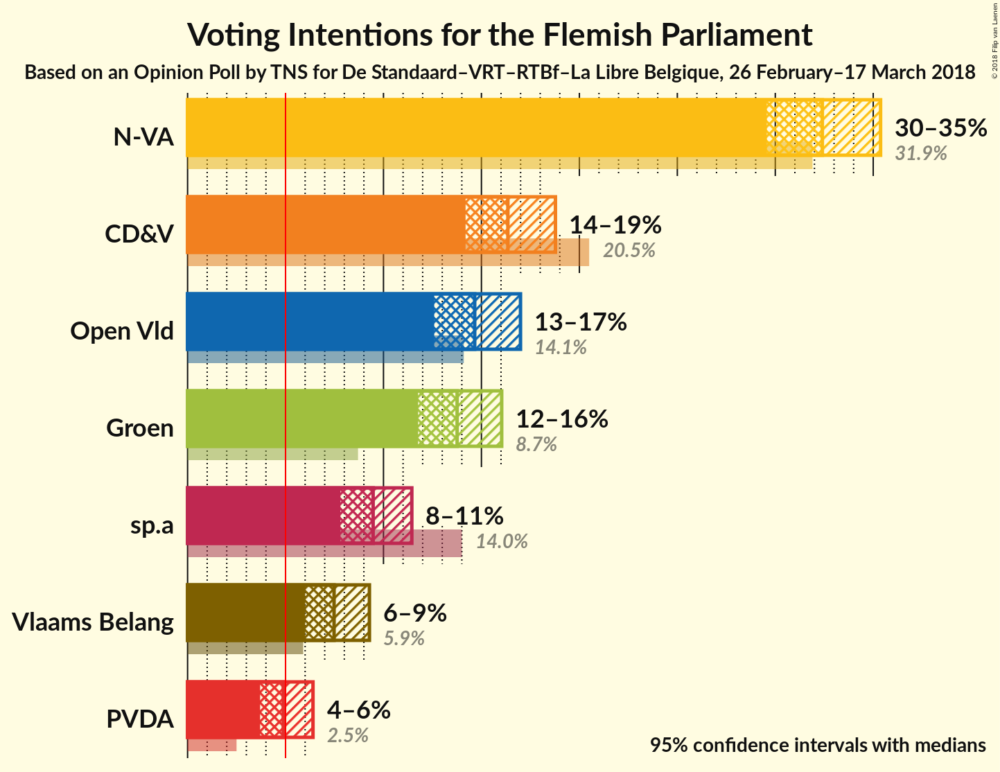
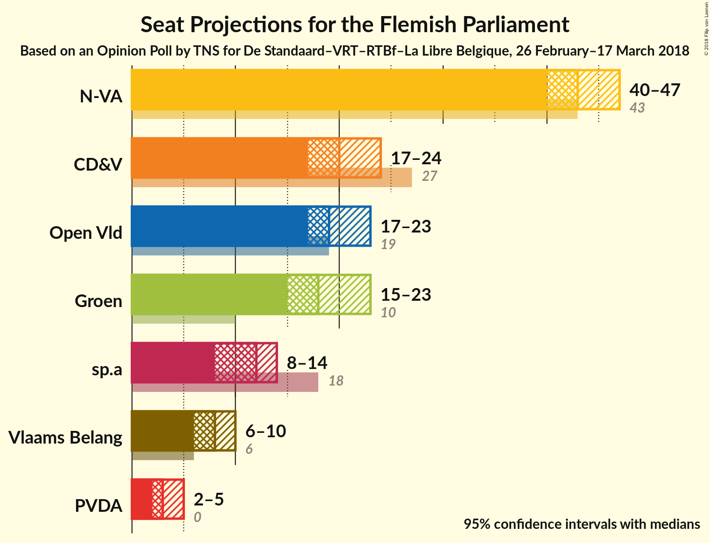
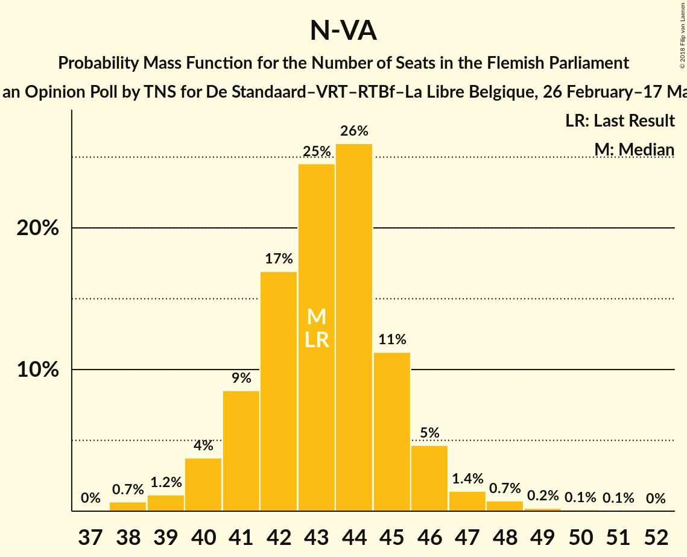
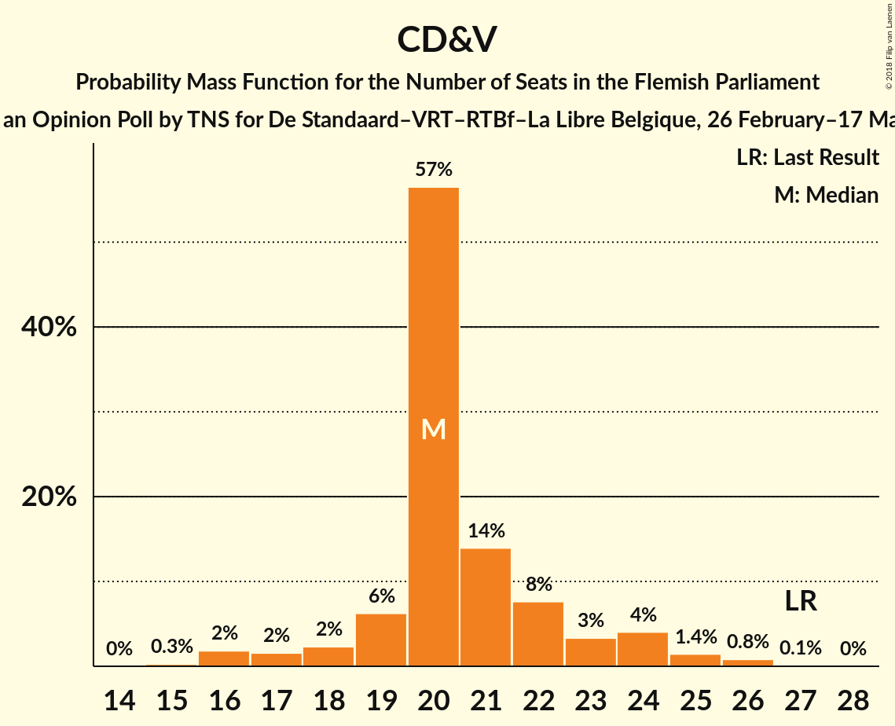
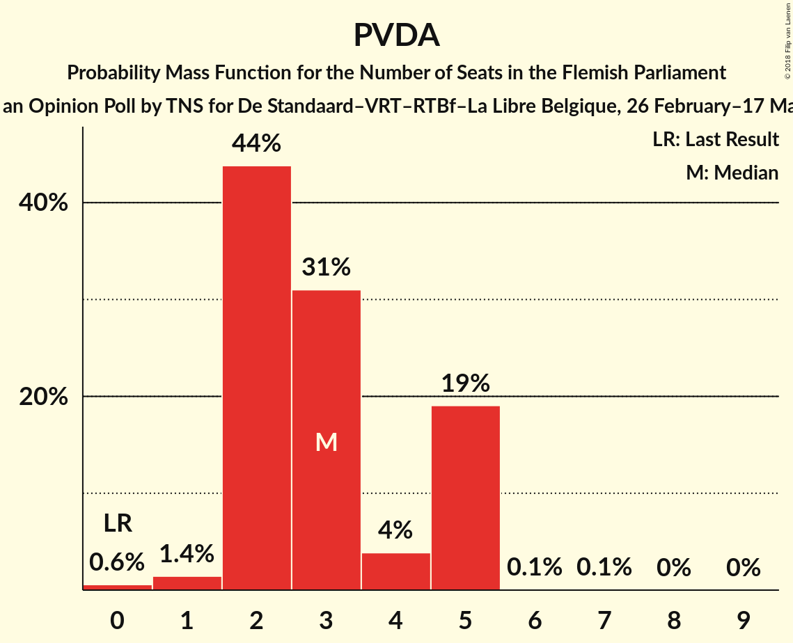
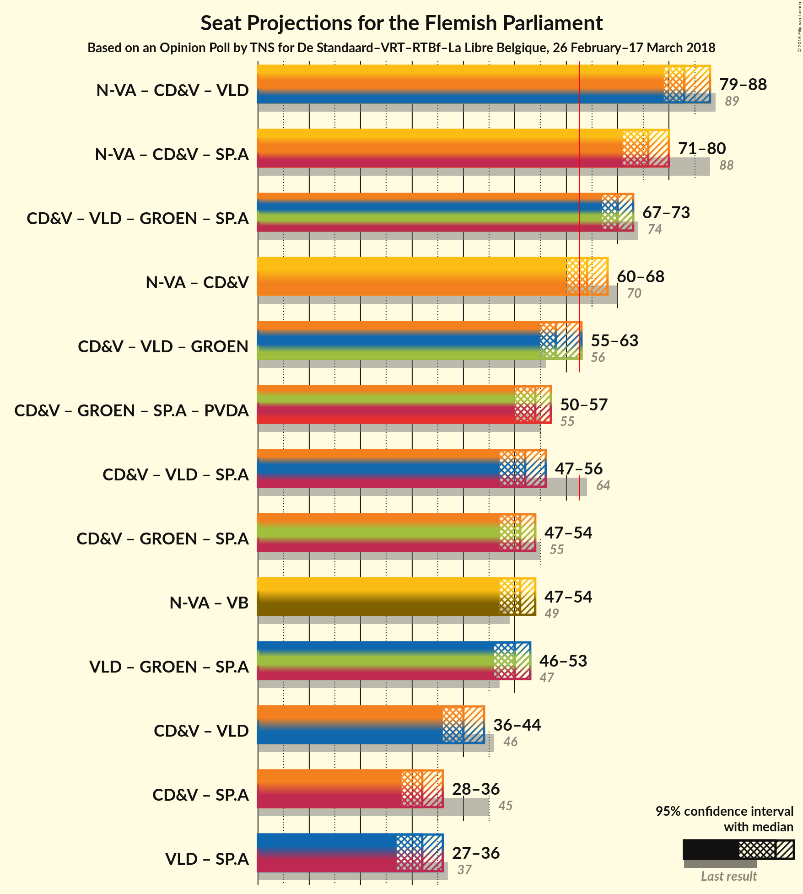

# Opinion Poll by TNS for De Standaard–VRT–RTBf–La Libre Belgique, 26 February–17 March 2018

<a href="#voting-intentions">Voting Intentions</a> | <a href="#seats">Seats</a> | <a href="#coalitions">Coalitions</a> | <a href="#technical-information">Technical Information</a>

## Voting Intentions

### Confidence Intervals

| Party | Last Result | Poll Result | 80% Confidence Interval | 90% Confidence Interval | 95% Confidence Interval | 99% Confidence Interval |
|:-----:|:-----------:|:-----------:|:-----------------------:|:-----------------------:|:-----------------------:|:-----------------------:|
| N-VA | 31.9% | 32.4% | 30.5–34.3% |30.0–34.9% |29.6–35.4% |28.7–36.3% |
| CD&V | 20.5% | 16.4% | 14.9–17.9% |14.5–18.4% |14.2–18.8% |13.5–19.6% |
| Open Vld | 14.1% | 14.7% | 13.3–16.2% |12.9–16.6% |12.6–17.0% |12.0–17.7% |
| Groen | 8.7% | 13.8% | 12.4–15.2% |12.1–15.7% |11.8–16.0% |11.2–16.8% |
| sp.a | 14.0% | 9.5% | 8.4–10.8% |8.1–11.1% |7.8–11.4% |7.3–12.1% |
| Vlaams Belang | 5.9% | 7.5% | 6.5–8.7% |6.2–9.0% |6.0–9.3% |5.6–9.9% |
| PVDA | 2.5% | 4.9% | 4.1–5.9% |3.9–6.2% |3.7–6.4% |3.4–6.9% |

*Note:* The poll result column reflects the actual value used in the calculations. Published results may vary slightly, and in addition be rounded to fewer digits.

## Seats

### Confidence Intervals

| Party | Last Result | Median | 80% Confidence Interval | 90% Confidence Interval | 95% Confidence Interval | 99% Confidence Interval |
|:-----:|:-----------:|:------:|:-----------------------:|:-----------------------:|:-----------------------:|:-----------------------:|
| <a href="#n-va">N-VA</a> | 43 | 43 | 41–45 |40–46 |40–47 |38–48 |
| <a href="#cd&v">CD&V</a> | 27 | 20 | 19–22 |18–24 |17–24 |16–26 |
| <a href="#open-vld">Open Vld</a> | 19 | 19 | 18–22 |18–23 |17–23 |15–24 |
| <a href="#groen">Groen</a> | 10 | 18 | 17–21 |16–23 |15–23 |15–23 |
| <a href="#sp.a">sp.a</a> | 18 | 12 | 9–14 |9–14 |8–14 |8–15 |
| <a href="#vlaams-belang">Vlaams Belang</a> | 6 | 8 | 6–8 |6–9 |6–10 |4–11 |
| <a href="#pvda">PVDA</a> | 0 | 3 | 2–5 |2–5 |2–5 |0–5 |

### N-VA

*For a full overview of the results for this party, see the [N-VA](party-n-va.html) page.*

| Number of Seats | Probability | Accumulated | Special Marks |
|:---------------:|:-----------:|:-----------:|:-------------:|
| 37 | 0% | 100% |  |
| 38 | 0.7% | 99.9% |  |
| 39 | 1.2% | 99.3% |  |
| 40 | 4% | 98% |  |
| 41 | 9% | 94% |  |
| 42 | 17% | 86% |  |
| 43 | 25% | 69% | Last Result, Median |
| 44 | 26% | 44% |  |
| 45 | 11% | 18% |  |
| 46 | 5% | 7% |  |
| 47 | 1.4% | 3% |  |
| 48 | 0.7% | 1.1% |  |
| 49 | 0.2% | 0.4% |  |
| 50 | 0.1% | 0.2% |  |
| 51 | 0.1% | 0.1% |  |
| 52 | 0% | 0% |  |

### CD&V

*For a full overview of the results for this party, see the [CD&V](party-cdv.html) page.*

| Number of Seats | Probability | Accumulated | Special Marks |
|:---------------:|:-----------:|:-----------:|:-------------:|
| 15 | 0.3% | 100% |  |
| 16 | 2% | 99.7% |  |
| 17 | 2% | 98% |  |
| 18 | 2% | 96% |  |
| 19 | 6% | 94% |  |
| 20 | 57% | 88% | Median |
| 21 | 14% | 31% |  |
| 22 | 8% | 17% |  |
| 23 | 3% | 10% |  |
| 24 | 4% | 6% |  |
| 25 | 1.4% | 2% |  |
| 26 | 0.8% | 0.9% |  |
| 27 | 0.1% | 0.1% | Last Result |
| 28 | 0% | 0% |  |

### Open Vld

*For a full overview of the results for this party, see the [Open Vld](party-openvld.html) page.*

| Number of Seats | Probability | Accumulated | Special Marks |
|:---------------:|:-----------:|:-----------:|:-------------:|
| 13 | 0.1% | 100% |  |
| 14 | 0.2% | 99.9% |  |
| 15 | 0.7% | 99.6% |  |
| 16 | 1.0% | 99.0% |  |
| 17 | 3% | 98% |  |
| 18 | 8% | 95% |  |
| 19 | 38% | 87% | Last Result, Median |
| 20 | 29% | 49% |  |
| 21 | 7% | 20% |  |
| 22 | 6% | 13% |  |
| 23 | 4% | 6% |  |
| 24 | 2% | 2% |  |
| 25 | 0.4% | 0.5% |  |
| 26 | 0.1% | 0.1% |  |
| 27 | 0% | 0% |  |

### Groen

*For a full overview of the results for this party, see the [Groen](party-groen.html) page.*

| Number of Seats | Probability | Accumulated | Special Marks |
|:---------------:|:-----------:|:-----------:|:-------------:|
| 10 | 0% | 100% | Last Result |
| 11 | 0% | 100% |  |
| 12 | 0% | 100% |  |
| 13 | 0% | 100% |  |
| 14 | 0.4% | 100% |  |
| 15 | 3% | 99.6% |  |
| 16 | 4% | 96% |  |
| 17 | 23% | 93% |  |
| 18 | 34% | 69% | Median |
| 19 | 14% | 35% |  |
| 20 | 10% | 21% |  |
| 21 | 4% | 12% |  |
| 22 | 3% | 8% |  |
| 23 | 5% | 5% |  |
| 24 | 0% | 0% |  |

### sp.a

*For a full overview of the results for this party, see the [sp.a](party-spa.html) page.*

| Number of Seats | Probability | Accumulated | Special Marks |
|:---------------:|:-----------:|:-----------:|:-------------:|
| 7 | 0.1% | 100% |  |
| 8 | 4% | 99.9% |  |
| 9 | 9% | 96% |  |
| 10 | 17% | 87% |  |
| 11 | 13% | 70% |  |
| 12 | 11% | 57% | Median |
| 13 | 26% | 46% |  |
| 14 | 19% | 20% |  |
| 15 | 0.8% | 0.9% |  |
| 16 | 0.1% | 0.1% |  |
| 17 | 0% | 0% |  |
| 18 | 0% | 0% | Last Result |

### Vlaams Belang

*For a full overview of the results for this party, see the [Vlaams Belang](party-vlaamsbelang.html) page.*

| Number of Seats | Probability | Accumulated | Special Marks |
|:---------------:|:-----------:|:-----------:|:-------------:|
| 4 | 0.9% | 100% |  |
| 5 | 1.4% | 99.1% |  |
| 6 | 20% | 98% | Last Result |
| 7 | 9% | 77% |  |
| 8 | 61% | 68% | Median |
| 9 | 4% | 8% |  |
| 10 | 3% | 4% |  |
| 11 | 1.0% | 1.2% |  |
| 12 | 0.2% | 0.3% |  |
| 13 | 0% | 0% |  |

### PVDA

*For a full overview of the results for this party, see the [PVDA](party-pvda.html) page.*

| Number of Seats | Probability | Accumulated | Special Marks |
|:---------------:|:-----------:|:-----------:|:-------------:|
| 0 | 0.6% | 100% | Last Result |
| 1 | 1.4% | 99.4% |  |
| 2 | 44% | 98% |  |
| 3 | 31% | 54% | Median |
| 4 | 4% | 23% |  |
| 5 | 19% | 19% |  |
| 6 | 0.1% | 0.2% |  |
| 7 | 0.1% | 0.1% |  |
| 8 | 0% | 0.1% |  |
| 9 | 0% | 0% |  |

## Coalitions

### Confidence Intervals

| Coalition | Last Result | Median | Majority? | 80% Confidence Interval | 90% Confidence Interval | 95% Confidence Interval | 99% Confidence Interval |
|:---------:|:-----------:|:------:|:---------:|:-----------------------:|:-----------------------:|:-----------------------:|:-----------------------:|
| N-VA – CD&V – Open Vld | 89 | 83 | 100% | 81–86 | 80–87 | 79–88 | 77–89 |
| N-VA – CD&V – sp.a | 88 | 76 | 100% | 72–78 | 72–79 | 71–80 | 69–81 |
| CD&V – Open Vld – Groen – sp.a | 74 | 70 | 99.9% | 68–72 | 68–73 | 67–73 | 65–74 |
| N-VA – CD&V | 70 | 64 | 74% | 61–66 | 60–67 | 60–68 | 58–70 |
| CD&V – Open Vld – Groen | 56 | 58 | 4% | 56–62 | 55–62 | 55–63 | 54–64 |
| CD&V – Groen – sp.a – PVDA | 55 | 54 | 0% | 51–56 | 50–57 | 50–57 | 48–59 |
| CD&V – Open Vld – sp.a | 64 | 52 | 0% | 49–55 | 48–56 | 47–56 | 46–58 |
| CD&V – Groen – sp.a | 55 | 51 | 0% | 48–53 | 48–54 | 47–54 | 45–56 |
| N-VA – Vlaams Belang | 49 | 51 | 0% | 49–53 | 48–53 | 47–54 | 46–56 |
| Open Vld – Groen – sp.a | 47 | 50 | 0% | 48–52 | 47–53 | 46–53 | 44–55 |
| CD&V – Open Vld | 46 | 40 | 0% | 38–43 | 37–44 | 36–44 | 34–46 |
| CD&V – sp.a | 45 | 32 | 0% | 29–35 | 29–35 | 28–36 | 27–38 |
| Open Vld – sp.a | 37 | 32 | 0% | 29–34 | 28–35 | 27–36 | 26–37 |

### N-VA – CD&V – Open Vld

| Number of Seats | Probability | Accumulated | Special Marks |
|:---------------:|:-----------:|:-----------:|:-------------:|
| 75 | 0.1% | 100% |  |
| 76 | 0.2% | 99.9% |  |
| 77 | 0.5% | 99.7% |  |
| 78 | 0.9% | 99.2% |  |
| 79 | 2% | 98% |  |
| 80 | 4% | 96% |  |
| 81 | 12% | 92% |  |
| 82 | 18% | 80% | Median |
| 83 | 17% | 62% |  |
| 84 | 14% | 45% |  |
| 85 | 15% | 31% |  |
| 86 | 8% | 16% |  |
| 87 | 4% | 8% |  |
| 88 | 2% | 4% |  |
| 89 | 1.0% | 1.5% | Last Result |
| 90 | 0.4% | 0.5% |  |
| 91 | 0.1% | 0.1% |  |
| 92 | 0% | 0% |  |

### N-VA – CD&V – sp.a

| Number of Seats | Probability | Accumulated | Special Marks |
|:---------------:|:-----------:|:-----------:|:-------------:|
| 67 | 0.1% | 100% |  |
| 68 | 0.2% | 99.9% |  |
| 69 | 0.6% | 99.7% |  |
| 70 | 1.3% | 99.0% |  |
| 71 | 2% | 98% |  |
| 72 | 7% | 96% |  |
| 73 | 9% | 88% |  |
| 74 | 11% | 79% |  |
| 75 | 17% | 69% | Median |
| 76 | 19% | 52% |  |
| 77 | 15% | 33% |  |
| 78 | 10% | 18% |  |
| 79 | 5% | 8% |  |
| 80 | 2% | 3% |  |
| 81 | 0.8% | 1.1% |  |
| 82 | 0.2% | 0.3% |  |
| 83 | 0% | 0.1% |  |
| 84 | 0% | 0% |  |
| 85 | 0% | 0% |  |
| 86 | 0% | 0% |  |
| 87 | 0% | 0% |  |
| 88 | 0% | 0% | Last Result |

### CD&V – Open Vld – Groen – sp.a

| Number of Seats | Probability | Accumulated | Special Marks |
|:---------------:|:-----------:|:-----------:|:-------------:|
| 62 | 0.1% | 100% |  |
| 63 | 0.1% | 99.9% | Majority |
| 64 | 0.3% | 99.8% |  |
| 65 | 0.3% | 99.5% |  |
| 66 | 0.4% | 99.2% |  |
| 67 | 2% | 98.8% |  |
| 68 | 13% | 97% |  |
| 69 | 19% | 85% | Median |
| 70 | 19% | 65% |  |
| 71 | 22% | 47% |  |
| 72 | 15% | 25% |  |
| 73 | 8% | 10% |  |
| 74 | 2% | 2% | Last Result |
| 75 | 0.3% | 0.4% |  |
| 76 | 0.1% | 0.1% |  |
| 77 | 0% | 0% |  |

### N-VA – CD&V

| Number of Seats | Probability | Accumulated | Special Marks |
|:---------------:|:-----------:|:-----------:|:-------------:|
| 56 | 0.1% | 100% |  |
| 57 | 0.1% | 99.9% |  |
| 58 | 0.5% | 99.8% |  |
| 59 | 1.3% | 99.3% |  |
| 60 | 4% | 98% |  |
| 61 | 8% | 94% |  |
| 62 | 13% | 86% |  |
| 63 | 22% | 74% | Median, Majority |
| 64 | 20% | 52% |  |
| 65 | 16% | 32% |  |
| 66 | 7% | 15% |  |
| 67 | 4% | 8% |  |
| 68 | 2% | 4% |  |
| 69 | 0.9% | 2% |  |
| 70 | 0.4% | 0.6% | Last Result |
| 71 | 0.1% | 0.2% |  |
| 72 | 0% | 0% |  |

### CD&V – Open Vld – Groen

| Number of Seats | Probability | Accumulated | Special Marks |
|:---------------:|:-----------:|:-----------:|:-------------:|
| 51 | 0% | 100% |  |
| 52 | 0.1% | 99.9% |  |
| 53 | 0.3% | 99.8% |  |
| 54 | 2% | 99.5% |  |
| 55 | 3% | 98% |  |
| 56 | 12% | 95% | Last Result |
| 57 | 15% | 83% | Median |
| 58 | 23% | 68% |  |
| 59 | 15% | 44% |  |
| 60 | 10% | 29% |  |
| 61 | 7% | 19% |  |
| 62 | 7% | 11% |  |
| 63 | 3% | 4% | Majority |
| 64 | 0.9% | 1.1% |  |
| 65 | 0.2% | 0.3% |  |
| 66 | 0.1% | 0.1% |  |
| 67 | 0% | 0% |  |

### CD&V – Groen – sp.a – PVDA

| Number of Seats | Probability | Accumulated | Special Marks |
|:---------------:|:-----------:|:-----------:|:-------------:|
| 46 | 0.1% | 100% |  |
| 47 | 0.2% | 99.9% |  |
| 48 | 0.4% | 99.7% |  |
| 49 | 1.2% | 99.3% |  |
| 50 | 5% | 98% |  |
| 51 | 9% | 94% |  |
| 52 | 12% | 84% |  |
| 53 | 19% | 73% | Median |
| 54 | 24% | 54% |  |
| 55 | 17% | 30% | Last Result |
| 56 | 7% | 13% |  |
| 57 | 4% | 6% |  |
| 58 | 1.3% | 2% |  |
| 59 | 0.4% | 0.8% |  |
| 60 | 0.2% | 0.4% |  |
| 61 | 0.1% | 0.1% |  |
| 62 | 0% | 0% |  |

### CD&V – Open Vld – sp.a

| Number of Seats | Probability | Accumulated | Special Marks |
|:---------------:|:-----------:|:-----------:|:-------------:|
| 44 | 0.1% | 100% |  |
| 45 | 0.3% | 99.9% |  |
| 46 | 0.8% | 99.6% |  |
| 47 | 2% | 98.8% |  |
| 48 | 5% | 97% |  |
| 49 | 5% | 92% |  |
| 50 | 18% | 87% |  |
| 51 | 13% | 70% | Median |
| 52 | 14% | 57% |  |
| 53 | 16% | 42% |  |
| 54 | 16% | 27% |  |
| 55 | 6% | 11% |  |
| 56 | 3% | 5% |  |
| 57 | 2% | 2% |  |
| 58 | 0.7% | 0.8% |  |
| 59 | 0.1% | 0.1% |  |
| 60 | 0% | 0% |  |
| 61 | 0% | 0% |  |
| 62 | 0% | 0% |  |
| 63 | 0% | 0% | Majority |
| 64 | 0% | 0% | Last Result |

### CD&V – Groen – sp.a

| Number of Seats | Probability | Accumulated | Special Marks |
|:---------------:|:-----------:|:-----------:|:-------------:|
| 43 | 0.1% | 100% |  |
| 44 | 0.2% | 99.9% |  |
| 45 | 0.5% | 99.7% |  |
| 46 | 0.6% | 99.3% |  |
| 47 | 3% | 98.7% |  |
| 48 | 10% | 96% |  |
| 49 | 15% | 86% |  |
| 50 | 19% | 71% | Median |
| 51 | 18% | 52% |  |
| 52 | 18% | 34% |  |
| 53 | 10% | 16% |  |
| 54 | 4% | 6% |  |
| 55 | 1.4% | 2% | Last Result |
| 56 | 0.5% | 0.7% |  |
| 57 | 0.2% | 0.2% |  |
| 58 | 0% | 0% |  |

### N-VA – Vlaams Belang

| Number of Seats | Probability | Accumulated | Special Marks |
|:---------------:|:-----------:|:-----------:|:-------------:|
| 45 | 0.1% | 100% |  |
| 46 | 0.6% | 99.9% |  |
| 47 | 2% | 99.3% |  |
| 48 | 6% | 97% |  |
| 49 | 12% | 92% | Last Result |
| 50 | 23% | 80% |  |
| 51 | 25% | 57% | Median |
| 52 | 18% | 31% |  |
| 53 | 10% | 13% |  |
| 54 | 3% | 4% |  |
| 55 | 0.6% | 1.2% |  |
| 56 | 0.2% | 0.7% |  |
| 57 | 0.3% | 0.5% |  |
| 58 | 0.1% | 0.2% |  |
| 59 | 0.1% | 0.1% |  |
| 60 | 0% | 0% |  |

### Open Vld – Groen – sp.a

| Number of Seats | Probability | Accumulated | Special Marks |
|:---------------:|:-----------:|:-----------:|:-------------:|
| 42 | 0.1% | 100% |  |
| 43 | 0.1% | 99.9% |  |
| 44 | 0.4% | 99.8% |  |
| 45 | 0.9% | 99.4% |  |
| 46 | 1.3% | 98% |  |
| 47 | 5% | 97% | Last Result |
| 48 | 17% | 92% |  |
| 49 | 19% | 76% | Median |
| 50 | 21% | 56% |  |
| 51 | 15% | 35% |  |
| 52 | 11% | 20% |  |
| 53 | 6% | 8% |  |
| 54 | 1.4% | 2% |  |
| 55 | 0.5% | 0.7% |  |
| 56 | 0.2% | 0.2% |  |
| 57 | 0% | 0% |  |

### CD&V – Open Vld

| Number of Seats | Probability | Accumulated | Special Marks |
|:---------------:|:-----------:|:-----------:|:-------------:|
| 33 | 0.2% | 100% |  |
| 34 | 0.5% | 99.8% |  |
| 35 | 1.0% | 99.3% |  |
| 36 | 2% | 98% |  |
| 37 | 4% | 96% |  |
| 38 | 10% | 93% |  |
| 39 | 23% | 82% | Median |
| 40 | 25% | 59% |  |
| 41 | 11% | 35% |  |
| 42 | 9% | 23% |  |
| 43 | 7% | 15% |  |
| 44 | 5% | 8% |  |
| 45 | 1.5% | 2% |  |
| 46 | 0.7% | 1.0% | Last Result |
| 47 | 0.2% | 0.3% |  |
| 48 | 0.1% | 0.1% |  |
| 49 | 0% | 0% |  |

### CD&V – sp.a

| Number of Seats | Probability | Accumulated | Special Marks |
|:---------------:|:-----------:|:-----------:|:-------------:|
| 24 | 0.1% | 100% |  |
| 25 | 0.1% | 99.9% |  |
| 26 | 0.3% | 99.8% |  |
| 27 | 0.6% | 99.5% |  |
| 28 | 3% | 98.9% |  |
| 29 | 8% | 96% |  |
| 30 | 14% | 88% |  |
| 31 | 11% | 75% |  |
| 32 | 16% | 63% | Median |
| 33 | 14% | 48% |  |
| 34 | 20% | 34% |  |
| 35 | 10% | 13% |  |
| 36 | 2% | 4% |  |
| 37 | 1.0% | 2% |  |
| 38 | 0.4% | 0.8% |  |
| 39 | 0.3% | 0.3% |  |
| 40 | 0% | 0% |  |
| 41 | 0% | 0% |  |
| 42 | 0% | 0% |  |
| 43 | 0% | 0% |  |
| 44 | 0% | 0% |  |
| 45 | 0% | 0% | Last Result |

### Open Vld – sp.a

| Number of Seats | Probability | Accumulated | Special Marks |
|:---------------:|:-----------:|:-----------:|:-------------:|
| 24 | 0.1% | 100% |  |
| 25 | 0.2% | 99.9% |  |
| 26 | 0.6% | 99.7% |  |
| 27 | 2% | 99.1% |  |
| 28 | 6% | 97% |  |
| 29 | 6% | 92% |  |
| 30 | 22% | 86% |  |
| 31 | 11% | 63% | Median |
| 32 | 20% | 52% |  |
| 33 | 16% | 32% |  |
| 34 | 10% | 16% |  |
| 35 | 3% | 6% |  |
| 36 | 2% | 3% |  |
| 37 | 0.8% | 1.0% | Last Result |
| 38 | 0.2% | 0.3% |  |
| 39 | 0% | 0% |  |

## Technical Information

### Opinion Poll

+ **Polling firm:** TNS
+ **Commissioner(s):** De Standaard–VRT–RTBf–La Libre Belgique
+ **Fieldwork period:** 26 February–17 March 2018

### Calculations

+ **Sample size:** 1003
+ **Simulations done:** 1,048,576
+ **Error estimate:** 1.07%

