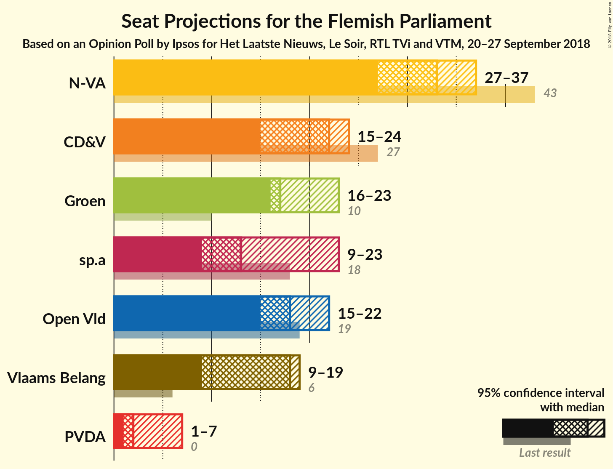
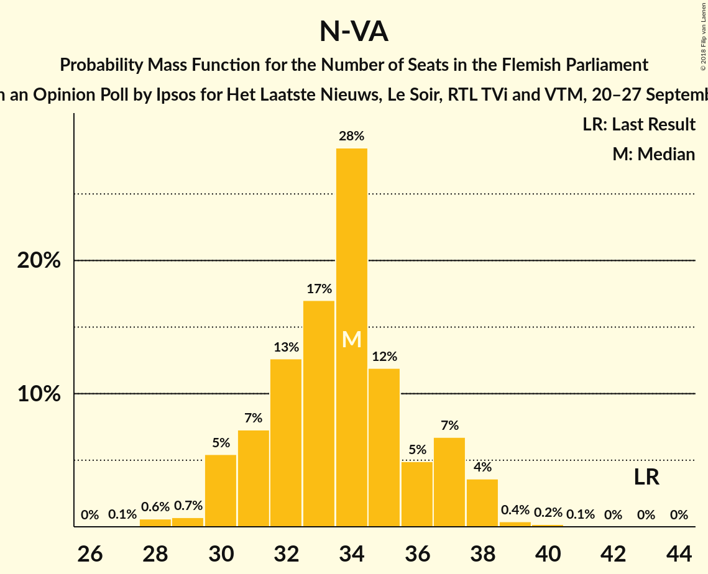
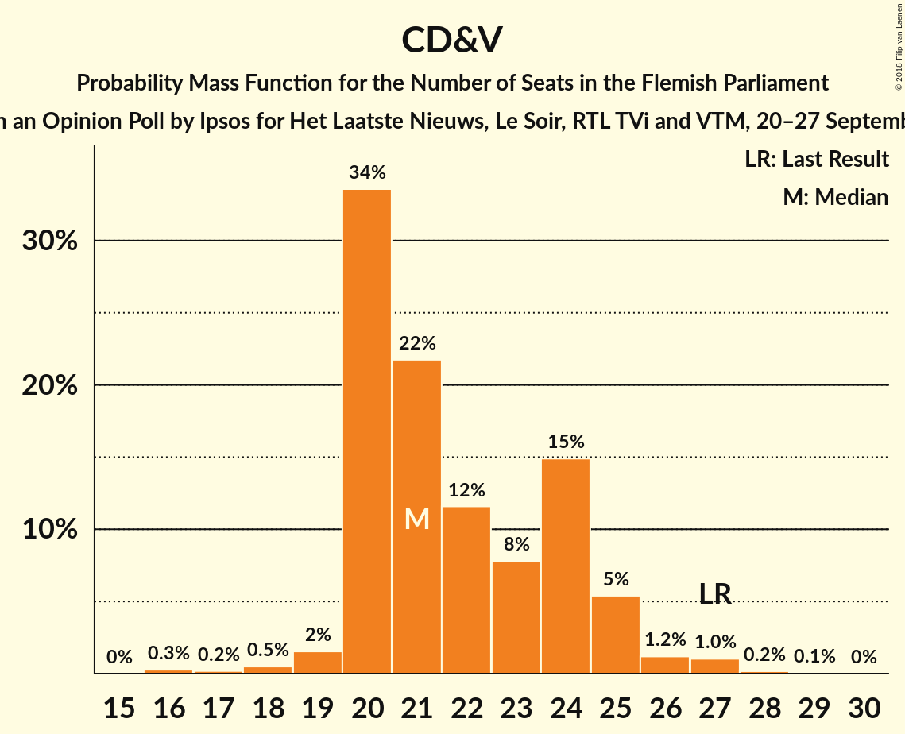
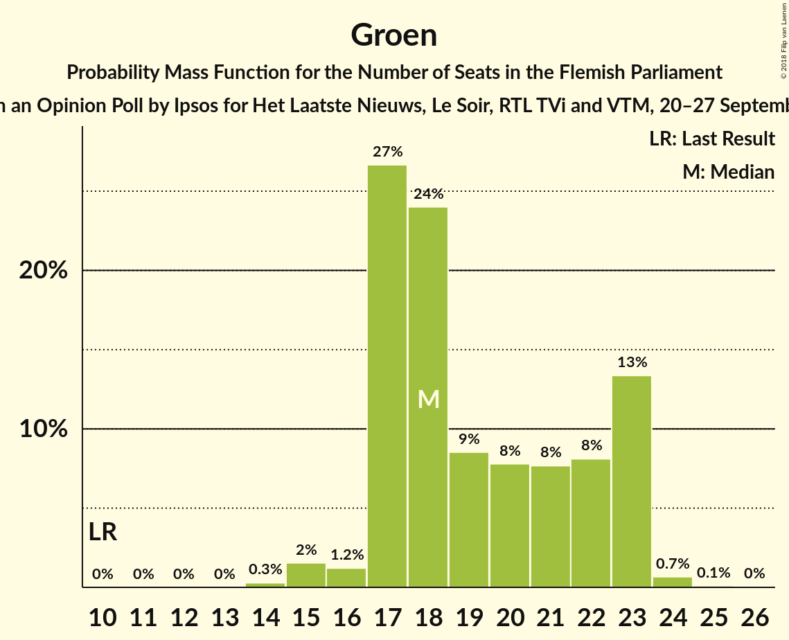
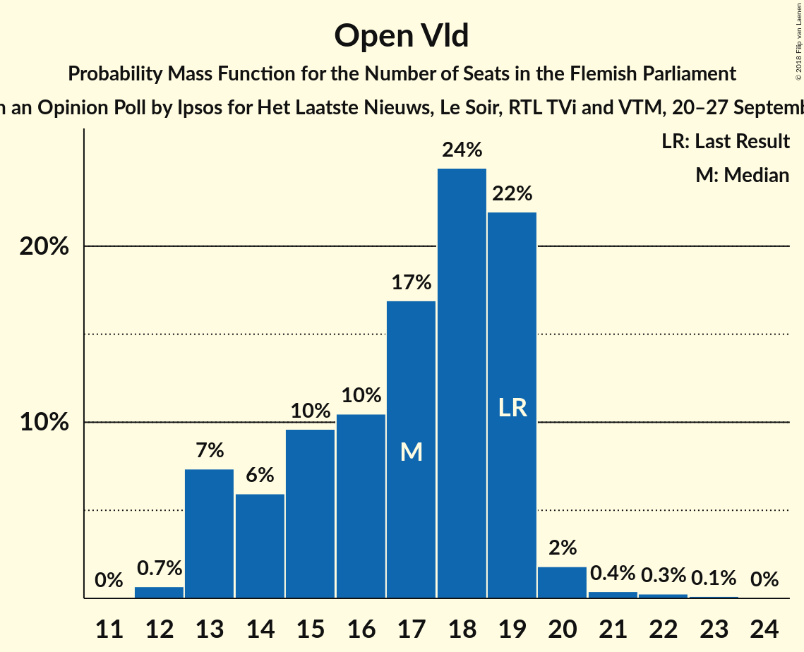
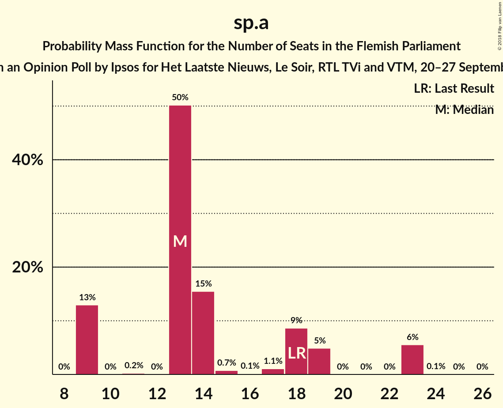
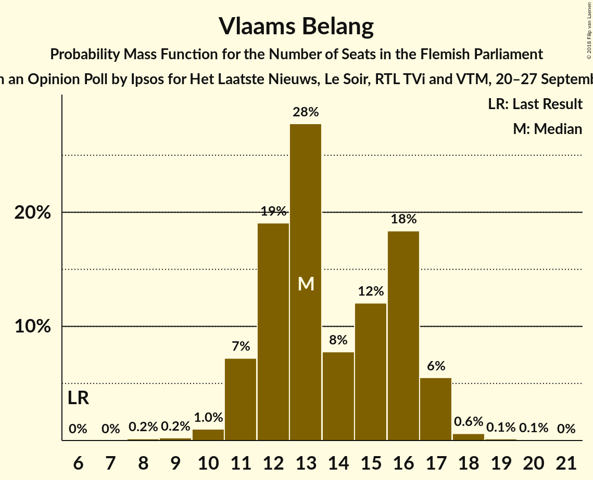
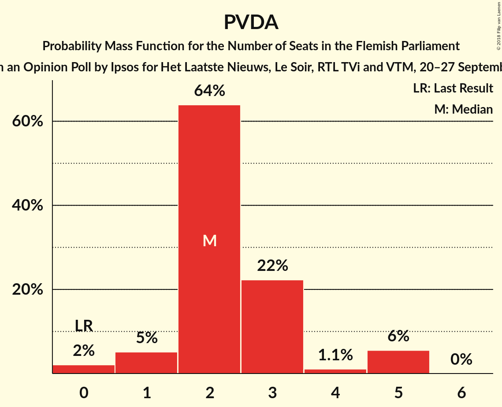
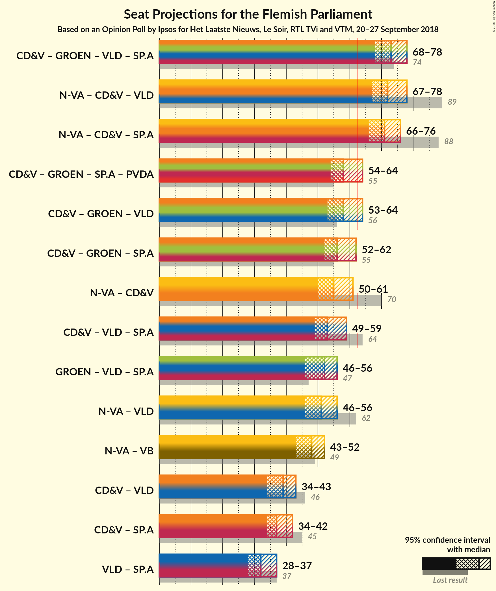

# Opinion Poll by Ipsos for Het Laatste Nieuws, Le Soir, RTL TVi and VTM, 20–27 September 2018

<a href="#voting-intentions">Voting Intentions</a> | <a href="#seats">Seats</a> | <a href="#coalitions">Coalitions</a> | <a href="#technical-information">Technical Information</a>

## Voting Intentions

### Confidence Intervals

| Party | Last Result | Poll Result | 80% Confidence Interval | 90% Confidence Interval | 95% Confidence Interval | 99% Confidence Interval |
|:-----:|:-----------:|:-----------:|:-----------------------:|:-----------------------:|:-----------------------:|:-----------------------:|
| N-VA | 31.9% | 25.0% | 23.3–26.8% |22.8–27.3% |22.4–27.8% |21.6–28.7% |
| CD&V | 20.5% | 17.2% | 15.7–18.8% |15.3–19.3% |15.0–19.7% |14.3–20.5% |
| Groen | 8.7% | 14.1% | 12.8–15.6% |12.4–16.0% |12.1–16.4% |11.5–17.1% |
| Open Vld | 14.1% | 12.8% | 11.5–14.3% |11.2–14.7% |10.9–15.0% |10.3–15.7% |
| sp.a | 14.0% | 12.1% | 10.9–13.5% |10.5–13.9% |10.2–14.3% |9.6–15.0% |
| Vlaams Belang | 5.9% | 11.3% | 10.1–12.7% |9.8–13.1% |9.5–13.4% |8.9–14.1% |
| PVDA | 2.5% | 4.4% | 3.7–5.3% |3.5–5.6% |3.3–5.9% |3.0–6.4% |

*Note:* The poll result column reflects the actual value used in the calculations. Published results may vary slightly, and in addition be rounded to fewer digits.

## Seats

### Confidence Intervals

| Party | Last Result | Median | 80% Confidence Interval | 90% Confidence Interval | 95% Confidence Interval | 99% Confidence Interval |
|:-----:|:-----------:|:------:|:-----------------------:|:-----------------------:|:-----------------------:|:-----------------------:|
| <a href="#n-va">N-VA</a> | 43 | 34 | 31–37 |30–37 |30–38 |28–39 |
| <a href="#cd&v">CD&V</a> | 27 | 21 | 20–24 |20–25 |20–25 |18–27 |
| <a href="#groen">Groen</a> | 10 | 18 | 17–23 |17–23 |16–23 |15–24 |
| <a href="#open-vld">Open Vld</a> | 19 | 17 | 13–19 |13–19 |13–20 |12–21 |
| <a href="#sp.a">sp.a</a> | 18 | 15 | 14–18 |14–19 |14–19 |13–19 |
| <a href="#vlaams-belang">Vlaams Belang</a> | 6 | 13 | 12–16 |11–17 |11–17 |10–18 |
| <a href="#pvda">PVDA</a> | 0 | 2 | 2–3 |1–5 |0–5 |0–5 |

### N-VA

*For a full overview of the results for this party, see the [N-VA](party-n-va.html) page.*

| Number of Seats | Probability | Accumulated | Special Marks |
|:---------------:|:-----------:|:-----------:|:-------------:|
| 27 | 0.1% | 100% |  |
| 28 | 0.6% | 99.9% |  |
| 29 | 0.7% | 99.3% |  |
| 30 | 5% | 98.6% |  |
| 31 | 7% | 93% |  |
| 32 | 13% | 86% |  |
| 33 | 17% | 73% |  |
| 34 | 28% | 56% | Median |
| 35 | 12% | 28% |  |
| 36 | 5% | 16% |  |
| 37 | 7% | 11% |  |
| 38 | 4% | 4% |  |
| 39 | 0.4% | 0.6% |  |
| 40 | 0.2% | 0.2% |  |
| 41 | 0.1% | 0.1% |  |
| 42 | 0% | 0% |  |
| 43 | 0% | 0% | Last Result |

### CD&V

*For a full overview of the results for this party, see the [CD&V](party-cdv.html) page.*

| Number of Seats | Probability | Accumulated | Special Marks |
|:---------------:|:-----------:|:-----------:|:-------------:|
| 16 | 0.3% | 100% |  |
| 17 | 0.2% | 99.7% |  |
| 18 | 0.5% | 99.5% |  |
| 19 | 2% | 99.0% |  |
| 20 | 34% | 98% |  |
| 21 | 22% | 64% | Median |
| 22 | 12% | 42% |  |
| 23 | 8% | 31% |  |
| 24 | 15% | 23% |  |
| 25 | 5% | 8% |  |
| 26 | 1.2% | 2% |  |
| 27 | 1.0% | 1.3% | Last Result |
| 28 | 0.2% | 0.3% |  |
| 29 | 0.1% | 0.1% |  |
| 30 | 0% | 0% |  |

### Groen

*For a full overview of the results for this party, see the [Groen](party-groen.html) page.*

| Number of Seats | Probability | Accumulated | Special Marks |
|:---------------:|:-----------:|:-----------:|:-------------:|
| 10 | 0% | 100% | Last Result |
| 11 | 0% | 100% |  |
| 12 | 0% | 100% |  |
| 13 | 0% | 100% |  |
| 14 | 0.3% | 100% |  |
| 15 | 2% | 99.7% |  |
| 16 | 1.2% | 98% |  |
| 17 | 27% | 97% |  |
| 18 | 24% | 70% | Median |
| 19 | 9% | 46% |  |
| 20 | 8% | 38% |  |
| 21 | 8% | 30% |  |
| 22 | 8% | 22% |  |
| 23 | 13% | 14% |  |
| 24 | 0.7% | 0.8% |  |
| 25 | 0.1% | 0.1% |  |
| 26 | 0% | 0% |  |

### Open Vld

*For a full overview of the results for this party, see the [Open Vld](party-openvld.html) page.*

| Number of Seats | Probability | Accumulated | Special Marks |
|:---------------:|:-----------:|:-----------:|:-------------:|
| 12 | 0.6% | 100% |  |
| 13 | 10% | 99.4% |  |
| 14 | 5% | 89% |  |
| 15 | 7% | 84% |  |
| 16 | 8% | 77% |  |
| 17 | 20% | 70% | Median |
| 18 | 20% | 49% |  |
| 19 | 27% | 30% | Last Result |
| 20 | 2% | 3% |  |
| 21 | 0.5% | 0.9% |  |
| 22 | 0.2% | 0.4% |  |
| 23 | 0.1% | 0.2% |  |
| 24 | 0% | 0% |  |

### sp.a

*For a full overview of the results for this party, see the [sp.a](party-spa.html) page.*

| Number of Seats | Probability | Accumulated | Special Marks |
|:---------------:|:-----------:|:-----------:|:-------------:|
| 10 | 0.1% | 100% |  |
| 11 | 0.1% | 99.9% |  |
| 12 | 0.2% | 99.8% |  |
| 13 | 2% | 99.6% |  |
| 14 | 41% | 98% |  |
| 15 | 14% | 56% | Median |
| 16 | 14% | 43% |  |
| 17 | 18% | 29% |  |
| 18 | 5% | 10% | Last Result |
| 19 | 5% | 5% |  |
| 20 | 0.1% | 0.2% |  |
| 21 | 0% | 0% |  |

### Vlaams Belang

*For a full overview of the results for this party, see the [Vlaams Belang](party-vlaamsbelang.html) page.*

| Number of Seats | Probability | Accumulated | Special Marks |
|:---------------:|:-----------:|:-----------:|:-------------:|
| 6 | 0% | 100% | Last Result |
| 7 | 0% | 100% |  |
| 8 | 0.2% | 100% |  |
| 9 | 0.2% | 99.8% |  |
| 10 | 1.0% | 99.6% |  |
| 11 | 7% | 98.6% |  |
| 12 | 19% | 91% |  |
| 13 | 28% | 72% | Median |
| 14 | 8% | 45% |  |
| 15 | 12% | 37% |  |
| 16 | 18% | 25% |  |
| 17 | 6% | 6% |  |
| 18 | 0.6% | 0.8% |  |
| 19 | 0.1% | 0.2% |  |
| 20 | 0.1% | 0.1% |  |
| 21 | 0% | 0% |  |

### PVDA

*For a full overview of the results for this party, see the [PVDA](party-pvda.html) page.*

| Number of Seats | Probability | Accumulated | Special Marks |
|:---------------:|:-----------:|:-----------:|:-------------:|
| 0 | 3% | 100% | Last Result |
| 1 | 5% | 97% |  |
| 2 | 65% | 92% | Median |
| 3 | 20% | 28% |  |
| 4 | 1.2% | 8% |  |
| 5 | 7% | 7% |  |
| 6 | 0% | 0.1% |  |
| 7 | 0% | 0% |  |

## Coalitions

### Confidence Intervals

| Coalition | Last Result | Median | Majority? | 80% Confidence Interval | 90% Confidence Interval | 95% Confidence Interval | 99% Confidence Interval |
|:---------:|:-----------:|:------:|:---------:|:-----------------------:|:-----------------------:|:-----------------------:|:-----------------------:|
| CD&V – Groen – Open Vld – sp.a | 74 | 73 | 100% | 70–77 | 69–78 | 68–78 | 66–79 |
| N-VA – CD&V – Open Vld | 89 | 72 | 100% | 69–76 | 68–77 | 67–78 | 66–79 |
| N-VA – CD&V – sp.a | 88 | 71 | 100% | 68–74 | 67–75 | 66–76 | 65–78 |
| N-VA – Open Vld – sp.a | 80 | 66 | 90% | 63–70 | 62–71 | 61–71 | 59–72 |
| CD&V – Groen – sp.a – PVDA | 55 | 58 | 11% | 55–63 | 55–63 | 54–64 | 53–66 |
| CD&V – Groen – Open Vld | 56 | 58 | 4% | 54–61 | 53–62 | 53–63 | 51–64 |
| CD&V – Groen – sp.a | 55 | 56 | 0.7% | 53–60 | 52–61 | 52–62 | 51–63 |
| N-VA – CD&V | 70 | 55 | 0.3% | 53–59 | 52–60 | 51–61 | 49–62 |
| CD&V – Open Vld – sp.a | 64 | 54 | 0% | 51–58 | 50–58 | 49–59 | 47–61 |
| Groen – Open Vld – sp.a | 47 | 52 | 0% | 48–55 | 47–56 | 46–56 | 45–58 |
| N-VA – Open Vld | 62 | 51 | 0% | 47–54 | 46–55 | 45–56 | 43–57 |
| N-VA – Vlaams Belang | 49 | 47 | 0% | 44–51 | 43–51 | 43–52 | 41–54 |
| CD&V – Open Vld | 46 | 39 | 0% | 35–42 | 34–43 | 34–43 | 33–45 |
| CD&V – sp.a | 45 | 37 | 0% | 34–40 | 34–41 | 34–42 | 32–44 |
| Open Vld – sp.a | 37 | 33 | 0% | 29–36 | 28–36 | 27–37 | 27–38 |

### CD&V – Groen – Open Vld – sp.a

| Number of Seats | Probability | Accumulated | Special Marks |
|:---------------:|:-----------:|:-----------:|:-------------:|
| 65 | 0.1% | 100% |  |
| 66 | 0.5% | 99.9% |  |
| 67 | 1.3% | 99.4% |  |
| 68 | 1.2% | 98% |  |
| 69 | 3% | 97% |  |
| 70 | 9% | 94% |  |
| 71 | 10% | 85% | Median |
| 72 | 12% | 75% |  |
| 73 | 13% | 63% |  |
| 74 | 20% | 50% | Last Result |
| 75 | 12% | 30% |  |
| 76 | 8% | 18% |  |
| 77 | 5% | 10% |  |
| 78 | 4% | 6% |  |
| 79 | 1.2% | 2% |  |
| 80 | 0.3% | 0.4% |  |
| 81 | 0.1% | 0.1% |  |
| 82 | 0% | 0% |  |

### N-VA – CD&V – Open Vld

| Number of Seats | Probability | Accumulated | Special Marks |
|:---------------:|:-----------:|:-----------:|:-------------:|
| 64 | 0.1% | 100% |  |
| 65 | 0.2% | 99.9% |  |
| 66 | 0.5% | 99.6% |  |
| 67 | 3% | 99.1% |  |
| 68 | 6% | 96% |  |
| 69 | 5% | 91% |  |
| 70 | 9% | 86% |  |
| 71 | 10% | 76% |  |
| 72 | 20% | 66% | Median |
| 73 | 13% | 46% |  |
| 74 | 13% | 33% |  |
| 75 | 8% | 20% |  |
| 76 | 6% | 13% |  |
| 77 | 3% | 7% |  |
| 78 | 3% | 3% |  |
| 79 | 0.5% | 0.7% |  |
| 80 | 0.2% | 0.2% |  |
| 81 | 0% | 0% |  |
| 82 | 0% | 0% |  |
| 83 | 0% | 0% |  |
| 84 | 0% | 0% |  |
| 85 | 0% | 0% |  |
| 86 | 0% | 0% |  |
| 87 | 0% | 0% |  |
| 88 | 0% | 0% |  |
| 89 | 0% | 0% | Last Result |

### N-VA – CD&V – sp.a

| Number of Seats | Probability | Accumulated | Special Marks |
|:---------------:|:-----------:|:-----------:|:-------------:|
| 63 | 0.1% | 100% | Majority |
| 64 | 0.2% | 99.9% |  |
| 65 | 0.9% | 99.7% |  |
| 66 | 1.4% | 98.7% |  |
| 67 | 5% | 97% |  |
| 68 | 13% | 92% |  |
| 69 | 16% | 80% |  |
| 70 | 9% | 64% | Median |
| 71 | 15% | 55% |  |
| 72 | 18% | 39% |  |
| 73 | 8% | 21% |  |
| 74 | 6% | 13% |  |
| 75 | 3% | 7% |  |
| 76 | 2% | 4% |  |
| 77 | 0.8% | 2% |  |
| 78 | 0.6% | 0.7% |  |
| 79 | 0.1% | 0.2% |  |
| 80 | 0% | 0.1% |  |
| 81 | 0% | 0% |  |
| 82 | 0% | 0% |  |
| 83 | 0% | 0% |  |
| 84 | 0% | 0% |  |
| 85 | 0% | 0% |  |
| 86 | 0% | 0% |  |
| 87 | 0% | 0% |  |
| 88 | 0% | 0% | Last Result |

### N-VA – Open Vld – sp.a

| Number of Seats | Probability | Accumulated | Special Marks |
|:---------------:|:-----------:|:-----------:|:-------------:|
| 57 | 0% | 100% |  |
| 58 | 0.2% | 99.9% |  |
| 59 | 0.6% | 99.7% |  |
| 60 | 1.2% | 99.1% |  |
| 61 | 2% | 98% |  |
| 62 | 6% | 96% |  |
| 63 | 6% | 90% | Majority |
| 64 | 10% | 84% |  |
| 65 | 15% | 74% |  |
| 66 | 17% | 59% | Median |
| 67 | 15% | 42% |  |
| 68 | 7% | 27% |  |
| 69 | 7% | 20% |  |
| 70 | 8% | 13% |  |
| 71 | 3% | 5% |  |
| 72 | 2% | 2% |  |
| 73 | 0.3% | 0.4% |  |
| 74 | 0.1% | 0.1% |  |
| 75 | 0% | 0% |  |
| 76 | 0% | 0% |  |
| 77 | 0% | 0% |  |
| 78 | 0% | 0% |  |
| 79 | 0% | 0% |  |
| 80 | 0% | 0% | Last Result |

### CD&V – Groen – sp.a – PVDA

| Number of Seats | Probability | Accumulated | Special Marks |
|:---------------:|:-----------:|:-----------:|:-------------:|
| 51 | 0.1% | 100% |  |
| 52 | 0.2% | 99.9% |  |
| 53 | 0.4% | 99.7% |  |
| 54 | 4% | 99.2% |  |
| 55 | 7% | 95% | Last Result |
| 56 | 10% | 88% | Median |
| 57 | 18% | 78% |  |
| 58 | 13% | 60% |  |
| 59 | 14% | 48% |  |
| 60 | 12% | 33% |  |
| 61 | 6% | 21% |  |
| 62 | 5% | 16% |  |
| 63 | 7% | 11% | Majority |
| 64 | 3% | 4% |  |
| 65 | 0.6% | 1.3% |  |
| 66 | 0.4% | 0.7% |  |
| 67 | 0.2% | 0.3% |  |
| 68 | 0.1% | 0.1% |  |
| 69 | 0% | 0% |  |

### CD&V – Groen – Open Vld

| Number of Seats | Probability | Accumulated | Special Marks |
|:---------------:|:-----------:|:-----------:|:-------------:|
| 49 | 0.1% | 100% |  |
| 50 | 0.1% | 99.9% |  |
| 51 | 0.6% | 99.8% |  |
| 52 | 2% | 99.2% |  |
| 53 | 3% | 98% |  |
| 54 | 5% | 94% |  |
| 55 | 6% | 90% |  |
| 56 | 11% | 83% | Last Result, Median |
| 57 | 16% | 72% |  |
| 58 | 16% | 56% |  |
| 59 | 12% | 40% |  |
| 60 | 13% | 28% |  |
| 61 | 8% | 15% |  |
| 62 | 3% | 7% |  |
| 63 | 2% | 4% | Majority |
| 64 | 2% | 2% |  |
| 65 | 0.4% | 0.5% |  |
| 66 | 0.1% | 0.1% |  |
| 67 | 0% | 0% |  |

### CD&V – Groen – sp.a

| Number of Seats | Probability | Accumulated | Special Marks |
|:---------------:|:-----------:|:-----------:|:-------------:|
| 48 | 0.1% | 100% |  |
| 49 | 0.1% | 99.9% |  |
| 50 | 0.3% | 99.8% |  |
| 51 | 1.0% | 99.5% |  |
| 52 | 7% | 98% |  |
| 53 | 8% | 92% |  |
| 54 | 9% | 84% | Median |
| 55 | 18% | 75% | Last Result |
| 56 | 15% | 57% |  |
| 57 | 12% | 42% |  |
| 58 | 10% | 30% |  |
| 59 | 6% | 20% |  |
| 60 | 4% | 13% |  |
| 61 | 6% | 9% |  |
| 62 | 2% | 3% |  |
| 63 | 0.3% | 0.7% | Majority |
| 64 | 0.3% | 0.5% |  |
| 65 | 0.1% | 0.2% |  |
| 66 | 0.1% | 0.1% |  |
| 67 | 0% | 0% |  |

### N-VA – CD&V

| Number of Seats | Probability | Accumulated | Special Marks |
|:---------------:|:-----------:|:-----------:|:-------------:|
| 48 | 0.1% | 100% |  |
| 49 | 0.4% | 99.9% |  |
| 50 | 1.5% | 99.5% |  |
| 51 | 3% | 98% |  |
| 52 | 4% | 95% |  |
| 53 | 13% | 91% |  |
| 54 | 18% | 79% |  |
| 55 | 21% | 61% | Median |
| 56 | 9% | 40% |  |
| 57 | 11% | 31% |  |
| 58 | 9% | 20% |  |
| 59 | 5% | 10% |  |
| 60 | 3% | 5% |  |
| 61 | 2% | 3% |  |
| 62 | 0.7% | 1.0% |  |
| 63 | 0.2% | 0.3% | Majority |
| 64 | 0% | 0.1% |  |
| 65 | 0% | 0% |  |
| 66 | 0% | 0% |  |
| 67 | 0% | 0% |  |
| 68 | 0% | 0% |  |
| 69 | 0% | 0% |  |
| 70 | 0% | 0% | Last Result |

### CD&V – Open Vld – sp.a

| Number of Seats | Probability | Accumulated | Special Marks |
|:---------------:|:-----------:|:-----------:|:-------------:|
| 46 | 0% | 100% |  |
| 47 | 0.4% | 99.9% |  |
| 48 | 1.3% | 99.5% |  |
| 49 | 2% | 98% |  |
| 50 | 4% | 97% |  |
| 51 | 11% | 92% |  |
| 52 | 9% | 82% |  |
| 53 | 17% | 73% | Median |
| 54 | 14% | 56% |  |
| 55 | 10% | 42% |  |
| 56 | 12% | 32% |  |
| 57 | 9% | 20% |  |
| 58 | 6% | 11% |  |
| 59 | 2% | 5% |  |
| 60 | 1.4% | 2% |  |
| 61 | 0.7% | 0.9% |  |
| 62 | 0.2% | 0.2% |  |
| 63 | 0% | 0% | Majority |
| 64 | 0% | 0% | Last Result |

### Groen – Open Vld – sp.a

| Number of Seats | Probability | Accumulated | Special Marks |
|:---------------:|:-----------:|:-----------:|:-------------:|
| 43 | 0.1% | 100% |  |
| 44 | 0.3% | 99.8% |  |
| 45 | 0.7% | 99.6% |  |
| 46 | 3% | 98.9% |  |
| 47 | 4% | 96% | Last Result |
| 48 | 6% | 92% |  |
| 49 | 6% | 86% |  |
| 50 | 12% | 81% | Median |
| 51 | 17% | 68% |  |
| 52 | 12% | 51% |  |
| 53 | 16% | 39% |  |
| 54 | 8% | 23% |  |
| 55 | 9% | 15% |  |
| 56 | 3% | 6% |  |
| 57 | 2% | 2% |  |
| 58 | 0.6% | 0.9% |  |
| 59 | 0.3% | 0.4% |  |
| 60 | 0% | 0.1% |  |
| 61 | 0% | 0% |  |

### N-VA – Open Vld

| Number of Seats | Probability | Accumulated | Special Marks |
|:---------------:|:-----------:|:-----------:|:-------------:|
| 42 | 0.1% | 100% |  |
| 43 | 0.5% | 99.9% |  |
| 44 | 0.5% | 99.4% |  |
| 45 | 1.5% | 98.9% |  |
| 46 | 3% | 97% |  |
| 47 | 5% | 94% |  |
| 48 | 12% | 89% |  |
| 49 | 10% | 78% |  |
| 50 | 15% | 68% |  |
| 51 | 12% | 53% | Median |
| 52 | 16% | 42% |  |
| 53 | 14% | 25% |  |
| 54 | 5% | 11% |  |
| 55 | 3% | 6% |  |
| 56 | 2% | 4% |  |
| 57 | 1.2% | 1.5% |  |
| 58 | 0.2% | 0.2% |  |
| 59 | 0% | 0.1% |  |
| 60 | 0% | 0% |  |
| 61 | 0% | 0% |  |
| 62 | 0% | 0% | Last Result |

### N-VA – Vlaams Belang

| Number of Seats | Probability | Accumulated | Special Marks |
|:---------------:|:-----------:|:-----------:|:-------------:|
| 40 | 0.1% | 100% |  |
| 41 | 0.5% | 99.8% |  |
| 42 | 1.4% | 99.3% |  |
| 43 | 4% | 98% |  |
| 44 | 6% | 94% |  |
| 45 | 8% | 88% |  |
| 46 | 14% | 80% |  |
| 47 | 22% | 67% | Median |
| 48 | 14% | 45% |  |
| 49 | 11% | 31% | Last Result |
| 50 | 10% | 20% |  |
| 51 | 6% | 11% |  |
| 52 | 3% | 5% |  |
| 53 | 0.8% | 2% |  |
| 54 | 1.1% | 1.2% |  |
| 55 | 0.1% | 0.2% |  |
| 56 | 0% | 0% |  |

### CD&V – Open Vld

| Number of Seats | Probability | Accumulated | Special Marks |
|:---------------:|:-----------:|:-----------:|:-------------:|
| 31 | 0% | 100% |  |
| 32 | 0.2% | 99.9% |  |
| 33 | 2% | 99.7% |  |
| 34 | 5% | 98% |  |
| 35 | 4% | 93% |  |
| 36 | 6% | 89% |  |
| 37 | 15% | 83% |  |
| 38 | 14% | 69% | Median |
| 39 | 16% | 54% |  |
| 40 | 16% | 38% |  |
| 41 | 9% | 22% |  |
| 42 | 5% | 13% |  |
| 43 | 6% | 8% |  |
| 44 | 1.4% | 2% |  |
| 45 | 0.5% | 0.7% |  |
| 46 | 0.1% | 0.2% | Last Result |
| 47 | 0% | 0% |  |

### CD&V – sp.a

| Number of Seats | Probability | Accumulated | Special Marks |
|:---------------:|:-----------:|:-----------:|:-------------:|
| 30 | 0.1% | 100% |  |
| 31 | 0.1% | 99.9% |  |
| 32 | 0.2% | 99.7% |  |
| 33 | 1.0% | 99.5% |  |
| 34 | 16% | 98.5% |  |
| 35 | 11% | 83% |  |
| 36 | 10% | 72% | Median |
| 37 | 18% | 62% |  |
| 38 | 20% | 43% |  |
| 39 | 11% | 23% |  |
| 40 | 4% | 12% |  |
| 41 | 4% | 8% |  |
| 42 | 2% | 4% |  |
| 43 | 2% | 2% |  |
| 44 | 0.5% | 0.6% |  |
| 45 | 0.1% | 0.1% | Last Result |
| 46 | 0% | 0% |  |

### Open Vld – sp.a

| Number of Seats | Probability | Accumulated | Special Marks |
|:---------------:|:-----------:|:-----------:|:-------------:|
| 26 | 0.3% | 100% |  |
| 27 | 2% | 99.6% |  |
| 28 | 4% | 97% |  |
| 29 | 6% | 93% |  |
| 30 | 8% | 87% |  |
| 31 | 13% | 80% |  |
| 32 | 16% | 67% | Median |
| 33 | 21% | 51% |  |
| 34 | 12% | 31% |  |
| 35 | 7% | 19% |  |
| 36 | 7% | 11% |  |
| 37 | 3% | 5% | Last Result |
| 38 | 2% | 2% |  |
| 39 | 0.1% | 0.2% |  |
| 40 | 0% | 0.1% |  |
| 41 | 0% | 0% |  |

## Technical Information

### Opinion Poll

+ **Polling firm:** Ipsos
+ **Commissioner(s):** Het Laatste Nieuws, Le Soir, RTL TVi and VTM
+ **Fieldwork period:** 20–27 September 2018

### Calculations

+ **Sample size:** 1000
+ **Simulations done:** 524,288
+ **Error estimate:** 1.27%

