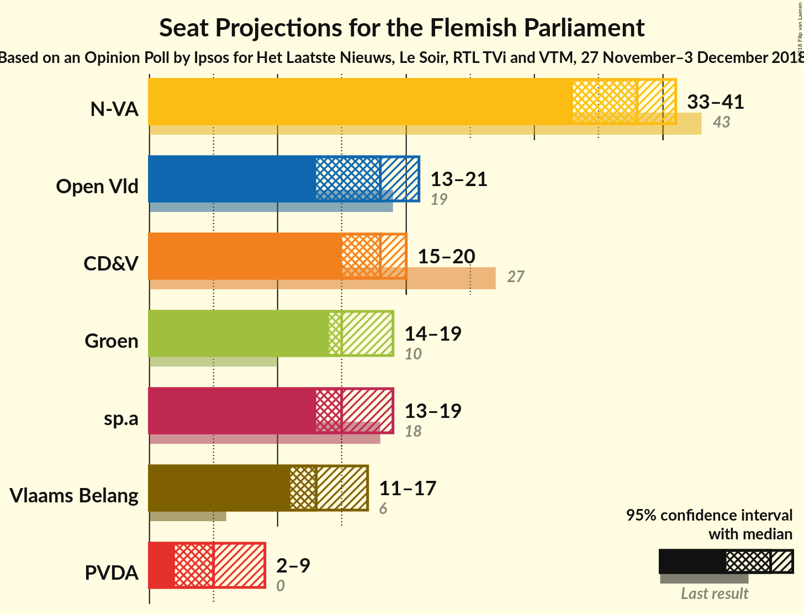
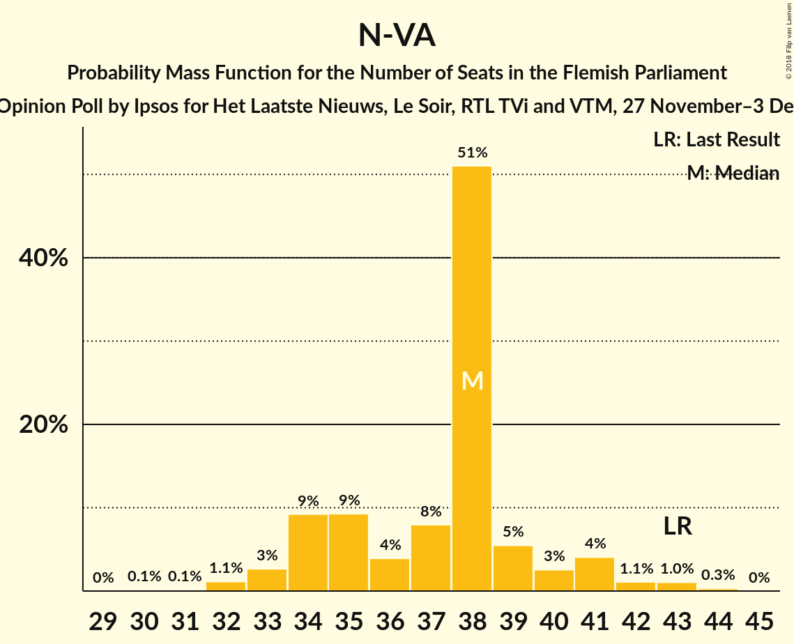
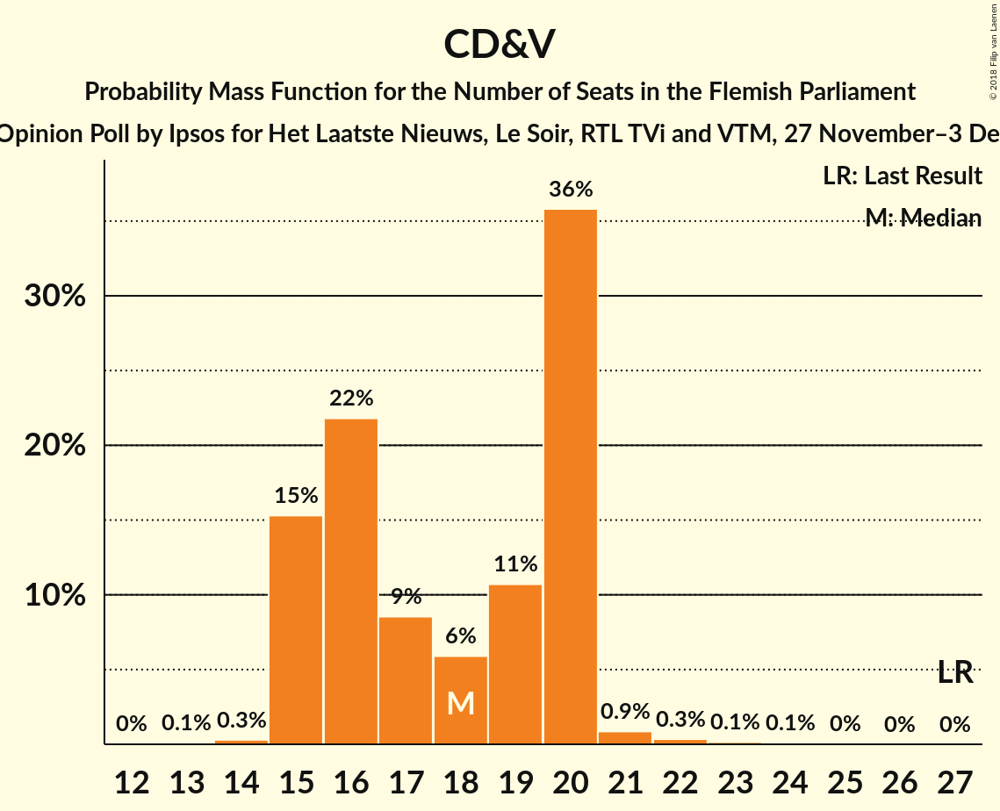
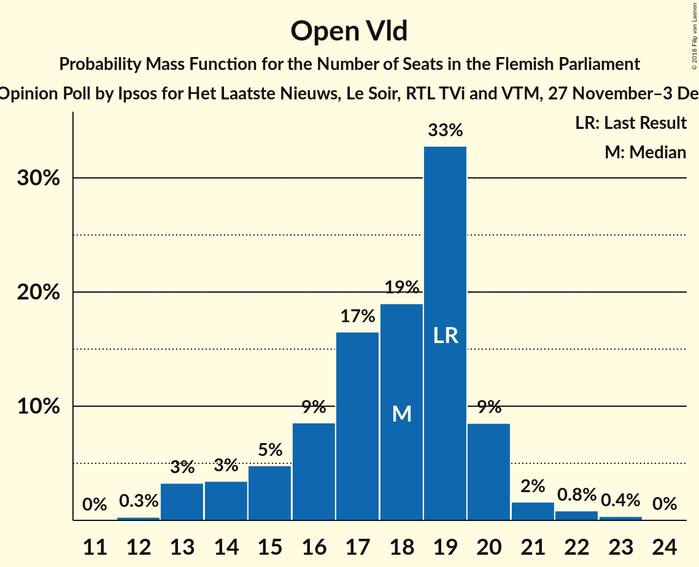
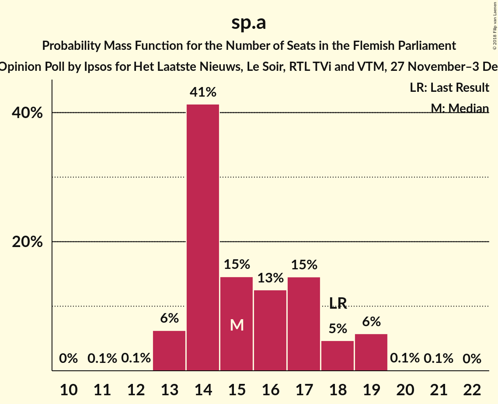
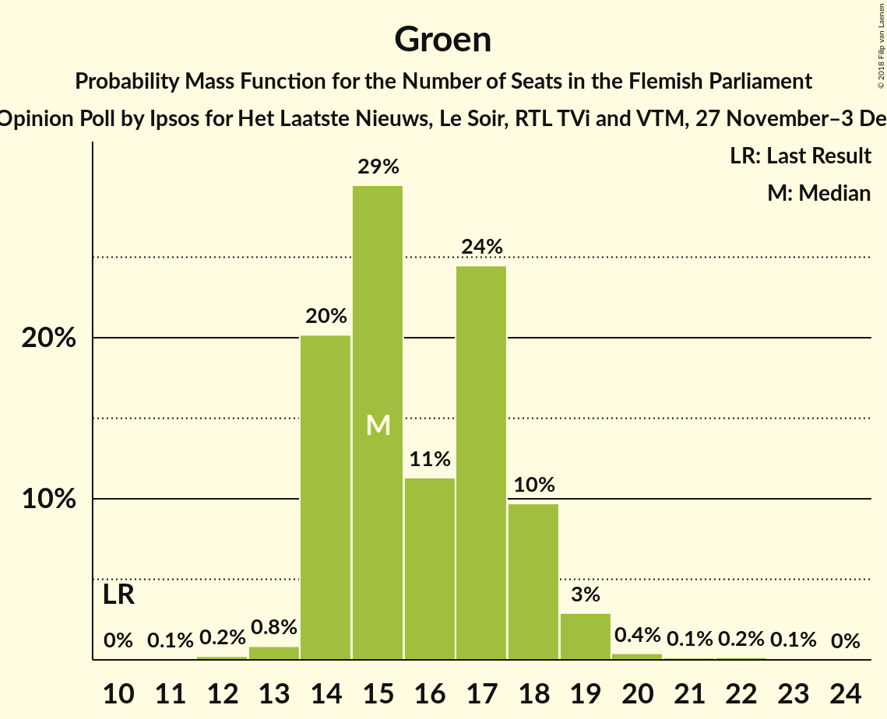
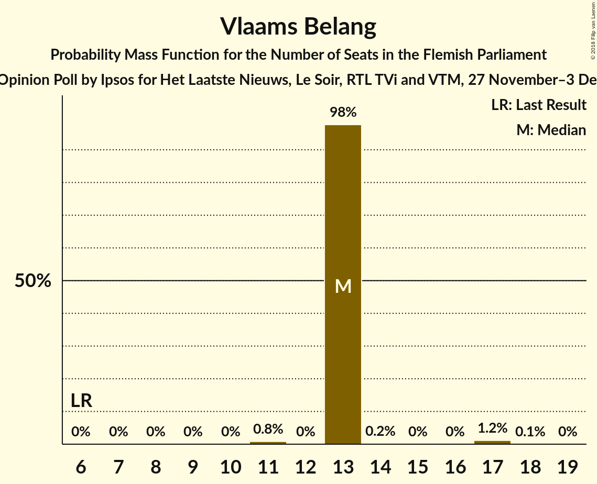
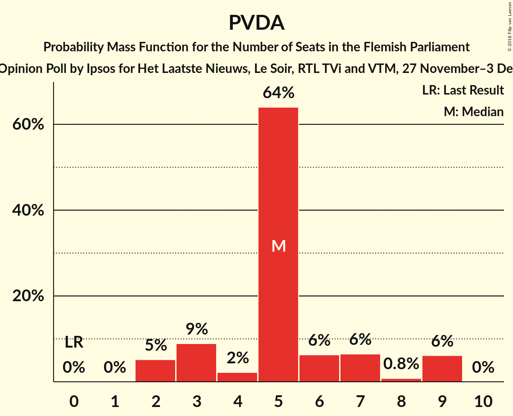
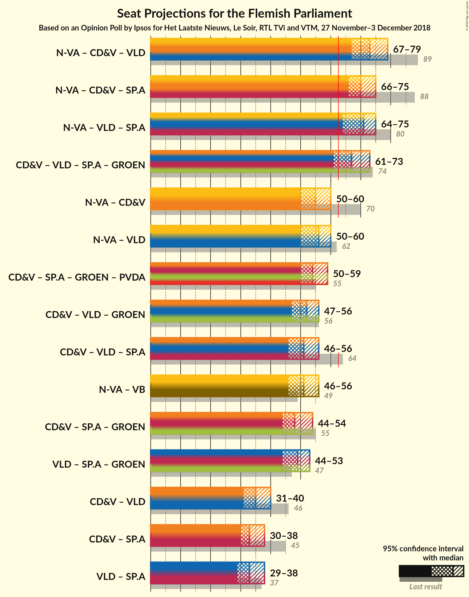

# Opinion Poll by Ipsos for Het Laatste Nieuws, Le Soir, RTL TVi and VTM, 27 November–3 December 2018

<a href="#voting-intentions">Voting Intentions</a> | <a href="#seats">Seats</a> | <a href="#coalitions">Coalitions</a> | <a href="#technical-information">Technical Information</a>

## Voting Intentions

### Confidence Intervals

| Party | Last Result | Poll Result | 80% Confidence Interval | 90% Confidence Interval | 95% Confidence Interval | 99% Confidence Interval |
|:-----:|:-----------:|:-----------:|:-----------------------:|:-----------------------:|:-----------------------:|:-----------------------:|
| N-VA | 31.9% | 28.0% | 26.2–29.8% |25.7–30.4% |25.3–30.8% |24.4–31.7% |
| CD&V | 20.5% | 14.6% | 13.3–16.2% |12.9–16.6% |12.6–17.0% |11.9–17.7% |
| Open Vld | 14.1% | 13.4% | 12.1–14.9% |11.8–15.3% |11.4–15.7% |10.9–16.4% |
| sp.a | 14.0% | 12.3% | 11.1–13.8% |10.7–14.2% |10.4–14.5% |9.8–15.2% |
| Groen | 8.7% | 12.2% | 11.0–13.7% |10.6–14.1% |10.3–14.4% |9.8–15.1% |
| Vlaams Belang | 5.9% | 11.7% | 10.5–13.1% |10.2–13.5% |9.9–13.9% |9.3–14.6% |
| PVDA | 2.5% | 6.2% | 5.3–7.3% |5.1–7.6% |4.9–7.9% |4.5–8.4% |

*Note:* The poll result column reflects the actual value used in the calculations. Published results may vary slightly, and in addition be rounded to fewer digits.

## Seats

### Confidence Intervals

| Party | Last Result | Median | 80% Confidence Interval | 90% Confidence Interval | 95% Confidence Interval | 99% Confidence Interval |
|:-----:|:-----------:|:------:|:-----------------------:|:-----------------------:|:-----------------------:|:-----------------------:|
| <a href="#n-va">N-VA</a> | 43 | 41 | 38–41 |38–41 |38–41 |34–41 |
| <a href="#cd&v">CD&V</a> | 27 | 16 | 16–17 |16–17 |16–17 |15–21 |
| <a href="#open-vld">Open Vld</a> | 19 | 19 | 18–19 |18–19 |18–19 |15–20 |
| <a href="#sp.a">sp.a</a> | 18 | 14 | 14 |14 |14 |14–18 |
| <a href="#groen">Groen</a> | 10 | 15 | 14–15 |14–15 |14–15 |14–16 |
| <a href="#vlaams-belang">Vlaams Belang</a> | 6 | 13 | 13 |13 |13 |11–17 |
| <a href="#pvda">PVDA</a> | 0 | 5 | 5–9 |5–9 |5–9 |3–9 |

### N-VA

*For a full overview of the results for this party, see the [N-VA](party-n-va.html) page.*

| Number of Seats | Probability | Accumulated | Special Marks |
|:---------------:|:-----------:|:-----------:|:-------------:|
| 33 | 0.1% | 100% |  |
| 34 | 0.5% | 99.9% |  |
| 35 | 0% | 99.4% |  |
| 36 | 0% | 99.4% |  |
| 37 | 0.8% | 99.4% |  |
| 38 | 21% | 98.7% |  |
| 39 | 0.4% | 78% |  |
| 40 | 0% | 78% |  |
| 41 | 78% | 78% | Median |
| 42 | 0.1% | 0.1% |  |
| 43 | 0% | 0% | Last Result |

### CD&V

*For a full overview of the results for this party, see the [CD&V](party-cdv.html) page.*

| Number of Seats | Probability | Accumulated | Special Marks |
|:---------------:|:-----------:|:-----------:|:-------------:|
| 15 | 0.5% | 100% |  |
| 16 | 78% | 99.4% | Median |
| 17 | 20% | 22% |  |
| 18 | 0% | 1.3% |  |
| 19 | 0% | 1.3% |  |
| 20 | 0.5% | 1.3% |  |
| 21 | 0.7% | 0.8% |  |
| 22 | 0% | 0% |  |
| 23 | 0% | 0% |  |
| 24 | 0% | 0% |  |
| 25 | 0% | 0% |  |
| 26 | 0% | 0% |  |
| 27 | 0% | 0% | Last Result |

### Open Vld

*For a full overview of the results for this party, see the [Open Vld](party-openvld.html) page.*

| Number of Seats | Probability | Accumulated | Special Marks |
|:---------------:|:-----------:|:-----------:|:-------------:|
| 13 | 0.4% | 100% |  |
| 14 | 0% | 99.6% |  |
| 15 | 0.2% | 99.6% |  |
| 16 | 0.2% | 99.4% |  |
| 17 | 0.2% | 99.2% |  |
| 18 | 20% | 99.0% |  |
| 19 | 78% | 79% | Last Result, Median |
| 20 | 0.5% | 0.6% |  |
| 21 | 0.1% | 0.1% |  |
| 22 | 0% | 0% |  |

### sp.a

*For a full overview of the results for this party, see the [sp.a](party-spa.html) page.*

| Number of Seats | Probability | Accumulated | Special Marks |
|:---------------:|:-----------:|:-----------:|:-------------:|
| 14 | 98% | 100% | Median |
| 15 | 0.1% | 2% |  |
| 16 | 0.2% | 2% |  |
| 17 | 0.2% | 1.4% |  |
| 18 | 1.2% | 1.2% | Last Result |
| 19 | 0% | 0% |  |

### Groen

*For a full overview of the results for this party, see the [Groen](party-groen.html) page.*

| Number of Seats | Probability | Accumulated | Special Marks |
|:---------------:|:-----------:|:-----------:|:-------------:|
| 10 | 0% | 100% | Last Result |
| 11 | 0% | 100% |  |
| 12 | 0% | 100% |  |
| 13 | 0.5% | 100% |  |
| 14 | 20% | 99.5% |  |
| 15 | 78% | 79% | Median |
| 16 | 0.4% | 0.9% |  |
| 17 | 0.4% | 0.5% |  |
| 18 | 0% | 0.1% |  |
| 19 | 0% | 0% |  |

### Vlaams Belang

*For a full overview of the results for this party, see the [Vlaams Belang](party-vlaamsbelang.html) page.*

| Number of Seats | Probability | Accumulated | Special Marks |
|:---------------:|:-----------:|:-----------:|:-------------:|
| 6 | 0% | 100% | Last Result |
| 7 | 0% | 100% |  |
| 8 | 0% | 100% |  |
| 9 | 0% | 100% |  |
| 10 | 0% | 100% |  |
| 11 | 0.8% | 100% |  |
| 12 | 0% | 99.1% |  |
| 13 | 98% | 99.1% | Median |
| 14 | 0.2% | 1.5% |  |
| 15 | 0% | 1.2% |  |
| 16 | 0% | 1.2% |  |
| 17 | 1.2% | 1.2% |  |
| 18 | 0.1% | 0.1% |  |
| 19 | 0% | 0% |  |

### PVDA

*For a full overview of the results for this party, see the [PVDA](party-pvda.html) page.*

| Number of Seats | Probability | Accumulated | Special Marks |
|:---------------:|:-----------:|:-----------:|:-------------:|
| 0 | 0% | 100% | Last Result |
| 1 | 0% | 100% |  |
| 2 | 0.4% | 100% |  |
| 3 | 0.8% | 99.6% |  |
| 4 | 0% | 98.9% |  |
| 5 | 79% | 98.9% | Median |
| 6 | 0% | 20% |  |
| 7 | 0% | 20% |  |
| 8 | 0% | 20% |  |
| 9 | 20% | 20% |  |
| 10 | 0% | 0% |  |

## Coalitions

### Confidence Intervals

| Coalition | Last Result | Median | Majority? | 80% Confidence Interval | 90% Confidence Interval | 95% Confidence Interval | 99% Confidence Interval |
|:---------:|:-----------:|:------:|:---------:|:-----------------------:|:-----------------------:|:-----------------------:|:-----------------------:|
| N-VA – CD&V – Open Vld | 89 | 76 | 100% | 73–76 | 73–76 | 73–76 | 70–77 |
| N-VA – Open Vld – sp.a | 80 | 74 | 100% | 70–74 | 70–74 | 70–74 | 69–74 |
| N-VA – CD&V – sp.a | 88 | 71 | 100% | 69–71 | 69–71 | 69–71 | 68–76 |
| CD&V – Open Vld – sp.a – Groen | 74 | 64 | 99.3% | 63–64 | 63–64 | 63–64 | 62–73 |
| N-VA – Open Vld | 62 | 60 | 0% | 56–60 | 56–60 | 56–60 | 53–60 |
| N-VA – CD&V | 70 | 57 | 0% | 55–57 | 55–57 | 55–57 | 54–58 |
| N-VA – Vlaams Belang | 49 | 54 | 0% | 51–54 | 51–54 | 51–54 | 48–55 |
| CD&V – sp.a – Groen – PVDA | 55 | 50 | 0% | 50–54 | 50–54 | 50–54 | 50–57 |
| CD&V – Open Vld – Groen | 56 | 50 | 0% | 49–50 | 49–50 | 49–50 | 48–55 |
| CD&V – Open Vld – sp.a | 64 | 49 | 0% | 49 | 49 | 49 | 49–58 |
| Open Vld – sp.a – Groen | 47 | 48 | 0% | 46–48 | 46–48 | 46–48 | 46–52 |
| CD&V – sp.a – Groen | 55 | 45 | 0% | 45 | 45 | 45 | 44–54 |
| CD&V – Open Vld | 46 | 35 | 0% | 35 | 35 | 35 | 33–40 |
| Open Vld – sp.a | 37 | 33 | 0% | 32–33 | 32–33 | 32–33 | 31–37 |
| CD&V – sp.a | 45 | 30 | 0% | 30–31 | 30–31 | 30–31 | 30–39 |

### N-VA – CD&V – Open Vld

| Number of Seats | Probability | Accumulated | Special Marks |
|:---------------:|:-----------:|:-----------:|:-------------:|
| 67 | 0.4% | 100% |  |
| 68 | 0% | 99.6% |  |
| 69 | 0.1% | 99.6% |  |
| 70 | 0.1% | 99.5% |  |
| 71 | 0.2% | 99.4% |  |
| 72 | 0.2% | 99.2% |  |
| 73 | 20% | 98.9% |  |
| 74 | 0.5% | 79% |  |
| 75 | 0% | 78% |  |
| 76 | 78% | 78% | Median |
| 77 | 0.8% | 0.8% |  |
| 78 | 0% | 0% |  |
| 79 | 0% | 0% |  |
| 80 | 0% | 0% |  |
| 81 | 0% | 0% |  |
| 82 | 0% | 0% |  |
| 83 | 0% | 0% |  |
| 84 | 0% | 0% |  |
| 85 | 0% | 0% |  |
| 86 | 0% | 0% |  |
| 87 | 0% | 0% |  |
| 88 | 0% | 0% |  |
| 89 | 0% | 0% | Last Result |

### N-VA – Open Vld – sp.a

| Number of Seats | Probability | Accumulated | Special Marks |
|:---------------:|:-----------:|:-----------:|:-------------:|
| 65 | 0.4% | 100% |  |
| 66 | 0% | 99.6% |  |
| 67 | 0% | 99.6% |  |
| 68 | 0% | 99.5% |  |
| 69 | 0.3% | 99.5% |  |
| 70 | 20% | 99.3% |  |
| 71 | 0.1% | 79% |  |
| 72 | 0% | 79% |  |
| 73 | 0.4% | 79% |  |
| 74 | 78% | 78% | Median |
| 75 | 0% | 0.1% |  |
| 76 | 0% | 0% |  |
| 77 | 0% | 0% |  |
| 78 | 0% | 0% |  |
| 79 | 0% | 0% |  |
| 80 | 0% | 0% | Last Result |

### N-VA – CD&V – sp.a

| Number of Seats | Probability | Accumulated | Special Marks |
|:---------------:|:-----------:|:-----------:|:-------------:|
| 64 | 0.1% | 100% |  |
| 65 | 0% | 99.9% |  |
| 66 | 0% | 99.9% |  |
| 67 | 0% | 99.9% |  |
| 68 | 0.4% | 99.9% |  |
| 69 | 20% | 99.5% |  |
| 70 | 0.1% | 79% |  |
| 71 | 78% | 79% | Median |
| 72 | 0.6% | 1.4% |  |
| 73 | 0% | 0.8% |  |
| 74 | 0% | 0.8% |  |
| 75 | 0% | 0.8% |  |
| 76 | 0.7% | 0.8% |  |
| 77 | 0% | 0% |  |
| 78 | 0% | 0% |  |
| 79 | 0% | 0% |  |
| 80 | 0% | 0% |  |
| 81 | 0% | 0% |  |
| 82 | 0% | 0% |  |
| 83 | 0% | 0% |  |
| 84 | 0% | 0% |  |
| 85 | 0% | 0% |  |
| 86 | 0% | 0% |  |
| 87 | 0% | 0% |  |
| 88 | 0% | 0% | Last Result |

### CD&V – Open Vld – sp.a – Groen

| Number of Seats | Probability | Accumulated | Special Marks |
|:---------------:|:-----------:|:-----------:|:-------------:|
| 61 | 0.1% | 100% |  |
| 62 | 0.6% | 99.9% |  |
| 63 | 20% | 99.3% | Majority |
| 64 | 78% | 79% | Median |
| 65 | 0% | 2% |  |
| 66 | 0.4% | 2% |  |
| 67 | 0.5% | 1.4% |  |
| 68 | 0% | 0.9% |  |
| 69 | 0% | 0.9% |  |
| 70 | 0% | 0.9% |  |
| 71 | 0% | 0.9% |  |
| 72 | 0.1% | 0.8% |  |
| 73 | 0.7% | 0.8% |  |
| 74 | 0% | 0% | Last Result |

### N-VA – Open Vld

| Number of Seats | Probability | Accumulated | Special Marks |
|:---------------:|:-----------:|:-----------:|:-------------:|
| 47 | 0.4% | 100% |  |
| 48 | 0% | 99.6% |  |
| 49 | 0% | 99.6% |  |
| 50 | 0% | 99.6% |  |
| 51 | 0% | 99.6% |  |
| 52 | 0% | 99.6% |  |
| 53 | 0.1% | 99.6% |  |
| 54 | 0.3% | 99.4% |  |
| 55 | 0.2% | 99.1% |  |
| 56 | 21% | 98.9% |  |
| 57 | 0% | 78% |  |
| 58 | 0% | 78% |  |
| 59 | 0.4% | 78% |  |
| 60 | 78% | 78% | Median |
| 61 | 0% | 0% |  |
| 62 | 0% | 0% | Last Result |

### N-VA – CD&V

| Number of Seats | Probability | Accumulated | Special Marks |
|:---------------:|:-----------:|:-----------:|:-------------:|
| 49 | 0.1% | 100% |  |
| 50 | 0% | 99.9% |  |
| 51 | 0% | 99.9% |  |
| 52 | 0% | 99.9% |  |
| 53 | 0.1% | 99.9% |  |
| 54 | 0.8% | 99.8% |  |
| 55 | 20% | 99.0% |  |
| 56 | 0% | 79% |  |
| 57 | 78% | 79% | Median |
| 58 | 0.8% | 0.9% |  |
| 59 | 0% | 0% |  |
| 60 | 0% | 0% |  |
| 61 | 0% | 0% |  |
| 62 | 0% | 0% |  |
| 63 | 0% | 0% | Majority |
| 64 | 0% | 0% |  |
| 65 | 0% | 0% |  |
| 66 | 0% | 0% |  |
| 67 | 0% | 0% |  |
| 68 | 0% | 0% |  |
| 69 | 0% | 0% |  |
| 70 | 0% | 0% | Last Result |

### N-VA – Vlaams Belang

| Number of Seats | Probability | Accumulated | Special Marks |
|:---------------:|:-----------:|:-----------:|:-------------:|
| 46 | 0.1% | 100% |  |
| 47 | 0% | 99.9% |  |
| 48 | 0.8% | 99.9% |  |
| 49 | 0% | 99.1% | Last Result |
| 50 | 0% | 99.1% |  |
| 51 | 20% | 99.1% |  |
| 52 | 0.3% | 79% |  |
| 53 | 0.1% | 78% |  |
| 54 | 78% | 78% | Median |
| 55 | 0.4% | 0.8% |  |
| 56 | 0.4% | 0.4% |  |
| 57 | 0% | 0% |  |

### CD&V – sp.a – Groen – PVDA

| Number of Seats | Probability | Accumulated | Special Marks |
|:---------------:|:-----------:|:-----------:|:-------------:|
| 47 | 0.4% | 100% |  |
| 48 | 0% | 99.6% |  |
| 49 | 0% | 99.6% |  |
| 50 | 78% | 99.5% | Median |
| 51 | 0% | 22% |  |
| 52 | 0.3% | 22% |  |
| 53 | 0.2% | 22% |  |
| 54 | 20% | 21% |  |
| 55 | 0% | 1.3% | Last Result |
| 56 | 0.1% | 1.3% |  |
| 57 | 0.8% | 1.2% |  |
| 58 | 0% | 0.4% |  |
| 59 | 0.4% | 0.4% |  |
| 60 | 0% | 0% |  |

### CD&V – Open Vld – Groen

| Number of Seats | Probability | Accumulated | Special Marks |
|:---------------:|:-----------:|:-----------:|:-------------:|
| 47 | 0.1% | 100% |  |
| 48 | 0.6% | 99.9% |  |
| 49 | 21% | 99.3% |  |
| 50 | 78% | 79% | Median |
| 51 | 0% | 1.0% |  |
| 52 | 0.1% | 1.0% |  |
| 53 | 0% | 0.9% |  |
| 54 | 0% | 0.9% |  |
| 55 | 0.8% | 0.9% |  |
| 56 | 0% | 0% | Last Result |

### CD&V – Open Vld – sp.a

| Number of Seats | Probability | Accumulated | Special Marks |
|:---------------:|:-----------:|:-----------:|:-------------:|
| 48 | 0.3% | 100% |  |
| 49 | 98% | 99.7% | Median |
| 50 | 0.1% | 1.4% |  |
| 51 | 0.4% | 1.3% |  |
| 52 | 0% | 0.8% |  |
| 53 | 0% | 0.8% |  |
| 54 | 0% | 0.8% |  |
| 55 | 0% | 0.8% |  |
| 56 | 0% | 0.8% |  |
| 57 | 0% | 0.8% |  |
| 58 | 0.8% | 0.8% |  |
| 59 | 0% | 0% |  |
| 60 | 0% | 0% |  |
| 61 | 0% | 0% |  |
| 62 | 0% | 0% |  |
| 63 | 0% | 0% | Majority |
| 64 | 0% | 0% | Last Result |

### Open Vld – sp.a – Groen

| Number of Seats | Probability | Accumulated | Special Marks |
|:---------------:|:-----------:|:-----------:|:-------------:|
| 45 | 0.3% | 100% |  |
| 46 | 20% | 99.7% |  |
| 47 | 0.8% | 80% | Last Result |
| 48 | 78% | 79% | Median |
| 49 | 0.3% | 1.3% |  |
| 50 | 0% | 0.9% |  |
| 51 | 0% | 0.9% |  |
| 52 | 0.9% | 0.9% |  |
| 53 | 0% | 0% |  |

### CD&V – sp.a – Groen

| Number of Seats | Probability | Accumulated | Special Marks |
|:---------------:|:-----------:|:-----------:|:-------------:|
| 42 | 0.4% | 100% |  |
| 43 | 0.1% | 99.6% |  |
| 44 | 0.1% | 99.5% |  |
| 45 | 98% | 99.5% | Median |
| 46 | 0% | 2% |  |
| 47 | 0.1% | 2% |  |
| 48 | 0% | 2% |  |
| 49 | 0% | 2% |  |
| 50 | 0.2% | 2% |  |
| 51 | 0.2% | 1.4% |  |
| 52 | 0% | 1.2% |  |
| 53 | 0% | 1.2% |  |
| 54 | 1.2% | 1.2% |  |
| 55 | 0% | 0% | Last Result |

### CD&V – Open Vld

| Number of Seats | Probability | Accumulated | Special Marks |
|:---------------:|:-----------:|:-----------:|:-------------:|
| 32 | 0.1% | 100% |  |
| 33 | 0.6% | 99.8% |  |
| 34 | 0.4% | 99.3% |  |
| 35 | 98% | 98.9% | Median |
| 36 | 0% | 0.9% |  |
| 37 | 0% | 0.9% |  |
| 38 | 0% | 0.8% |  |
| 39 | 0% | 0.8% |  |
| 40 | 0.8% | 0.8% |  |
| 41 | 0.1% | 0.1% |  |
| 42 | 0% | 0% |  |
| 43 | 0% | 0% |  |
| 44 | 0% | 0% |  |
| 45 | 0% | 0% |  |
| 46 | 0% | 0% | Last Result |

### Open Vld – sp.a

| Number of Seats | Probability | Accumulated | Special Marks |
|:---------------:|:-----------:|:-----------:|:-------------:|
| 31 | 0.6% | 100% |  |
| 32 | 20% | 99.3% |  |
| 33 | 78% | 79% | Median |
| 34 | 0.4% | 1.3% |  |
| 35 | 0.1% | 0.9% |  |
| 36 | 0% | 0.9% |  |
| 37 | 0.7% | 0.8% | Last Result |
| 38 | 0.1% | 0.1% |  |
| 39 | 0% | 0% |  |

### CD&V – sp.a

| Number of Seats | Probability | Accumulated | Special Marks |
|:---------------:|:-----------:|:-----------:|:-------------:|
| 29 | 0.5% | 100% |  |
| 30 | 78% | 99.5% | Median |
| 31 | 20% | 22% |  |
| 32 | 0% | 2% |  |
| 33 | 0.2% | 2% |  |
| 34 | 0.2% | 1.4% |  |
| 35 | 0% | 1.3% |  |
| 36 | 0% | 1.2% |  |
| 37 | 0.1% | 1.2% |  |
| 38 | 0.4% | 1.2% |  |
| 39 | 0.7% | 0.8% |  |
| 40 | 0% | 0% |  |
| 41 | 0% | 0% |  |
| 42 | 0% | 0% |  |
| 43 | 0% | 0% |  |
| 44 | 0% | 0% |  |
| 45 | 0% | 0% | Last Result |

## Technical Information

### Opinion Poll

+ **Polling firm:** Ipsos
+ **Commissioner(s):** Het Laatste Nieuws, Le Soir, RTL TVi and VTM
+ **Fieldwork period:** 27 November–3 December 2018

### Calculations

+ **Sample size:** 998
+ **Simulations done:** 1,024
+ **Error estimate:** 2.74%

