# Opinion Poll by TNS for De Standaard, La Libre Belgique, RTBf and VRT, 19 November–8 December 2018

<a href="#voting-intentions">Voting Intentions</a> | <a href="#seats">Seats</a> | <a href="#coalitions">Coalitions</a> | <a href="#technical-information">Technical Information</a>

## Voting Intentions

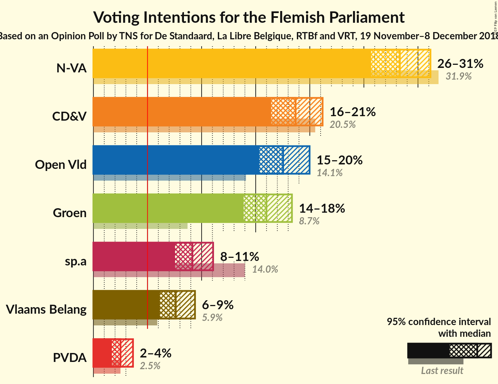

### Confidence Intervals

| Party | Last Result | Poll Result | 80% Confidence Interval | 90% Confidence Interval | 95% Confidence Interval | 99% Confidence Interval |
|:-----:|:-----------:|:-----------:|:-----------------------:|:-----------------------:|:-----------------------:|:-----------------------:|
| N-VA | 31.9% | 28.3% | 26.6–30.2% |26.1–30.7% |25.7–31.2% |24.8–32.1% |
| CD&V | 20.5% | 18.7% | 17.2–20.3% |16.8–20.8% |16.4–21.2% |15.7–22.0% |
| Open Vld | 14.1% | 17.5% | 16.1–19.1% |15.7–19.6% |15.3–20.0% |14.7–20.8% |
| Groen | 8.7% | 16.0% | 14.6–17.5% |14.2–18.0% |13.9–18.4% |13.2–19.1% |
| sp.a | 14.0% | 9.2% | 8.1–10.4% |7.8–10.8% |7.5–11.1% |7.1–11.7% |
| Vlaams Belang | 5.9% | 7.6% | 6.6–8.8% |6.4–9.1% |6.1–9.4% |5.7–10.0% |
| PVDA | 2.5% | 2.5% | 2.0–3.2% |1.8–3.5% |1.7–3.7% |1.5–4.0% |

*Note:* The poll result column reflects the actual value used in the calculations. Published results may vary slightly, and in addition be rounded to fewer digits.

## Seats

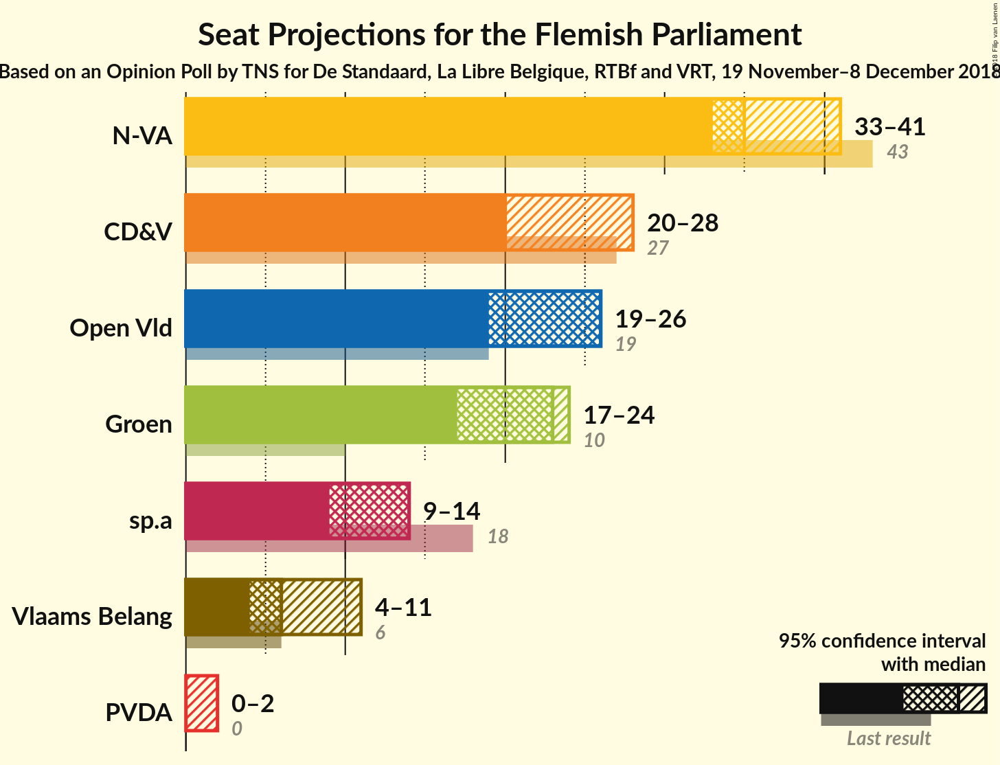

### Confidence Intervals

| Party | Last Result | Median | 80% Confidence Interval | 90% Confidence Interval | 95% Confidence Interval | 99% Confidence Interval |
|:-----:|:-----------:|:------:|:-----------------------:|:-----------------------:|:-----------------------:|:-----------------------:|
| <a href="#n-va">N-VA</a> | 43 | 35 | 33–38 |33–38 |33–41 |33–41 |
| <a href="#cd&v">CD&V</a> | 27 | 20 | 20–26 |20–28 |20–28 |20–28 |
| <a href="#open-vld">Open Vld</a> | 19 | 26 | 23–26 |23–26 |19–26 |19–26 |
| <a href="#groen">Groen</a> | 10 | 23 | 17–23 |17–24 |17–24 |16–27 |
| <a href="#sp.a">sp.a</a> | 18 | 14 | 9–14 |9–14 |9–14 |8–14 |
| <a href="#vlaams-belang">Vlaams Belang</a> | 6 | 6 | 5–8 |4–8 |4–11 |4–11 |
| <a href="#pvda">PVDA</a> | 0 | 0 | 0–1 |0–2 |0–2 |0–2 |

### N-VA

*For a full overview of the results for this party, see the [N-VA](party-n-va.html) page.*

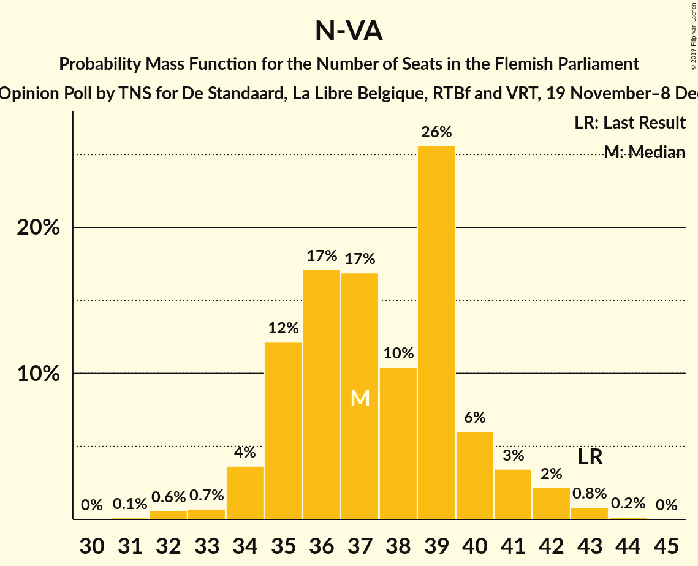

| Number of Seats | Probability | Accumulated | Special Marks |
|:---------------:|:-----------:|:-----------:|:-------------:|
| 31 | 0.2% | 100% |  |
| 32 | 0% | 99.8% |  |
| 33 | 18% | 99.8% |  |
| 34 | 6% | 82% |  |
| 35 | 53% | 76% | Median |
| 36 | 8% | 24% |  |
| 37 | 0.3% | 16% |  |
| 38 | 11% | 16% |  |
| 39 | 0.6% | 5% |  |
| 40 | 0.7% | 4% |  |
| 41 | 3% | 3% |  |
| 42 | 0% | 0% |  |
| 43 | 0% | 0% | Last Result |

### CD&V

*For a full overview of the results for this party, see the [CD&V](party-cdv.html) page.*

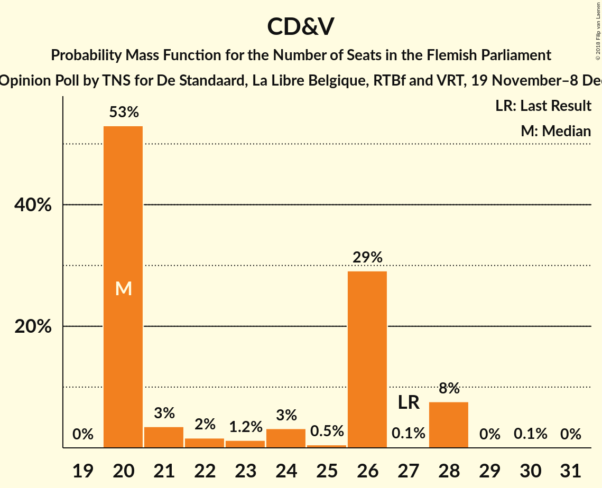

| Number of Seats | Probability | Accumulated | Special Marks |
|:---------------:|:-----------:|:-----------:|:-------------:|
| 20 | 53% | 100% | Median |
| 21 | 3% | 47% |  |
| 22 | 2% | 43% |  |
| 23 | 1.2% | 42% |  |
| 24 | 3% | 41% |  |
| 25 | 0.5% | 37% |  |
| 26 | 29% | 37% |  |
| 27 | 0.1% | 8% | Last Result |
| 28 | 8% | 8% |  |
| 29 | 0% | 0.1% |  |
| 30 | 0.1% | 0.1% |  |
| 31 | 0% | 0% |  |

### Open Vld

*For a full overview of the results for this party, see the [Open Vld](party-openvld.html) page.*

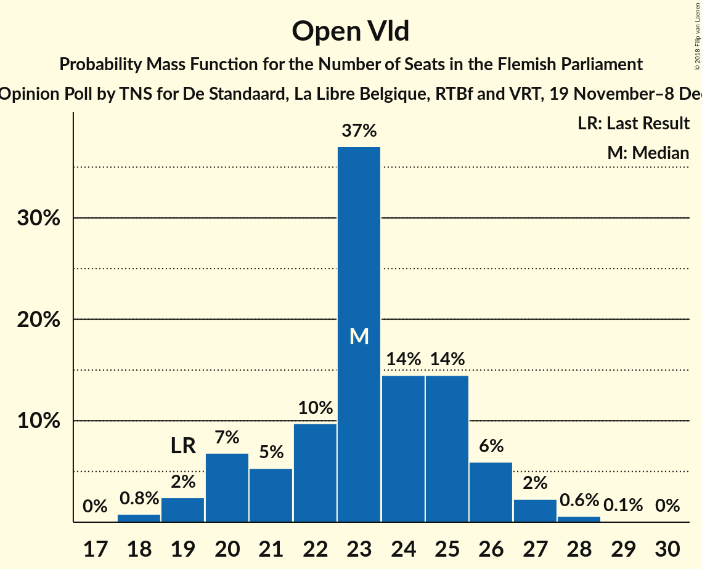

| Number of Seats | Probability | Accumulated | Special Marks |
|:---------------:|:-----------:|:-----------:|:-------------:|
| 18 | 0.3% | 100% |  |
| 19 | 3% | 99.7% | Last Result |
| 20 | 0.3% | 96% |  |
| 21 | 0% | 96% |  |
| 22 | 0.2% | 96% |  |
| 23 | 9% | 96% |  |
| 24 | 32% | 87% |  |
| 25 | 2% | 55% |  |
| 26 | 53% | 53% | Median |
| 27 | 0.4% | 0.4% |  |
| 28 | 0% | 0% |  |

### Groen

*For a full overview of the results for this party, see the [Groen](party-groen.html) page.*

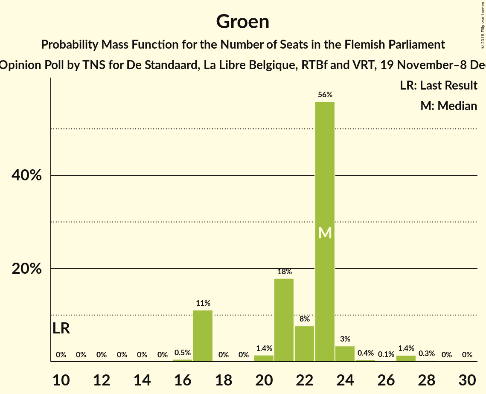

| Number of Seats | Probability | Accumulated | Special Marks |
|:---------------:|:-----------:|:-----------:|:-------------:|
| 10 | 0% | 100% | Last Result |
| 11 | 0% | 100% |  |
| 12 | 0% | 100% |  |
| 13 | 0% | 100% |  |
| 14 | 0% | 100% |  |
| 15 | 0% | 100% |  |
| 16 | 0.5% | 100% |  |
| 17 | 11% | 99.5% |  |
| 18 | 0% | 88% |  |
| 19 | 0% | 88% |  |
| 20 | 1.4% | 88% |  |
| 21 | 18% | 87% |  |
| 22 | 8% | 69% |  |
| 23 | 56% | 61% | Median |
| 24 | 3% | 6% |  |
| 25 | 0.4% | 2% |  |
| 26 | 0.1% | 2% |  |
| 27 | 1.4% | 2% |  |
| 28 | 0.3% | 0.3% |  |
| 29 | 0% | 0% |  |

### sp.a

*For a full overview of the results for this party, see the [sp.a](party-spa.html) page.*

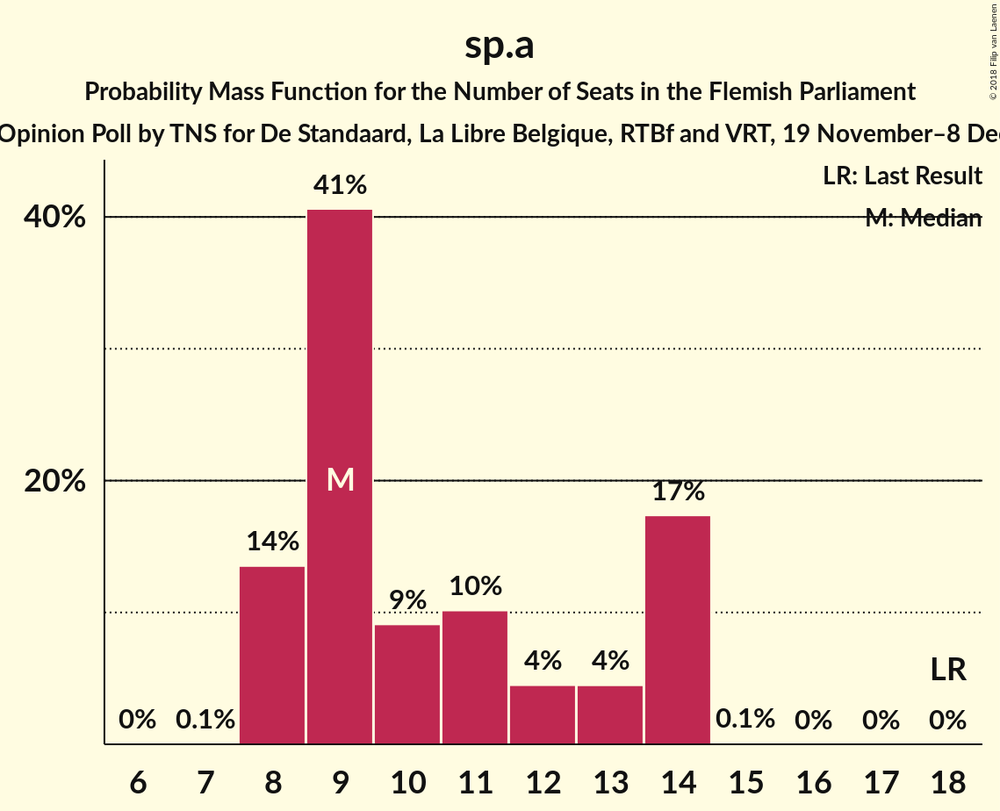

| Number of Seats | Probability | Accumulated | Special Marks |
|:---------------:|:-----------:|:-----------:|:-------------:|
| 8 | 2% | 100% |  |
| 9 | 15% | 98% |  |
| 10 | 0.7% | 83% |  |
| 11 | 0% | 83% |  |
| 12 | 0% | 83% |  |
| 13 | 0% | 83% |  |
| 14 | 82% | 83% | Median |
| 15 | 0.2% | 0.2% |  |
| 16 | 0% | 0% |  |
| 17 | 0% | 0% |  |
| 18 | 0% | 0% | Last Result |

### Vlaams Belang

*For a full overview of the results for this party, see the [Vlaams Belang](party-vlaamsbelang.html) page.*

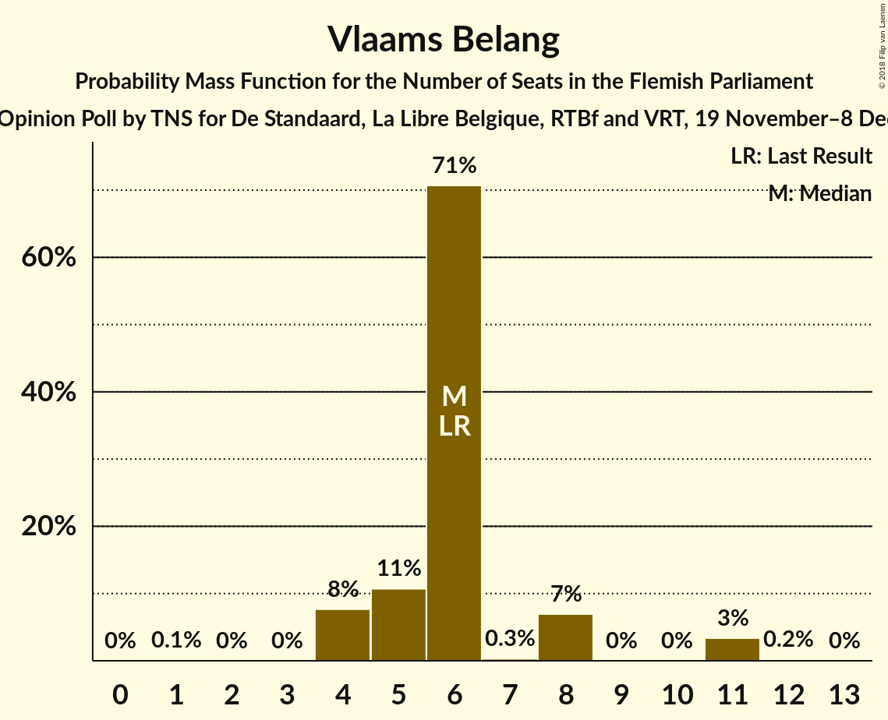

| Number of Seats | Probability | Accumulated | Special Marks |
|:---------------:|:-----------:|:-----------:|:-------------:|
| 1 | 0.1% | 100% |  |
| 2 | 0% | 99.9% |  |
| 3 | 0% | 99.9% |  |
| 4 | 8% | 99.9% |  |
| 5 | 11% | 92% |  |
| 6 | 71% | 82% | Last Result, Median |
| 7 | 0.3% | 11% |  |
| 8 | 7% | 11% |  |
| 9 | 0% | 4% |  |
| 10 | 0% | 4% |  |
| 11 | 3% | 4% |  |
| 12 | 0.2% | 0.2% |  |
| 13 | 0% | 0% |  |

### PVDA

*For a full overview of the results for this party, see the [PVDA](party-pvda.html) page.*

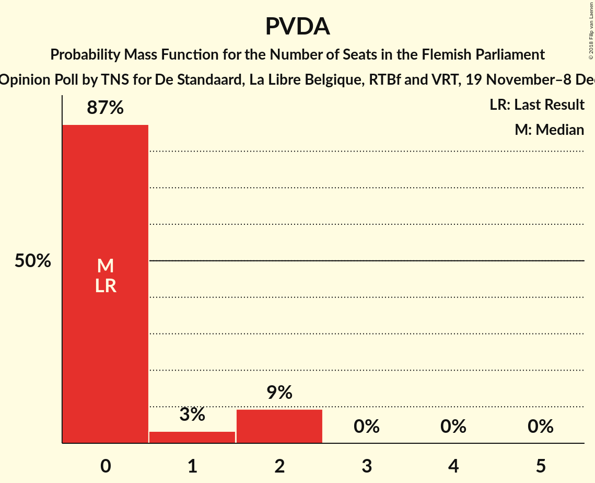

| Number of Seats | Probability | Accumulated | Special Marks |
|:---------------:|:-----------:|:-----------:|:-------------:|
| 0 | 87% | 100% | Last Result, Median |
| 1 | 3% | 13% |  |
| 2 | 9% | 9% |  |
| 3 | 0% | 0% |  |

## Coalitions

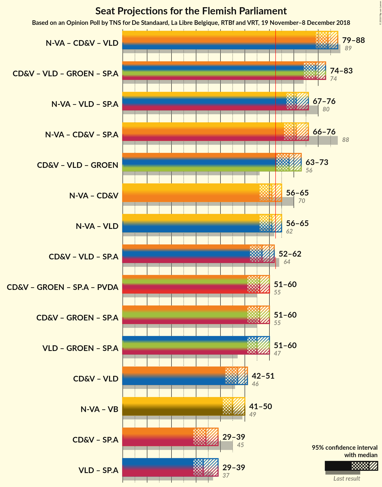

### Confidence Intervals

| Coalition | Last Result | Median | Majority? | 80% Confidence Interval | 90% Confidence Interval | 95% Confidence Interval | 99% Confidence Interval |
|:---------:|:-----------:|:------:|:---------:|:-----------------------:|:-----------------------:|:-----------------------:|:-----------------------:|
| N-VA – CD&V – Open Vld | 89 | 81 | 100% | 81–88 | 81–88 | 81–88 | 80–88 |
| CD&V – Open Vld – Groen – sp.a | 74 | 83 | 100% | 81–85 | 80–85 | 72–85 | 72–85 |
| N-VA – CD&V – sp.a | 88 | 69 | 100% | 69–78 | 69–78 | 67–78 | 64–78 |
| N-VA – Open Vld – sp.a | 80 | 75 | 99.8% | 68–76 | 68–76 | 67–76 | 67–76 |
| CD&V – Open Vld – Groen | 56 | 69 | 100% | 67–72 | 66–73 | 63–73 | 63–74 |
| N-VA – CD&V | 70 | 55 | 20% | 55–64 | 55–64 | 55–64 | 55–64 |
| CD&V – Open Vld – sp.a | 64 | 60 | 28% | 59–64 | 55–64 | 49–64 | 49–64 |
| Open Vld – Groen – sp.a | 47 | 63 | 53% | 54–63 | 54–63 | 51–63 | 50–63 |
| N-VA – Open Vld | 62 | 61 | 1.3% | 57–62 | 57–62 | 57–62 | 56–63 |
| CD&V – Groen – sp.a – PVDA | 55 | 57 | 0.1% | 57–61 | 57–61 | 53–61 | 53–61 |
| CD&V – Groen – sp.a | 55 | 57 | 0.1% | 57–61 | 57–61 | 53–61 | 51–61 |
| N-VA – Vlaams Belang | 49 | 41 | 0% | 39–43 | 39–44 | 39–52 | 39–52 |
| CD&V – Open Vld | 46 | 46 | 0% | 46–50 | 46–51 | 40–51 | 40–51 |
| CD&V – sp.a | 45 | 34 | 0% | 34–40 | 30–40 | 30–40 | 30–40 |
| Open Vld – sp.a | 37 | 40 | 0% | 32–40 | 32–40 | 28–40 | 28–40 |

### N-VA – CD&V – Open Vld

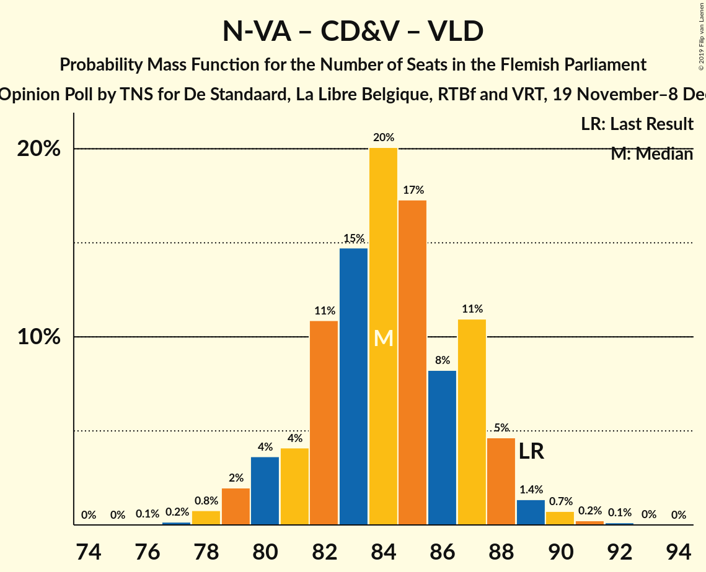

| Number of Seats | Probability | Accumulated | Special Marks |
|:---------------:|:-----------:|:-----------:|:-------------:|
| 76 | 0.1% | 100% |  |
| 77 | 0% | 99.8% |  |
| 78 | 0% | 99.8% |  |
| 79 | 0.2% | 99.8% |  |
| 80 | 1.2% | 99.7% |  |
| 81 | 57% | 98% | Median |
| 82 | 4% | 41% |  |
| 83 | 18% | 38% |  |
| 84 | 0.1% | 20% |  |
| 85 | 0% | 19% |  |
| 86 | 0% | 19% |  |
| 87 | 8% | 19% |  |
| 88 | 11% | 12% |  |
| 89 | 0% | 0.4% | Last Result |
| 90 | 0.1% | 0.4% |  |
| 91 | 0.4% | 0.4% |  |
| 92 | 0% | 0% |  |

### CD&V – Open Vld – Groen – sp.a

| Number of Seats | Probability | Accumulated | Special Marks |
|:---------------:|:-----------:|:-----------:|:-------------:|
| 72 | 3% | 100% |  |
| 73 | 0% | 97% |  |
| 74 | 0% | 97% | Last Result |
| 75 | 0.5% | 97% |  |
| 76 | 0.4% | 96% |  |
| 77 | 0% | 96% |  |
| 78 | 0.4% | 96% |  |
| 79 | 0.3% | 95% |  |
| 80 | 2% | 95% |  |
| 81 | 14% | 93% |  |
| 82 | 9% | 79% |  |
| 83 | 53% | 70% | Median |
| 84 | 0.1% | 18% |  |
| 85 | 18% | 18% |  |
| 86 | 0% | 0% |  |

### N-VA – CD&V – sp.a

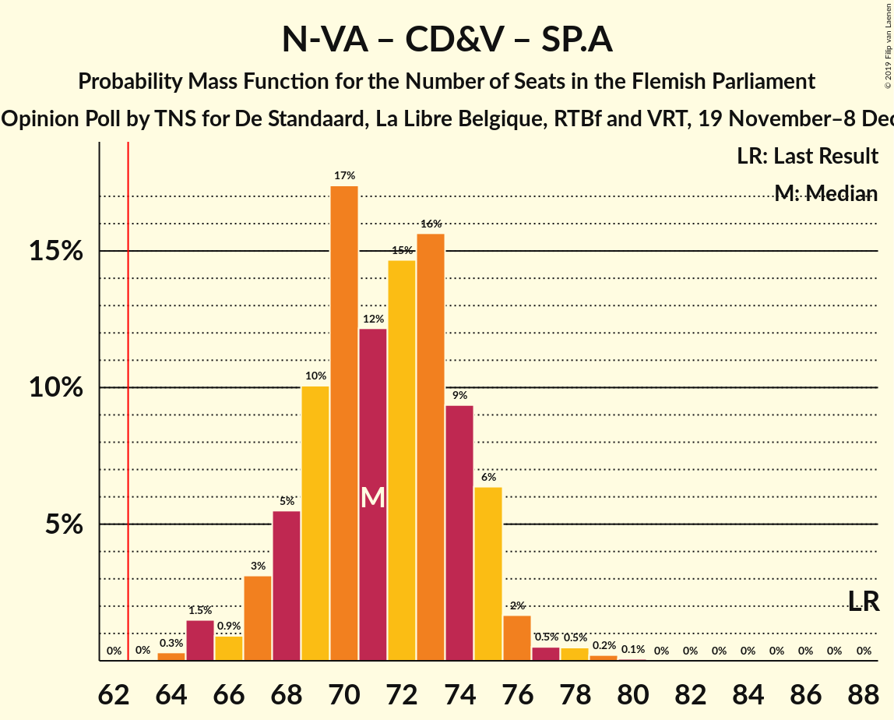

| Number of Seats | Probability | Accumulated | Special Marks |
|:---------------:|:-----------:|:-----------:|:-------------:|
| 64 | 1.3% | 100% |  |
| 65 | 0.5% | 98.6% |  |
| 66 | 0% | 98% |  |
| 67 | 3% | 98% |  |
| 68 | 0% | 95% |  |
| 69 | 53% | 95% | Median |
| 70 | 0.3% | 42% |  |
| 71 | 5% | 42% |  |
| 72 | 0.2% | 38% |  |
| 73 | 26% | 37% |  |
| 74 | 1.0% | 12% |  |
| 75 | 0% | 11% |  |
| 76 | 0% | 11% |  |
| 77 | 0% | 11% |  |
| 78 | 11% | 11% |  |
| 79 | 0% | 0.1% |  |
| 80 | 0.1% | 0.1% |  |
| 81 | 0% | 0% |  |
| 82 | 0% | 0% |  |
| 83 | 0% | 0% |  |
| 84 | 0% | 0% |  |
| 85 | 0% | 0% |  |
| 86 | 0% | 0% |  |
| 87 | 0% | 0% |  |
| 88 | 0% | 0% | Last Result |

### N-VA – Open Vld – sp.a

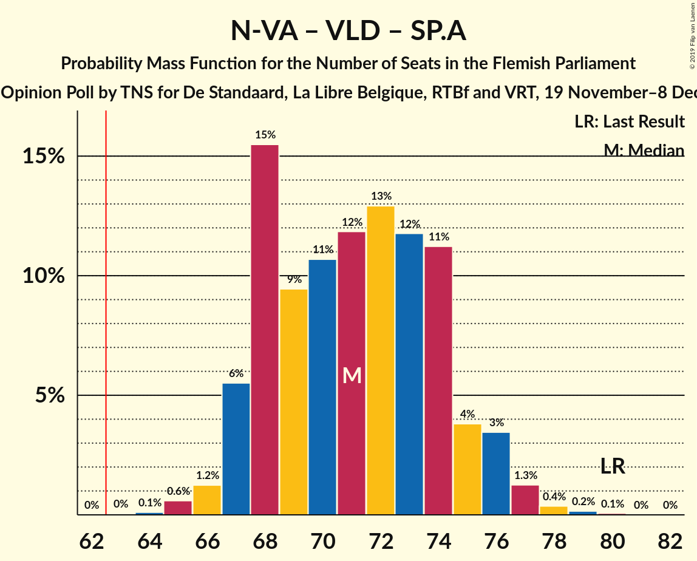

| Number of Seats | Probability | Accumulated | Special Marks |
|:---------------:|:-----------:|:-----------:|:-------------:|
| 61 | 0.2% | 100% |  |
| 62 | 0% | 99.8% |  |
| 63 | 0% | 99.8% | Majority |
| 64 | 0.1% | 99.8% |  |
| 65 | 0.1% | 99.7% |  |
| 66 | 0% | 99.6% |  |
| 67 | 4% | 99.6% |  |
| 68 | 8% | 95% |  |
| 69 | 3% | 87% |  |
| 70 | 0.1% | 84% |  |
| 71 | 19% | 84% |  |
| 72 | 0.3% | 65% |  |
| 73 | 0.9% | 64% |  |
| 74 | 0% | 63% |  |
| 75 | 53% | 63% | Median |
| 76 | 11% | 11% |  |
| 77 | 0% | 0% |  |
| 78 | 0% | 0% |  |
| 79 | 0% | 0% |  |
| 80 | 0% | 0% | Last Result |

### CD&V – Open Vld – Groen

| Number of Seats | Probability | Accumulated | Special Marks |
|:---------------:|:-----------:|:-----------:|:-------------:|
| 56 | 0% | 100% | Last Result |
| 57 | 0% | 100% |  |
| 58 | 0% | 100% |  |
| 59 | 0% | 100% |  |
| 60 | 0% | 100% |  |
| 61 | 0% | 100% |  |
| 62 | 0% | 100% |  |
| 63 | 3% | 100% | Majority |
| 64 | 0.3% | 97% |  |
| 65 | 0.5% | 96% |  |
| 66 | 1.2% | 96% |  |
| 67 | 11% | 95% |  |
| 68 | 0.4% | 84% |  |
| 69 | 53% | 84% | Median |
| 70 | 0.6% | 31% |  |
| 71 | 18% | 30% |  |
| 72 | 4% | 13% |  |
| 73 | 8% | 9% |  |
| 74 | 1.3% | 1.4% |  |
| 75 | 0.1% | 0.1% |  |
| 76 | 0% | 0% |  |

### N-VA – CD&V

| Number of Seats | Probability | Accumulated | Special Marks |
|:---------------:|:-----------:|:-----------:|:-------------:|
| 55 | 53% | 100% | Median |
| 56 | 2% | 47% |  |
| 57 | 1.4% | 46% |  |
| 58 | 3% | 44% |  |
| 59 | 18% | 41% |  |
| 60 | 0% | 23% |  |
| 61 | 0% | 23% |  |
| 62 | 4% | 23% |  |
| 63 | 0.1% | 20% | Majority |
| 64 | 19% | 20% |  |
| 65 | 0% | 0.4% |  |
| 66 | 0.4% | 0.4% |  |
| 67 | 0% | 0% |  |
| 68 | 0% | 0% |  |
| 69 | 0% | 0% |  |
| 70 | 0% | 0% | Last Result |

### CD&V – Open Vld – sp.a

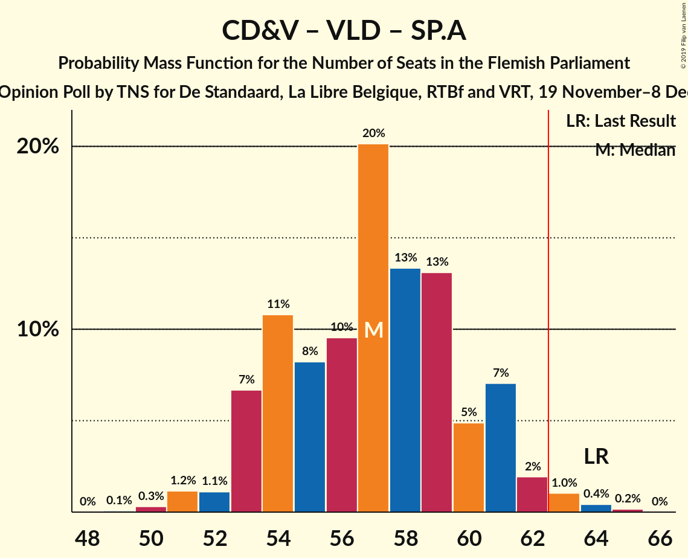

| Number of Seats | Probability | Accumulated | Special Marks |
|:---------------:|:-----------:|:-----------:|:-------------:|
| 49 | 3% | 100% |  |
| 50 | 0.3% | 97% |  |
| 51 | 0% | 96% |  |
| 52 | 0.1% | 96% |  |
| 53 | 0% | 96% |  |
| 54 | 0.1% | 96% |  |
| 55 | 1.4% | 96% |  |
| 56 | 0.5% | 95% |  |
| 57 | 3% | 94% |  |
| 58 | 0% | 91% |  |
| 59 | 1.2% | 91% |  |
| 60 | 61% | 90% | Median |
| 61 | 0% | 28% |  |
| 62 | 0.1% | 28% |  |
| 63 | 0% | 28% | Majority |
| 64 | 28% | 28% | Last Result |
| 65 | 0% | 0% |  |

### Open Vld – Groen – sp.a

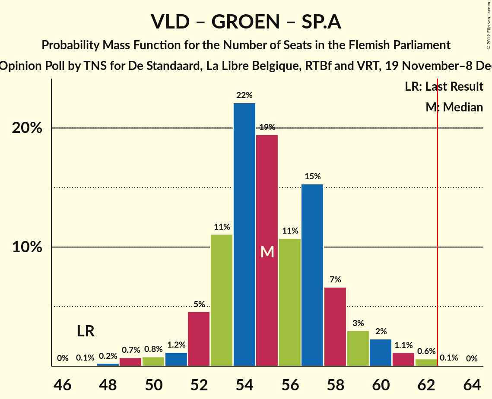

| Number of Seats | Probability | Accumulated | Special Marks |
|:---------------:|:-----------:|:-----------:|:-------------:|
| 47 | 0% | 100% | Last Result |
| 48 | 0% | 100% |  |
| 49 | 0% | 100% |  |
| 50 | 0.9% | 100% |  |
| 51 | 3% | 99.1% |  |
| 52 | 0.1% | 96% |  |
| 53 | 0% | 96% |  |
| 54 | 8% | 96% |  |
| 55 | 11% | 88% |  |
| 56 | 0.3% | 77% |  |
| 57 | 4% | 77% |  |
| 58 | 0.3% | 72% |  |
| 59 | 18% | 72% |  |
| 60 | 1.4% | 54% |  |
| 61 | 0.3% | 53% |  |
| 62 | 0% | 53% |  |
| 63 | 53% | 53% | Median, Majority |
| 64 | 0% | 0% |  |

### N-VA – Open Vld

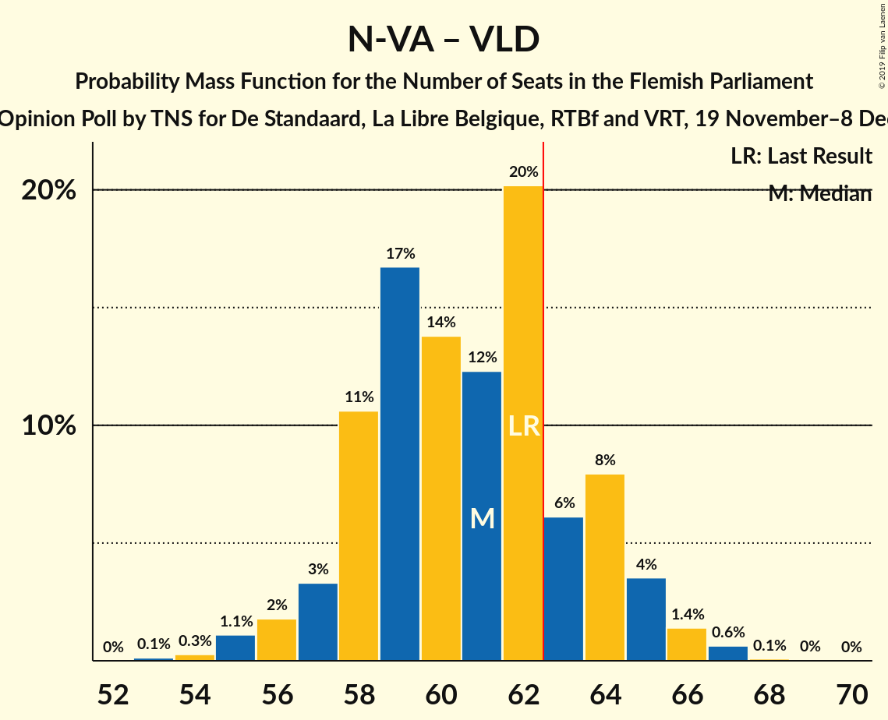

| Number of Seats | Probability | Accumulated | Special Marks |
|:---------------:|:-----------:|:-----------:|:-------------:|
| 53 | 0.2% | 100% |  |
| 54 | 0.1% | 99.8% |  |
| 55 | 0.1% | 99.7% |  |
| 56 | 0.2% | 99.6% |  |
| 57 | 19% | 99.4% |  |
| 58 | 3% | 81% |  |
| 59 | 9% | 77% |  |
| 60 | 4% | 68% |  |
| 61 | 53% | 65% | Median |
| 62 | 11% | 12% | Last Result |
| 63 | 0.8% | 1.3% | Majority |
| 64 | 0% | 0.5% |  |
| 65 | 0.4% | 0.5% |  |
| 66 | 0.1% | 0.1% |  |
| 67 | 0% | 0% |  |

### CD&V – Groen – sp.a – PVDA

| Number of Seats | Probability | Accumulated | Special Marks |
|:---------------:|:-----------:|:-----------:|:-------------:|
| 51 | 0.4% | 100% |  |
| 52 | 0% | 99.6% |  |
| 53 | 4% | 99.6% |  |
| 54 | 0.3% | 96% |  |
| 55 | 0% | 95% | Last Result |
| 56 | 0.2% | 95% |  |
| 57 | 65% | 95% | Median |
| 58 | 3% | 30% |  |
| 59 | 1.4% | 27% |  |
| 60 | 0.1% | 26% |  |
| 61 | 25% | 25% |  |
| 62 | 0% | 0.1% |  |
| 63 | 0% | 0.1% | Majority |
| 64 | 0% | 0.1% |  |
| 65 | 0% | 0.1% |  |
| 66 | 0.1% | 0.1% |  |
| 67 | 0% | 0% |  |

### CD&V – Groen – sp.a

| Number of Seats | Probability | Accumulated | Special Marks |
|:---------------:|:-----------:|:-----------:|:-------------:|
| 51 | 0.9% | 100% |  |
| 52 | 0% | 99.1% |  |
| 53 | 3% | 99.1% |  |
| 54 | 0.3% | 96% |  |
| 55 | 0% | 95% | Last Result |
| 56 | 0.2% | 95% |  |
| 57 | 69% | 95% | Median |
| 58 | 0.5% | 26% |  |
| 59 | 8% | 26% |  |
| 60 | 0.1% | 18% |  |
| 61 | 18% | 18% |  |
| 62 | 0% | 0.1% |  |
| 63 | 0% | 0.1% | Majority |
| 64 | 0% | 0.1% |  |
| 65 | 0% | 0.1% |  |
| 66 | 0.1% | 0.1% |  |
| 67 | 0% | 0% |  |

### N-VA – Vlaams Belang

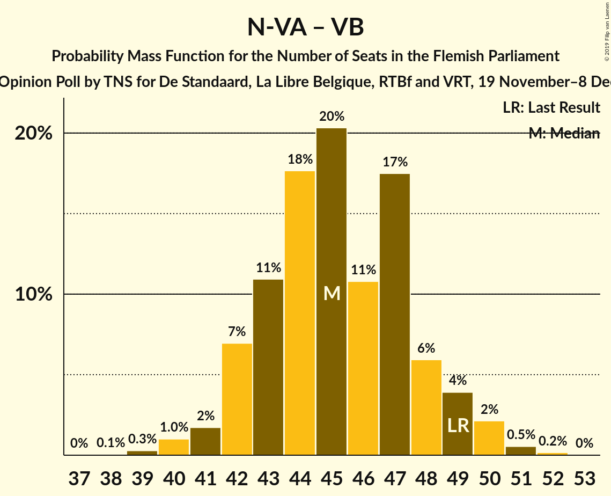

| Number of Seats | Probability | Accumulated | Special Marks |
|:---------------:|:-----------:|:-----------:|:-------------:|
| 39 | 18% | 100% |  |
| 40 | 8% | 82% |  |
| 41 | 53% | 75% | Median |
| 42 | 6% | 22% |  |
| 43 | 11% | 16% |  |
| 44 | 0.2% | 5% |  |
| 45 | 0.3% | 5% |  |
| 46 | 0.4% | 5% |  |
| 47 | 0.5% | 4% |  |
| 48 | 0.4% | 4% |  |
| 49 | 0% | 3% | Last Result |
| 50 | 0% | 3% |  |
| 51 | 0% | 3% |  |
| 52 | 3% | 3% |  |
| 53 | 0% | 0% |  |

### CD&V – Open Vld

| Number of Seats | Probability | Accumulated | Special Marks |
|:---------------:|:-----------:|:-----------:|:-------------:|
| 38 | 0.1% | 100% |  |
| 39 | 0% | 99.9% |  |
| 40 | 3% | 99.9% |  |
| 41 | 0% | 97% |  |
| 42 | 0.3% | 97% |  |
| 43 | 0% | 96% |  |
| 44 | 0.2% | 96% |  |
| 45 | 0.1% | 96% |  |
| 46 | 54% | 96% | Last Result, Median |
| 47 | 2% | 42% |  |
| 48 | 3% | 41% |  |
| 49 | 0.7% | 37% |  |
| 50 | 28% | 36% |  |
| 51 | 8% | 8% |  |
| 52 | 0% | 0% |  |

### CD&V – sp.a

| Number of Seats | Probability | Accumulated | Special Marks |
|:---------------:|:-----------:|:-----------:|:-------------:|
| 29 | 0.3% | 100% |  |
| 30 | 5% | 99.7% |  |
| 31 | 0% | 95% |  |
| 32 | 0% | 95% |  |
| 33 | 3% | 95% |  |
| 34 | 53% | 92% | Median |
| 35 | 0.5% | 38% |  |
| 36 | 0.5% | 38% |  |
| 37 | 9% | 37% |  |
| 38 | 0% | 28% |  |
| 39 | 0% | 28% |  |
| 40 | 28% | 28% |  |
| 41 | 0% | 0.1% |  |
| 42 | 0% | 0.1% |  |
| 43 | 0% | 0.1% |  |
| 44 | 0.1% | 0.1% |  |
| 45 | 0% | 0% | Last Result |

### Open Vld – sp.a

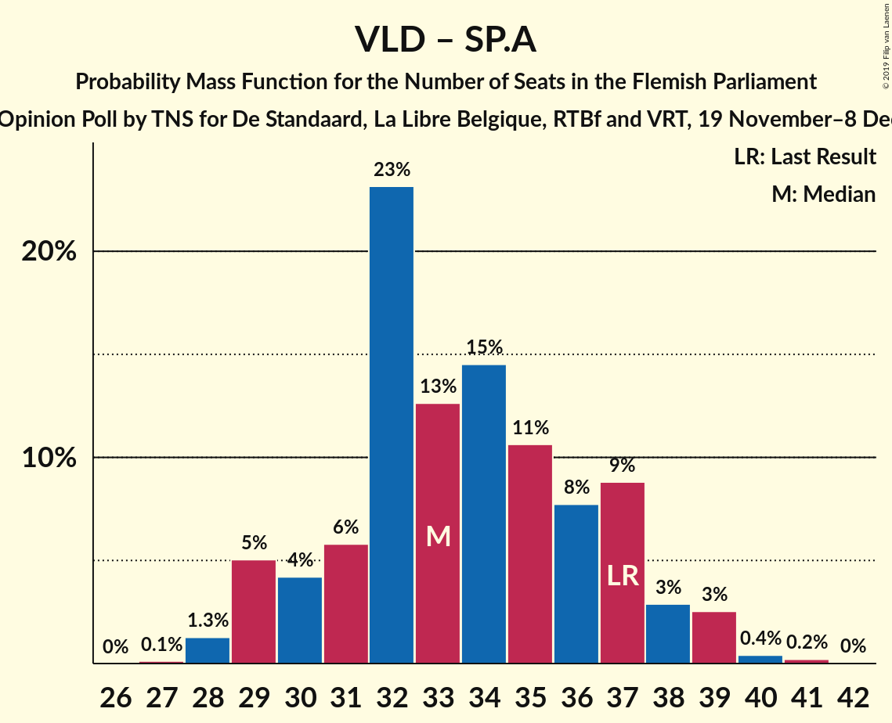

| Number of Seats | Probability | Accumulated | Special Marks |
|:---------------:|:-----------:|:-----------:|:-------------:|
| 27 | 0.1% | 100% |  |
| 28 | 4% | 99.9% |  |
| 29 | 0% | 96% |  |
| 30 | 0.2% | 96% |  |
| 31 | 0% | 96% |  |
| 32 | 8% | 96% |  |
| 33 | 5% | 88% |  |
| 34 | 0.5% | 83% |  |
| 35 | 0% | 83% |  |
| 36 | 0.4% | 83% |  |
| 37 | 1.2% | 82% | Last Result |
| 38 | 29% | 81% |  |
| 39 | 0% | 53% |  |
| 40 | 53% | 53% | Median |
| 41 | 0% | 0% |  |

## Technical Information

### Opinion Poll

+ **Polling firm:** TNS
+ **Commissioner(s):** De Standaard, La Libre Belgique, RTBf and VRT
+ **Fieldwork period:** 19 November–8 December 2018

### Calculations

+ **Sample size:** 1038
+ **Simulations done:** 1,024
+ **Error estimate:** 4.05%

