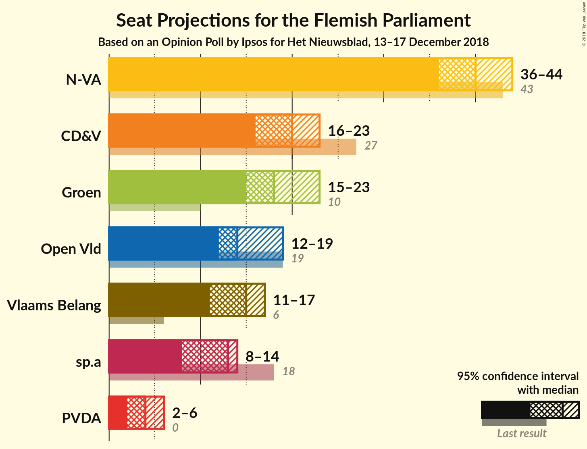
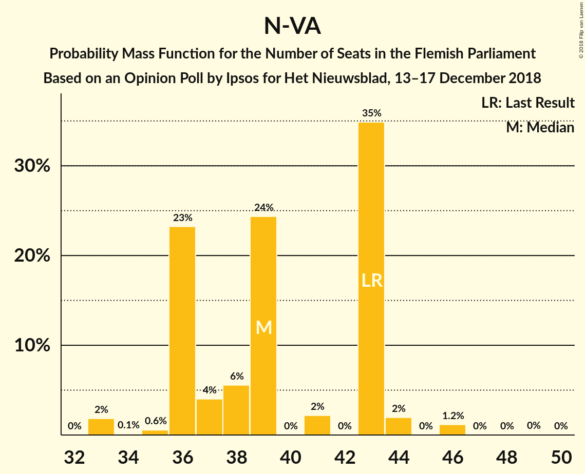
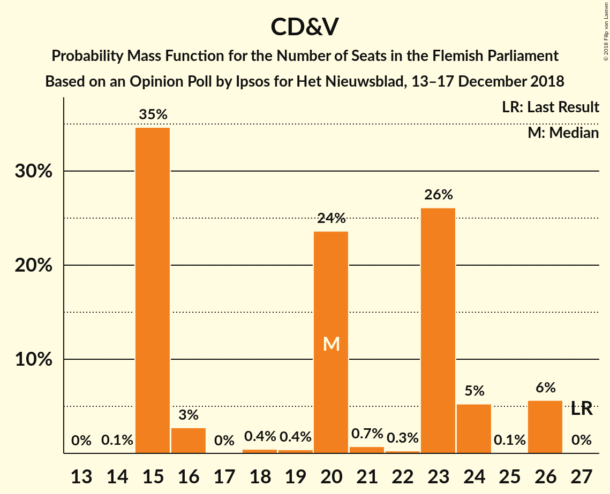
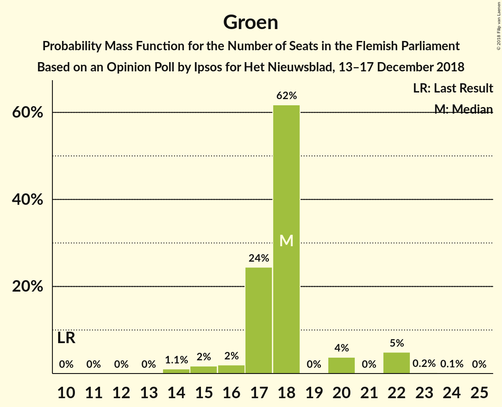
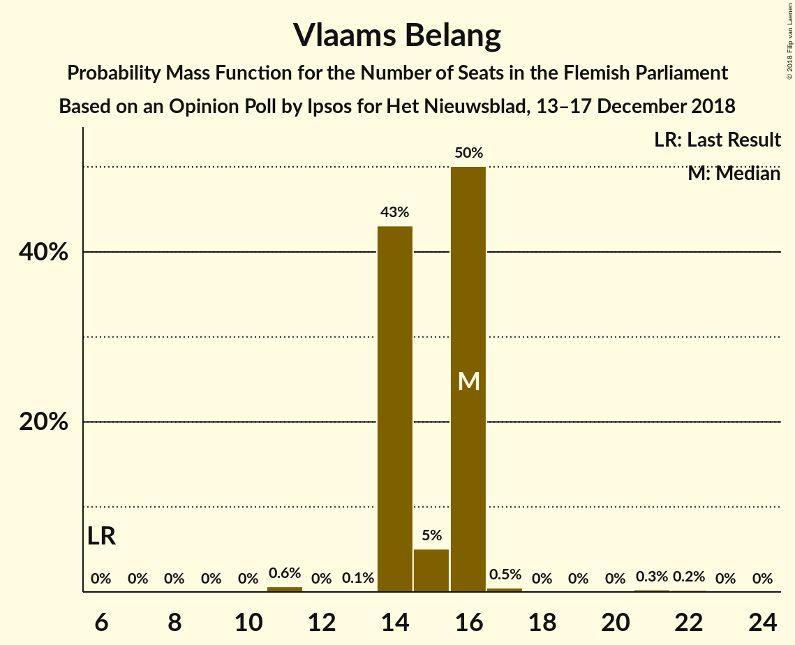
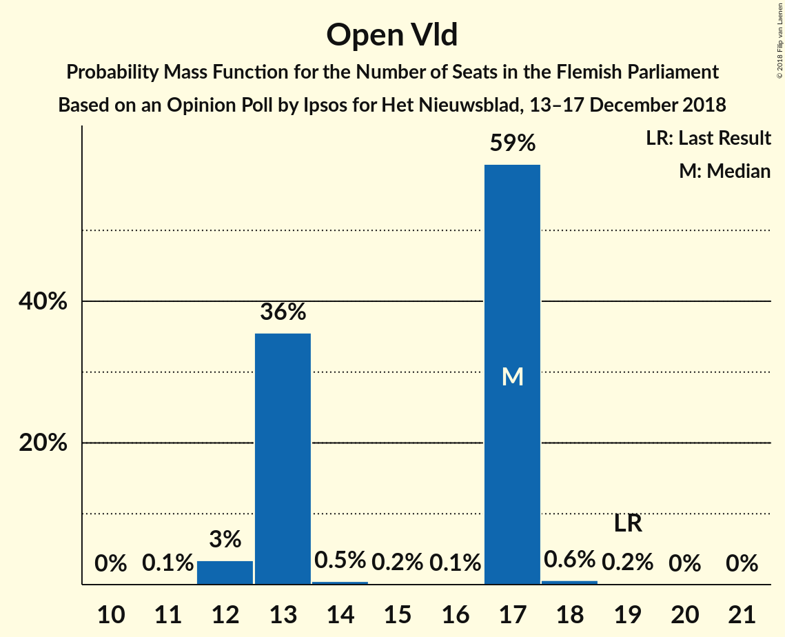
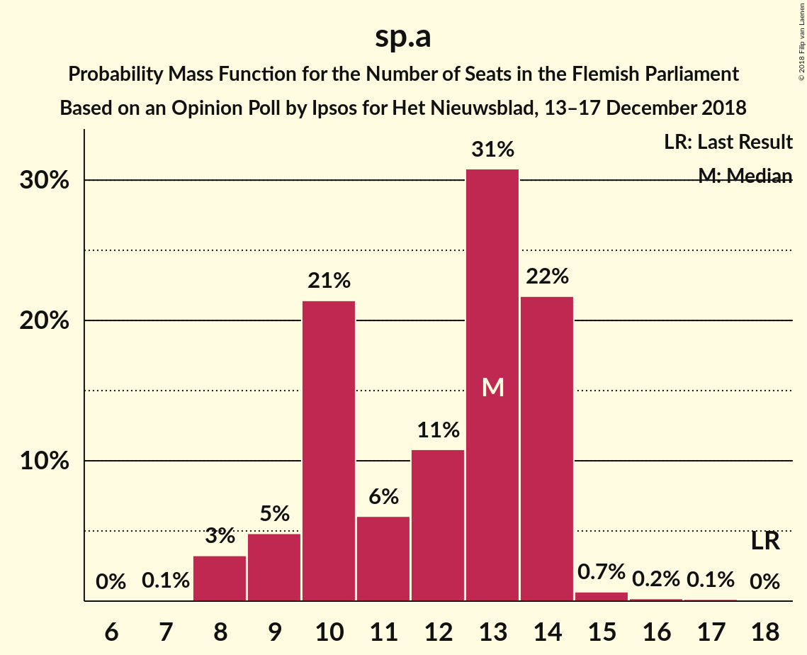
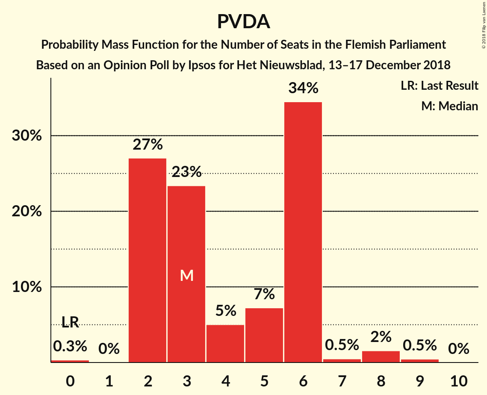
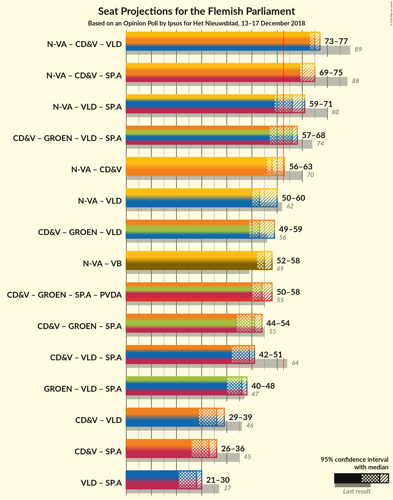

# Opinion Poll by Ipsos for Het Nieuwsblad, 13–17 December 2018

<a href="#voting-intentions">Voting Intentions</a> | <a href="#seats">Seats</a> | <a href="#coalitions">Coalitions</a> | <a href="#technical-information">Technical Information</a>

## Voting Intentions

### Confidence Intervals

| Party | Last Result | Poll Result | 80% Confidence Interval | 90% Confidence Interval | 95% Confidence Interval | 99% Confidence Interval |
|:-----:|:-----------:|:-----------:|:-----------------------:|:-----------------------:|:-----------------------:|:-----------------------:|
| N-VA | 31.9% | 30.2% | 28.4–32.1% |27.9–32.6% |27.4–33.1% |26.6–34.0% |
| CD&V | 20.5% | 15.7% | 14.3–17.3% |13.9–17.7% |13.6–18.1% |12.9–18.9% |
| Groen | 8.7% | 13.8% | 12.5–15.3% |12.1–15.7% |11.8–16.1% |11.2–16.8% |
| Vlaams Belang | 5.9% | 12.0% | 10.8–13.4% |10.4–13.8% |10.1–14.2% |9.6–14.9% |
| Open Vld | 14.1% | 11.6% | 10.4–13.0% |10.0–13.4% |9.8–13.7% |9.2–14.4% |
| sp.a | 14.0% | 9.7% | 8.6–11.0% |8.3–11.4% |8.0–11.7% |7.5–12.3% |
| PVDA | 2.5% | 5.5% | 4.7–6.5% |4.4–6.8% |4.3–7.1% |3.9–7.6% |

*Note:* The poll result column reflects the actual value used in the calculations. Published results may vary slightly, and in addition be rounded to fewer digits.

## Seats

### Confidence Intervals

| Party | Last Result | Median | 80% Confidence Interval | 90% Confidence Interval | 95% Confidence Interval | 99% Confidence Interval |
|:-----:|:-----------:|:------:|:-----------------------:|:-----------------------:|:-----------------------:|:-----------------------:|
| <a href="#n-va">N-VA</a> | 43 | 39 | 36–43 |36–43 |35–44 |33–46 |
| <a href="#cd&v">CD&V</a> | 27 | 20 | 15–24 |15–26 |15–26 |15–26 |
| <a href="#groen">Groen</a> | 10 | 18 | 17–18 |17–22 |15–22 |14–22 |
| <a href="#vlaams-belang">Vlaams Belang</a> | 6 | 16 | 14–16 |14–16 |14–16 |11–20 |
| <a href="#open-vld">Open Vld</a> | 19 | 17 | 13–17 |13–17 |12–17 |12–18 |
| <a href="#sp.a">sp.a</a> | 18 | 13 | 9–13 |8–13 |8–14 |8–15 |
| <a href="#pvda">PVDA</a> | 0 | 3 | 2–6 |2–6 |2–7 |2–8 |

### N-VA

*For a full overview of the results for this party, see the [N-VA](party-n-va.html) page.*

| Number of Seats | Probability | Accumulated | Special Marks |
|:---------------:|:-----------:|:-----------:|:-------------:|
| 33 | 2% | 100% |  |
| 34 | 0.1% | 98% |  |
| 35 | 0.6% | 98% |  |
| 36 | 23% | 97% |  |
| 37 | 4% | 74% |  |
| 38 | 6% | 70% |  |
| 39 | 24% | 65% | Median |
| 40 | 0% | 40% |  |
| 41 | 2% | 40% |  |
| 42 | 0% | 38% |  |
| 43 | 35% | 38% | Last Result |
| 44 | 2% | 3% |  |
| 45 | 0% | 1.2% |  |
| 46 | 1.2% | 1.2% |  |
| 47 | 0% | 0.1% |  |
| 48 | 0% | 0.1% |  |
| 49 | 0% | 0.1% |  |
| 50 | 0% | 0% |  |

### CD&V

*For a full overview of the results for this party, see the [CD&V](party-cdv.html) page.*

| Number of Seats | Probability | Accumulated | Special Marks |
|:---------------:|:-----------:|:-----------:|:-------------:|
| 14 | 0.1% | 100% |  |
| 15 | 35% | 99.9% |  |
| 16 | 3% | 65% |  |
| 17 | 0% | 63% |  |
| 18 | 0.4% | 63% |  |
| 19 | 0.4% | 62% |  |
| 20 | 24% | 62% | Median |
| 21 | 0.7% | 38% |  |
| 22 | 0.3% | 37% |  |
| 23 | 26% | 37% |  |
| 24 | 5% | 11% |  |
| 25 | 0.1% | 6% |  |
| 26 | 6% | 6% |  |
| 27 | 0% | 0% | Last Result |

### Groen

*For a full overview of the results for this party, see the [Groen](party-groen.html) page.*

| Number of Seats | Probability | Accumulated | Special Marks |
|:---------------:|:-----------:|:-----------:|:-------------:|
| 10 | 0% | 100% | Last Result |
| 11 | 0% | 100% |  |
| 12 | 0% | 100% |  |
| 13 | 0% | 100% |  |
| 14 | 1.1% | 100% |  |
| 15 | 2% | 98.9% |  |
| 16 | 2% | 97% |  |
| 17 | 24% | 95% |  |
| 18 | 62% | 71% | Median |
| 19 | 0% | 9% |  |
| 20 | 4% | 9% |  |
| 21 | 0% | 5% |  |
| 22 | 5% | 5% |  |
| 23 | 0.2% | 0.3% |  |
| 24 | 0.1% | 0.1% |  |
| 25 | 0% | 0% |  |

### Vlaams Belang

*For a full overview of the results for this party, see the [Vlaams Belang](party-vlaamsbelang.html) page.*

| Number of Seats | Probability | Accumulated | Special Marks |
|:---------------:|:-----------:|:-----------:|:-------------:|
| 6 | 0% | 100% | Last Result |
| 7 | 0% | 100% |  |
| 8 | 0% | 100% |  |
| 9 | 0% | 100% |  |
| 10 | 0% | 100% |  |
| 11 | 0.6% | 100% |  |
| 12 | 0% | 99.3% |  |
| 13 | 0.1% | 99.3% |  |
| 14 | 43% | 99.2% |  |
| 15 | 5% | 56% |  |
| 16 | 50% | 51% | Median |
| 17 | 0.5% | 1.0% |  |
| 18 | 0% | 0.5% |  |
| 19 | 0% | 0.5% |  |
| 20 | 0% | 0.5% |  |
| 21 | 0.3% | 0.5% |  |
| 22 | 0.2% | 0.2% |  |
| 23 | 0% | 0% |  |

### Open Vld

*For a full overview of the results for this party, see the [Open Vld](party-openvld.html) page.*

| Number of Seats | Probability | Accumulated | Special Marks |
|:---------------:|:-----------:|:-----------:|:-------------:|
| 11 | 0.1% | 100% |  |
| 12 | 3% | 99.9% |  |
| 13 | 36% | 96% |  |
| 14 | 0.5% | 61% |  |
| 15 | 0.2% | 60% |  |
| 16 | 0.1% | 60% |  |
| 17 | 59% | 60% | Median |
| 18 | 0.6% | 0.9% |  |
| 19 | 0.2% | 0.2% | Last Result |
| 20 | 0% | 0.1% |  |
| 21 | 0% | 0% |  |

### sp.a

*For a full overview of the results for this party, see the [sp.a](party-spa.html) page.*

| Number of Seats | Probability | Accumulated | Special Marks |
|:---------------:|:-----------:|:-----------:|:-------------:|
| 8 | 8% | 100% |  |
| 9 | 4% | 92% |  |
| 10 | 1.1% | 88% |  |
| 11 | 34% | 87% |  |
| 12 | 0% | 52% |  |
| 13 | 49% | 52% | Median |
| 14 | 2% | 3% |  |
| 15 | 0.5% | 0.6% |  |
| 16 | 0% | 0.1% |  |
| 17 | 0.1% | 0.1% |  |
| 18 | 0% | 0% | Last Result |

### PVDA

*For a full overview of the results for this party, see the [PVDA](party-pvda.html) page.*

| Number of Seats | Probability | Accumulated | Special Marks |
|:---------------:|:-----------:|:-----------:|:-------------:|
| 0 | 0.3% | 100% | Last Result |
| 1 | 0% | 99.7% |  |
| 2 | 27% | 99.7% |  |
| 3 | 23% | 73% | Median |
| 4 | 5% | 49% |  |
| 5 | 7% | 44% |  |
| 6 | 34% | 37% |  |
| 7 | 0.5% | 3% |  |
| 8 | 2% | 2% |  |
| 9 | 0.5% | 0.5% |  |
| 10 | 0% | 0% |  |

## Coalitions

### Confidence Intervals

| Coalition | Last Result | Median | Majority? | 80% Confidence Interval | 90% Confidence Interval | 95% Confidence Interval | 99% Confidence Interval |
|:---------:|:-----------:|:------:|:---------:|:-----------------------:|:-----------------------:|:-----------------------:|:-----------------------:|
| N-VA – CD&V – Open Vld | 89 | 75 | 100% | 73–75 | 73–76 | 73–77 | 70–79 |
| N-VA – CD&V – sp.a | 88 | 69 | 100% | 69–75 | 69–75 | 69–75 | 68–76 |
| N-VA – Open Vld – sp.a | 80 | 66 | 89% | 61–71 | 59–71 | 59–71 | 59–72 |
| CD&V – Groen – Open Vld – sp.a | 74 | 66 | 61% | 61–68 | 61–68 | 57–68 | 57–69 |
| N-VA – CD&V | 70 | 58 | 7% | 56–62 | 56–63 | 56–63 | 56–67 |
| N-VA – Open Vld | 62 | 53 | 0% | 51–60 | 50–60 | 50–60 | 48–60 |
| CD&V – Groen – Open Vld | 56 | 53 | 0% | 50–57 | 50–59 | 49–59 | 43–59 |
| N-VA – Vlaams Belang | 49 | 55 | 0.1% | 52–57 | 52–57 | 52–58 | 49–61 |
| CD&V – Groen – sp.a – PVDA | 55 | 54 | 0.2% | 50–57 | 50–58 | 50–58 | 50–58 |
| CD&V – Groen – sp.a | 55 | 51 | 0% | 44–53 | 44–54 | 44–54 | 43–54 |
| CD&V – Open Vld – sp.a | 64 | 49 | 0% | 43–50 | 43–50 | 42–51 | 37–53 |
| Groen – Open Vld – sp.a | 47 | 46 | 0% | 42–48 | 40–48 | 40–48 | 40–48 |
| CD&V – Open Vld | 46 | 36 | 0% | 32–37 | 32–39 | 29–39 | 28–40 |
| CD&V – sp.a | 45 | 33 | 0% | 26–36 | 26–36 | 26–36 | 24–38 |
| Open Vld – sp.a | 37 | 28 | 0% | 22–30 | 21–30 | 21–30 | 20–30 |

### N-VA – CD&V – Open Vld

| Number of Seats | Probability | Accumulated | Special Marks |
|:---------------:|:-----------:|:-----------:|:-------------:|
| 65 | 0% | 100% |  |
| 66 | 0% | 99.9% |  |
| 67 | 0% | 99.9% |  |
| 68 | 0.1% | 99.9% |  |
| 69 | 0% | 99.8% |  |
| 70 | 0.4% | 99.8% |  |
| 71 | 0% | 99.4% |  |
| 72 | 0.9% | 99.4% |  |
| 73 | 27% | 98% |  |
| 74 | 1.4% | 72% |  |
| 75 | 64% | 71% |  |
| 76 | 4% | 7% | Median |
| 77 | 0.4% | 3% |  |
| 78 | 0.1% | 2% |  |
| 79 | 2% | 2% |  |
| 80 | 0% | 0.4% |  |
| 81 | 0.4% | 0.4% |  |
| 82 | 0% | 0% |  |
| 83 | 0% | 0% |  |
| 84 | 0% | 0% |  |
| 85 | 0% | 0% |  |
| 86 | 0% | 0% |  |
| 87 | 0% | 0% |  |
| 88 | 0% | 0% |  |
| 89 | 0% | 0% | Last Result |

### N-VA – CD&V – sp.a

| Number of Seats | Probability | Accumulated | Special Marks |
|:---------------:|:-----------:|:-----------:|:-------------:|
| 64 | 0.1% | 100% |  |
| 65 | 0% | 99.9% |  |
| 66 | 0% | 99.8% |  |
| 67 | 0.1% | 99.8% |  |
| 68 | 2% | 99.7% |  |
| 69 | 59% | 98% |  |
| 70 | 5% | 38% |  |
| 71 | 0.1% | 33% |  |
| 72 | 4% | 33% | Median |
| 73 | 1.4% | 29% |  |
| 74 | 0.6% | 28% |  |
| 75 | 26% | 27% |  |
| 76 | 1.2% | 1.5% |  |
| 77 | 0.2% | 0.3% |  |
| 78 | 0% | 0% |  |
| 79 | 0% | 0% |  |
| 80 | 0% | 0% |  |
| 81 | 0% | 0% |  |
| 82 | 0% | 0% |  |
| 83 | 0% | 0% |  |
| 84 | 0% | 0% |  |
| 85 | 0% | 0% |  |
| 86 | 0% | 0% |  |
| 87 | 0% | 0% |  |
| 88 | 0% | 0% | Last Result |

### N-VA – Open Vld – sp.a

| Number of Seats | Probability | Accumulated | Special Marks |
|:---------------:|:-----------:|:-----------:|:-------------:|
| 58 | 0% | 100% |  |
| 59 | 9% | 99.9% |  |
| 60 | 0% | 91% |  |
| 61 | 2% | 91% |  |
| 62 | 0.7% | 89% |  |
| 63 | 2% | 89% | Majority |
| 64 | 0% | 87% |  |
| 65 | 26% | 87% |  |
| 66 | 24% | 61% |  |
| 67 | 0.1% | 37% |  |
| 68 | 0.6% | 37% |  |
| 69 | 0% | 36% | Median |
| 70 | 0% | 36% |  |
| 71 | 35% | 36% |  |
| 72 | 2% | 2% |  |
| 73 | 0% | 0% |  |
| 74 | 0% | 0% |  |
| 75 | 0% | 0% |  |
| 76 | 0% | 0% |  |
| 77 | 0% | 0% |  |
| 78 | 0% | 0% |  |
| 79 | 0% | 0% |  |
| 80 | 0% | 0% | Last Result |

### CD&V – Groen – Open Vld – sp.a

| Number of Seats | Probability | Accumulated | Special Marks |
|:---------------:|:-----------:|:-----------:|:-------------:|
| 56 | 0% | 100% |  |
| 57 | 3% | 99.9% |  |
| 58 | 0% | 97% |  |
| 59 | 0.4% | 97% |  |
| 60 | 0.1% | 97% |  |
| 61 | 35% | 97% |  |
| 62 | 0.3% | 62% |  |
| 63 | 0.2% | 61% | Majority |
| 64 | 0.3% | 61% |  |
| 65 | 0% | 61% |  |
| 66 | 30% | 61% |  |
| 67 | 5% | 31% |  |
| 68 | 23% | 26% | Median |
| 69 | 2% | 2% |  |
| 70 | 0.1% | 0.5% |  |
| 71 | 0.2% | 0.4% |  |
| 72 | 0.2% | 0.3% |  |
| 73 | 0% | 0.1% |  |
| 74 | 0.1% | 0.1% | Last Result |
| 75 | 0% | 0% |  |

### N-VA – CD&V

| Number of Seats | Probability | Accumulated | Special Marks |
|:---------------:|:-----------:|:-----------:|:-------------:|
| 52 | 0% | 100% |  |
| 53 | 0% | 99.9% |  |
| 54 | 0.2% | 99.9% |  |
| 55 | 0.1% | 99.7% |  |
| 56 | 25% | 99.7% |  |
| 57 | 0.3% | 75% |  |
| 58 | 35% | 74% |  |
| 59 | 0.7% | 39% | Median |
| 60 | 2% | 39% |  |
| 61 | 0.2% | 37% |  |
| 62 | 30% | 37% |  |
| 63 | 4% | 7% | Majority |
| 64 | 0.4% | 2% |  |
| 65 | 0% | 2% |  |
| 66 | 0% | 2% |  |
| 67 | 2% | 2% |  |
| 68 | 0% | 0% |  |
| 69 | 0% | 0% |  |
| 70 | 0% | 0% | Last Result |

### N-VA – Open Vld

| Number of Seats | Probability | Accumulated | Special Marks |
|:---------------:|:-----------:|:-----------:|:-------------:|
| 47 | 0% | 100% |  |
| 48 | 0.4% | 99.9% |  |
| 49 | 0.3% | 99.5% |  |
| 50 | 6% | 99.2% |  |
| 51 | 5% | 94% |  |
| 52 | 24% | 88% |  |
| 53 | 25% | 64% |  |
| 54 | 0.4% | 39% |  |
| 55 | 0% | 38% |  |
| 56 | 0.7% | 38% | Median |
| 57 | 2% | 38% |  |
| 58 | 1.2% | 36% |  |
| 59 | 0% | 35% |  |
| 60 | 34% | 35% |  |
| 61 | 0% | 0.5% |  |
| 62 | 0.4% | 0.5% | Last Result |
| 63 | 0% | 0% | Majority |

### CD&V – Groen – Open Vld

| Number of Seats | Probability | Accumulated | Special Marks |
|:---------------:|:-----------:|:-----------:|:-------------:|
| 43 | 1.2% | 100% |  |
| 44 | 0% | 98.8% |  |
| 45 | 0.5% | 98.8% |  |
| 46 | 0.1% | 98% |  |
| 47 | 0% | 98% |  |
| 48 | 0% | 98% |  |
| 49 | 2% | 98% |  |
| 50 | 35% | 97% |  |
| 51 | 0.5% | 62% |  |
| 52 | 0.9% | 61% |  |
| 53 | 24% | 61% |  |
| 54 | 0.4% | 36% |  |
| 55 | 23% | 36% | Median |
| 56 | 2% | 13% | Last Result |
| 57 | 4% | 11% |  |
| 58 | 2% | 7% |  |
| 59 | 5% | 5% |  |
| 60 | 0.1% | 0.2% |  |
| 61 | 0% | 0.1% |  |
| 62 | 0% | 0.1% |  |
| 63 | 0% | 0% | Majority |

### N-VA – Vlaams Belang

| Number of Seats | Probability | Accumulated | Special Marks |
|:---------------:|:-----------:|:-----------:|:-------------:|
| 47 | 0.2% | 100% |  |
| 48 | 0.1% | 99.8% |  |
| 49 | 2% | 99.7% | Last Result |
| 50 | 0.2% | 98% |  |
| 51 | 0.1% | 98% |  |
| 52 | 32% | 98% |  |
| 53 | 0.1% | 66% |  |
| 54 | 0.5% | 66% |  |
| 55 | 27% | 65% | Median |
| 56 | 0.1% | 38% |  |
| 57 | 35% | 38% |  |
| 58 | 2% | 3% |  |
| 59 | 0.6% | 2% |  |
| 60 | 0% | 1.3% |  |
| 61 | 1.2% | 1.3% |  |
| 62 | 0% | 0.1% |  |
| 63 | 0% | 0.1% | Majority |
| 64 | 0.1% | 0.1% |  |
| 65 | 0% | 0% |  |

### CD&V – Groen – sp.a – PVDA

| Number of Seats | Probability | Accumulated | Special Marks |
|:---------------:|:-----------:|:-----------:|:-------------:|
| 46 | 0.1% | 100% |  |
| 47 | 0% | 99.9% |  |
| 48 | 0% | 99.9% |  |
| 49 | 0% | 99.9% |  |
| 50 | 36% | 99.9% |  |
| 51 | 0.6% | 64% |  |
| 52 | 2% | 63% |  |
| 53 | 0% | 61% |  |
| 54 | 23% | 61% | Median |
| 55 | 25% | 38% | Last Result |
| 56 | 2% | 13% |  |
| 57 | 2% | 11% |  |
| 58 | 9% | 9% |  |
| 59 | 0% | 0.3% |  |
| 60 | 0.1% | 0.3% |  |
| 61 | 0% | 0.2% |  |
| 62 | 0% | 0.2% |  |
| 63 | 0% | 0.2% | Majority |
| 64 | 0.2% | 0.2% |  |
| 65 | 0% | 0% |  |

### CD&V – Groen – sp.a

| Number of Seats | Probability | Accumulated | Special Marks |
|:---------------:|:-----------:|:-----------:|:-------------:|
| 42 | 0% | 100% |  |
| 43 | 0.5% | 99.9% |  |
| 44 | 36% | 99.5% |  |
| 45 | 1.2% | 63% |  |
| 46 | 0.4% | 62% |  |
| 47 | 0% | 62% |  |
| 48 | 0.4% | 62% |  |
| 49 | 0.5% | 61% |  |
| 50 | 0% | 61% |  |
| 51 | 23% | 61% | Median |
| 52 | 2% | 38% |  |
| 53 | 28% | 36% |  |
| 54 | 7% | 7% |  |
| 55 | 0% | 0.3% | Last Result |
| 56 | 0% | 0.3% |  |
| 57 | 0.1% | 0.3% |  |
| 58 | 0.1% | 0.2% |  |
| 59 | 0% | 0.2% |  |
| 60 | 0.2% | 0.2% |  |
| 61 | 0% | 0% |  |

### CD&V – Open Vld – sp.a

| Number of Seats | Probability | Accumulated | Special Marks |
|:---------------:|:-----------:|:-----------:|:-------------:|
| 37 | 2% | 100% |  |
| 38 | 0% | 98% |  |
| 39 | 0% | 98% |  |
| 40 | 0.1% | 98% |  |
| 41 | 0% | 98% |  |
| 42 | 1.2% | 98% |  |
| 43 | 34% | 97% |  |
| 44 | 0.6% | 63% |  |
| 45 | 5% | 62% |  |
| 46 | 2% | 57% |  |
| 47 | 0.4% | 55% |  |
| 48 | 4% | 54% |  |
| 49 | 24% | 50% |  |
| 50 | 23% | 26% | Median |
| 51 | 0.6% | 3% |  |
| 52 | 0.1% | 2% |  |
| 53 | 2% | 2% |  |
| 54 | 0.1% | 0.1% |  |
| 55 | 0% | 0% |  |
| 56 | 0% | 0% |  |
| 57 | 0% | 0% |  |
| 58 | 0% | 0% |  |
| 59 | 0% | 0% |  |
| 60 | 0% | 0% |  |
| 61 | 0% | 0% |  |
| 62 | 0% | 0% |  |
| 63 | 0% | 0% | Majority |
| 64 | 0% | 0% | Last Result |

### Groen – Open Vld – sp.a

| Number of Seats | Probability | Accumulated | Special Marks |
|:---------------:|:-----------:|:-----------:|:-------------:|
| 37 | 0.1% | 100% |  |
| 38 | 0% | 99.9% |  |
| 39 | 0% | 99.9% |  |
| 40 | 6% | 99.9% |  |
| 41 | 3% | 94% |  |
| 42 | 1.3% | 91% |  |
| 43 | 29% | 90% |  |
| 44 | 0% | 61% |  |
| 45 | 0.3% | 60% |  |
| 46 | 36% | 60% |  |
| 47 | 0.2% | 24% | Last Result |
| 48 | 23% | 24% | Median |
| 49 | 0% | 0.5% |  |
| 50 | 0.2% | 0.5% |  |
| 51 | 0.1% | 0.2% |  |
| 52 | 0.1% | 0.1% |  |
| 53 | 0% | 0.1% |  |
| 54 | 0.1% | 0.1% |  |
| 55 | 0% | 0% |  |

### CD&V – Open Vld

| Number of Seats | Probability | Accumulated | Special Marks |
|:---------------:|:-----------:|:-----------:|:-------------:|
| 26 | 0.1% | 100% |  |
| 27 | 0.1% | 99.9% |  |
| 28 | 1.2% | 99.8% |  |
| 29 | 2% | 98.6% |  |
| 30 | 0% | 97% |  |
| 31 | 0.4% | 97% |  |
| 32 | 34% | 97% |  |
| 33 | 0% | 62% |  |
| 34 | 0.7% | 62% |  |
| 35 | 0.4% | 61% |  |
| 36 | 24% | 61% |  |
| 37 | 28% | 37% | Median |
| 38 | 2% | 8% |  |
| 39 | 4% | 6% |  |
| 40 | 2% | 2% |  |
| 41 | 0.1% | 0.1% |  |
| 42 | 0% | 0% |  |
| 43 | 0% | 0% |  |
| 44 | 0% | 0% |  |
| 45 | 0% | 0% |  |
| 46 | 0% | 0% | Last Result |

### CD&V – sp.a

| Number of Seats | Probability | Accumulated | Special Marks |
|:---------------:|:-----------:|:-----------:|:-------------:|
| 24 | 2% | 100% |  |
| 25 | 0.1% | 98% |  |
| 26 | 34% | 98% |  |
| 27 | 0% | 64% |  |
| 28 | 0% | 64% |  |
| 29 | 0.5% | 64% |  |
| 30 | 1.5% | 63% |  |
| 31 | 0.4% | 62% |  |
| 32 | 5% | 61% |  |
| 33 | 23% | 56% | Median |
| 34 | 2% | 33% |  |
| 35 | 4% | 31% |  |
| 36 | 26% | 27% |  |
| 37 | 0.2% | 0.7% |  |
| 38 | 0.4% | 0.6% |  |
| 39 | 0.1% | 0.1% |  |
| 40 | 0% | 0% |  |
| 41 | 0% | 0% |  |
| 42 | 0% | 0% |  |
| 43 | 0% | 0% |  |
| 44 | 0% | 0% |  |
| 45 | 0% | 0% | Last Result |

### Open Vld – sp.a

| Number of Seats | Probability | Accumulated | Special Marks |
|:---------------:|:-----------:|:-----------:|:-------------:|
| 20 | 2% | 100% |  |
| 21 | 6% | 98% |  |
| 22 | 4% | 92% |  |
| 23 | 0.4% | 88% |  |
| 24 | 0.3% | 87% |  |
| 25 | 0% | 87% |  |
| 26 | 26% | 87% |  |
| 27 | 1.1% | 62% |  |
| 28 | 35% | 60% |  |
| 29 | 0% | 25% |  |
| 30 | 25% | 25% | Median |
| 31 | 0% | 0.3% |  |
| 32 | 0% | 0.3% |  |
| 33 | 0.2% | 0.3% |  |
| 34 | 0.1% | 0.1% |  |
| 35 | 0% | 0% |  |
| 36 | 0% | 0% |  |
| 37 | 0% | 0% | Last Result |

## Technical Information

### Opinion Poll

+ **Polling firm:** Ipsos
+ **Commissioner(s):** Het Nieuwsblad
+ **Fieldwork period:** 13–17 December 2018

### Calculations

+ **Sample size:** 1000
+ **Simulations done:** 1,024
+ **Error estimate:** 4.72%

