# Opinion Poll by TNS for De Standaard, La Libre Belgique, RTBf and VRT, 25 March–14 April 2019

<a href="#voting-intentions">Voting Intentions</a> | <a href="#seats">Seats</a> | <a href="#coalitions">Coalitions</a> | <a href="#technical-information">Technical Information</a>

## Voting Intentions

### Confidence Intervals

| Party | Last Result | Poll Result | 80% Confidence Interval | 90% Confidence Interval | 95% Confidence Interval | 99% Confidence Interval |
|:-----:|:-----------:|:-----------:|:-----------------------:|:-----------------------:|:-----------------------:|:-----------------------:|
| N-VA | 31.9% | 27.9% | 26.2–29.8% |25.7–30.3% |25.2–30.8% |24.4–31.7% |
| CD&V | 20.5% | 14.7% | 13.4–16.2% |13.0–16.7% |12.7–17.0% |12.0–17.8% |
| Groen | 8.7% | 14.6% | 13.3–16.1% |12.9–16.6% |12.6–16.9% |11.9–17.7% |
| Open Vld | 14.1% | 14.2% | 12.9–15.7% |12.5–16.1% |12.2–16.5% |11.6–17.3% |
| sp.a | 14.0% | 12.7% | 11.5–14.2% |11.1–14.6% |10.8–14.9% |10.2–15.7% |
| Vlaams Belang | 5.9% | 9.3% | 8.3–10.6% |8.0–11.0% |7.7–11.3% |7.2–11.9% |
| PVDA | 2.5% | 5.9% | 5.0–6.9% |4.8–7.2% |4.6–7.5% |4.2–8.0% |

*Note:* The poll result column reflects the actual value used in the calculations. Published results may vary slightly, and in addition be rounded to fewer digits.

## Seats

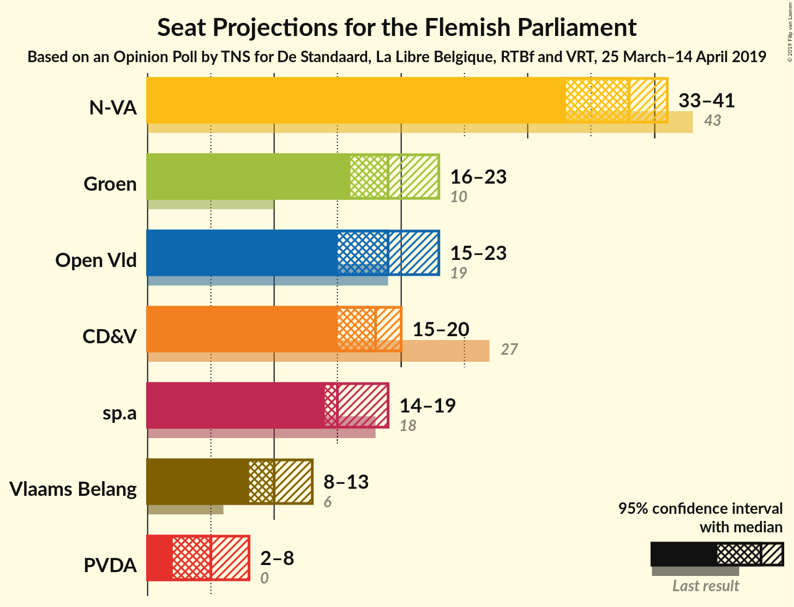

### Confidence Intervals

| Party | Last Result | Median | 80% Confidence Interval | 90% Confidence Interval | 95% Confidence Interval | 99% Confidence Interval |
|:-----:|:-----------:|:------:|:-----------------------:|:-----------------------:|:-----------------------:|:-----------------------:|
| <a href="#n-va">N-VA</a> | 43 | 38 | 35–40 |34–41 |33–41 |32–42 |
| <a href="#cd&v">CD&V</a> | 27 | 18 | 15–20 |15–20 |15–20 |14–22 |
| <a href="#groen">Groen</a> | 10 | 19 | 17–23 |17–23 |16–23 |15–24 |
| <a href="#open-vld">Open Vld</a> | 19 | 19 | 17–20 |16–21 |15–23 |13–24 |
| <a href="#sp.a">sp.a</a> | 18 | 15 | 14–19 |14–19 |14–19 |13–19 |
| <a href="#vlaams-belang">Vlaams Belang</a> | 6 | 10 | 8–12 |8–13 |8–13 |8–14 |
| <a href="#pvda">PVDA</a> | 0 | 5 | 3–5 |2–6 |2–8 |2–9 |

### N-VA

*For a full overview of the results for this party, see the [N-VA](party-n-va.html) page.*

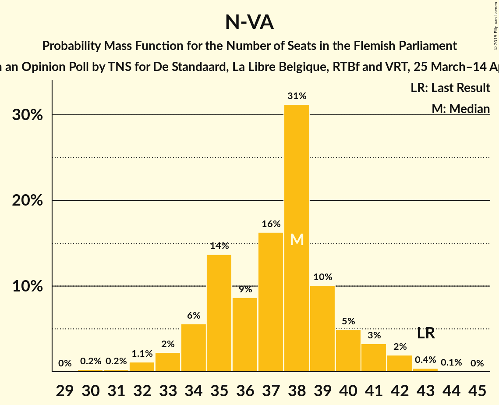

| Number of Seats | Probability | Accumulated | Special Marks |
|:---------------:|:-----------:|:-----------:|:-------------:|
| 30 | 0.2% | 100% |  |
| 31 | 0.2% | 99.7% |  |
| 32 | 1.1% | 99.5% |  |
| 33 | 2% | 98% |  |
| 34 | 6% | 96% |  |
| 35 | 14% | 91% |  |
| 36 | 9% | 77% |  |
| 37 | 16% | 68% |  |
| 38 | 31% | 52% | Median |
| 39 | 10% | 21% |  |
| 40 | 5% | 11% |  |
| 41 | 3% | 6% |  |
| 42 | 2% | 2% |  |
| 43 | 0.4% | 0.5% | Last Result |
| 44 | 0.1% | 0.1% |  |
| 45 | 0% | 0% |  |

### CD&V

*For a full overview of the results for this party, see the [CD&V](party-cdv.html) page.*

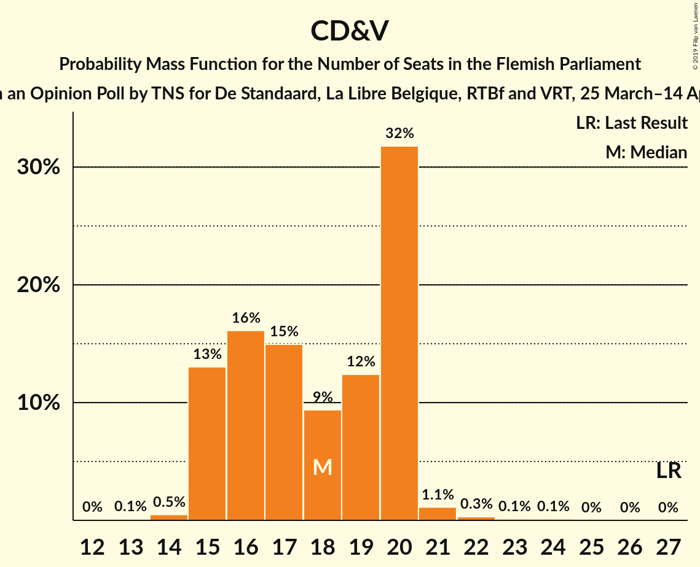

| Number of Seats | Probability | Accumulated | Special Marks |
|:---------------:|:-----------:|:-----------:|:-------------:|
| 13 | 0.1% | 100% |  |
| 14 | 0.5% | 99.9% |  |
| 15 | 13% | 99.4% |  |
| 16 | 16% | 86% |  |
| 17 | 15% | 70% |  |
| 18 | 9% | 55% | Median |
| 19 | 12% | 46% |  |
| 20 | 32% | 33% |  |
| 21 | 1.1% | 2% |  |
| 22 | 0.3% | 0.6% |  |
| 23 | 0.1% | 0.3% |  |
| 24 | 0.1% | 0.1% |  |
| 25 | 0% | 0% |  |
| 26 | 0% | 0% |  |
| 27 | 0% | 0% | Last Result |

### Groen

*For a full overview of the results for this party, see the [Groen](party-groen.html) page.*

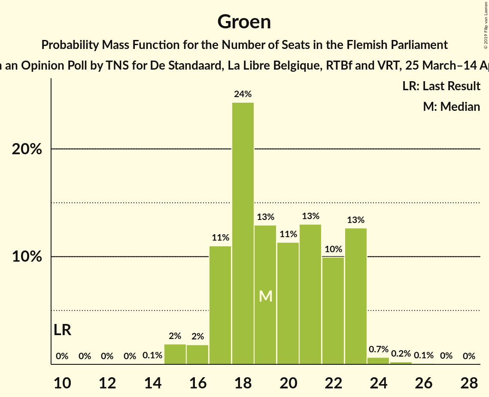

| Number of Seats | Probability | Accumulated | Special Marks |
|:---------------:|:-----------:|:-----------:|:-------------:|
| 10 | 0% | 100% | Last Result |
| 11 | 0% | 100% |  |
| 12 | 0% | 100% |  |
| 13 | 0% | 100% |  |
| 14 | 0% | 100% |  |
| 15 | 2% | 100% |  |
| 16 | 1.4% | 98% |  |
| 17 | 12% | 97% |  |
| 18 | 24% | 85% |  |
| 19 | 12% | 61% | Median |
| 20 | 11% | 49% |  |
| 21 | 11% | 38% |  |
| 22 | 12% | 27% |  |
| 23 | 14% | 15% |  |
| 24 | 0.5% | 0.8% |  |
| 25 | 0.2% | 0.3% |  |
| 26 | 0.1% | 0.2% |  |
| 27 | 0% | 0% |  |

### Open Vld

*For a full overview of the results for this party, see the [Open Vld](party-openvld.html) page.*

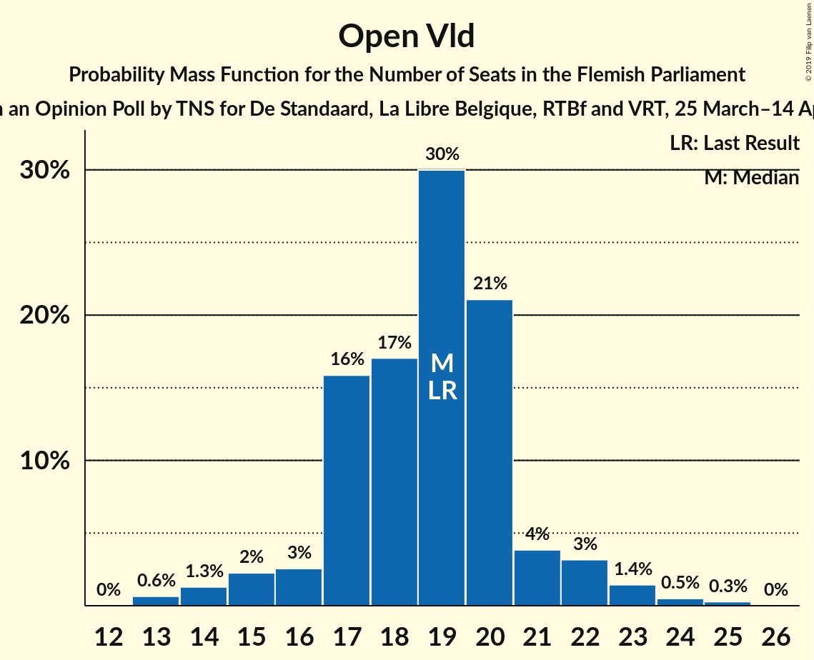

| Number of Seats | Probability | Accumulated | Special Marks |
|:---------------:|:-----------:|:-----------:|:-------------:|
| 13 | 0.6% | 100% |  |
| 14 | 0.9% | 99.4% |  |
| 15 | 2% | 98% |  |
| 16 | 4% | 96% |  |
| 17 | 13% | 93% |  |
| 18 | 23% | 79% |  |
| 19 | 25% | 56% | Last Result, Median |
| 20 | 23% | 31% |  |
| 21 | 3% | 8% |  |
| 22 | 2% | 5% |  |
| 23 | 2% | 3% |  |
| 24 | 0.3% | 0.5% |  |
| 25 | 0.2% | 0.2% |  |
| 26 | 0% | 0% |  |

### sp.a

*For a full overview of the results for this party, see the [sp.a](party-spa.html) page.*

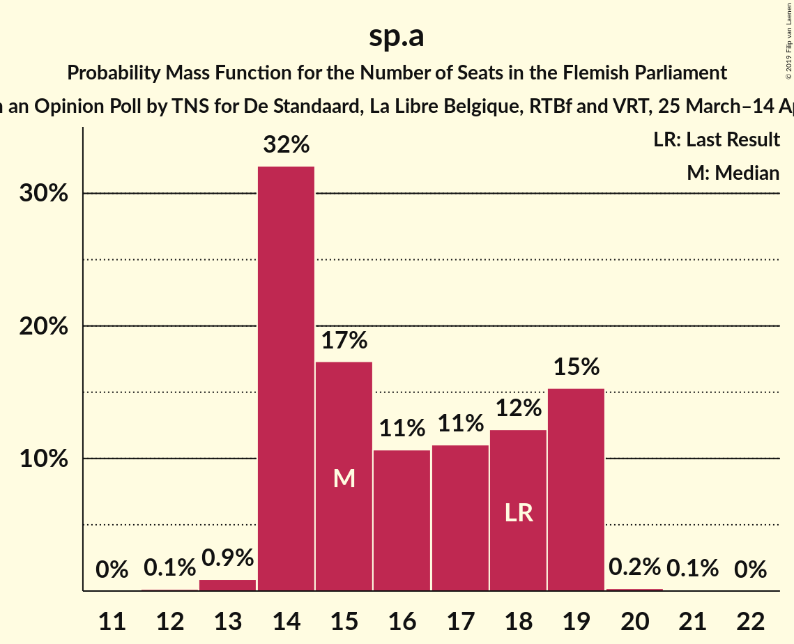

| Number of Seats | Probability | Accumulated | Special Marks |
|:---------------:|:-----------:|:-----------:|:-------------:|
| 11 | 0% | 100% |  |
| 12 | 0.1% | 99.9% |  |
| 13 | 1.1% | 99.9% |  |
| 14 | 31% | 98.8% |  |
| 15 | 19% | 68% | Median |
| 16 | 10% | 49% |  |
| 17 | 12% | 39% |  |
| 18 | 12% | 27% | Last Result |
| 19 | 14% | 15% |  |
| 20 | 0.3% | 0.4% |  |
| 21 | 0.1% | 0.1% |  |
| 22 | 0% | 0% |  |

### Vlaams Belang

*For a full overview of the results for this party, see the [Vlaams Belang](party-vlaamsbelang.html) page.*

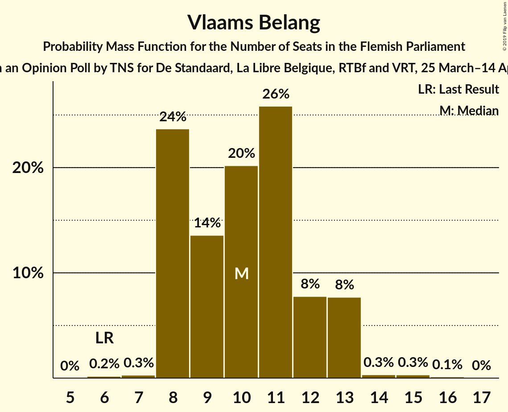

| Number of Seats | Probability | Accumulated | Special Marks |
|:---------------:|:-----------:|:-----------:|:-------------:|
| 6 | 0.2% | 100% | Last Result |
| 7 | 0.3% | 99.8% |  |
| 8 | 24% | 99.5% |  |
| 9 | 14% | 76% |  |
| 10 | 20% | 62% | Median |
| 11 | 26% | 42% |  |
| 12 | 8% | 16% |  |
| 13 | 8% | 8% |  |
| 14 | 0.3% | 0.8% |  |
| 15 | 0.3% | 0.5% |  |
| 16 | 0.1% | 0.1% |  |
| 17 | 0% | 0% |  |

### PVDA

*For a full overview of the results for this party, see the [PVDA](party-pvda.html) page.*

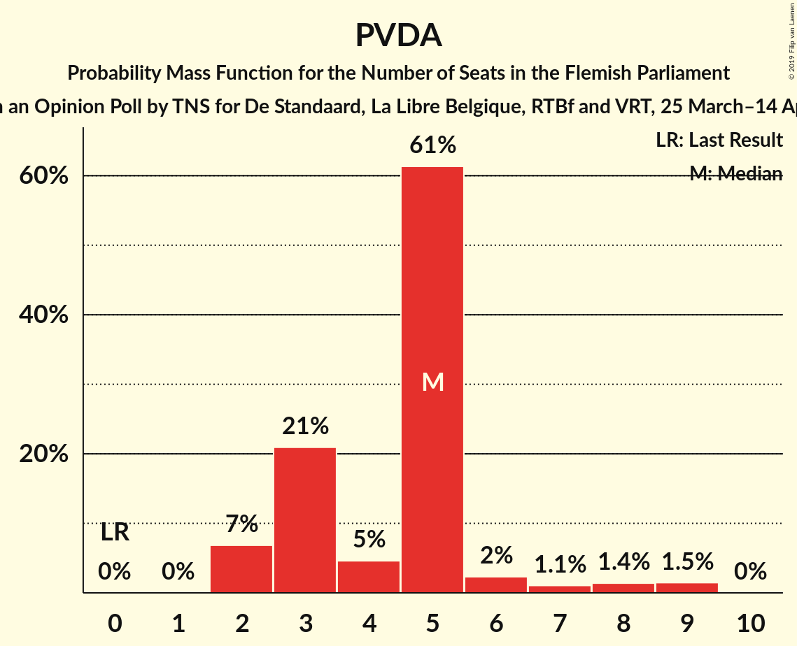

| Number of Seats | Probability | Accumulated | Special Marks |
|:---------------:|:-----------:|:-----------:|:-------------:|
| 0 | 0% | 100% | Last Result |
| 1 | 0% | 100% |  |
| 2 | 9% | 100% |  |
| 3 | 19% | 90% |  |
| 4 | 6% | 71% |  |
| 5 | 59% | 66% | Median |
| 6 | 2% | 6% |  |
| 7 | 1.0% | 4% |  |
| 8 | 1.3% | 3% |  |
| 9 | 2% | 2% |  |
| 10 | 0% | 0% |  |

## Coalitions

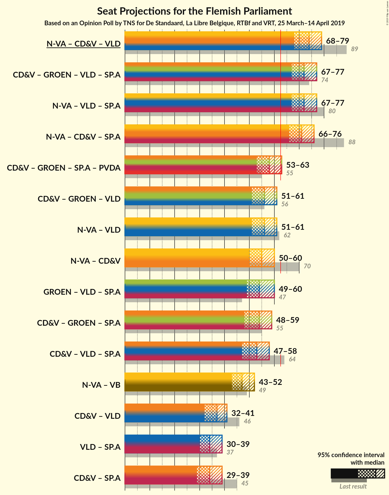

### Confidence Intervals

| Coalition | Last Result | Median | Majority? | 80% Confidence Interval | 90% Confidence Interval | 95% Confidence Interval | 99% Confidence Interval |
|:---------:|:-----------:|:------:|:---------:|:-----------------------:|:-----------------------:|:-----------------------:|:-----------------------:|
| N-VA – CD&V – Open Vld | 89 | 74 | 100% | 70–78 | 69–78 | 68–79 | 67–81 |
| CD&V – Groen – Open Vld – sp.a | 74 | 72 | 100% | 69–75 | 68–76 | 68–77 | 66–79 |
| N-VA – Open Vld – sp.a | 80 | 72 | 100% | 68–76 | 68–76 | 67–77 | 65–78 |
| N-VA – CD&V – sp.a | 88 | 71 | 100% | 68–74 | 67–75 | 66–76 | 65–77 |
| CD&V – Groen – sp.a – PVDA | 55 | 58 | 4% | 55–61 | 53–62 | 53–63 | 51–65 |
| CD&V – Groen – Open Vld | 56 | 56 | 0.5% | 53–60 | 52–61 | 51–61 | 50–62 |
| N-VA – Open Vld | 62 | 56 | 0.5% | 53–59 | 52–60 | 51–61 | 49–62 |
| N-VA – CD&V | 70 | 55 | 0.1% | 52–58 | 51–59 | 50–60 | 49–62 |
| Groen – Open Vld – sp.a | 47 | 54 | 0% | 51–58 | 51–59 | 49–59 | 48–60 |
| CD&V – Groen – sp.a | 55 | 54 | 0% | 50–57 | 49–58 | 48–59 | 47–61 |
| CD&V – Open Vld – sp.a | 64 | 53 | 0% | 49–56 | 49–57 | 48–58 | 46–59 |
| N-VA – Vlaams Belang | 49 | 47 | 0% | 45–50 | 43–51 | 43–52 | 41–53 |
| CD&V – Open Vld | 46 | 36 | 0% | 33–40 | 33–40 | 32–41 | 31–43 |
| CD&V – sp.a | 45 | 34 | 0% | 31–37 | 30–38 | 30–39 | 29–39 |
| Open Vld – sp.a | 37 | 35 | 0% | 31–38 | 31–39 | 30–39 | 29–40 |

### N-VA – CD&V – Open Vld

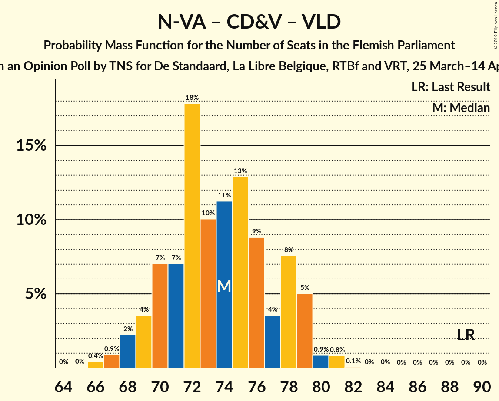

| Number of Seats | Probability | Accumulated | Special Marks |
|:---------------:|:-----------:|:-----------:|:-------------:|
| 65 | 0% | 100% |  |
| 66 | 0.2% | 99.9% |  |
| 67 | 0.7% | 99.7% |  |
| 68 | 2% | 99.0% |  |
| 69 | 3% | 97% |  |
| 70 | 5% | 93% |  |
| 71 | 7% | 89% |  |
| 72 | 10% | 82% |  |
| 73 | 17% | 73% |  |
| 74 | 16% | 55% |  |
| 75 | 15% | 39% | Median |
| 76 | 10% | 25% |  |
| 77 | 5% | 15% |  |
| 78 | 6% | 10% |  |
| 79 | 3% | 4% |  |
| 80 | 0.8% | 1.5% |  |
| 81 | 0.6% | 0.6% |  |
| 82 | 0.1% | 0.1% |  |
| 83 | 0% | 0% |  |
| 84 | 0% | 0% |  |
| 85 | 0% | 0% |  |
| 86 | 0% | 0% |  |
| 87 | 0% | 0% |  |
| 88 | 0% | 0% |  |
| 89 | 0% | 0% | Last Result |

### CD&V – Groen – Open Vld – sp.a

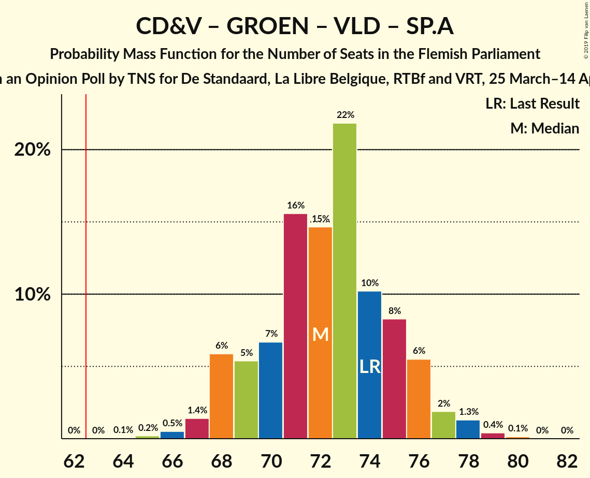

| Number of Seats | Probability | Accumulated | Special Marks |
|:---------------:|:-----------:|:-----------:|:-------------:|
| 64 | 0.1% | 100% |  |
| 65 | 0.2% | 99.9% |  |
| 66 | 0.5% | 99.7% |  |
| 67 | 1.4% | 99.2% |  |
| 68 | 6% | 98% |  |
| 69 | 5% | 92% |  |
| 70 | 7% | 87% |  |
| 71 | 16% | 80% | Median |
| 72 | 15% | 64% |  |
| 73 | 22% | 50% |  |
| 74 | 10% | 28% | Last Result |
| 75 | 8% | 18% |  |
| 76 | 6% | 9% |  |
| 77 | 2% | 4% |  |
| 78 | 1.3% | 2% |  |
| 79 | 0.4% | 0.6% |  |
| 80 | 0.1% | 0.2% |  |
| 81 | 0% | 0% |  |

### N-VA – Open Vld – sp.a

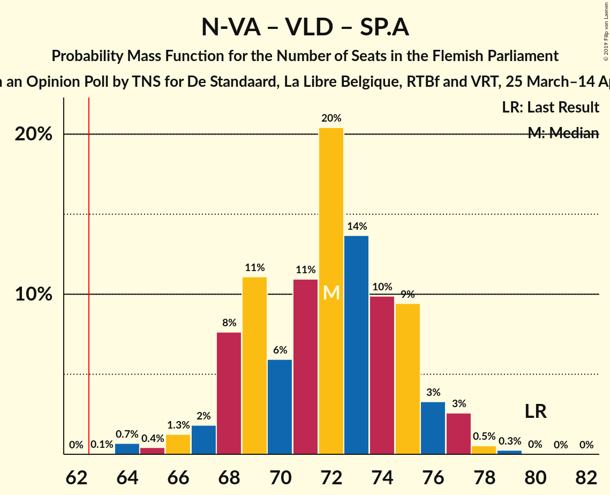

| Number of Seats | Probability | Accumulated | Special Marks |
|:---------------:|:-----------:|:-----------:|:-------------:|
| 63 | 0.1% | 100% | Majority |
| 64 | 0.3% | 99.9% |  |
| 65 | 0.5% | 99.6% |  |
| 66 | 0.8% | 99.1% |  |
| 67 | 3% | 98% |  |
| 68 | 6% | 95% |  |
| 69 | 10% | 89% |  |
| 70 | 11% | 78% |  |
| 71 | 11% | 67% |  |
| 72 | 16% | 56% | Median |
| 73 | 12% | 40% |  |
| 74 | 9% | 29% |  |
| 75 | 10% | 20% |  |
| 76 | 6% | 10% |  |
| 77 | 3% | 4% |  |
| 78 | 0.8% | 1.3% |  |
| 79 | 0.4% | 0.5% |  |
| 80 | 0.1% | 0.1% | Last Result |
| 81 | 0% | 0% |  |

### N-VA – CD&V – sp.a

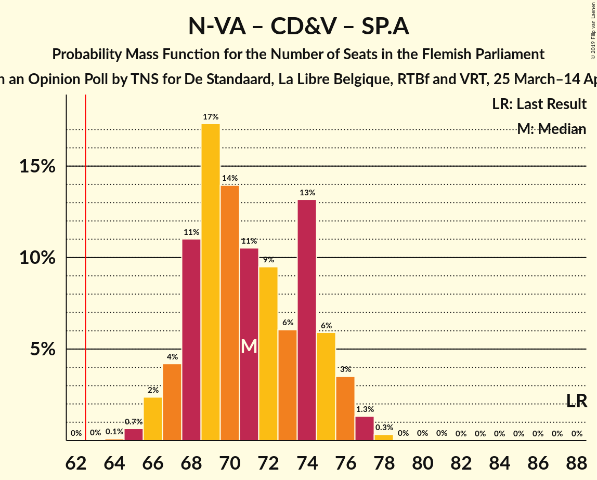

| Number of Seats | Probability | Accumulated | Special Marks |
|:---------------:|:-----------:|:-----------:|:-------------:|
| 63 | 0.2% | 100% | Majority |
| 64 | 0.2% | 99.8% |  |
| 65 | 0.7% | 99.5% |  |
| 66 | 1.5% | 98.9% |  |
| 67 | 3% | 97% |  |
| 68 | 8% | 95% |  |
| 69 | 15% | 87% |  |
| 70 | 17% | 73% |  |
| 71 | 13% | 56% | Median |
| 72 | 14% | 43% |  |
| 73 | 11% | 29% |  |
| 74 | 10% | 19% |  |
| 75 | 5% | 9% |  |
| 76 | 3% | 4% |  |
| 77 | 1.1% | 1.3% |  |
| 78 | 0.2% | 0.2% |  |
| 79 | 0% | 0.1% |  |
| 80 | 0% | 0% |  |
| 81 | 0% | 0% |  |
| 82 | 0% | 0% |  |
| 83 | 0% | 0% |  |
| 84 | 0% | 0% |  |
| 85 | 0% | 0% |  |
| 86 | 0% | 0% |  |
| 87 | 0% | 0% |  |
| 88 | 0% | 0% | Last Result |

### CD&V – Groen – sp.a – PVDA

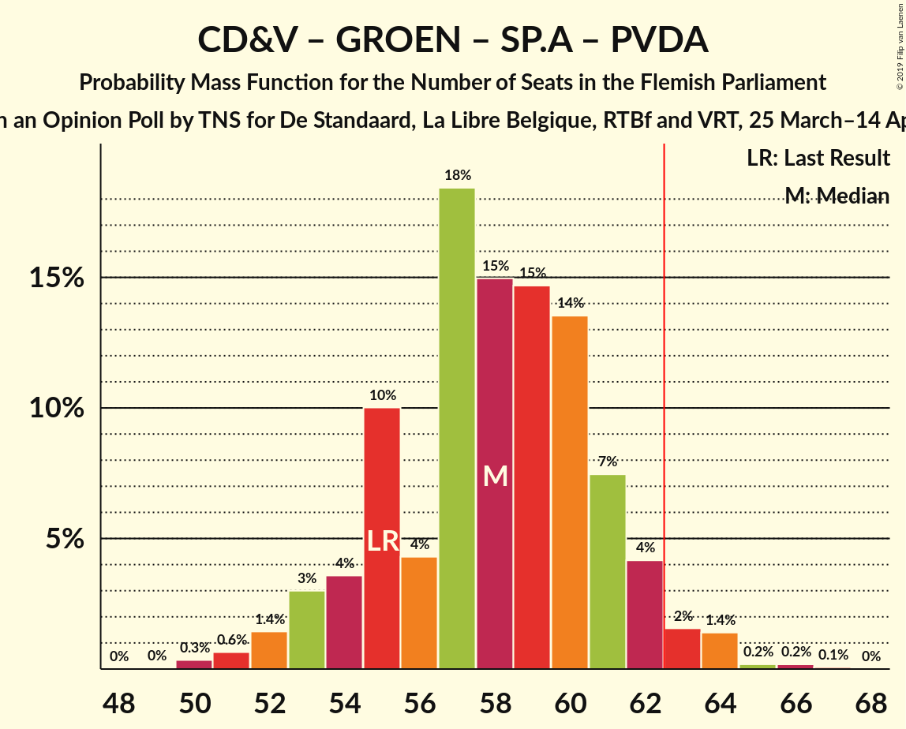

| Number of Seats | Probability | Accumulated | Special Marks |
|:---------------:|:-----------:|:-----------:|:-------------:|
| 50 | 0.2% | 100% |  |
| 51 | 0.5% | 99.8% |  |
| 52 | 2% | 99.2% |  |
| 53 | 3% | 98% |  |
| 54 | 5% | 95% |  |
| 55 | 9% | 90% | Last Result |
| 56 | 5% | 81% |  |
| 57 | 16% | 76% | Median |
| 58 | 17% | 60% |  |
| 59 | 14% | 43% |  |
| 60 | 13% | 29% |  |
| 61 | 6% | 15% |  |
| 62 | 5% | 10% |  |
| 63 | 2% | 4% | Majority |
| 64 | 1.1% | 2% |  |
| 65 | 0.6% | 0.8% |  |
| 66 | 0.2% | 0.2% |  |
| 67 | 0.1% | 0.1% |  |
| 68 | 0% | 0% |  |

### CD&V – Groen – Open Vld

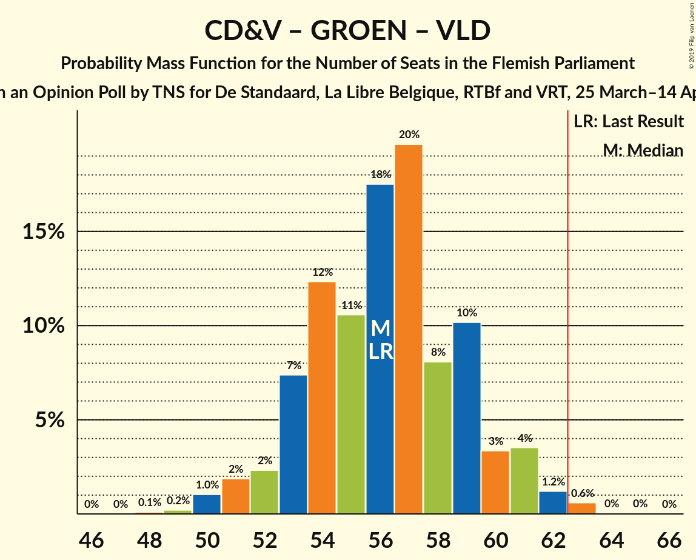

| Number of Seats | Probability | Accumulated | Special Marks |
|:---------------:|:-----------:|:-----------:|:-------------:|
| 48 | 0.1% | 100% |  |
| 49 | 0.2% | 99.9% |  |
| 50 | 1.0% | 99.7% |  |
| 51 | 1.5% | 98.7% |  |
| 52 | 3% | 97% |  |
| 53 | 6% | 94% |  |
| 54 | 13% | 88% |  |
| 55 | 13% | 75% |  |
| 56 | 14% | 62% | Last Result, Median |
| 57 | 16% | 48% |  |
| 58 | 12% | 32% |  |
| 59 | 9% | 20% |  |
| 60 | 5% | 10% |  |
| 61 | 4% | 5% |  |
| 62 | 1.2% | 2% |  |
| 63 | 0.4% | 0.5% | Majority |
| 64 | 0% | 0.1% |  |
| 65 | 0% | 0.1% |  |
| 66 | 0% | 0% |  |

### N-VA – Open Vld

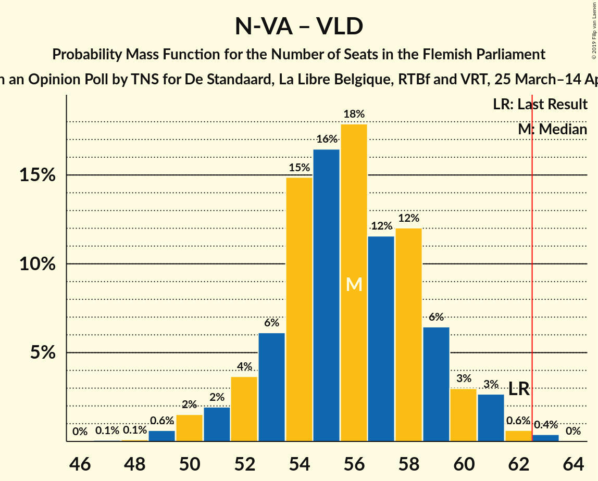

| Number of Seats | Probability | Accumulated | Special Marks |
|:---------------:|:-----------:|:-----------:|:-------------:|
| 47 | 0.1% | 100% |  |
| 48 | 0.2% | 99.9% |  |
| 49 | 0.5% | 99.7% |  |
| 50 | 1.2% | 99.2% |  |
| 51 | 2% | 98% |  |
| 52 | 4% | 96% |  |
| 53 | 8% | 92% |  |
| 54 | 12% | 84% |  |
| 55 | 15% | 72% |  |
| 56 | 19% | 57% |  |
| 57 | 12% | 38% | Median |
| 58 | 11% | 26% |  |
| 59 | 8% | 15% |  |
| 60 | 3% | 7% |  |
| 61 | 2% | 4% |  |
| 62 | 1.1% | 2% | Last Result |
| 63 | 0.2% | 0.5% | Majority |
| 64 | 0.2% | 0.2% |  |
| 65 | 0% | 0% |  |

### N-VA – CD&V

| Number of Seats | Probability | Accumulated | Special Marks |
|:---------------:|:-----------:|:-----------:|:-------------:|
| 47 | 0% | 100% |  |
| 48 | 0.1% | 99.9% |  |
| 49 | 0.6% | 99.8% |  |
| 50 | 3% | 99.2% |  |
| 51 | 3% | 96% |  |
| 52 | 6% | 93% |  |
| 53 | 10% | 87% |  |
| 54 | 12% | 76% |  |
| 55 | 24% | 64% |  |
| 56 | 12% | 40% | Median |
| 57 | 11% | 28% |  |
| 58 | 9% | 17% |  |
| 59 | 4% | 8% |  |
| 60 | 2% | 4% |  |
| 61 | 0.8% | 1.4% |  |
| 62 | 0.6% | 0.6% |  |
| 63 | 0.1% | 0.1% | Majority |
| 64 | 0% | 0% |  |
| 65 | 0% | 0% |  |
| 66 | 0% | 0% |  |
| 67 | 0% | 0% |  |
| 68 | 0% | 0% |  |
| 69 | 0% | 0% |  |
| 70 | 0% | 0% | Last Result |

### Groen – Open Vld – sp.a

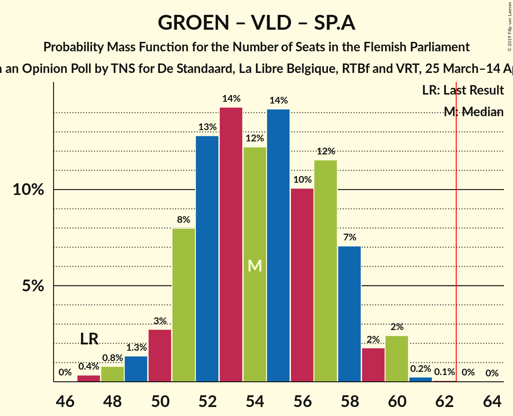

| Number of Seats | Probability | Accumulated | Special Marks |
|:---------------:|:-----------:|:-----------:|:-------------:|
| 46 | 0% | 100% |  |
| 47 | 0.2% | 99.9% | Last Result |
| 48 | 0.7% | 99.8% |  |
| 49 | 2% | 99.1% |  |
| 50 | 2% | 97% |  |
| 51 | 6% | 95% |  |
| 52 | 11% | 89% |  |
| 53 | 16% | 79% | Median |
| 54 | 16% | 62% |  |
| 55 | 16% | 46% |  |
| 56 | 11% | 30% |  |
| 57 | 9% | 19% |  |
| 58 | 6% | 11% |  |
| 59 | 3% | 5% |  |
| 60 | 2% | 2% |  |
| 61 | 0.2% | 0.3% |  |
| 62 | 0.1% | 0.1% |  |
| 63 | 0% | 0% | Majority |

### CD&V – Groen – sp.a

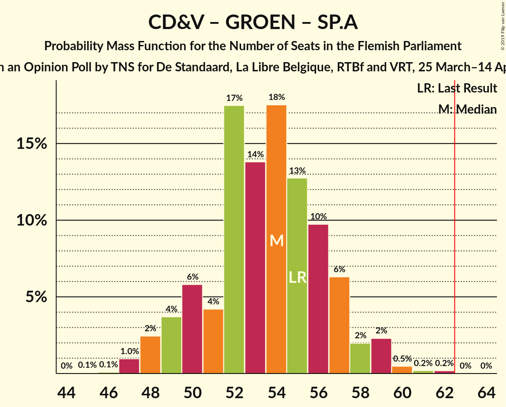

| Number of Seats | Probability | Accumulated | Special Marks |
|:---------------:|:-----------:|:-----------:|:-------------:|
| 45 | 0.1% | 100% |  |
| 46 | 0.1% | 99.9% |  |
| 47 | 0.6% | 99.8% |  |
| 48 | 3% | 99.2% |  |
| 49 | 4% | 97% |  |
| 50 | 5% | 92% |  |
| 51 | 6% | 87% |  |
| 52 | 15% | 81% | Median |
| 53 | 15% | 67% |  |
| 54 | 17% | 52% |  |
| 55 | 12% | 35% | Last Result |
| 56 | 8% | 23% |  |
| 57 | 7% | 15% |  |
| 58 | 5% | 8% |  |
| 59 | 1.4% | 3% |  |
| 60 | 1.0% | 2% |  |
| 61 | 0.5% | 0.7% |  |
| 62 | 0.2% | 0.2% |  |
| 63 | 0% | 0% | Majority |

### CD&V – Open Vld – sp.a

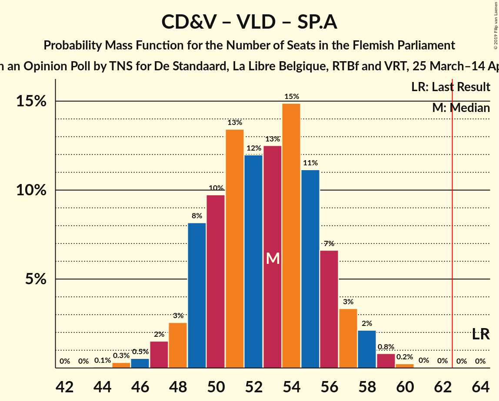

| Number of Seats | Probability | Accumulated | Special Marks |
|:---------------:|:-----------:|:-----------:|:-------------:|
| 44 | 0.1% | 100% |  |
| 45 | 0.3% | 99.9% |  |
| 46 | 0.5% | 99.6% |  |
| 47 | 2% | 99.1% |  |
| 48 | 3% | 98% |  |
| 49 | 8% | 95% |  |
| 50 | 10% | 87% |  |
| 51 | 13% | 77% |  |
| 52 | 12% | 64% | Median |
| 53 | 13% | 52% |  |
| 54 | 15% | 39% |  |
| 55 | 11% | 24% |  |
| 56 | 7% | 13% |  |
| 57 | 3% | 7% |  |
| 58 | 2% | 3% |  |
| 59 | 0.8% | 1.1% |  |
| 60 | 0.2% | 0.3% |  |
| 61 | 0% | 0.1% |  |
| 62 | 0% | 0% |  |
| 63 | 0% | 0% | Majority |
| 64 | 0% | 0% | Last Result |

### N-VA – Vlaams Belang

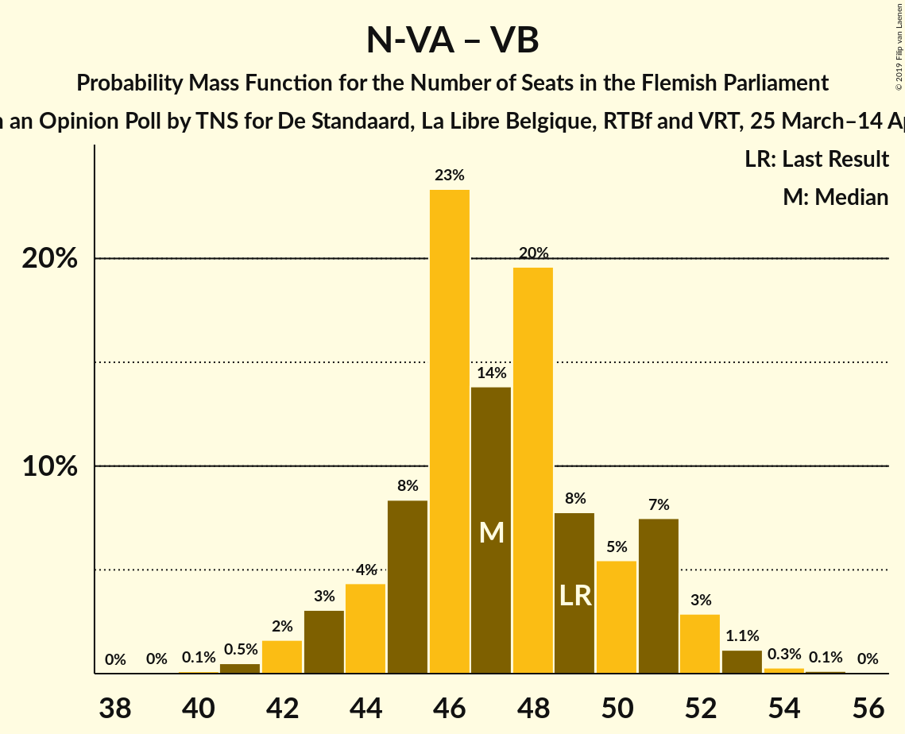

| Number of Seats | Probability | Accumulated | Special Marks |
|:---------------:|:-----------:|:-----------:|:-------------:|
| 40 | 0.1% | 100% |  |
| 41 | 0.5% | 99.8% |  |
| 42 | 2% | 99.3% |  |
| 43 | 3% | 98% |  |
| 44 | 4% | 94% |  |
| 45 | 8% | 90% |  |
| 46 | 24% | 82% |  |
| 47 | 14% | 59% |  |
| 48 | 17% | 45% | Median |
| 49 | 12% | 28% | Last Result |
| 50 | 6% | 16% |  |
| 51 | 6% | 10% |  |
| 52 | 2% | 3% |  |
| 53 | 1.3% | 2% |  |
| 54 | 0.3% | 0.4% |  |
| 55 | 0.1% | 0.2% |  |
| 56 | 0% | 0% |  |

### CD&V – Open Vld

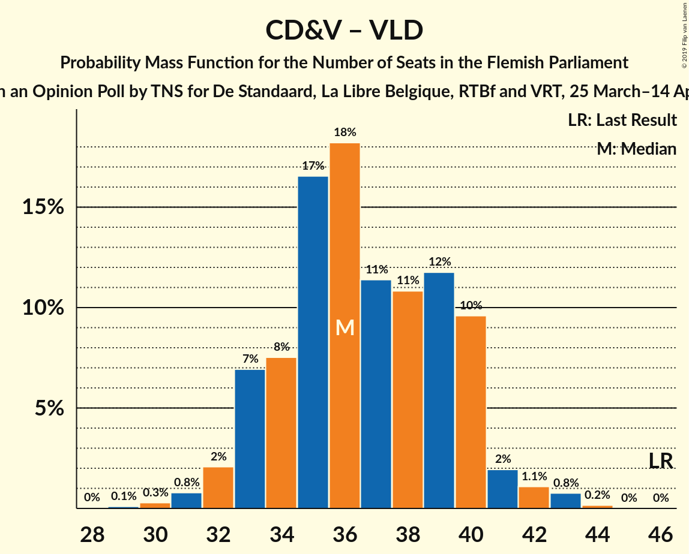

| Number of Seats | Probability | Accumulated | Special Marks |
|:---------------:|:-----------:|:-----------:|:-------------:|
| 29 | 0.1% | 100% |  |
| 30 | 0.3% | 99.9% |  |
| 31 | 0.8% | 99.6% |  |
| 32 | 2% | 98.8% |  |
| 33 | 7% | 97% |  |
| 34 | 8% | 90% |  |
| 35 | 17% | 82% |  |
| 36 | 18% | 66% |  |
| 37 | 11% | 48% | Median |
| 38 | 11% | 36% |  |
| 39 | 12% | 25% |  |
| 40 | 10% | 14% |  |
| 41 | 2% | 4% |  |
| 42 | 1.1% | 2% |  |
| 43 | 0.8% | 0.9% |  |
| 44 | 0.2% | 0.2% |  |
| 45 | 0% | 0% |  |
| 46 | 0% | 0% | Last Result |

### CD&V – sp.a

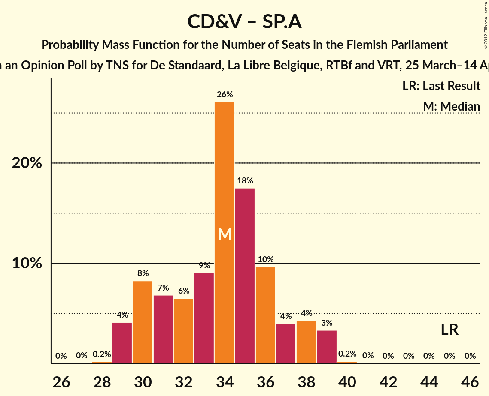

| Number of Seats | Probability | Accumulated | Special Marks |
|:---------------:|:-----------:|:-----------:|:-------------:|
| 28 | 0.2% | 100% |  |
| 29 | 2% | 99.8% |  |
| 30 | 6% | 98% |  |
| 31 | 10% | 91% |  |
| 32 | 10% | 81% |  |
| 33 | 9% | 71% | Median |
| 34 | 22% | 62% |  |
| 35 | 17% | 40% |  |
| 36 | 11% | 23% |  |
| 37 | 5% | 12% |  |
| 38 | 4% | 7% |  |
| 39 | 3% | 3% |  |
| 40 | 0.2% | 0.3% |  |
| 41 | 0% | 0.1% |  |
| 42 | 0% | 0% |  |
| 43 | 0% | 0% |  |
| 44 | 0% | 0% |  |
| 45 | 0% | 0% | Last Result |

### Open Vld – sp.a

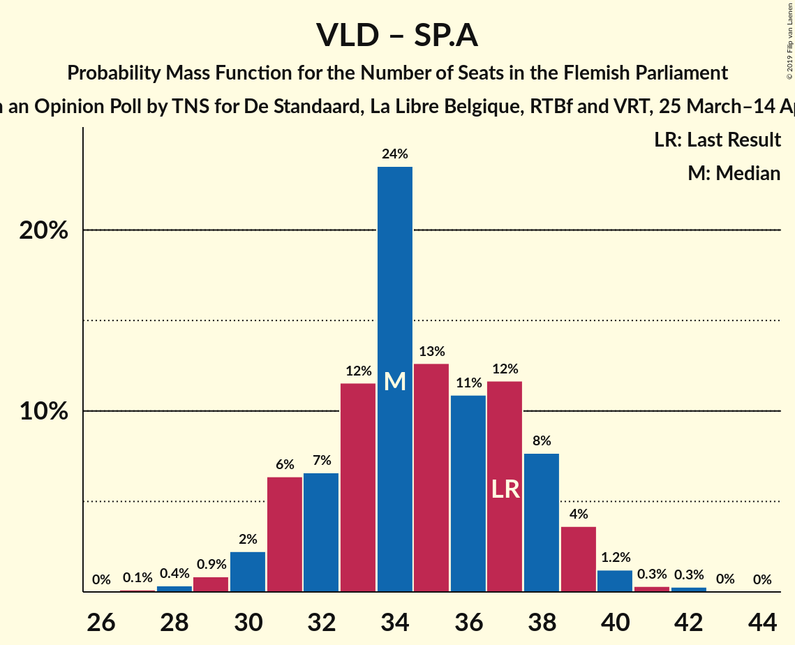

| Number of Seats | Probability | Accumulated | Special Marks |
|:---------------:|:-----------:|:-----------:|:-------------:|
| 27 | 0.1% | 100% |  |
| 28 | 0.2% | 99.9% |  |
| 29 | 0.9% | 99.7% |  |
| 30 | 2% | 98.9% |  |
| 31 | 7% | 97% |  |
| 32 | 9% | 90% |  |
| 33 | 11% | 80% |  |
| 34 | 18% | 69% | Median |
| 35 | 15% | 51% |  |
| 36 | 14% | 37% |  |
| 37 | 10% | 23% | Last Result |
| 38 | 7% | 13% |  |
| 39 | 4% | 5% |  |
| 40 | 0.8% | 1.3% |  |
| 41 | 0.3% | 0.5% |  |
| 42 | 0.2% | 0.2% |  |
| 43 | 0% | 0% |  |

## Technical Information

### Opinion Poll

+ **Polling firm:** TNS
+ **Commissioner(s):** De Standaard, La Libre Belgique, RTBf and VRT
+ **Fieldwork period:** 25 March–14 April 2019

### Calculations

+ **Sample size:** 1006
+ **Simulations done:** 1,048,576
+ **Error estimate:** 0.66%

