# Opinion Poll by Ipsos for Het Laatste Nieuws, Le Soir, RTL TVi and VTM, 6–14 May 2019

<a href="#voting-intentions">Voting Intentions</a> | <a href="#seats">Seats</a> | <a href="#coalitions">Coalitions</a> | <a href="#technical-information">Technical Information</a>

## Voting Intentions

### Confidence Intervals

| Party | Last Result | Poll Result | 80% Confidence Interval | 90% Confidence Interval | 95% Confidence Interval | 99% Confidence Interval |
|:-----:|:-----------:|:-----------:|:-----------------------:|:-----------------------:|:-----------------------:|:-----------------------:|
| N-VA | 31.9% | 28.1% | 26.3–30.0% |25.8–30.5% |25.4–31.0% |24.6–31.9% |
| CD&V | 20.5% | 17.1% | 15.7–18.8% |15.3–19.2% |14.9–19.6% |14.3–20.4% |
| Vlaams Belang | 5.9% | 14.8% | 13.4–16.3% |13.0–16.7% |12.7–17.1% |12.1–17.8% |
| Groen | 8.7% | 12.1% | 10.8–13.5% |10.5–13.9% |10.2–14.2% |9.6–14.9% |
| Open Vld | 14.1% | 11.2% | 10.0–12.5% |9.6–12.9% |9.4–13.3% |8.8–14.0% |
| sp.a | 14.0% | 11.0% | 9.8–12.3% |9.4–12.7% |9.2–13.1% |8.6–13.7% |
| PVDA | 2.5% | 4.7% | 3.9–5.7% |3.7–5.9% |3.5–6.2% |3.2–6.7% |

*Note:* The poll result column reflects the actual value used in the calculations. Published results may vary slightly, and in addition be rounded to fewer digits.

## Seats

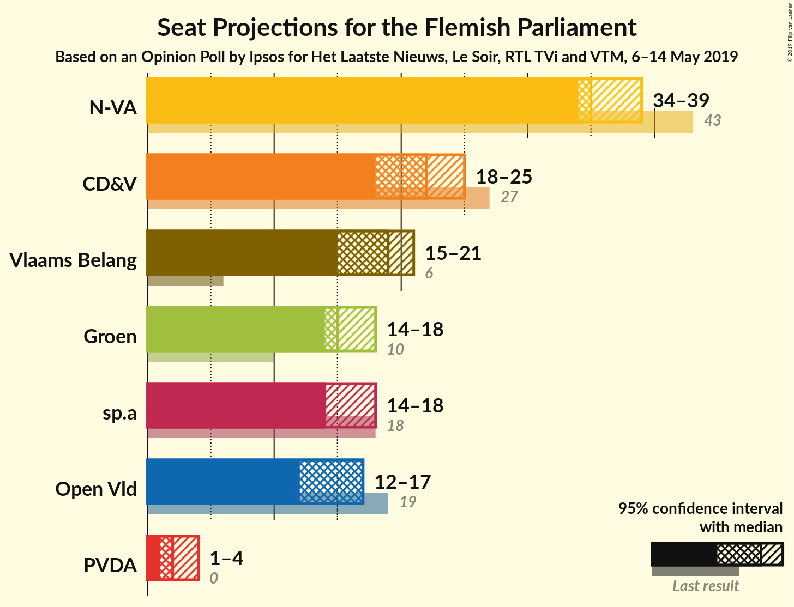

### Confidence Intervals

| Party | Last Result | Median | 80% Confidence Interval | 90% Confidence Interval | 95% Confidence Interval | 99% Confidence Interval |
|:-----:|:-----------:|:------:|:-----------------------:|:-----------------------:|:-----------------------:|:-----------------------:|
| <a href="#n-va">N-VA</a> | 43 | 35 | 35–38 |34–39 |34–39 |33–39 |
| <a href="#cd&v">CD&V</a> | 27 | 22 | 20–25 |20–25 |18–25 |18–25 |
| <a href="#vlaams-belang">Vlaams Belang</a> | 6 | 19 | 16–20 |15–20 |15–21 |15–23 |
| <a href="#groen">Groen</a> | 10 | 15 | 14–17 |14–18 |14–18 |14–18 |
| <a href="#open-vld">Open Vld</a> | 19 | 17 | 12–17 |12–17 |12–17 |12–17 |
| <a href="#sp.a">sp.a</a> | 18 | 14 | 14–17 |14–18 |14–18 |13–18 |
| <a href="#pvda">PVDA</a> | 0 | 2 | 1–3 |1–3 |1–4 |1–5 |

### N-VA

*For a full overview of the results for this party, see the [N-VA](party-n-va.html) page.*

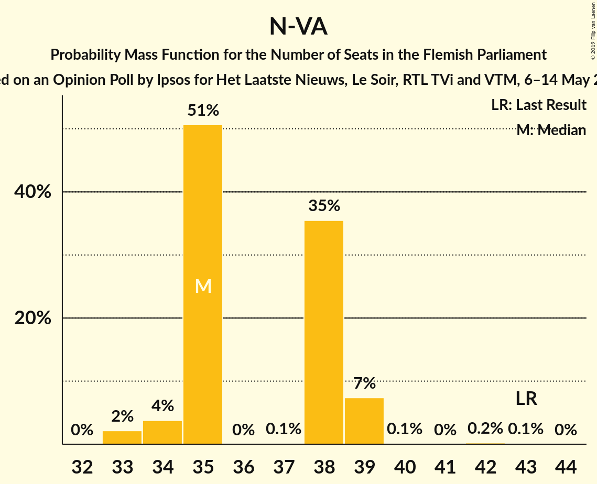

| Number of Seats | Probability | Accumulated | Special Marks |
|:---------------:|:-----------:|:-----------:|:-------------:|
| 33 | 2% | 100% |  |
| 34 | 4% | 98% |  |
| 35 | 51% | 94% | Median |
| 36 | 0% | 43% |  |
| 37 | 0.1% | 43% |  |
| 38 | 35% | 43% |  |
| 39 | 7% | 8% |  |
| 40 | 0.1% | 0.5% |  |
| 41 | 0% | 0.3% |  |
| 42 | 0.2% | 0.3% |  |
| 43 | 0.1% | 0.1% | Last Result |
| 44 | 0% | 0% |  |

### CD&V

*For a full overview of the results for this party, see the [CD&V](party-cdv.html) page.*

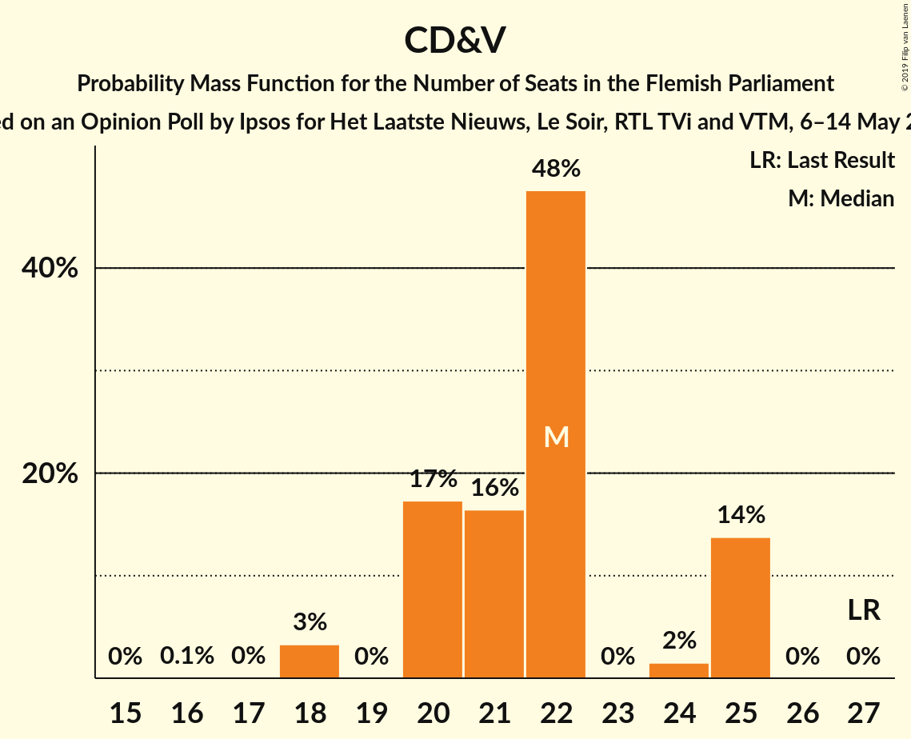

| Number of Seats | Probability | Accumulated | Special Marks |
|:---------------:|:-----------:|:-----------:|:-------------:|
| 16 | 0.1% | 100% |  |
| 17 | 0% | 99.9% |  |
| 18 | 3% | 99.9% |  |
| 19 | 0% | 97% |  |
| 20 | 17% | 97% |  |
| 21 | 16% | 79% |  |
| 22 | 48% | 63% | Median |
| 23 | 0% | 15% |  |
| 24 | 2% | 15% |  |
| 25 | 14% | 14% |  |
| 26 | 0% | 0% |  |
| 27 | 0% | 0% | Last Result |

### Vlaams Belang

*For a full overview of the results for this party, see the [Vlaams Belang](party-vlaamsbelang.html) page.*

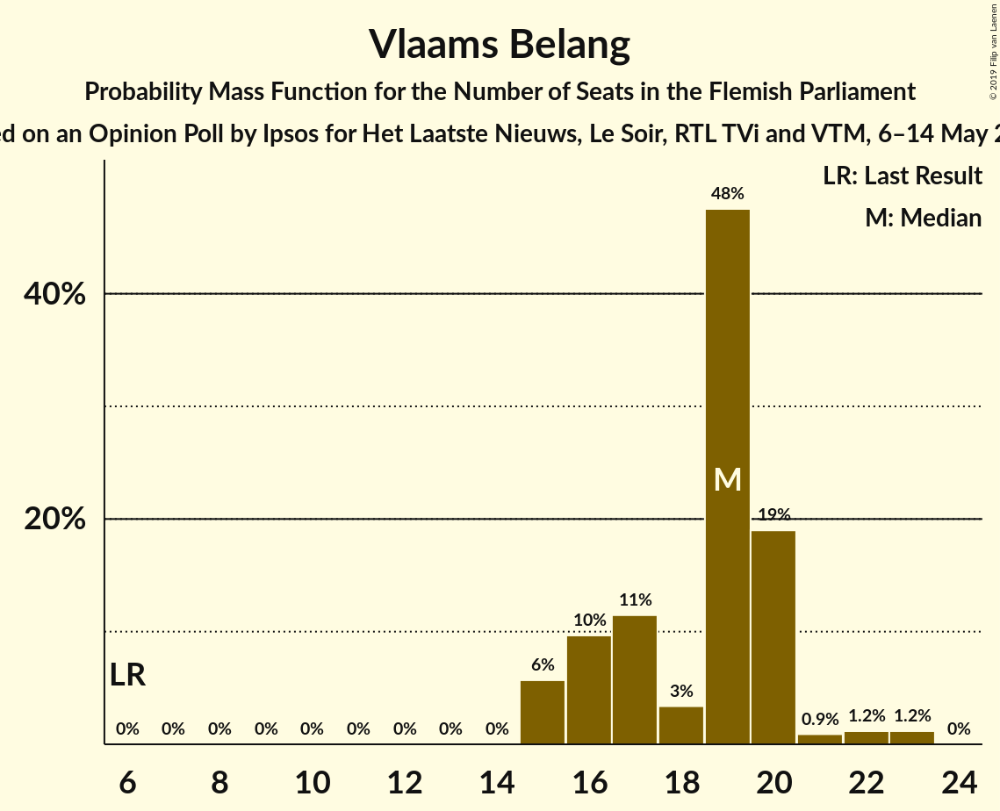

| Number of Seats | Probability | Accumulated | Special Marks |
|:---------------:|:-----------:|:-----------:|:-------------:|
| 6 | 0% | 100% | Last Result |
| 7 | 0% | 100% |  |
| 8 | 0% | 100% |  |
| 9 | 0% | 100% |  |
| 10 | 0% | 100% |  |
| 11 | 0% | 100% |  |
| 12 | 0% | 100% |  |
| 13 | 0% | 100% |  |
| 14 | 0% | 100% |  |
| 15 | 6% | 100% |  |
| 16 | 10% | 94% |  |
| 17 | 11% | 85% |  |
| 18 | 3% | 73% |  |
| 19 | 48% | 70% | Median |
| 20 | 19% | 22% |  |
| 21 | 0.9% | 3% |  |
| 22 | 1.2% | 2% |  |
| 23 | 1.2% | 1.2% |  |
| 24 | 0% | 0% |  |

### Groen

*For a full overview of the results for this party, see the [Groen](party-groen.html) page.*

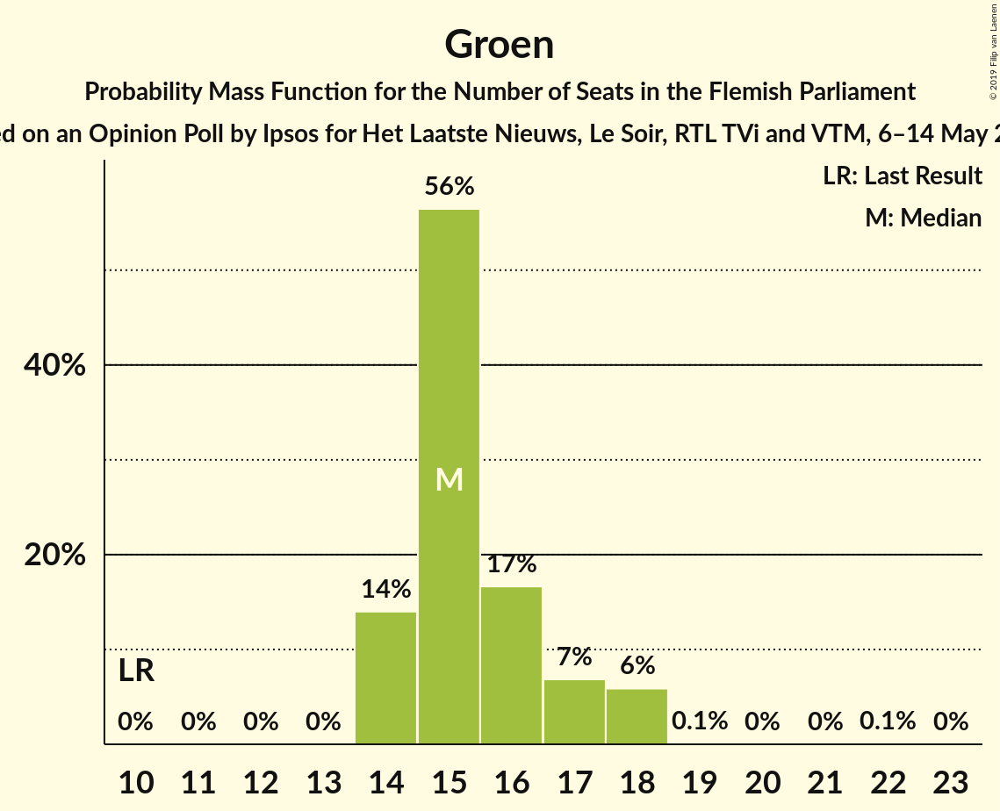

| Number of Seats | Probability | Accumulated | Special Marks |
|:---------------:|:-----------:|:-----------:|:-------------:|
| 10 | 0% | 100% | Last Result |
| 11 | 0% | 100% |  |
| 12 | 0% | 100% |  |
| 13 | 0% | 100% |  |
| 14 | 14% | 100% |  |
| 15 | 56% | 86% | Median |
| 16 | 17% | 30% |  |
| 17 | 7% | 13% |  |
| 18 | 6% | 6% |  |
| 19 | 0.1% | 0.2% |  |
| 20 | 0% | 0.1% |  |
| 21 | 0% | 0.1% |  |
| 22 | 0.1% | 0.1% |  |
| 23 | 0% | 0% |  |

### Open Vld

*For a full overview of the results for this party, see the [Open Vld](party-openvld.html) page.*

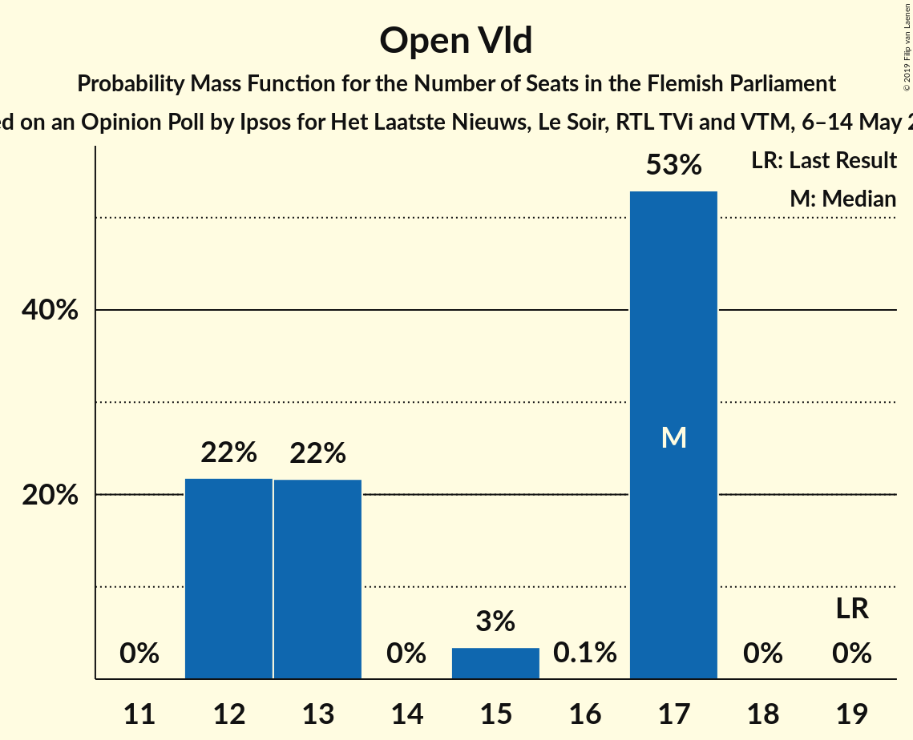

| Number of Seats | Probability | Accumulated | Special Marks |
|:---------------:|:-----------:|:-----------:|:-------------:|
| 11 | 0% | 100% |  |
| 12 | 22% | 99.9% |  |
| 13 | 22% | 78% |  |
| 14 | 0% | 56% |  |
| 15 | 3% | 56% |  |
| 16 | 0.1% | 53% |  |
| 17 | 53% | 53% | Median |
| 18 | 0% | 0% |  |
| 19 | 0% | 0% | Last Result |

### sp.a

*For a full overview of the results for this party, see the [sp.a](party-spa.html) page.*

| Number of Seats | Probability | Accumulated | Special Marks |
|:---------------:|:-----------:|:-----------:|:-------------:|
| 9 | 0.1% | 100% |  |
| 10 | 0.2% | 99.9% |  |
| 11 | 0% | 99.7% |  |
| 12 | 0% | 99.7% |  |
| 13 | 1.4% | 99.7% |  |
| 14 | 83% | 98% | Median |
| 15 | 1.2% | 15% |  |
| 16 | 3% | 14% |  |
| 17 | 3% | 11% |  |
| 18 | 8% | 8% | Last Result |
| 19 | 0.1% | 0.1% |  |
| 20 | 0% | 0% |  |

### PVDA

*For a full overview of the results for this party, see the [PVDA](party-pvda.html) page.*

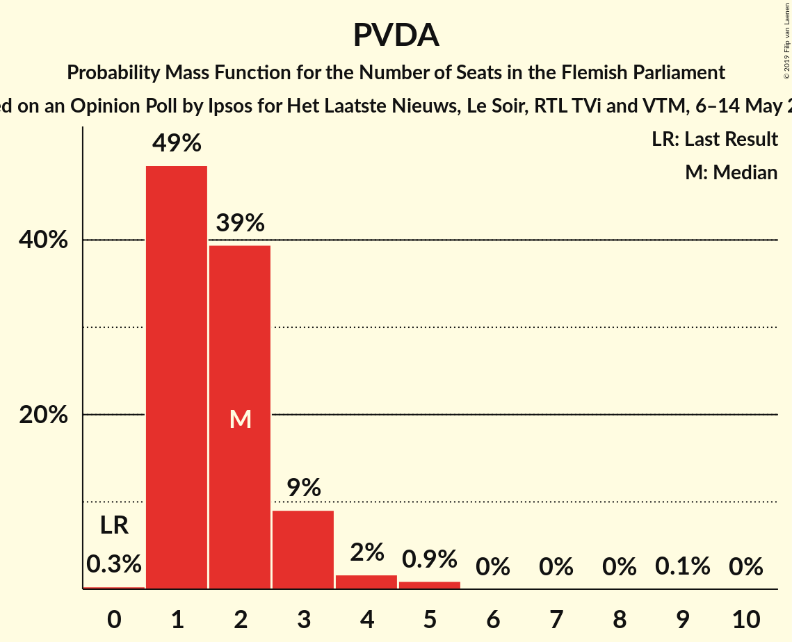

| Number of Seats | Probability | Accumulated | Special Marks |
|:---------------:|:-----------:|:-----------:|:-------------:|
| 0 | 0.3% | 100% | Last Result |
| 1 | 49% | 99.7% |  |
| 2 | 39% | 51% | Median |
| 3 | 9% | 12% |  |
| 4 | 2% | 3% |  |
| 5 | 0.9% | 1.0% |  |
| 6 | 0% | 0.1% |  |
| 7 | 0% | 0.1% |  |
| 8 | 0% | 0.1% |  |
| 9 | 0.1% | 0.1% |  |
| 10 | 0% | 0% |  |

## Coalitions

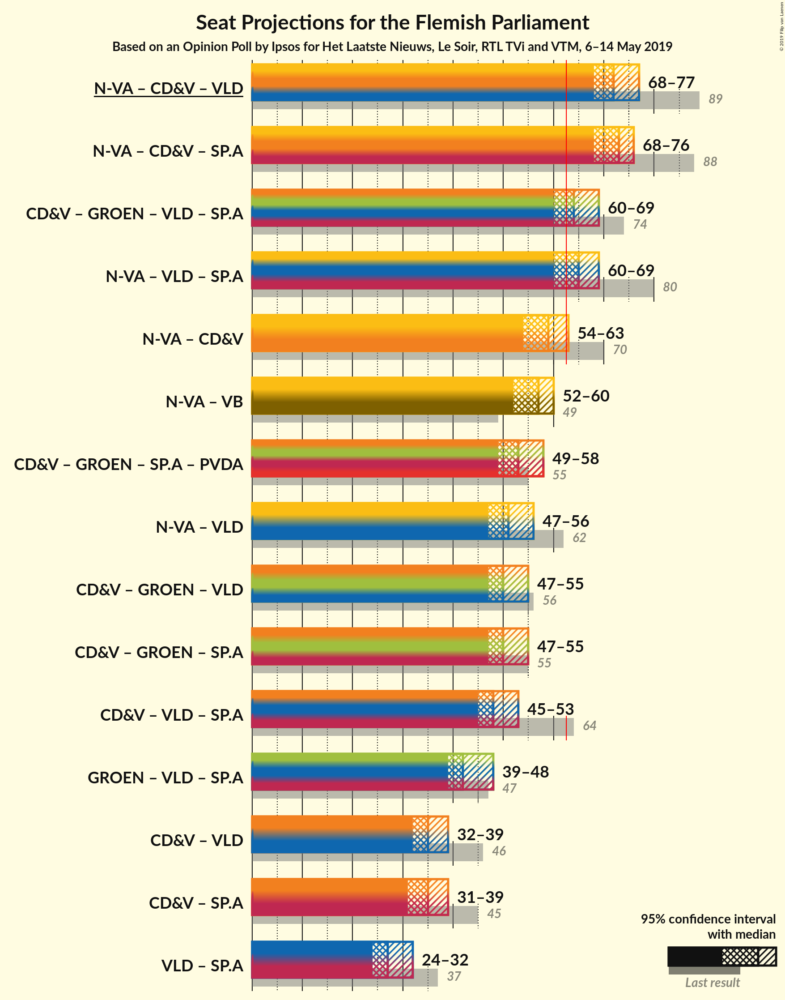

### Confidence Intervals

| Coalition | Last Result | Median | Majority? | 80% Confidence Interval | 90% Confidence Interval | 95% Confidence Interval | 99% Confidence Interval |
|:---------:|:-----------:|:------:|:---------:|:-----------------------:|:-----------------------:|:-----------------------:|:-----------------------:|
| N-VA – CD&V – sp.a | 88 | 71 | 100% | 71–77 | 70–77 | 70–77 | 67–77 |
| N-VA – CD&V – Open Vld | 89 | 74 | 100% | 71–76 | 68–76 | 68–76 | 65–76 |
| N-VA – Open Vld – sp.a | 80 | 66 | 94% | 64–69 | 62–70 | 62–70 | 59–70 |
| CD&V – Groen – Open Vld – sp.a | 74 | 68 | 99.7% | 63–68 | 63–68 | 63–68 | 63–68 |
| N-VA – CD&V | 70 | 57 | 12% | 57–63 | 54–63 | 53–63 | 53–63 |
| N-VA – Vlaams Belang | 49 | 54 | 0% | 54–58 | 54–58 | 53–58 | 53–58 |
| CD&V – Groen – sp.a – PVDA | 55 | 53 | 0% | 52–56 | 52–56 | 52–57 | 52–57 |
| N-VA – Open Vld | 62 | 52 | 0% | 50–52 | 47–56 | 46–56 | 45–56 |
| CD&V – Groen – sp.a | 55 | 51 | 0% | 51–53 | 51–53 | 51–55 | 51–55 |
| CD&V – Groen – Open Vld | 56 | 54 | 0% | 49–54 | 48–54 | 48–54 | 48–54 |
| CD&V – Open Vld – sp.a | 64 | 53 | 0% | 47–53 | 47–53 | 46–53 | 46–53 |
| Groen – Open Vld – sp.a | 47 | 46 | 0% | 41–46 | 41–48 | 41–50 | 41–50 |
| CD&V – sp.a | 45 | 36 | 0% | 35–39 | 34–39 | 34–41 | 34–41 |
| CD&V – Open Vld | 46 | 38 | 0% | 33–39 | 33–39 | 32–39 | 32–39 |
| Open Vld – sp.a | 37 | 31 | 0% | 26–31 | 26–31 | 26–32 | 26–32 |

### N-VA – CD&V – sp.a

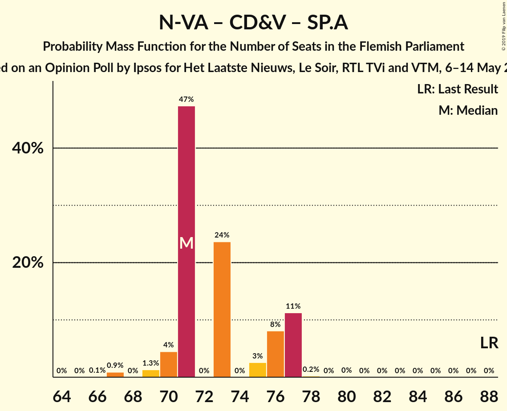

| Number of Seats | Probability | Accumulated | Special Marks |
|:---------------:|:-----------:|:-----------:|:-------------:|
| 66 | 0.1% | 100% |  |
| 67 | 0.9% | 99.9% |  |
| 68 | 0% | 99.0% |  |
| 69 | 1.3% | 99.0% |  |
| 70 | 4% | 98% |  |
| 71 | 47% | 93% | Median |
| 72 | 0% | 46% |  |
| 73 | 24% | 46% |  |
| 74 | 0% | 22% |  |
| 75 | 3% | 22% |  |
| 76 | 8% | 20% |  |
| 77 | 11% | 12% |  |
| 78 | 0.2% | 0.3% |  |
| 79 | 0% | 0% |  |
| 80 | 0% | 0% |  |
| 81 | 0% | 0% |  |
| 82 | 0% | 0% |  |
| 83 | 0% | 0% |  |
| 84 | 0% | 0% |  |
| 85 | 0% | 0% |  |
| 86 | 0% | 0% |  |
| 87 | 0% | 0% |  |
| 88 | 0% | 0% | Last Result |

### N-VA – CD&V – Open Vld

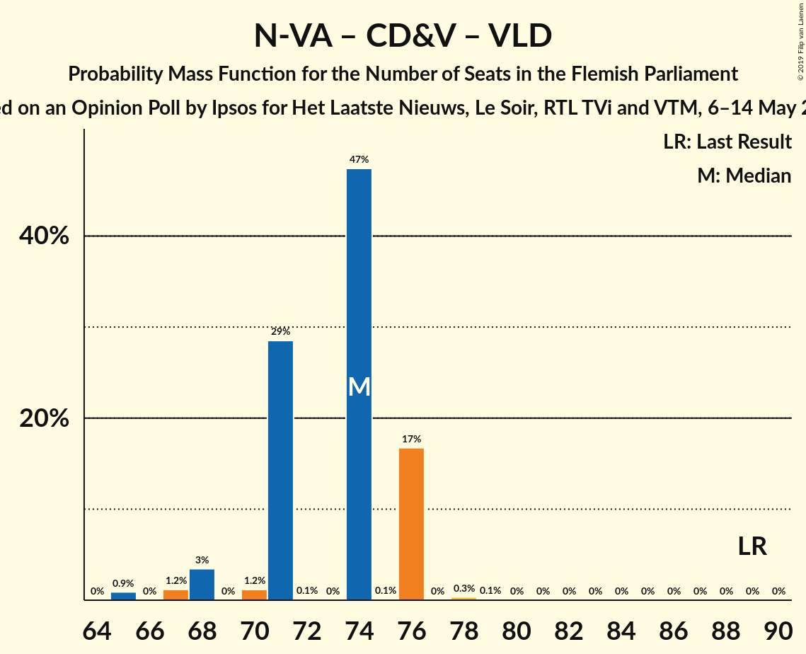

| Number of Seats | Probability | Accumulated | Special Marks |
|:---------------:|:-----------:|:-----------:|:-------------:|
| 65 | 0.9% | 100% |  |
| 66 | 0% | 99.1% |  |
| 67 | 1.2% | 99.1% |  |
| 68 | 3% | 98% |  |
| 69 | 0% | 94% |  |
| 70 | 1.2% | 94% |  |
| 71 | 29% | 93% |  |
| 72 | 0.1% | 65% |  |
| 73 | 0% | 65% |  |
| 74 | 47% | 65% | Median |
| 75 | 0.1% | 17% |  |
| 76 | 17% | 17% |  |
| 77 | 0% | 0.4% |  |
| 78 | 0.3% | 0.4% |  |
| 79 | 0.1% | 0.1% |  |
| 80 | 0% | 0% |  |
| 81 | 0% | 0% |  |
| 82 | 0% | 0% |  |
| 83 | 0% | 0% |  |
| 84 | 0% | 0% |  |
| 85 | 0% | 0% |  |
| 86 | 0% | 0% |  |
| 87 | 0% | 0% |  |
| 88 | 0% | 0% |  |
| 89 | 0% | 0% | Last Result |

### N-VA – Open Vld – sp.a

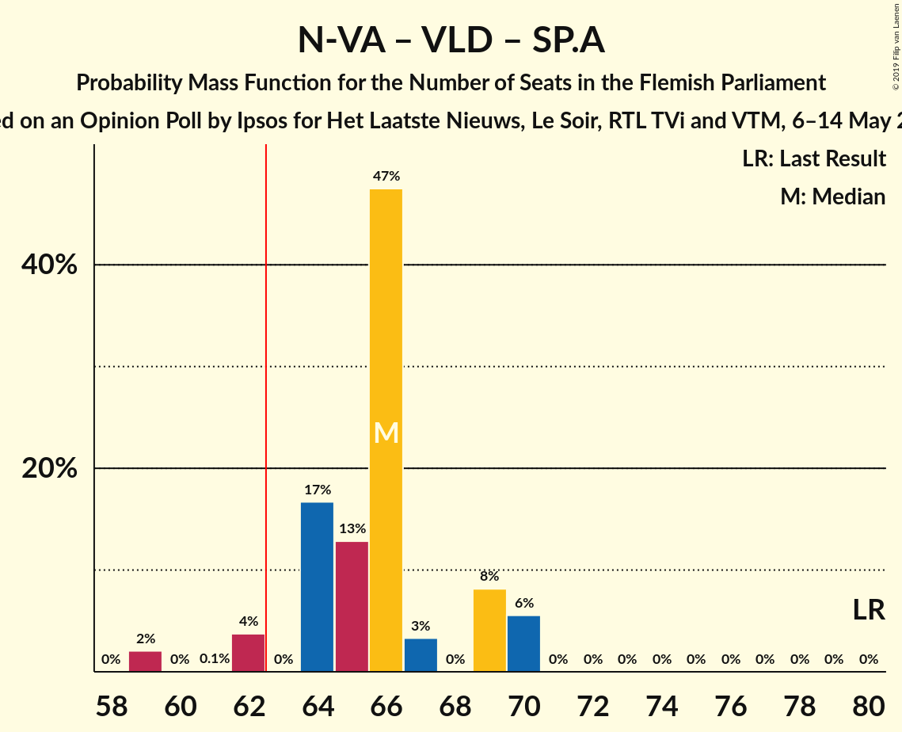

| Number of Seats | Probability | Accumulated | Special Marks |
|:---------------:|:-----------:|:-----------:|:-------------:|
| 59 | 2% | 100% |  |
| 60 | 0% | 98% |  |
| 61 | 0.1% | 98% |  |
| 62 | 4% | 98% |  |
| 63 | 0% | 94% | Majority |
| 64 | 17% | 94% |  |
| 65 | 13% | 77% |  |
| 66 | 47% | 65% | Median |
| 67 | 3% | 17% |  |
| 68 | 0% | 14% |  |
| 69 | 8% | 14% |  |
| 70 | 6% | 6% |  |
| 71 | 0% | 0% |  |
| 72 | 0% | 0% |  |
| 73 | 0% | 0% |  |
| 74 | 0% | 0% |  |
| 75 | 0% | 0% |  |
| 76 | 0% | 0% |  |
| 77 | 0% | 0% |  |
| 78 | 0% | 0% |  |
| 79 | 0% | 0% |  |
| 80 | 0% | 0% | Last Result |

### CD&V – Groen – Open Vld – sp.a

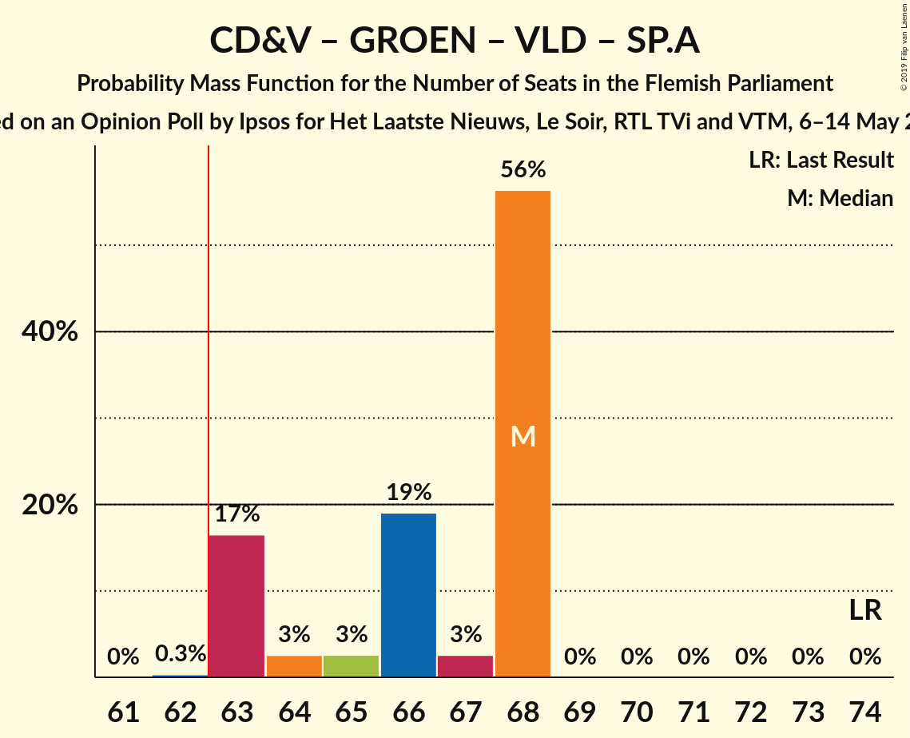

| Number of Seats | Probability | Accumulated | Special Marks |
|:---------------:|:-----------:|:-----------:|:-------------:|
| 62 | 0.3% | 100% |  |
| 63 | 17% | 99.7% | Majority |
| 64 | 3% | 83% |  |
| 65 | 3% | 81% |  |
| 66 | 19% | 78% |  |
| 67 | 3% | 59% |  |
| 68 | 56% | 56% | Median |
| 69 | 0% | 0% |  |
| 70 | 0% | 0% |  |
| 71 | 0% | 0% |  |
| 72 | 0% | 0% |  |
| 73 | 0% | 0% |  |
| 74 | 0% | 0% | Last Result |

### N-VA – CD&V

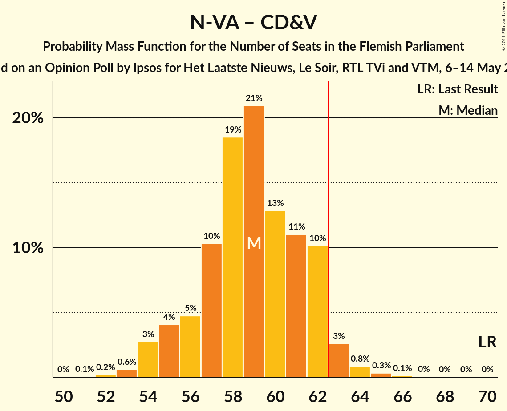

| Number of Seats | Probability | Accumulated | Special Marks |
|:---------------:|:-----------:|:-----------:|:-------------:|
| 53 | 4% | 100% |  |
| 54 | 1.2% | 96% |  |
| 55 | 0.1% | 95% |  |
| 56 | 0% | 94% |  |
| 57 | 49% | 94% | Median |
| 58 | 8% | 46% |  |
| 59 | 26% | 38% |  |
| 60 | 0.1% | 12% |  |
| 61 | 0% | 12% |  |
| 62 | 0% | 12% |  |
| 63 | 11% | 12% | Majority |
| 64 | 0.1% | 0.4% |  |
| 65 | 0.1% | 0.3% |  |
| 66 | 0.2% | 0.2% |  |
| 67 | 0% | 0% |  |
| 68 | 0% | 0% |  |
| 69 | 0% | 0% |  |
| 70 | 0% | 0% | Last Result |

### N-VA – Vlaams Belang

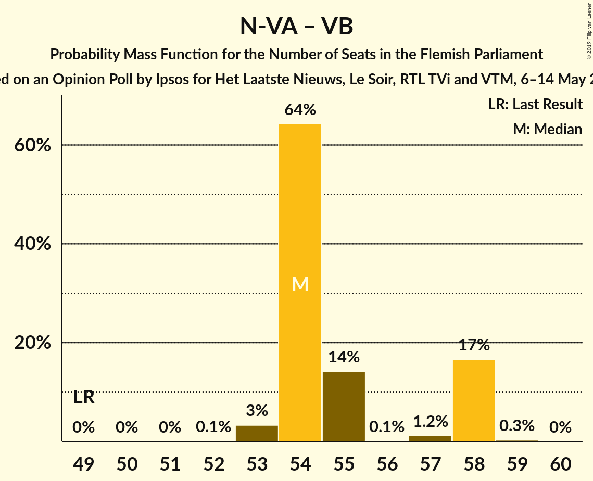

| Number of Seats | Probability | Accumulated | Special Marks |
|:---------------:|:-----------:|:-----------:|:-------------:|
| 49 | 0% | 100% | Last Result |
| 50 | 0% | 100% |  |
| 51 | 0% | 100% |  |
| 52 | 0.1% | 100% |  |
| 53 | 3% | 99.9% |  |
| 54 | 64% | 97% | Median |
| 55 | 14% | 32% |  |
| 56 | 0.1% | 18% |  |
| 57 | 1.2% | 18% |  |
| 58 | 17% | 17% |  |
| 59 | 0.3% | 0.3% |  |
| 60 | 0% | 0% |  |

### CD&V – Groen – sp.a – PVDA

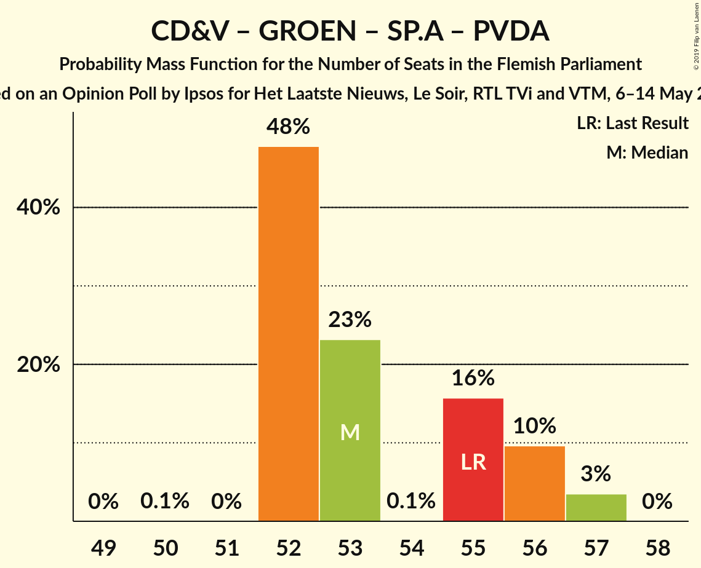

| Number of Seats | Probability | Accumulated | Special Marks |
|:---------------:|:-----------:|:-----------:|:-------------:|
| 50 | 0.1% | 100% |  |
| 51 | 0% | 99.9% |  |
| 52 | 48% | 99.9% |  |
| 53 | 23% | 52% | Median |
| 54 | 0.1% | 29% |  |
| 55 | 16% | 29% | Last Result |
| 56 | 10% | 13% |  |
| 57 | 3% | 4% |  |
| 58 | 0% | 0% |  |

### N-VA – Open Vld

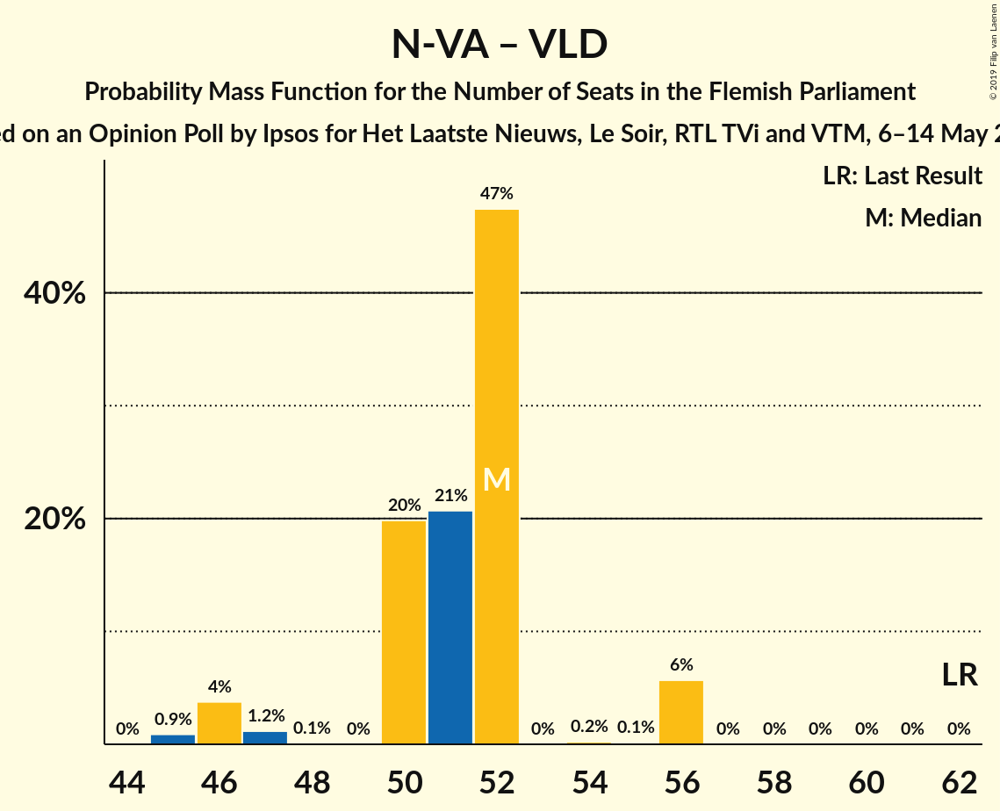

| Number of Seats | Probability | Accumulated | Special Marks |
|:---------------:|:-----------:|:-----------:|:-------------:|
| 45 | 0.9% | 100% |  |
| 46 | 4% | 99.1% |  |
| 47 | 1.2% | 95% |  |
| 48 | 0.1% | 94% |  |
| 49 | 0% | 94% |  |
| 50 | 20% | 94% |  |
| 51 | 21% | 74% |  |
| 52 | 47% | 54% | Median |
| 53 | 0% | 6% |  |
| 54 | 0.2% | 6% |  |
| 55 | 0.1% | 6% |  |
| 56 | 6% | 6% |  |
| 57 | 0% | 0% |  |
| 58 | 0% | 0% |  |
| 59 | 0% | 0% |  |
| 60 | 0% | 0% |  |
| 61 | 0% | 0% |  |
| 62 | 0% | 0% | Last Result |

### CD&V – Groen – sp.a

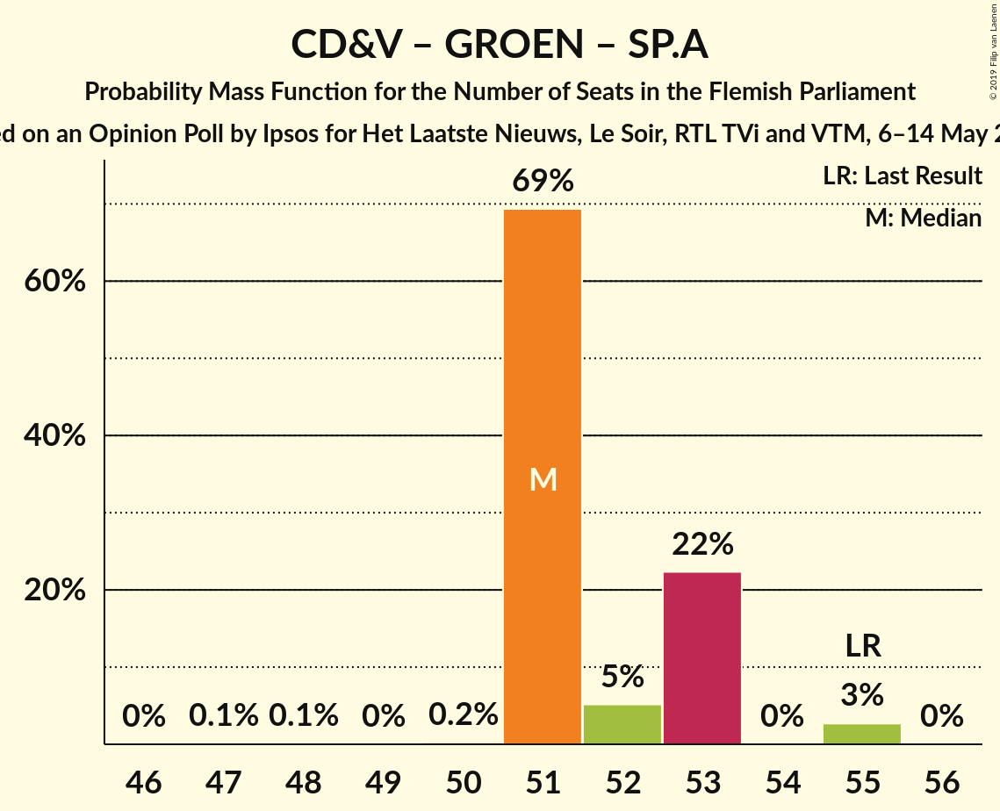

| Number of Seats | Probability | Accumulated | Special Marks |
|:---------------:|:-----------:|:-----------:|:-------------:|
| 47 | 0.1% | 100% |  |
| 48 | 0.1% | 99.9% |  |
| 49 | 0% | 99.8% |  |
| 50 | 0.2% | 99.8% |  |
| 51 | 69% | 99.6% | Median |
| 52 | 5% | 30% |  |
| 53 | 22% | 25% |  |
| 54 | 0% | 3% |  |
| 55 | 3% | 3% | Last Result |
| 56 | 0% | 0% |  |

### CD&V – Groen – Open Vld

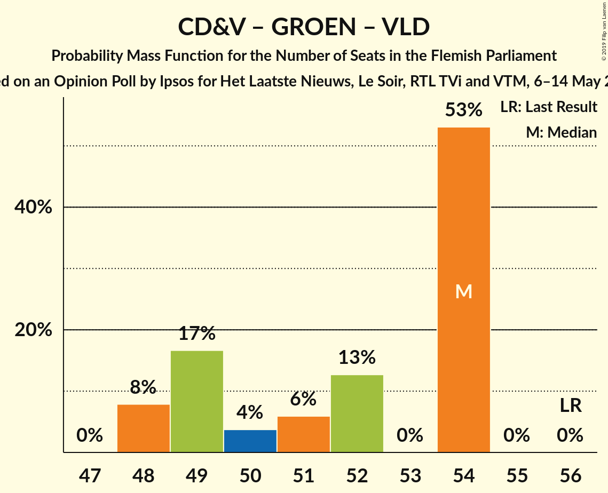

| Number of Seats | Probability | Accumulated | Special Marks |
|:---------------:|:-----------:|:-----------:|:-------------:|
| 48 | 8% | 100% |  |
| 49 | 17% | 92% |  |
| 50 | 4% | 75% |  |
| 51 | 6% | 72% |  |
| 52 | 13% | 66% |  |
| 53 | 0% | 53% |  |
| 54 | 53% | 53% | Median |
| 55 | 0% | 0% |  |
| 56 | 0% | 0% | Last Result |

### CD&V – Open Vld – sp.a

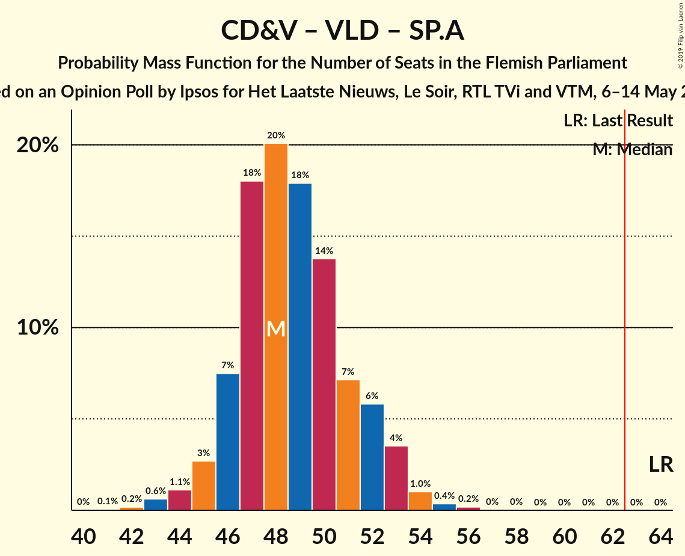

| Number of Seats | Probability | Accumulated | Special Marks |
|:---------------:|:-----------:|:-----------:|:-------------:|
| 43 | 0.1% | 100% |  |
| 44 | 0.1% | 99.9% |  |
| 45 | 0% | 99.8% |  |
| 46 | 3% | 99.8% |  |
| 47 | 16% | 97% |  |
| 48 | 1.4% | 81% |  |
| 49 | 0% | 79% |  |
| 50 | 5% | 79% |  |
| 51 | 13% | 75% |  |
| 52 | 11% | 61% |  |
| 53 | 50% | 50% | Median |
| 54 | 0.2% | 0.2% |  |
| 55 | 0% | 0% |  |
| 56 | 0% | 0% |  |
| 57 | 0% | 0% |  |
| 58 | 0% | 0% |  |
| 59 | 0% | 0% |  |
| 60 | 0% | 0% |  |
| 61 | 0% | 0% |  |
| 62 | 0% | 0% |  |
| 63 | 0% | 0% | Majority |
| 64 | 0% | 0% | Last Result |

### Groen – Open Vld – sp.a

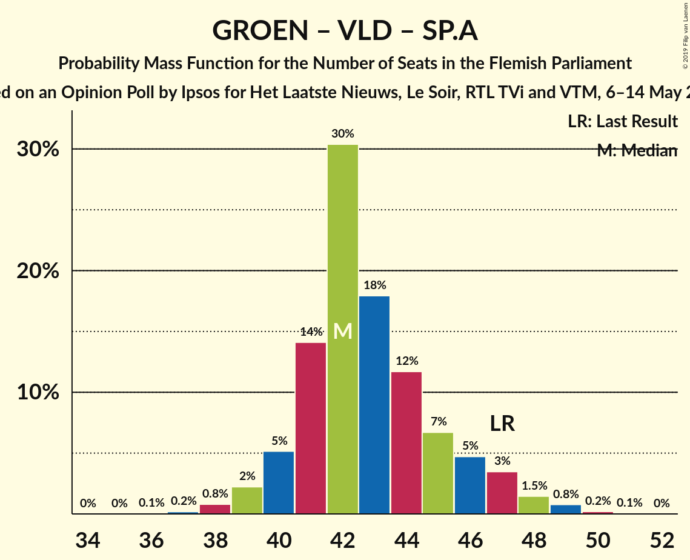

| Number of Seats | Probability | Accumulated | Special Marks |
|:---------------:|:-----------:|:-----------:|:-------------:|
| 38 | 0.2% | 100% |  |
| 39 | 0% | 99.8% |  |
| 40 | 0% | 99.8% |  |
| 41 | 12% | 99.8% |  |
| 42 | 19% | 87% |  |
| 43 | 0.2% | 68% |  |
| 44 | 3% | 68% |  |
| 45 | 1.2% | 65% |  |
| 46 | 55% | 64% | Median |
| 47 | 0% | 9% | Last Result |
| 48 | 6% | 9% |  |
| 49 | 0.1% | 3% |  |
| 50 | 3% | 3% |  |
| 51 | 0% | 0% |  |

### CD&V – sp.a

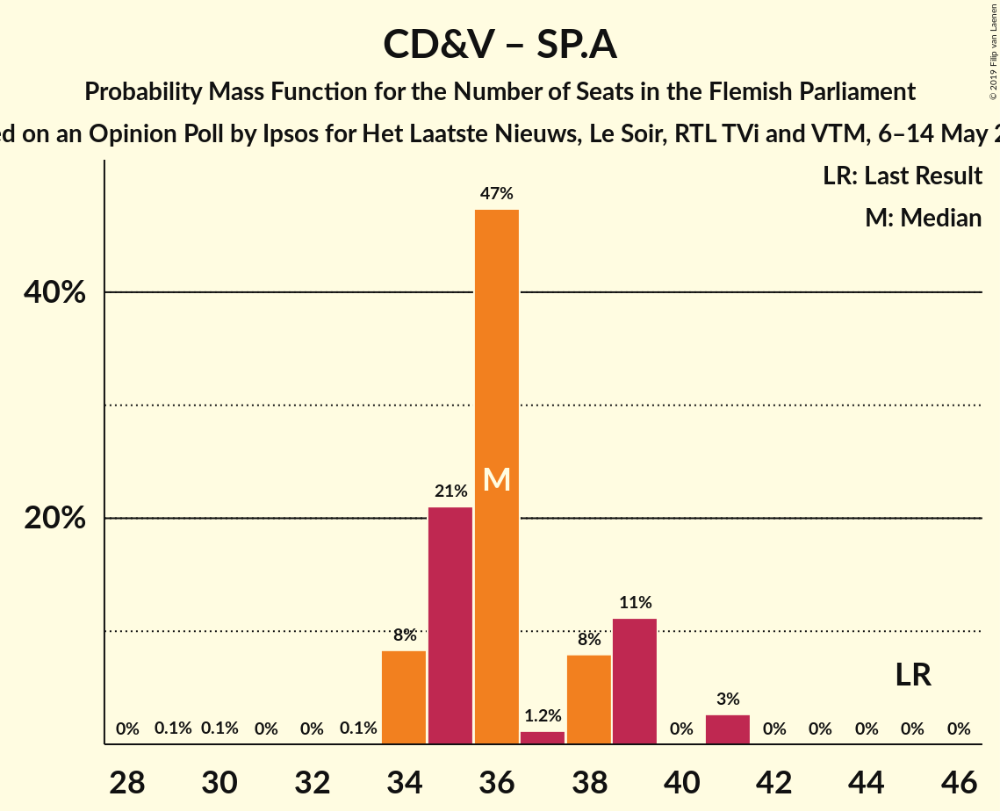

| Number of Seats | Probability | Accumulated | Special Marks |
|:---------------:|:-----------:|:-----------:|:-------------:|
| 29 | 0.1% | 100% |  |
| 30 | 0.1% | 99.9% |  |
| 31 | 0% | 99.9% |  |
| 32 | 0% | 99.8% |  |
| 33 | 0.1% | 99.8% |  |
| 34 | 8% | 99.7% |  |
| 35 | 21% | 91% |  |
| 36 | 47% | 70% | Median |
| 37 | 1.2% | 23% |  |
| 38 | 8% | 22% |  |
| 39 | 11% | 14% |  |
| 40 | 0% | 3% |  |
| 41 | 3% | 3% |  |
| 42 | 0% | 0% |  |
| 43 | 0% | 0% |  |
| 44 | 0% | 0% |  |
| 45 | 0% | 0% | Last Result |

### CD&V – Open Vld

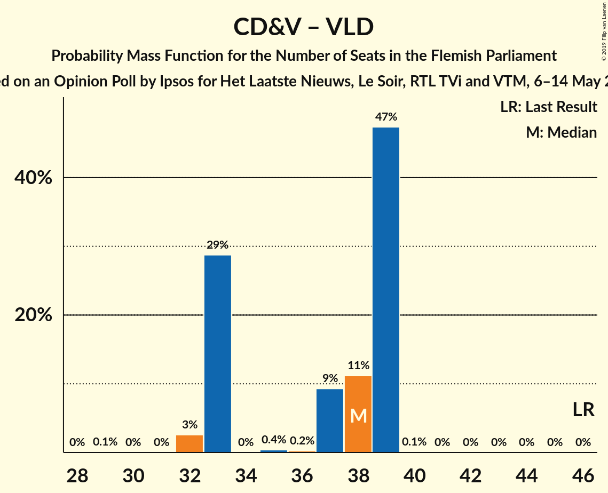

| Number of Seats | Probability | Accumulated | Special Marks |
|:---------------:|:-----------:|:-----------:|:-------------:|
| 29 | 0.1% | 100% |  |
| 30 | 0% | 99.9% |  |
| 31 | 0% | 99.9% |  |
| 32 | 3% | 99.9% |  |
| 33 | 29% | 97% |  |
| 34 | 0% | 69% |  |
| 35 | 0.4% | 69% |  |
| 36 | 0.2% | 68% |  |
| 37 | 9% | 68% |  |
| 38 | 11% | 59% |  |
| 39 | 47% | 47% | Median |
| 40 | 0.1% | 0.1% |  |
| 41 | 0% | 0% |  |
| 42 | 0% | 0% |  |
| 43 | 0% | 0% |  |
| 44 | 0% | 0% |  |
| 45 | 0% | 0% |  |
| 46 | 0% | 0% | Last Result |

### Open Vld – sp.a

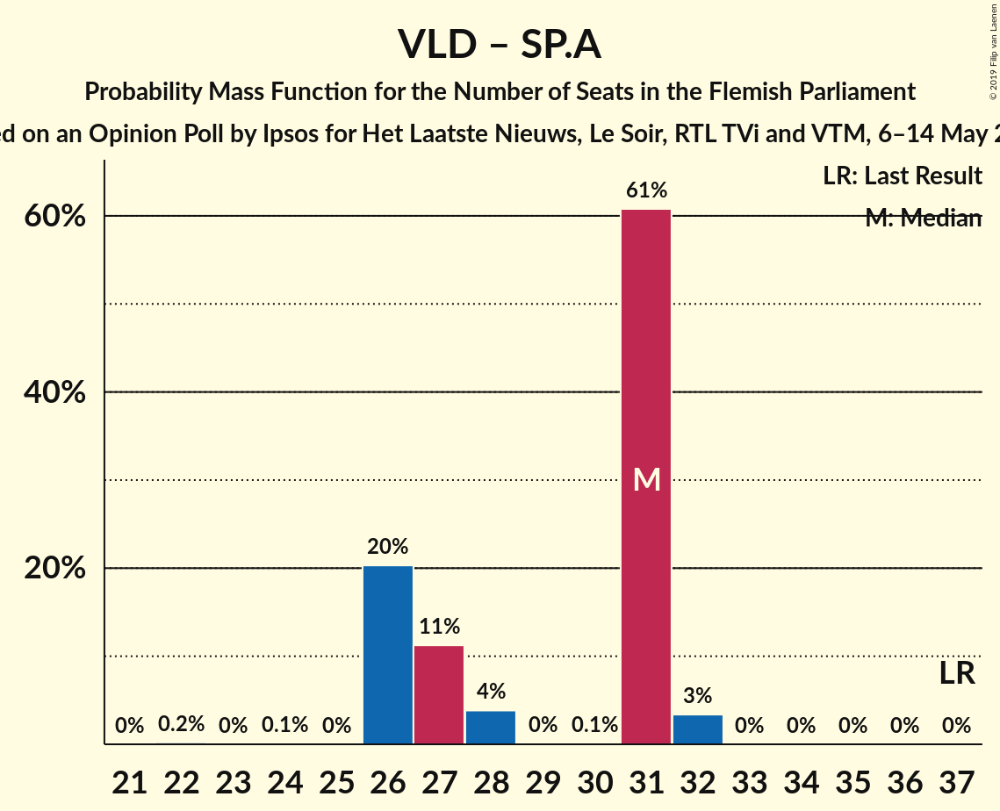

| Number of Seats | Probability | Accumulated | Special Marks |
|:---------------:|:-----------:|:-----------:|:-------------:|
| 22 | 0.2% | 100% |  |
| 23 | 0% | 99.8% |  |
| 24 | 0.1% | 99.8% |  |
| 25 | 0% | 99.7% |  |
| 26 | 20% | 99.7% |  |
| 27 | 11% | 79% |  |
| 28 | 4% | 68% |  |
| 29 | 0% | 64% |  |
| 30 | 0.1% | 64% |  |
| 31 | 61% | 64% | Median |
| 32 | 3% | 3% |  |
| 33 | 0% | 0% |  |
| 34 | 0% | 0% |  |
| 35 | 0% | 0% |  |
| 36 | 0% | 0% |  |
| 37 | 0% | 0% | Last Result |

## Technical Information

### Opinion Poll

+ **Polling firm:** Ipsos
+ **Commissioner(s):** Het Laatste Nieuws, Le Soir, RTL TVi and VTM
+ **Fieldwork period:** 6–14 May 2019

### Calculations

+ **Sample size:** 1003
+ **Simulations done:** 1,024
+ **Error estimate:** 3.64%

