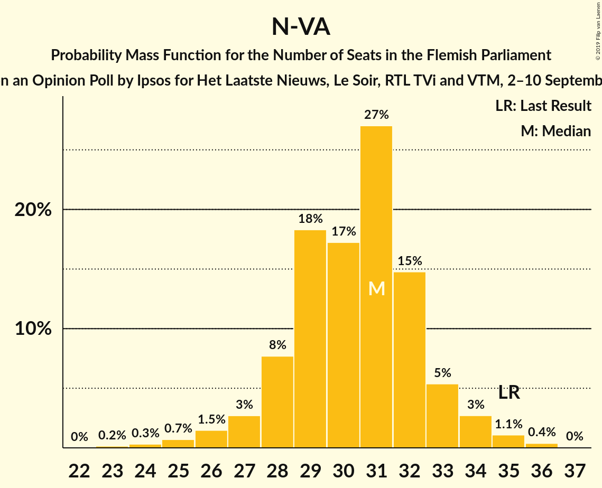
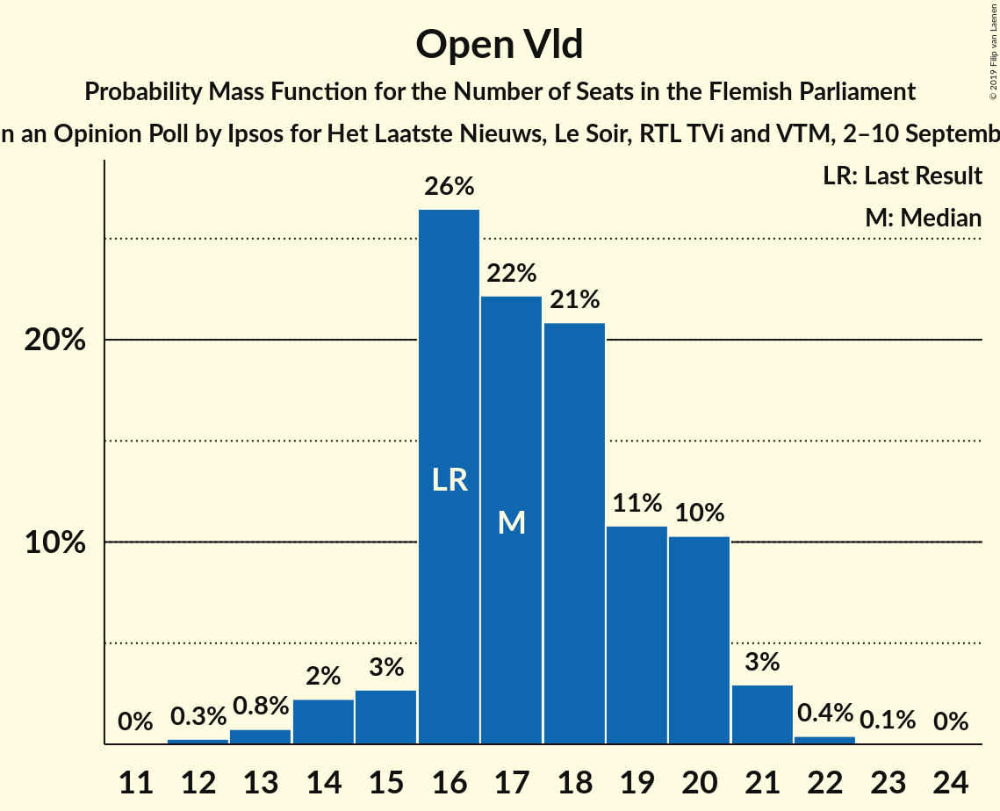
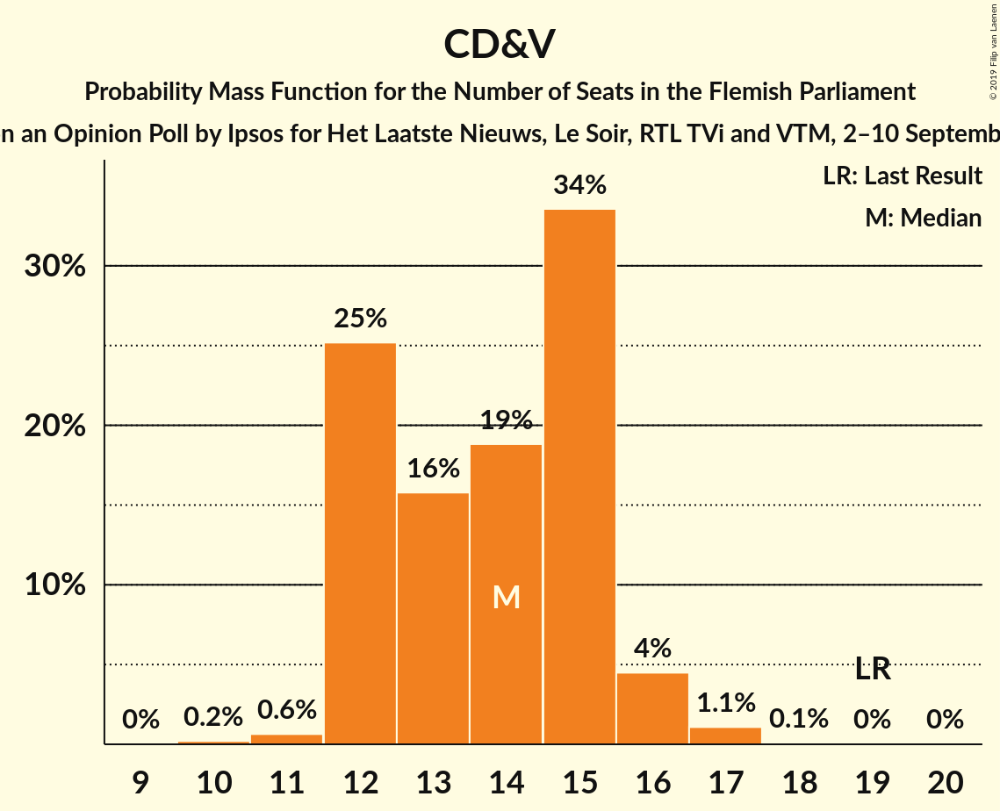
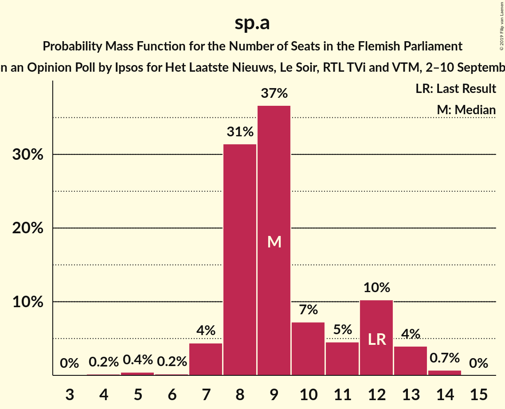
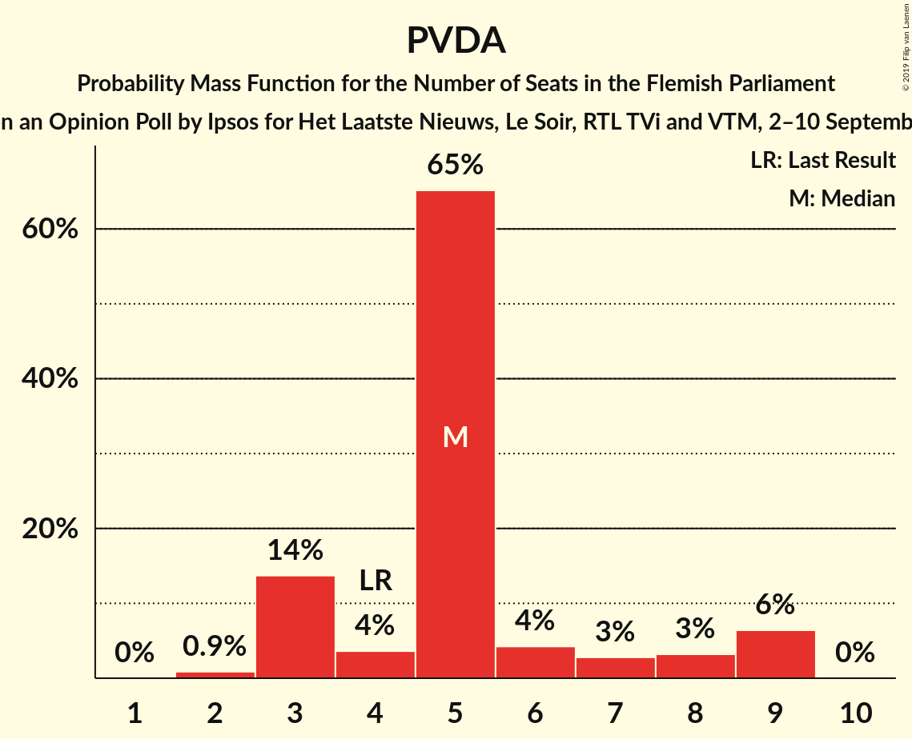
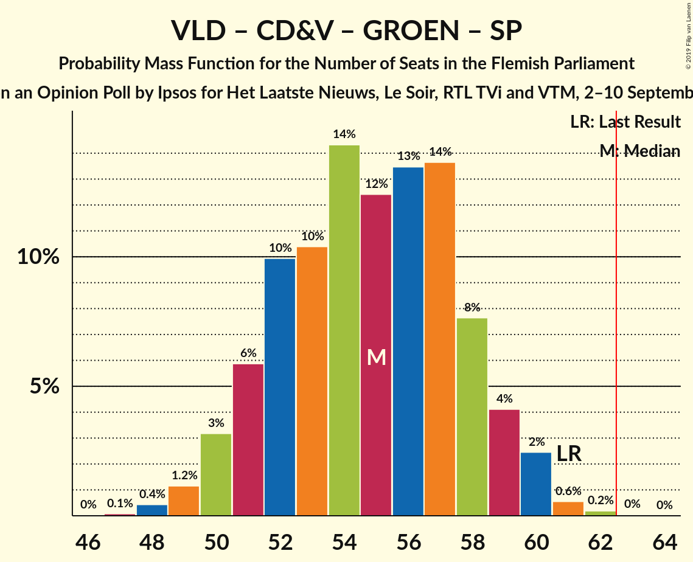
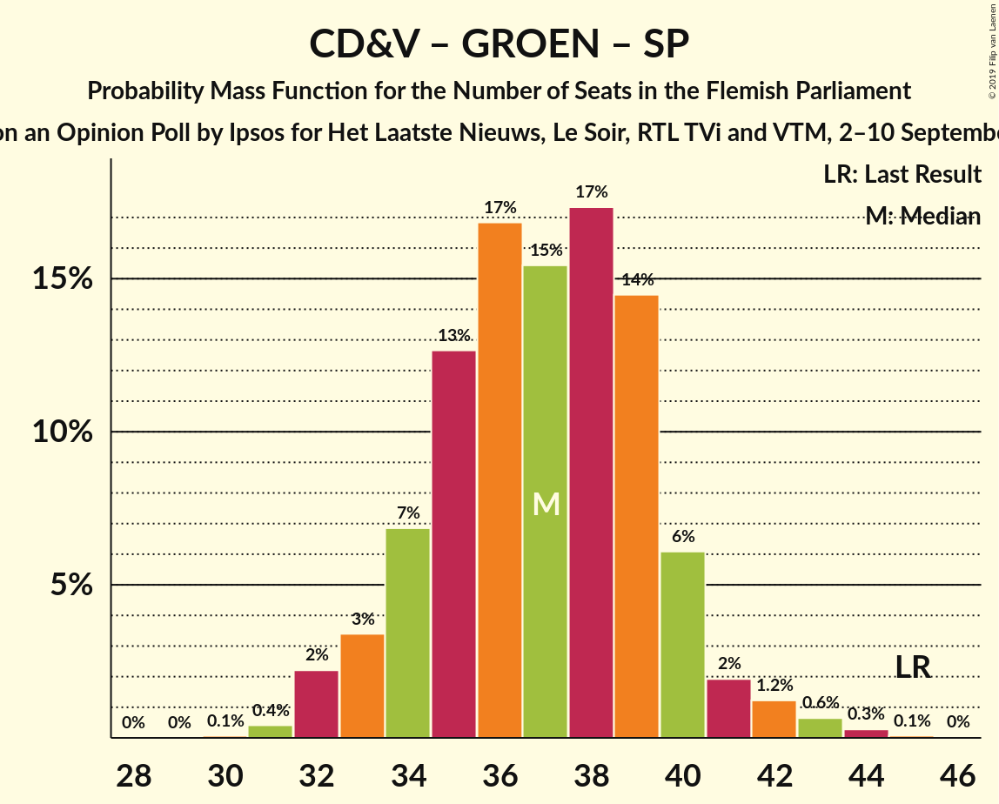

# Opinion Poll by Ipsos for Het Laatste Nieuws, Le Soir, RTL TVi and VTM, 2–10 September 2019

<a href="#voting-intentions">Voting Intentions</a> | <a href="#seats">Seats</a> | <a href="#coalitions">Coalitions</a> | <a href="#technical-information">Technical Information</a>

## Voting Intentions

### Confidence Intervals

| Party | Last Result | Poll Result | 80% Confidence Interval | 90% Confidence Interval | 95% Confidence Interval | 99% Confidence Interval |
|:-----:|:-----------:|:-----------:|:-----------------------:|:-----------------------:|:-----------------------:|:-----------------------:|
| Vlaams Belang | 18.5% | 24.9% | 23.2–26.7% |22.7–27.2% |22.3–27.7% |21.5–28.6% |
| N-VA | 24.8% | 22.7% | 21.1–24.5% |20.6–25.0% |20.2–25.4% |19.4–26.3% |
| Open Vld | 13.1% | 13.3% | 12.0–14.8% |11.6–15.2% |11.3–15.6% |10.7–16.3% |
| CD&V | 15.4% | 11.7% | 10.5–13.1% |10.1–13.5% |9.8–13.9% |9.3–14.5% |
| Groen | 10.1% | 11.0% | 9.8–12.4% |9.5–12.8% |9.2–13.1% |8.7–13.8% |
| sp.a | 10.1% | 8.4% | 7.4–9.6% |7.1–10.0% |6.8–10.3% |6.4–10.9% |
| PVDA | 5.3% | 6.2% | 5.3–7.3% |5.1–7.6% |4.9–7.9% |4.5–8.4% |

*Note:* The poll result column reflects the actual value used in the calculations. Published results may vary slightly, and in addition be rounded to fewer digits.

## Seats

### Confidence Intervals

| Party | Last Result | Median | 80% Confidence Interval | 90% Confidence Interval | 95% Confidence Interval | 99% Confidence Interval |
|:-----:|:-----------:|:------:|:-----------------------:|:-----------------------:|:-----------------------:|:-----------------------:|
| <a href="#vlaams-belang">Vlaams Belang</a> | 23 | 32 | 30–35 |30–36 |30–37 |28–38 |
| <a href="#n-va">N-VA</a> | 35 | 31 | 28–32 |27–33 |26–34 |25–35 |
| <a href="#open-vld">Open Vld</a> | 16 | 18 | 16–20 |15–21 |14–21 |13–22 |
| <a href="#cd&v">CD&V</a> | 19 | 14 | 12–15 |12–15 |12–16 |11–17 |
| <a href="#groen">Groen</a> | 14 | 14 | 12–15 |11–17 |11–18 |11–18 |
| <a href="#sp.a">sp.a</a> | 12 | 9 | 8–12 |7–12 |7–13 |5–14 |
| <a href="#pvda">PVDA</a> | 4 | 5 | 3–8 |3–9 |3–9 |2–9 |

### Vlaams Belang

*For a full overview of the results for this party, see the [Vlaams Belang](party-vlaamsbelang.html) page.*

| Number of Seats | Probability | Accumulated | Special Marks |
|:---------------:|:-----------:|:-----------:|:-------------:|
| 23 | 0% | 100% | Last Result |
| 24 | 0% | 100% |  |
| 25 | 0% | 100% |  |
| 26 | 0.1% | 100% |  |
| 27 | 0.2% | 99.9% |  |
| 28 | 0.3% | 99.7% |  |
| 29 | 2% | 99.4% |  |
| 30 | 23% | 98% |  |
| 31 | 15% | 75% |  |
| 32 | 11% | 59% | Median |
| 33 | 11% | 49% |  |
| 34 | 16% | 37% |  |
| 35 | 13% | 22% |  |
| 36 | 5% | 8% |  |
| 37 | 2% | 3% |  |
| 38 | 1.0% | 1.2% |  |
| 39 | 0.1% | 0.2% |  |
| 40 | 0% | 0.1% |  |
| 41 | 0% | 0% |  |

### N-VA

*For a full overview of the results for this party, see the [N-VA](party-n-va.html) page.*

| Number of Seats | Probability | Accumulated | Special Marks |
|:---------------:|:-----------:|:-----------:|:-------------:|
| 23 | 0.2% | 100% |  |
| 24 | 0.3% | 99.8% |  |
| 25 | 0.7% | 99.5% |  |
| 26 | 1.5% | 98.8% |  |
| 27 | 3% | 97% |  |
| 28 | 8% | 95% |  |
| 29 | 18% | 87% |  |
| 30 | 17% | 69% |  |
| 31 | 27% | 51% | Median |
| 32 | 15% | 24% |  |
| 33 | 5% | 10% |  |
| 34 | 3% | 4% |  |
| 35 | 1.1% | 2% | Last Result |
| 36 | 0.4% | 0.4% |  |
| 37 | 0% | 0% |  |

### Open Vld

*For a full overview of the results for this party, see the [Open Vld](party-openvld.html) page.*

| Number of Seats | Probability | Accumulated | Special Marks |
|:---------------:|:-----------:|:-----------:|:-------------:|
| 12 | 0.4% | 100% |  |
| 13 | 0.9% | 99.6% |  |
| 14 | 1.3% | 98.7% |  |
| 15 | 3% | 97% |  |
| 16 | 17% | 95% | Last Result |
| 17 | 21% | 77% |  |
| 18 | 19% | 57% | Median |
| 19 | 19% | 37% |  |
| 20 | 12% | 18% |  |
| 21 | 5% | 6% |  |
| 22 | 0.6% | 0.8% |  |
| 23 | 0.1% | 0.2% |  |
| 24 | 0% | 0% |  |

### CD&V

*For a full overview of the results for this party, see the [CD&V](party-cdv.html) page.*

| Number of Seats | Probability | Accumulated | Special Marks |
|:---------------:|:-----------:|:-----------:|:-------------:|
| 9 | 0.1% | 100% |  |
| 10 | 0.2% | 99.9% |  |
| 11 | 1.3% | 99.7% |  |
| 12 | 31% | 98% |  |
| 13 | 15% | 68% |  |
| 14 | 20% | 53% | Median |
| 15 | 28% | 33% |  |
| 16 | 4% | 5% |  |
| 17 | 0.5% | 0.8% |  |
| 18 | 0.1% | 0.3% |  |
| 19 | 0.1% | 0.2% | Last Result |
| 20 | 0.1% | 0.1% |  |
| 21 | 0% | 0% |  |

### Groen

*For a full overview of the results for this party, see the [Groen](party-groen.html) page.*

| Number of Seats | Probability | Accumulated | Special Marks |
|:---------------:|:-----------:|:-----------:|:-------------:|
| 10 | 0.5% | 100% |  |
| 11 | 5% | 99.5% |  |
| 12 | 5% | 94% |  |
| 13 | 9% | 89% |  |
| 14 | 30% | 79% | Last Result, Median |
| 15 | 42% | 50% |  |
| 16 | 3% | 8% |  |
| 17 | 2% | 5% |  |
| 18 | 3% | 3% |  |
| 19 | 0.1% | 0.2% |  |
| 20 | 0% | 0% |  |

### sp.a

*For a full overview of the results for this party, see the [sp.a](party-spa.html) page.*

| Number of Seats | Probability | Accumulated | Special Marks |
|:---------------:|:-----------:|:-----------:|:-------------:|
| 4 | 0.2% | 100% |  |
| 5 | 0.8% | 99.8% |  |
| 6 | 0.6% | 99.0% |  |
| 7 | 6% | 98% |  |
| 8 | 32% | 93% |  |
| 9 | 35% | 61% | Median |
| 10 | 10% | 26% |  |
| 11 | 5% | 16% |  |
| 12 | 7% | 11% | Last Result |
| 13 | 4% | 4% |  |
| 14 | 0.7% | 0.7% |  |
| 15 | 0% | 0% |  |

### PVDA

*For a full overview of the results for this party, see the [PVDA](party-pvda.html) page.*

| Number of Seats | Probability | Accumulated | Special Marks |
|:---------------:|:-----------:|:-----------:|:-------------:|
| 2 | 1.2% | 100% |  |
| 3 | 11% | 98.8% |  |
| 4 | 3% | 87% | Last Result |
| 5 | 63% | 85% | Median |
| 6 | 5% | 22% |  |
| 7 | 4% | 17% |  |
| 8 | 6% | 13% |  |
| 9 | 7% | 7% |  |
| 10 | 0% | 0% |  |

## Coalitions

### Confidence Intervals

| Coalition | Last Result | Median | Majority? | 80% Confidence Interval | 90% Confidence Interval | 95% Confidence Interval | 99% Confidence Interval |
|:---------:|:-----------:|:------:|:---------:|:-----------------------:|:-----------------------:|:-----------------------:|:-----------------------:|
| Vlaams Belang – N-VA | 58 | 63 | 54% | 60–66 | 59–67 | 58–68 | 57–69 |
| N-VA – Open Vld – CD&V | 70 | 62 | 39% | 59–65 | 58–66 | 57–67 | 55–68 |
| N-VA – Open Vld – sp.a | 63 | 57 | 1.1% | 54–60 | 53–61 | 52–62 | 51–63 |
| Open Vld – CD&V – Groen – sp.a | 61 | 55 | 0.1% | 51–58 | 51–59 | 50–60 | 48–61 |
| N-VA – CD&V – sp.a | 66 | 53 | 0% | 50–56 | 49–57 | 48–58 | 46–59 |
| N-VA – Open Vld | 51 | 48 | 0% | 46–51 | 45–51 | 44–52 | 41–53 |
| Open Vld – CD&V – Groen | 49 | 46 | 0% | 43–49 | 42–50 | 41–50 | 40–52 |
| N-VA – CD&V | 54 | 44 | 0% | 41–47 | 40–48 | 40–48 | 38–50 |
| CD&V – Groen – sp.a – PVDA | 49 | 42 | 0% | 39–45 | 38–47 | 37–47 | 36–49 |
| Open Vld – Groen – sp.a | 42 | 41 | 0% | 38–44 | 38–45 | 37–46 | 35–47 |
| Open Vld – CD&V – sp.a | 47 | 41 | 0% | 37–44 | 36–45 | 36–45 | 34–46 |
| CD&V – Groen – sp.a | 45 | 37 | 0% | 34–40 | 33–40 | 32–41 | 32–43 |
| Open Vld – CD&V | 35 | 31 | 0% | 29–35 | 28–35 | 27–36 | 26–37 |
| Open Vld – sp.a | 28 | 27 | 0% | 24–30 | 24–30 | 23–31 | 21–33 |
| CD&V – sp.a | 31 | 23 | 0% | 20–25 | 20–26 | 20–27 | 19–28 |

### Vlaams Belang – N-VA

| Number of Seats | Probability | Accumulated | Special Marks |
|:---------------:|:-----------:|:-----------:|:-------------:|
| 55 | 0.1% | 100% |  |
| 56 | 0.3% | 99.9% |  |
| 57 | 0.9% | 99.6% |  |
| 58 | 3% | 98.7% | Last Result |
| 59 | 5% | 96% |  |
| 60 | 9% | 90% |  |
| 61 | 14% | 82% |  |
| 62 | 14% | 68% |  |
| 63 | 13% | 54% | Median, Majority |
| 64 | 13% | 41% |  |
| 65 | 10% | 28% |  |
| 66 | 10% | 18% |  |
| 67 | 5% | 8% |  |
| 68 | 2% | 3% |  |
| 69 | 0.9% | 1.3% |  |
| 70 | 0.2% | 0.3% |  |
| 71 | 0.1% | 0.1% |  |
| 72 | 0% | 0% |  |

### N-VA – Open Vld – CD&V

| Number of Seats | Probability | Accumulated | Special Marks |
|:---------------:|:-----------:|:-----------:|:-------------:|
| 53 | 0.1% | 100% |  |
| 54 | 0.2% | 99.9% |  |
| 55 | 0.4% | 99.7% |  |
| 56 | 1.2% | 99.3% |  |
| 57 | 3% | 98% |  |
| 58 | 4% | 95% |  |
| 59 | 6% | 92% |  |
| 60 | 17% | 85% |  |
| 61 | 14% | 69% |  |
| 62 | 16% | 54% |  |
| 63 | 13% | 39% | Median, Majority |
| 64 | 11% | 26% |  |
| 65 | 8% | 15% |  |
| 66 | 4% | 6% |  |
| 67 | 2% | 3% |  |
| 68 | 0.7% | 0.9% |  |
| 69 | 0.1% | 0.1% |  |
| 70 | 0% | 0% | Last Result |

### N-VA – Open Vld – sp.a

| Number of Seats | Probability | Accumulated | Special Marks |
|:---------------:|:-----------:|:-----------:|:-------------:|
| 49 | 0.1% | 100% |  |
| 50 | 0.3% | 99.9% |  |
| 51 | 0.5% | 99.6% |  |
| 52 | 2% | 99.0% |  |
| 53 | 4% | 97% |  |
| 54 | 6% | 93% |  |
| 55 | 11% | 87% |  |
| 56 | 11% | 76% |  |
| 57 | 17% | 65% |  |
| 58 | 14% | 49% | Median |
| 59 | 16% | 35% |  |
| 60 | 10% | 19% |  |
| 61 | 5% | 9% |  |
| 62 | 3% | 4% |  |
| 63 | 0.7% | 1.1% | Last Result, Majority |
| 64 | 0.3% | 0.4% |  |
| 65 | 0.1% | 0.1% |  |
| 66 | 0% | 0% |  |

### Open Vld – CD&V – Groen – sp.a

| Number of Seats | Probability | Accumulated | Special Marks |
|:---------------:|:-----------:|:-----------:|:-------------:|
| 46 | 0% | 100% |  |
| 47 | 0.1% | 99.9% |  |
| 48 | 0.4% | 99.9% |  |
| 49 | 1.2% | 99.4% |  |
| 50 | 3% | 98% |  |
| 51 | 6% | 95% |  |
| 52 | 10% | 89% |  |
| 53 | 10% | 79% |  |
| 54 | 14% | 69% |  |
| 55 | 12% | 55% | Median |
| 56 | 13% | 42% |  |
| 57 | 14% | 29% |  |
| 58 | 8% | 15% |  |
| 59 | 4% | 7% |  |
| 60 | 2% | 3% |  |
| 61 | 0.6% | 0.8% | Last Result |
| 62 | 0.2% | 0.3% |  |
| 63 | 0% | 0.1% | Majority |
| 64 | 0% | 0% |  |

### N-VA – CD&V – sp.a

| Number of Seats | Probability | Accumulated | Special Marks |
|:---------------:|:-----------:|:-----------:|:-------------:|
| 45 | 0.1% | 100% |  |
| 46 | 0.3% | 99.8% |  |
| 47 | 0.9% | 99.5% |  |
| 48 | 2% | 98.6% |  |
| 49 | 4% | 97% |  |
| 50 | 7% | 93% |  |
| 51 | 12% | 86% |  |
| 52 | 18% | 75% |  |
| 53 | 16% | 57% |  |
| 54 | 14% | 41% | Median |
| 55 | 9% | 27% |  |
| 56 | 9% | 18% |  |
| 57 | 6% | 9% |  |
| 58 | 2% | 3% |  |
| 59 | 0.6% | 1.0% |  |
| 60 | 0.2% | 0.3% |  |
| 61 | 0.1% | 0.1% |  |
| 62 | 0% | 0% |  |
| 63 | 0% | 0% | Majority |
| 64 | 0% | 0% |  |
| 65 | 0% | 0% |  |
| 66 | 0% | 0% | Last Result |

### N-VA – Open Vld

| Number of Seats | Probability | Accumulated | Special Marks |
|:---------------:|:-----------:|:-----------:|:-------------:|
| 39 | 0.1% | 100% |  |
| 40 | 0.3% | 99.9% |  |
| 41 | 0.4% | 99.6% |  |
| 42 | 0.5% | 99.2% |  |
| 43 | 0.9% | 98.7% |  |
| 44 | 3% | 98% |  |
| 45 | 5% | 95% |  |
| 46 | 9% | 91% |  |
| 47 | 14% | 82% |  |
| 48 | 20% | 67% |  |
| 49 | 18% | 47% | Median |
| 50 | 17% | 29% |  |
| 51 | 9% | 13% | Last Result |
| 52 | 2% | 4% |  |
| 53 | 1.3% | 2% |  |
| 54 | 0.3% | 0.3% |  |
| 55 | 0% | 0% |  |

### Open Vld – CD&V – Groen

| Number of Seats | Probability | Accumulated | Special Marks |
|:---------------:|:-----------:|:-----------:|:-------------:|
| 37 | 0.1% | 100% |  |
| 38 | 0.1% | 99.9% |  |
| 39 | 0.2% | 99.8% |  |
| 40 | 0.9% | 99.6% |  |
| 41 | 2% | 98.7% |  |
| 42 | 5% | 96% |  |
| 43 | 9% | 91% |  |
| 44 | 13% | 82% |  |
| 45 | 16% | 69% |  |
| 46 | 17% | 53% | Median |
| 47 | 10% | 35% |  |
| 48 | 11% | 25% |  |
| 49 | 8% | 14% | Last Result |
| 50 | 3% | 6% |  |
| 51 | 2% | 2% |  |
| 52 | 0.6% | 0.8% |  |
| 53 | 0.1% | 0.2% |  |
| 54 | 0% | 0% |  |

### N-VA – CD&V

| Number of Seats | Probability | Accumulated | Special Marks |
|:---------------:|:-----------:|:-----------:|:-------------:|
| 36 | 0.1% | 100% |  |
| 37 | 0.2% | 99.9% |  |
| 38 | 0.6% | 99.7% |  |
| 39 | 2% | 99.1% |  |
| 40 | 4% | 98% |  |
| 41 | 6% | 93% |  |
| 42 | 10% | 88% |  |
| 43 | 17% | 78% |  |
| 44 | 25% | 61% |  |
| 45 | 17% | 37% | Median |
| 46 | 7% | 20% |  |
| 47 | 6% | 13% |  |
| 48 | 4% | 7% |  |
| 49 | 2% | 2% |  |
| 50 | 0.4% | 0.5% |  |
| 51 | 0.1% | 0.1% |  |
| 52 | 0% | 0% |  |
| 53 | 0% | 0% |  |
| 54 | 0% | 0% | Last Result |

### CD&V – Groen – sp.a – PVDA

| Number of Seats | Probability | Accumulated | Special Marks |
|:---------------:|:-----------:|:-----------:|:-------------:|
| 35 | 0.3% | 100% |  |
| 36 | 0.4% | 99.7% |  |
| 37 | 2% | 99.3% |  |
| 38 | 4% | 97% |  |
| 39 | 7% | 93% |  |
| 40 | 10% | 86% |  |
| 41 | 14% | 75% |  |
| 42 | 14% | 62% | Median |
| 43 | 16% | 47% |  |
| 44 | 14% | 31% |  |
| 45 | 7% | 17% |  |
| 46 | 4% | 10% |  |
| 47 | 3% | 5% |  |
| 48 | 1.4% | 2% |  |
| 49 | 0.4% | 0.6% | Last Result |
| 50 | 0.1% | 0.2% |  |
| 51 | 0.1% | 0.1% |  |
| 52 | 0% | 0% |  |

### Open Vld – Groen – sp.a

| Number of Seats | Probability | Accumulated | Special Marks |
|:---------------:|:-----------:|:-----------:|:-------------:|
| 33 | 0% | 100% |  |
| 34 | 0.2% | 99.9% |  |
| 35 | 0.4% | 99.8% |  |
| 36 | 1.1% | 99.3% |  |
| 37 | 3% | 98% |  |
| 38 | 8% | 95% |  |
| 39 | 13% | 87% |  |
| 40 | 14% | 75% |  |
| 41 | 13% | 61% | Median |
| 42 | 15% | 48% | Last Result |
| 43 | 15% | 32% |  |
| 44 | 9% | 17% |  |
| 45 | 5% | 8% |  |
| 46 | 2% | 3% |  |
| 47 | 0.8% | 1.3% |  |
| 48 | 0.4% | 0.5% |  |
| 49 | 0.1% | 0.1% |  |
| 50 | 0% | 0% |  |

### Open Vld – CD&V – sp.a

| Number of Seats | Probability | Accumulated | Special Marks |
|:---------------:|:-----------:|:-----------:|:-------------:|
| 33 | 0.2% | 100% |  |
| 34 | 0.4% | 99.8% |  |
| 35 | 1.1% | 99.4% |  |
| 36 | 4% | 98% |  |
| 37 | 8% | 94% |  |
| 38 | 9% | 87% |  |
| 39 | 14% | 78% |  |
| 40 | 11% | 63% |  |
| 41 | 13% | 52% | Median |
| 42 | 16% | 39% |  |
| 43 | 11% | 23% |  |
| 44 | 6% | 12% |  |
| 45 | 4% | 6% |  |
| 46 | 1.2% | 2% |  |
| 47 | 0.3% | 0.5% | Last Result |
| 48 | 0.1% | 0.2% |  |
| 49 | 0% | 0% |  |

### CD&V – Groen – sp.a

| Number of Seats | Probability | Accumulated | Special Marks |
|:---------------:|:-----------:|:-----------:|:-------------:|
| 30 | 0.1% | 100% |  |
| 31 | 0.4% | 99.9% |  |
| 32 | 2% | 99.5% |  |
| 33 | 3% | 97% |  |
| 34 | 7% | 94% |  |
| 35 | 13% | 87% |  |
| 36 | 17% | 74% |  |
| 37 | 15% | 58% | Median |
| 38 | 17% | 42% |  |
| 39 | 14% | 25% |  |
| 40 | 6% | 10% |  |
| 41 | 2% | 4% |  |
| 42 | 1.2% | 2% |  |
| 43 | 0.6% | 1.0% |  |
| 44 | 0.3% | 0.4% |  |
| 45 | 0.1% | 0.1% | Last Result |
| 46 | 0% | 0% |  |

### Open Vld – CD&V

| Number of Seats | Probability | Accumulated | Special Marks |
|:---------------:|:-----------:|:-----------:|:-------------:|
| 24 | 0.1% | 100% |  |
| 25 | 0.4% | 99.9% |  |
| 26 | 0.7% | 99.5% |  |
| 27 | 2% | 98.8% |  |
| 28 | 7% | 97% |  |
| 29 | 9% | 90% |  |
| 30 | 17% | 81% |  |
| 31 | 20% | 65% |  |
| 32 | 11% | 45% | Median |
| 33 | 12% | 33% |  |
| 34 | 10% | 21% |  |
| 35 | 7% | 10% | Last Result |
| 36 | 3% | 4% |  |
| 37 | 0.5% | 0.6% |  |
| 38 | 0.1% | 0.1% |  |
| 39 | 0% | 0% |  |

### Open Vld – sp.a

| Number of Seats | Probability | Accumulated | Special Marks |
|:---------------:|:-----------:|:-----------:|:-------------:|
| 19 | 0% | 100% |  |
| 20 | 0.2% | 99.9% |  |
| 21 | 0.4% | 99.7% |  |
| 22 | 1.0% | 99.3% |  |
| 23 | 3% | 98% |  |
| 24 | 11% | 96% |  |
| 25 | 15% | 85% |  |
| 26 | 13% | 71% |  |
| 27 | 14% | 57% | Median |
| 28 | 17% | 44% | Last Result |
| 29 | 12% | 26% |  |
| 30 | 9% | 14% |  |
| 31 | 3% | 5% |  |
| 32 | 0.8% | 1.5% |  |
| 33 | 0.4% | 0.7% |  |
| 34 | 0.2% | 0.2% |  |
| 35 | 0.1% | 0.1% |  |
| 36 | 0% | 0% |  |

### CD&V – sp.a

| Number of Seats | Probability | Accumulated | Special Marks |
|:---------------:|:-----------:|:-----------:|:-------------:|
| 17 | 0.1% | 100% |  |
| 18 | 0.3% | 99.9% |  |
| 19 | 2% | 99.6% |  |
| 20 | 11% | 98% |  |
| 21 | 18% | 87% |  |
| 22 | 15% | 69% |  |
| 23 | 20% | 54% | Median |
| 24 | 19% | 34% |  |
| 25 | 10% | 15% |  |
| 26 | 3% | 6% |  |
| 27 | 1.4% | 3% |  |
| 28 | 0.9% | 1.4% |  |
| 29 | 0.3% | 0.5% |  |
| 30 | 0.1% | 0.1% |  |
| 31 | 0% | 0.1% | Last Result |
| 32 | 0% | 0% |  |

## Technical Information

### Opinion Poll

+ **Polling firm:** Ipsos
+ **Commissioner(s):** Het Laatste Nieuws, Le Soir, RTL TVi and VTM
+ **Fieldwork period:** 2–10 September 2019

### Calculations

+ **Sample size:** 1000
+ **Simulations done:** 1,048,576
+ **Error estimate:** 1.28%

