# Opinion Poll by Ipsos for Het Laatste Nieuws, Le Soir, RTL TVi and VTM, 2–10 September 2019

<a href="#voting-intentions">Voting Intentions</a> | <a href="#seats">Seats</a> | <a href="#coalitions">Coalitions</a> | <a href="#technical-information">Technical Information</a>

## Voting Intentions

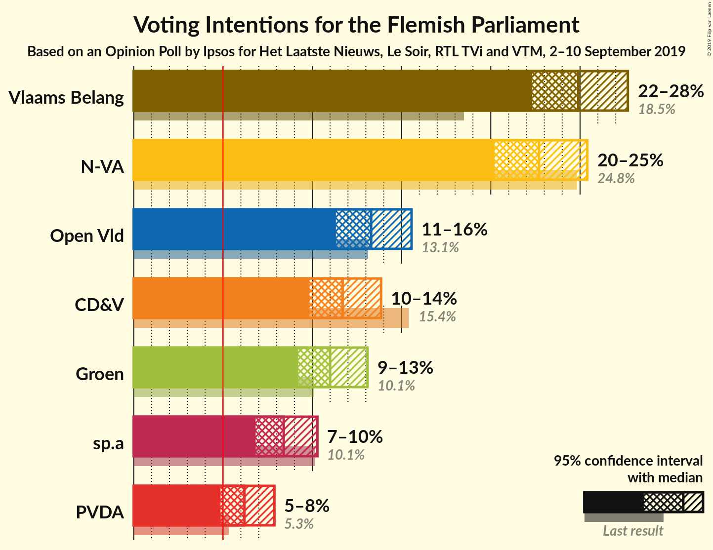

### Confidence Intervals

| Party | Last Result | Poll Result | 80% Confidence Interval | 90% Confidence Interval | 95% Confidence Interval | 99% Confidence Interval |
|:-----:|:-----------:|:-----------:|:-----------------------:|:-----------------------:|:-----------------------:|:-----------------------:|
| Vlaams Belang | 18.5% | 24.9% | 23.2–26.7% |22.7–27.2% |22.3–27.7% |21.5–28.6% |
| Nieuw-Vlaamse Alliantie | 24.8% | 22.7% | 21.1–24.5% |20.6–25.0% |20.2–25.4% |19.4–26.3% |
| Open Vlaamse Liberalen en Democraten | 13.1% | 13.3% | 12.0–14.8% |11.6–15.2% |11.3–15.6% |10.7–16.3% |
| Christen-Democratisch en Vlaams | 15.4% | 11.7% | 10.5–13.1% |10.1–13.5% |9.8–13.9% |9.3–14.5% |
| Groen | 10.1% | 11.0% | 9.8–12.4% |9.5–12.8% |9.2–13.1% |8.7–13.8% |
| Socialistische Partij Anders | 10.1% | 8.4% | 7.4–9.6% |7.1–10.0% |6.8–10.3% |6.4–10.9% |
| Partij van de Arbeid van België | 5.3% | 6.2% | 5.3–7.3% |5.1–7.6% |4.9–7.9% |4.5–8.4% |

*Note:* The poll result column reflects the actual value used in the calculations. Published results may vary slightly, and in addition be rounded to fewer digits.

## Seats

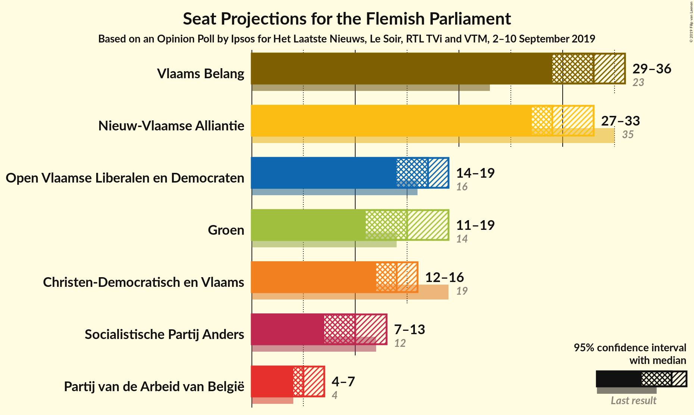

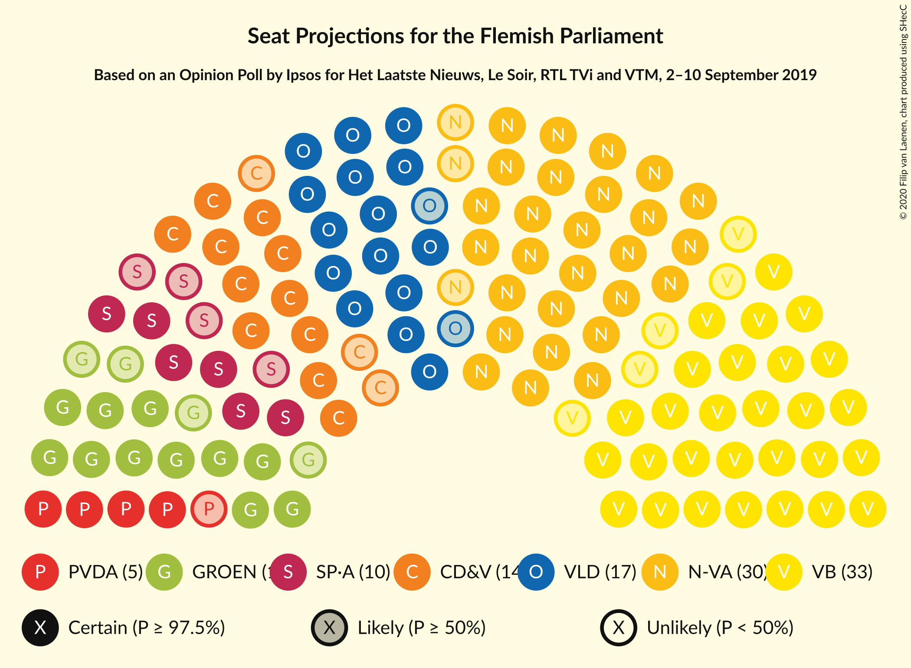

### Confidence Intervals

| Party | Last Result | Median | 80% Confidence Interval | 90% Confidence Interval | 95% Confidence Interval | 99% Confidence Interval |
|:-----:|:-----------:|:------:|:-----------------------:|:-----------------------:|:-----------------------:|:-----------------------:|
| <a href="#vlaams-belang">Vlaams Belang</a> | 23 | 33 | 30–34 |29–35 |28–36 |27–38 |
| <a href="#nieuw-vlaamse-alliantie">Nieuw-Vlaamse Alliantie</a> | 35 | 30 | 28–33 |27–33 |27–34 |27–35 |
| <a href="#open-vlaamse-liberalen-en-democraten">Open Vlaamse Liberalen en Democraten</a> | 16 | 17 | 16–19 |15–19 |15–20 |13–21 |
| <a href="#christen-democratisch-en-vlaams">Christen-Democratisch en Vlaams</a> | 19 | 14 | 12–16 |12–16 |11–16 |10–17 |
| <a href="#groen">Groen</a> | 14 | 15 | 13–17 |11–18 |11–18 |11–19 |
| <a href="#socialistische-partij-anders">Socialistische Partij Anders</a> | 12 | 10 | 8–11 |7–12 |6–12 |4–14 |
| <a href="#partij-van-de-arbeid-van-belgië">Partij van de Arbeid van België</a> | 4 | 6 | 4–7 |4–8 |4–8 |2–8 |

### Vlaams Belang

*For a full overview of the results for this party, see the [Vlaams Belang](party-vlaamsbelang.html) page.*

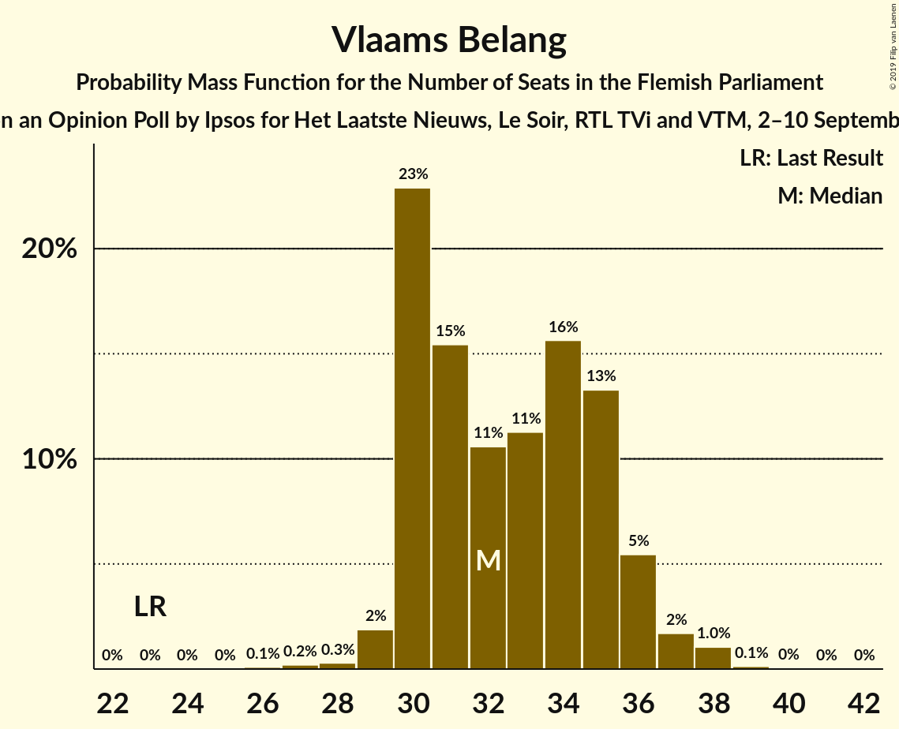

| Number of Seats | Probability | Accumulated | Special Marks |
|:---------------:|:-----------:|:-----------:|:-------------:|
| 23 | 0% | 100% | Last Result |
| 24 | 0% | 100% |  |
| 25 | 0% | 100% |  |
| 26 | 0.1% | 100% |  |
| 27 | 0.7% | 99.8% |  |
| 28 | 2% | 99.2% |  |
| 29 | 4% | 97% |  |
| 30 | 11% | 92% |  |
| 31 | 10% | 81% |  |
| 32 | 12% | 71% |  |
| 33 | 20% | 58% | Median |
| 34 | 32% | 38% |  |
| 35 | 3% | 6% |  |
| 36 | 2% | 3% |  |
| 37 | 1.0% | 2% |  |
| 38 | 0.4% | 0.7% |  |
| 39 | 0.2% | 0.3% |  |
| 40 | 0% | 0% |  |

### Nieuw-Vlaamse Alliantie

*For a full overview of the results for this party, see the [Nieuw-Vlaamse Alliantie](party-nieuw-vlaamsealliantie.html) page.*

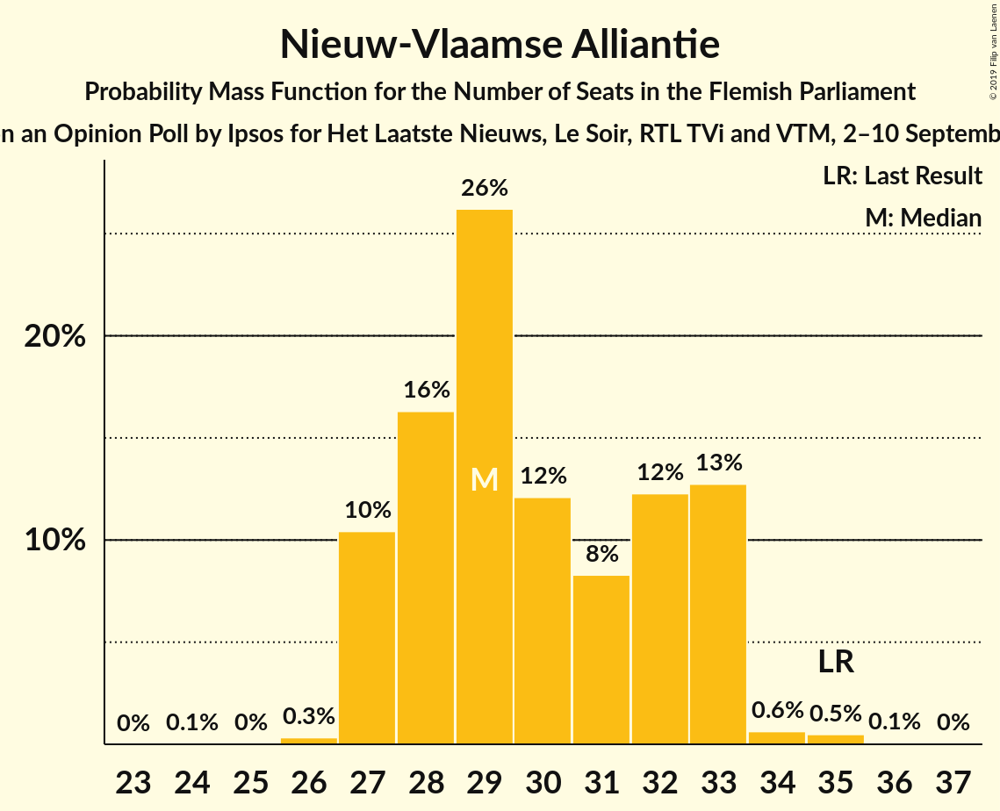

| Number of Seats | Probability | Accumulated | Special Marks |
|:---------------:|:-----------:|:-----------:|:-------------:|
| 24 | 0% | 100% |  |
| 25 | 0.1% | 99.9% |  |
| 26 | 0.3% | 99.9% |  |
| 27 | 8% | 99.6% |  |
| 28 | 14% | 91% |  |
| 29 | 17% | 77% |  |
| 30 | 14% | 60% | Median |
| 31 | 13% | 46% |  |
| 32 | 13% | 34% |  |
| 33 | 16% | 20% |  |
| 34 | 2% | 4% |  |
| 35 | 1.2% | 2% | Last Result |
| 36 | 0.2% | 0.3% |  |
| 37 | 0.1% | 0.1% |  |
| 38 | 0% | 0% |  |

### Open Vlaamse Liberalen en Democraten

*For a full overview of the results for this party, see the [Open Vlaamse Liberalen en Democraten](party-openvlaamseliberalenendemocraten.html) page.*

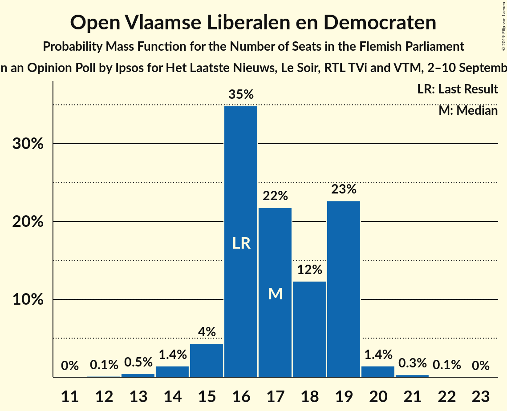

| Number of Seats | Probability | Accumulated | Special Marks |
|:---------------:|:-----------:|:-----------:|:-------------:|
| 12 | 0.2% | 100% |  |
| 13 | 0.4% | 99.8% |  |
| 14 | 2% | 99.4% |  |
| 15 | 4% | 98% |  |
| 16 | 32% | 94% | Last Result |
| 17 | 19% | 61% | Median |
| 18 | 12% | 42% |  |
| 19 | 28% | 30% |  |
| 20 | 2% | 3% |  |
| 21 | 0.4% | 0.7% |  |
| 22 | 0.2% | 0.3% |  |
| 23 | 0.1% | 0.1% |  |
| 24 | 0% | 0% |  |

### Christen-Democratisch en Vlaams

*For a full overview of the results for this party, see the [Christen-Democratisch en Vlaams](party-christen-democratischenvlaams.html) page.*

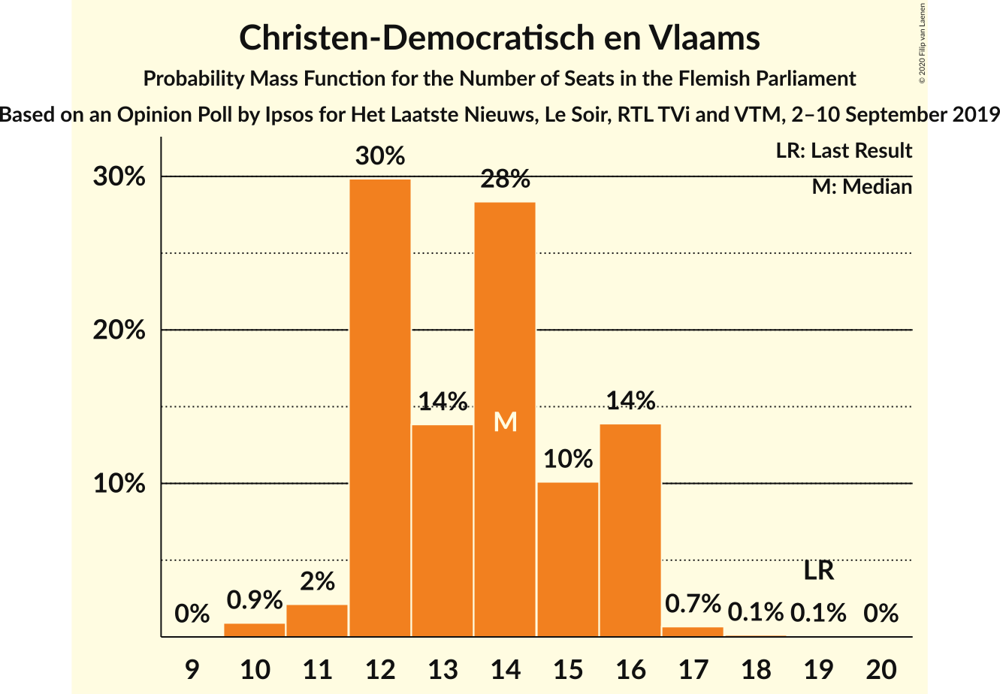

| Number of Seats | Probability | Accumulated | Special Marks |
|:---------------:|:-----------:|:-----------:|:-------------:|
| 10 | 0.9% | 100% |  |
| 11 | 2% | 99.1% |  |
| 12 | 30% | 97% |  |
| 13 | 14% | 67% |  |
| 14 | 28% | 53% | Median |
| 15 | 10% | 25% |  |
| 16 | 14% | 15% |  |
| 17 | 0.7% | 0.9% |  |
| 18 | 0.1% | 0.2% |  |
| 19 | 0.1% | 0.1% | Last Result |
| 20 | 0% | 0% |  |

### Groen

*For a full overview of the results for this party, see the [Groen](party-groen.html) page.*

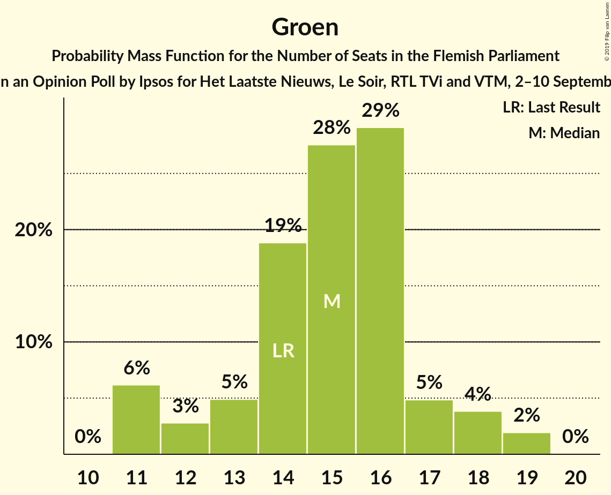

| Number of Seats | Probability | Accumulated | Special Marks |
|:---------------:|:-----------:|:-----------:|:-------------:|
| 11 | 6% | 100% |  |
| 12 | 3% | 94% |  |
| 13 | 5% | 91% |  |
| 14 | 19% | 86% | Last Result |
| 15 | 28% | 67% | Median |
| 16 | 29% | 40% |  |
| 17 | 5% | 11% |  |
| 18 | 4% | 6% |  |
| 19 | 2% | 2% |  |
| 20 | 0% | 0% |  |

### Socialistische Partij Anders

*For a full overview of the results for this party, see the [Socialistische Partij Anders](party-socialistischepartijanders.html) page.*

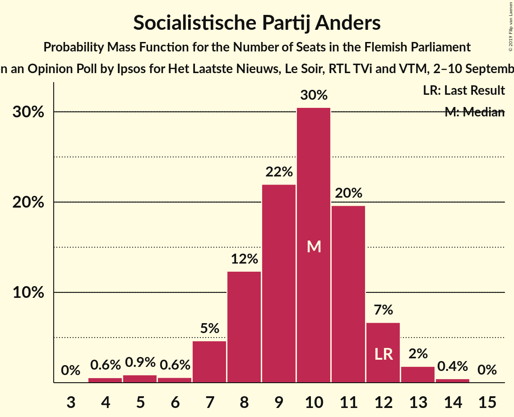

| Number of Seats | Probability | Accumulated | Special Marks |
|:---------------:|:-----------:|:-----------:|:-------------:|
| 4 | 0.7% | 100% |  |
| 5 | 1.2% | 99.3% |  |
| 6 | 0.9% | 98% |  |
| 7 | 5% | 97% |  |
| 8 | 14% | 92% |  |
| 9 | 21% | 78% |  |
| 10 | 32% | 57% | Median |
| 11 | 17% | 25% |  |
| 12 | 6% | 8% | Last Result |
| 13 | 2% | 2% |  |
| 14 | 0.6% | 0.6% |  |
| 15 | 0% | 0% |  |

### Partij van de Arbeid van België

*For a full overview of the results for this party, see the [Partij van de Arbeid van België](party-partijvandearbeidvanbelgië.html) page.*

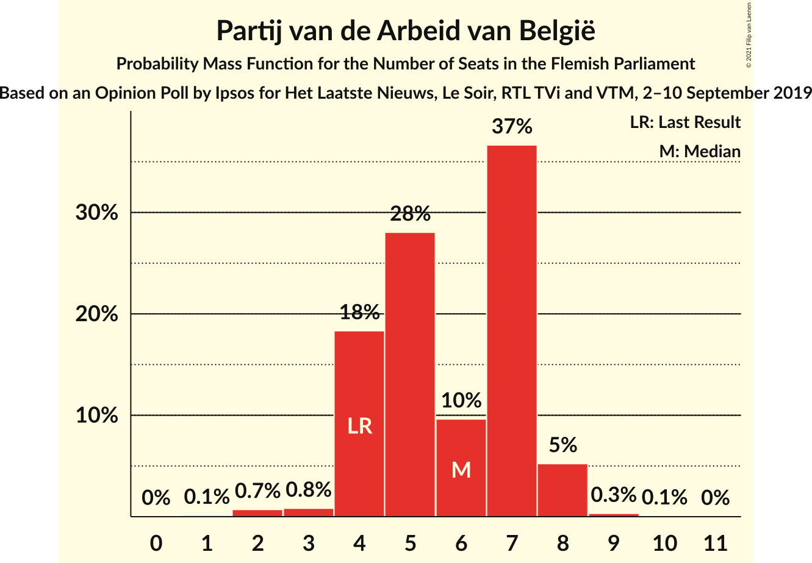

| Number of Seats | Probability | Accumulated | Special Marks |
|:---------------:|:-----------:|:-----------:|:-------------:|
| 1 | 0.1% | 100% |  |
| 2 | 0.7% | 99.8% |  |
| 3 | 0.8% | 99.1% |  |
| 4 | 18% | 98% | Last Result |
| 5 | 28% | 80% |  |
| 6 | 10% | 52% | Median |
| 7 | 37% | 42% |  |
| 8 | 5% | 6% |  |
| 9 | 0.3% | 0.4% |  |
| 10 | 0.1% | 0.1% |  |
| 11 | 0% | 0% |  |

## Coalitions

### Confidence Intervals

| Coalition | Last Result | Median | Majority? | 80% Confidence Interval | 90% Confidence Interval | 95% Confidence Interval | 99% Confidence Interval |
|:---------:|:-----------:|:------:|:---------:|:-----------------------:|:-----------------------:|:-----------------------:|:-----------------------:|
| Vlaams Belang – Nieuw-Vlaamse Alliantie | 58 | 63 | 56% | 60–66 | 59–67 | 58–67 | 56–69 |
| Nieuw-Vlaamse Alliantie – Open Vlaamse Liberalen en Democraten – Christen-Democratisch en Vlaams | 70 | 61 | 31% | 58–64 | 58–65 | 57–66 | 56–67 |
| Nieuw-Vlaamse Alliantie – Open Vlaamse Liberalen en Democraten – Socialistische Partij Anders | 63 | 57 | 1.3% | 54–60 | 53–61 | 52–62 | 51–63 |
| Open Vlaamse Liberalen en Democraten – Christen-Democratisch en Vlaams – Groen – Socialistische Partij Anders | 61 | 55 | 0.2% | 52–59 | 51–60 | 51–60 | 49–62 |
| Nieuw-Vlaamse Alliantie – Christen-Democratisch en Vlaams – Socialistische Partij Anders | 66 | 53 | 0% | 50–57 | 50–58 | 49–58 | 47–60 |
| Nieuw-Vlaamse Alliantie – Open Vlaamse Liberalen en Democraten | 51 | 48 | 0% | 45–50 | 44–51 | 44–52 | 42–53 |
| Open Vlaamse Liberalen en Democraten – Christen-Democratisch en Vlaams – Groen | 49 | 46 | 0% | 43–49 | 42–50 | 41–51 | 40–52 |
| Christen-Democratisch en Vlaams – Groen – Socialistische Partij Anders – Partij van de Arbeid van België | 49 | 44 | 0% | 41–47 | 40–48 | 39–49 | 38–50 |
| Nieuw-Vlaamse Alliantie – Christen-Democratisch en Vlaams | 54 | 44 | 0% | 41–47 | 40–48 | 40–48 | 39–50 |
| Open Vlaamse Liberalen en Democraten – Groen – Socialistische Partij Anders | 42 | 42 | 0% | 39–44 | 38–45 | 37–46 | 36–48 |
| Open Vlaamse Liberalen en Democraten – Christen-Democratisch en Vlaams – Socialistische Partij Anders | 47 | 40 | 0% | 37–44 | 36–45 | 36–45 | 34–46 |
| Christen-Democratisch en Vlaams – Groen – Socialistische Partij Anders | 45 | 38 | 0% | 36–41 | 35–42 | 34–43 | 32–44 |
| Open Vlaamse Liberalen en Democraten – Christen-Democratisch en Vlaams | 35 | 31 | 0% | 28–34 | 28–35 | 27–35 | 26–36 |
| Open Vlaamse Liberalen en Democraten – Socialistische Partij Anders | 28 | 27 | 0% | 24–29 | 23–30 | 23–31 | 21–32 |
| Christen-Democratisch en Vlaams – Socialistische Partij Anders | 31 | 23 | 0% | 21–26 | 20–26 | 19–27 | 18–28 |

### Vlaams Belang – Nieuw-Vlaamse Alliantie

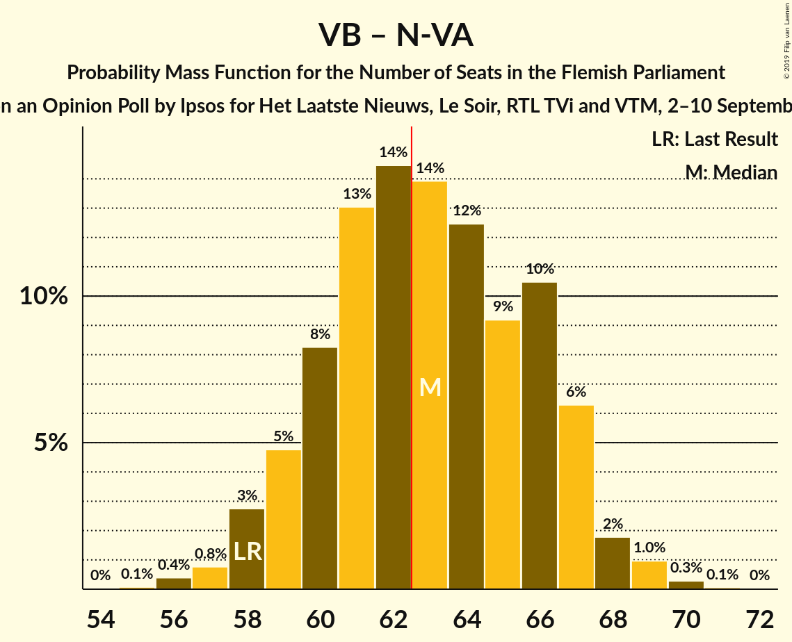

| Number of Seats | Probability | Accumulated | Special Marks |
|:---------------:|:-----------:|:-----------:|:-------------:|
| 55 | 0.3% | 100% |  |
| 56 | 0.4% | 99.7% |  |
| 57 | 1.3% | 99.2% |  |
| 58 | 3% | 98% | Last Result |
| 59 | 4% | 95% |  |
| 60 | 9% | 91% |  |
| 61 | 13% | 82% |  |
| 62 | 14% | 70% |  |
| 63 | 16% | 56% | Median, Majority |
| 64 | 12% | 40% |  |
| 65 | 13% | 27% |  |
| 66 | 8% | 15% |  |
| 67 | 4% | 7% |  |
| 68 | 2% | 2% |  |
| 69 | 0.6% | 0.9% |  |
| 70 | 0.2% | 0.3% |  |
| 71 | 0.1% | 0.1% |  |
| 72 | 0% | 0% |  |

### Nieuw-Vlaamse Alliantie – Open Vlaamse Liberalen en Democraten – Christen-Democratisch en Vlaams

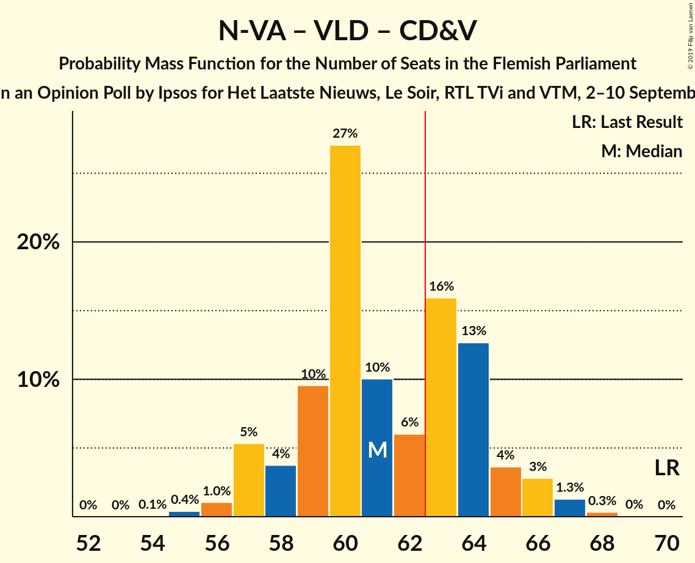

| Number of Seats | Probability | Accumulated | Special Marks |
|:---------------:|:-----------:|:-----------:|:-------------:|
| 54 | 0.1% | 100% |  |
| 55 | 0.3% | 99.9% |  |
| 56 | 1.0% | 99.5% |  |
| 57 | 3% | 98.6% |  |
| 58 | 8% | 95% |  |
| 59 | 13% | 87% |  |
| 60 | 15% | 74% |  |
| 61 | 12% | 58% | Median |
| 62 | 16% | 47% |  |
| 63 | 13% | 31% | Majority |
| 64 | 9% | 18% |  |
| 65 | 5% | 8% |  |
| 66 | 2% | 3% |  |
| 67 | 0.9% | 1.4% |  |
| 68 | 0.4% | 0.4% |  |
| 69 | 0.1% | 0.1% |  |
| 70 | 0% | 0% | Last Result |

### Nieuw-Vlaamse Alliantie – Open Vlaamse Liberalen en Democraten – Socialistische Partij Anders

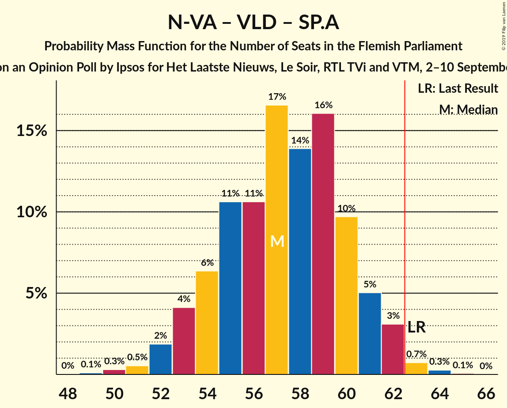

| Number of Seats | Probability | Accumulated | Special Marks |
|:---------------:|:-----------:|:-----------:|:-------------:|
| 49 | 0.1% | 100% |  |
| 50 | 0.2% | 99.9% |  |
| 51 | 0.6% | 99.7% |  |
| 52 | 2% | 99.1% |  |
| 53 | 3% | 97% |  |
| 54 | 6% | 95% |  |
| 55 | 14% | 88% |  |
| 56 | 16% | 75% |  |
| 57 | 14% | 59% | Median |
| 58 | 14% | 44% |  |
| 59 | 13% | 30% |  |
| 60 | 9% | 18% |  |
| 61 | 5% | 9% |  |
| 62 | 2% | 4% |  |
| 63 | 0.9% | 1.3% | Last Result, Majority |
| 64 | 0.3% | 0.4% |  |
| 65 | 0.1% | 0.1% |  |
| 66 | 0% | 0% |  |

### Open Vlaamse Liberalen en Democraten – Christen-Democratisch en Vlaams – Groen – Socialistische Partij Anders

| Number of Seats | Probability | Accumulated | Special Marks |
|:---------------:|:-----------:|:-----------:|:-------------:|
| 47 | 0% | 100% |  |
| 48 | 0.1% | 99.9% |  |
| 49 | 0.5% | 99.8% |  |
| 50 | 1.0% | 99.4% |  |
| 51 | 3% | 98% |  |
| 52 | 7% | 95% |  |
| 53 | 10% | 88% |  |
| 54 | 14% | 78% |  |
| 55 | 15% | 64% |  |
| 56 | 18% | 49% | Median |
| 57 | 12% | 31% |  |
| 58 | 8% | 19% |  |
| 59 | 4% | 10% |  |
| 60 | 3% | 6% |  |
| 61 | 1.3% | 2% | Last Result |
| 62 | 0.7% | 0.9% |  |
| 63 | 0.2% | 0.2% | Majority |
| 64 | 0.1% | 0.1% |  |
| 65 | 0% | 0% |  |

### Nieuw-Vlaamse Alliantie – Christen-Democratisch en Vlaams – Socialistische Partij Anders

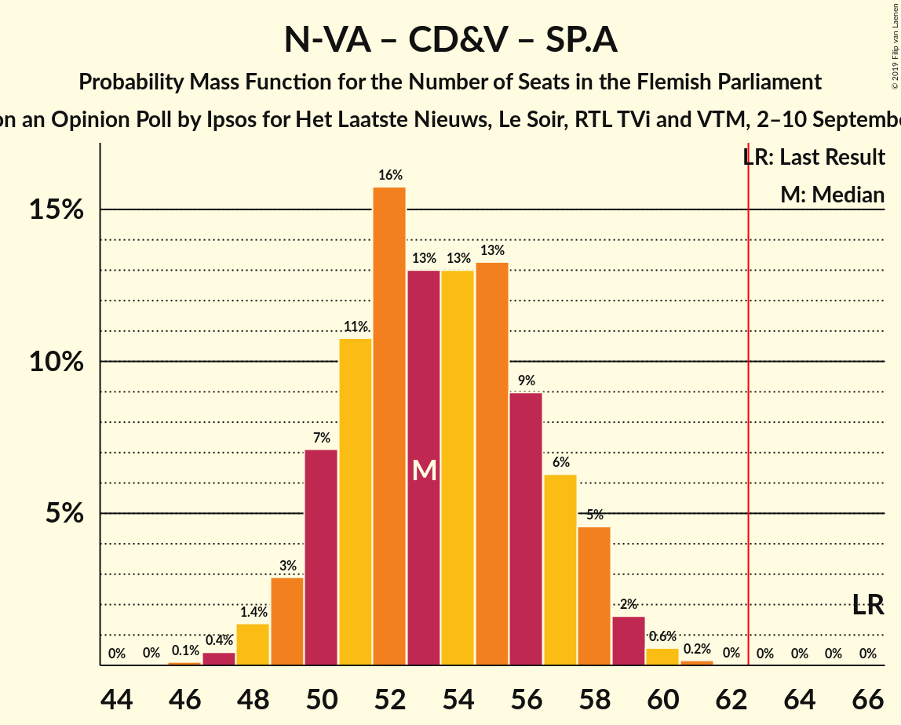

| Number of Seats | Probability | Accumulated | Special Marks |
|:---------------:|:-----------:|:-----------:|:-------------:|
| 46 | 0.1% | 100% |  |
| 47 | 0.4% | 99.9% |  |
| 48 | 1.4% | 99.4% |  |
| 49 | 3% | 98% |  |
| 50 | 7% | 95% |  |
| 51 | 11% | 88% |  |
| 52 | 16% | 77% |  |
| 53 | 13% | 62% |  |
| 54 | 13% | 49% | Median |
| 55 | 13% | 36% |  |
| 56 | 9% | 22% |  |
| 57 | 6% | 13% |  |
| 58 | 5% | 7% |  |
| 59 | 2% | 2% |  |
| 60 | 0.6% | 0.8% |  |
| 61 | 0.2% | 0.2% |  |
| 62 | 0% | 0.1% |  |
| 63 | 0% | 0% | Majority |
| 64 | 0% | 0% |  |
| 65 | 0% | 0% |  |
| 66 | 0% | 0% | Last Result |

### Nieuw-Vlaamse Alliantie – Open Vlaamse Liberalen en Democraten

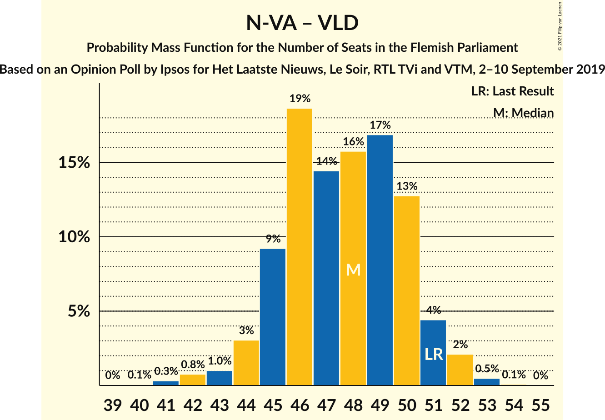

| Number of Seats | Probability | Accumulated | Special Marks |
|:---------------:|:-----------:|:-----------:|:-------------:|
| 40 | 0.1% | 100% |  |
| 41 | 0.3% | 99.9% |  |
| 42 | 0.8% | 99.6% |  |
| 43 | 1.0% | 98.8% |  |
| 44 | 3% | 98% |  |
| 45 | 9% | 95% |  |
| 46 | 19% | 86% |  |
| 47 | 14% | 67% | Median |
| 48 | 16% | 52% |  |
| 49 | 17% | 37% |  |
| 50 | 13% | 20% |  |
| 51 | 4% | 7% | Last Result |
| 52 | 2% | 3% |  |
| 53 | 0.5% | 0.6% |  |
| 54 | 0.1% | 0.1% |  |
| 55 | 0% | 0% |  |

### Open Vlaamse Liberalen en Democraten – Christen-Democratisch en Vlaams – Groen

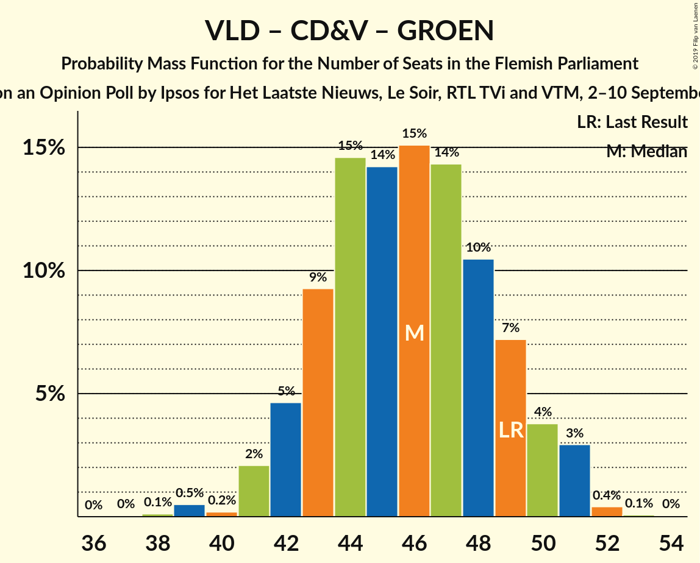

| Number of Seats | Probability | Accumulated | Special Marks |
|:---------------:|:-----------:|:-----------:|:-------------:|
| 38 | 0.1% | 100% |  |
| 39 | 0.3% | 99.9% |  |
| 40 | 0.5% | 99.6% |  |
| 41 | 2% | 99.1% |  |
| 42 | 7% | 97% |  |
| 43 | 8% | 90% |  |
| 44 | 13% | 82% |  |
| 45 | 13% | 69% |  |
| 46 | 16% | 56% | Median |
| 47 | 16% | 39% |  |
| 48 | 10% | 24% |  |
| 49 | 6% | 14% | Last Result |
| 50 | 4% | 8% |  |
| 51 | 3% | 3% |  |
| 52 | 0.5% | 0.7% |  |
| 53 | 0.1% | 0.2% |  |
| 54 | 0.1% | 0.1% |  |
| 55 | 0% | 0% |  |

### Christen-Democratisch en Vlaams – Groen – Socialistische Partij Anders – Partij van de Arbeid van België

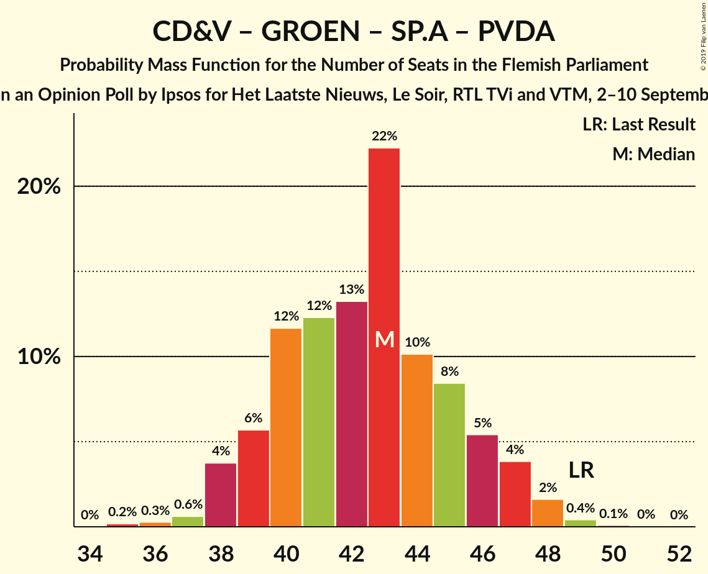

| Number of Seats | Probability | Accumulated | Special Marks |
|:---------------:|:-----------:|:-----------:|:-------------:|
| 36 | 0.1% | 100% |  |
| 37 | 0.3% | 99.8% |  |
| 38 | 0.8% | 99.5% |  |
| 39 | 2% | 98.7% |  |
| 40 | 5% | 97% |  |
| 41 | 8% | 92% |  |
| 42 | 12% | 84% |  |
| 43 | 17% | 72% |  |
| 44 | 17% | 55% |  |
| 45 | 12% | 38% | Median |
| 46 | 12% | 26% |  |
| 47 | 7% | 14% |  |
| 48 | 4% | 7% |  |
| 49 | 2% | 3% | Last Result |
| 50 | 1.2% | 2% |  |
| 51 | 0.2% | 0.3% |  |
| 52 | 0.1% | 0.1% |  |
| 53 | 0% | 0% |  |

### Nieuw-Vlaamse Alliantie – Christen-Democratisch en Vlaams

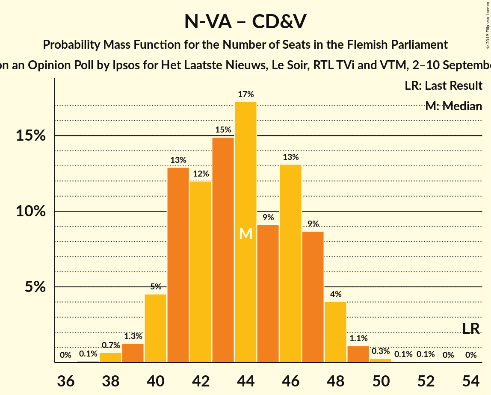

| Number of Seats | Probability | Accumulated | Special Marks |
|:---------------:|:-----------:|:-----------:|:-------------:|
| 37 | 0.1% | 100% |  |
| 38 | 0.4% | 99.9% |  |
| 39 | 2% | 99.5% |  |
| 40 | 6% | 98% |  |
| 41 | 10% | 92% |  |
| 42 | 12% | 83% |  |
| 43 | 16% | 71% |  |
| 44 | 15% | 55% | Median |
| 45 | 13% | 40% |  |
| 46 | 10% | 27% |  |
| 47 | 11% | 17% |  |
| 48 | 4% | 6% |  |
| 49 | 1.4% | 2% |  |
| 50 | 0.3% | 0.7% |  |
| 51 | 0.3% | 0.3% |  |
| 52 | 0.1% | 0.1% |  |
| 53 | 0% | 0% |  |
| 54 | 0% | 0% | Last Result |

### Open Vlaamse Liberalen en Democraten – Groen – Socialistische Partij Anders

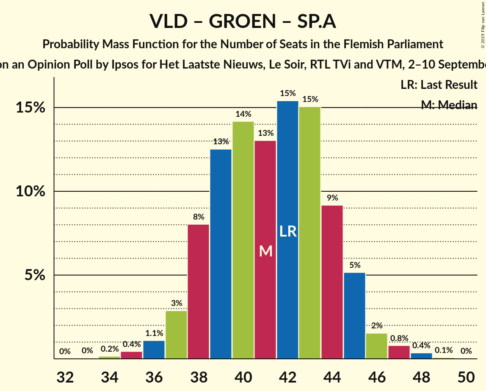

| Number of Seats | Probability | Accumulated | Special Marks |
|:---------------:|:-----------:|:-----------:|:-------------:|
| 34 | 0.1% | 100% |  |
| 35 | 0.3% | 99.9% |  |
| 36 | 0.8% | 99.6% |  |
| 37 | 2% | 98.8% |  |
| 38 | 4% | 97% |  |
| 39 | 9% | 93% |  |
| 40 | 11% | 85% |  |
| 41 | 16% | 73% |  |
| 42 | 19% | 57% | Last Result, Median |
| 43 | 14% | 38% |  |
| 44 | 14% | 23% |  |
| 45 | 5% | 10% |  |
| 46 | 3% | 5% |  |
| 47 | 1.1% | 2% |  |
| 48 | 0.4% | 0.7% |  |
| 49 | 0.2% | 0.2% |  |
| 50 | 0% | 0% |  |

### Open Vlaamse Liberalen en Democraten – Christen-Democratisch en Vlaams – Socialistische Partij Anders

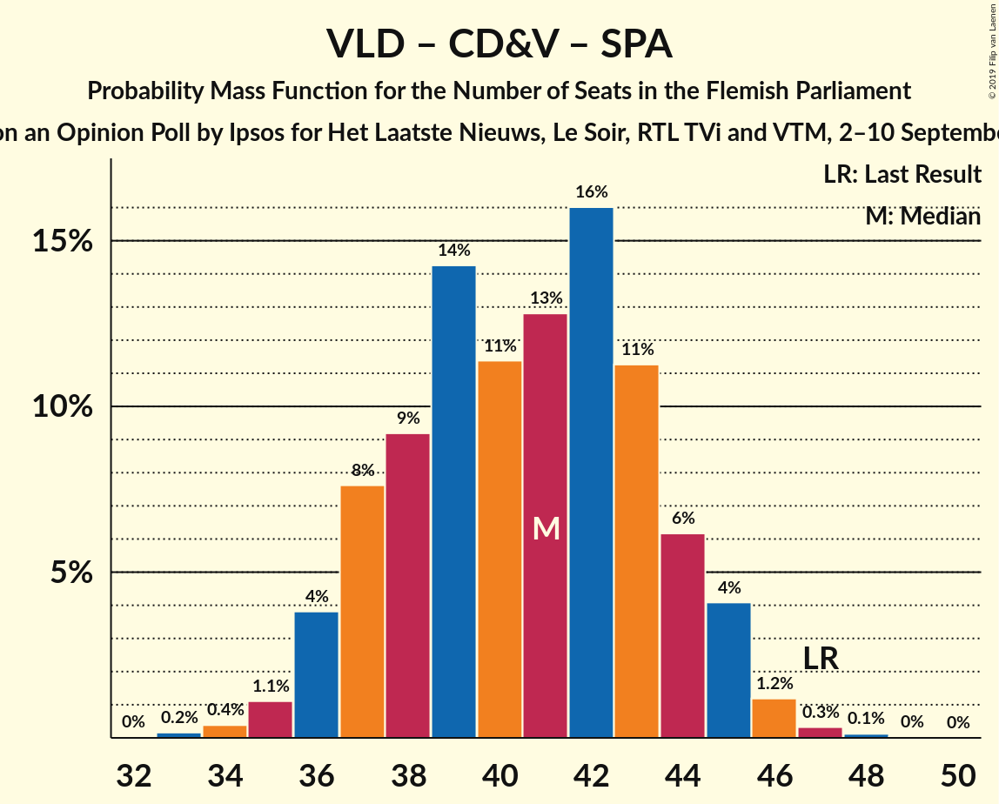

| Number of Seats | Probability | Accumulated | Special Marks |
|:---------------:|:-----------:|:-----------:|:-------------:|
| 33 | 0.1% | 100% |  |
| 34 | 0.4% | 99.8% |  |
| 35 | 1.3% | 99.5% |  |
| 36 | 4% | 98% |  |
| 37 | 5% | 94% |  |
| 38 | 11% | 89% |  |
| 39 | 13% | 78% |  |
| 40 | 17% | 65% |  |
| 41 | 17% | 49% | Median |
| 42 | 11% | 32% |  |
| 43 | 10% | 21% |  |
| 44 | 5% | 11% |  |
| 45 | 4% | 5% |  |
| 46 | 1.2% | 2% |  |
| 47 | 0.4% | 0.5% | Last Result |
| 48 | 0.1% | 0.1% |  |
| 49 | 0% | 0% |  |

### Christen-Democratisch en Vlaams – Groen – Socialistische Partij Anders

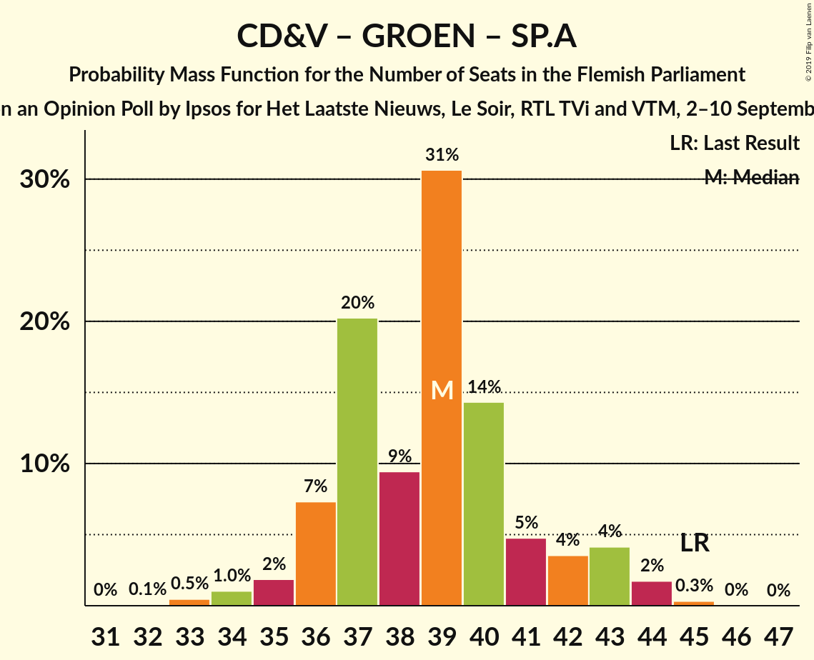

| Number of Seats | Probability | Accumulated | Special Marks |
|:---------------:|:-----------:|:-----------:|:-------------:|
| 31 | 0.1% | 100% |  |
| 32 | 0.5% | 99.9% |  |
| 33 | 0.8% | 99.4% |  |
| 34 | 2% | 98.6% |  |
| 35 | 5% | 96% |  |
| 36 | 14% | 91% |  |
| 37 | 19% | 77% |  |
| 38 | 16% | 59% |  |
| 39 | 19% | 43% | Median |
| 40 | 10% | 23% |  |
| 41 | 7% | 13% |  |
| 42 | 3% | 6% |  |
| 43 | 2% | 3% |  |
| 44 | 0.7% | 1.1% |  |
| 45 | 0.3% | 0.4% | Last Result |
| 46 | 0.1% | 0.1% |  |
| 47 | 0% | 0% |  |

### Open Vlaamse Liberalen en Democraten – Christen-Democratisch en Vlaams

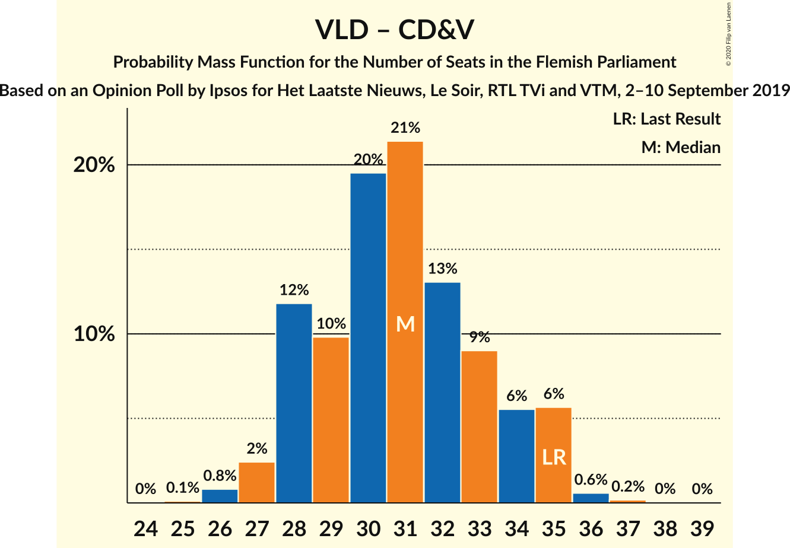

| Number of Seats | Probability | Accumulated | Special Marks |
|:---------------:|:-----------:|:-----------:|:-------------:|
| 25 | 0.1% | 100% |  |
| 26 | 0.8% | 99.8% |  |
| 27 | 2% | 99.0% |  |
| 28 | 12% | 97% |  |
| 29 | 10% | 85% |  |
| 30 | 20% | 75% |  |
| 31 | 21% | 55% | Median |
| 32 | 13% | 34% |  |
| 33 | 9% | 21% |  |
| 34 | 6% | 12% |  |
| 35 | 6% | 6% | Last Result |
| 36 | 0.6% | 0.8% |  |
| 37 | 0.2% | 0.2% |  |
| 38 | 0% | 0.1% |  |
| 39 | 0% | 0% |  |

### Open Vlaamse Liberalen en Democraten – Socialistische Partij Anders

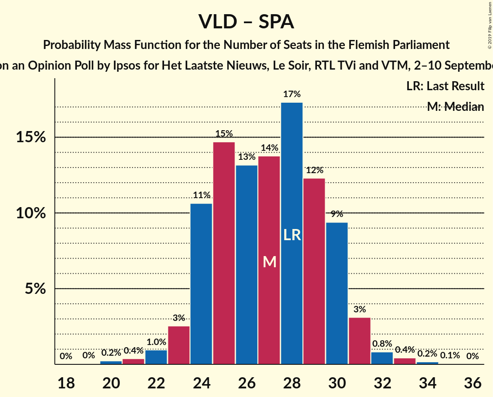

| Number of Seats | Probability | Accumulated | Special Marks |
|:---------------:|:-----------:|:-----------:|:-------------:|
| 20 | 0.5% | 100% |  |
| 21 | 0.6% | 99.5% |  |
| 22 | 1.0% | 98.9% |  |
| 23 | 4% | 98% |  |
| 24 | 7% | 94% |  |
| 25 | 11% | 87% |  |
| 26 | 20% | 76% |  |
| 27 | 18% | 56% | Median |
| 28 | 15% | 38% | Last Result |
| 29 | 14% | 23% |  |
| 30 | 5% | 9% |  |
| 31 | 3% | 4% |  |
| 32 | 0.7% | 0.9% |  |
| 33 | 0.2% | 0.2% |  |
| 34 | 0% | 0% |  |

### Christen-Democratisch en Vlaams – Socialistische Partij Anders

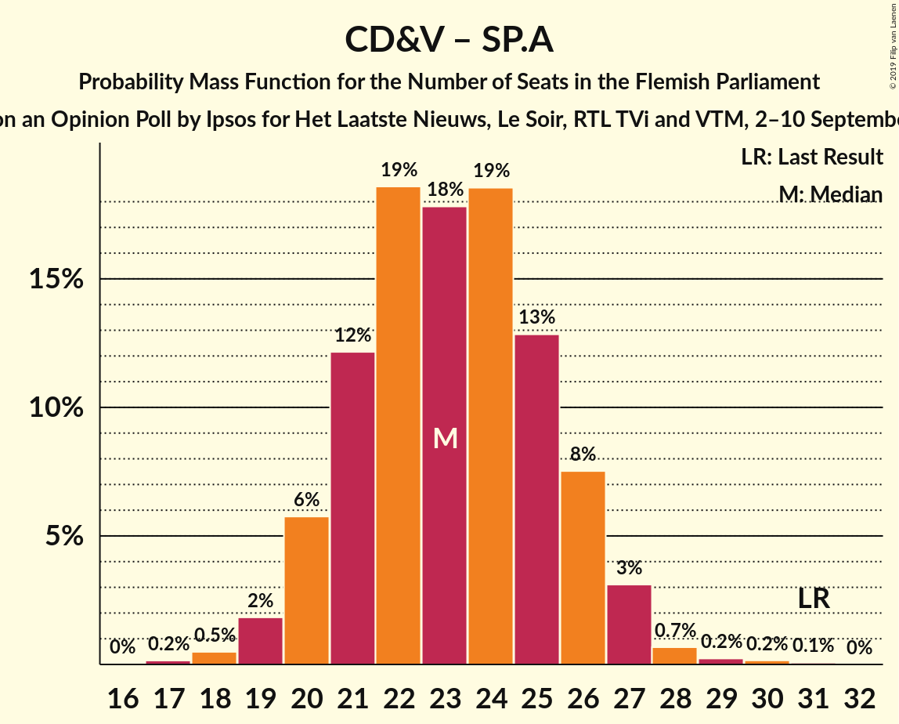

| Number of Seats | Probability | Accumulated | Special Marks |
|:---------------:|:-----------:|:-----------:|:-------------:|
| 17 | 0.2% | 100% |  |
| 18 | 0.5% | 99.8% |  |
| 19 | 2% | 99.3% |  |
| 20 | 6% | 97% |  |
| 21 | 12% | 92% |  |
| 22 | 19% | 80% |  |
| 23 | 18% | 61% |  |
| 24 | 19% | 43% | Median |
| 25 | 13% | 25% |  |
| 26 | 8% | 12% |  |
| 27 | 3% | 4% |  |
| 28 | 0.7% | 1.1% |  |
| 29 | 0.2% | 0.5% |  |
| 30 | 0.2% | 0.2% |  |
| 31 | 0.1% | 0.1% | Last Result |
| 32 | 0% | 0% |  |

## Technical Information

### Opinion Poll

+ **Polling firm:** Ipsos
+ **Commissioner(s):** Het Laatste Nieuws, Le Soir, RTL TVi and VTM
+ **Fieldwork period:** 2–10 September 2019

### Calculations

+ **Sample size:** 1000
+ **Simulations done:** 1,048,576
+ **Error estimate:** 1.28%

