# Opinion Poll by Ipsos for Het Laatste Nieuws, Le Soir, RTL TVi and VTM, 29 November–6 December 2019

<a href="#voting-intentions">Voting Intentions</a> | <a href="#seats">Seats</a> | <a href="#coalitions">Coalitions</a> | <a href="#technical-information">Technical Information</a>

## Voting Intentions

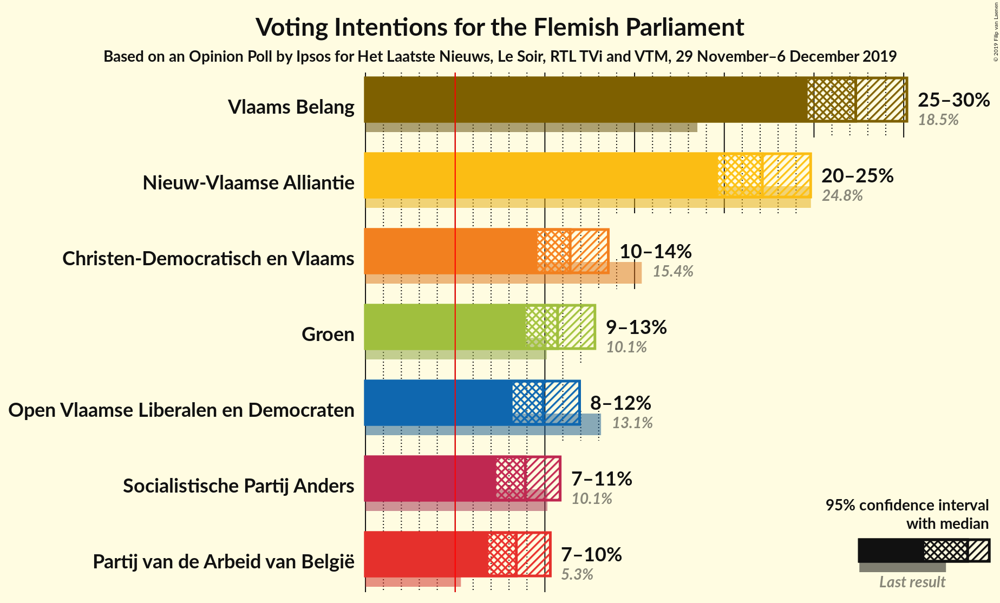

### Confidence Intervals

| Party | Last Result | Poll Result | 80% Confidence Interval | 90% Confidence Interval | 95% Confidence Interval | 99% Confidence Interval |
|:-----:|:-----------:|:-----------:|:-----------------------:|:-----------------------:|:-----------------------:|:-----------------------:|
| Vlaams Belang | 18.5% | 27.3% | 25.6–29.2% |25.1–29.7% |24.6–30.2% |23.8–31.1% |
| Nieuw-Vlaamse Alliantie | 24.8% | 22.1% | 20.5–23.9% |20.0–24.4% |19.6–24.8% |18.9–25.7% |
| Christen-Democratisch en Vlaams | 15.4% | 11.4% | 10.2–12.8% |9.9–13.2% |9.6–13.5% |9.0–14.2% |
| Groen | 10.1% | 10.7% | 9.5–12.1% |9.2–12.5% |8.9–12.8% |8.4–13.5% |
| Open Vlaamse Liberalen en Democraten | 13.1% | 9.9% | 8.8–11.2% |8.5–11.6% |8.2–11.9% |7.7–12.6% |
| Socialistische Partij Anders | 10.1% | 8.9% | 7.8–10.2% |7.5–10.5% |7.3–10.9% |6.8–11.5% |
| Partij van de Arbeid van België | 5.3% | 8.4% | 7.4–9.6% |7.1–10.0% |6.8–10.3% |6.4–10.9% |

*Note:* The poll result column reflects the actual value used in the calculations. Published results may vary slightly, and in addition be rounded to fewer digits.

## Seats

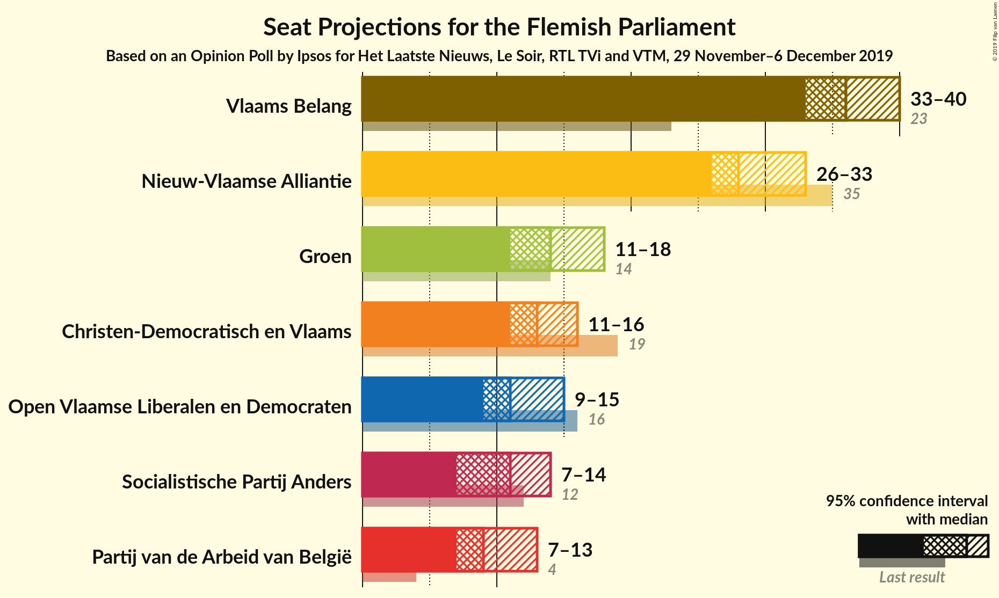

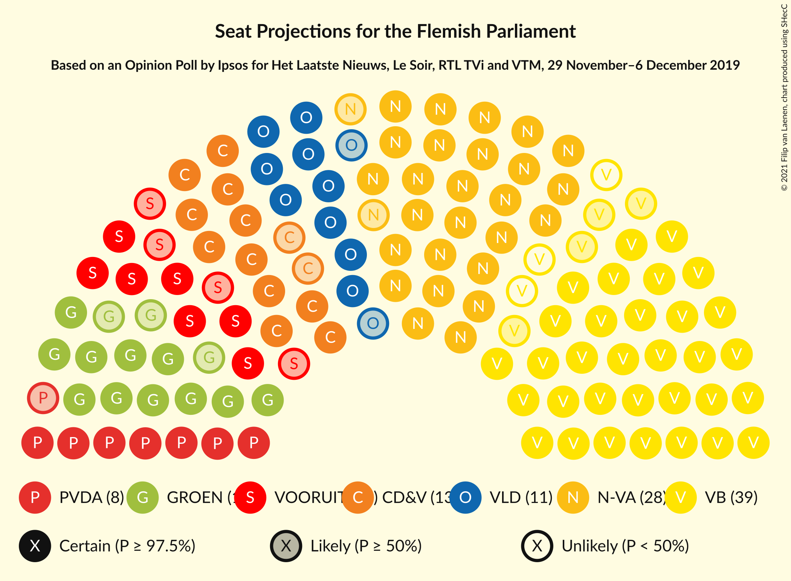

### Confidence Intervals

| Party | Last Result | Median | 80% Confidence Interval | 90% Confidence Interval | 95% Confidence Interval | 99% Confidence Interval |
|:-----:|:-----------:|:------:|:-----------------------:|:-----------------------:|:-----------------------:|:-----------------------:|
| <a href="#vlaams-belang">Vlaams Belang</a> | 23 | 36 | 34–39 |33–39 |33–40 |31–42 |
| <a href="#nieuw-vlaamse-alliantie">Nieuw-Vlaamse Alliantie</a> | 35 | 30 | 27–32 |27–32 |27–33 |25–34 |
| <a href="#christen-democratisch-en-vlaams">Christen-Democratisch en Vlaams</a> | 19 | 13 | 12–16 |11–16 |11–17 |10–17 |
| <a href="#groen">Groen</a> | 14 | 14 | 12–16 |11–16 |11–17 |11–19 |
| <a href="#open-vlaamse-liberalen-en-democraten">Open Vlaamse Liberalen en Democraten</a> | 16 | 11 | 11–14 |10–15 |9–15 |8–16 |
| <a href="#socialistische-partij-anders">Socialistische Partij Anders</a> | 12 | 11 | 9–12 |8–13 |8–13 |6–14 |
| <a href="#partij-van-de-arbeid-van-belgië">Partij van de Arbeid van België</a> | 4 | 8 | 8–10 |7–11 |7–12 |6–13 |

### Vlaams Belang

*For a full overview of the results for this party, see the [Vlaams Belang](party-vlaamsbelang.html) page.*

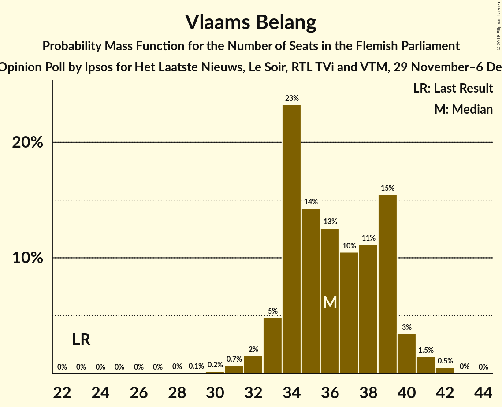

| Number of Seats | Probability | Accumulated | Special Marks |
|:---------------:|:-----------:|:-----------:|:-------------:|
| 23 | 0% | 100% | Last Result |
| 24 | 0% | 100% |  |
| 25 | 0% | 100% |  |
| 26 | 0% | 100% |  |
| 27 | 0% | 100% |  |
| 28 | 0% | 100% |  |
| 29 | 0.1% | 100% |  |
| 30 | 0.1% | 99.8% |  |
| 31 | 0.7% | 99.7% |  |
| 32 | 1.3% | 99.0% |  |
| 33 | 5% | 98% |  |
| 34 | 19% | 92% |  |
| 35 | 16% | 73% |  |
| 36 | 28% | 57% | Median |
| 37 | 6% | 29% |  |
| 38 | 5% | 23% |  |
| 39 | 15% | 18% |  |
| 40 | 1.5% | 3% |  |
| 41 | 0.5% | 1.5% |  |
| 42 | 0.9% | 1.0% |  |
| 43 | 0.1% | 0.1% |  |
| 44 | 0% | 0% |  |

### Nieuw-Vlaamse Alliantie

*For a full overview of the results for this party, see the [Nieuw-Vlaamse Alliantie](party-nieuw-vlaamsealliantie.html) page.*

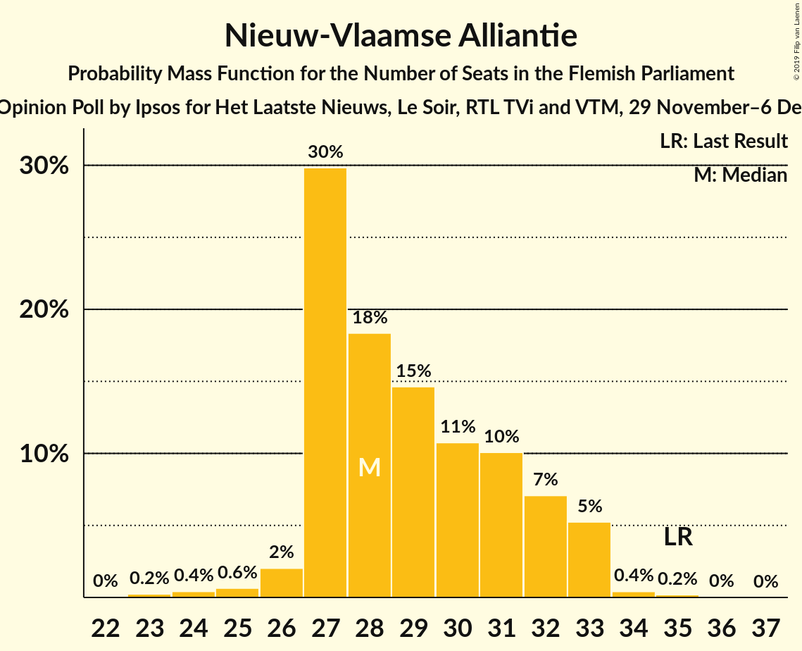

| Number of Seats | Probability | Accumulated | Special Marks |
|:---------------:|:-----------:|:-----------:|:-------------:|
| 23 | 0.2% | 100% |  |
| 24 | 0.2% | 99.8% |  |
| 25 | 0.7% | 99.6% |  |
| 26 | 0.6% | 99.0% |  |
| 27 | 30% | 98% |  |
| 28 | 8% | 68% |  |
| 29 | 9% | 60% |  |
| 30 | 31% | 52% | Median |
| 31 | 5% | 20% |  |
| 32 | 12% | 15% |  |
| 33 | 3% | 4% |  |
| 34 | 1.0% | 1.1% |  |
| 35 | 0.1% | 0.1% | Last Result |
| 36 | 0.1% | 0.1% |  |
| 37 | 0% | 0% |  |

### Christen-Democratisch en Vlaams

*For a full overview of the results for this party, see the [Christen-Democratisch en Vlaams](party-christen-democratischenvlaams.html) page.*

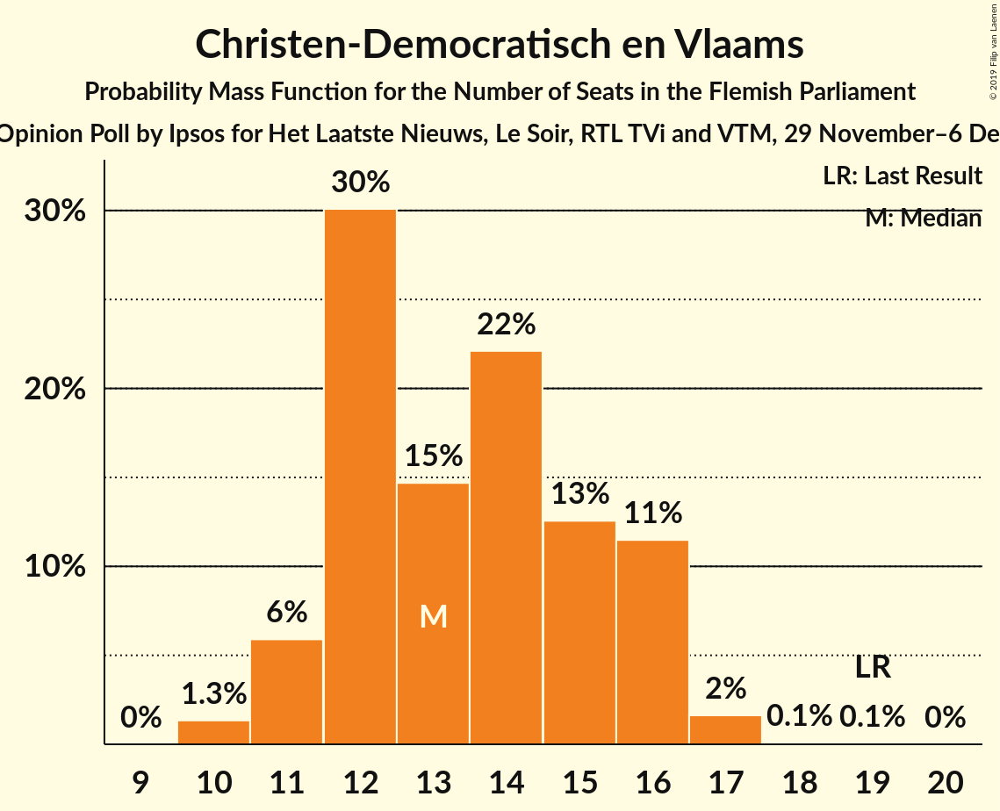

| Number of Seats | Probability | Accumulated | Special Marks |
|:---------------:|:-----------:|:-----------:|:-------------:|
| 10 | 0.6% | 100% |  |
| 11 | 5% | 99.4% |  |
| 12 | 23% | 95% |  |
| 13 | 25% | 72% | Median |
| 14 | 19% | 47% |  |
| 15 | 10% | 28% |  |
| 16 | 15% | 18% |  |
| 17 | 3% | 4% |  |
| 18 | 0.1% | 0.2% |  |
| 19 | 0.1% | 0.1% | Last Result |
| 20 | 0% | 0% |  |

### Groen

*For a full overview of the results for this party, see the [Groen](party-groen.html) page.*

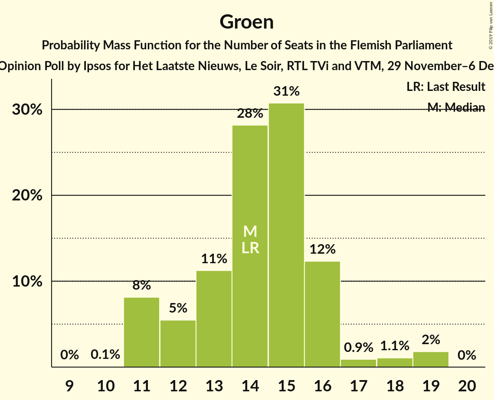

| Number of Seats | Probability | Accumulated | Special Marks |
|:---------------:|:-----------:|:-----------:|:-------------:|
| 10 | 0.2% | 100% |  |
| 11 | 9% | 99.8% |  |
| 12 | 5% | 91% |  |
| 13 | 10% | 86% |  |
| 14 | 28% | 76% | Last Result, Median |
| 15 | 35% | 48% |  |
| 16 | 8% | 13% |  |
| 17 | 3% | 4% |  |
| 18 | 0.6% | 1.5% |  |
| 19 | 0.9% | 0.9% |  |
| 20 | 0% | 0% |  |

### Open Vlaamse Liberalen en Democraten

*For a full overview of the results for this party, see the [Open Vlaamse Liberalen en Democraten](party-openvlaamseliberalenendemocraten.html) page.*

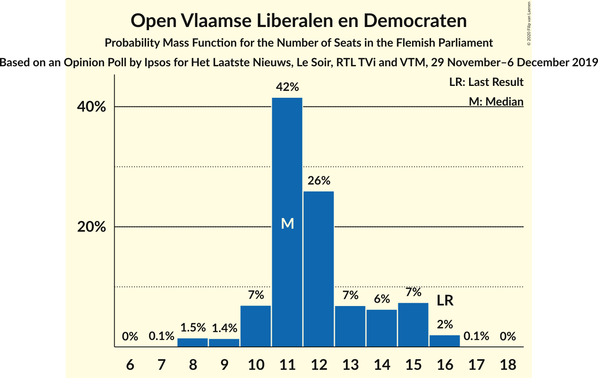

| Number of Seats | Probability | Accumulated | Special Marks |
|:---------------:|:-----------:|:-----------:|:-------------:|
| 7 | 0.1% | 100% |  |
| 8 | 2% | 99.9% |  |
| 9 | 0.7% | 98% |  |
| 10 | 5% | 97% |  |
| 11 | 49% | 93% | Median |
| 12 | 27% | 44% |  |
| 13 | 6% | 17% |  |
| 14 | 4% | 11% |  |
| 15 | 6% | 7% |  |
| 16 | 2% | 2% | Last Result |
| 17 | 0% | 0% |  |

### Socialistische Partij Anders

*For a full overview of the results for this party, see the [Socialistische Partij Anders](party-socialistischepartijanders.html) page.*

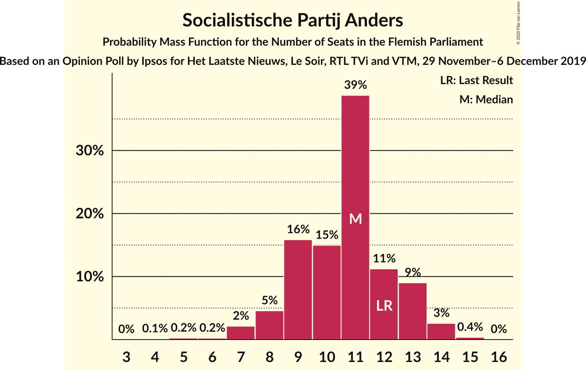

| Number of Seats | Probability | Accumulated | Special Marks |
|:---------------:|:-----------:|:-----------:|:-------------:|
| 4 | 0.1% | 100% |  |
| 5 | 0.1% | 99.9% |  |
| 6 | 0.7% | 99.8% |  |
| 7 | 0.9% | 99.1% |  |
| 8 | 5% | 98% |  |
| 9 | 13% | 93% |  |
| 10 | 7% | 80% |  |
| 11 | 54% | 73% | Median |
| 12 | 10% | 18% | Last Result |
| 13 | 7% | 9% |  |
| 14 | 2% | 2% |  |
| 15 | 0.1% | 0.2% |  |
| 16 | 0% | 0% |  |

### Partij van de Arbeid van België

*For a full overview of the results for this party, see the [Partij van de Arbeid van België](party-partijvandearbeidvanbelgië.html) page.*

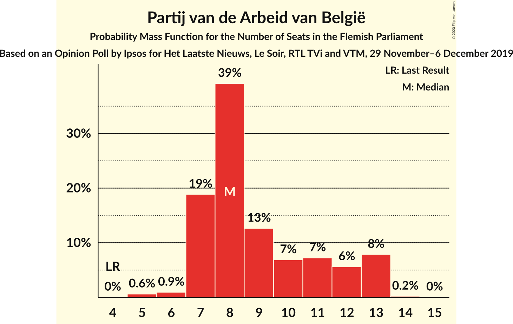

| Number of Seats | Probability | Accumulated | Special Marks |
|:---------------:|:-----------:|:-----------:|:-------------:|
| 4 | 0% | 100% | Last Result |
| 5 | 0.3% | 100% |  |
| 6 | 0.3% | 99.7% |  |
| 7 | 8% | 99.4% |  |
| 8 | 54% | 91% | Median |
| 9 | 19% | 37% |  |
| 10 | 10% | 18% |  |
| 11 | 4% | 9% |  |
| 12 | 2% | 5% |  |
| 13 | 2% | 2% |  |
| 14 | 0.2% | 0.2% |  |
| 15 | 0% | 0% |  |

## Coalitions

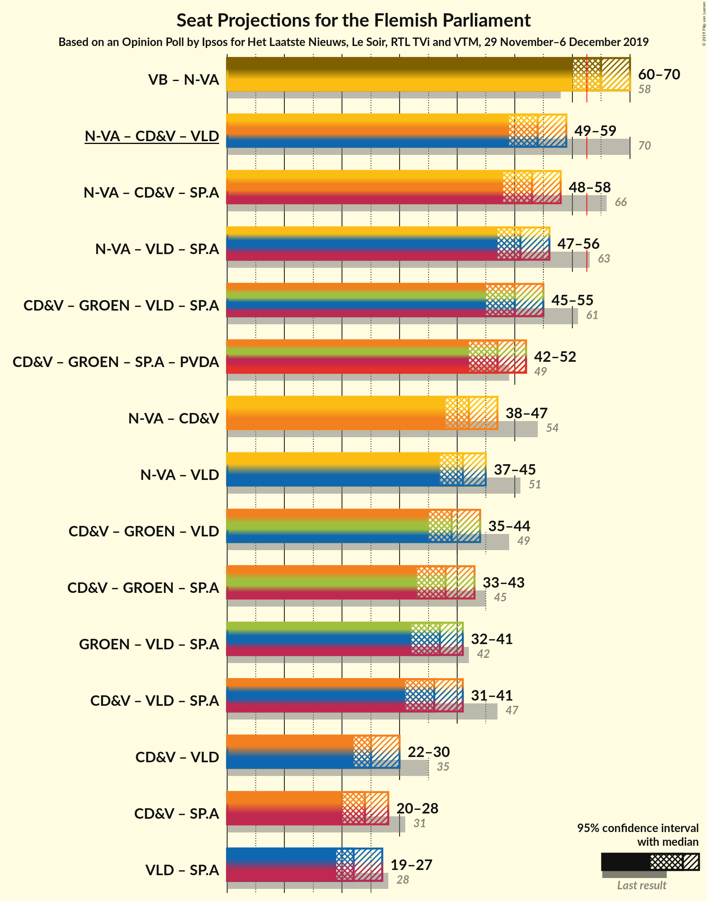

### Confidence Intervals

| Coalition | Last Result | Median | Majority? | 80% Confidence Interval | 90% Confidence Interval | 95% Confidence Interval | 99% Confidence Interval |
|:---------:|:-----------:|:------:|:---------:|:-----------------------:|:-----------------------:|:-----------------------:|:-----------------------:|
| Vlaams Belang – Nieuw-Vlaamse Alliantie | 58 | 66 | 81% | 62–68 | 61–69 | 61–70 | 59–71 |
| Nieuw-Vlaamse Alliantie – Christen-Democratisch en Vlaams – Open Vlaamse Liberalen en Democraten | 70 | 54 | 0% | 51–57 | 50–58 | 50–58 | 48–59 |
| Nieuw-Vlaamse Alliantie – Christen-Democratisch en Vlaams – Socialistische Partij Anders | 66 | 54 | 0% | 50–56 | 50–57 | 48–57 | 47–58 |
| Nieuw-Vlaamse Alliantie – Open Vlaamse Liberalen en Democraten – Socialistische Partij Anders | 63 | 52 | 0% | 49–55 | 48–55 | 48–56 | 46–57 |
| Christen-Democratisch en Vlaams – Groen – Open Vlaamse Liberalen en Democraten – Socialistische Partij Anders | 61 | 50 | 0% | 47–53 | 46–54 | 45–55 | 44–56 |
| Christen-Democratisch en Vlaams – Groen – Socialistische Partij Anders – Partij van de Arbeid van België | 49 | 47 | 0% | 44–50 | 43–50 | 43–52 | 42–53 |
| Nieuw-Vlaamse Alliantie – Christen-Democratisch en Vlaams | 54 | 43 | 0% | 40–46 | 39–46 | 39–47 | 38–47 |
| Nieuw-Vlaamse Alliantie – Open Vlaamse Liberalen en Democraten | 51 | 41 | 0% | 38–44 | 38–45 | 37–45 | 36–47 |
| Christen-Democratisch en Vlaams – Groen – Open Vlaamse Liberalen en Democraten | 49 | 39 | 0% | 36–42 | 36–43 | 35–44 | 34–46 |
| Christen-Democratisch en Vlaams – Groen – Socialistische Partij Anders | 45 | 39 | 0% | 35–41 | 34–42 | 34–42 | 32–45 |
| Christen-Democratisch en Vlaams – Open Vlaamse Liberalen en Democraten – Socialistische Partij Anders | 47 | 35 | 0% | 34–39 | 33–40 | 32–41 | 30–42 |
| Groen – Open Vlaamse Liberalen en Democraten – Socialistische Partij Anders | 42 | 37 | 0% | 34–39 | 33–40 | 32–41 | 31–42 |
| Christen-Democratisch en Vlaams – Open Vlaamse Liberalen en Democraten | 35 | 25 | 0% | 23–28 | 22–29 | 22–30 | 21–31 |
| Christen-Democratisch en Vlaams – Socialistische Partij Anders | 31 | 24 | 0% | 22–27 | 21–27 | 20–28 | 19–29 |
| Open Vlaamse Liberalen en Democraten – Socialistische Partij Anders | 28 | 22 | 0% | 20–25 | 20–26 | 19–26 | 17–27 |

### Vlaams Belang – Nieuw-Vlaamse Alliantie

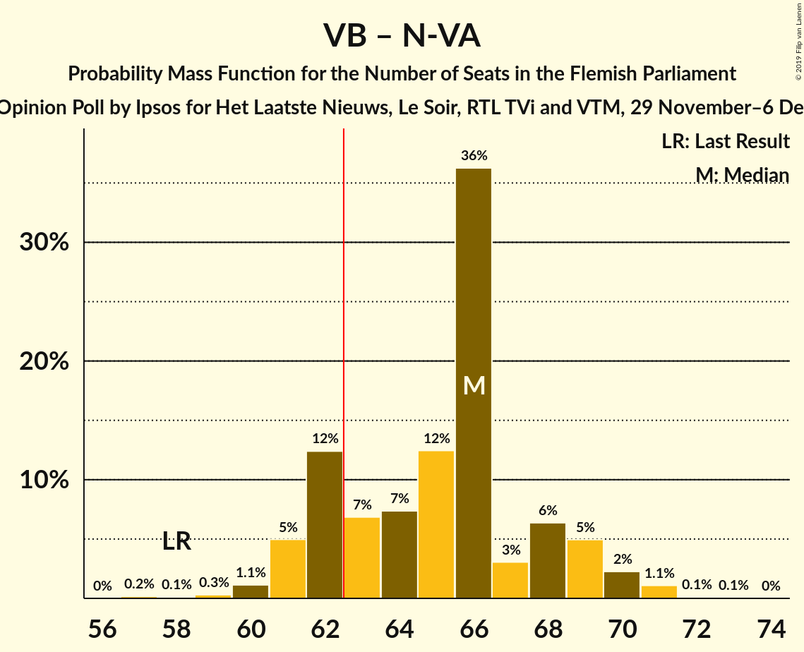

| Number of Seats | Probability | Accumulated | Special Marks |
|:---------------:|:-----------:|:-----------:|:-------------:|
| 57 | 0.2% | 100% |  |
| 58 | 0.1% | 99.8% | Last Result |
| 59 | 0.3% | 99.7% |  |
| 60 | 1.1% | 99.4% |  |
| 61 | 5% | 98% |  |
| 62 | 12% | 93% |  |
| 63 | 7% | 81% | Majority |
| 64 | 7% | 74% |  |
| 65 | 12% | 67% |  |
| 66 | 36% | 54% | Median |
| 67 | 3% | 18% |  |
| 68 | 6% | 15% |  |
| 69 | 5% | 9% |  |
| 70 | 2% | 4% |  |
| 71 | 1.1% | 1.3% |  |
| 72 | 0.1% | 0.2% |  |
| 73 | 0.1% | 0.1% |  |
| 74 | 0% | 0% |  |

### Nieuw-Vlaamse Alliantie – Christen-Democratisch en Vlaams – Open Vlaamse Liberalen en Democraten

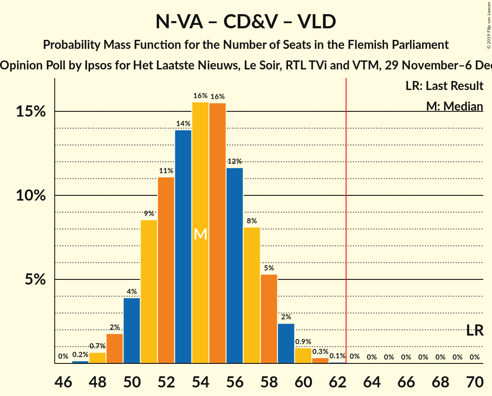

| Number of Seats | Probability | Accumulated | Special Marks |
|:---------------:|:-----------:|:-----------:|:-------------:|
| 47 | 0.1% | 100% |  |
| 48 | 0.4% | 99.9% |  |
| 49 | 0.6% | 99.5% |  |
| 50 | 5% | 98.9% |  |
| 51 | 4% | 94% |  |
| 52 | 4% | 90% |  |
| 53 | 7% | 86% |  |
| 54 | 37% | 79% | Median |
| 55 | 13% | 42% |  |
| 56 | 9% | 29% |  |
| 57 | 11% | 20% |  |
| 58 | 7% | 9% |  |
| 59 | 2% | 2% |  |
| 60 | 0.2% | 0.5% |  |
| 61 | 0.1% | 0.3% |  |
| 62 | 0.1% | 0.1% |  |
| 63 | 0% | 0% | Majority |
| 64 | 0% | 0% |  |
| 65 | 0% | 0% |  |
| 66 | 0% | 0% |  |
| 67 | 0% | 0% |  |
| 68 | 0% | 0% |  |
| 69 | 0% | 0% |  |
| 70 | 0% | 0% | Last Result |

### Nieuw-Vlaamse Alliantie – Christen-Democratisch en Vlaams – Socialistische Partij Anders

| Number of Seats | Probability | Accumulated | Special Marks |
|:---------------:|:-----------:|:-----------:|:-------------:|
| 46 | 0.1% | 100% |  |
| 47 | 0.7% | 99.9% |  |
| 48 | 2% | 99.2% |  |
| 49 | 1.2% | 97% |  |
| 50 | 6% | 95% |  |
| 51 | 5% | 89% |  |
| 52 | 13% | 84% |  |
| 53 | 8% | 71% |  |
| 54 | 35% | 63% | Median |
| 55 | 12% | 28% |  |
| 56 | 8% | 16% |  |
| 57 | 6% | 8% |  |
| 58 | 2% | 2% |  |
| 59 | 0.2% | 0.4% |  |
| 60 | 0.1% | 0.2% |  |
| 61 | 0% | 0% |  |
| 62 | 0% | 0% |  |
| 63 | 0% | 0% | Majority |
| 64 | 0% | 0% |  |
| 65 | 0% | 0% |  |
| 66 | 0% | 0% | Last Result |

### Nieuw-Vlaamse Alliantie – Open Vlaamse Liberalen en Democraten – Socialistische Partij Anders

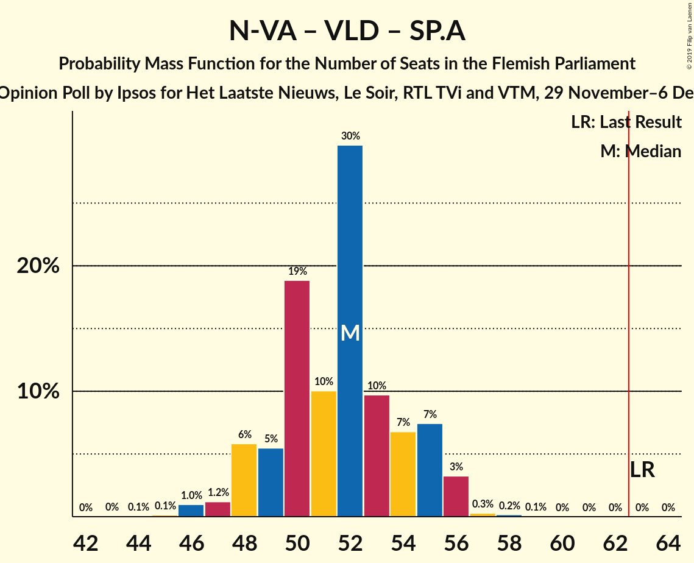

| Number of Seats | Probability | Accumulated | Special Marks |
|:---------------:|:-----------:|:-----------:|:-------------:|
| 43 | 0% | 100% |  |
| 44 | 0.1% | 99.9% |  |
| 45 | 0.1% | 99.9% |  |
| 46 | 1.0% | 99.7% |  |
| 47 | 1.2% | 98.8% |  |
| 48 | 6% | 98% |  |
| 49 | 5% | 92% |  |
| 50 | 19% | 86% |  |
| 51 | 10% | 67% |  |
| 52 | 30% | 57% | Median |
| 53 | 10% | 28% |  |
| 54 | 7% | 18% |  |
| 55 | 7% | 11% |  |
| 56 | 3% | 4% |  |
| 57 | 0.3% | 0.5% |  |
| 58 | 0.2% | 0.3% |  |
| 59 | 0.1% | 0.1% |  |
| 60 | 0% | 0% |  |
| 61 | 0% | 0% |  |
| 62 | 0% | 0% |  |
| 63 | 0% | 0% | Last Result, Majority |

### Christen-Democratisch en Vlaams – Groen – Open Vlaamse Liberalen en Democraten – Socialistische Partij Anders

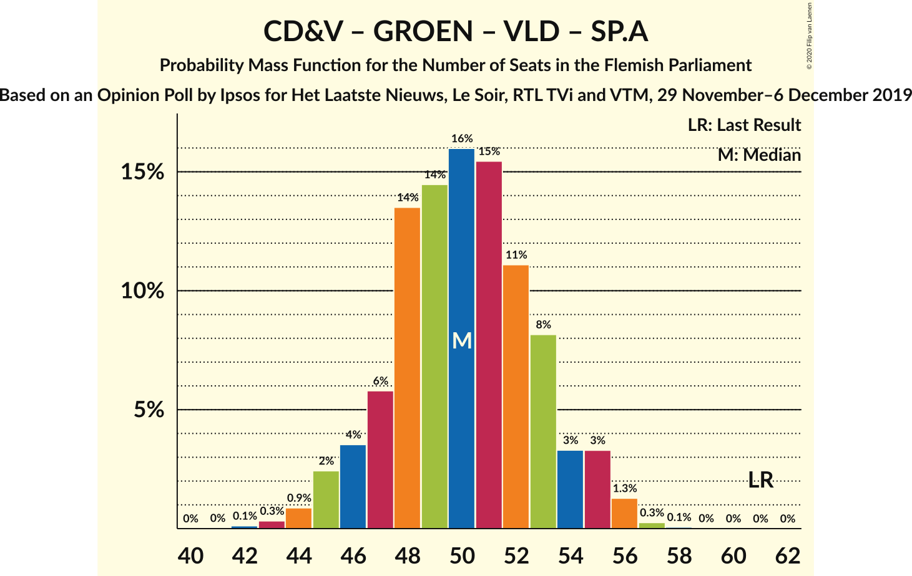

| Number of Seats | Probability | Accumulated | Special Marks |
|:---------------:|:-----------:|:-----------:|:-------------:|
| 43 | 0.2% | 100% |  |
| 44 | 1.2% | 99.8% |  |
| 45 | 2% | 98.6% |  |
| 46 | 3% | 97% |  |
| 47 | 4% | 94% |  |
| 48 | 12% | 90% |  |
| 49 | 5% | 78% | Median |
| 50 | 34% | 73% |  |
| 51 | 13% | 39% |  |
| 52 | 4% | 26% |  |
| 53 | 16% | 22% |  |
| 54 | 1.5% | 5% |  |
| 55 | 3% | 4% |  |
| 56 | 0.8% | 1.2% |  |
| 57 | 0.3% | 0.4% |  |
| 58 | 0% | 0.1% |  |
| 59 | 0% | 0% |  |
| 60 | 0% | 0% |  |
| 61 | 0% | 0% | Last Result |

### Christen-Democratisch en Vlaams – Groen – Socialistische Partij Anders – Partij van de Arbeid van België

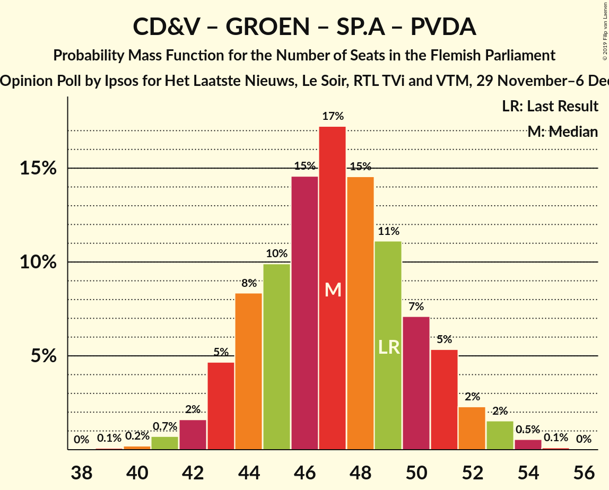

| Number of Seats | Probability | Accumulated | Special Marks |
|:---------------:|:-----------:|:-----------:|:-------------:|
| 40 | 0.1% | 100% |  |
| 41 | 0.2% | 99.9% |  |
| 42 | 1.3% | 99.6% |  |
| 43 | 5% | 98% |  |
| 44 | 7% | 93% |  |
| 45 | 6% | 86% |  |
| 46 | 8% | 79% | Median |
| 47 | 33% | 71% |  |
| 48 | 11% | 38% |  |
| 49 | 9% | 27% | Last Result |
| 50 | 13% | 18% |  |
| 51 | 2% | 5% |  |
| 52 | 1.1% | 3% |  |
| 53 | 1.2% | 1.4% |  |
| 54 | 0.2% | 0.2% |  |
| 55 | 0% | 0% |  |

### Nieuw-Vlaamse Alliantie – Christen-Democratisch en Vlaams

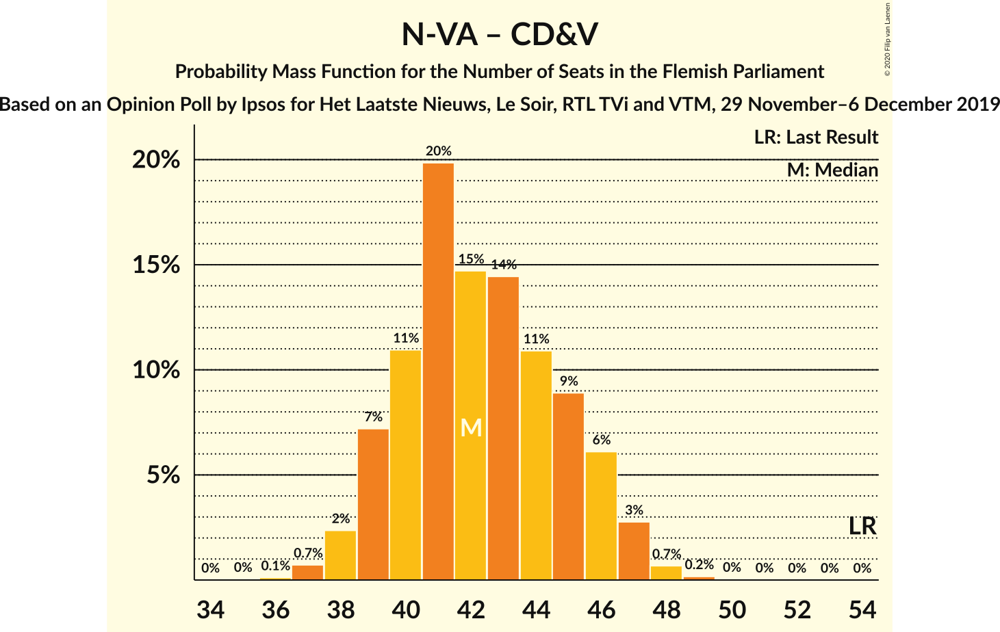

| Number of Seats | Probability | Accumulated | Special Marks |
|:---------------:|:-----------:|:-----------:|:-------------:|
| 36 | 0% | 100% |  |
| 37 | 0.4% | 99.9% |  |
| 38 | 1.2% | 99.5% |  |
| 39 | 6% | 98% |  |
| 40 | 6% | 92% |  |
| 41 | 9% | 86% |  |
| 42 | 13% | 77% |  |
| 43 | 36% | 64% | Median |
| 44 | 8% | 28% |  |
| 45 | 6% | 20% |  |
| 46 | 10% | 13% |  |
| 47 | 2% | 3% |  |
| 48 | 0.2% | 0.4% |  |
| 49 | 0.1% | 0.2% |  |
| 50 | 0% | 0.1% |  |
| 51 | 0% | 0% |  |
| 52 | 0% | 0% |  |
| 53 | 0% | 0% |  |
| 54 | 0% | 0% | Last Result |

### Nieuw-Vlaamse Alliantie – Open Vlaamse Liberalen en Democraten

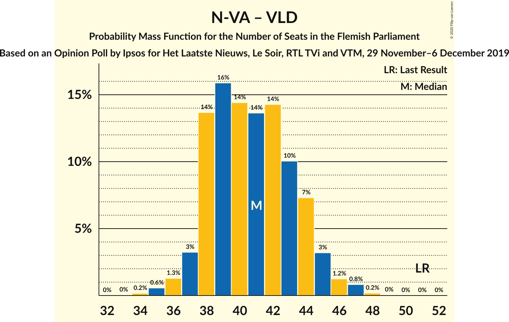

| Number of Seats | Probability | Accumulated | Special Marks |
|:---------------:|:-----------:|:-----------:|:-------------:|
| 34 | 0.1% | 100% |  |
| 35 | 0.3% | 99.9% |  |
| 36 | 0.7% | 99.6% |  |
| 37 | 2% | 98.9% |  |
| 38 | 9% | 97% |  |
| 39 | 16% | 88% |  |
| 40 | 11% | 72% |  |
| 41 | 32% | 61% | Median |
| 42 | 10% | 29% |  |
| 43 | 6% | 19% |  |
| 44 | 7% | 13% |  |
| 45 | 3% | 5% |  |
| 46 | 0.9% | 2% |  |
| 47 | 1.1% | 1.3% |  |
| 48 | 0.1% | 0.2% |  |
| 49 | 0% | 0% |  |
| 50 | 0% | 0% |  |
| 51 | 0% | 0% | Last Result |

### Christen-Democratisch en Vlaams – Groen – Open Vlaamse Liberalen en Democraten

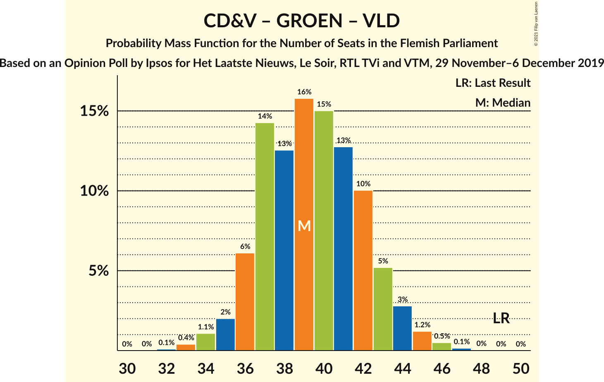

| Number of Seats | Probability | Accumulated | Special Marks |
|:---------------:|:-----------:|:-----------:|:-------------:|
| 32 | 0% | 100% |  |
| 33 | 0.3% | 99.9% |  |
| 34 | 1.3% | 99.6% |  |
| 35 | 2% | 98% |  |
| 36 | 6% | 96% |  |
| 37 | 6% | 90% |  |
| 38 | 11% | 83% | Median |
| 39 | 34% | 72% |  |
| 40 | 5% | 38% |  |
| 41 | 6% | 33% |  |
| 42 | 19% | 27% |  |
| 43 | 4% | 8% |  |
| 44 | 3% | 4% |  |
| 45 | 0.8% | 1.3% |  |
| 46 | 0.4% | 0.5% |  |
| 47 | 0.1% | 0.2% |  |
| 48 | 0.1% | 0.1% |  |
| 49 | 0% | 0% | Last Result |

### Christen-Democratisch en Vlaams – Groen – Socialistische Partij Anders

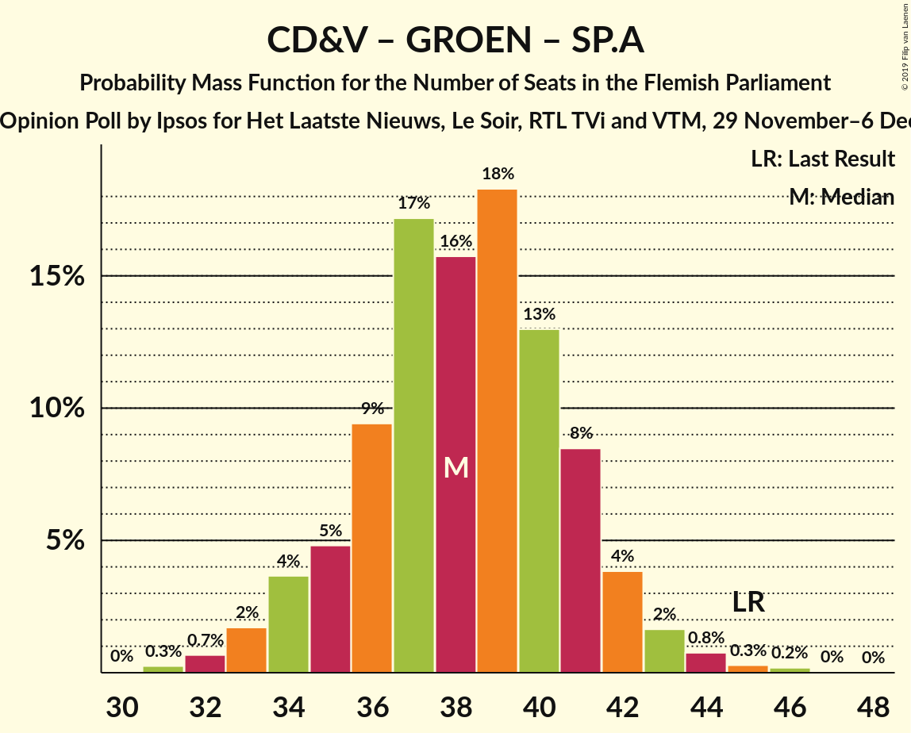

| Number of Seats | Probability | Accumulated | Special Marks |
|:---------------:|:-----------:|:-----------:|:-------------:|
| 32 | 1.1% | 100% |  |
| 33 | 1.4% | 98.9% |  |
| 34 | 3% | 98% |  |
| 35 | 5% | 94% |  |
| 36 | 7% | 89% |  |
| 37 | 10% | 82% |  |
| 38 | 9% | 72% | Median |
| 39 | 35% | 63% |  |
| 40 | 8% | 29% |  |
| 41 | 15% | 21% |  |
| 42 | 3% | 6% |  |
| 43 | 2% | 2% |  |
| 44 | 0.3% | 0.8% |  |
| 45 | 0.3% | 0.5% | Last Result |
| 46 | 0.2% | 0.2% |  |
| 47 | 0% | 0% |  |

### Christen-Democratisch en Vlaams – Open Vlaamse Liberalen en Democraten – Socialistische Partij Anders

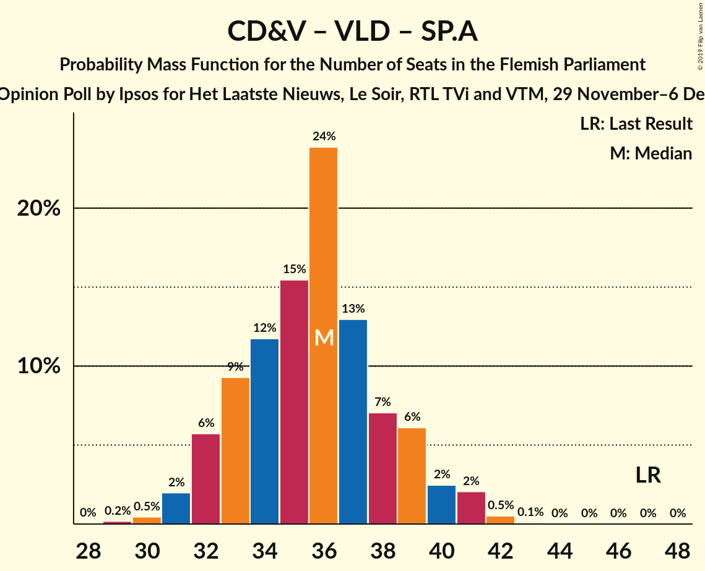

| Number of Seats | Probability | Accumulated | Special Marks |
|:---------------:|:-----------:|:-----------:|:-------------:|
| 29 | 0.3% | 100% |  |
| 30 | 0.3% | 99.7% |  |
| 31 | 1.1% | 99.4% |  |
| 32 | 2% | 98% |  |
| 33 | 5% | 96% |  |
| 34 | 10% | 91% |  |
| 35 | 32% | 81% | Median |
| 36 | 13% | 50% |  |
| 37 | 11% | 37% |  |
| 38 | 9% | 26% |  |
| 39 | 12% | 17% |  |
| 40 | 0.9% | 5% |  |
| 41 | 4% | 4% |  |
| 42 | 0.5% | 0.5% |  |
| 43 | 0% | 0.1% |  |
| 44 | 0% | 0% |  |
| 45 | 0% | 0% |  |
| 46 | 0% | 0% |  |
| 47 | 0% | 0% | Last Result |

### Groen – Open Vlaamse Liberalen en Democraten – Socialistische Partij Anders

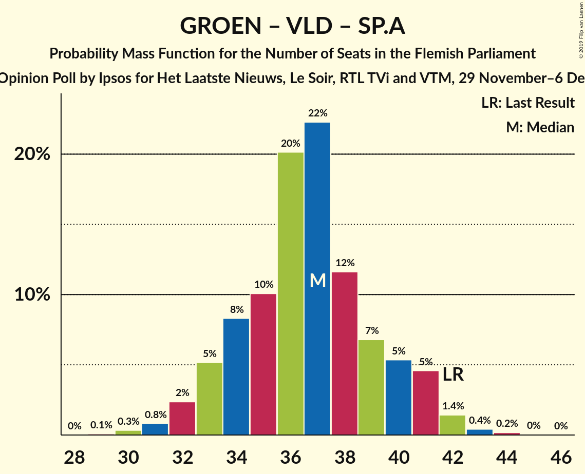

| Number of Seats | Probability | Accumulated | Special Marks |
|:---------------:|:-----------:|:-----------:|:-------------:|
| 29 | 0% | 100% |  |
| 30 | 0% | 99.9% |  |
| 31 | 1.1% | 99.9% |  |
| 32 | 2% | 98.8% |  |
| 33 | 5% | 97% |  |
| 34 | 8% | 91% |  |
| 35 | 6% | 83% |  |
| 36 | 13% | 77% | Median |
| 37 | 41% | 64% |  |
| 38 | 7% | 23% |  |
| 39 | 8% | 15% |  |
| 40 | 4% | 8% |  |
| 41 | 3% | 4% |  |
| 42 | 1.2% | 2% | Last Result |
| 43 | 0.2% | 0.3% |  |
| 44 | 0.1% | 0.1% |  |
| 45 | 0% | 0% |  |

### Christen-Democratisch en Vlaams – Open Vlaamse Liberalen en Democraten

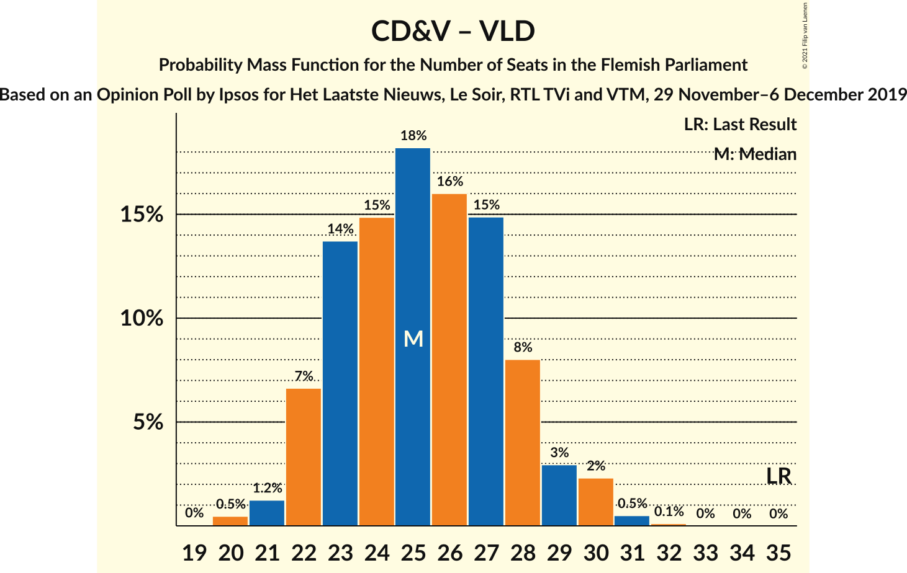

| Number of Seats | Probability | Accumulated | Special Marks |
|:---------------:|:-----------:|:-----------:|:-------------:|
| 19 | 0% | 100% |  |
| 20 | 0.3% | 99.9% |  |
| 21 | 0.7% | 99.6% |  |
| 22 | 7% | 99.0% |  |
| 23 | 7% | 92% |  |
| 24 | 31% | 85% | Median |
| 25 | 12% | 54% |  |
| 26 | 9% | 42% |  |
| 27 | 15% | 33% |  |
| 28 | 14% | 19% |  |
| 29 | 3% | 5% |  |
| 30 | 2% | 3% |  |
| 31 | 0.4% | 0.5% |  |
| 32 | 0.1% | 0.1% |  |
| 33 | 0% | 0% |  |
| 34 | 0% | 0% |  |
| 35 | 0% | 0% | Last Result |

### Christen-Democratisch en Vlaams – Socialistische Partij Anders

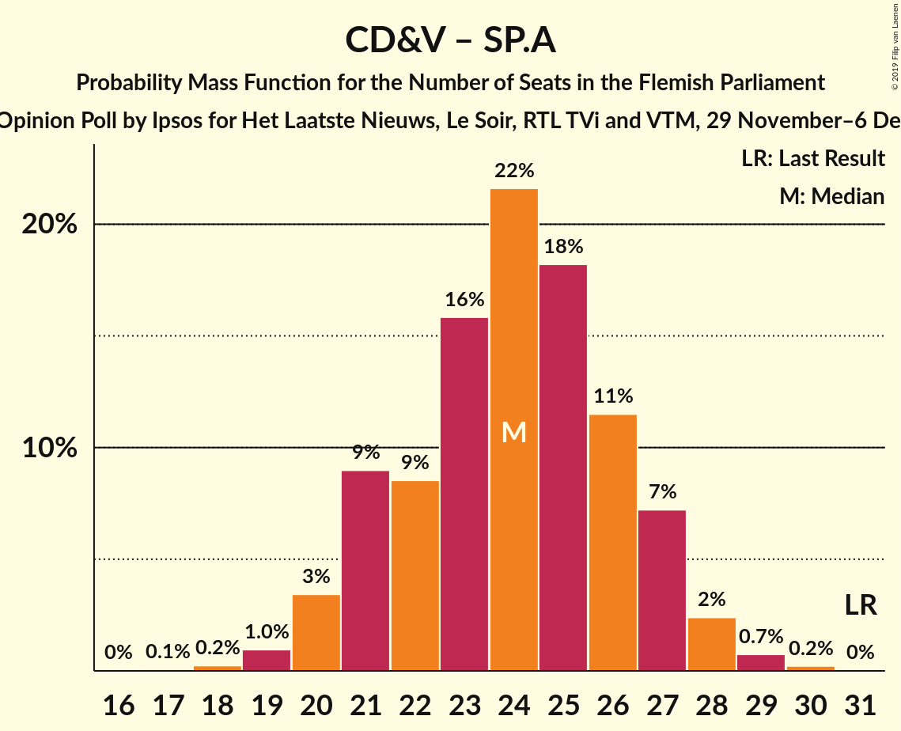

| Number of Seats | Probability | Accumulated | Special Marks |
|:---------------:|:-----------:|:-----------:|:-------------:|
| 18 | 0.3% | 100% |  |
| 19 | 0.4% | 99.6% |  |
| 20 | 4% | 99.3% |  |
| 21 | 5% | 96% |  |
| 22 | 5% | 91% |  |
| 23 | 13% | 86% |  |
| 24 | 29% | 73% | Median |
| 25 | 18% | 44% |  |
| 26 | 8% | 26% |  |
| 27 | 14% | 17% |  |
| 28 | 2% | 3% |  |
| 29 | 1.4% | 2% |  |
| 30 | 0.2% | 0.3% |  |
| 31 | 0% | 0% | Last Result |

### Open Vlaamse Liberalen en Democraten – Socialistische Partij Anders

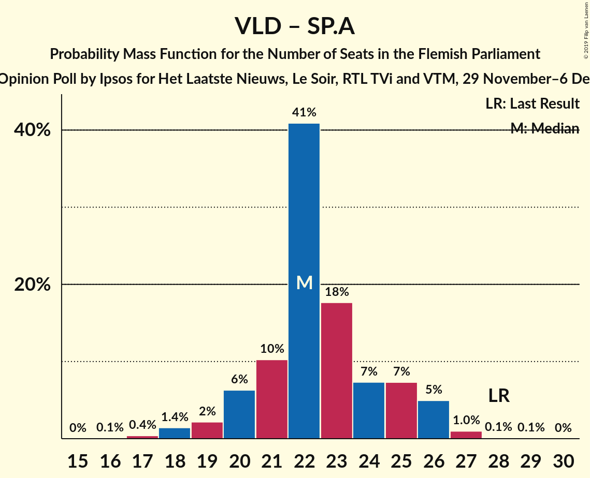

| Number of Seats | Probability | Accumulated | Special Marks |
|:---------------:|:-----------:|:-----------:|:-------------:|
| 16 | 0.1% | 100% |  |
| 17 | 0.4% | 99.9% |  |
| 18 | 1.4% | 99.5% |  |
| 19 | 2% | 98% |  |
| 20 | 6% | 96% |  |
| 21 | 10% | 90% |  |
| 22 | 41% | 79% | Median |
| 23 | 18% | 38% |  |
| 24 | 7% | 21% |  |
| 25 | 7% | 13% |  |
| 26 | 5% | 6% |  |
| 27 | 1.0% | 1.2% |  |
| 28 | 0.1% | 0.2% | Last Result |
| 29 | 0.1% | 0.1% |  |
| 30 | 0% | 0% |  |

## Technical Information

### Opinion Poll

+ **Polling firm:** Ipsos
+ **Commissioner(s):** Het Laatste Nieuws, Le Soir, RTL TVi and VTM
+ **Fieldwork period:** 29 November–6 December 2019

### Calculations

+ **Sample size:** 999
+ **Simulations done:** 65,536
+ **Error estimate:** 1.46%

