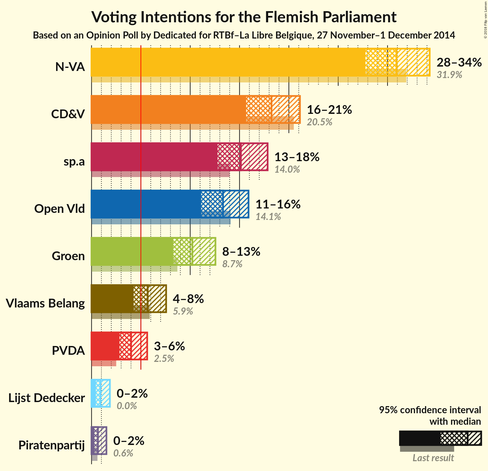
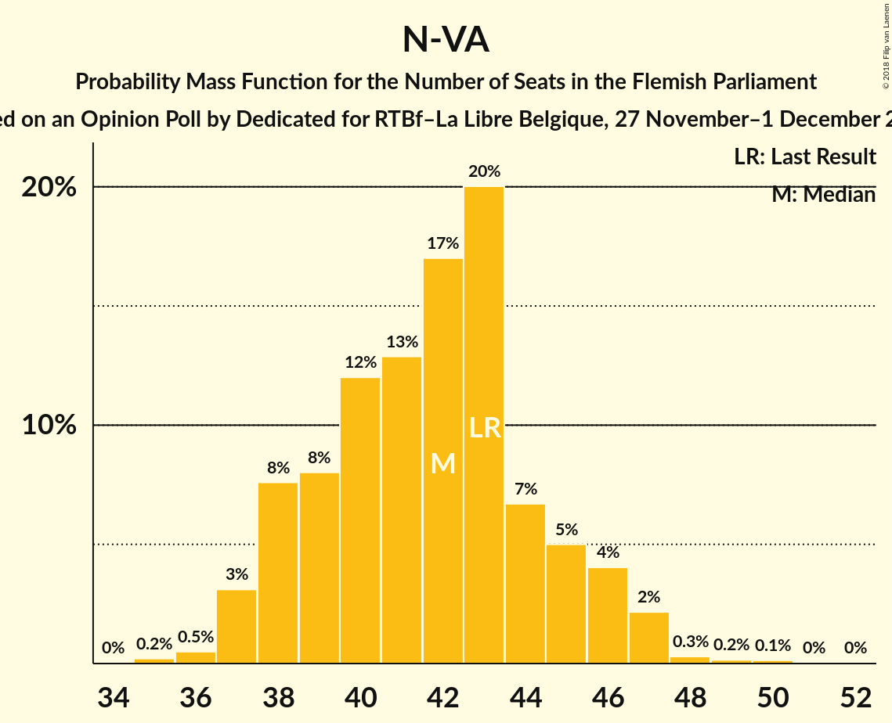
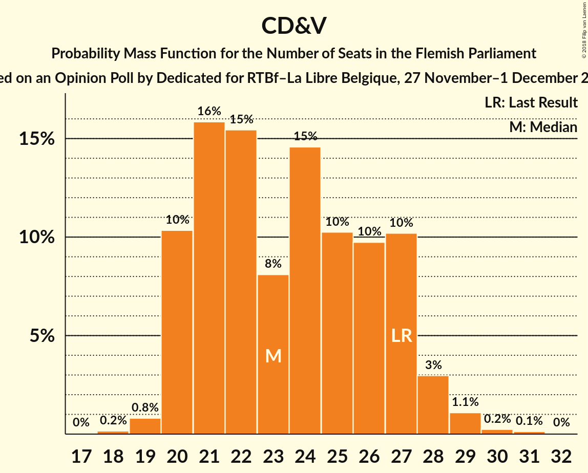
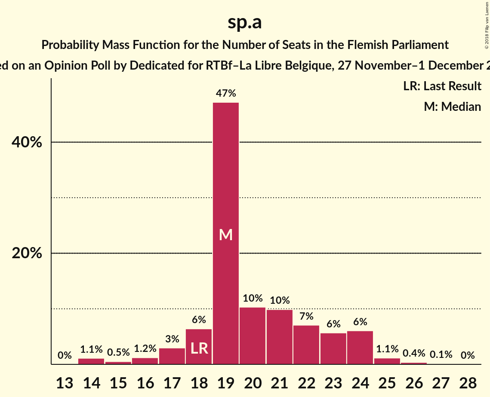
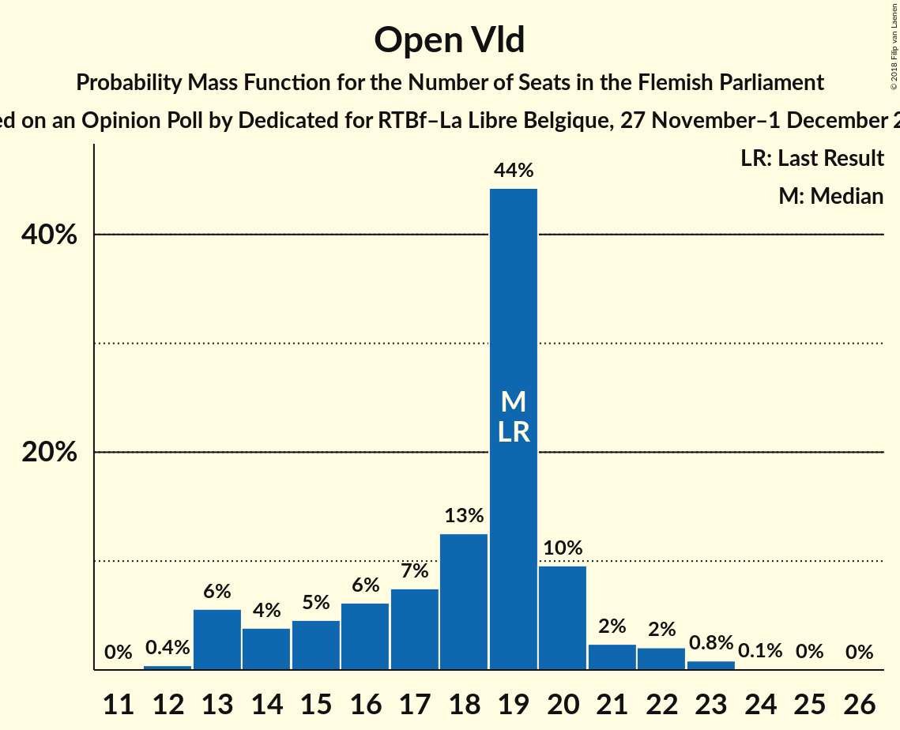
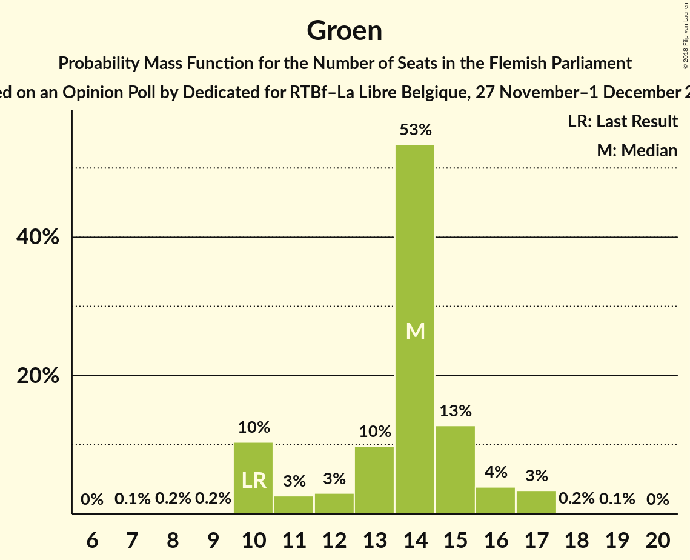
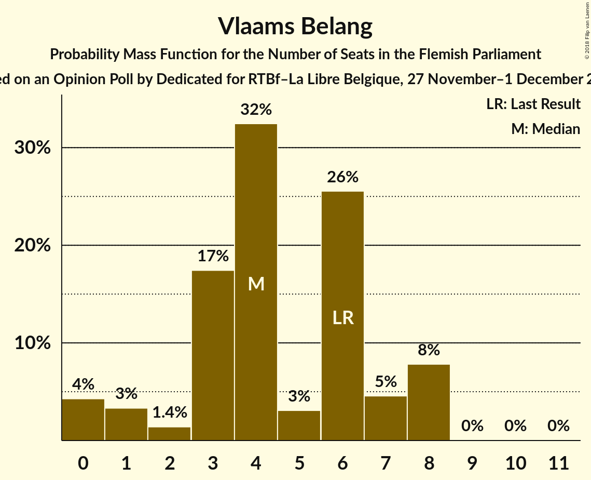
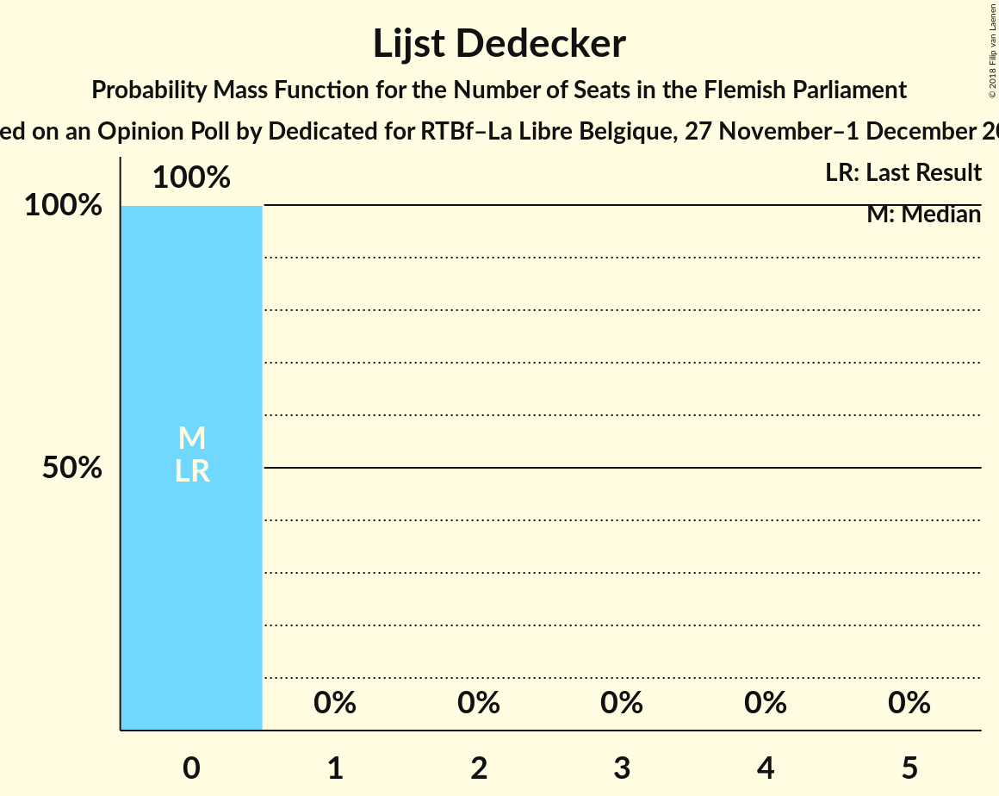
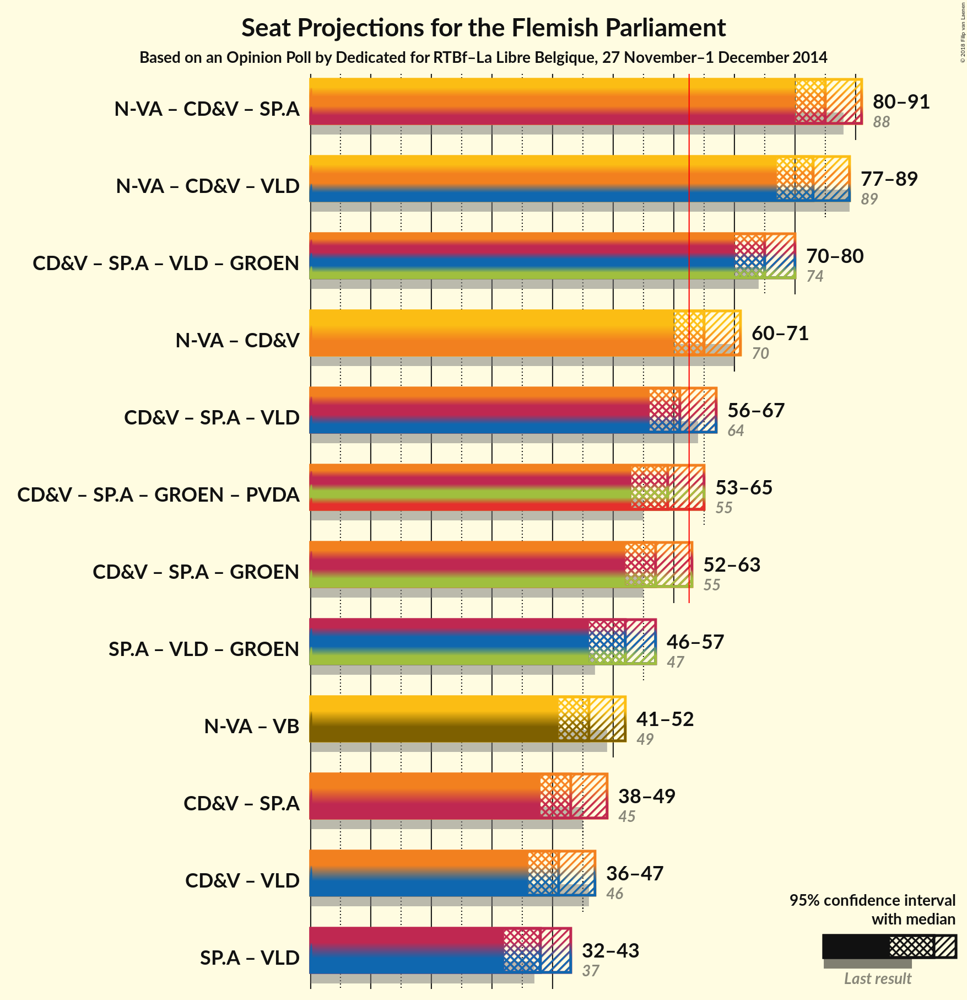

# Opinion Poll by Dedicated for RTBf–La Libre Belgique, 27 November–1 December 2014

<a href="#voting-intentions">Voting Intentions</a> | <a href="#seats">Seats</a> | <a href="#coalitions">Coalitions</a> | <a href="#technical-information">Technical Information</a>

## Voting Intentions

### Confidence Intervals

| Party | Last Result | Poll Result | 80% Confidence Interval | 90% Confidence Interval | 95% Confidence Interval | 99% Confidence Interval |
|:-----:|:-----------:|:-----------:|:-----------------------:|:-----------------------:|:-----------------------:|:-----------------------:|
| N-VA | 31.9% | 30.9% | 28.8–33.1% |28.3–33.7% |27.8–34.3% |26.8–35.3% |
| CD&V | 20.5% | 18.2% | 16.6–20.1% |16.1–20.7% |15.7–21.1% |14.9–22.1% |
| sp.a | 14.0% | 15.1% | 13.6–16.9% |13.2–17.4% |12.8–17.8% |12.1–18.7% |
| Open Vld | 14.1% | 13.3% | 11.9–15.0% |11.5–15.5% |11.1–15.9% |10.4–16.8% |
| Groen | 8.7% | 10.2% | 8.9–11.8% |8.6–12.2% |8.3–12.6% |7.7–13.3% |
| Vlaams Belang | 5.9% | 5.7% | 4.8–6.9% |4.5–7.3% |4.3–7.6% |3.9–8.2% |
| PVDA | 2.5% | 4.0% | 3.2–5.1% |3.0–5.4% |2.8–5.6% |2.5–6.2% |
| Lijst Dedecker | 0.0% | 0.9% | 0.6–1.5% |0.5–1.7% |0.4–1.9% |0.3–2.2% |
| Piratenpartij | 0.6% | 0.6% | 0.4–1.2% |0.3–1.4% |0.3–1.5% |0.2–1.8% |

*Note:* The poll result column reflects the actual value used in the calculations. Published results may vary slightly, and in addition be rounded to fewer digits.

## Seats

### Confidence Intervals

| Party | Last Result | Median | 80% Confidence Interval | 90% Confidence Interval | 95% Confidence Interval | 99% Confidence Interval |
|:-----:|:-----------:|:------:|:-----------------------:|:-----------------------:|:-----------------------:|:-----------------------:|
| <a href="#n-va">N-VA</a> | 43 | 42 | 38–45 |38–46 |37–47 |36–48 |
| <a href="#cd&v">CD&V</a> | 27 | 23 | 20–27 |20–27 |20–28 |19–29 |
| <a href="#sp.a">sp.a</a> | 18 | 19 | 18–23 |17–24 |16–24 |14–26 |
| <a href="#open-vld">Open Vld</a> | 19 | 19 | 15–20 |13–21 |13–22 |13–23 |
| <a href="#groen">Groen</a> | 10 | 14 | 10–15 |10–16 |10–17 |10–17 |
| <a href="#vlaams-belang">Vlaams Belang</a> | 6 | 4 | 3–7 |1–8 |0–8 |0–8 |
| <a href="#pvda">PVDA</a> | 0 | 2 | 0–2 |0–4 |0–5 |0–5 |
| <a href="#lijst-dedecker">Lijst Dedecker</a> | 0 | 0 | 0 |0 |0 |0 |
| <a href="#piratenpartij">Piratenpartij</a> | 0 | 0 | 0 |0 |0 |0 |

### N-VA

*For a full overview of the results for this party, see the [N-VA](party-n-va.html) page.*

| Number of Seats | Probability | Accumulated | Special Marks |
|:---------------:|:-----------:|:-----------:|:-------------:|
| 34 | 0% | 100% |  |
| 35 | 0.2% | 99.9% |  |
| 36 | 0.5% | 99.7% |  |
| 37 | 3% | 99.2% |  |
| 38 | 8% | 96% |  |
| 39 | 8% | 89% |  |
| 40 | 12% | 80% |  |
| 41 | 13% | 68% |  |
| 42 | 17% | 56% | Median |
| 43 | 20% | 39% | Last Result |
| 44 | 7% | 19% |  |
| 45 | 5% | 12% |  |
| 46 | 4% | 7% |  |
| 47 | 2% | 3% |  |
| 48 | 0.3% | 0.7% |  |
| 49 | 0.2% | 0.4% |  |
| 50 | 0.1% | 0.2% |  |
| 51 | 0% | 0.1% |  |
| 52 | 0% | 0% |  |

### CD&V

*For a full overview of the results for this party, see the [CD&V](party-cdv.html) page.*

| Number of Seats | Probability | Accumulated | Special Marks |
|:---------------:|:-----------:|:-----------:|:-------------:|
| 17 | 0% | 100% |  |
| 18 | 0.2% | 99.9% |  |
| 19 | 0.8% | 99.8% |  |
| 20 | 10% | 99.0% |  |
| 21 | 16% | 89% |  |
| 22 | 15% | 73% |  |
| 23 | 8% | 57% | Median |
| 24 | 15% | 49% |  |
| 25 | 10% | 35% |  |
| 26 | 10% | 24% |  |
| 27 | 10% | 15% | Last Result |
| 28 | 3% | 4% |  |
| 29 | 1.1% | 2% |  |
| 30 | 0.2% | 0.4% |  |
| 31 | 0.1% | 0.2% |  |
| 32 | 0% | 0% |  |

### sp.a

*For a full overview of the results for this party, see the [sp.a](party-spa.html) page.*

| Number of Seats | Probability | Accumulated | Special Marks |
|:---------------:|:-----------:|:-----------:|:-------------:|
| 14 | 1.1% | 100% |  |
| 15 | 0.5% | 98.9% |  |
| 16 | 1.2% | 98% |  |
| 17 | 3% | 97% |  |
| 18 | 6% | 94% | Last Result |
| 19 | 47% | 88% | Median |
| 20 | 10% | 41% |  |
| 21 | 10% | 30% |  |
| 22 | 7% | 20% |  |
| 23 | 6% | 13% |  |
| 24 | 6% | 8% |  |
| 25 | 1.1% | 2% |  |
| 26 | 0.4% | 0.5% |  |
| 27 | 0.1% | 0.2% |  |
| 28 | 0% | 0% |  |

### Open Vld

*For a full overview of the results for this party, see the [Open Vld](party-openvld.html) page.*

| Number of Seats | Probability | Accumulated | Special Marks |
|:---------------:|:-----------:|:-----------:|:-------------:|
| 12 | 0.4% | 100% |  |
| 13 | 6% | 99.6% |  |
| 14 | 4% | 94% |  |
| 15 | 5% | 90% |  |
| 16 | 6% | 86% |  |
| 17 | 7% | 79% |  |
| 18 | 13% | 72% |  |
| 19 | 44% | 59% | Last Result, Median |
| 20 | 10% | 15% |  |
| 21 | 2% | 5% |  |
| 22 | 2% | 3% |  |
| 23 | 0.8% | 1.0% |  |
| 24 | 0.1% | 0.2% |  |
| 25 | 0% | 0.1% |  |
| 26 | 0% | 0% |  |

### Groen

*For a full overview of the results for this party, see the [Groen](party-groen.html) page.*

| Number of Seats | Probability | Accumulated | Special Marks |
|:---------------:|:-----------:|:-----------:|:-------------:|
| 7 | 0.1% | 100% |  |
| 8 | 0.2% | 99.9% |  |
| 9 | 0.2% | 99.7% |  |
| 10 | 10% | 99.6% | Last Result |
| 11 | 3% | 89% |  |
| 12 | 3% | 87% |  |
| 13 | 10% | 84% |  |
| 14 | 53% | 74% | Median |
| 15 | 13% | 20% |  |
| 16 | 4% | 8% |  |
| 17 | 3% | 4% |  |
| 18 | 0.2% | 0.3% |  |
| 19 | 0.1% | 0.1% |  |
| 20 | 0% | 0% |  |

### Vlaams Belang

*For a full overview of the results for this party, see the [Vlaams Belang](party-vlaamsbelang.html) page.*

| Number of Seats | Probability | Accumulated | Special Marks |
|:---------------:|:-----------:|:-----------:|:-------------:|
| 0 | 4% | 100% |  |
| 1 | 3% | 96% |  |
| 2 | 1.4% | 92% |  |
| 3 | 17% | 91% |  |
| 4 | 32% | 74% | Median |
| 5 | 3% | 41% |  |
| 6 | 26% | 38% | Last Result |
| 7 | 5% | 12% |  |
| 8 | 8% | 8% |  |
| 9 | 0% | 0.1% |  |
| 10 | 0% | 0.1% |  |
| 11 | 0% | 0% |  |

### PVDA

*For a full overview of the results for this party, see the [PVDA](party-pvda.html) page.*

| Number of Seats | Probability | Accumulated | Special Marks |
|:---------------:|:-----------:|:-----------:|:-------------:|
| 0 | 12% | 100% | Last Result |
| 1 | 9% | 88% |  |
| 2 | 69% | 79% | Median |
| 3 | 4% | 10% |  |
| 4 | 1.1% | 6% |  |
| 5 | 5% | 5% |  |
| 6 | 0% | 0.1% |  |
| 7 | 0% | 0% |  |

### Lijst Dedecker

*For a full overview of the results for this party, see the [Lijst Dedecker](party-lijstdedecker.html) page.*

| Number of Seats | Probability | Accumulated | Special Marks |
|:---------------:|:-----------:|:-----------:|:-------------:|
| 0 | 100% | 100% | Last Result, Median |

### Piratenpartij

*For a full overview of the results for this party, see the [Piratenpartij](party-piratenpartij.html) page.*

| Number of Seats | Probability | Accumulated | Special Marks |
|:---------------:|:-----------:|:-----------:|:-------------:|
| 0 | 100% | 100% | Last Result, Median |

## Coalitions

### Confidence Intervals

| Coalition | Last Result | Median | Majority? | 80% Confidence Interval | 90% Confidence Interval | 95% Confidence Interval | 99% Confidence Interval |
|:---------:|:-----------:|:------:|:---------:|:-----------------------:|:-----------------------:|:-----------------------:|:-----------------------:|
| N-VA – CD&V – sp.a | 88 | 85 | 100% | 81–89 | 81–90 | 80–91 | 78–93 |
| N-VA – CD&V – Open Vld | 89 | 83 | 100% | 79–87 | 78–88 | 77–89 | 76–91 |
| CD&V – sp.a – Open Vld – Groen | 74 | 75 | 100% | 72–79 | 70–80 | 70–80 | 68–82 |
| N-VA – CD&V | 70 | 65 | 82% | 62–69 | 61–70 | 60–71 | 58–73 |
| CD&V – sp.a – Open Vld | 64 | 61 | 35% | 58–65 | 57–66 | 56–67 | 54–68 |
| CD&V – sp.a – Groen – PVDA | 55 | 59 | 12% | 55–63 | 54–64 | 53–65 | 52–66 |
| CD&V – sp.a – Groen | 55 | 57 | 3% | 53–61 | 52–62 | 52–63 | 50–65 |
| sp.a – Open Vld – Groen | 47 | 52 | 0% | 48–55 | 47–56 | 46–57 | 44–58 |
| N-VA – Vlaams Belang | 49 | 46 | 0% | 43–50 | 42–51 | 41–52 | 40–53 |
| CD&V – sp.a | 45 | 43 | 0% | 40–47 | 39–48 | 38–49 | 37–51 |
| CD&V – Open Vld | 46 | 41 | 0% | 38–45 | 37–46 | 36–47 | 34–48 |
| sp.a – Open Vld | 37 | 38 | 0% | 34–41 | 33–42 | 32–43 | 31–45 |

### N-VA – CD&V – sp.a

| Number of Seats | Probability | Accumulated | Special Marks |
|:---------------:|:-----------:|:-----------:|:-------------:|
| 76 | 0.1% | 100% |  |
| 77 | 0.3% | 99.9% |  |
| 78 | 0.2% | 99.6% |  |
| 79 | 1.4% | 99.4% |  |
| 80 | 2% | 98% |  |
| 81 | 7% | 96% |  |
| 82 | 6% | 89% |  |
| 83 | 7% | 83% |  |
| 84 | 24% | 76% | Median |
| 85 | 14% | 52% |  |
| 86 | 11% | 38% |  |
| 87 | 6% | 27% |  |
| 88 | 9% | 22% | Last Result |
| 89 | 7% | 13% |  |
| 90 | 2% | 6% |  |
| 91 | 2% | 4% |  |
| 92 | 1.0% | 2% |  |
| 93 | 0.3% | 0.7% |  |
| 94 | 0.3% | 0.4% |  |
| 95 | 0% | 0.1% |  |
| 96 | 0% | 0% |  |

### N-VA – CD&V – Open Vld

| Number of Seats | Probability | Accumulated | Special Marks |
|:---------------:|:-----------:|:-----------:|:-------------:|
| 73 | 0% | 100% |  |
| 74 | 0.1% | 99.9% |  |
| 75 | 0.2% | 99.9% |  |
| 76 | 1.1% | 99.7% |  |
| 77 | 2% | 98.6% |  |
| 78 | 4% | 97% |  |
| 79 | 3% | 93% |  |
| 80 | 3% | 90% |  |
| 81 | 12% | 87% |  |
| 82 | 17% | 74% |  |
| 83 | 11% | 58% |  |
| 84 | 14% | 47% | Median |
| 85 | 13% | 33% |  |
| 86 | 6% | 20% |  |
| 87 | 8% | 14% |  |
| 88 | 2% | 6% |  |
| 89 | 1.4% | 3% | Last Result |
| 90 | 1.0% | 2% |  |
| 91 | 0.4% | 0.7% |  |
| 92 | 0.2% | 0.3% |  |
| 93 | 0.1% | 0.1% |  |
| 94 | 0% | 0% |  |

### CD&V – sp.a – Open Vld – Groen

| Number of Seats | Probability | Accumulated | Special Marks |
|:---------------:|:-----------:|:-----------:|:-------------:|
| 65 | 0% | 100% |  |
| 66 | 0.1% | 99.9% |  |
| 67 | 0.2% | 99.8% |  |
| 68 | 1.0% | 99.7% |  |
| 69 | 1.1% | 98.6% |  |
| 70 | 3% | 98% |  |
| 71 | 3% | 95% |  |
| 72 | 8% | 91% |  |
| 73 | 10% | 84% |  |
| 74 | 18% | 74% | Last Result |
| 75 | 14% | 56% | Median |
| 76 | 10% | 42% |  |
| 77 | 10% | 31% |  |
| 78 | 12% | 22% |  |
| 79 | 4% | 10% |  |
| 80 | 5% | 6% |  |
| 81 | 0.9% | 2% |  |
| 82 | 0.4% | 0.6% |  |
| 83 | 0.1% | 0.2% |  |
| 84 | 0% | 0.1% |  |
| 85 | 0% | 0% |  |

### N-VA – CD&V

| Number of Seats | Probability | Accumulated | Special Marks |
|:---------------:|:-----------:|:-----------:|:-------------:|
| 57 | 0.2% | 100% |  |
| 58 | 0.5% | 99.7% |  |
| 59 | 0.8% | 99.2% |  |
| 60 | 3% | 98% |  |
| 61 | 4% | 96% |  |
| 62 | 10% | 91% |  |
| 63 | 12% | 82% | Majority |
| 64 | 10% | 70% |  |
| 65 | 18% | 60% | Median |
| 66 | 13% | 42% |  |
| 67 | 9% | 29% |  |
| 68 | 5% | 20% |  |
| 69 | 7% | 14% |  |
| 70 | 3% | 7% | Last Result |
| 71 | 2% | 4% |  |
| 72 | 1.3% | 2% |  |
| 73 | 0.4% | 0.6% |  |
| 74 | 0.1% | 0.2% |  |
| 75 | 0.1% | 0.1% |  |
| 76 | 0% | 0% |  |

### CD&V – sp.a – Open Vld

| Number of Seats | Probability | Accumulated | Special Marks |
|:---------------:|:-----------:|:-----------:|:-------------:|
| 52 | 0.1% | 100% |  |
| 53 | 0.2% | 99.9% |  |
| 54 | 0.6% | 99.7% |  |
| 55 | 0.9% | 99.1% |  |
| 56 | 2% | 98% |  |
| 57 | 4% | 96% |  |
| 58 | 6% | 92% |  |
| 59 | 8% | 86% |  |
| 60 | 17% | 78% |  |
| 61 | 13% | 61% | Median |
| 62 | 14% | 48% |  |
| 63 | 10% | 35% | Majority |
| 64 | 11% | 24% | Last Result |
| 65 | 6% | 13% |  |
| 66 | 3% | 7% |  |
| 67 | 2% | 4% |  |
| 68 | 1.0% | 1.4% |  |
| 69 | 0.2% | 0.4% |  |
| 70 | 0.2% | 0.2% |  |
| 71 | 0% | 0.1% |  |
| 72 | 0% | 0% |  |

### CD&V – sp.a – Groen – PVDA

| Number of Seats | Probability | Accumulated | Special Marks |
|:---------------:|:-----------:|:-----------:|:-------------:|
| 50 | 0.1% | 100% |  |
| 51 | 0.2% | 99.9% |  |
| 52 | 1.1% | 99.7% |  |
| 53 | 1.2% | 98.5% |  |
| 54 | 3% | 97% |  |
| 55 | 6% | 94% | Last Result |
| 56 | 7% | 88% |  |
| 57 | 18% | 81% |  |
| 58 | 10% | 64% | Median |
| 59 | 14% | 54% |  |
| 60 | 12% | 40% |  |
| 61 | 7% | 28% |  |
| 62 | 9% | 21% |  |
| 63 | 5% | 12% | Majority |
| 64 | 4% | 7% |  |
| 65 | 2% | 3% |  |
| 66 | 0.5% | 0.9% |  |
| 67 | 0.4% | 0.4% |  |
| 68 | 0% | 0.1% |  |
| 69 | 0% | 0% |  |

### CD&V – sp.a – Groen

| Number of Seats | Probability | Accumulated | Special Marks |
|:---------------:|:-----------:|:-----------:|:-------------:|
| 48 | 0.1% | 100% |  |
| 49 | 0.2% | 99.9% |  |
| 50 | 0.7% | 99.7% |  |
| 51 | 1.4% | 99.1% |  |
| 52 | 3% | 98% |  |
| 53 | 6% | 95% |  |
| 54 | 6% | 89% |  |
| 55 | 18% | 83% | Last Result |
| 56 | 10% | 65% | Median |
| 57 | 14% | 55% |  |
| 58 | 10% | 41% |  |
| 59 | 9% | 31% |  |
| 60 | 8% | 22% |  |
| 61 | 8% | 14% |  |
| 62 | 3% | 6% |  |
| 63 | 2% | 3% | Majority |
| 64 | 0.4% | 0.9% |  |
| 65 | 0.3% | 0.5% |  |
| 66 | 0.2% | 0.2% |  |
| 67 | 0% | 0% |  |

### sp.a – Open Vld – Groen

| Number of Seats | Probability | Accumulated | Special Marks |
|:---------------:|:-----------:|:-----------:|:-------------:|
| 42 | 0.1% | 100% |  |
| 43 | 0.3% | 99.9% |  |
| 44 | 0.6% | 99.6% |  |
| 45 | 1.1% | 99.0% |  |
| 46 | 2% | 98% |  |
| 47 | 4% | 96% | Last Result |
| 48 | 6% | 91% |  |
| 49 | 6% | 85% |  |
| 50 | 7% | 79% |  |
| 51 | 12% | 71% |  |
| 52 | 26% | 59% | Median |
| 53 | 11% | 33% |  |
| 54 | 10% | 23% |  |
| 55 | 3% | 12% |  |
| 56 | 6% | 9% |  |
| 57 | 2% | 3% |  |
| 58 | 0.9% | 1.2% |  |
| 59 | 0.2% | 0.4% |  |
| 60 | 0.1% | 0.2% |  |
| 61 | 0% | 0% |  |

### N-VA – Vlaams Belang

| Number of Seats | Probability | Accumulated | Special Marks |
|:---------------:|:-----------:|:-----------:|:-------------:|
| 38 | 0.1% | 100% |  |
| 39 | 0.2% | 99.9% |  |
| 40 | 0.7% | 99.7% |  |
| 41 | 2% | 99.0% |  |
| 42 | 5% | 97% |  |
| 43 | 10% | 92% |  |
| 44 | 9% | 82% |  |
| 45 | 14% | 73% |  |
| 46 | 12% | 60% | Median |
| 47 | 19% | 48% |  |
| 48 | 9% | 28% |  |
| 49 | 9% | 19% | Last Result |
| 50 | 4% | 10% |  |
| 51 | 3% | 6% |  |
| 52 | 2% | 4% |  |
| 53 | 1.4% | 2% |  |
| 54 | 0.2% | 0.4% |  |
| 55 | 0.1% | 0.2% |  |
| 56 | 0% | 0.1% |  |
| 57 | 0% | 0% |  |

### CD&V – sp.a

| Number of Seats | Probability | Accumulated | Special Marks |
|:---------------:|:-----------:|:-----------:|:-------------:|
| 35 | 0.1% | 100% |  |
| 36 | 0.3% | 99.9% |  |
| 37 | 0.7% | 99.6% |  |
| 38 | 2% | 98.8% |  |
| 39 | 5% | 97% |  |
| 40 | 8% | 92% |  |
| 41 | 14% | 85% |  |
| 42 | 10% | 71% | Median |
| 43 | 13% | 61% |  |
| 44 | 14% | 48% |  |
| 45 | 10% | 34% | Last Result |
| 46 | 10% | 24% |  |
| 47 | 7% | 14% |  |
| 48 | 4% | 8% |  |
| 49 | 3% | 4% |  |
| 50 | 0.6% | 1.4% |  |
| 51 | 0.6% | 0.8% |  |
| 52 | 0.1% | 0.1% |  |
| 53 | 0% | 0.1% |  |
| 54 | 0% | 0% |  |

### CD&V – Open Vld

| Number of Seats | Probability | Accumulated | Special Marks |
|:---------------:|:-----------:|:-----------:|:-------------:|
| 32 | 0% | 100% |  |
| 33 | 0.3% | 99.9% |  |
| 34 | 0.6% | 99.6% |  |
| 35 | 1.4% | 99.0% |  |
| 36 | 2% | 98% |  |
| 37 | 3% | 95% |  |
| 38 | 5% | 92% |  |
| 39 | 7% | 87% |  |
| 40 | 15% | 80% |  |
| 41 | 19% | 65% |  |
| 42 | 7% | 46% | Median |
| 43 | 14% | 38% |  |
| 44 | 11% | 24% |  |
| 45 | 5% | 13% |  |
| 46 | 5% | 8% | Last Result |
| 47 | 1.0% | 3% |  |
| 48 | 2% | 2% |  |
| 49 | 0.3% | 0.4% |  |
| 50 | 0.1% | 0.1% |  |
| 51 | 0% | 0% |  |

### sp.a – Open Vld

| Number of Seats | Probability | Accumulated | Special Marks |
|:---------------:|:-----------:|:-----------:|:-------------:|
| 29 | 0.1% | 100% |  |
| 30 | 0.2% | 99.8% |  |
| 31 | 0.6% | 99.6% |  |
| 32 | 3% | 99.0% |  |
| 33 | 3% | 96% |  |
| 34 | 3% | 93% |  |
| 35 | 5% | 90% |  |
| 36 | 7% | 85% |  |
| 37 | 10% | 78% | Last Result |
| 38 | 34% | 69% | Median |
| 39 | 10% | 35% |  |
| 40 | 11% | 25% |  |
| 41 | 6% | 14% |  |
| 42 | 4% | 8% |  |
| 43 | 2% | 4% |  |
| 44 | 0.7% | 1.5% |  |
| 45 | 0.6% | 0.7% |  |
| 46 | 0.1% | 0.1% |  |
| 47 | 0.1% | 0.1% |  |
| 48 | 0% | 0% |  |

## Technical Information

### Opinion Poll

+ **Polling firm:** Dedicated
+ **Commissioner(s):** RTBf–La Libre Belgique
+ **Fieldwork period:** 27 November–1 December 2014

### Calculations

+ **Sample size:** 773
+ **Simulations done:** 4,194,304
+ **Error estimate:** 1.16%

