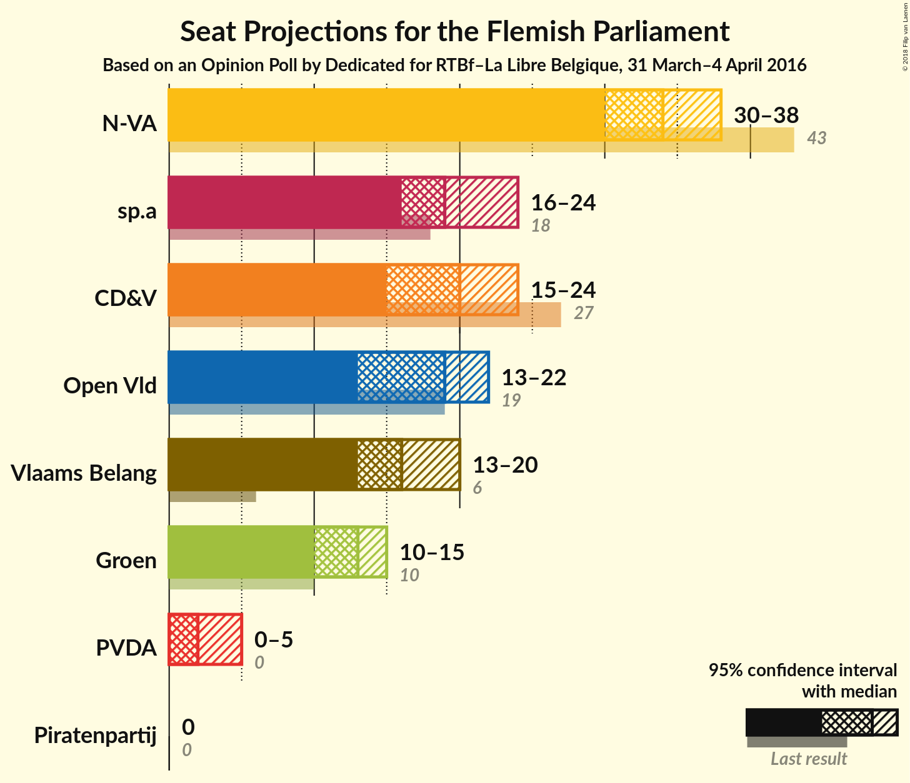
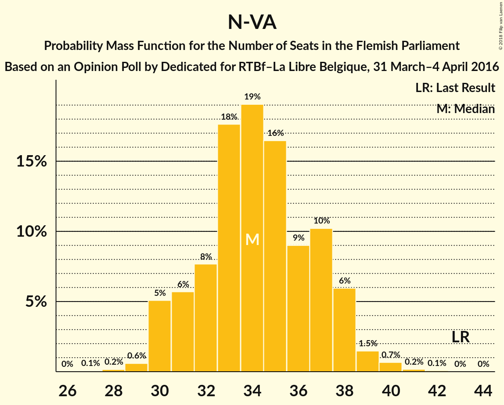
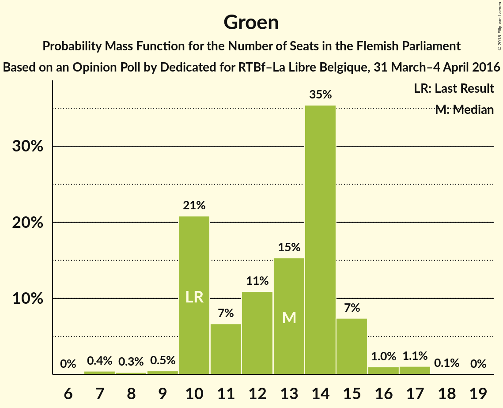
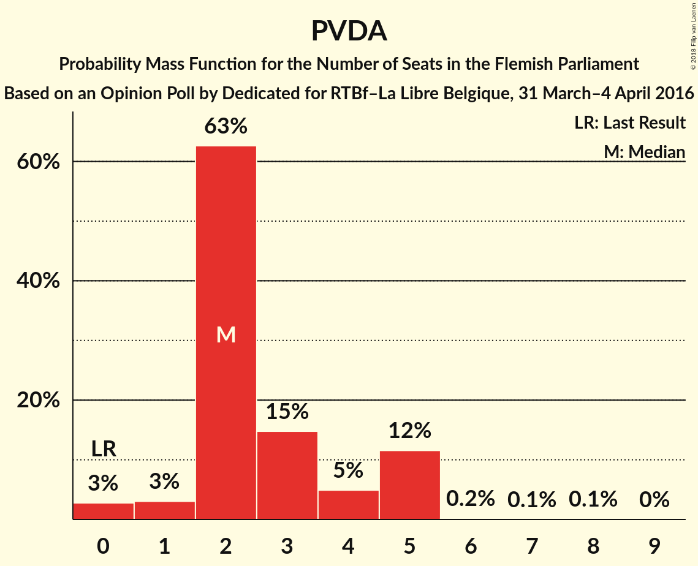
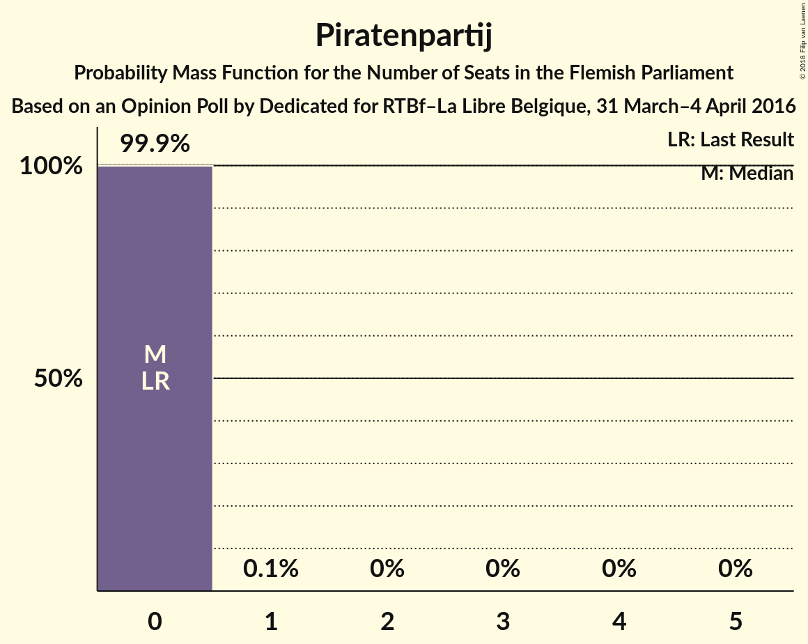

# Opinion Poll by Dedicated for RTBf–La Libre Belgique, 31 March–4 April 2016

<a href="#voting-intentions">Voting Intentions</a> | <a href="#seats">Seats</a> | <a href="#coalitions">Coalitions</a> | <a href="#technical-information">Technical Information</a>

## Voting Intentions

### Confidence Intervals

| Party | Last Result | Poll Result | 80% Confidence Interval | 90% Confidence Interval | 95% Confidence Interval | 99% Confidence Interval |
|:-----:|:-----------:|:-----------:|:-----------------------:|:-----------------------:|:-----------------------:|:-----------------------:|
| N-VA | 31.9% | 25.7% | 23.7–27.8% |23.2–28.3% |22.7–28.9% |21.8–29.9% |
| CD&V | 20.5% | 15.8% | 14.2–17.6% |13.7–18.1% |13.4–18.5% |12.6–19.4% |
| sp.a | 14.0% | 15.0% | 13.4–16.7% |13.0–17.2% |12.6–17.7% |11.9–18.5% |
| Open Vld | 14.1% | 13.7% | 12.2–15.4% |11.8–15.9% |11.4–16.3% |10.7–17.1% |
| Vlaams Belang | 5.9% | 13.2% | 11.7–14.8% |11.3–15.3% |10.9–15.7% |10.3–16.6% |
| Groen | 8.7% | 9.8% | 8.5–11.3% |8.2–11.7% |7.9–12.1% |7.3–12.8% |
| PVDA | 2.5% | 4.6% | 3.7–5.7% |3.5–6.0% |3.3–6.3% |2.9–6.9% |
| Piratenpartij | 0.6% | 1.8% | 1.3–2.6% |1.2–2.8% |1.1–3.0% |0.9–3.5% |

*Note:* The poll result column reflects the actual value used in the calculations. Published results may vary slightly, and in addition be rounded to fewer digits.

## Seats

### Confidence Intervals

| Party | Last Result | Median | 80% Confidence Interval | 90% Confidence Interval | 95% Confidence Interval | 99% Confidence Interval |
|:-----:|:-----------:|:------:|:-----------------------:|:-----------------------:|:-----------------------:|:-----------------------:|
| <a href="#n-va">N-VA</a> | 43 | 34 | 31–37 |30–38 |30–38 |29–40 |
| <a href="#cd&v">CD&V</a> | 27 | 20 | 17–22 |16–22 |15–24 |15–25 |
| <a href="#sp.a">sp.a</a> | 18 | 19 | 17–22 |16–23 |16–24 |14–25 |
| <a href="#open-vld">Open Vld</a> | 19 | 19 | 16–20 |14–21 |13–22 |13–23 |
| <a href="#vlaams-belang">Vlaams Belang</a> | 6 | 16 | 14–19 |13–19 |13–20 |12–22 |
| <a href="#groen">Groen</a> | 10 | 13 | 10–14 |10–15 |10–15 |8–17 |
| <a href="#pvda">PVDA</a> | 0 | 2 | 2–5 |1–5 |0–5 |0–5 |
| <a href="#piratenpartij">Piratenpartij</a> | 0 | 0 | 0 |0 |0 |0 |

### N-VA

*For a full overview of the results for this party, see the [N-VA](party-n-va.html) page.*

| Number of Seats | Probability | Accumulated | Special Marks |
|:---------------:|:-----------:|:-----------:|:-------------:|
| 27 | 0.1% | 100% |  |
| 28 | 0.2% | 99.9% |  |
| 29 | 0.6% | 99.8% |  |
| 30 | 5% | 99.2% |  |
| 31 | 6% | 94% |  |
| 32 | 8% | 88% |  |
| 33 | 18% | 81% |  |
| 34 | 19% | 63% | Median |
| 35 | 16% | 44% |  |
| 36 | 9% | 28% |  |
| 37 | 10% | 19% |  |
| 38 | 6% | 8% |  |
| 39 | 1.5% | 2% |  |
| 40 | 0.7% | 0.9% |  |
| 41 | 0.2% | 0.3% |  |
| 42 | 0.1% | 0.1% |  |
| 43 | 0% | 0% | Last Result |

### CD&V

*For a full overview of the results for this party, see the [CD&V](party-cdv.html) page.*

| Number of Seats | Probability | Accumulated | Special Marks |
|:---------------:|:-----------:|:-----------:|:-------------:|
| 14 | 0.1% | 100% |  |
| 15 | 4% | 99.9% |  |
| 16 | 4% | 96% |  |
| 17 | 3% | 92% |  |
| 18 | 5% | 89% |  |
| 19 | 15% | 84% |  |
| 20 | 49% | 70% | Median |
| 21 | 9% | 21% |  |
| 22 | 7% | 11% |  |
| 23 | 1.4% | 4% |  |
| 24 | 2% | 3% |  |
| 25 | 1.2% | 2% |  |
| 26 | 0.2% | 0.4% |  |
| 27 | 0.2% | 0.2% | Last Result |
| 28 | 0% | 0% |  |

### sp.a

*For a full overview of the results for this party, see the [sp.a](party-spa.html) page.*

| Number of Seats | Probability | Accumulated | Special Marks |
|:---------------:|:-----------:|:-----------:|:-------------:|
| 14 | 1.0% | 100% |  |
| 15 | 1.5% | 99.0% |  |
| 16 | 3% | 98% |  |
| 17 | 6% | 95% |  |
| 18 | 7% | 89% | Last Result |
| 19 | 51% | 82% | Median |
| 20 | 13% | 31% |  |
| 21 | 6% | 18% |  |
| 22 | 4% | 12% |  |
| 23 | 4% | 8% |  |
| 24 | 3% | 3% |  |
| 25 | 0.4% | 0.6% |  |
| 26 | 0.1% | 0.2% |  |
| 27 | 0.1% | 0.1% |  |
| 28 | 0% | 0% |  |

### Open Vld

*For a full overview of the results for this party, see the [Open Vld](party-openvld.html) page.*

| Number of Seats | Probability | Accumulated | Special Marks |
|:---------------:|:-----------:|:-----------:|:-------------:|
| 12 | 0.3% | 100% |  |
| 13 | 4% | 99.7% |  |
| 14 | 3% | 96% |  |
| 15 | 2% | 93% |  |
| 16 | 5% | 91% |  |
| 17 | 14% | 86% |  |
| 18 | 18% | 72% |  |
| 19 | 31% | 54% | Last Result, Median |
| 20 | 17% | 24% |  |
| 21 | 2% | 6% |  |
| 22 | 2% | 4% |  |
| 23 | 2% | 2% |  |
| 24 | 0.4% | 0.4% |  |
| 25 | 0.1% | 0.1% |  |
| 26 | 0% | 0% |  |

### Vlaams Belang

*For a full overview of the results for this party, see the [Vlaams Belang](party-vlaamsbelang.html) page.*

| Number of Seats | Probability | Accumulated | Special Marks |
|:---------------:|:-----------:|:-----------:|:-------------:|
| 6 | 0% | 100% | Last Result |
| 7 | 0% | 100% |  |
| 8 | 0% | 100% |  |
| 9 | 0% | 100% |  |
| 10 | 0% | 100% |  |
| 11 | 0.4% | 100% |  |
| 12 | 1.1% | 99.5% |  |
| 13 | 5% | 98% |  |
| 14 | 4% | 94% |  |
| 15 | 8% | 90% |  |
| 16 | 35% | 82% | Median |
| 17 | 19% | 47% |  |
| 18 | 18% | 28% |  |
| 19 | 6% | 10% |  |
| 20 | 3% | 4% |  |
| 21 | 0.8% | 1.4% |  |
| 22 | 0.5% | 0.6% |  |
| 23 | 0.1% | 0.1% |  |
| 24 | 0% | 0% |  |

### Groen

*For a full overview of the results for this party, see the [Groen](party-groen.html) page.*

| Number of Seats | Probability | Accumulated | Special Marks |
|:---------------:|:-----------:|:-----------:|:-------------:|
| 7 | 0.4% | 100% |  |
| 8 | 0.3% | 99.6% |  |
| 9 | 0.5% | 99.3% |  |
| 10 | 21% | 98.8% | Last Result |
| 11 | 7% | 78% |  |
| 12 | 11% | 71% |  |
| 13 | 15% | 60% | Median |
| 14 | 35% | 45% |  |
| 15 | 7% | 10% |  |
| 16 | 1.0% | 2% |  |
| 17 | 1.1% | 1.2% |  |
| 18 | 0.1% | 0.1% |  |
| 19 | 0% | 0% |  |

### PVDA

*For a full overview of the results for this party, see the [PVDA](party-pvda.html) page.*

| Number of Seats | Probability | Accumulated | Special Marks |
|:---------------:|:-----------:|:-----------:|:-------------:|
| 0 | 3% | 100% | Last Result |
| 1 | 3% | 97% |  |
| 2 | 63% | 94% | Median |
| 3 | 15% | 32% |  |
| 4 | 5% | 17% |  |
| 5 | 12% | 12% |  |
| 6 | 0.2% | 0.3% |  |
| 7 | 0.1% | 0.2% |  |
| 8 | 0.1% | 0.1% |  |
| 9 | 0% | 0% |  |

### Piratenpartij

*For a full overview of the results for this party, see the [Piratenpartij](party-piratenpartij.html) page.*

| Number of Seats | Probability | Accumulated | Special Marks |
|:---------------:|:-----------:|:-----------:|:-------------:|
| 0 | 99.9% | 100% | Last Result, Median |
| 1 | 0.1% | 0.1% |  |
| 2 | 0% | 0% |  |

## Coalitions

### Confidence Intervals

| Coalition | Last Result | Median | Majority? | 80% Confidence Interval | 90% Confidence Interval | 95% Confidence Interval | 99% Confidence Interval |
|:---------:|:-----------:|:------:|:---------:|:-----------------------:|:-----------------------:|:-----------------------:|:-----------------------:|
| N-VA – CD&V – sp.a | 88 | 73 | 100% | 70–76 | 69–77 | 69–78 | 67–81 |
| N-VA – CD&V – Open Vld | 89 | 72 | 100% | 68–76 | 68–77 | 67–77 | 65–79 |
| CD&V – sp.a – Open Vld – Groen | 74 | 70 | 99.8% | 67–73 | 66–75 | 65–75 | 63–77 |
| CD&V – sp.a – Open Vld | 64 | 58 | 3% | 54–61 | 53–62 | 52–63 | 50–64 |
| CD&V – sp.a – Groen – PVDA | 55 | 54 | 0.2% | 51–58 | 50–59 | 49–60 | 47–61 |
| N-VA – CD&V | 70 | 54 | 0.1% | 51–57 | 50–58 | 49–59 | 48–61 |
| CD&V – sp.a – Groen | 55 | 52 | 0% | 48–55 | 47–56 | 47–57 | 45–59 |
| N-VA – Vlaams Belang | 49 | 51 | 0% | 48–54 | 47–55 | 46–56 | 44–57 |
| sp.a – Open Vld – Groen | 47 | 50 | 0% | 47–54 | 46–54 | 45–56 | 43–57 |
| CD&V – sp.a | 45 | 39 | 0% | 36–42 | 35–43 | 34–44 | 33–46 |
| CD&V – Open Vld | 46 | 38 | 0% | 34–41 | 33–42 | 33–43 | 31–44 |
| sp.a – Open Vld | 37 | 38 | 0% | 34–41 | 33–42 | 32–43 | 31–44 |

### N-VA – CD&V – sp.a

| Number of Seats | Probability | Accumulated | Special Marks |
|:---------------:|:-----------:|:-----------:|:-------------:|
| 65 | 0.1% | 100% |  |
| 66 | 0.1% | 99.9% |  |
| 67 | 0.5% | 99.8% |  |
| 68 | 1.5% | 99.3% |  |
| 69 | 3% | 98% |  |
| 70 | 5% | 95% |  |
| 71 | 11% | 89% |  |
| 72 | 15% | 78% |  |
| 73 | 16% | 63% | Median |
| 74 | 17% | 47% |  |
| 75 | 12% | 30% |  |
| 76 | 9% | 19% |  |
| 77 | 6% | 9% |  |
| 78 | 2% | 4% |  |
| 79 | 0.9% | 2% |  |
| 80 | 0.7% | 1.3% |  |
| 81 | 0.3% | 0.6% |  |
| 82 | 0.2% | 0.2% |  |
| 83 | 0% | 0% |  |
| 84 | 0% | 0% |  |
| 85 | 0% | 0% |  |
| 86 | 0% | 0% |  |
| 87 | 0% | 0% |  |
| 88 | 0% | 0% | Last Result |

### N-VA – CD&V – Open Vld

| Number of Seats | Probability | Accumulated | Special Marks |
|:---------------:|:-----------:|:-----------:|:-------------:|
| 63 | 0.1% | 100% | Majority |
| 64 | 0.3% | 99.9% |  |
| 65 | 0.5% | 99.6% |  |
| 66 | 1.0% | 99.1% |  |
| 67 | 2% | 98% |  |
| 68 | 6% | 96% |  |
| 69 | 7% | 90% |  |
| 70 | 8% | 82% |  |
| 71 | 10% | 74% |  |
| 72 | 15% | 64% |  |
| 73 | 17% | 50% | Median |
| 74 | 11% | 32% |  |
| 75 | 9% | 21% |  |
| 76 | 6% | 12% |  |
| 77 | 4% | 6% |  |
| 78 | 1.4% | 2% |  |
| 79 | 0.6% | 0.8% |  |
| 80 | 0.2% | 0.3% |  |
| 81 | 0.1% | 0.1% |  |
| 82 | 0% | 0% |  |
| 83 | 0% | 0% |  |
| 84 | 0% | 0% |  |
| 85 | 0% | 0% |  |
| 86 | 0% | 0% |  |
| 87 | 0% | 0% |  |
| 88 | 0% | 0% |  |
| 89 | 0% | 0% | Last Result |

### CD&V – sp.a – Open Vld – Groen

| Number of Seats | Probability | Accumulated | Special Marks |
|:---------------:|:-----------:|:-----------:|:-------------:|
| 61 | 0% | 100% |  |
| 62 | 0.2% | 99.9% |  |
| 63 | 0.5% | 99.8% | Majority |
| 64 | 2% | 99.2% |  |
| 65 | 3% | 98% |  |
| 66 | 3% | 95% |  |
| 67 | 7% | 92% |  |
| 68 | 14% | 85% |  |
| 69 | 11% | 70% |  |
| 70 | 16% | 59% |  |
| 71 | 16% | 43% | Median |
| 72 | 12% | 27% |  |
| 73 | 6% | 16% |  |
| 74 | 4% | 9% | Last Result |
| 75 | 3% | 5% |  |
| 76 | 1.4% | 2% |  |
| 77 | 0.6% | 0.9% |  |
| 78 | 0.2% | 0.3% |  |
| 79 | 0.1% | 0.1% |  |
| 80 | 0% | 0% |  |

### CD&V – sp.a – Open Vld

| Number of Seats | Probability | Accumulated | Special Marks |
|:---------------:|:-----------:|:-----------:|:-------------:|
| 48 | 0.1% | 100% |  |
| 49 | 0.2% | 99.9% |  |
| 50 | 0.6% | 99.7% |  |
| 51 | 0.8% | 99.1% |  |
| 52 | 3% | 98% |  |
| 53 | 4% | 95% |  |
| 54 | 7% | 91% |  |
| 55 | 7% | 84% |  |
| 56 | 13% | 77% |  |
| 57 | 14% | 64% |  |
| 58 | 16% | 50% | Median |
| 59 | 14% | 34% |  |
| 60 | 9% | 20% |  |
| 61 | 6% | 12% |  |
| 62 | 3% | 6% |  |
| 63 | 2% | 3% | Majority |
| 64 | 0.5% | 1.0% | Last Result |
| 65 | 0.3% | 0.5% |  |
| 66 | 0.1% | 0.2% |  |
| 67 | 0% | 0.1% |  |
| 68 | 0% | 0% |  |

### CD&V – sp.a – Groen – PVDA

| Number of Seats | Probability | Accumulated | Special Marks |
|:---------------:|:-----------:|:-----------:|:-------------:|
| 46 | 0.1% | 100% |  |
| 47 | 0.5% | 99.9% |  |
| 48 | 1.0% | 99.3% |  |
| 49 | 2% | 98% |  |
| 50 | 3% | 96% |  |
| 51 | 9% | 93% |  |
| 52 | 11% | 84% |  |
| 53 | 9% | 73% |  |
| 54 | 15% | 64% | Median |
| 55 | 19% | 49% | Last Result |
| 56 | 12% | 30% |  |
| 57 | 7% | 18% |  |
| 58 | 5% | 11% |  |
| 59 | 3% | 6% |  |
| 60 | 2% | 3% |  |
| 61 | 0.7% | 1.1% |  |
| 62 | 0.3% | 0.4% |  |
| 63 | 0.1% | 0.2% | Majority |
| 64 | 0% | 0% |  |

### N-VA – CD&V

| Number of Seats | Probability | Accumulated | Special Marks |
|:---------------:|:-----------:|:-----------:|:-------------:|
| 45 | 0.1% | 100% |  |
| 46 | 0.1% | 99.9% |  |
| 47 | 0.2% | 99.8% |  |
| 48 | 0.8% | 99.6% |  |
| 49 | 2% | 98.8% |  |
| 50 | 4% | 96% |  |
| 51 | 7% | 92% |  |
| 52 | 11% | 85% |  |
| 53 | 16% | 74% |  |
| 54 | 17% | 58% | Median |
| 55 | 16% | 42% |  |
| 56 | 11% | 26% |  |
| 57 | 8% | 15% |  |
| 58 | 5% | 8% |  |
| 59 | 2% | 3% |  |
| 60 | 0.6% | 1.2% |  |
| 61 | 0.3% | 0.6% |  |
| 62 | 0.1% | 0.2% |  |
| 63 | 0.1% | 0.1% | Majority |
| 64 | 0% | 0% |  |
| 65 | 0% | 0% |  |
| 66 | 0% | 0% |  |
| 67 | 0% | 0% |  |
| 68 | 0% | 0% |  |
| 69 | 0% | 0% |  |
| 70 | 0% | 0% | Last Result |

### CD&V – sp.a – Groen

| Number of Seats | Probability | Accumulated | Special Marks |
|:---------------:|:-----------:|:-----------:|:-------------:|
| 43 | 0% | 100% |  |
| 44 | 0.3% | 99.9% |  |
| 45 | 0.7% | 99.6% |  |
| 46 | 1.4% | 98.9% |  |
| 47 | 3% | 98% |  |
| 48 | 5% | 94% |  |
| 49 | 11% | 90% |  |
| 50 | 12% | 79% |  |
| 51 | 10% | 67% |  |
| 52 | 17% | 57% | Median |
| 53 | 18% | 40% |  |
| 54 | 10% | 23% |  |
| 55 | 5% | 13% | Last Result |
| 56 | 4% | 8% |  |
| 57 | 2% | 4% |  |
| 58 | 1.0% | 2% |  |
| 59 | 0.4% | 0.6% |  |
| 60 | 0.2% | 0.2% |  |
| 61 | 0% | 0.1% |  |
| 62 | 0% | 0% |  |

### N-VA – Vlaams Belang

| Number of Seats | Probability | Accumulated | Special Marks |
|:---------------:|:-----------:|:-----------:|:-------------:|
| 42 | 0% | 100% |  |
| 43 | 0.2% | 99.9% |  |
| 44 | 0.4% | 99.7% |  |
| 45 | 1.1% | 99.4% |  |
| 46 | 2% | 98% |  |
| 47 | 4% | 96% |  |
| 48 | 8% | 92% |  |
| 49 | 13% | 84% | Last Result |
| 50 | 18% | 71% | Median |
| 51 | 16% | 53% |  |
| 52 | 10% | 37% |  |
| 53 | 13% | 27% |  |
| 54 | 8% | 15% |  |
| 55 | 3% | 7% |  |
| 56 | 2% | 3% |  |
| 57 | 1.0% | 1.4% |  |
| 58 | 0.2% | 0.4% |  |
| 59 | 0.1% | 0.1% |  |
| 60 | 0% | 0% |  |

### sp.a – Open Vld – Groen

| Number of Seats | Probability | Accumulated | Special Marks |
|:---------------:|:-----------:|:-----------:|:-------------:|
| 41 | 0% | 100% |  |
| 42 | 0.2% | 99.9% |  |
| 43 | 0.4% | 99.8% |  |
| 44 | 0.8% | 99.4% |  |
| 45 | 3% | 98.6% |  |
| 46 | 3% | 96% |  |
| 47 | 4% | 93% | Last Result |
| 48 | 12% | 88% |  |
| 49 | 10% | 76% |  |
| 50 | 21% | 66% |  |
| 51 | 14% | 45% | Median |
| 52 | 15% | 31% |  |
| 53 | 6% | 16% |  |
| 54 | 5% | 10% |  |
| 55 | 2% | 5% |  |
| 56 | 2% | 3% |  |
| 57 | 0.9% | 1.3% |  |
| 58 | 0.2% | 0.4% |  |
| 59 | 0.1% | 0.1% |  |
| 60 | 0% | 0% |  |

### CD&V – sp.a

| Number of Seats | Probability | Accumulated | Special Marks |
|:---------------:|:-----------:|:-----------:|:-------------:|
| 31 | 0.1% | 100% |  |
| 32 | 0.1% | 99.9% |  |
| 33 | 0.3% | 99.8% |  |
| 34 | 3% | 99.5% |  |
| 35 | 4% | 97% |  |
| 36 | 6% | 93% |  |
| 37 | 7% | 86% |  |
| 38 | 13% | 80% |  |
| 39 | 31% | 67% | Median |
| 40 | 14% | 36% |  |
| 41 | 8% | 22% |  |
| 42 | 6% | 14% |  |
| 43 | 4% | 8% |  |
| 44 | 3% | 4% |  |
| 45 | 0.8% | 1.4% | Last Result |
| 46 | 0.4% | 0.7% |  |
| 47 | 0.1% | 0.3% |  |
| 48 | 0.1% | 0.1% |  |
| 49 | 0% | 0% |  |

### CD&V – Open Vld

| Number of Seats | Probability | Accumulated | Special Marks |
|:---------------:|:-----------:|:-----------:|:-------------:|
| 29 | 0.1% | 100% |  |
| 30 | 0.3% | 99.9% |  |
| 31 | 0.4% | 99.6% |  |
| 32 | 1.3% | 99.2% |  |
| 33 | 4% | 98% |  |
| 34 | 4% | 94% |  |
| 35 | 7% | 90% |  |
| 36 | 6% | 83% |  |
| 37 | 13% | 76% |  |
| 38 | 16% | 63% |  |
| 39 | 20% | 47% | Median |
| 40 | 15% | 27% |  |
| 41 | 5% | 12% |  |
| 42 | 3% | 7% |  |
| 43 | 2% | 3% |  |
| 44 | 0.8% | 1.2% |  |
| 45 | 0.2% | 0.4% |  |
| 46 | 0.1% | 0.2% | Last Result |
| 47 | 0% | 0% |  |

### sp.a – Open Vld

| Number of Seats | Probability | Accumulated | Special Marks |
|:---------------:|:-----------:|:-----------:|:-------------:|
| 29 | 0.1% | 100% |  |
| 30 | 0.2% | 99.9% |  |
| 31 | 0.6% | 99.7% |  |
| 32 | 3% | 99.2% |  |
| 33 | 3% | 97% |  |
| 34 | 5% | 94% |  |
| 35 | 6% | 89% |  |
| 36 | 12% | 83% |  |
| 37 | 14% | 71% | Last Result |
| 38 | 22% | 57% | Median |
| 39 | 16% | 35% |  |
| 40 | 9% | 19% |  |
| 41 | 4% | 10% |  |
| 42 | 4% | 6% |  |
| 43 | 2% | 3% |  |
| 44 | 0.6% | 1.0% |  |
| 45 | 0.2% | 0.4% |  |
| 46 | 0.1% | 0.1% |  |
| 47 | 0% | 0% |  |

## Technical Information

### Opinion Poll

+ **Polling firm:** Dedicated
+ **Commissioner(s):** RTBf–La Libre Belgique
+ **Fieldwork period:** 31 March–4 April 2016

### Calculations

+ **Sample size:** 768
+ **Simulations done:** 4,194,304
+ **Error estimate:** 2.41%

