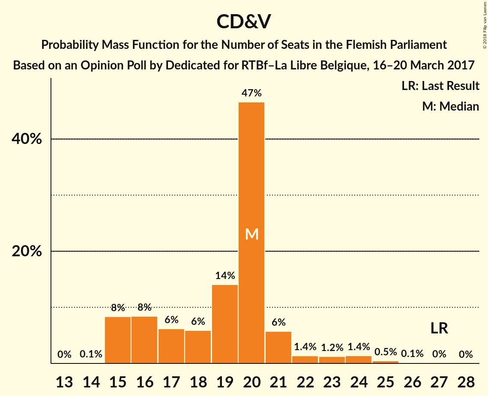
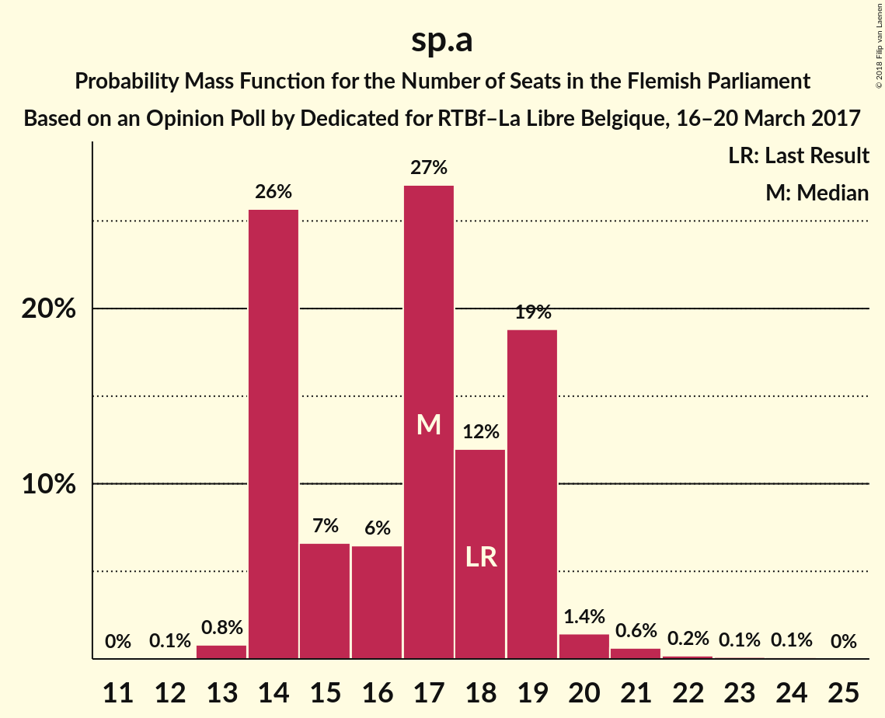
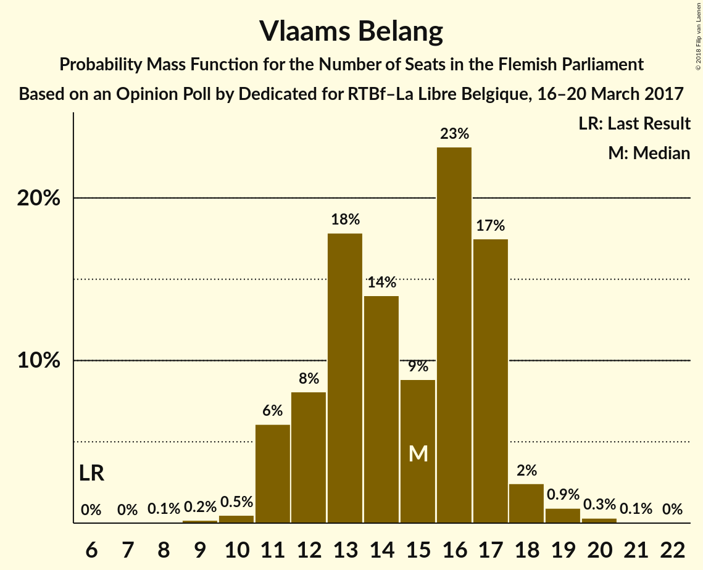
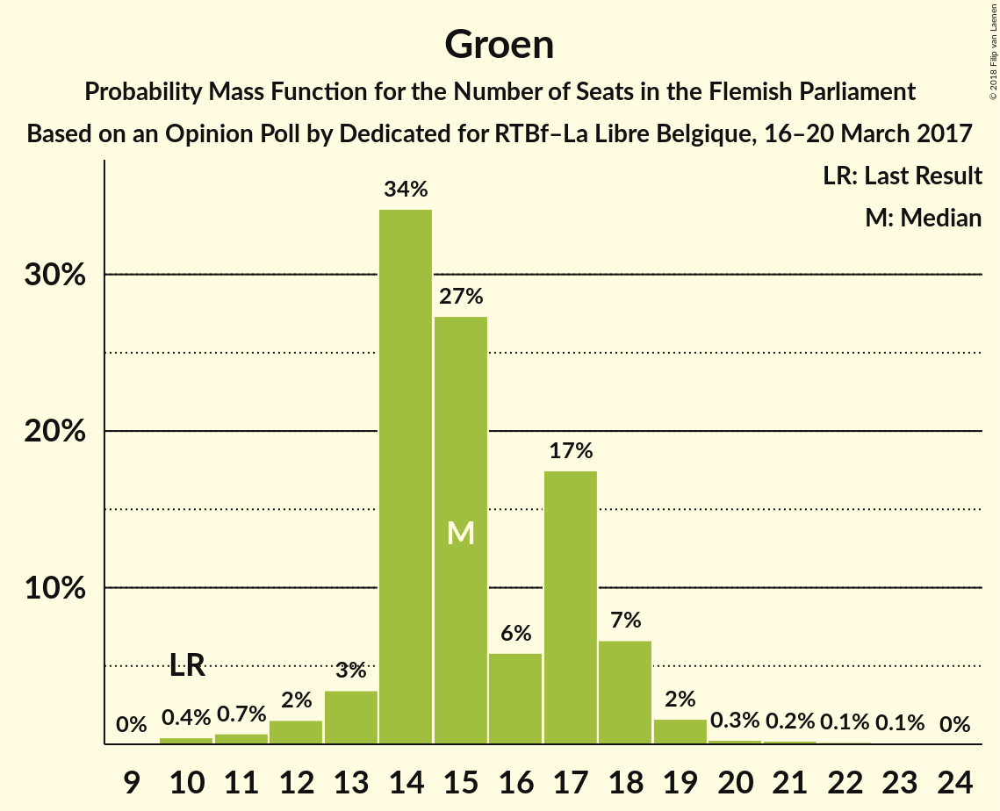
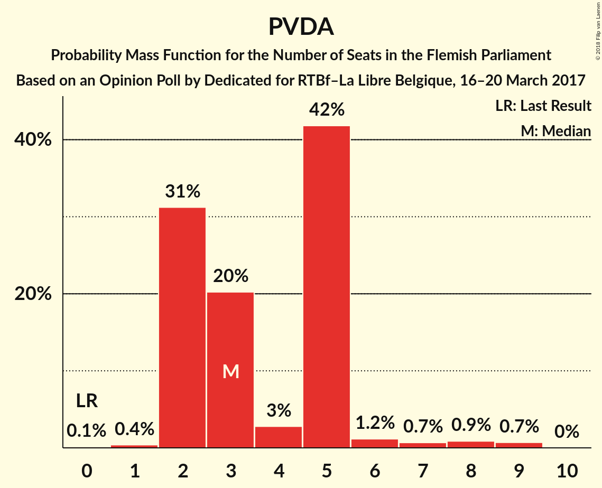
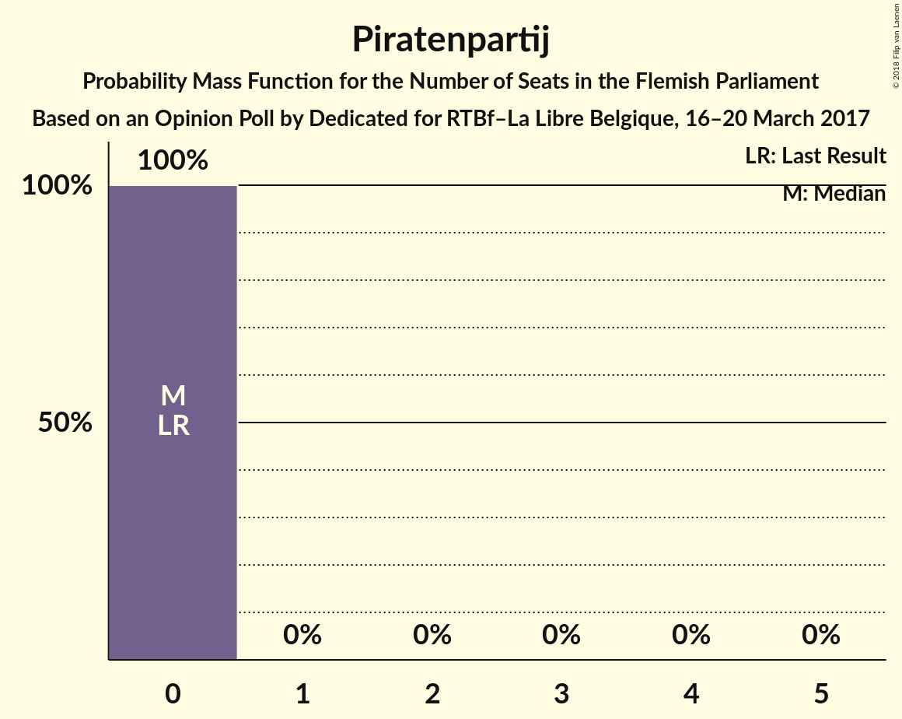

# Opinion Poll by Dedicated for RTBf–La Libre Belgique, 16–20 March 2017

<a href="#voting-intentions">Voting Intentions</a> | <a href="#seats">Seats</a> | <a href="#coalitions">Coalitions</a> | <a href="#technical-information">Technical Information</a>

## Voting Intentions

### Confidence Intervals

| Party | Last Result | Poll Result | 80% Confidence Interval | 90% Confidence Interval | 95% Confidence Interval | 99% Confidence Interval |
|:-----:|:-----------:|:-----------:|:-----------------------:|:-----------------------:|:-----------------------:|:-----------------------:|
| N-VA | 31.9% | 27.4% | 25.4–29.5% |24.8–30.1% |24.4–30.6% |23.4–31.6% |
| CD&V | 20.5% | 15.3% | 13.8–17.1% |13.4–17.6% |13.0–18.0% |12.3–18.9% |
| Open Vld | 14.1% | 13.0% | 11.6–14.7% |11.2–15.2% |10.9–15.6% |10.2–16.4% |
| sp.a | 14.0% | 13.0% | 11.6–14.7% |11.2–15.2% |10.9–15.6% |10.2–16.4% |
| Vlaams Belang | 5.9% | 11.9% | 10.5–13.5% |10.1–14.0% |9.8–14.4% |9.2–15.2% |
| Groen | 8.7% | 11.6% | 10.3–13.2% |9.9–13.7% |9.6–14.1% |9.0–14.9% |
| PVDA | 2.5% | 5.4% | 4.5–6.6% |4.2–6.9% |4.0–7.2% |3.6–7.8% |
| Piratenpartij | 0.6% | 1.3% | 0.9–2.0% |0.8–2.2% |0.7–2.3% |0.5–2.7% |

*Note:* The poll result column reflects the actual value used in the calculations. Published results may vary slightly, and in addition be rounded to fewer digits.

## Seats

### Confidence Intervals

| Party | Last Result | Median | 80% Confidence Interval | 90% Confidence Interval | 95% Confidence Interval | 99% Confidence Interval |
|:-----:|:-----------:|:------:|:-----------------------:|:-----------------------:|:-----------------------:|:-----------------------:|
| <a href="#n-va">N-VA</a> | 43 | 37 | 34–39 |33–40 |32–41 |31–43 |
| <a href="#cd&v">CD&V</a> | 27 | 20 | 16–21 |15–21 |15–23 |15–25 |
| <a href="#open-vld">Open Vld</a> | 19 | 18 | 14–19 |13–20 |13–20 |12–23 |
| <a href="#sp.a">sp.a</a> | 18 | 17 | 14–19 |14–19 |14–19 |13–21 |
| <a href="#vlaams-belang">Vlaams Belang</a> | 6 | 15 | 12–17 |11–17 |11–18 |10–19 |
| <a href="#groen">Groen</a> | 10 | 15 | 14–17 |13–18 |12–18 |11–20 |
| <a href="#pvda">PVDA</a> | 0 | 3 | 2–5 |2–5 |2–6 |1–9 |
| <a href="#piratenpartij">Piratenpartij</a> | 0 | 0 | 0 |0 |0 |0 |

### N-VA

*For a full overview of the results for this party, see the [N-VA](party-n-va.html) page.*

| Number of Seats | Probability | Accumulated | Special Marks |
|:---------------:|:-----------:|:-----------:|:-------------:|
| 29 | 0.1% | 100% |  |
| 30 | 0.4% | 99.9% |  |
| 31 | 0.7% | 99.5% |  |
| 32 | 2% | 98.8% |  |
| 33 | 7% | 97% |  |
| 34 | 9% | 90% |  |
| 35 | 11% | 81% |  |
| 36 | 10% | 70% |  |
| 37 | 12% | 61% | Median |
| 38 | 34% | 49% |  |
| 39 | 8% | 15% |  |
| 40 | 3% | 7% |  |
| 41 | 2% | 4% |  |
| 42 | 0.8% | 2% |  |
| 43 | 0.8% | 1.0% | Last Result |
| 44 | 0.2% | 0.2% |  |
| 45 | 0% | 0.1% |  |
| 46 | 0% | 0% |  |

### CD&V

*For a full overview of the results for this party, see the [CD&V](party-cdv.html) page.*

| Number of Seats | Probability | Accumulated | Special Marks |
|:---------------:|:-----------:|:-----------:|:-------------:|
| 14 | 0.1% | 100% |  |
| 15 | 8% | 99.9% |  |
| 16 | 8% | 92% |  |
| 17 | 6% | 83% |  |
| 18 | 6% | 77% |  |
| 19 | 14% | 71% |  |
| 20 | 47% | 57% | Median |
| 21 | 6% | 10% |  |
| 22 | 1.4% | 5% |  |
| 23 | 1.2% | 3% |  |
| 24 | 1.4% | 2% |  |
| 25 | 0.5% | 0.6% |  |
| 26 | 0.1% | 0.2% |  |
| 27 | 0% | 0.1% | Last Result |
| 28 | 0% | 0% |  |

### Open Vld

*For a full overview of the results for this party, see the [Open Vld](party-openvld.html) page.*

| Number of Seats | Probability | Accumulated | Special Marks |
|:---------------:|:-----------:|:-----------:|:-------------:|
| 12 | 1.4% | 100% |  |
| 13 | 9% | 98.6% |  |
| 14 | 5% | 90% |  |
| 15 | 5% | 86% |  |
| 16 | 11% | 81% |  |
| 17 | 15% | 69% |  |
| 18 | 19% | 55% | Median |
| 19 | 27% | 36% | Last Result |
| 20 | 6% | 9% |  |
| 21 | 1.3% | 2% |  |
| 22 | 0.7% | 1.2% |  |
| 23 | 0.5% | 0.5% |  |
| 24 | 0.1% | 0.1% |  |
| 25 | 0% | 0% |  |

### sp.a

*For a full overview of the results for this party, see the [sp.a](party-spa.html) page.*

| Number of Seats | Probability | Accumulated | Special Marks |
|:---------------:|:-----------:|:-----------:|:-------------:|
| 12 | 0.1% | 100% |  |
| 13 | 0.8% | 99.9% |  |
| 14 | 26% | 99.1% |  |
| 15 | 7% | 73% |  |
| 16 | 6% | 67% |  |
| 17 | 27% | 60% | Median |
| 18 | 12% | 33% | Last Result |
| 19 | 19% | 21% |  |
| 20 | 1.4% | 2% |  |
| 21 | 0.6% | 1.0% |  |
| 22 | 0.2% | 0.4% |  |
| 23 | 0.1% | 0.2% |  |
| 24 | 0.1% | 0.1% |  |
| 25 | 0% | 0% |  |

### Vlaams Belang

*For a full overview of the results for this party, see the [Vlaams Belang](party-vlaamsbelang.html) page.*

| Number of Seats | Probability | Accumulated | Special Marks |
|:---------------:|:-----------:|:-----------:|:-------------:|
| 6 | 0% | 100% | Last Result |
| 7 | 0% | 100% |  |
| 8 | 0.1% | 100% |  |
| 9 | 0.2% | 99.9% |  |
| 10 | 0.5% | 99.7% |  |
| 11 | 6% | 99.2% |  |
| 12 | 8% | 93% |  |
| 13 | 18% | 85% |  |
| 14 | 14% | 67% |  |
| 15 | 9% | 53% | Median |
| 16 | 23% | 44% |  |
| 17 | 17% | 21% |  |
| 18 | 2% | 4% |  |
| 19 | 0.9% | 1.3% |  |
| 20 | 0.3% | 0.4% |  |
| 21 | 0.1% | 0.1% |  |
| 22 | 0% | 0% |  |

### Groen

*For a full overview of the results for this party, see the [Groen](party-groen.html) page.*

| Number of Seats | Probability | Accumulated | Special Marks |
|:---------------:|:-----------:|:-----------:|:-------------:|
| 10 | 0.4% | 100% | Last Result |
| 11 | 0.7% | 99.5% |  |
| 12 | 2% | 98.9% |  |
| 13 | 3% | 97% |  |
| 14 | 34% | 94% |  |
| 15 | 27% | 60% | Median |
| 16 | 6% | 32% |  |
| 17 | 17% | 27% |  |
| 18 | 7% | 9% |  |
| 19 | 2% | 2% |  |
| 20 | 0.3% | 0.8% |  |
| 21 | 0.2% | 0.5% |  |
| 22 | 0.1% | 0.2% |  |
| 23 | 0.1% | 0.1% |  |
| 24 | 0% | 0% |  |

### PVDA

*For a full overview of the results for this party, see the [PVDA](party-pvda.html) page.*

| Number of Seats | Probability | Accumulated | Special Marks |
|:---------------:|:-----------:|:-----------:|:-------------:|
| 0 | 0.1% | 100% | Last Result |
| 1 | 0.4% | 99.9% |  |
| 2 | 31% | 99.5% |  |
| 3 | 20% | 68% | Median |
| 4 | 3% | 48% |  |
| 5 | 42% | 45% |  |
| 6 | 1.2% | 3% |  |
| 7 | 0.7% | 2% |  |
| 8 | 0.9% | 2% |  |
| 9 | 0.7% | 0.7% |  |
| 10 | 0% | 0% |  |

### Piratenpartij

*For a full overview of the results for this party, see the [Piratenpartij](party-piratenpartij.html) page.*

| Number of Seats | Probability | Accumulated | Special Marks |
|:---------------:|:-----------:|:-----------:|:-------------:|
| 0 | 100% | 100% | Last Result, Median |

## Coalitions

### Confidence Intervals

| Coalition | Last Result | Median | Majority? | 80% Confidence Interval | 90% Confidence Interval | 95% Confidence Interval | 99% Confidence Interval |
|:---------:|:-----------:|:------:|:---------:|:-----------------------:|:-----------------------:|:-----------------------:|:-----------------------:|
| N-VA – CD&V – Open Vld | 89 | 73 | 100% | 69–77 | 68–77 | 67–78 | 66–80 |
| N-VA – CD&V – sp.a | 88 | 72 | 100% | 69–75 | 68–76 | 67–77 | 66–80 |
| CD&V – Open Vld – sp.a – Groen | 74 | 68 | 98% | 64–72 | 63–73 | 63–74 | 61–76 |
| N-VA – CD&V | 70 | 56 | 0.6% | 52–59 | 51–60 | 50–61 | 49–63 |
| CD&V – sp.a – Groen – PVDA | 55 | 54 | 0.2% | 52–59 | 51–59 | 50–60 | 47–62 |
| CD&V – Open Vld – sp.a | 64 | 53 | 0% | 49–57 | 48–58 | 47–58 | 46–60 |
| N-VA – Vlaams Belang | 49 | 51 | 0% | 48–55 | 47–55 | 46–57 | 44–58 |
| CD&V – Open Vld – Groen | 56 | 52 | 0% | 48–55 | 47–56 | 45–57 | 44–59 |
| CD&V – sp.a – Groen | 55 | 51 | 0% | 48–54 | 47–56 | 46–56 | 44–58 |
| Open Vld – sp.a – Groen | 47 | 49 | 0% | 45–53 | 44–54 | 43–55 | 42–56 |
| CD&V – Open Vld | 46 | 36 | 0% | 33–39 | 32–40 | 31–41 | 29–43 |
| CD&V – sp.a | 45 | 36 | 0% | 32–39 | 31–39 | 31–40 | 30–43 |
| Open Vld – sp.a | 37 | 34 | 0% | 30–38 | 30–38 | 28–39 | 27–40 |

### N-VA – CD&V – Open Vld

| Number of Seats | Probability | Accumulated | Special Marks |
|:---------------:|:-----------:|:-----------:|:-------------:|
| 63 | 0% | 100% | Majority |
| 64 | 0.1% | 99.9% |  |
| 65 | 0.3% | 99.8% |  |
| 66 | 0.6% | 99.6% |  |
| 67 | 2% | 99.0% |  |
| 68 | 5% | 97% |  |
| 69 | 6% | 92% |  |
| 70 | 8% | 86% |  |
| 71 | 7% | 78% |  |
| 72 | 9% | 70% |  |
| 73 | 15% | 62% |  |
| 74 | 16% | 46% |  |
| 75 | 8% | 30% | Median |
| 76 | 7% | 22% |  |
| 77 | 10% | 15% |  |
| 78 | 3% | 5% |  |
| 79 | 1.2% | 2% |  |
| 80 | 0.6% | 0.9% |  |
| 81 | 0.2% | 0.2% |  |
| 82 | 0% | 0.1% |  |
| 83 | 0% | 0% |  |
| 84 | 0% | 0% |  |
| 85 | 0% | 0% |  |
| 86 | 0% | 0% |  |
| 87 | 0% | 0% |  |
| 88 | 0% | 0% |  |
| 89 | 0% | 0% | Last Result |

### N-VA – CD&V – sp.a

| Number of Seats | Probability | Accumulated | Special Marks |
|:---------------:|:-----------:|:-----------:|:-------------:|
| 64 | 0.1% | 100% |  |
| 65 | 0.4% | 99.9% |  |
| 66 | 1.3% | 99.5% |  |
| 67 | 2% | 98% |  |
| 68 | 3% | 97% |  |
| 69 | 9% | 93% |  |
| 70 | 9% | 84% |  |
| 71 | 9% | 76% |  |
| 72 | 17% | 66% |  |
| 73 | 16% | 49% |  |
| 74 | 11% | 32% | Median |
| 75 | 12% | 21% |  |
| 76 | 5% | 10% |  |
| 77 | 2% | 4% |  |
| 78 | 1.2% | 2% |  |
| 79 | 0.6% | 1.1% |  |
| 80 | 0.4% | 0.6% |  |
| 81 | 0.1% | 0.1% |  |
| 82 | 0% | 0% |  |
| 83 | 0% | 0% |  |
| 84 | 0% | 0% |  |
| 85 | 0% | 0% |  |
| 86 | 0% | 0% |  |
| 87 | 0% | 0% |  |
| 88 | 0% | 0% | Last Result |

### CD&V – Open Vld – sp.a – Groen

| Number of Seats | Probability | Accumulated | Special Marks |
|:---------------:|:-----------:|:-----------:|:-------------:|
| 59 | 0.1% | 100% |  |
| 60 | 0.2% | 99.9% |  |
| 61 | 0.5% | 99.7% |  |
| 62 | 2% | 99.2% |  |
| 63 | 3% | 98% | Majority |
| 64 | 9% | 95% |  |
| 65 | 6% | 86% |  |
| 66 | 12% | 80% |  |
| 67 | 11% | 68% |  |
| 68 | 12% | 57% |  |
| 69 | 11% | 45% |  |
| 70 | 13% | 34% | Median |
| 71 | 9% | 21% |  |
| 72 | 5% | 12% |  |
| 73 | 4% | 7% |  |
| 74 | 2% | 3% | Last Result |
| 75 | 0.8% | 1.3% |  |
| 76 | 0.4% | 0.5% |  |
| 77 | 0.1% | 0.1% |  |
| 78 | 0% | 0% |  |

### N-VA – CD&V

| Number of Seats | Probability | Accumulated | Special Marks |
|:---------------:|:-----------:|:-----------:|:-------------:|
| 47 | 0% | 100% |  |
| 48 | 0.1% | 99.9% |  |
| 49 | 0.6% | 99.8% |  |
| 50 | 2% | 99.2% |  |
| 51 | 4% | 97% |  |
| 52 | 4% | 93% |  |
| 53 | 9% | 89% |  |
| 54 | 11% | 80% |  |
| 55 | 12% | 69% |  |
| 56 | 12% | 56% |  |
| 57 | 17% | 44% | Median |
| 58 | 15% | 27% |  |
| 59 | 5% | 12% |  |
| 60 | 3% | 6% |  |
| 61 | 2% | 4% |  |
| 62 | 0.7% | 1.3% |  |
| 63 | 0.4% | 0.6% | Majority |
| 64 | 0.1% | 0.2% |  |
| 65 | 0% | 0.1% |  |
| 66 | 0% | 0% |  |
| 67 | 0% | 0% |  |
| 68 | 0% | 0% |  |
| 69 | 0% | 0% |  |
| 70 | 0% | 0% | Last Result |

### CD&V – sp.a – Groen – PVDA

| Number of Seats | Probability | Accumulated | Special Marks |
|:---------------:|:-----------:|:-----------:|:-------------:|
| 45 | 0.1% | 100% |  |
| 46 | 0.3% | 99.9% |  |
| 47 | 0.4% | 99.7% |  |
| 48 | 0.5% | 99.3% |  |
| 49 | 0.5% | 98.8% |  |
| 50 | 1.2% | 98% |  |
| 51 | 5% | 97% |  |
| 52 | 11% | 92% |  |
| 53 | 25% | 82% |  |
| 54 | 19% | 57% |  |
| 55 | 11% | 38% | Last Result, Median |
| 56 | 4% | 27% |  |
| 57 | 5% | 23% |  |
| 58 | 7% | 18% |  |
| 59 | 6% | 11% |  |
| 60 | 3% | 5% |  |
| 61 | 1.5% | 2% |  |
| 62 | 0.4% | 0.5% |  |
| 63 | 0.1% | 0.2% | Majority |
| 64 | 0% | 0.1% |  |
| 65 | 0% | 0% |  |

### CD&V – Open Vld – sp.a

| Number of Seats | Probability | Accumulated | Special Marks |
|:---------------:|:-----------:|:-----------:|:-------------:|
| 43 | 0% | 100% |  |
| 44 | 0.1% | 99.9% |  |
| 45 | 0.3% | 99.8% |  |
| 46 | 0.5% | 99.5% |  |
| 47 | 2% | 99.0% |  |
| 48 | 4% | 97% |  |
| 49 | 6% | 93% |  |
| 50 | 10% | 87% |  |
| 51 | 7% | 77% |  |
| 52 | 13% | 69% |  |
| 53 | 16% | 56% |  |
| 54 | 10% | 40% |  |
| 55 | 10% | 30% | Median |
| 56 | 10% | 20% |  |
| 57 | 5% | 10% |  |
| 58 | 4% | 6% |  |
| 59 | 1.2% | 2% |  |
| 60 | 0.4% | 0.7% |  |
| 61 | 0.2% | 0.3% |  |
| 62 | 0.1% | 0.1% |  |
| 63 | 0% | 0% | Majority |
| 64 | 0% | 0% | Last Result |

### N-VA – Vlaams Belang

| Number of Seats | Probability | Accumulated | Special Marks |
|:---------------:|:-----------:|:-----------:|:-------------:|
| 43 | 0.1% | 100% |  |
| 44 | 0.4% | 99.8% |  |
| 45 | 1.1% | 99.5% |  |
| 46 | 3% | 98% |  |
| 47 | 3% | 95% |  |
| 48 | 5% | 92% |  |
| 49 | 8% | 87% | Last Result |
| 50 | 10% | 78% |  |
| 51 | 19% | 68% |  |
| 52 | 15% | 49% | Median |
| 53 | 9% | 33% |  |
| 54 | 14% | 24% |  |
| 55 | 5% | 10% |  |
| 56 | 2% | 5% |  |
| 57 | 1.3% | 3% |  |
| 58 | 1.1% | 2% |  |
| 59 | 0.4% | 0.5% |  |
| 60 | 0.1% | 0.1% |  |
| 61 | 0% | 0% |  |

### CD&V – Open Vld – Groen

| Number of Seats | Probability | Accumulated | Special Marks |
|:---------------:|:-----------:|:-----------:|:-------------:|
| 42 | 0% | 100% |  |
| 43 | 0.1% | 99.9% |  |
| 44 | 0.4% | 99.8% |  |
| 45 | 2% | 99.4% |  |
| 46 | 2% | 97% |  |
| 47 | 4% | 96% |  |
| 48 | 8% | 92% |  |
| 49 | 10% | 84% |  |
| 50 | 11% | 74% |  |
| 51 | 11% | 64% |  |
| 52 | 14% | 53% |  |
| 53 | 14% | 38% | Median |
| 54 | 11% | 24% |  |
| 55 | 4% | 13% |  |
| 56 | 5% | 9% | Last Result |
| 57 | 2% | 4% |  |
| 58 | 1.1% | 2% |  |
| 59 | 0.4% | 0.6% |  |
| 60 | 0.2% | 0.3% |  |
| 61 | 0.1% | 0.1% |  |
| 62 | 0% | 0% |  |

### CD&V – sp.a – Groen

| Number of Seats | Probability | Accumulated | Special Marks |
|:---------------:|:-----------:|:-----------:|:-------------:|
| 42 | 0.1% | 100% |  |
| 43 | 0.3% | 99.9% |  |
| 44 | 0.4% | 99.6% |  |
| 45 | 0.8% | 99.2% |  |
| 46 | 2% | 98% |  |
| 47 | 5% | 97% |  |
| 48 | 13% | 92% |  |
| 49 | 11% | 79% |  |
| 50 | 16% | 68% |  |
| 51 | 15% | 52% |  |
| 52 | 12% | 37% | Median |
| 53 | 7% | 24% |  |
| 54 | 7% | 17% |  |
| 55 | 4% | 10% | Last Result |
| 56 | 4% | 5% |  |
| 57 | 0.8% | 2% |  |
| 58 | 0.9% | 1.1% |  |
| 59 | 0.1% | 0.2% |  |
| 60 | 0.1% | 0.1% |  |
| 61 | 0% | 0% |  |

### Open Vld – sp.a – Groen

| Number of Seats | Probability | Accumulated | Special Marks |
|:---------------:|:-----------:|:-----------:|:-------------:|
| 40 | 0.1% | 100% |  |
| 41 | 0.2% | 99.9% |  |
| 42 | 1.1% | 99.7% |  |
| 43 | 1.3% | 98.6% |  |
| 44 | 5% | 97% |  |
| 45 | 4% | 93% |  |
| 46 | 9% | 89% |  |
| 47 | 12% | 79% | Last Result |
| 48 | 10% | 68% |  |
| 49 | 11% | 58% |  |
| 50 | 12% | 46% | Median |
| 51 | 11% | 34% |  |
| 52 | 12% | 23% |  |
| 53 | 5% | 11% |  |
| 54 | 3% | 6% |  |
| 55 | 1.2% | 3% |  |
| 56 | 1.2% | 2% |  |
| 57 | 0.3% | 0.4% |  |
| 58 | 0.1% | 0.1% |  |
| 59 | 0% | 0% |  |

### CD&V – Open Vld

| Number of Seats | Probability | Accumulated | Special Marks |
|:---------------:|:-----------:|:-----------:|:-------------:|
| 28 | 0.3% | 100% |  |
| 29 | 0.4% | 99.7% |  |
| 30 | 1.0% | 99.3% |  |
| 31 | 3% | 98% |  |
| 32 | 4% | 96% |  |
| 33 | 8% | 91% |  |
| 34 | 10% | 83% |  |
| 35 | 11% | 73% |  |
| 36 | 13% | 62% |  |
| 37 | 10% | 49% |  |
| 38 | 15% | 39% | Median |
| 39 | 15% | 23% |  |
| 40 | 5% | 9% |  |
| 41 | 2% | 3% |  |
| 42 | 0.7% | 2% |  |
| 43 | 0.7% | 1.0% |  |
| 44 | 0.2% | 0.2% |  |
| 45 | 0% | 0.1% |  |
| 46 | 0% | 0% | Last Result |

### CD&V – sp.a

| Number of Seats | Probability | Accumulated | Special Marks |
|:---------------:|:-----------:|:-----------:|:-------------:|
| 29 | 0.4% | 100% |  |
| 30 | 2% | 99.6% |  |
| 31 | 4% | 98% |  |
| 32 | 5% | 94% |  |
| 33 | 6% | 89% |  |
| 34 | 22% | 84% |  |
| 35 | 9% | 61% |  |
| 36 | 13% | 52% |  |
| 37 | 19% | 39% | Median |
| 38 | 8% | 20% |  |
| 39 | 7% | 12% |  |
| 40 | 3% | 5% |  |
| 41 | 0.8% | 2% |  |
| 42 | 0.4% | 1.1% |  |
| 43 | 0.5% | 0.7% |  |
| 44 | 0.1% | 0.2% |  |
| 45 | 0% | 0% | Last Result |

### Open Vld – sp.a

| Number of Seats | Probability | Accumulated | Special Marks |
|:---------------:|:-----------:|:-----------:|:-------------:|
| 26 | 0.1% | 100% |  |
| 27 | 1.4% | 99.9% |  |
| 28 | 1.3% | 98% |  |
| 29 | 2% | 97% |  |
| 30 | 8% | 95% |  |
| 31 | 6% | 88% |  |
| 32 | 13% | 81% |  |
| 33 | 16% | 69% |  |
| 34 | 12% | 53% |  |
| 35 | 10% | 41% | Median |
| 36 | 12% | 31% |  |
| 37 | 9% | 19% | Last Result |
| 38 | 7% | 10% |  |
| 39 | 2% | 3% |  |
| 40 | 0.7% | 1.2% |  |
| 41 | 0.3% | 0.5% |  |
| 42 | 0.1% | 0.1% |  |
| 43 | 0% | 0% |  |

## Technical Information

### Opinion Poll

+ **Polling firm:** Dedicated
+ **Commissioner(s):** RTBf–La Libre Belgique
+ **Fieldwork period:** 16–20 March 2017

### Calculations

+ **Sample size:** 782
+ **Simulations done:** 2,097,152
+ **Error estimate:** 1.30%

