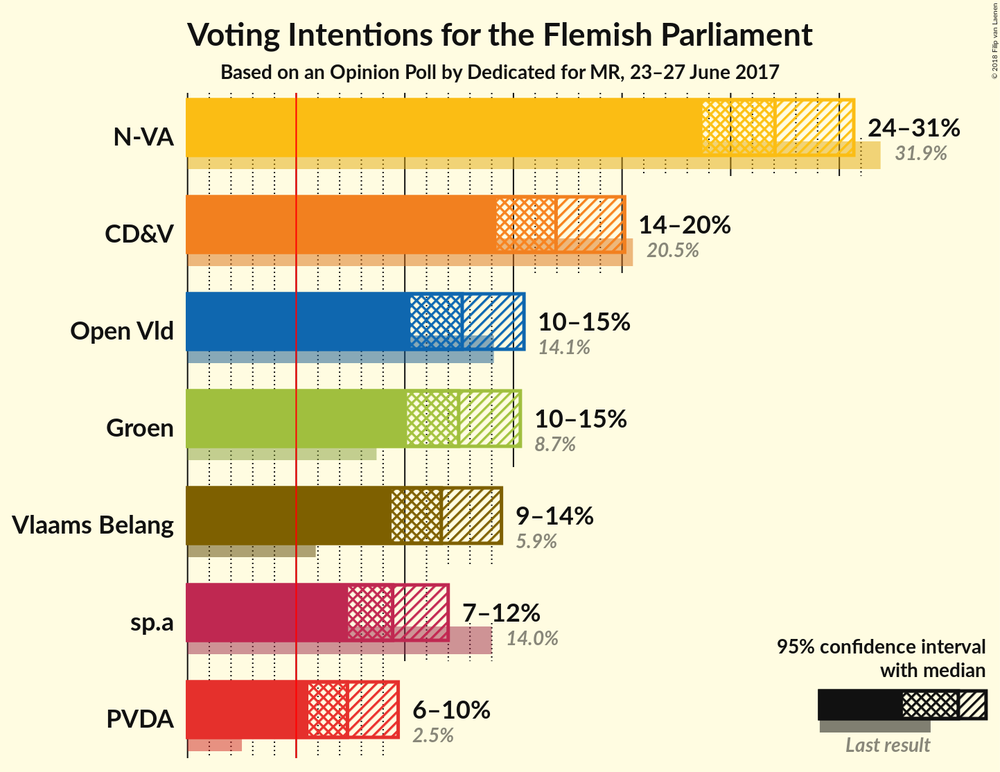
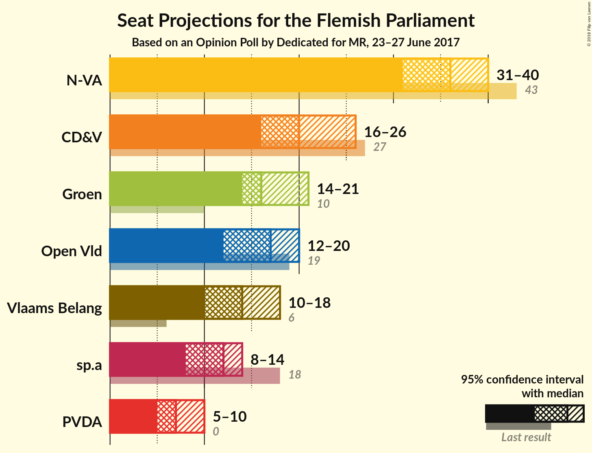
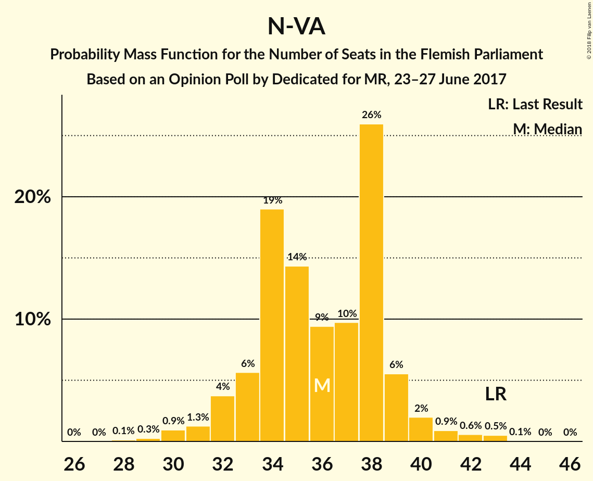
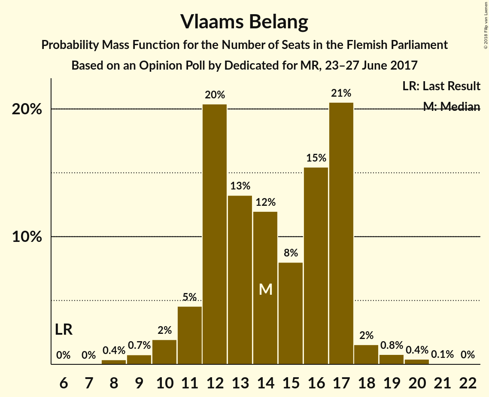
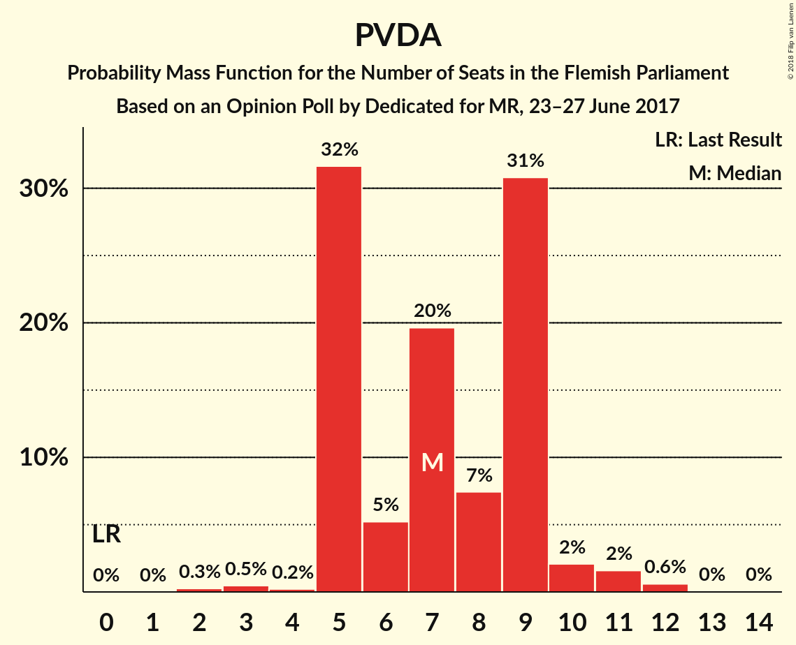

# Opinion Poll by Dedicated for MR, 23–27 June 2017

<a href="#voting-intentions">Voting Intentions</a> | <a href="#seats">Seats</a> | <a href="#coalitions">Coalitions</a> | <a href="#technical-information">Technical Information</a>

## Voting Intentions

### Confidence Intervals

| Party | Last Result | Poll Result | 80% Confidence Interval | 90% Confidence Interval | 95% Confidence Interval | 99% Confidence Interval |
|:-----:|:-----------:|:-----------:|:-----------------------:|:-----------------------:|:-----------------------:|:-----------------------:|
| N-VA | 31.9% | 27.0% | 24.8–29.4% |24.2–30.1% |23.7–30.7% |22.7–31.8% |
| CD&V | 20.5% | 17.0% | 15.2–19.0% |14.6–19.6% |14.2–20.1% |13.4–21.1% |
| Open Vld | 14.1% | 12.6% | 11.1–14.5% |10.6–15.0% |10.3–15.5% |9.6–16.4% |
| Groen | 8.7% | 12.5% | 10.9–14.3% |10.5–14.8% |10.1–15.3% |9.4–16.2% |
| Vlaams Belang | 5.9% | 11.7% | 10.2–13.5% |9.8–14.0% |9.4–14.4% |8.7–15.3% |
| sp.a | 14.0% | 9.4% | 8.1–11.1% |7.7–11.6% |7.4–12.0% |6.8–12.8% |
| PVDA | 2.5% | 7.4% | 6.2–8.9% |5.8–9.3% |5.6–9.7% |5.0–10.5% |

*Note:* The poll result column reflects the actual value used in the calculations. Published results may vary slightly, and in addition be rounded to fewer digits.

## Seats

### Confidence Intervals

| Party | Last Result | Median | 80% Confidence Interval | 90% Confidence Interval | 95% Confidence Interval | 99% Confidence Interval |
|:-----:|:-----------:|:------:|:-----------------------:|:-----------------------:|:-----------------------:|:-----------------------:|
| <a href="#n-va">N-VA</a> | 43 | 36 | 33–38 |32–39 |31–40 |30–43 |
| <a href="#cd&v">CD&V</a> | 27 | 20 | 20–25 |18–25 |16–26 |16–28 |
| <a href="#open-vld">Open Vld</a> | 19 | 17 | 13–19 |13–20 |12–20 |12–22 |
| <a href="#groen">Groen</a> | 10 | 16 | 14–19 |14–20 |14–21 |12–23 |
| <a href="#vlaams-belang">Vlaams Belang</a> | 6 | 14 | 12–17 |11–17 |10–18 |9–20 |
| <a href="#sp.a">sp.a</a> | 18 | 12 | 9–14 |8–14 |8–14 |7–16 |
| <a href="#pvda">PVDA</a> | 0 | 7 | 5–9 |5–9 |5–10 |3–12 |

### N-VA

*For a full overview of the results for this party, see the [N-VA](party-n-va.html) page.*

| Number of Seats | Probability | Accumulated | Special Marks |
|:---------------:|:-----------:|:-----------:|:-------------:|
| 28 | 0.1% | 100% |  |
| 29 | 0.3% | 99.9% |  |
| 30 | 0.9% | 99.6% |  |
| 31 | 1.3% | 98.7% |  |
| 32 | 4% | 97% |  |
| 33 | 6% | 94% |  |
| 34 | 19% | 88% |  |
| 35 | 14% | 69% |  |
| 36 | 9% | 55% | Median |
| 37 | 10% | 45% |  |
| 38 | 26% | 36% |  |
| 39 | 6% | 10% |  |
| 40 | 2% | 4% |  |
| 41 | 0.9% | 2% |  |
| 42 | 0.6% | 1.2% |  |
| 43 | 0.5% | 0.6% | Last Result |
| 44 | 0.1% | 0.1% |  |
| 45 | 0% | 0% |  |

### CD&V

*For a full overview of the results for this party, see the [CD&V](party-cdv.html) page.*

| Number of Seats | Probability | Accumulated | Special Marks |
|:---------------:|:-----------:|:-----------:|:-------------:|
| 15 | 0.3% | 100% |  |
| 16 | 3% | 99.7% |  |
| 17 | 2% | 97% |  |
| 18 | 1.3% | 95% |  |
| 19 | 3% | 94% |  |
| 20 | 44% | 91% | Median |
| 21 | 9% | 47% |  |
| 22 | 9% | 37% |  |
| 23 | 8% | 29% |  |
| 24 | 8% | 20% |  |
| 25 | 7% | 12% |  |
| 26 | 3% | 5% |  |
| 27 | 1.1% | 2% | Last Result |
| 28 | 0.8% | 1.0% |  |
| 29 | 0.2% | 0.2% |  |
| 30 | 0% | 0% |  |

### Open Vld

*For a full overview of the results for this party, see the [Open Vld](party-openvld.html) page.*

| Number of Seats | Probability | Accumulated | Special Marks |
|:---------------:|:-----------:|:-----------:|:-------------:|
| 11 | 0.1% | 100% |  |
| 12 | 5% | 99.9% |  |
| 13 | 13% | 95% |  |
| 14 | 7% | 83% |  |
| 15 | 9% | 75% |  |
| 16 | 11% | 66% |  |
| 17 | 18% | 55% | Median |
| 18 | 15% | 38% |  |
| 19 | 17% | 23% | Last Result |
| 20 | 3% | 5% |  |
| 21 | 0.7% | 2% |  |
| 22 | 0.7% | 1.1% |  |
| 23 | 0.3% | 0.4% |  |
| 24 | 0.1% | 0.1% |  |
| 25 | 0% | 0% |  |

### Groen

*For a full overview of the results for this party, see the [Groen](party-groen.html) page.*

| Number of Seats | Probability | Accumulated | Special Marks |
|:---------------:|:-----------:|:-----------:|:-------------:|
| 10 | 0.1% | 100% | Last Result |
| 11 | 0.2% | 99.9% |  |
| 12 | 0.3% | 99.7% |  |
| 13 | 1.4% | 99.4% |  |
| 14 | 15% | 98% |  |
| 15 | 28% | 83% |  |
| 16 | 8% | 55% | Median |
| 17 | 18% | 47% |  |
| 18 | 17% | 29% |  |
| 19 | 7% | 12% |  |
| 20 | 2% | 6% |  |
| 21 | 1.4% | 3% |  |
| 22 | 0.8% | 2% |  |
| 23 | 1.0% | 1.1% |  |
| 24 | 0% | 0% |  |

### Vlaams Belang

*For a full overview of the results for this party, see the [Vlaams Belang](party-vlaamsbelang.html) page.*

| Number of Seats | Probability | Accumulated | Special Marks |
|:---------------:|:-----------:|:-----------:|:-------------:|
| 6 | 0% | 100% | Last Result |
| 7 | 0% | 100% |  |
| 8 | 0.4% | 100% |  |
| 9 | 0.7% | 99.6% |  |
| 10 | 2% | 98.9% |  |
| 11 | 5% | 97% |  |
| 12 | 20% | 92% |  |
| 13 | 13% | 72% |  |
| 14 | 12% | 59% | Median |
| 15 | 8% | 47% |  |
| 16 | 15% | 39% |  |
| 17 | 21% | 23% |  |
| 18 | 2% | 3% |  |
| 19 | 0.8% | 1.3% |  |
| 20 | 0.4% | 0.5% |  |
| 21 | 0.1% | 0.1% |  |
| 22 | 0% | 0% |  |

### sp.a

*For a full overview of the results for this party, see the [sp.a](party-spa.html) page.*

| Number of Seats | Probability | Accumulated | Special Marks |
|:---------------:|:-----------:|:-----------:|:-------------:|
| 4 | 0.1% | 100% |  |
| 5 | 0.1% | 99.9% |  |
| 6 | 0.1% | 99.9% |  |
| 7 | 0.8% | 99.8% |  |
| 8 | 8% | 99.0% |  |
| 9 | 10% | 91% |  |
| 10 | 23% | 82% |  |
| 11 | 9% | 59% |  |
| 12 | 7% | 51% | Median |
| 13 | 22% | 44% |  |
| 14 | 20% | 21% |  |
| 15 | 0.8% | 2% |  |
| 16 | 0.4% | 0.8% |  |
| 17 | 0.3% | 0.4% |  |
| 18 | 0% | 0.1% | Last Result |
| 19 | 0% | 0% |  |

### PVDA

*For a full overview of the results for this party, see the [PVDA](party-pvda.html) page.*

| Number of Seats | Probability | Accumulated | Special Marks |
|:---------------:|:-----------:|:-----------:|:-------------:|
| 0 | 0% | 100% | Last Result |
| 1 | 0% | 100% |  |
| 2 | 0.3% | 100% |  |
| 3 | 0.5% | 99.7% |  |
| 4 | 0.2% | 99.3% |  |
| 5 | 32% | 99.1% |  |
| 6 | 5% | 67% |  |
| 7 | 20% | 62% | Median |
| 8 | 7% | 43% |  |
| 9 | 31% | 35% |  |
| 10 | 2% | 4% |  |
| 11 | 2% | 2% |  |
| 12 | 0.6% | 0.7% |  |
| 13 | 0% | 0.1% |  |
| 14 | 0% | 0% |  |

## Coalitions

### Confidence Intervals

| Coalition | Last Result | Median | Majority? | 80% Confidence Interval | 90% Confidence Interval | 95% Confidence Interval | 99% Confidence Interval |
|:---------:|:-----------:|:------:|:---------:|:-----------------------:|:-----------------------:|:-----------------------:|:-----------------------:|
| N-VA – CD&V – Open Vld | 89 | 74 | 100% | 70–78 | 69–79 | 67–80 | 65–82 |
| N-VA – CD&V – sp.a | 88 | 68 | 98% | 65–73 | 64–74 | 63–75 | 61–77 |
| CD&V – Open Vld – Groen – sp.a | 74 | 65 | 87% | 62–70 | 60–72 | 59–72 | 57–74 |
| N-VA – CD&V | 70 | 57 | 5% | 54–61 | 53–62 | 52–63 | 50–65 |
| CD&V – Groen – sp.a – PVDA | 55 | 56 | 4% | 52–61 | 51–62 | 50–63 | 48–65 |
| CD&V – Open Vld – Groen | 56 | 54 | 0.8% | 50–58 | 49–59 | 48–61 | 46–63 |
| N-VA – Vlaams Belang | 49 | 50 | 0% | 46–54 | 45–55 | 45–56 | 43–57 |
| CD&V – Open Vld – sp.a | 64 | 49 | 0% | 45–53 | 44–55 | 43–56 | 41–58 |
| CD&V – Groen – sp.a | 55 | 49 | 0% | 45–53 | 44–54 | 43–55 | 41–57 |
| Open Vld – Groen – sp.a | 47 | 44 | 0% | 40–48 | 39–49 | 38–51 | 37–52 |
| CD&V – Open Vld | 46 | 38 | 0% | 34–42 | 33–43 | 32–44 | 30–46 |
| CD&V – sp.a | 45 | 33 | 0% | 29–37 | 28–38 | 28–39 | 25–40 |
| Open Vld – sp.a | 37 | 28 | 0% | 24–31 | 23–33 | 22–33 | 21–34 |

### N-VA – CD&V – Open Vld

| Number of Seats | Probability | Accumulated | Special Marks |
|:---------------:|:-----------:|:-----------:|:-------------:|
| 63 | 0% | 100% | Majority |
| 64 | 0.1% | 99.9% |  |
| 65 | 0.3% | 99.8% |  |
| 66 | 0.8% | 99.5% |  |
| 67 | 1.3% | 98.7% |  |
| 68 | 2% | 97% |  |
| 69 | 4% | 95% |  |
| 70 | 6% | 91% |  |
| 71 | 9% | 85% |  |
| 72 | 12% | 76% |  |
| 73 | 11% | 64% | Median |
| 74 | 13% | 54% |  |
| 75 | 12% | 41% |  |
| 76 | 11% | 29% |  |
| 77 | 8% | 18% |  |
| 78 | 5% | 11% |  |
| 79 | 3% | 6% |  |
| 80 | 1.3% | 3% |  |
| 81 | 0.9% | 2% |  |
| 82 | 0.5% | 0.8% |  |
| 83 | 0.3% | 0.4% |  |
| 84 | 0.1% | 0.1% |  |
| 85 | 0% | 0% |  |
| 86 | 0% | 0% |  |
| 87 | 0% | 0% |  |
| 88 | 0% | 0% |  |
| 89 | 0% | 0% | Last Result |

### N-VA – CD&V – sp.a

| Number of Seats | Probability | Accumulated | Special Marks |
|:---------------:|:-----------:|:-----------:|:-------------:|
| 58 | 0% | 100% |  |
| 59 | 0.1% | 99.9% |  |
| 60 | 0.2% | 99.8% |  |
| 61 | 0.6% | 99.6% |  |
| 62 | 1.2% | 99.0% |  |
| 63 | 2% | 98% | Majority |
| 64 | 4% | 96% |  |
| 65 | 7% | 92% |  |
| 66 | 6% | 84% |  |
| 67 | 10% | 78% |  |
| 68 | 19% | 68% | Median |
| 69 | 11% | 49% |  |
| 70 | 8% | 38% |  |
| 71 | 9% | 30% |  |
| 72 | 8% | 21% |  |
| 73 | 6% | 13% |  |
| 74 | 2% | 7% |  |
| 75 | 2% | 4% |  |
| 76 | 1.4% | 2% |  |
| 77 | 0.4% | 0.7% |  |
| 78 | 0.2% | 0.3% |  |
| 79 | 0.1% | 0.1% |  |
| 80 | 0% | 0% |  |
| 81 | 0% | 0% |  |
| 82 | 0% | 0% |  |
| 83 | 0% | 0% |  |
| 84 | 0% | 0% |  |
| 85 | 0% | 0% |  |
| 86 | 0% | 0% |  |
| 87 | 0% | 0% |  |
| 88 | 0% | 0% | Last Result |

### CD&V – Open Vld – Groen – sp.a

| Number of Seats | Probability | Accumulated | Special Marks |
|:---------------:|:-----------:|:-----------:|:-------------:|
| 56 | 0.1% | 100% |  |
| 57 | 0.4% | 99.9% |  |
| 58 | 2% | 99.5% |  |
| 59 | 3% | 98% |  |
| 60 | 1.5% | 95% |  |
| 61 | 2% | 94% |  |
| 62 | 5% | 92% |  |
| 63 | 9% | 87% | Majority |
| 64 | 15% | 78% |  |
| 65 | 13% | 63% | Median |
| 66 | 12% | 50% |  |
| 67 | 15% | 37% |  |
| 68 | 8% | 22% |  |
| 69 | 4% | 15% |  |
| 70 | 3% | 10% |  |
| 71 | 3% | 8% |  |
| 72 | 3% | 5% |  |
| 73 | 2% | 2% |  |
| 74 | 0.5% | 0.7% | Last Result |
| 75 | 0.1% | 0.2% |  |
| 76 | 0.1% | 0.1% |  |
| 77 | 0% | 0% |  |

### N-VA – CD&V

| Number of Seats | Probability | Accumulated | Special Marks |
|:---------------:|:-----------:|:-----------:|:-------------:|
| 48 | 0.1% | 100% |  |
| 49 | 0.2% | 99.9% |  |
| 50 | 0.5% | 99.6% |  |
| 51 | 0.7% | 99.2% |  |
| 52 | 2% | 98% |  |
| 53 | 3% | 97% |  |
| 54 | 12% | 93% |  |
| 55 | 11% | 82% |  |
| 56 | 10% | 71% | Median |
| 57 | 11% | 60% |  |
| 58 | 18% | 49% |  |
| 59 | 12% | 31% |  |
| 60 | 6% | 20% |  |
| 61 | 4% | 13% |  |
| 62 | 4% | 9% |  |
| 63 | 3% | 5% | Majority |
| 64 | 1.1% | 2% |  |
| 65 | 0.3% | 0.6% |  |
| 66 | 0.1% | 0.2% |  |
| 67 | 0.1% | 0.1% |  |
| 68 | 0% | 0% |  |
| 69 | 0% | 0% |  |
| 70 | 0% | 0% | Last Result |

### CD&V – Groen – sp.a – PVDA

| Number of Seats | Probability | Accumulated | Special Marks |
|:---------------:|:-----------:|:-----------:|:-------------:|
| 46 | 0% | 100% |  |
| 47 | 0.1% | 99.9% |  |
| 48 | 0.4% | 99.8% |  |
| 49 | 0.9% | 99.4% |  |
| 50 | 2% | 98% |  |
| 51 | 3% | 97% |  |
| 52 | 5% | 94% |  |
| 53 | 8% | 89% |  |
| 54 | 11% | 81% |  |
| 55 | 12% | 69% | Last Result, Median |
| 56 | 12% | 58% |  |
| 57 | 12% | 46% |  |
| 58 | 11% | 34% |  |
| 59 | 7% | 23% |  |
| 60 | 6% | 16% |  |
| 61 | 4% | 10% |  |
| 62 | 3% | 7% |  |
| 63 | 2% | 4% | Majority |
| 64 | 0.9% | 1.5% |  |
| 65 | 0.4% | 0.6% |  |
| 66 | 0.2% | 0.3% |  |
| 67 | 0.1% | 0.1% |  |
| 68 | 0% | 0% |  |

### CD&V – Open Vld – Groen

| Number of Seats | Probability | Accumulated | Special Marks |
|:---------------:|:-----------:|:-----------:|:-------------:|
| 44 | 0.1% | 100% |  |
| 45 | 0.3% | 99.9% |  |
| 46 | 0.9% | 99.6% |  |
| 47 | 1.1% | 98.7% |  |
| 48 | 2% | 98% |  |
| 49 | 3% | 96% |  |
| 50 | 4% | 93% |  |
| 51 | 7% | 89% |  |
| 52 | 10% | 81% |  |
| 53 | 13% | 71% | Median |
| 54 | 18% | 58% |  |
| 55 | 11% | 41% |  |
| 56 | 9% | 30% | Last Result |
| 57 | 8% | 21% |  |
| 58 | 4% | 13% |  |
| 59 | 4% | 9% |  |
| 60 | 2% | 5% |  |
| 61 | 1.2% | 3% |  |
| 62 | 0.8% | 2% |  |
| 63 | 0.5% | 0.8% | Majority |
| 64 | 0.2% | 0.3% |  |
| 65 | 0% | 0.1% |  |
| 66 | 0% | 0% |  |

### N-VA – Vlaams Belang

| Number of Seats | Probability | Accumulated | Special Marks |
|:---------------:|:-----------:|:-----------:|:-------------:|
| 40 | 0% | 100% |  |
| 41 | 0.1% | 99.9% |  |
| 42 | 0.2% | 99.9% |  |
| 43 | 0.4% | 99.6% |  |
| 44 | 1.2% | 99.2% |  |
| 45 | 3% | 98% |  |
| 46 | 5% | 95% |  |
| 47 | 7% | 89% |  |
| 48 | 6% | 83% |  |
| 49 | 9% | 77% | Last Result |
| 50 | 19% | 68% | Median |
| 51 | 17% | 48% |  |
| 52 | 12% | 31% |  |
| 53 | 7% | 20% |  |
| 54 | 5% | 12% |  |
| 55 | 4% | 8% |  |
| 56 | 2% | 3% |  |
| 57 | 0.8% | 1.1% |  |
| 58 | 0.2% | 0.4% |  |
| 59 | 0.1% | 0.2% |  |
| 60 | 0% | 0.1% |  |
| 61 | 0% | 0% |  |

### CD&V – Open Vld – sp.a

| Number of Seats | Probability | Accumulated | Special Marks |
|:---------------:|:-----------:|:-----------:|:-------------:|
| 39 | 0% | 100% |  |
| 40 | 0.1% | 99.9% |  |
| 41 | 0.5% | 99.8% |  |
| 42 | 1.4% | 99.3% |  |
| 43 | 3% | 98% |  |
| 44 | 3% | 95% |  |
| 45 | 3% | 92% |  |
| 46 | 4% | 89% |  |
| 47 | 8% | 85% |  |
| 48 | 16% | 78% |  |
| 49 | 18% | 62% | Median |
| 50 | 16% | 44% |  |
| 51 | 9% | 28% |  |
| 52 | 5% | 19% |  |
| 53 | 4% | 13% |  |
| 54 | 3% | 9% |  |
| 55 | 3% | 6% |  |
| 56 | 2% | 3% |  |
| 57 | 0.9% | 1.4% |  |
| 58 | 0.5% | 0.5% |  |
| 59 | 0.1% | 0.1% |  |
| 60 | 0% | 0% |  |
| 61 | 0% | 0% |  |
| 62 | 0% | 0% |  |
| 63 | 0% | 0% | Majority |
| 64 | 0% | 0% | Last Result |

### CD&V – Groen – sp.a

| Number of Seats | Probability | Accumulated | Special Marks |
|:---------------:|:-----------:|:-----------:|:-------------:|
| 39 | 0.1% | 100% |  |
| 40 | 0.1% | 99.9% |  |
| 41 | 0.3% | 99.8% |  |
| 42 | 0.7% | 99.5% |  |
| 43 | 2% | 98.8% |  |
| 44 | 3% | 97% |  |
| 45 | 6% | 94% |  |
| 46 | 9% | 88% |  |
| 47 | 10% | 79% |  |
| 48 | 14% | 68% | Median |
| 49 | 9% | 55% |  |
| 50 | 12% | 45% |  |
| 51 | 9% | 33% |  |
| 52 | 8% | 24% |  |
| 53 | 8% | 16% |  |
| 54 | 4% | 8% |  |
| 55 | 2% | 4% | Last Result |
| 56 | 1.3% | 2% |  |
| 57 | 0.6% | 1.1% |  |
| 58 | 0.3% | 0.4% |  |
| 59 | 0.1% | 0.1% |  |
| 60 | 0% | 0.1% |  |
| 61 | 0% | 0% |  |

### Open Vld – Groen – sp.a

| Number of Seats | Probability | Accumulated | Special Marks |
|:---------------:|:-----------:|:-----------:|:-------------:|
| 34 | 0.1% | 100% |  |
| 35 | 0.1% | 99.9% |  |
| 36 | 0.3% | 99.8% |  |
| 37 | 0.9% | 99.5% |  |
| 38 | 2% | 98.6% |  |
| 39 | 5% | 96% |  |
| 40 | 4% | 92% |  |
| 41 | 6% | 87% |  |
| 42 | 10% | 81% |  |
| 43 | 11% | 71% |  |
| 44 | 15% | 61% |  |
| 45 | 11% | 46% | Median |
| 46 | 9% | 35% |  |
| 47 | 11% | 27% | Last Result |
| 48 | 7% | 15% |  |
| 49 | 4% | 8% |  |
| 50 | 2% | 5% |  |
| 51 | 1.5% | 3% |  |
| 52 | 0.7% | 1.1% |  |
| 53 | 0.2% | 0.4% |  |
| 54 | 0.1% | 0.2% |  |
| 55 | 0% | 0.1% |  |
| 56 | 0% | 0% |  |

### CD&V – Open Vld

| Number of Seats | Probability | Accumulated | Special Marks |
|:---------------:|:-----------:|:-----------:|:-------------:|
| 28 | 0.1% | 100% |  |
| 29 | 0.3% | 99.9% |  |
| 30 | 0.4% | 99.6% |  |
| 31 | 0.7% | 99.2% |  |
| 32 | 2% | 98% |  |
| 33 | 4% | 96% |  |
| 34 | 5% | 92% |  |
| 35 | 7% | 87% |  |
| 36 | 10% | 80% |  |
| 37 | 17% | 70% | Median |
| 38 | 16% | 52% |  |
| 39 | 13% | 36% |  |
| 40 | 7% | 23% |  |
| 41 | 6% | 17% |  |
| 42 | 4% | 11% |  |
| 43 | 3% | 7% |  |
| 44 | 2% | 3% |  |
| 45 | 0.8% | 2% |  |
| 46 | 0.4% | 0.7% | Last Result |
| 47 | 0.3% | 0.3% |  |
| 48 | 0.1% | 0.1% |  |
| 49 | 0% | 0% |  |

### CD&V – sp.a

| Number of Seats | Probability | Accumulated | Special Marks |
|:---------------:|:-----------:|:-----------:|:-------------:|
| 24 | 0.2% | 100% |  |
| 25 | 0.4% | 99.8% |  |
| 26 | 0.7% | 99.4% |  |
| 27 | 1.0% | 98.7% |  |
| 28 | 3% | 98% |  |
| 29 | 7% | 95% |  |
| 30 | 14% | 88% |  |
| 31 | 9% | 74% |  |
| 32 | 8% | 64% | Median |
| 33 | 14% | 57% |  |
| 34 | 17% | 42% |  |
| 35 | 9% | 25% |  |
| 36 | 5% | 17% |  |
| 37 | 5% | 12% |  |
| 38 | 4% | 7% |  |
| 39 | 2% | 3% |  |
| 40 | 0.9% | 1.3% |  |
| 41 | 0.2% | 0.4% |  |
| 42 | 0.1% | 0.1% |  |
| 43 | 0% | 0.1% |  |
| 44 | 0% | 0% |  |
| 45 | 0% | 0% | Last Result |

### Open Vld – sp.a

| Number of Seats | Probability | Accumulated | Special Marks |
|:---------------:|:-----------:|:-----------:|:-------------:|
| 19 | 0% | 100% |  |
| 20 | 0.2% | 99.9% |  |
| 21 | 0.6% | 99.7% |  |
| 22 | 2% | 99.2% |  |
| 23 | 4% | 97% |  |
| 24 | 5% | 93% |  |
| 25 | 7% | 88% |  |
| 26 | 10% | 81% |  |
| 27 | 14% | 71% |  |
| 28 | 16% | 57% |  |
| 29 | 12% | 42% | Median |
| 30 | 12% | 29% |  |
| 31 | 7% | 17% |  |
| 32 | 5% | 10% |  |
| 33 | 4% | 5% |  |
| 34 | 0.9% | 1.3% |  |
| 35 | 0.3% | 0.4% |  |
| 36 | 0.1% | 0.2% |  |
| 37 | 0% | 0.1% | Last Result |
| 38 | 0% | 0% |  |

## Technical Information

### Opinion Poll

+ **Polling firm:** Dedicated
+ **Commissioner(s):** MR
+ **Fieldwork period:** 23–27 June 2017

### Calculations

+ **Sample size:** 625
+ **Simulations done:** 2,097,152
+ **Error estimate:** 0.78%

