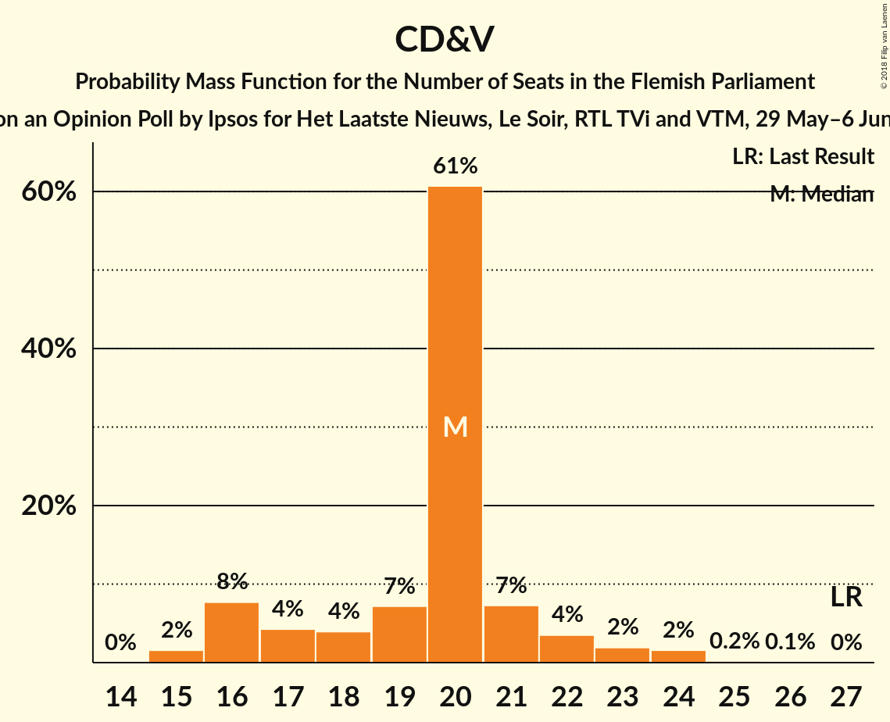
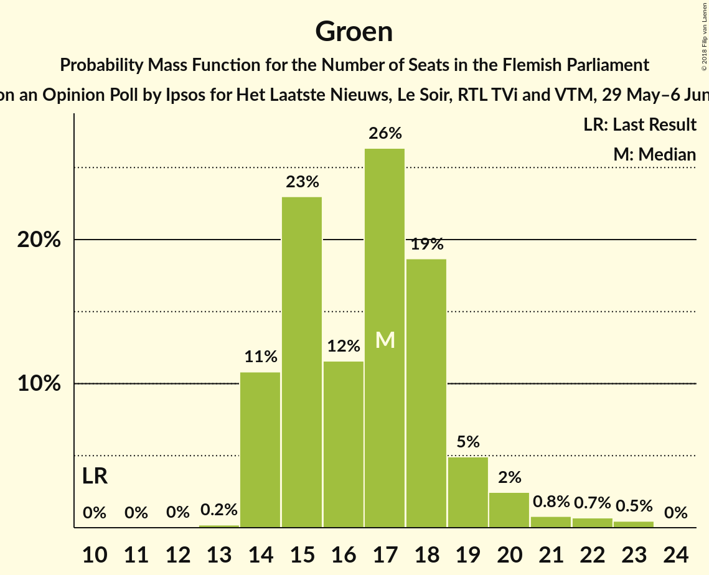

# Opinion Poll by Ipsos for Het Laatste Nieuws, Le Soir, RTL TVi and VTM, 29 May–6 June 2018

<a href="#voting-intentions">Voting Intentions</a> | <a href="#seats">Seats</a> | <a href="#coalitions">Coalitions</a> | <a href="#technical-information">Technical Information</a>

## Voting Intentions

### Confidence Intervals

| Party | Last Result | Poll Result | 80% Confidence Interval | 90% Confidence Interval | 95% Confidence Interval | 99% Confidence Interval |
|:-----:|:-----------:|:-----------:|:-----------------------:|:-----------------------:|:-----------------------:|:-----------------------:|
| N-VA | 31.9% | 26.5% | 24.8–28.3% |24.3–28.9% |23.9–29.3% |23.0–30.2% |
| CD&V | 20.5% | 15.3% | 13.9–16.9% |13.5–17.3% |13.2–17.7% |12.6–18.4% |
| Open Vld | 14.1% | 13.9% | 12.6–15.4% |12.2–15.8% |11.9–16.2% |11.3–16.9% |
| Groen | 8.7% | 12.4% | 11.1–13.8% |10.8–14.2% |10.5–14.6% |9.9–15.3% |
| sp.a | 14.0% | 11.7% | 10.5–13.1% |10.1–13.5% |9.8–13.9% |9.3–14.5% |
| Vlaams Belang | 5.9% | 9.7% | 8.6–11.0% |8.3–11.4% |8.0–11.7% |7.5–12.3% |
| PVDA | 2.5% | 6.2% | 5.3–7.3% |5.1–7.6% |4.9–7.9% |4.5–8.4% |

*Note:* The poll result column reflects the actual value used in the calculations. Published results may vary slightly, and in addition be rounded to fewer digits.

## Seats

### Confidence Intervals

| Party | Last Result | Median | 80% Confidence Interval | 90% Confidence Interval | 95% Confidence Interval | 99% Confidence Interval |
|:-----:|:-----------:|:------:|:-----------------------:|:-----------------------:|:-----------------------:|:-----------------------:|
| <a href="#n-va">N-VA</a> | 43 | 36 | 34–38 |33–39 |32–40 |30–42 |
| <a href="#cd&v">CD&V</a> | 27 | 20 | 17–21 |16–22 |16–23 |15–24 |
| <a href="#open-vld">Open Vld</a> | 19 | 19 | 17–21 |17–22 |16–23 |14–23 |
| <a href="#groen">Groen</a> | 10 | 17 | 14–18 |14–19 |14–20 |14–22 |
| <a href="#sp.a">sp.a</a> | 18 | 14 | 14–17 |14–18 |13–19 |12–19 |
| <a href="#vlaams-belang">Vlaams Belang</a> | 6 | 11 | 9–13 |8–14 |8–15 |8–16 |
| <a href="#pvda">PVDA</a> | 0 | 5 | 4–8 |3–9 |3–9 |2–9 |

### N-VA

*For a full overview of the results for this party, see the [N-VA](party-n-va.html) page.*

| Number of Seats | Probability | Accumulated | Special Marks |
|:---------------:|:-----------:|:-----------:|:-------------:|
| 30 | 0.5% | 100% |  |
| 31 | 0.7% | 99.4% |  |
| 32 | 1.4% | 98.8% |  |
| 33 | 6% | 97% |  |
| 34 | 20% | 92% |  |
| 35 | 16% | 72% |  |
| 36 | 10% | 56% | Median |
| 37 | 13% | 46% |  |
| 38 | 26% | 34% |  |
| 39 | 5% | 8% |  |
| 40 | 2% | 4% |  |
| 41 | 1.1% | 2% |  |
| 42 | 0.5% | 0.7% |  |
| 43 | 0.2% | 0.2% | Last Result |
| 44 | 0% | 0% |  |

### CD&V

*For a full overview of the results for this party, see the [CD&V](party-cdv.html) page.*

| Number of Seats | Probability | Accumulated | Special Marks |
|:---------------:|:-----------:|:-----------:|:-------------:|
| 15 | 2% | 100% |  |
| 16 | 8% | 98% |  |
| 17 | 4% | 91% |  |
| 18 | 4% | 86% |  |
| 19 | 7% | 82% |  |
| 20 | 61% | 75% | Median |
| 21 | 7% | 15% |  |
| 22 | 4% | 7% |  |
| 23 | 2% | 4% |  |
| 24 | 2% | 2% |  |
| 25 | 0.2% | 0.3% |  |
| 26 | 0.1% | 0.1% |  |
| 27 | 0% | 0% | Last Result |

### Open Vld

*For a full overview of the results for this party, see the [Open Vld](party-openvld.html) page.*

| Number of Seats | Probability | Accumulated | Special Marks |
|:---------------:|:-----------:|:-----------:|:-------------:|
| 13 | 0.3% | 100% |  |
| 14 | 0.4% | 99.7% |  |
| 15 | 1.1% | 99.3% |  |
| 16 | 2% | 98% |  |
| 17 | 7% | 96% |  |
| 18 | 19% | 89% |  |
| 19 | 38% | 70% | Last Result, Median |
| 20 | 17% | 32% |  |
| 21 | 6% | 14% |  |
| 22 | 4% | 8% |  |
| 23 | 3% | 4% |  |
| 24 | 0.4% | 0.5% |  |
| 25 | 0.1% | 0.1% |  |
| 26 | 0% | 0% |  |

### Groen

*For a full overview of the results for this party, see the [Groen](party-groen.html) page.*

| Number of Seats | Probability | Accumulated | Special Marks |
|:---------------:|:-----------:|:-----------:|:-------------:|
| 10 | 0% | 100% | Last Result |
| 11 | 0% | 100% |  |
| 12 | 0% | 100% |  |
| 13 | 0.2% | 100% |  |
| 14 | 11% | 99.8% |  |
| 15 | 23% | 89% |  |
| 16 | 12% | 66% |  |
| 17 | 26% | 54% | Median |
| 18 | 19% | 28% |  |
| 19 | 5% | 9% |  |
| 20 | 2% | 4% |  |
| 21 | 0.8% | 2% |  |
| 22 | 0.7% | 1.2% |  |
| 23 | 0.5% | 0.5% |  |
| 24 | 0% | 0% |  |

### sp.a

*For a full overview of the results for this party, see the [sp.a](party-spa.html) page.*

| Number of Seats | Probability | Accumulated | Special Marks |
|:---------------:|:-----------:|:-----------:|:-------------:|
| 10 | 0.3% | 100% |  |
| 11 | 0.2% | 99.7% |  |
| 12 | 0.5% | 99.5% |  |
| 13 | 3% | 99.0% |  |
| 14 | 47% | 96% | Median |
| 15 | 19% | 49% |  |
| 16 | 9% | 31% |  |
| 17 | 14% | 21% |  |
| 18 | 4% | 7% | Last Result |
| 19 | 4% | 4% |  |
| 20 | 0% | 0.1% |  |
| 21 | 0% | 0% |  |

### Vlaams Belang

*For a full overview of the results for this party, see the [Vlaams Belang](party-vlaamsbelang.html) page.*

| Number of Seats | Probability | Accumulated | Special Marks |
|:---------------:|:-----------:|:-----------:|:-------------:|
| 6 | 0% | 100% | Last Result |
| 7 | 0% | 100% |  |
| 8 | 6% | 100% |  |
| 9 | 10% | 94% |  |
| 10 | 13% | 84% |  |
| 11 | 26% | 71% | Median |
| 12 | 31% | 45% |  |
| 13 | 8% | 14% |  |
| 14 | 3% | 6% |  |
| 15 | 1.5% | 3% |  |
| 16 | 1.1% | 1.3% |  |
| 17 | 0.3% | 0.3% |  |
| 18 | 0% | 0% |  |

### PVDA

*For a full overview of the results for this party, see the [PVDA](party-pvda.html) page.*

| Number of Seats | Probability | Accumulated | Special Marks |
|:---------------:|:-----------:|:-----------:|:-------------:|
| 0 | 0% | 100% | Last Result |
| 1 | 0% | 100% |  |
| 2 | 2% | 100% |  |
| 3 | 8% | 98% |  |
| 4 | 2% | 91% |  |
| 5 | 65% | 88% | Median |
| 6 | 5% | 23% |  |
| 7 | 5% | 18% |  |
| 8 | 4% | 12% |  |
| 9 | 9% | 9% |  |
| 10 | 0% | 0.1% |  |
| 11 | 0% | 0% |  |

## Coalitions

### Confidence Intervals

| Coalition | Last Result | Median | Majority? | 80% Confidence Interval | 90% Confidence Interval | 95% Confidence Interval | 99% Confidence Interval |
|:---------:|:-----------:|:------:|:---------:|:-----------------------:|:-----------------------:|:-----------------------:|:-----------------------:|
| N-VA – CD&V – Open Vld | 89 | 75 | 100% | 72–78 | 71–78 | 70–79 | 68–81 |
| N-VA – CD&V – sp.a | 88 | 71 | 100% | 68–74 | 67–74 | 66–75 | 64–76 |
| CD&V – Open Vld – Groen – sp.a | 74 | 70 | 99.9% | 67–73 | 66–74 | 65–75 | 64–76 |
| CD&V – Groen – sp.a – PVDA | 55 | 57 | 0.8% | 53–60 | 53–61 | 52–61 | 50–63 |
| CD&V – Open Vld – Groen | 56 | 55 | 0.1% | 52–58 | 52–59 | 51–60 | 49–61 |
| N-VA – CD&V | 70 | 56 | 0.1% | 53–58 | 52–59 | 51–60 | 49–61 |
| N-VA – Open Vld | 62 | 55 | 0.1% | 52–58 | 51–59 | 51–60 | 49–61 |
| CD&V – Open Vld – sp.a | 64 | 54 | 0% | 51–57 | 50–58 | 49–58 | 47–60 |
| CD&V – Groen – sp.a | 55 | 51 | 0% | 48–54 | 48–55 | 47–56 | 45–57 |
| Open Vld – Groen – sp.a | 47 | 51 | 0% | 48–54 | 47–55 | 46–55 | 45–57 |
| N-VA – Vlaams Belang | 49 | 47 | 0% | 44–50 | 43–51 | 43–52 | 42–54 |
| CD&V – Open Vld | 46 | 39 | 0% | 36–42 | 35–43 | 34–43 | 32–44 |
| CD&V – sp.a | 45 | 34 | 0% | 32–37 | 31–38 | 30–39 | 30–40 |
| Open Vld – sp.a | 37 | 34 | 0% | 32–37 | 31–38 | 30–38 | 29–40 |

### N-VA – CD&V – Open Vld

| Number of Seats | Probability | Accumulated | Special Marks |
|:---------------:|:-----------:|:-----------:|:-------------:|
| 66 | 0.1% | 100% |  |
| 67 | 0.2% | 99.9% |  |
| 68 | 0.5% | 99.7% |  |
| 69 | 1.3% | 99.2% |  |
| 70 | 3% | 98% |  |
| 71 | 4% | 95% |  |
| 72 | 7% | 91% |  |
| 73 | 11% | 84% |  |
| 74 | 18% | 73% |  |
| 75 | 15% | 55% | Median |
| 76 | 13% | 40% |  |
| 77 | 14% | 27% |  |
| 78 | 8% | 13% |  |
| 79 | 3% | 5% |  |
| 80 | 1.4% | 2% |  |
| 81 | 0.5% | 0.7% |  |
| 82 | 0.2% | 0.2% |  |
| 83 | 0% | 0% |  |
| 84 | 0% | 0% |  |
| 85 | 0% | 0% |  |
| 86 | 0% | 0% |  |
| 87 | 0% | 0% |  |
| 88 | 0% | 0% |  |
| 89 | 0% | 0% | Last Result |

### N-VA – CD&V – sp.a

| Number of Seats | Probability | Accumulated | Special Marks |
|:---------------:|:-----------:|:-----------:|:-------------:|
| 63 | 0.1% | 100% | Majority |
| 64 | 0.6% | 99.9% |  |
| 65 | 1.1% | 99.2% |  |
| 66 | 2% | 98% |  |
| 67 | 3% | 96% |  |
| 68 | 12% | 93% |  |
| 69 | 12% | 81% |  |
| 70 | 12% | 69% | Median |
| 71 | 13% | 57% |  |
| 72 | 21% | 44% |  |
| 73 | 13% | 24% |  |
| 74 | 7% | 10% |  |
| 75 | 3% | 4% |  |
| 76 | 0.9% | 1.3% |  |
| 77 | 0.3% | 0.4% |  |
| 78 | 0.1% | 0.1% |  |
| 79 | 0% | 0.1% |  |
| 80 | 0% | 0% |  |
| 81 | 0% | 0% |  |
| 82 | 0% | 0% |  |
| 83 | 0% | 0% |  |
| 84 | 0% | 0% |  |
| 85 | 0% | 0% |  |
| 86 | 0% | 0% |  |
| 87 | 0% | 0% |  |
| 88 | 0% | 0% | Last Result |

### CD&V – Open Vld – Groen – sp.a

| Number of Seats | Probability | Accumulated | Special Marks |
|:---------------:|:-----------:|:-----------:|:-------------:|
| 62 | 0.1% | 100% |  |
| 63 | 0.3% | 99.9% | Majority |
| 64 | 0.8% | 99.6% |  |
| 65 | 1.4% | 98.9% |  |
| 66 | 3% | 97% |  |
| 67 | 6% | 95% |  |
| 68 | 13% | 89% |  |
| 69 | 13% | 76% |  |
| 70 | 15% | 63% | Median |
| 71 | 14% | 49% |  |
| 72 | 18% | 35% |  |
| 73 | 9% | 17% |  |
| 74 | 4% | 8% | Last Result |
| 75 | 3% | 4% |  |
| 76 | 1.1% | 2% |  |
| 77 | 0.3% | 0.4% |  |
| 78 | 0.1% | 0.1% |  |
| 79 | 0% | 0% |  |

### CD&V – Groen – sp.a – PVDA

| Number of Seats | Probability | Accumulated | Special Marks |
|:---------------:|:-----------:|:-----------:|:-------------:|
| 49 | 0.1% | 100% |  |
| 50 | 0.5% | 99.9% |  |
| 51 | 1.1% | 99.4% |  |
| 52 | 1.4% | 98% |  |
| 53 | 8% | 97% |  |
| 54 | 12% | 89% |  |
| 55 | 9% | 77% | Last Result |
| 56 | 15% | 68% | Median |
| 57 | 15% | 53% |  |
| 58 | 15% | 38% |  |
| 59 | 12% | 23% |  |
| 60 | 4% | 11% |  |
| 61 | 4% | 6% |  |
| 62 | 2% | 2% |  |
| 63 | 0.5% | 0.8% | Majority |
| 64 | 0.2% | 0.3% |  |
| 65 | 0.1% | 0.1% |  |
| 66 | 0% | 0% |  |

### CD&V – Open Vld – Groen

| Number of Seats | Probability | Accumulated | Special Marks |
|:---------------:|:-----------:|:-----------:|:-------------:|
| 47 | 0.1% | 100% |  |
| 48 | 0.2% | 99.9% |  |
| 49 | 0.6% | 99.7% |  |
| 50 | 1.4% | 99.1% |  |
| 51 | 2% | 98% |  |
| 52 | 6% | 95% |  |
| 53 | 9% | 90% |  |
| 54 | 18% | 81% |  |
| 55 | 19% | 63% |  |
| 56 | 16% | 44% | Last Result, Median |
| 57 | 11% | 28% |  |
| 58 | 9% | 17% |  |
| 59 | 4% | 8% |  |
| 60 | 2% | 4% |  |
| 61 | 0.9% | 1.2% |  |
| 62 | 0.2% | 0.3% |  |
| 63 | 0.1% | 0.1% | Majority |
| 64 | 0% | 0% |  |

### N-VA – CD&V

| Number of Seats | Probability | Accumulated | Special Marks |
|:---------------:|:-----------:|:-----------:|:-------------:|
| 48 | 0% | 100% |  |
| 49 | 0.6% | 99.9% |  |
| 50 | 2% | 99.3% |  |
| 51 | 2% | 98% |  |
| 52 | 3% | 96% |  |
| 53 | 7% | 92% |  |
| 54 | 18% | 86% |  |
| 55 | 16% | 68% |  |
| 56 | 12% | 52% | Median |
| 57 | 15% | 40% |  |
| 58 | 15% | 25% |  |
| 59 | 6% | 10% |  |
| 60 | 2% | 4% |  |
| 61 | 1.1% | 2% |  |
| 62 | 0.3% | 0.5% |  |
| 63 | 0.1% | 0.1% | Majority |
| 64 | 0% | 0% |  |
| 65 | 0% | 0% |  |
| 66 | 0% | 0% |  |
| 67 | 0% | 0% |  |
| 68 | 0% | 0% |  |
| 69 | 0% | 0% |  |
| 70 | 0% | 0% | Last Result |

### N-VA – Open Vld

| Number of Seats | Probability | Accumulated | Special Marks |
|:---------------:|:-----------:|:-----------:|:-------------:|
| 47 | 0% | 100% |  |
| 48 | 0.3% | 99.9% |  |
| 49 | 0.6% | 99.7% |  |
| 50 | 2% | 99.1% |  |
| 51 | 4% | 98% |  |
| 52 | 6% | 94% |  |
| 53 | 10% | 87% |  |
| 54 | 18% | 77% |  |
| 55 | 14% | 59% | Median |
| 56 | 13% | 45% |  |
| 57 | 16% | 33% |  |
| 58 | 10% | 17% |  |
| 59 | 3% | 7% |  |
| 60 | 2% | 4% |  |
| 61 | 0.7% | 1.2% |  |
| 62 | 0.4% | 0.5% | Last Result |
| 63 | 0.1% | 0.1% | Majority |
| 64 | 0% | 0% |  |

### CD&V – Open Vld – sp.a

| Number of Seats | Probability | Accumulated | Special Marks |
|:---------------:|:-----------:|:-----------:|:-------------:|
| 45 | 0.1% | 100% |  |
| 46 | 0.2% | 99.9% |  |
| 47 | 0.4% | 99.8% |  |
| 48 | 0.8% | 99.4% |  |
| 49 | 3% | 98.6% |  |
| 50 | 5% | 96% |  |
| 51 | 7% | 91% |  |
| 52 | 10% | 84% |  |
| 53 | 21% | 74% | Median |
| 54 | 15% | 53% |  |
| 55 | 15% | 38% |  |
| 56 | 10% | 23% |  |
| 57 | 6% | 13% |  |
| 58 | 5% | 7% |  |
| 59 | 1.2% | 2% |  |
| 60 | 0.4% | 0.6% |  |
| 61 | 0.2% | 0.2% |  |
| 62 | 0% | 0.1% |  |
| 63 | 0% | 0% | Majority |
| 64 | 0% | 0% | Last Result |

### CD&V – Groen – sp.a

| Number of Seats | Probability | Accumulated | Special Marks |
|:---------------:|:-----------:|:-----------:|:-------------:|
| 44 | 0.3% | 100% |  |
| 45 | 0.8% | 99.7% |  |
| 46 | 0.8% | 98.8% |  |
| 47 | 2% | 98% |  |
| 48 | 10% | 96% |  |
| 49 | 12% | 86% |  |
| 50 | 11% | 73% |  |
| 51 | 15% | 63% | Median |
| 52 | 16% | 48% |  |
| 53 | 16% | 32% |  |
| 54 | 10% | 16% |  |
| 55 | 3% | 7% | Last Result |
| 56 | 2% | 3% |  |
| 57 | 1.1% | 1.4% |  |
| 58 | 0.2% | 0.4% |  |
| 59 | 0.1% | 0.2% |  |
| 60 | 0.1% | 0.1% |  |
| 61 | 0% | 0% |  |

### Open Vld – Groen – sp.a

| Number of Seats | Probability | Accumulated | Special Marks |
|:---------------:|:-----------:|:-----------:|:-------------:|
| 43 | 0.1% | 100% |  |
| 44 | 0.3% | 99.9% |  |
| 45 | 0.8% | 99.6% |  |
| 46 | 2% | 98.8% |  |
| 47 | 4% | 97% | Last Result |
| 48 | 13% | 93% |  |
| 49 | 13% | 81% |  |
| 50 | 13% | 68% | Median |
| 51 | 15% | 55% |  |
| 52 | 19% | 40% |  |
| 53 | 10% | 21% |  |
| 54 | 5% | 11% |  |
| 55 | 4% | 6% |  |
| 56 | 1.4% | 2% |  |
| 57 | 0.5% | 0.7% |  |
| 58 | 0.1% | 0.2% |  |
| 59 | 0% | 0.1% |  |
| 60 | 0% | 0% |  |

### N-VA – Vlaams Belang

| Number of Seats | Probability | Accumulated | Special Marks |
|:---------------:|:-----------:|:-----------:|:-------------:|
| 40 | 0.1% | 100% |  |
| 41 | 0.3% | 99.9% |  |
| 42 | 2% | 99.6% |  |
| 43 | 3% | 98% |  |
| 44 | 5% | 95% |  |
| 45 | 11% | 89% |  |
| 46 | 20% | 78% |  |
| 47 | 13% | 58% | Median |
| 48 | 13% | 45% |  |
| 49 | 10% | 31% | Last Result |
| 50 | 13% | 21% |  |
| 51 | 4% | 8% |  |
| 52 | 2% | 3% |  |
| 53 | 0.8% | 1.5% |  |
| 54 | 0.5% | 0.6% |  |
| 55 | 0.1% | 0.2% |  |
| 56 | 0% | 0% |  |

### CD&V – Open Vld

| Number of Seats | Probability | Accumulated | Special Marks |
|:---------------:|:-----------:|:-----------:|:-------------:|
| 30 | 0.1% | 100% |  |
| 31 | 0.1% | 99.9% |  |
| 32 | 0.4% | 99.8% |  |
| 33 | 0.6% | 99.4% |  |
| 34 | 2% | 98.8% |  |
| 35 | 4% | 97% |  |
| 36 | 7% | 93% |  |
| 37 | 10% | 86% |  |
| 38 | 19% | 76% |  |
| 39 | 27% | 58% | Median |
| 40 | 14% | 31% |  |
| 41 | 6% | 16% |  |
| 42 | 5% | 10% |  |
| 43 | 4% | 5% |  |
| 44 | 1.0% | 1.3% |  |
| 45 | 0.2% | 0.2% |  |
| 46 | 0% | 0.1% | Last Result |
| 47 | 0% | 0% |  |

### CD&V – sp.a

| Number of Seats | Probability | Accumulated | Special Marks |
|:---------------:|:-----------:|:-----------:|:-------------:|
| 28 | 0.1% | 100% |  |
| 29 | 0.4% | 99.9% |  |
| 30 | 4% | 99.5% |  |
| 31 | 3% | 95% |  |
| 32 | 4% | 92% |  |
| 33 | 7% | 88% |  |
| 34 | 31% | 81% | Median |
| 35 | 19% | 50% |  |
| 36 | 11% | 30% |  |
| 37 | 11% | 20% |  |
| 38 | 5% | 8% |  |
| 39 | 3% | 3% |  |
| 40 | 0.4% | 0.7% |  |
| 41 | 0.1% | 0.2% |  |
| 42 | 0.1% | 0.1% |  |
| 43 | 0% | 0% |  |
| 44 | 0% | 0% |  |
| 45 | 0% | 0% | Last Result |

### Open Vld – sp.a

| Number of Seats | Probability | Accumulated | Special Marks |
|:---------------:|:-----------:|:-----------:|:-------------:|
| 27 | 0.2% | 100% |  |
| 28 | 0.3% | 99.8% |  |
| 29 | 0.9% | 99.5% |  |
| 30 | 2% | 98.7% |  |
| 31 | 5% | 97% |  |
| 32 | 9% | 92% |  |
| 33 | 26% | 82% | Median |
| 34 | 16% | 57% |  |
| 35 | 15% | 41% |  |
| 36 | 11% | 26% |  |
| 37 | 7% | 14% | Last Result |
| 38 | 5% | 7% |  |
| 39 | 2% | 2% |  |
| 40 | 0.6% | 0.9% |  |
| 41 | 0.2% | 0.3% |  |
| 42 | 0.1% | 0.1% |  |
| 43 | 0% | 0% |  |

## Technical Information

### Opinion Poll

+ **Polling firm:** Ipsos
+ **Commissioner(s):** Het Laatste Nieuws, Le Soir, RTL TVi and VTM
+ **Fieldwork period:** 29 May–6 June 2018

### Calculations

+ **Sample size:** 1000
+ **Simulations done:** 1,048,576
+ **Error estimate:** 1.83%

