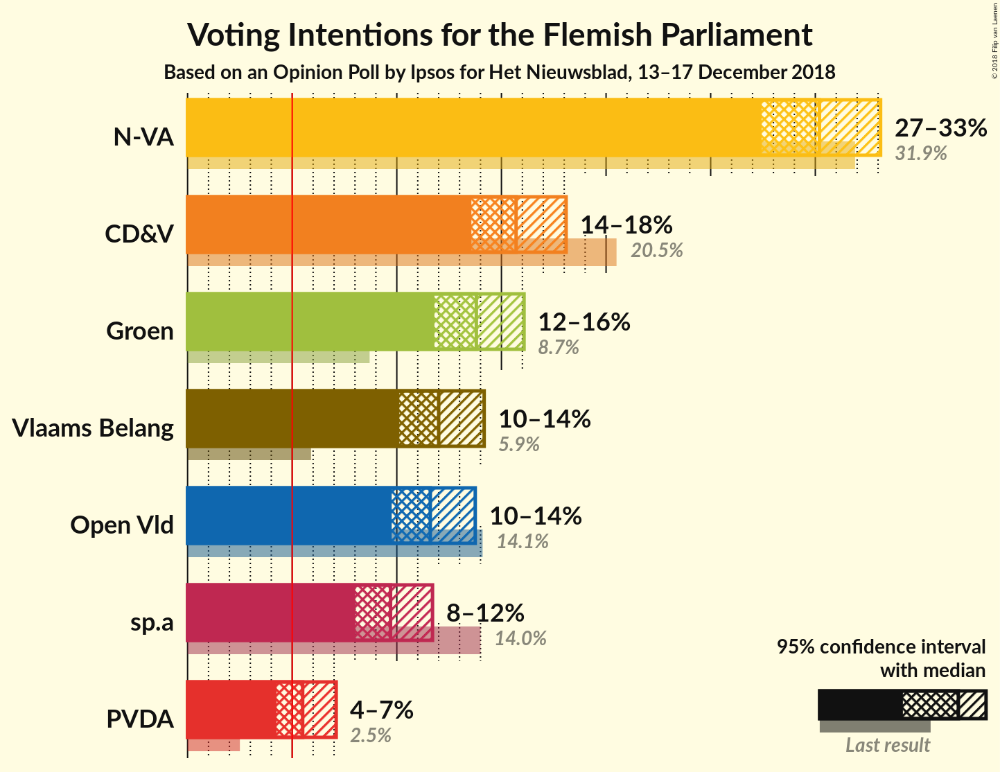
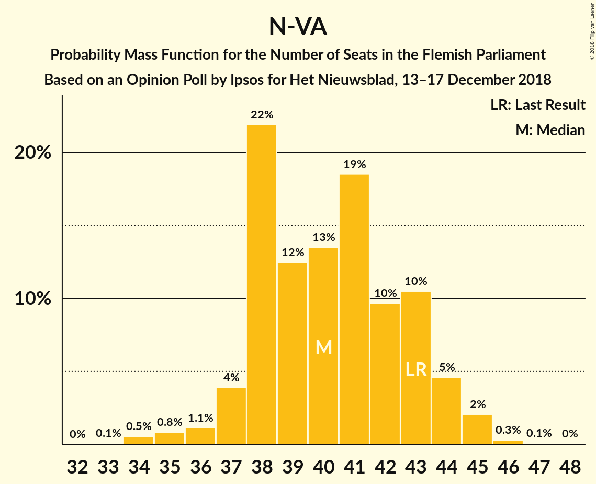
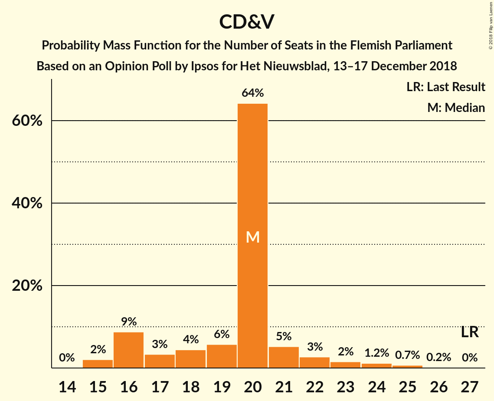
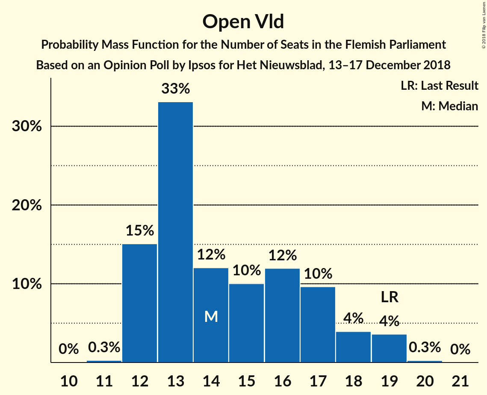
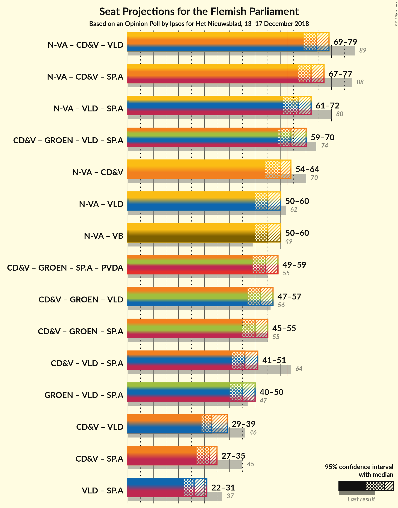

# Opinion Poll by Ipsos for Het Nieuwsblad, 13–17 December 2018

<a href="#voting-intentions">Voting Intentions</a> | <a href="#seats">Seats</a> | <a href="#coalitions">Coalitions</a> | <a href="#technical-information">Technical Information</a>

## Voting Intentions

### Confidence Intervals

| Party | Last Result | Poll Result | 80% Confidence Interval | 90% Confidence Interval | 95% Confidence Interval | 99% Confidence Interval |
|:-----:|:-----------:|:-----------:|:-----------------------:|:-----------------------:|:-----------------------:|:-----------------------:|
| N-VA | 31.9% | 30.2% | 28.4–32.1% |27.9–32.6% |27.4–33.1% |26.6–34.0% |
| CD&V | 20.5% | 15.7% | 14.3–17.3% |13.9–17.7% |13.6–18.1% |12.9–18.9% |
| Groen | 8.7% | 13.8% | 12.5–15.3% |12.1–15.7% |11.8–16.1% |11.2–16.8% |
| Vlaams Belang | 5.9% | 12.0% | 10.8–13.4% |10.4–13.8% |10.1–14.2% |9.6–14.9% |
| Open Vld | 14.1% | 11.6% | 10.4–13.0% |10.0–13.4% |9.8–13.7% |9.2–14.4% |
| sp.a | 14.0% | 9.7% | 8.6–11.0% |8.3–11.4% |8.0–11.7% |7.5–12.3% |
| PVDA | 2.5% | 5.5% | 4.7–6.5% |4.4–6.8% |4.3–7.1% |3.9–7.6% |

*Note:* The poll result column reflects the actual value used in the calculations. Published results may vary slightly, and in addition be rounded to fewer digits.

## Seats

### Confidence Intervals

| Party | Last Result | Median | 80% Confidence Interval | 90% Confidence Interval | 95% Confidence Interval | 99% Confidence Interval |
|:-----:|:-----------:|:------:|:-----------------------:|:-----------------------:|:-----------------------:|:-----------------------:|
| <a href="#n-va">N-VA</a> | 43 | 40 | 38–43 |37–44 |36–44 |34–45 |
| <a href="#cd&v">CD&V</a> | 27 | 20 | 16–21 |16–22 |16–23 |15–25 |
| <a href="#groen">Groen</a> | 10 | 18 | 16–21 |15–23 |15–23 |14–23 |
| <a href="#vlaams-belang">Vlaams Belang</a> | 6 | 15 | 12–17 |12–17 |11–17 |10–19 |
| <a href="#open-vld">Open Vld</a> | 19 | 14 | 12–17 |12–18 |12–19 |12–19 |
| <a href="#sp.a">sp.a</a> | 18 | 13 | 10–14 |9–14 |8–14 |8–15 |
| <a href="#pvda">PVDA</a> | 0 | 4 | 2–5 |2–5 |2–6 |2–9 |

### N-VA

*For a full overview of the results for this party, see the [N-VA](party-n-va.html) page.*

| Number of Seats | Probability | Accumulated | Special Marks |
|:---------------:|:-----------:|:-----------:|:-------------:|
| 33 | 0.1% | 100% |  |
| 34 | 0.5% | 99.9% |  |
| 35 | 0.8% | 99.4% |  |
| 36 | 1.1% | 98.6% |  |
| 37 | 4% | 97% |  |
| 38 | 22% | 94% |  |
| 39 | 12% | 72% |  |
| 40 | 13% | 59% | Median |
| 41 | 19% | 46% |  |
| 42 | 10% | 27% |  |
| 43 | 10% | 18% | Last Result |
| 44 | 5% | 7% |  |
| 45 | 2% | 2% |  |
| 46 | 0.3% | 0.4% |  |
| 47 | 0.1% | 0.1% |  |
| 48 | 0% | 0% |  |

### CD&V

*For a full overview of the results for this party, see the [CD&V](party-cdv.html) page.*

| Number of Seats | Probability | Accumulated | Special Marks |
|:---------------:|:-----------:|:-----------:|:-------------:|
| 15 | 2% | 100% |  |
| 16 | 9% | 98% |  |
| 17 | 3% | 89% |  |
| 18 | 4% | 86% |  |
| 19 | 6% | 81% |  |
| 20 | 64% | 76% | Median |
| 21 | 5% | 11% |  |
| 22 | 3% | 6% |  |
| 23 | 2% | 4% |  |
| 24 | 1.2% | 2% |  |
| 25 | 0.7% | 0.9% |  |
| 26 | 0.2% | 0.2% |  |
| 27 | 0% | 0% | Last Result |

### Groen

*For a full overview of the results for this party, see the [Groen](party-groen.html) page.*

| Number of Seats | Probability | Accumulated | Special Marks |
|:---------------:|:-----------:|:-----------:|:-------------:|
| 10 | 0% | 100% | Last Result |
| 11 | 0% | 100% |  |
| 12 | 0% | 100% |  |
| 13 | 0% | 100% |  |
| 14 | 1.3% | 100% |  |
| 15 | 7% | 98.7% |  |
| 16 | 6% | 92% |  |
| 17 | 18% | 86% |  |
| 18 | 30% | 68% | Median |
| 19 | 19% | 38% |  |
| 20 | 6% | 19% |  |
| 21 | 5% | 13% |  |
| 22 | 3% | 8% |  |
| 23 | 5% | 5% |  |
| 24 | 0.1% | 0.1% |  |
| 25 | 0% | 0% |  |

### Vlaams Belang

*For a full overview of the results for this party, see the [Vlaams Belang](party-vlaamsbelang.html) page.*

| Number of Seats | Probability | Accumulated | Special Marks |
|:---------------:|:-----------:|:-----------:|:-------------:|
| 6 | 0% | 100% | Last Result |
| 7 | 0% | 100% |  |
| 8 | 0% | 100% |  |
| 9 | 0.1% | 100% |  |
| 10 | 0.4% | 99.9% |  |
| 11 | 2% | 99.5% |  |
| 12 | 12% | 97% |  |
| 13 | 16% | 86% |  |
| 14 | 16% | 70% |  |
| 15 | 9% | 54% | Median |
| 16 | 23% | 45% |  |
| 17 | 20% | 22% |  |
| 18 | 1.0% | 2% |  |
| 19 | 0.4% | 0.7% |  |
| 20 | 0.2% | 0.2% |  |
| 21 | 0% | 0% |  |

### Open Vld

*For a full overview of the results for this party, see the [Open Vld](party-openvld.html) page.*

| Number of Seats | Probability | Accumulated | Special Marks |
|:---------------:|:-----------:|:-----------:|:-------------:|
| 11 | 0.3% | 100% |  |
| 12 | 15% | 99.7% |  |
| 13 | 33% | 85% |  |
| 14 | 12% | 51% | Median |
| 15 | 10% | 39% |  |
| 16 | 12% | 29% |  |
| 17 | 10% | 17% |  |
| 18 | 4% | 8% |  |
| 19 | 4% | 4% | Last Result |
| 20 | 0.3% | 0.3% |  |
| 21 | 0% | 0% |  |

### sp.a

*For a full overview of the results for this party, see the [sp.a](party-spa.html) page.*

| Number of Seats | Probability | Accumulated | Special Marks |
|:---------------:|:-----------:|:-----------:|:-------------:|
| 7 | 0.1% | 100% |  |
| 8 | 3% | 99.9% |  |
| 9 | 5% | 97% |  |
| 10 | 21% | 92% |  |
| 11 | 6% | 70% |  |
| 12 | 11% | 64% |  |
| 13 | 31% | 54% | Median |
| 14 | 22% | 23% |  |
| 15 | 0.7% | 1.0% |  |
| 16 | 0.2% | 0.3% |  |
| 17 | 0.1% | 0.1% |  |
| 18 | 0% | 0% | Last Result |

### PVDA

*For a full overview of the results for this party, see the [PVDA](party-pvda.html) page.*

| Number of Seats | Probability | Accumulated | Special Marks |
|:---------------:|:-----------:|:-----------:|:-------------:|
| 0 | 0% | 100% | Last Result |
| 1 | 0.2% | 100% |  |
| 2 | 16% | 99.8% |  |
| 3 | 29% | 84% |  |
| 4 | 7% | 55% | Median |
| 5 | 45% | 48% |  |
| 6 | 1.0% | 3% |  |
| 7 | 1.2% | 2% |  |
| 8 | 0.2% | 0.9% |  |
| 9 | 0.6% | 0.6% |  |
| 10 | 0% | 0% |  |

## Coalitions

### Confidence Intervals

| Coalition | Last Result | Median | Majority? | 80% Confidence Interval | 90% Confidence Interval | 95% Confidence Interval | 99% Confidence Interval |
|:---------:|:-----------:|:------:|:---------:|:-----------------------:|:-----------------------:|:-----------------------:|:-----------------------:|
| N-VA – CD&V – Open Vld | 89 | 74 | 100% | 71–77 | 70–78 | 69–79 | 67–82 |
| N-VA – CD&V – sp.a | 88 | 72 | 99.9% | 68–75 | 67–76 | 67–77 | 65–78 |
| N-VA – Open Vld – sp.a | 80 | 67 | 95% | 63–70 | 62–71 | 61–72 | 60–74 |
| CD&V – Groen – Open Vld – sp.a | 74 | 64 | 74% | 61–68 | 60–69 | 59–70 | 58–71 |
| N-VA – CD&V | 70 | 60 | 14% | 56–63 | 56–64 | 54–64 | 54–66 |
| N-VA – Open Vld | 62 | 55 | 0.3% | 51–57 | 51–59 | 50–60 | 49–62 |
| N-VA – Vlaams Belang | 49 | 55 | 0.1% | 51–58 | 51–59 | 50–60 | 49–61 |
| CD&V – Groen – sp.a – PVDA | 55 | 54 | 0% | 50–57 | 49–58 | 49–59 | 47–60 |
| CD&V – Groen – Open Vld | 56 | 52 | 0% | 49–56 | 48–57 | 47–57 | 45–59 |
| CD&V – Groen – sp.a | 55 | 50 | 0% | 47–53 | 46–54 | 45–55 | 43–57 |
| CD&V – Open Vld – sp.a | 64 | 46 | 0% | 42–49 | 42–50 | 41–51 | 38–53 |
| Groen – Open Vld – sp.a | 47 | 45 | 0% | 41–48 | 40–49 | 40–50 | 38–52 |
| CD&V – Open Vld | 46 | 33 | 0% | 31–37 | 30–38 | 29–39 | 28–40 |
| CD&V – sp.a | 45 | 32 | 0% | 29–34 | 28–34 | 27–35 | 25–37 |
| Open Vld – sp.a | 37 | 26 | 0% | 23–30 | 22–31 | 22–31 | 21–33 |

### N-VA – CD&V – Open Vld

| Number of Seats | Probability | Accumulated | Special Marks |
|:---------------:|:-----------:|:-----------:|:-------------:|
| 66 | 0.1% | 100% |  |
| 67 | 0.6% | 99.8% |  |
| 68 | 0.8% | 99.2% |  |
| 69 | 2% | 98% |  |
| 70 | 4% | 96% |  |
| 71 | 9% | 92% |  |
| 72 | 11% | 84% |  |
| 73 | 13% | 72% |  |
| 74 | 14% | 59% | Median |
| 75 | 17% | 45% |  |
| 76 | 12% | 29% |  |
| 77 | 10% | 17% |  |
| 78 | 3% | 7% |  |
| 79 | 2% | 4% |  |
| 80 | 1.0% | 2% |  |
| 81 | 0.6% | 1.2% |  |
| 82 | 0.5% | 0.6% |  |
| 83 | 0.1% | 0.1% |  |
| 84 | 0% | 0% |  |
| 85 | 0% | 0% |  |
| 86 | 0% | 0% |  |
| 87 | 0% | 0% |  |
| 88 | 0% | 0% |  |
| 89 | 0% | 0% | Last Result |

### N-VA – CD&V – sp.a

| Number of Seats | Probability | Accumulated | Special Marks |
|:---------------:|:-----------:|:-----------:|:-------------:|
| 62 | 0.1% | 100% |  |
| 63 | 0.2% | 99.9% | Majority |
| 64 | 0.2% | 99.7% |  |
| 65 | 0.4% | 99.5% |  |
| 66 | 1.2% | 99.1% |  |
| 67 | 4% | 98% |  |
| 68 | 6% | 94% |  |
| 69 | 8% | 88% |  |
| 70 | 11% | 80% |  |
| 71 | 13% | 69% |  |
| 72 | 15% | 56% |  |
| 73 | 16% | 41% | Median |
| 74 | 10% | 25% |  |
| 75 | 10% | 16% |  |
| 76 | 3% | 6% |  |
| 77 | 2% | 3% |  |
| 78 | 0.6% | 0.9% |  |
| 79 | 0.2% | 0.3% |  |
| 80 | 0.1% | 0.1% |  |
| 81 | 0% | 0% |  |
| 82 | 0% | 0% |  |
| 83 | 0% | 0% |  |
| 84 | 0% | 0% |  |
| 85 | 0% | 0% |  |
| 86 | 0% | 0% |  |
| 87 | 0% | 0% |  |
| 88 | 0% | 0% | Last Result |

### N-VA – Open Vld – sp.a

| Number of Seats | Probability | Accumulated | Special Marks |
|:---------------:|:-----------:|:-----------:|:-------------:|
| 58 | 0.1% | 100% |  |
| 59 | 0.3% | 99.9% |  |
| 60 | 0.9% | 99.6% |  |
| 61 | 1.3% | 98.7% |  |
| 62 | 3% | 97% |  |
| 63 | 7% | 95% | Majority |
| 64 | 9% | 88% |  |
| 65 | 12% | 79% |  |
| 66 | 15% | 68% |  |
| 67 | 17% | 53% | Median |
| 68 | 18% | 36% |  |
| 69 | 7% | 18% |  |
| 70 | 5% | 12% |  |
| 71 | 3% | 6% |  |
| 72 | 2% | 3% |  |
| 73 | 0.8% | 2% |  |
| 74 | 0.3% | 0.7% |  |
| 75 | 0.3% | 0.4% |  |
| 76 | 0.1% | 0.1% |  |
| 77 | 0% | 0% |  |
| 78 | 0% | 0% |  |
| 79 | 0% | 0% |  |
| 80 | 0% | 0% | Last Result |

### CD&V – Groen – Open Vld – sp.a

| Number of Seats | Probability | Accumulated | Special Marks |
|:---------------:|:-----------:|:-----------:|:-------------:|
| 56 | 0.1% | 100% |  |
| 57 | 0.2% | 99.9% |  |
| 58 | 1.4% | 99.7% |  |
| 59 | 2% | 98% |  |
| 60 | 4% | 96% |  |
| 61 | 8% | 91% |  |
| 62 | 10% | 84% |  |
| 63 | 17% | 74% | Majority |
| 64 | 12% | 57% |  |
| 65 | 13% | 45% | Median |
| 66 | 10% | 32% |  |
| 67 | 11% | 21% |  |
| 68 | 5% | 11% |  |
| 69 | 3% | 6% |  |
| 70 | 2% | 3% |  |
| 71 | 0.6% | 0.9% |  |
| 72 | 0.2% | 0.3% |  |
| 73 | 0.1% | 0.1% |  |
| 74 | 0% | 0% | Last Result |

### N-VA – CD&V

| Number of Seats | Probability | Accumulated | Special Marks |
|:---------------:|:-----------:|:-----------:|:-------------:|
| 52 | 0% | 100% |  |
| 53 | 0.3% | 99.9% |  |
| 54 | 2% | 99.6% |  |
| 55 | 2% | 97% |  |
| 56 | 5% | 95% |  |
| 57 | 6% | 90% |  |
| 58 | 14% | 84% |  |
| 59 | 16% | 69% |  |
| 60 | 14% | 53% | Median |
| 61 | 16% | 39% |  |
| 62 | 10% | 24% |  |
| 63 | 8% | 14% | Majority |
| 64 | 4% | 6% |  |
| 65 | 2% | 2% |  |
| 66 | 0.5% | 0.9% |  |
| 67 | 0.2% | 0.4% |  |
| 68 | 0.1% | 0.1% |  |
| 69 | 0% | 0% |  |
| 70 | 0% | 0% | Last Result |

### N-VA – Open Vld

| Number of Seats | Probability | Accumulated | Special Marks |
|:---------------:|:-----------:|:-----------:|:-------------:|
| 47 | 0.1% | 100% |  |
| 48 | 0.3% | 99.8% |  |
| 49 | 0.7% | 99.5% |  |
| 50 | 3% | 98.9% |  |
| 51 | 10% | 96% |  |
| 52 | 9% | 86% |  |
| 53 | 10% | 77% |  |
| 54 | 14% | 67% | Median |
| 55 | 20% | 54% |  |
| 56 | 13% | 34% |  |
| 57 | 12% | 21% |  |
| 58 | 5% | 10% |  |
| 59 | 2% | 5% |  |
| 60 | 1.4% | 3% |  |
| 61 | 0.7% | 2% |  |
| 62 | 0.6% | 0.9% | Last Result |
| 63 | 0.3% | 0.3% | Majority |
| 64 | 0% | 0.1% |  |
| 65 | 0% | 0% |  |

### N-VA – Vlaams Belang

| Number of Seats | Probability | Accumulated | Special Marks |
|:---------------:|:-----------:|:-----------:|:-------------:|
| 47 | 0.1% | 100% |  |
| 48 | 0.3% | 99.8% |  |
| 49 | 1.2% | 99.6% | Last Result |
| 50 | 3% | 98% |  |
| 51 | 7% | 95% |  |
| 52 | 6% | 89% |  |
| 53 | 9% | 82% |  |
| 54 | 14% | 73% |  |
| 55 | 18% | 59% | Median |
| 56 | 12% | 42% |  |
| 57 | 13% | 29% |  |
| 58 | 8% | 16% |  |
| 59 | 5% | 9% |  |
| 60 | 2% | 3% |  |
| 61 | 0.9% | 1.3% |  |
| 62 | 0.4% | 0.5% |  |
| 63 | 0.1% | 0.1% | Majority |
| 64 | 0% | 0% |  |

### CD&V – Groen – sp.a – PVDA

| Number of Seats | Probability | Accumulated | Special Marks |
|:---------------:|:-----------:|:-----------:|:-------------:|
| 45 | 0.1% | 100% |  |
| 46 | 0.2% | 99.9% |  |
| 47 | 0.7% | 99.7% |  |
| 48 | 1.4% | 99.0% |  |
| 49 | 3% | 98% |  |
| 50 | 7% | 95% |  |
| 51 | 8% | 88% |  |
| 52 | 11% | 81% |  |
| 53 | 14% | 69% |  |
| 54 | 16% | 55% |  |
| 55 | 13% | 39% | Last Result, Median |
| 56 | 11% | 26% |  |
| 57 | 7% | 15% |  |
| 58 | 4% | 8% |  |
| 59 | 3% | 4% |  |
| 60 | 1.3% | 2% |  |
| 61 | 0.3% | 0.5% |  |
| 62 | 0.1% | 0.2% |  |
| 63 | 0% | 0% | Majority |

### CD&V – Groen – Open Vld

| Number of Seats | Probability | Accumulated | Special Marks |
|:---------------:|:-----------:|:-----------:|:-------------:|
| 44 | 0.2% | 100% |  |
| 45 | 0.3% | 99.8% |  |
| 46 | 1.0% | 99.5% |  |
| 47 | 3% | 98.5% |  |
| 48 | 4% | 96% |  |
| 49 | 7% | 92% |  |
| 50 | 13% | 85% |  |
| 51 | 17% | 73% |  |
| 52 | 15% | 55% | Median |
| 53 | 10% | 40% |  |
| 54 | 9% | 31% |  |
| 55 | 8% | 22% |  |
| 56 | 7% | 14% | Last Result |
| 57 | 5% | 7% |  |
| 58 | 1.2% | 2% |  |
| 59 | 0.8% | 1.2% |  |
| 60 | 0.3% | 0.4% |  |
| 61 | 0.1% | 0.2% |  |
| 62 | 0% | 0.1% |  |
| 63 | 0% | 0% | Majority |

### CD&V – Groen – sp.a

| Number of Seats | Probability | Accumulated | Special Marks |
|:---------------:|:-----------:|:-----------:|:-------------:|
| 41 | 0% | 100% |  |
| 42 | 0.3% | 99.9% |  |
| 43 | 0.4% | 99.6% |  |
| 44 | 1.0% | 99.2% |  |
| 45 | 3% | 98% |  |
| 46 | 5% | 95% |  |
| 47 | 8% | 90% |  |
| 48 | 13% | 82% |  |
| 49 | 14% | 69% |  |
| 50 | 15% | 55% |  |
| 51 | 12% | 39% | Median |
| 52 | 11% | 28% |  |
| 53 | 9% | 17% |  |
| 54 | 4% | 8% |  |
| 55 | 2% | 4% | Last Result |
| 56 | 0.8% | 1.4% |  |
| 57 | 0.5% | 0.6% |  |
| 58 | 0.1% | 0.1% |  |
| 59 | 0% | 0% |  |

### CD&V – Open Vld – sp.a

| Number of Seats | Probability | Accumulated | Special Marks |
|:---------------:|:-----------:|:-----------:|:-------------:|
| 37 | 0.1% | 100% |  |
| 38 | 0.4% | 99.8% |  |
| 39 | 0.4% | 99.5% |  |
| 40 | 0.9% | 99.1% |  |
| 41 | 3% | 98% |  |
| 42 | 6% | 96% |  |
| 43 | 7% | 90% |  |
| 44 | 9% | 83% |  |
| 45 | 16% | 74% |  |
| 46 | 19% | 58% |  |
| 47 | 14% | 39% | Median |
| 48 | 11% | 25% |  |
| 49 | 6% | 14% |  |
| 50 | 4% | 8% |  |
| 51 | 2% | 4% |  |
| 52 | 0.7% | 2% |  |
| 53 | 0.8% | 0.9% |  |
| 54 | 0.1% | 0.2% |  |
| 55 | 0% | 0% |  |
| 56 | 0% | 0% |  |
| 57 | 0% | 0% |  |
| 58 | 0% | 0% |  |
| 59 | 0% | 0% |  |
| 60 | 0% | 0% |  |
| 61 | 0% | 0% |  |
| 62 | 0% | 0% |  |
| 63 | 0% | 0% | Majority |
| 64 | 0% | 0% | Last Result |

### Groen – Open Vld – sp.a

| Number of Seats | Probability | Accumulated | Special Marks |
|:---------------:|:-----------:|:-----------:|:-------------:|
| 37 | 0.1% | 100% |  |
| 38 | 0.8% | 99.9% |  |
| 39 | 0.9% | 99.1% |  |
| 40 | 4% | 98% |  |
| 41 | 7% | 94% |  |
| 42 | 10% | 87% |  |
| 43 | 16% | 78% |  |
| 44 | 10% | 62% |  |
| 45 | 13% | 52% | Median |
| 46 | 13% | 39% |  |
| 47 | 12% | 26% | Last Result |
| 48 | 7% | 14% |  |
| 49 | 3% | 7% |  |
| 50 | 2% | 4% |  |
| 51 | 1.2% | 2% |  |
| 52 | 0.6% | 1.0% |  |
| 53 | 0.3% | 0.4% |  |
| 54 | 0% | 0.1% |  |
| 55 | 0% | 0% |  |

### CD&V – Open Vld

| Number of Seats | Probability | Accumulated | Special Marks |
|:---------------:|:-----------:|:-----------:|:-------------:|
| 27 | 0.1% | 100% |  |
| 28 | 1.3% | 99.9% |  |
| 29 | 3% | 98.5% |  |
| 30 | 3% | 95% |  |
| 31 | 4% | 93% |  |
| 32 | 14% | 89% |  |
| 33 | 26% | 75% |  |
| 34 | 13% | 49% | Median |
| 35 | 11% | 36% |  |
| 36 | 10% | 25% |  |
| 37 | 8% | 15% |  |
| 38 | 3% | 7% |  |
| 39 | 3% | 4% |  |
| 40 | 0.6% | 0.9% |  |
| 41 | 0.2% | 0.3% |  |
| 42 | 0.1% | 0.1% |  |
| 43 | 0% | 0.1% |  |
| 44 | 0% | 0% |  |
| 45 | 0% | 0% |  |
| 46 | 0% | 0% | Last Result |

### CD&V – sp.a

| Number of Seats | Probability | Accumulated | Special Marks |
|:---------------:|:-----------:|:-----------:|:-------------:|
| 24 | 0.5% | 100% |  |
| 25 | 0.9% | 99.5% |  |
| 26 | 0.9% | 98.6% |  |
| 27 | 1.3% | 98% |  |
| 28 | 4% | 96% |  |
| 29 | 9% | 92% |  |
| 30 | 21% | 83% |  |
| 31 | 9% | 62% |  |
| 32 | 12% | 53% |  |
| 33 | 18% | 41% | Median |
| 34 | 18% | 23% |  |
| 35 | 3% | 5% |  |
| 36 | 1.2% | 2% |  |
| 37 | 0.5% | 1.0% |  |
| 38 | 0.3% | 0.4% |  |
| 39 | 0.1% | 0.1% |  |
| 40 | 0% | 0% |  |
| 41 | 0% | 0% |  |
| 42 | 0% | 0% |  |
| 43 | 0% | 0% |  |
| 44 | 0% | 0% |  |
| 45 | 0% | 0% | Last Result |

### Open Vld – sp.a

| Number of Seats | Probability | Accumulated | Special Marks |
|:---------------:|:-----------:|:-----------:|:-------------:|
| 20 | 0.4% | 100% |  |
| 21 | 1.2% | 99.5% |  |
| 22 | 4% | 98% |  |
| 23 | 5% | 94% |  |
| 24 | 7% | 89% |  |
| 25 | 18% | 81% |  |
| 26 | 20% | 64% |  |
| 27 | 14% | 43% | Median |
| 28 | 11% | 29% |  |
| 29 | 7% | 18% |  |
| 30 | 6% | 11% |  |
| 31 | 3% | 5% |  |
| 32 | 1.3% | 2% |  |
| 33 | 0.8% | 0.9% |  |
| 34 | 0.1% | 0.1% |  |
| 35 | 0% | 0% |  |
| 36 | 0% | 0% |  |
| 37 | 0% | 0% | Last Result |

## Technical Information

### Opinion Poll

+ **Polling firm:** Ipsos
+ **Commissioner(s):** Het Nieuwsblad
+ **Fieldwork period:** 13–17 December 2018

### Calculations

+ **Sample size:** 1000
+ **Simulations done:** 1,048,576
+ **Error estimate:** 1.31%

